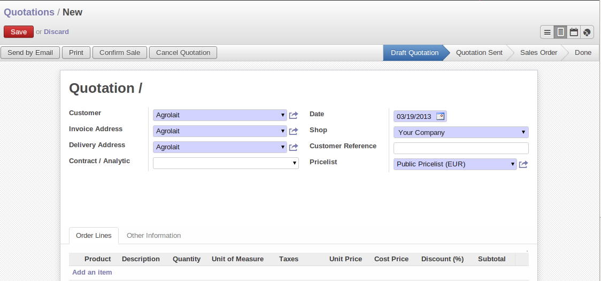
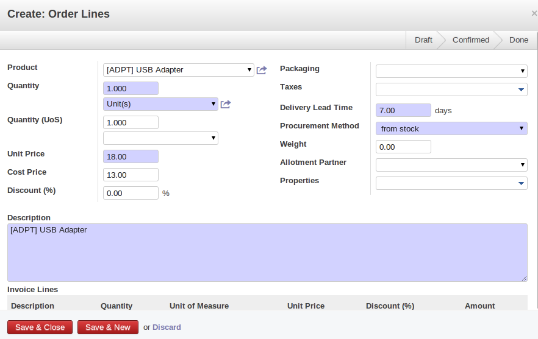
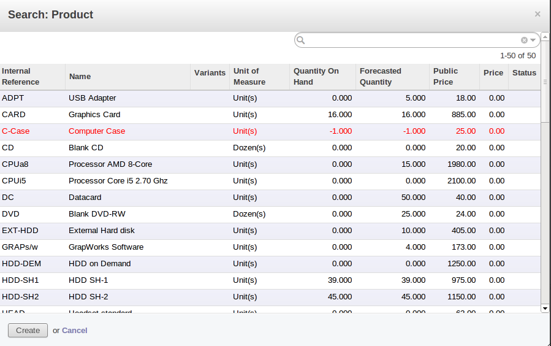
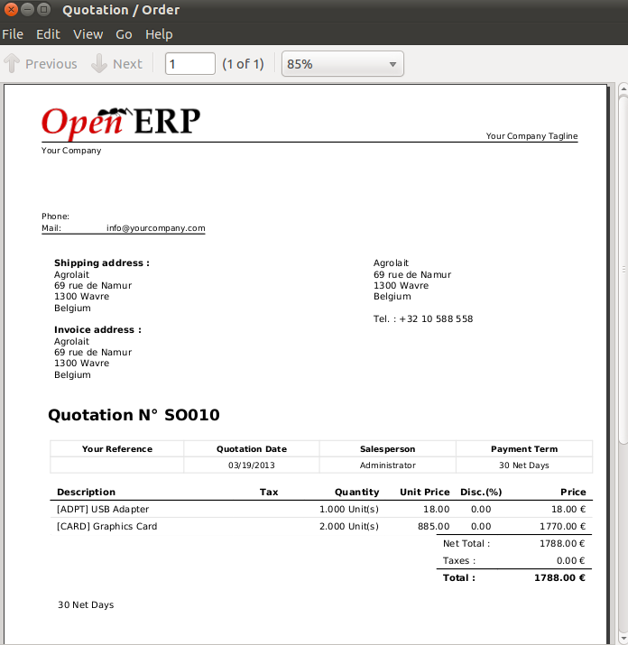
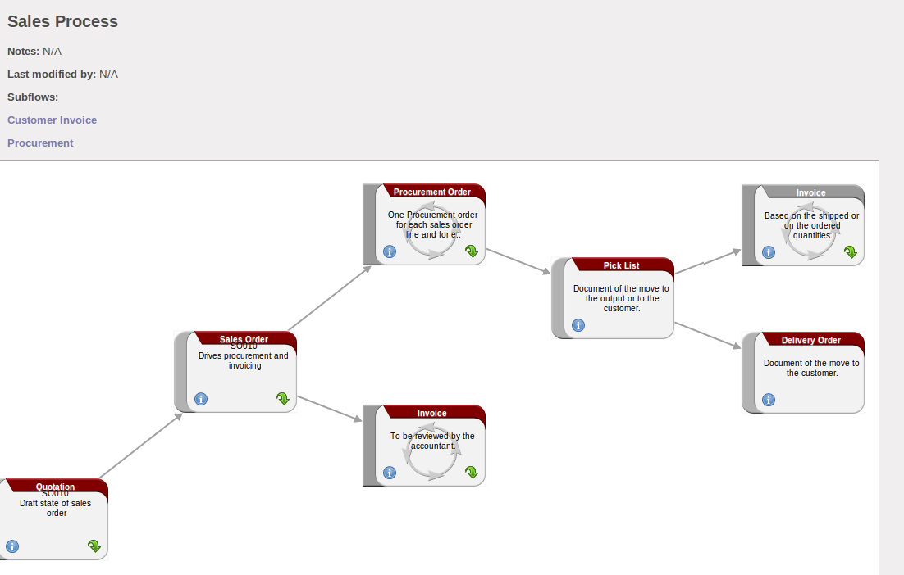

Managing your Sales Quotations
==============================

In OpenERP, now a quotation and an order are handled in the different menu. You can consider an order to be a quotation that has evolved, because it has been confirmed by the
customer. Or, conversely, that a quotation is an order that has not been validated or cancelled yet.
Your quotations can be opened using the menu :menuselection:`Sales --> Sales --> Quotations`.

To enter details of a new quotation, you can use the menu :menuselection:`Sales --> Sales --> Quotations` and then select :guilabel:`Create`. OpenERP opens a new window
allowing you to enter data into a new blank quotation form. You can also create a quotation directly from an opportunity, as explained in a previous chapter.

   *New Quotation*

Some information is automatically specified by the system:

* an internal reference for the quotation or order,

* the sales point that the order will be delivered from,

* the order date,

* the pricelist for the current Quotation.

You can modify any of that information before validating the quotation. The customer
reference is shown in the right side. This optional field is for the customer's own reference –
if the customer does not supply one, just leave it empty.

In new quotation form ,start by entering the customer name, by selecting the correct customer from the list of customers in the system. 
From the quotation, you can create a new customer.

Once the customer name has been selected, different fields of the order are completed
automatically, based on the configuration of that customer:

* :guilabel:`Delivery Address` : address used on the delivery order. By default, OpenERP proposes
  the delivery address from the partner form. If no specific delivery address is defined, the default
  address will be used instead.

* :guilabel:`Invoice Address` : address used to send the invoice to the customer. By default, OpenERP
  proposes the address labelled :guilabel:`Invoice` from the partner form. If no specific invoice address is defined, the default
  address will be used instead.

* :guilabel:`Invoice Type` : available in :guilabel:`Other Information` tab, shows the invoice type(daily/monthly), if configure for that selected customer.

* :guilabel:`Payment Term` : also available in the :guilabel:`Other Information` tab, it shows the payment
  method that the customer will follow, for example ``30 Days End of Month``.

You can modify any of these fields on the order as you go.

You can also set an analytic account for your order. This account will be used during invoicing
to generate accounting entries corresponding to the invoice automatically. This is extremely useful
for assigning revenues to the project or case specified by this order.

.. tip::  Analytic Accounts

   If you are managing by task, the analytic account to be selected is the one that corresponds to
   the project for the order.
   The sales carried out by the order can be allocated to the project so that profitability
   calculations can be made.

Once the information has been entered, you can enter data for the order lines in :guilabel:`Order Lines` tab .

   *Entering a New Sales Order Line*

First of all, select the product that is to be sold to the customer. OpenERP shows some
useful information in the list of products to help you making a sales quotation:

* :guilabel:`Quality On Hand` : physically present in your warehouses. This value depends on the Shop (sales
  point) selected in the order header. Different shops can be linked to different warehouses,
  giving different stock levels, or can use the same warehouse.

* :guilabel:`Forecasted Quantity` : shows a salesperson the quantity that can be sold, taking into account
  both stock reserved for other orders and the number of products planned to arrive in the short term.

* :guilabel:`Public Price` : the basic sales price for the given product. It provides a basis for the
  salesperson to be able to judge whether to offer a discount to the customer, and how much the
  discount should be.

   *Selecting a Product in a Sales Order Line*

Once the product to be sold to the customer has been selected, OpenERP automatically
completes all the other required fields: quantity, unit of measure, description, unit price,
discount, procurement method, lead times and applicable taxes. All of this information comes from
the product form.

.. index::
   single: module; product_visible_discount

.. tip:: Visible Discount

   If a discounted price is taken from a price list, by default that figure is shown as the
   sales price to the customer. He will see a discount of 0% along with the unit price that is different
   from the list price.
   If you install the module :mod:`product_visible_discount` from ``extra-addons``,
   you can configure whether you want to make the discount
   explicitly visible in an order form as a percentage difference from the list price,
   or just show a reduced unit price as in the default configuration.

.. note:: One-off Sales

   If a product is sold to a customer only once, you do not have to create a completely new
   product form just for that sale.
   You can manually complete all the information in the order without actually creating a product:
   description, price, quantity, lead time, taxes.
   In this case, OpenERP will not generate a delivery note because the a pure description is not a product, and so it is not in stock.

When all of the products are entered, you can print the quotation by clicking :guilabel:`Print` button on the form. 

OpenERP opens the quotation in PDF to enable to you to check it before printing.

   *Printing a Sales Quotation*

Also you can send it to the customer by clicking :guilabel:`Send by Email` button on the form . After sending email , state will be change to ``Quotation Sent`` 

.. figure:: images/quotation_sent.png
   :scale: 75
   :align: center

   *Order after sending an e-mail in Quotation Sent state*

When the order is confirmed by the customer, you can confirm the quotation to turn in into a sales order. You can also just cancel the window without confirming the order to leave it in Draft Quotation state. 
To see all the current quotations, you can use the menu Sales ‣ Sales ‣ Quotation. (But Quotations menu contains only those Quotations which are in ``Draft Quotation`` and ``Quotation Sent`` state)

The process of Sale Order is like ,following figure.

   *Process View for a Sales order*

.. Copyright © Open Object Press. All rights reserved.

.. You may take electronic copy of this publication and distribute it if you don't
.. change the content. You can also print a copy to be read by yourself only.

.. We have contracts with different publishers in different countries to sell and
.. distribute paper or electronic based versions of this book (translated or not)
.. in bookstores. This helps to distribute and promote the OpenERP product. It
.. also helps us to create incentives to pay contributors and authors using author
.. rights of these sales.

.. Due to this, grants to translate, modify or sell this book are strictly
.. forbidden, unless Tiny SPRL (representing Open Object Press) gives you a
.. written authorisation for this.

.. Many of the designations used by manufacturers and suppliers to distinguish their
.. products are claimed as trademarks. Where those designations appear in this book,
.. and Open Object Press was aware of a trademark claim, the designations have been
.. printed in initial capitals.

.. While every precaution has been taken in the preparation of this book, the publisher
.. and the authors assume no responsibility for errors or omissions, or for damages
.. resulting from the use of the information contained herein.

.. Published by Open Object Press, Grand Rosière, Belgium
