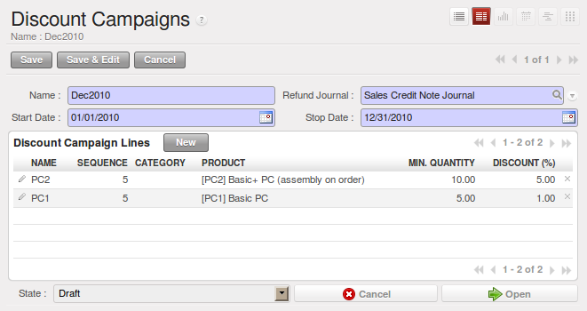

Rebates at the End of a Campaign
================================

If you want to provide discounts on an order, use the pricelist system in OpenERP. But it is better
to work with end-of-campaign rebates or year-end rebates. In this case, the customer pays a certain
price for the whole of the campaign or the year and a rebate is returned to him at the end of the
campaign that depends on the sales he has made throughout the year.

Take the case of a contract negotiations with a wholesaler. To get the best selling price, the
wholesaler will ask you for a good deal and will sign up to a certain volume of orders over
the year.

You can then propose a price based on the volume that the wholesaler agrees to sell. But then you
do not have any control over his orders. If at the end of the year the wholesaler has not taken the
agreed volumes then you can do nothing. At most you can review his terms for the following year.

Rebates at the end of a campaign can help you avoid this sort of problem. You can propose a contract
where the price is dependent on the usual wholesaler's terms. You can propose a rebate grid which
will be assigned at the end of the year as a function of the actual sales made.

.. index::
   single: module; discount_campaign

Install the :mod:`discount_campaign` module (in ``extra-addons`` at the time of writing)
to generate rebates at the end of the campaign. Once
the modules have been installed you can configure your campaign using the menu :menuselection:`Sales
--> Configuration --> Sales --> Discount Campaigns`.

.. note:: Year-end Rebate

   Most companies use the term *year-end rebate*, where rebates are applied at the end of the year.
   But if you are using rebates at the end of a campaign,
   this would only actually be the case if the campaign lasts exactly one year.

   *Configuring a year-end rebate*

A campaign must have a name, a refund journal, a start date, and an end date. After entering this information, you
should describe the lines of the campaign. Each line can be applied to a product or a category of
products. Then set the quantity of products sold from which the discount is applied, and the amount
of the rebate as a percentage of the actual sales volume.

When you have defined the campaign, you can activate it by clicking the :guilabel:`Open` button. The
figure :ref:`fig-discamp` shows a campaign with a rebate on computers which is between 10% and 20% depending on
the sales volume.

.. _fig-discamp:

.. figure:: images/discount_campaign.png
   :scale: 75
   :align: center

   *Configuring a discount campaign for computers*

Once the campaign has been defined and activated, you can assign it to various partners. To do that
set a :guilabel:`Discount Campaign` in the second tab :guilabel:`Sales & Purchases` of the partner form.

Finally, at the end of the campaign, you should close it and OpenERP will automatically generate
invoices or credit notes for your partner associated with this campaign. OpenERP opens credit
notes in the ``Draft`` state that you can modify before validating them. To calculate the amount on the
credit note, OpenERP uses all of the invoices sent out during the period of the campaign as its
basis.

You can also reach all of the draft credit notes using the menu :menuselection:`Accounting
--> Customers --> Customer Refunds`.

.. Copyright © Open Object Press. All rights reserved.

.. You may take electronic copy of this publication and distribute it if you don't
.. change the content. You can also print a copy to be read by yourself only.

.. We have contracts with different publishers in different countries to sell and
.. distribute paper or electronic based versions of this book (translated or not)
.. in bookstores. This helps to distribute and promote the OpenERP product. It
.. also helps us to create incentives to pay contributors and authors using author
.. rights of these sales.

.. Due to this, grants to translate, modify or sell this book are strictly
.. forbidden, unless Tiny SPRL (representing Open Object Press) gives you a
.. written authorisation for this.

.. Many of the designations used by manufacturers and suppliers to distinguish their
.. products are claimed as trademarks. Where those designations appear in this book,
.. and Open Object Press was aware of a trademark claim, the designations have been
.. printed in initial capitals.

.. While every precaution has been taken in the preparation of this book, the publisher
.. and the authors assume no responsibility for errors or omissions, or for damages
.. resulting from the use of the information contained herein.

.. Published by Open Object Press, Grand Rosière, Belgium
