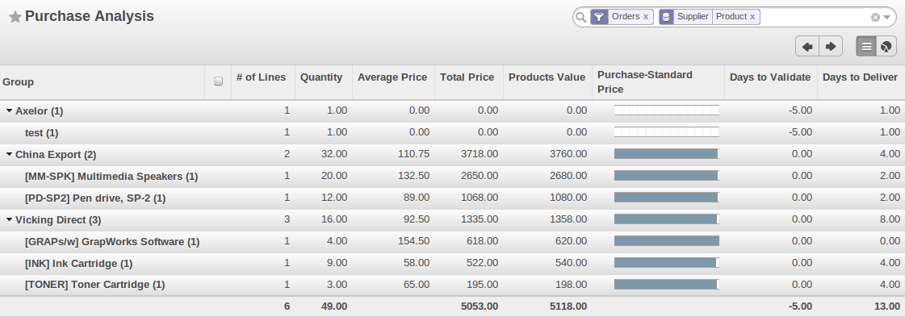

Purchase Analysis
=================

Elementary Statistics
---------------------

.. index::
   single: module; product_margin

OpenERP enables you to perform analysis of purchases by period (current year, current month,
previous month), by state (quotations, orders), supplier, user, product, category, warehouse
and so on. This is made possible through a search view accessed through the
menu :menuselection:`Purchases --> Reporting --> Purchase Analysis`.

   *Analysis of Purchases over the Month by Product*

This analysis is carried out on supplier orders and not on invoices or the quantities actually
received. To get an analysis by product, use the module :mod:`product_margin`. The function of this
module is described in detail in the chapter :ref:`ch-sales`.

To analyze the received quantities, you can use the statistical reports in Warehouse.

.. Copyright © Open Object Press. All rights reserved.

.. You may take electronic copy of this publication and distribute it if you don't
.. change the content. You can also print a copy to be read by yourself only.

.. We have contracts with different publishers in different countries to sell and
.. distribute paper or electronic based versions of this book (translated or not)
.. in bookstores. This helps to distribute and promote the OpenERP product. It
.. also helps us to create incentives to pay contributors and authors using author
.. rights of these sales.

.. Due to this, grants to translate, modify or sell this book are strictly
.. forbidden, unless Tiny SPRL (representing Open Object Press) gives you a
.. written authorisation for this.

.. Many of the designations used by manufacturers and suppliers to distinguish their
.. products are claimed as trademarks. Where those designations appear in this book,
.. and Open Object Press was aware of a trademark claim, the designations have been
.. printed in initial capitals.

.. While every precaution has been taken in the preparation of this book, the publisher
.. and the authors assume no responsibility for errors or omissions, or for damages
.. resulting from the use of the information contained herein.

.. Published by Open Object Press, Grand Rosière, Belgium
