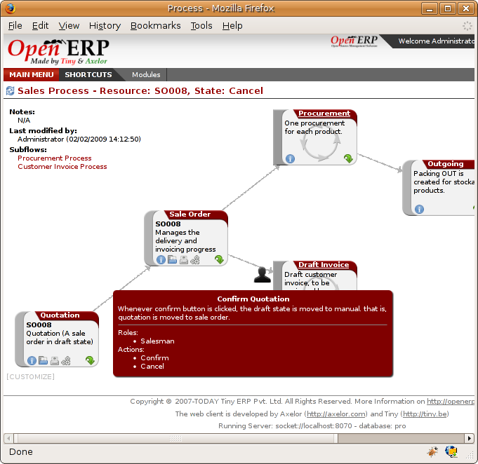
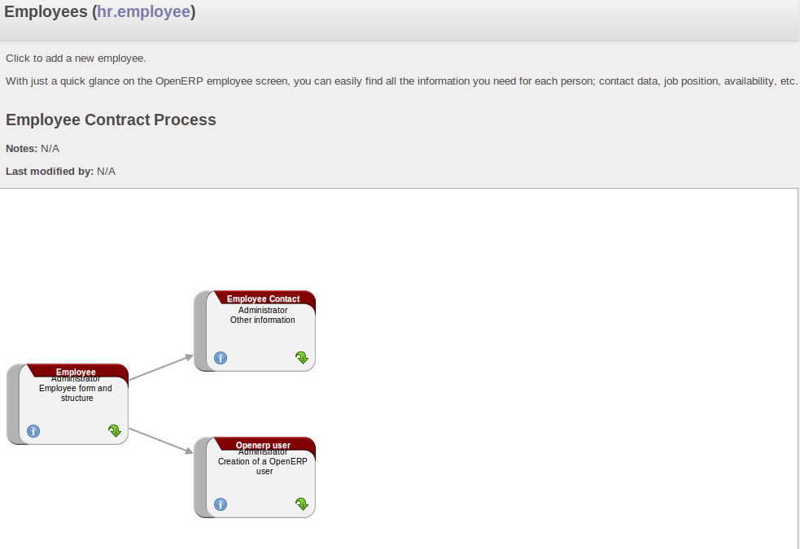

.. index::
   single: process integration
   
The integration of processes into the management system
=======================================================

Processes are at the heart of a company: they form a structure for all
activities that enable the company to function effectively. A company's human
dimension is often disconnected from its processes at the moment, preventing
individual employees' aspirations from being directed towards a collective
objective.

From a mapping process, integrating management and the changing needs of each
employee becomes very useful for the fulfillment of each. Based on that, each
employee becomes aware of his own personal contribution to the company's value
chain. This representation also helps an employee's own personal management
because it shows his place and his role in the overall process, very often over
several departments.

The system of 'Corporate Intelligence' will also be highly useful to system
implementers who, after studying the requirements, have to formalize a
company's processes to put them into operation in OpenERP.

Examples of process
-------------------

To understand the aims of the system of Corporate Intelligence (process)
better, you'll now see an overview of the functions available to you in a the study of
two processes:

* A customer order quotation,

* The engagement of a new employee.

.. index::
   single: process; customer order

Following a customer sales order
----------------------------------

The example :ref:`fig-procquot` shows the process for handling a customer sales order. Use
the menu :menuselection:`Sales Management --> Sales Orders` to list all orders, then choose
Order SO001 – you can either check the checkbox to its left, or you can open
the order itself by clicking the order date to the left of its name in the
list.

To view the process for that specific order, click the :guilabel:`Process` button at the
top right of the list or form. The process for this order is shown in the
window, and the current state of this document can be seen by looking for the
node whose left edge is colored maroon rather than grey.

.. _fig-procquot:

.. figure:: images/process_quotation_flow.png
   :scale: 75
   :align: center

   *Example of a process handling a customer order quotation*

This order is in the Quotation state. The whole of some nodes is greyed out
because the selected document will never enter into that state, such as
invoicing based on deliveries (the order is in an invoicing mode that's based
on orders, not deliveries).

The process is completely dynamic and based on that specific sale order
document. You can click each of the process nodes (:guilabel:`Quotation`, :guilabel:`Sale Order`,
:guilabel:`Procurement`, :guilabel:`Draft Invoice`, :guilabel:`Outgoing Products`) using one of the
links or icons
on it:

* Obtaining the documentation and the corresponding process in the quality manual, using the
  :guilabel:`Help` (or :guilabel:`Information`) icon,

* Opening the corresponding OpenERP document, using the :guilabel:`Open` icon,

* Printing the document, using the :guilabel:`Print` icon,

* Printing the technical workflow by using the Gears (or :guilabel:`Print Workflow`) icon.

* Obtaining the documents that an employee needs to carry out the process by clicking the green
  arrow icon,

* Seeing the menu that OpenERP uses to get the document by hovering over the green arrow icon.

Returning to the process diagram, note that you can also get more information
about the transitions between nodes by hovering the mouse cursor over a
transition:

* A description of the transition,

* A list of the roles that can carry out the transition,

* The actions available to you from the state.

   *Detail of a transition in the process*

Confirm quotation SO001 by clicking on the icon of a person beside the
maroon-colored transition that takes the document from quotation to order.
Then click the :guilabel:`Confirm` button. The process automatically moves on to the next
state and updates its references to some new delivery reservations that you've
just created (see the third tab :guilabel:`History` for a reference to the Packing List
PACK13).

This dynamic response is extremely useful for learning about the software. It
gives you a high-level view of the different actions carried out and their
results.

.. figure:: images/process_sale_flow.png
   :scale: 75
   :align: center

   *The process after confirming a process into an order*

During order processing, the salesperson can quickly:

* Print the corresponding delivery note,

* Zoom into the invoice to see payment details,

* Get examples of the necessary documents (such as quotation types, export documents, and fax
  to confirm the order with the customer).

Create a draft invoice by starting the next step on your own.

It should be clear that this system of user processes gives you great
visibility of the company's overall functions. Each process individually
reflects the specific situation of the company and its documents.

.. index::
   single: process; new employee

New employee induction
-----------------------

Open the employee form for Fabien Pinckaers from the menu
:menuselection:`Human Resources --> Employees --> All Employees`.
Click the :guilabel:`Process` button to open the detailed
process of engagement.

   *Example of a process engaging a new employee*

You can immediately see things that might interest the HR manager. On a single
screen she has all of the documents about the selected employee. She can then
zoom into each document to look at employee holidays, associated documents, or
the user account in the system.

It's also a great help for day-to-day management. When a new employee is
engaged, an HR manager - or anyone else with a suitable role - can complete each
node in the corresponding process, such as:

* Entering his address,

* Creating his user account in the system,

* Sending any mandatory employment documents to the relevant government departments,

* Declaring the required insurance documents,

* Setting meal preferences, perhaps,

* Entering statutory public holidays into the system.

You can click on each node to open the corresponding form in OpenERP. Some
actions aren't owned by OpenERP, such as contacts with government offices and
insurance companies. In this case click on the document icon to get the
documents to be completed and posted or faxed to the institutions:

* Fax for insurance declarations,

* Statutary forms for government departments.

.. figure:: images/process_document.png
   :scale: 75
   :align: center

   *Example of a process required for the declarations for a new employee*

The system of *Corporate Intelligence* gives you a complete overview of all the
company's processes. So if you click on the node to the left it will start the
recruitment process of selecting and interviewing new employees if the
necessary modules have been installed.

.. Copyright © Open Object Press. All rights reserved.

.. You may take electronic copy of this publication and distribute it if you don't
.. change the content. You can also print a copy to be read by yourself only.

.. We have contracts with different publishers in different countries to sell and
.. distribute paper or electronic based versions of this book (translated or not)
.. in bookstores. This helps to distribute and promote the OpenERP product. It
.. also helps us to create incentives to pay contributors and authors using author
.. rights of these sales.

.. Due to this, grants to translate, modify or sell this book are strictly
.. forbidden, unless Tiny SPRL (representing Open Object Press) gives you a
.. written authorisation for this.

.. Many of the designations used by manufacturers and suppliers to distinguish their
.. products are claimed as trademarks. Where those designations appear in this book,
.. and Open Object Press was aware of a trademark claim, the designations have been
.. printed in initial capitals.

.. While every precaution has been taken in the preparation of this book, the publisher
.. and the authors assume no responsibility for errors or omissions, or for damages
.. resulting from the use of the information contained herein.

.. Published by Open Object Press, Grand Rosière, Belgium
