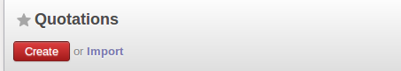
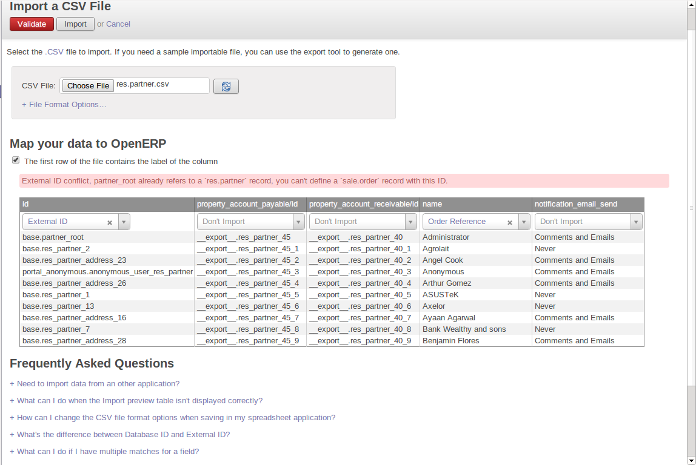

.. index::
   pair: data; import
   pair: data; export

Importing and Exporting Data
============================

Every form in OpenERP has a standard mechanism for importing data from a CSV file through the client user interface. 
That is the same format as used in the language translations.

.. note:: Forms and Lists

   You have access to the Import and Export functions in the client on a list view in read-
   only mode – From `More` Button. You cannot reach Import or Export in any other view.

The CSV file format is a text format compatible with most spreadsheet programs (such as OpenOffice
Calc and Microsoft Excel), and is easily editable as a worksheet. The first line contains the name of
the field in the form. All the subsequent lines are data, aligned in their respective columns.

.. index::
   pair: data; CSV export

Exporting OpenERP Data to CSV
-----------------------------

Start exploring OpenERP's use of the CSV format by exporting a modestly complex set of data,
the partners and partner addresses in the demonstration data.

Go to :menuselection:`Sales --> Sales --> Customers` for a list of partners, and select the records to export by clicking the checkbox on the left of each record. Then look for the :guilabel:`More Button` section on the Top of the list and click the :guilabel:`Export` link. This pops up the :guilabel:`Export Data` dialog box.
Select the following fields:

* :guilabel:`Name`,

* :guilabel:`Contact Name` under the :guilabel:`Contacts` menu,

* :guilabel:`City` under the :guilabel:`Contacts` menu.

You can either select and add them one at a time, or :kbd:`Ctrl-click` them and add
the multiple selection - the order in which you 
select them, is the order in which they will be displayed.

If you do not wish to export your data just yet, or would like to use the same fields for future exports,
you have the option to save these settings. To do that, click :guilabel:`Save fields List` and give your export a name.

Then click :guilabel:`Export` and save the resulting :file:`data.csv` file somewhere accessible - 
perhaps your desktop. You can open that file in a spreadsheet program or a text editor.

You will see that you have a list of partners, with the name and city of each partner's contacts
alongside. In the couple of cases where there is more than one address, the partner name
is left out. So it is important to note that the order of entries is critical - do not sort
that list!

.. tip:: List Limits

   There is a limit to the number of items you can export in the clients - it is the number
   you can actually see, and that is 20 items by default in the web client, but is
   arbitrary in the GTK client.
   
   You can change the number of items viewed by clicking on the link which shows the count of the items.
   You can then make a selection of limiting it to a fixed number of items at a time, for example, 50 or 100,
   or you can choose to view unlimited number of items at a time.

.. index::
   pair: data; CSV import

Importing CSV Data to OpenERP
-----------------------------

Use this export file as a template for an import file by deleting all of the data,
and using new data (here you will just import new data alongside the demonstration data,
but the principle is the same for a blank database).

For example, to import partners with several contacts for which you specify a name and a city, you
would create the following CSV file from the export file:

.. csv-table:: Example of importing partner address fields
   :header: "Name", "Contacts/Contact Name", "Contacts/City"
   :widths: 12,10,8

   "Whole Globe Technologies","Graham Global","Athens"
   "","Wanda World","Rome"
   "","Emerson Earth","New York"
   "Miles A Minute","",""

From the list of partners, click the :guilabel:`Import` link, and then in the 
:guilabel:`Import Data` window click :guilabel:`Browse` to search for and import
the new :file:`data.csv` file then click :guilabel:`Validate`.

You will get a dialog box showing that you have imported 2 objects, and you can
see the new partners and partner addresses when you refresh the list on-screen.

.. index::
   pair: data; CSV structured

Lowering the barrier to import data
-----------------------------------

The importation of data into OpenERP has been completely redesigned as to enable much easier and transparent data import operations.
 
When setting the “Allow users to import data from CSV files” option in the Settings/Configuration/General Settings menu entry, the import/export tool will be made available throughout the App Suite. Once installed, the import option is available next to every Create button from a list view.

   *New Import feature*

After selecting your data, you can preview them right away, thus resulting in a significant gain in time. In previous versions of OpenERP, you had to reiterate the import when the initial one did not meet your criteria. Now, the system analyses the file content and provides indications in case of errors or issues for every line at once.
 
In case of errors in the original file formatting, OpenERP proposes you alternatives and solutions on how to structure your document.
 
Furthermore, the mapping with the OpenERP data fields has been improved. The system even proposes available data alternatives, in case it does not find the data the user specified. Previously, the system would halt the import upon meeting an error. Now, it lists all the errors, allowing the user to correct on the spot prior to finalizing the import process.

   *Solution Import feature*

As you can see in the above screenshot, a frequently asked questions section has been added in the import dialog to help solving complex document transformation issues.
   
Exporting Data in Other Forms
-----------------------------

OpenERP's generic export mechanism lets you easily export any of your data to any location on your
system. You are not restricted to what you can export, although you can restrict who can export that
data using the rights management facilities discussed above.

You can use this to export your data into spreadsheets or into other systems, such as specialist
accounts packages. The export format is usually in the CSV format, but you can also connect directly
to Microsoft Excel using Microsoft's COM mechanism.

.. tip:: Access to the Database

	Developers can also use other techniques to automatically access the OpenERP database. The two
	most useful are:

	* using the XML-RPC web service,

	* accessing the PostgreSQL database directly.

.. tip:: Module Recorder

	If you want to enter data into OpenERP manually, you should use the Module Recorder, described in
	the first section of this chapter.

	By doing that, you will generate a module that can easily be reused in different databases.
	Then if there are problems with a database, you will be able to reinstall the data module you
	generated with all of the entries and modifications you made for this system.

.. Copyright © Open Object Press. All rights reserved.

.. You may take electronic copy of this publication and distribute it if you don't
.. change the content. You can also print a copy to be read by yourself only.

.. We have contracts with different publishers in different countries to sell and
.. distribute paper or electronic based versions of this book (translated or not)
.. in bookstores. This helps to distribute and promote the OpenERP product. It
.. also helps us to create incentives to pay contributors and authors using author
.. rights of these sales.

.. Due to this, grants to translate, modify or sell this book are strictly
.. forbidden, unless Tiny SPRL (representing Open Object Press) gives you a
.. written authorisation for this.

.. Many of the designations used by manufacturers and suppliers to distinguish their
.. products are claimed as trademarks. Where those designations appear in this book,
.. and Open Object Press was aware of a trademark claim, the designations have been
.. printed in initial capitals.

.. While every precaution has been taken in the preparation of this book, the publisher
.. and the authors assume no responsibility for errors or omissions, or for damages
.. resulting from the use of the information contained herein.

.. Published by Open Object Press, Grand Rosière, Belgium

