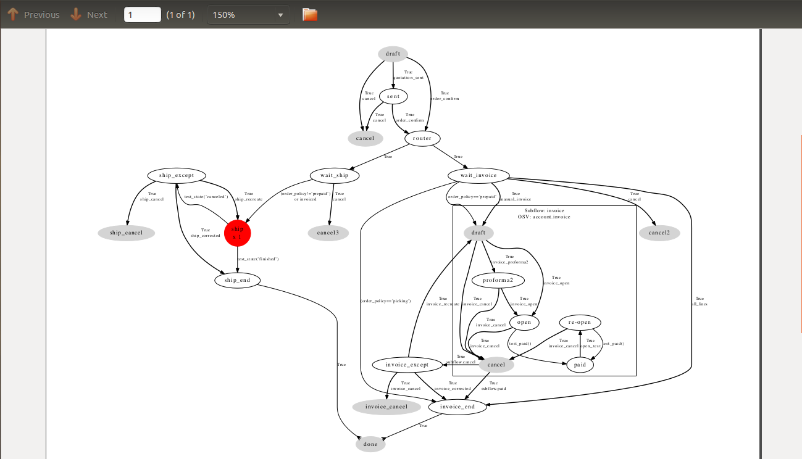

.. index::
   single: workflow
   single: process

Configuring Workflows and Processes
===================================

Workflows represent the company's different document flows. They are completely configurable and
define the path that any individual OpenERP object (such as an order) must follow, depending on the conditions
(for example, an order above a certain value must be approved by a sales director, otherwise by any
sales person, before the delivery can be triggered).

The figure :ref:`fig-sflow` shows the standard workflow for an order. You can show it from the Debug Mode by clicking `Print Workflow`. Select an
order, then Print Workflow to show the workflow below.

The chapter :ref:`ch-process` provides all of the information
needed to create and modify technical workflows and cross-company processes.

.. _fig-sflow:

   *Workflow for order SO005*

.. Copyright © Open Object Press. All rights reserved.

.. You may take electronic copy of this publication and distribute it if you don't
.. change the content. You can also print a copy to be read by yourself only.

.. We have contracts with different publishers in different countries to sell and
.. distribute paper or electronic based versions of this book (translated or not)
.. in bookstores. This helps to distribute and promote the OpenERP product. It
.. also helps us to create incentives to pay contributors and authors using author
.. rights of these sales.

.. Due to this, grants to translate, modify or sell this book are strictly
.. forbidden, unless Tiny SPRL (representing Open Object Press) gives you a
.. written authorisation for this.

.. Many of the designations used by manufacturers and suppliers to distinguish their
.. products are claimed as trademarks. Where those designations appear in this book,
.. and Open Object Press was aware of a trademark claim, the designations have been
.. printed in initial capitals.

.. While every precaution has been taken in the preparation of this book, the publisher
.. and the authors assume no responsibility for errors or omissions, or for damages
.. resulting from the use of the information contained herein.

.. Published by Open Object Press, Grand Rosière, Belgium
