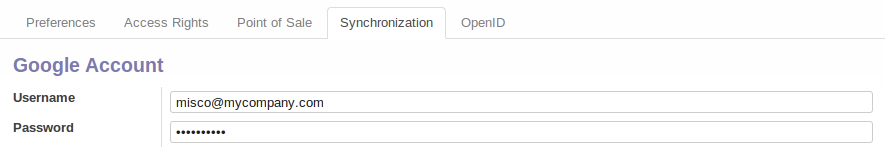
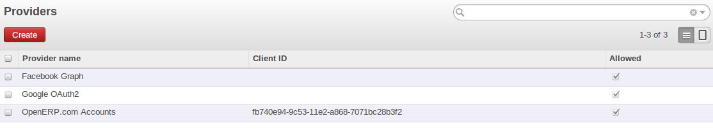

#############
Google Module
#############

Google Doc
==========
In general, many users have a multitude of tools and files to conduct their daily business. Besides using your ERP, many amongst us still use separate text and spreadsheet files to cover specific business needs.
We now offer you to integrate text and spreadsheet files with OpenERP 7.0. This offers to the end user the possibility to take these files into account whilst using OpenERP 7.0.

Its purpose is to offer a quick fix solution for those users, where the creation of a custom module to cover that particular user need would take some more time to obtain.
Take a job opening in the Recruitment Process App as an example of an OpenERP object, you can attach an interview evaluation form you maintain in Google Docs, and dynamically link it to the said job application.

Then, you can share this Google Docs file with the persons you wish. Taking this example a step further, you can link a document template, say your interview evaluation template, and link them to all your job openings.
And every time you have a need to hire, you can mobilize the Google Doc-based evaluation template.

You have to install ``google_doc`` module from :menuselection:`Settings --> Modules`. 
Don’t forget to specify your personal Google Docs credentials in your User configuration menu. (:menuselection:`Settings --> Users --> Users (Synchronization tab)`)

   *User Configuration*  

After installing this module , you will find the :guilabel:`Add Google doc` option in :guilabel:`Attachment(s)` button at the top center of forms. 

Sign in with Google and Facebook
================================
As of version 7.0, external authentication is made possible. Open Authentication (the open standard OAuth) is used to this means.
Two service provider accounts can be defined in OpenERP: Facebook and Google.

- Facebook Graph is the platform that let us get information in and out of Facebook,
- the Google APIs use the OAuth 2.0 protocol for authentication and authorization.

For that you have to install `auth_oauth_signup` module. After installing you can go :menuselection:`Settings --> Users --> OAuth Providers` select Allowed field of the Facebook Graph and Google OAuth2 providers.

   *OAuth Provider*   

We have integrated some Google applications with OpenERP, which allow users to view OpenERP data on Google. It will be available in extra-addons.

.. Copyright © Open Object Press. All rights reserved.

.. You may take electronic copy of this publication and distribute it if you don't
.. change the content. You can also print a copy to be read by yourself only.

.. We have contracts with different publishers in different countries to sell and
.. distribute paper or electronic based versions of this book (translated or not)
.. in bookstores. This helps to distribute and promote the OpenERP product. It
.. also helps us to create incentives to pay contributors and authors using author
.. rights of these sales.

.. Due to this, grants to translate, modify or sell this book are strictly
.. forbidden, unless Tiny SPRL (representing Open Object Press) gives you a
.. written authorisation for this.

.. Many of the designations used by manufacturers and suppliers to distinguish their
.. products are claimed as trademarks. Where those designations appear in this book,
.. and Open Object Press was aware of a trademark claim, the designations have been
.. printed in initial capitals.

.. While every precaution has been taken in the preparation of this book, the publisher
.. and the authors assume no responsibility for errors or omissions, or for damages
.. resulting from the use of the information contained herein.

.. Published by Open Object Press, Grand Rosière, Belgium
