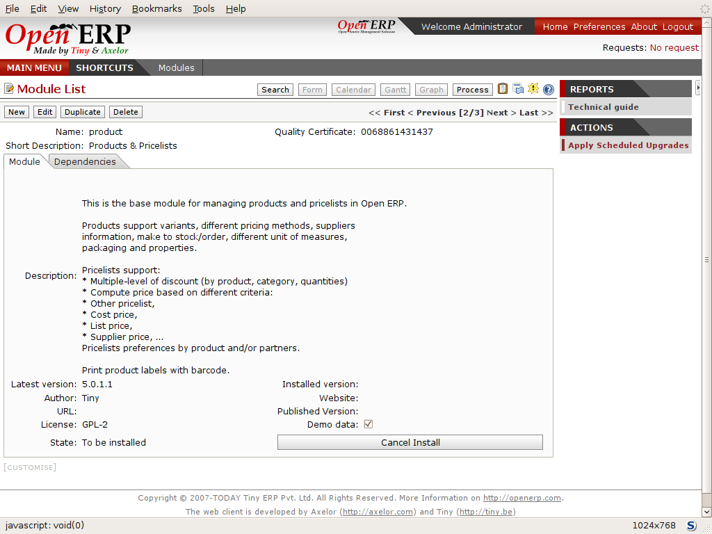

.. i18n: .. index::
.. i18n:   single: module; new functionality

.. index::
  single: module; new functionality

.. i18n: Installing new functionality
.. i18n: =============================

Installing new functionality
=============================

.. i18n: All of Open ERP's functionality is contained in its many and various modules. Many of these, the
.. i18n: core modules, are automatically loaded during the initial installation of the system and can be
.. i18n: updated online later. Although they're mostly not installed in your database at the outset, they're
.. i18n: available on your computer for immediate installation. Additional modules can also be loaded online
.. i18n: from the official Open ERP site http://openerp.com. These modules are inactive when they're loaded
.. i18n: into the system, and can then be installed in a separate step.

All of Open ERP's functionality is contained in its many and various modules. Many of these, the
core modules, are automatically loaded during the initial installation of the system and can be
updated online later. Although they're mostly not installed in your database at the outset, they're
available on your computer for immediate installation. Additional modules can also be loaded online
from the official Open ERP site http://openerp.com. These modules are inactive when they're loaded
into the system, and can then be installed in a separate step.

.. i18n: You'll start by checking if there are any updates available online that apply to your initial
.. i18n: installation. Then you'll install a CRM module to complete your existing database.

You'll start by checking if there are any updates available online that apply to your initial
installation. Then you'll install a CRM module to complete your existing database.

.. i18n: .. index::
.. i18n:   single: module; upgrading

.. index::
  single: module; upgrading

.. i18n: Updating the Modules list
.. i18n: ---------------------------

Updating the Modules list
---------------------------

.. i18n: Click :menuselection:`Administration --> Modules Management --> Update Modules List` to start the
.. i18n: updating tool. The :guilabel:`Scan for new modules` window opens showing the addresses that
.. i18n: Open ERP will look in for downloading new modules (known as the repositories), and updating
.. i18n: existing ones.

Click :menuselection:`Administration --> Modules Management --> Update Modules List` to start the
updating tool. The :guilabel:`Scan for new modules` window opens showing the addresses that
Open ERP will look in for downloading new modules (known as the repositories), and updating
existing ones.

.. i18n: .. tip:: Remote module repositories
.. i18n: 
.. i18n: 	If the repository list doesn't reflect your needs then you can edit it from
.. i18n: 	:menuselection:`Administration --> Modules Management --> Repository List`. There you can link to new
.. i18n: 	repositories by adding their URLs and disable listed ones by unchecking their 
.. i18n: 	:guilabel:`Active` checkbox. If
.. i18n: 	you're not connected to the Internet then you probably want to disable anything there.
.. i18n: 
.. i18n: 	Your Open ERP installation must be configured with its ``addons`` directory as writable for you to be
.. i18n: 	able to download anything at all. If it hasn't been, then you may need the assistance of a systems
.. i18n: 	administrator to change your server's settings so that you can install new modules.

.. tip:: Remote module repositories

	If the repository list doesn't reflect your needs then you can edit it from
	:menuselection:`Administration --> Modules Management --> Repository List`. There you can link to new
	repositories by adding their URLs and disable listed ones by unchecking their 
	:guilabel:`Active` checkbox. If
	you're not connected to the Internet then you probably want to disable anything there.

	Your Open ERP installation must be configured with its ``addons`` directory as writable for you to be
	able to download anything at all. If it hasn't been, then you may need the assistance of a systems
	administrator to change your server's settings so that you can install new modules.

.. i18n: Click :guilabel:`Check New Modules` to start the download from the specified locations. When it's
.. i18n: complete you'll see a :guilabel:`New Modules` window indicating how many new modules were downloaded
.. i18n: and how many existing modules were updated. Click :guilabel:`OK` to return to the updated list.

Click :guilabel:`Check New Modules` to start the download from the specified locations. When it's
complete you'll see a :guilabel:`New Modules` window indicating how many new modules were downloaded
and how many existing modules were updated. Click :guilabel:`OK` to return to the updated list.

.. i18n: It won't matter in this chapter if you can't download anything, but some of the later chapters refer
.. i18n: to modules that aren't part of the core installation and have to be obtained from a remote
.. i18n: repository.

It won't matter in this chapter if you can't download anything, but some of the later chapters refer
to modules that aren't part of the core installation and have to be obtained from a remote
repository.

.. i18n: .. note:: Modules
.. i18n: 
.. i18n: 	All the modules available on your computer can be found in the addons directory of your Open ERP
.. i18n: 	server. Each module there is represented by a directory carrying the name of the module or by a
.. i18n: 	file with the module name and .zip appended to it. The file is in ZIP archive format and replicates
.. i18n: 	the directory structure of unzipped modules.

.. note:: Modules

	All the modules available on your computer can be found in the addons directory of your Open ERP
	server. Each module there is represented by a directory carrying the name of the module or by a
	file with the module name and .zip appended to it. The file is in ZIP archive format and replicates
	the directory structure of unzipped modules.

.. i18n: .. tip:: Searching through the whole list
.. i18n: 
.. i18n: 	The list of modules shows only the first available modules. In the web client you can search or
.. i18n: 	follow the First / Previous / Next / Last links to get to any point in the whole list, and you can
.. i18n: 	change the number of entries listed by clicking the row number indicators between :guilabel:`Previous` 
.. i18n: 	and :guilabel:`Next`
.. i18n: 	and selecting a different number from the default of 20.
.. i18n: 
.. i18n: 	If you use the GTK client you can search, as you would with the web client, or use the + icon to
.. i18n: 	the top left of the window to change the number of entries returned by the search from its default
.. i18n: 	limit of 80, or its default offset of 0 (starting at the first entry) in the whole list.

.. tip:: Searching through the whole list

	The list of modules shows only the first available modules. In the web client you can search or
	follow the First / Previous / Next / Last links to get to any point in the whole list, and you can
	change the number of entries listed by clicking the row number indicators between :guilabel:`Previous` 
	and :guilabel:`Next`
	and selecting a different number from the default of 20.

	If you use the GTK client you can search, as you would with the web client, or use the + icon to
	the top left of the window to change the number of entries returned by the search from its default
	limit of 80, or its default offset of 0 (starting at the first entry) in the whole list.

.. i18n: .. index::
.. i18n:   single: module; installing

.. index::
  single: module; installing

.. i18n: Installing a module
.. i18n: ---------------------

Installing a module
---------------------

.. i18n: .. index::
.. i18n:    single: module; product

.. index::
   single: module; product

.. i18n: You'll now install a module named :mod:`product`, which will enable you to manage the company's
.. i18n: products. This is part of the core installation, so you don't need to load anything to make this
.. i18n: work, but isn't installed in the Minimal Profile.

You'll now install a module named :mod:`product`, which will enable you to manage the company's
products. This is part of the core installation, so you don't need to load anything to make this
work, but isn't installed in the Minimal Profile.

.. i18n: Open the list of uninstalled modules from :menuselection:`Administration --> Modules Management -->
.. i18n: Modules --> Uninstalled modules`. Search for the module by entering the name :mod:`product` in the search
.. i18n: screen then clicking it in the list that appears below it to open it. The form that describes the
.. i18n: module gives you useful information such as its version number, its status and a review of its
.. i18n: functionality. Click :guilabel:`Schedule for Installation` 
.. i18n: and the status of the module changes to :guilabel:`To be installed`.

Open the list of uninstalled modules from :menuselection:`Administration --> Modules Management -->
Modules --> Uninstalled modules`. Search for the module by entering the name :mod:`product` in the search
screen then clicking it in the list that appears below it to open it. The form that describes the
module gives you useful information such as its version number, its status and a review of its
functionality. Click :guilabel:`Schedule for Installation` 
and the status of the module changes to :guilabel:`To be installed`.

.. i18n: .. figure:: images/install_product_module.png
.. i18n:    :scale: 75
.. i18n:    :align: center
.. i18n: 
.. i18n:    *Installation of the product module*

   *Installation of the product module*

.. i18n: .. tip::  Technical Guide
.. i18n: 
.. i18n: 	If you select a module in any of the module lists by clicking on a module line and then on
.. i18n: 	:guilabel:`Technical Guide` at the top right of the window, Open ERP produces a technical report
.. i18n: 	on that module. It's helpful only if the module is installed, so the menu
.. i18n: 	:menuselection:`Administration --> Modules Management --> Modules --> Installed Modules` produces the most
.. i18n: 	fruitful list.
.. i18n: 
.. i18n: 	This report comprises a list of all the objects and all the fields along with their descriptions.
.. i18n: 	The report adapts to your system and reflects any modifications you've made and all the other
.. i18n: 	modules you've installed.

.. tip::  Technical Guide

	If you select a module in any of the module lists by clicking on a module line and then on
	:guilabel:`Technical Guide` at the top right of the window, Open ERP produces a technical report
	on that module. It's helpful only if the module is installed, so the menu
	:menuselection:`Administration --> Modules Management --> Modules --> Installed Modules` produces the most
	fruitful list.

	This report comprises a list of all the objects and all the fields along with their descriptions.
	The report adapts to your system and reflects any modifications you've made and all the other
	modules you've installed.

.. i18n: Click :guilabel:`Apply Scheduled Upgrades` then :guilabel:`Start Upgrade` on the :guilabel:`System Upgrade`
.. i18n: form that appears. Close the window when the operation has completed. Return to the main menu you'll
.. i18n: see the new menu :menuselection:`Products` has become available.

Click :guilabel:`Apply Scheduled Upgrades` then :guilabel:`Start Upgrade` on the :guilabel:`System Upgrade`
form that appears. Close the window when the operation has completed. Return to the main menu you'll
see the new menu :menuselection:`Products` has become available.

.. i18n: .. tip::  Refreshing the menu in the GTK client
.. i18n: 
.. i18n: 	After an update in the GTK client you'll have to open a new menu to refresh the content –
.. i18n: 	otherwise you won't see the new menu item. To do that use the window menu :menuselection:`Form -->
.. i18n: 	Refresh/Cancel`.

.. tip::  Refreshing the menu in the GTK client

	After an update in the GTK client you'll have to open a new menu to refresh the content –
	otherwise you won't see the new menu item. To do that use the window menu :menuselection:`Form -->
	Refresh/Cancel`.

.. i18n: Installing a module with its dependencies
.. i18n: -----------------------------------------

Installing a module with its dependencies
-----------------------------------------

.. i18n: .. index::
.. i18n:    single: module; crm

.. index::
   single: module; crm

.. i18n: Now install the CRM module (Customer Relationship Management) using the same process as before.
.. i18n: Start from :menuselection:`Administration --> Modules Management --> Modules --> Uninstalled modules`.

Now install the CRM module (Customer Relationship Management) using the same process as before.
Start from :menuselection:`Administration --> Modules Management --> Modules --> Uninstalled modules`.

.. i18n: 	#. 	Get the list of modules to install, and search for the :mod:`crm` module in that list.
.. i18n: 	
.. i18n: 	#.	Schedule the module for installation by clicking :guilabel:`Schedule for Installation`.
.. i18n: 	
.. i18n: 	#.  Do the same for :mod:`account`. 
.. i18n: 	
.. i18n: 	#.  Click :guilabel:`Apply Scheduled Upgrades` on the action toolbar to the right.
.. i18n: 
.. i18n: 	#.	Click :guilabel:`Start Upgrade` to install both modules. 
.. i18n: 	
.. i18n: 	#.  After a wait, when the installation is complete, click :guilabel:`Start Configuration`.
.. i18n: 	
.. i18n: 	#.  Accept the defaults for accounts setup and select ``None`` for the chart of accounts.
.. i18n: 	
.. i18n: 	#.  You'll see details of all the features installed by the modules on a new
.. i18n: 	    :guilabel:`Features` tab on the module form. 

	#. 	Get the list of modules to install, and search for the :mod:`crm` module in that list.
	
	#.	Schedule the module for installation by clicking :guilabel:`Schedule for Installation`.
	
	#.  Do the same for :mod:`account`. 
	
	#.  Click :guilabel:`Apply Scheduled Upgrades` on the action toolbar to the right.

	#.	Click :guilabel:`Start Upgrade` to install both modules. 
	
	#.  After a wait, when the installation is complete, click :guilabel:`Start Configuration`.
	
	#.  Accept the defaults for accounts setup and select ``None`` for the chart of accounts.
	
	#.  You'll see details of all the features installed by the modules on a new
	    :guilabel:`Features` tab on the module form. 

.. i18n: When you return to the main menu you'll find the new customer relationship management menu
.. i18n: :menuselection:`CRM & SRM`. You'll also see all the accounting functions that are now available in
.. i18n: the :menuselection:`Financial Management` menu.

When you return to the main menu you'll find the new customer relationship management menu
:menuselection:`CRM & SRM`. You'll also see all the accounting functions that are now available in
the :menuselection:`Financial Management` menu.

.. i18n: There is no particular relationship between the modules installed and the menus added. Most of the
.. i18n: core modules add complete menus but some also add submenus to menus already in the system. Other
.. i18n: modules add menus and submenus as they need. Modules can also add additional fields to existing
.. i18n: forms, or simply additional demonstration data or some settings specific to a given requirement.

There is no particular relationship between the modules installed and the menus added. Most of the
core modules add complete menus but some also add submenus to menus already in the system. Other
modules add menus and submenus as they need. Modules can also add additional fields to existing
forms, or simply additional demonstration data or some settings specific to a given requirement.

.. i18n: .. index::
.. i18n:   single: module; dependencies
.. i18n: ..

.. index::
  single: module; dependencies
..

.. i18n: .. note::  Dependencies between modules
.. i18n: 
.. i18n: 	The module form shows two tabs before it's installed. 
.. i18n: 	The first tab gives basic information about the module and the
.. i18n: 	second gives a list of modules that this module depends on. So when you install a module, Open ERP
.. i18n: 	automatically selects all the necessary dependencies to install this module.
.. i18n: 
.. i18n: 	That's also how you develop the profile modules: they simply define a list of modules that you want
.. i18n: 	in your profile as a set of dependencies.

.. note::  Dependencies between modules

	The module form shows two tabs before it's installed. 
	The first tab gives basic information about the module and the
	second gives a list of modules that this module depends on. So when you install a module, Open ERP
	automatically selects all the necessary dependencies to install this module.

	That's also how you develop the profile modules: they simply define a list of modules that you want
	in your profile as a set of dependencies.

.. i18n: Although you can install a module and all its dependencies at once, you can't remove them in one
.. i18n: fell swoop – you'd have to uninstall module by module. Uninstalling is more complex than
.. i18n: installing because you have to handle existing system data.

Although you can install a module and all its dependencies at once, you can't remove them in one
fell swoop – you'd have to uninstall module by module. Uninstalling is more complex than
installing because you have to handle existing system data.

.. i18n: .. note::  Uninstalling modules
.. i18n: 
.. i18n: 	Although it works quite well, uninstalling modules isn't perfect in Open ERP. It's not guaranteed
.. i18n: 	to return the system exactly to the state it was in before installation.
.. i18n: 
.. i18n: 	So it's recommended that you make a backup of the database before installing your new modules so
.. i18n: 	that you can test the new modules and decide whether they're suitable or not. If they're not then
.. i18n: 	you can return to your backup. If they are, then you'll probably still reinstall the modules on
.. i18n: 	your backup so that you don't have to delete all your test data.
.. i18n: 
.. i18n: 	If you wanted to uninstall you would use the menu :menuselection:`Administration --> Modules
.. i18n: 	Management --> Modules --> Installed Modules` and then uninstall them in the inverse order of their
.. i18n: 	dependencies: ``crm``, ``account``, ``product``.

.. note::  Uninstalling modules

	Although it works quite well, uninstalling modules isn't perfect in Open ERP. It's not guaranteed
	to return the system exactly to the state it was in before installation.

	So it's recommended that you make a backup of the database before installing your new modules so
	that you can test the new modules and decide whether they're suitable or not. If they're not then
	you can return to your backup. If they are, then you'll probably still reinstall the modules on
	your backup so that you don't have to delete all your test data.

	If you wanted to uninstall you would use the menu :menuselection:`Administration --> Modules
	Management --> Modules --> Installed Modules` and then uninstall them in the inverse order of their
	dependencies: ``crm``, ``account``, ``product``.

.. i18n: Installing additional functionality
.. i18n: -------------------------------------

Installing additional functionality
-------------------------------------

.. i18n: To discover the full range of Open ERP's possibilities you can install many additional modules.
.. i18n: Installing them with their demonstration data provides a convenient way of exploring the whole core
.. i18n: system. When you build on the \ ``openerp_ch02``\   database you'll automatically include
.. i18n: demonstration data because you checked the :guilabel:`Load Demonstration Data` checkbox when you originally
.. i18n: created the database.

To discover the full range of Open ERP's possibilities you can install many additional modules.
Installing them with their demonstration data provides a convenient way of exploring the whole core
system. When you build on the \ ``openerp_ch02``\   database you'll automatically include
demonstration data because you checked the :guilabel:`Load Demonstration Data` checkbox when you originally
created the database.

.. i18n: .. index::
.. i18n:    single: module; importing
.. i18n: ..

.. index::
   single: module; importing
..

.. i18n: Click :menuselection:`Administration --> Modules Management --> Modules --> Uninstalled modules` to give you an
.. i18n: overview of all of the modules available for installation.

Click :menuselection:`Administration --> Modules Management --> Modules --> Uninstalled modules` to give you an
overview of all of the modules available for installation.

.. i18n: To test several modules you won't have to install them all one by one. You can use the dependencies
.. i18n: between modules to load several at once. For example, try loading the following modules:

To test several modules you won't have to install them all one by one. You can use the dependencies
between modules to load several at once. For example, try loading the following modules:

.. i18n: .. index::
.. i18n:    single: modules; profile_

.. index::
   single: modules; profile_

.. i18n: * :mod:`profile_accounting`,
.. i18n: 
.. i18n: * :mod:`profile_crm`,
.. i18n: 
.. i18n: * :mod:`profile_manufacturing`,
.. i18n: 
.. i18n: * :mod:`profile_service`.

* :mod:`profile_accounting`,

* :mod:`profile_crm`,

* :mod:`profile_manufacturing`,

* :mod:`profile_service`.

.. i18n: To find these quickly, enter the word \ ``profile``\   in the :guilabel:`Name` field of the search
.. i18n: form and click :guilabel:`Filter` to search for the relevant modules. Then install them one by one
.. i18n: or all at once.

To find these quickly, enter the word \ ``profile``\   in the :guilabel:`Name` field of the search
form and click :guilabel:`Filter` to search for the relevant modules. Then install them one by one
or all at once.

.. i18n: As you update you'll see thirty or so modules to be installed. Move on from the 
.. i18n: :guilabel:`System upgrade done` form by clicking :guilabel:`Start configuration` and then
.. i18n: accepting the default crm configuration and picking configuration in turn.

As you update you'll see thirty or so modules to be installed. Move on from the 
:guilabel:`System upgrade done` form by clicking :guilabel:`Start configuration` and then
accepting the default crm configuration and picking configuration in turn.

.. i18n: Finally install the additional modules :guilabel:`Analytic Accounting` and :guilabel:`Document Management`
.. i18n: when you're offered that configuration option. Don't install any more - you now have quite a 
.. i18n: fully-loaded system to look at.

Finally install the additional modules :guilabel:`Analytic Accounting` and :guilabel:`Document Management`
when you're offered that configuration option. Don't install any more - you now have quite a 
fully-loaded system to look at.

.. i18n: Click :guilabel:`Home` and you'll be returned to a dashboard, not the main menu you had before. To get to
.. i18n: the main menu, use the :guilabel:`MAIN MENU` link. 

Click :guilabel:`Home` and you'll be returned to a dashboard, not the main menu you had before. To get to
the main menu, use the :guilabel:`MAIN MENU` link. 

.. i18n: .. Copyright © Open Object Press. All rights reserved.

.. Copyright © Open Object Press. All rights reserved.

.. i18n: .. You may take electronic copy of this publication and distribute it if you don't
.. i18n: .. change the content. You can also print a copy to be read by yourself only.

.. You may take electronic copy of this publication and distribute it if you don't
.. change the content. You can also print a copy to be read by yourself only.

.. i18n: .. We have contracts with different publishers in different countries to sell and
.. i18n: .. distribute paper or electronic based versions of this book (translated or not)
.. i18n: .. in bookstores. This helps to distribute and promote the Open ERP product. It
.. i18n: .. also helps us to create incentives to pay contributors and authors using author
.. i18n: .. rights of these sales.

.. We have contracts with different publishers in different countries to sell and
.. distribute paper or electronic based versions of this book (translated or not)
.. in bookstores. This helps to distribute and promote the Open ERP product. It
.. also helps us to create incentives to pay contributors and authors using author
.. rights of these sales.

.. i18n: .. Due to this, grants to translate, modify or sell this book are strictly
.. i18n: .. forbidden, unless Tiny SPRL (representing Open Object Press) gives you a
.. i18n: .. written authorisation for this.

.. Due to this, grants to translate, modify or sell this book are strictly
.. forbidden, unless Tiny SPRL (representing Open Object Press) gives you a
.. written authorisation for this.

.. i18n: .. Many of the designations used by manufacturers and suppliers to distinguish their
.. i18n: .. products are claimed as trademarks. Where those designations appear in this book,
.. i18n: .. and Open Object Press was aware of a trademark claim, the designations have been
.. i18n: .. printed in initial capitals.

.. Many of the designations used by manufacturers and suppliers to distinguish their
.. products are claimed as trademarks. Where those designations appear in this book,
.. and Open Object Press was aware of a trademark claim, the designations have been
.. printed in initial capitals.

.. i18n: .. While every precaution has been taken in the preparation of this book, the publisher
.. i18n: .. and the authors assume no responsibility for errors or omissions, or for damages
.. i18n: .. resulting from the use of the information contained herein.

.. While every precaution has been taken in the preparation of this book, the publisher
.. and the authors assume no responsibility for errors or omissions, or for damages
.. resulting from the use of the information contained herein.

.. i18n: .. Published by Open Object Press, Grand Rosière, Belgium

.. Published by Open Object Press, Grand Rosière, Belgium
