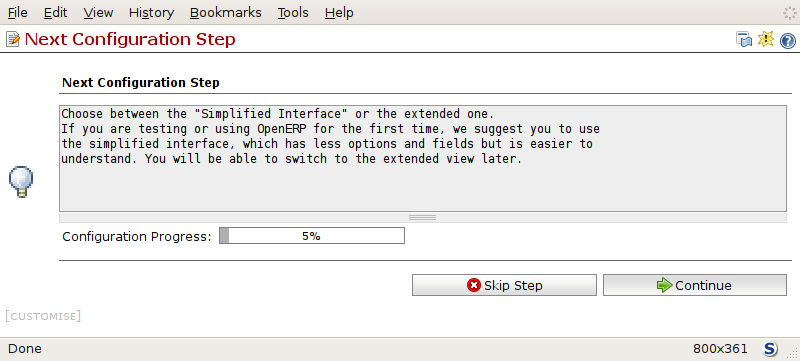
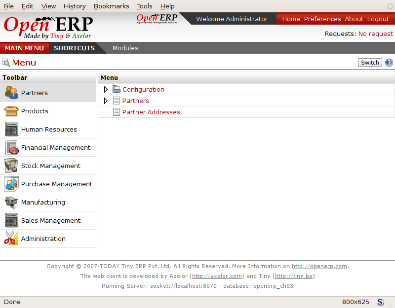

.. i18n: Use case
.. i18n: ========

Use case
========

.. i18n: Configure a system that enables you to:

Configure a system that enables you to:

.. i18n: * buy products from a supplier,
.. i18n: 
.. i18n: * stock the products in a warehouse,
.. i18n: 
.. i18n: * sell these products to a customer.

* buy products from a supplier,

* stock the products in a warehouse,

* sell these products to a customer.

.. i18n: The system should support all aspects of invoicing, payments to suppliers and receipts from
.. i18n: customers.

The system should support all aspects of invoicing, payments to suppliers and receipts from
customers.

.. i18n: Functional requirements
.. i18n: =======================

Functional requirements
=======================

.. i18n: For working out the business case you'll have to model:

For working out the business case you'll have to model:

.. i18n: * the suppliers,
.. i18n: 
.. i18n: * the customers,
.. i18n: 
.. i18n: * some products,
.. i18n: 
.. i18n: * inventory for despatch,
.. i18n: 
.. i18n: * a purchase order,
.. i18n: 
.. i18n: * a sale order,
.. i18n: 
.. i18n: * invoices,
.. i18n: 
.. i18n: * payments.

* the suppliers,

* the customers,

* some products,

* inventory for despatch,

* a purchase order,

* a sale order,

* invoices,

* payments.

.. i18n: To test the system you'll need at least one supplier, one customer, one product, a warehouse, a
.. i18n: minimal chart of accounts and a bank account.

To test the system you'll need at least one supplier, one customer, one product, a warehouse, a
minimal chart of accounts and a bank account.

.. i18n: Database creation
.. i18n: =================

Database creation
=================

.. i18n: Use the technique outlined in :ref:`sect-dbcreate` to create a new database, \ ``openerp_ch03``\  . This
.. i18n: database will be free of data and contain the least possible amount of functionality as a starting
.. i18n: point. You'll need to know your super administrator password for this – or you'll have to find
.. i18n: somebody who does have it to create this seed database. You won't be able to use the \
.. i18n: ``openerp_ch1``\   or \ ``openerp_ch2``\   databases that you might have created so far in this book
.. i18n: because they both contain demonstration data.

Use the technique outlined in :ref:`sect-dbcreate` to create a new database, \ ``openerp_ch03``\  . This
database will be free of data and contain the least possible amount of functionality as a starting
point. You'll need to know your super administrator password for this – or you'll have to find
somebody who does have it to create this seed database. You won't be able to use the \
``openerp_ch1``\   or \ ``openerp_ch2``\   databases that you might have created so far in this book
because they both contain demonstration data.

.. i18n: Start the database creation process from the :guilabel:`Welcome` page by clicking
.. i18n: :guilabel:`Databases` and then completing the following fields on the :guilabel:`Create new database` form, as shown in :ref:`fig-oech03`:

Start the database creation process from the :guilabel:`Welcome` page by clicking
:guilabel:`Databases` and then completing the following fields on the :guilabel:`Create new database` form, as shown in :ref:`fig-oech03`:

.. i18n: *  :guilabel:`Super admin password` : by default it's \ ``admin``\  , if you or your system
.. i18n:    administrator haven't changed it,
.. i18n: 
.. i18n: *  :guilabel:`New database name` : \ ``openerp_ch03``\  ,
.. i18n: 
.. i18n: *  :guilabel:`Load Demonstration data` checkbox: \ ``not checked``\  (**this step is very important, but catches out many people**),
.. i18n: 
.. i18n: *  :guilabel:`Default Language` : \ ``English``\  ,
.. i18n: 
.. i18n: *  :guilabel:`Administrator password` : \ ``admin``\  (because it's easiest to remember at this stage, but obviously completely insecure),
.. i18n: 
.. i18n: *  :guilabel:`Confirm password` : \ ``admin``\  .

*  :guilabel:`Super admin password` : by default it's \ ``admin``\  , if you or your system
   administrator haven't changed it,

*  :guilabel:`New database name` : \ ``openerp_ch03``\  ,

*  :guilabel:`Load Demonstration data` checkbox: \ ``not checked``\  (**this step is very important, but catches out many people**),

*  :guilabel:`Default Language` : \ ``English``\  ,

*  :guilabel:`Administrator password` : \ ``admin``\  (because it's easiest to remember at this stage, but obviously completely insecure),

*  :guilabel:`Confirm password` : \ ``admin``\  .

.. i18n: .. _fig-oech03:
.. i18n: 
.. i18n: .. figure::  images/openerp_ch03.png
.. i18n:    :scale: 75
.. i18n:    :align: center
.. i18n: 
.. i18n:    *Creating a blank database*

.. _fig-oech03:

.. figure::  images/openerp_ch03.png
   :scale: 75
   :align: center

   *Creating a blank database*

.. i18n: Then click :guilabel:`OK` to create the database and move to the setup screen :ref:`fig-oech03s1`.

Then click :guilabel:`OK` to create the database and move to the setup screen :ref:`fig-oech03s1`.

.. i18n: .. _fig-oech03s1:
.. i18n: 
.. i18n: .. figure::  images/openerp_ch03_s1.png
.. i18n:    :scale: 75
.. i18n:    :align: center
.. i18n: 
.. i18n:    *Setting up a blank database - first screen*
.. i18n:    
.. i18n: After a short delay you are connected to the new \ ``openerp_ch03``\   database as user \ ``admin``\ 
.. i18n: with the password you gave it. You'll have to go through the Setup wizard in steps:
.. i18n: 
.. i18n: 	#.  :guilabel:`Select a profile` : select ``Minimal Profile`` and click :guilabel:`Next`.
.. i18n: 
.. i18n: 	#.  At the :guilabel:`Define Main Company` step you could select your own :guilabel:`Company Name` and 
.. i18n: 	    :guilabel:`Currency`, and address details on the first tab :guilabel:`General Information`; 
.. i18n: 	    and you can add more details on the second tab :guilabel:`Report Information` including a logo
.. i18n: 	    that would appear on reports. In this test you should leave everything untouched for the moment
.. i18n: 	    and just click :guilabel:`Next`: you'll change them later.
.. i18n: 
.. i18n: 	#.  At the :guilabel:`Summary` page you can go back to change details if you need.
.. i18n: 	    Click the :guilabel:`Install` button.
.. i18n: 
.. i18n: 	#.  Finally, at the :guilabel:`Installation done` page, click :guilabel:`Start Configuration`.
.. i18n: 	
.. i18n: Configuration consists of a set of wizards that help you through options for the installed modules.
.. i18n: Since you chose the minimal database hardly anything is installed so this is a very simple process 
.. i18n: at the moment, starting with the menu layout :ref:`fig-oech03cfg` .

.. _fig-oech03s1:

.. figure::  images/openerp_ch03_s1.png
   :scale: 75
   :align: center

   *Setting up a blank database - first screen*
   
After a short delay you are connected to the new \ ``openerp_ch03``\   database as user \ ``admin``\ 
with the password you gave it. You'll have to go through the Setup wizard in steps:

	#.  :guilabel:`Select a profile` : select ``Minimal Profile`` and click :guilabel:`Next`.

	#.  At the :guilabel:`Define Main Company` step you could select your own :guilabel:`Company Name` and 
	    :guilabel:`Currency`, and address details on the first tab :guilabel:`General Information`; 
	    and you can add more details on the second tab :guilabel:`Report Information` including a logo
	    that would appear on reports. In this test you should leave everything untouched for the moment
	    and just click :guilabel:`Next`: you'll change them later.

	#.  At the :guilabel:`Summary` page you can go back to change details if you need.
	    Click the :guilabel:`Install` button.

	#.  Finally, at the :guilabel:`Installation done` page, click :guilabel:`Start Configuration`.
	
Configuration consists of a set of wizards that help you through options for the installed modules.
Since you chose the minimal database hardly anything is installed so this is a very simple process 
at the moment, starting with the menu layout :ref:`fig-oech03cfg` .

.. i18n: .. _fig-oech03cfg:
.. i18n: 
.. i18n: .. figure::  images/openerp_ch03_config.png
.. i18n:    :scale: 75
.. i18n:    :align: center
.. i18n: 
.. i18n:    *Configuring a minimal database - first screen*
.. i18n:    
.. i18n:     #.  At the first screen click :guilabel:`Continue` to go into the first wizard. 
.. i18n:         Choose :guilabel:`View Mode` : :guilabel:`Extended Interface` so that you can see everything
.. i18n:         and then click :guilabel:`Set` to save it.
.. i18n: 
.. i18n:     #.  Click :guilabel:`Skip Step` to step over the next wizard, which would enable you to add other users.
.. i18n: 
.. i18n:     #.  You've now reached the end of the configuration so click :guilabel:`Continue` to start using the
.. i18n:         system as the Administrator as shown in the screenshot :ref:`fig-oech03st`.

.. _fig-oech03cfg:

   *Configuring a minimal database - first screen*
   
    #.  At the first screen click :guilabel:`Continue` to go into the first wizard. 
        Choose :guilabel:`View Mode` : :guilabel:`Extended Interface` so that you can see everything
        and then click :guilabel:`Set` to save it.

    #.  Click :guilabel:`Skip Step` to step over the next wizard, which would enable you to add other users.

    #.  You've now reached the end of the configuration so click :guilabel:`Continue` to start using the
        system as the Administrator as shown in the screenshot :ref:`fig-oech03st`.

.. i18n: .. _fig-oech03st:
.. i18n: 
.. i18n: .. figure::  images/openerp_ch03_start.png
.. i18n:    :scale: 75
.. i18n:    :align: center
.. i18n: 
.. i18n:    *Starting the minimal database*
.. i18n:    
.. i18n: Installing and configuring modules
.. i18n: ==================================

.. _fig-oech03st:

.. figure::  images/openerp_ch03_start.png
   :scale: 75
   :align: center

   *Starting the minimal database*
   
Installing and configuring modules
==================================

.. i18n: All of the functional needs are provided by core modules from Open ERP:

All of the functional needs are provided by core modules from Open ERP:

.. i18n: .. index::
.. i18n:    single: module; product
.. i18n:    single: module; stock
.. i18n:    single: module; account
.. i18n:    single: module; purchase
.. i18n:    single: module; sale

.. index::
   single: module; product
   single: module; stock
   single: module; account
   single: module; purchase
   single: module; sale

.. i18n: * product management (the :mod:`product` module),
.. i18n: 
.. i18n: * inventory control (the :mod:`stock` module),
.. i18n: 
.. i18n: * accounting and finance (the :mod:`account` module),
.. i18n: 
.. i18n: * purchase management (the :mod:`purchase` module),
.. i18n: 
.. i18n: * sales management (the :mod:`sale` module).

* product management (the :mod:`product` module),

* inventory control (the :mod:`stock` module),

* accounting and finance (the :mod:`account` module),

* purchase management (the :mod:`purchase` module),

* sales management (the :mod:`sale` module).

.. i18n: Use the menu :menuselection:`Administration --> Modules Management --> Modules --> Uninstalled
.. i18n: modules` to show the list of all modules that are registered within Open ERP but as yet
.. i18n: uninstalled. Then:

Use the menu :menuselection:`Administration --> Modules Management --> Modules --> Uninstalled
modules` to show the list of all modules that are registered within Open ERP but as yet
uninstalled. Then:

.. i18n: #. Enter \ ``product``\  into the :guilabel:`Name` field and click :guilabel:`Filter` to list the
.. i18n:    :mod:`product` module.
.. i18n: 
.. i18n: #. Click the name \ ``product``\  in the list to display the product module in form view, rather
.. i18n:    than the list view that a search displays.
.. i18n: 
.. i18n: #. Click the :guilabel:`Schedule for Installation` button on the product module form.
.. i18n: 
.. i18n: #. Click the :guilabel:`Search` button at the top of the form to toggle back to the list view with
.. i18n:    search selection fields on it.
.. i18n: 
.. i18n: #. Search for the :mod:`sale` module then select it, too, as you did with product, to show it in form
.. i18n:    view.
.. i18n: 
.. i18n: #. Click the :guilabel:`Dependencies` tab to see that you'll automatically be loading the \
.. i18n:    :mod:`product`, :mod:`stock`, :mod:`mrp`, and :mod:`process` modules along with the 
.. i18n:    :mod:`sale` module. :mod:`product` and :mod:`process` are both already marked for
.. i18n:    installation as a result of the first steps.
.. i18n: 
.. i18n: #. Return to the :guilabel:`Module` tab and then click its :guilabel:`Schedule for Installation` button.
.. i18n: 
.. i18n: #. Click :guilabel:`Apply Scheduled Upgrades` in the :guilabel:`Action` toolbar to the right.
.. i18n: 
.. i18n: #. When the :guilabel:`System Upgrade` form appears, review the list of Modules to update – it
.. i18n:    may be longer than you had expected, and now includes all the modules you need, because the
.. i18n:    dependencies themselves had their own dependencies.
.. i18n: 
.. i18n: #. Click :guilabel:`Start Upgrade`, wait for :guilabel:`System upgrade done` to be displayed, then
.. i18n:    click :guilabel:`Start Configuration` on that form.
.. i18n: 	   
.. i18n: Configuration is required for both the accounts setup and the sales defaults. 
.. i18n: 
.. i18n: #. Accept the defaults for the :guilabel:`Fiscal Year` and choose the 
.. i18n:    :guilabel:`Charts of Account` to be :guilabel:`None` then click 
.. i18n:    :guilabel:`Continue`.
.. i18n:        
.. i18n: #. The sales defaults are shown in the screenshot :ref:`fig-oech03cfss`. The selections you make
.. i18n:    determine how Open ERP's processes work by setting its default behaviour
.. i18n:    (although you can override any of them for any sales order, 
.. i18n:    so you are not strictly bound by these defaults). 
.. i18n:    Accept the initial set by clicking :guilabel:`Set default behaviour`.
.. i18n: 
.. i18n: #. You've reached the end of this configuration stage so click :guilabel:`Continue` to continue using the
.. i18n:    system as the Administrator. You first reach a new tab :guilabel:`Features` that lists the new menus
.. i18n:    and views as shown in the figure :ref:`fig-oech03cfss`. Each of the modules that were installed
.. i18n:    has its own new tab - it's not only the one you see displayed in front of you. Click :guilabel:`Next`
.. i18n:    and :guilabel:`Previous` to move between them. 
.. i18n: 
.. i18n: #. The main menu now displays all of the menu items that were loaded by the modules you installed.
.. i18n:    Click :guilabel:`MAIN MENU` to see this, shown in the screenshot :ref:`fig-oech03mm`.

#. Enter \ ``product``\  into the :guilabel:`Name` field and click :guilabel:`Filter` to list the
   :mod:`product` module.

#. Click the name \ ``product``\  in the list to display the product module in form view, rather
   than the list view that a search displays.

#. Click the :guilabel:`Schedule for Installation` button on the product module form.

#. Click the :guilabel:`Search` button at the top of the form to toggle back to the list view with
   search selection fields on it.

#. Search for the :mod:`sale` module then select it, too, as you did with product, to show it in form
   view.

#. Click the :guilabel:`Dependencies` tab to see that you'll automatically be loading the \
   :mod:`product`, :mod:`stock`, :mod:`mrp`, and :mod:`process` modules along with the 
   :mod:`sale` module. :mod:`product` and :mod:`process` are both already marked for
   installation as a result of the first steps.

#. Return to the :guilabel:`Module` tab and then click its :guilabel:`Schedule for Installation` button.

#. Click :guilabel:`Apply Scheduled Upgrades` in the :guilabel:`Action` toolbar to the right.

#. When the :guilabel:`System Upgrade` form appears, review the list of Modules to update – it
   may be longer than you had expected, and now includes all the modules you need, because the
   dependencies themselves had their own dependencies.

#. Click :guilabel:`Start Upgrade`, wait for :guilabel:`System upgrade done` to be displayed, then
   click :guilabel:`Start Configuration` on that form.
	   
Configuration is required for both the accounts setup and the sales defaults. 

#. Accept the defaults for the :guilabel:`Fiscal Year` and choose the 
   :guilabel:`Charts of Account` to be :guilabel:`None` then click 
   :guilabel:`Continue`.
       
#. The sales defaults are shown in the screenshot :ref:`fig-oech03cfss`. The selections you make
   determine how Open ERP's processes work by setting its default behaviour
   (although you can override any of them for any sales order, 
   so you are not strictly bound by these defaults). 
   Accept the initial set by clicking :guilabel:`Set default behaviour`.

#. You've reached the end of this configuration stage so click :guilabel:`Continue` to continue using the
   system as the Administrator. You first reach a new tab :guilabel:`Features` that lists the new menus
   and views as shown in the figure :ref:`fig-oech03cfss`. Each of the modules that were installed
   has its own new tab - it's not only the one you see displayed in front of you. Click :guilabel:`Next`
   and :guilabel:`Previous` to move between them. 

#. The main menu now displays all of the menu items that were loaded by the modules you installed.
   Click :guilabel:`MAIN MENU` to see this, shown in the screenshot :ref:`fig-oech03mm`.

.. i18n: .. _fig-oech03cfss:
.. i18n: 
.. i18n: .. figure:: images/openerp_ch03_setsales.png
.. i18n:    :scale: 75
.. i18n:    :align: center
.. i18n: 
.. i18n:    *The module form once a module is installed*

.. _fig-oech03cfss:

.. figure:: images/openerp_ch03_setsales.png
   :scale: 75
   :align: center

   *The module form once a module is installed*

.. i18n: .. _fig-oech03mm:
.. i18n: 
.. i18n: .. figure:: images/openerp_ch03_main.png
.. i18n:    :scale: 75
.. i18n:    :align: center
.. i18n: 
.. i18n:    *Continuing with the database after installing new modules*

.. _fig-oech03mm:

   *Continuing with the database after installing new modules*

.. i18n: .. Copyright © Open Object Press. All rights reserved.

.. Copyright © Open Object Press. All rights reserved.

.. i18n: .. You may take electronic copy of this publication and distribute it if you don't
.. i18n: .. change the content. You can also print a copy to be read by yourself only.

.. You may take electronic copy of this publication and distribute it if you don't
.. change the content. You can also print a copy to be read by yourself only.

.. i18n: .. We have contracts with different publishers in different countries to sell and
.. i18n: .. distribute paper or electronic based versions of this book (translated or not)
.. i18n: .. in bookstores. This helps to distribute and promote the Open ERP product. It
.. i18n: .. also helps us to create incentives to pay contributors and authors using author
.. i18n: .. rights of these sales.

.. We have contracts with different publishers in different countries to sell and
.. distribute paper or electronic based versions of this book (translated or not)
.. in bookstores. This helps to distribute and promote the Open ERP product. It
.. also helps us to create incentives to pay contributors and authors using author
.. rights of these sales.

.. i18n: .. Due to this, grants to translate, modify or sell this book are strictly
.. i18n: .. forbidden, unless Tiny SPRL (representing Open Object Press) gives you a
.. i18n: .. written authorisation for this.

.. Due to this, grants to translate, modify or sell this book are strictly
.. forbidden, unless Tiny SPRL (representing Open Object Press) gives you a
.. written authorisation for this.

.. i18n: .. Many of the designations used by manufacturers and suppliers to distinguish their
.. i18n: .. products are claimed as trademarks. Where those designations appear in this book,
.. i18n: .. and Open Object Press was aware of a trademark claim, the designations have been
.. i18n: .. printed in initial capitals.

.. Many of the designations used by manufacturers and suppliers to distinguish their
.. products are claimed as trademarks. Where those designations appear in this book,
.. and Open Object Press was aware of a trademark claim, the designations have been
.. printed in initial capitals.

.. i18n: .. While every precaution has been taken in the preparation of this book, the publisher
.. i18n: .. and the authors assume no responsibility for errors or omissions, or for damages
.. i18n: .. resulting from the use of the information contained herein.

.. While every precaution has been taken in the preparation of this book, the publisher
.. and the authors assume no responsibility for errors or omissions, or for damages
.. resulting from the use of the information contained herein.

.. i18n: .. Published by Open Object Press, Grand Rosière, Belgium

.. Published by Open Object Press, Grand Rosière, Belgium
