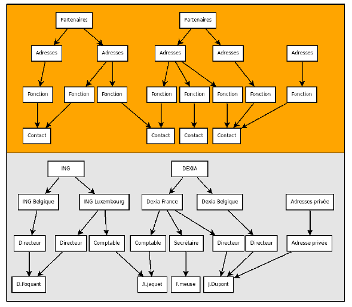
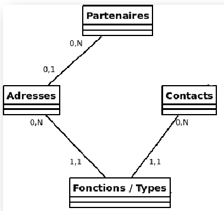
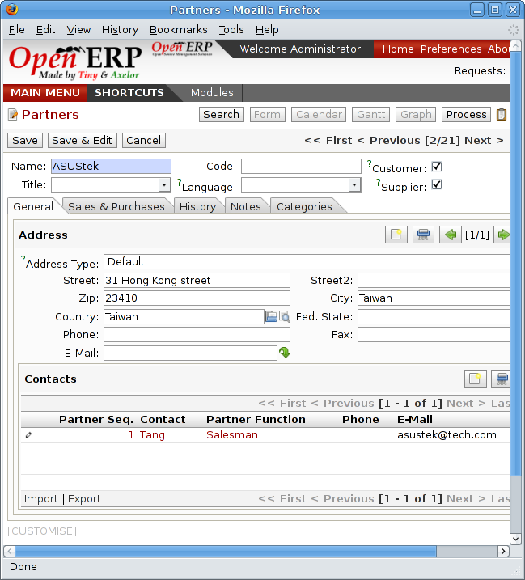
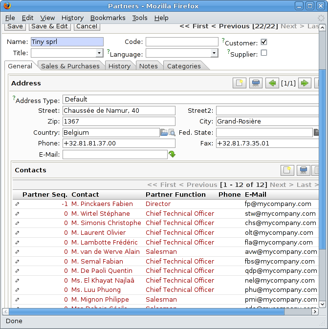

.. i18n: Managing Contacts
.. i18n: =================

Managing Contacts
=================

.. i18n: .. index::
.. i18n:    single: module; base_contact

.. index::
   single: module; base_contact

.. i18n: The standard way of representing partners and contacts throughout Open ERP
.. i18n: and many other enterprise systems (such as phone contact applications) 
.. i18n: is having a partner with multiple contacts.
.. i18n: *Partner* is the word for any entity that you do business with - supplier, customer, etc.
.. i18n: This representation may not be flexible enough for some uses, so Open ERP provides
.. i18n: an alternative, which is brought into the system by installing the :mod:`base_contact` module.

The standard way of representing partners and contacts throughout Open ERP
and many other enterprise systems (such as phone contact applications) 
is having a partner with multiple contacts.
*Partner* is the word for any entity that you do business with - supplier, customer, etc.
This representation may not be flexible enough for some uses, so Open ERP provides
an alternative, which is brought into the system by installing the :mod:`base_contact` module.

.. i18n: The two figures :ref:`fig-crmconw` and :ref:`fig-crmcono` show 
.. i18n: the structure of partners and contacts in the form of UML classes both 
.. i18n: with and without this :mod:`base_contact` module. 
.. i18n: For the non-programmer this diagram can be a bit of a brutal way
.. i18n: of showing it, but it's the clearest way to illustrate the
.. i18n: complexities that can be accomplished.

The two figures :ref:`fig-crmconw` and :ref:`fig-crmcono` show 
the structure of partners and contacts in the form of UML classes both 
with and without this :mod:`base_contact` module. 
For the non-programmer this diagram can be a bit of a brutal way
of showing it, but it's the clearest way to illustrate the
complexities that can be accomplished.

.. i18n: .. _fig-crmconw:
.. i18n: 
.. i18n: .. figure:: images/crm_contact_with.png
.. i18n:    :scale: 50
.. i18n:    :align: center
.. i18n: 
.. i18n:    *UML class diagram with base_contact module installed*

.. _fig-crmconw:

   *UML class diagram with base_contact module installed*

.. i18n: .. _fig-crmcono:
.. i18n: 
.. i18n: .. figure:: images/crm_contact_without.png
.. i18n:    :scale: 50
.. i18n:    :align: center
.. i18n: 
.. i18n:    *UML class diagram with base_contact module not installed*

.. _fig-crmcono:

   *UML class diagram with base_contact module not installed*

.. i18n: A concrete example may illustrate this concept of multiple relationships between contacts and
.. i18n: partners (companies) better. The figure :ref:`fig-crmcont` shows two companies each having several addresses (places of
.. i18n: business) and several contacts attached to these addresses.

A concrete example may illustrate this concept of multiple relationships between contacts and
partners (companies) better. The figure :ref:`fig-crmcont` shows two companies each having several addresses (places of
business) and several contacts attached to these addresses.

.. i18n: .. _fig-crmcont:
.. i18n: 
.. i18n: .. figure:: images/crm_contact_exemple.png
.. i18n:    :scale: 50
.. i18n:    :align: center
.. i18n: 
.. i18n:    *Example of a structure with management of partners and contacts*

.. _fig-crmcont:

.. figure:: images/crm_contact_exemple.png
   :scale: 50
   :align: center

   *Example of a structure with management of partners and contacts*

.. i18n: In this example you'll find the following elements:

In this example you'll find the following elements:

.. i18n: * The ABC bank has two places of business, represented by the addresses of ABC Belgium and ABC
.. i18n:   Luxembourg,
.. i18n: 
.. i18n: * The addresses of Dexey France and Dexey Belgium belong to the Dexey company,
.. i18n: 
.. i18n: * At the office of ABC Luxembourg, you have the contacts of the director (D Fogerty) and the
.. i18n:   accountant (A. Jacket),
.. i18n: 
.. i18n: * Mr Jacket holds the post of accountant for ABC Luxembourg and Dexey France,
.. i18n: 
.. i18n: * Mr J Smith is director of Dexey France and Dexey Belgium and we also have his private address
.. i18n:   attached to no partner.

* The ABC bank has two places of business, represented by the addresses of ABC Belgium and ABC
  Luxembourg,

* The addresses of Dexey France and Dexey Belgium belong to the Dexey company,

* At the office of ABC Luxembourg, you have the contacts of the director (D Fogerty) and the
  accountant (A. Jacket),

* Mr Jacket holds the post of accountant for ABC Luxembourg and Dexey France,

* Mr J Smith is director of Dexey France and Dexey Belgium and we also have his private address
  attached to no partner.

.. i18n: Depending on your needs, Open ERP provides three menus to access the same information:

Depending on your needs, Open ERP provides three menus to access the same information:

.. i18n: * List of partners: :menuselection:`Partners --> Partners`,
.. i18n: 
.. i18n: * List of contacts: :menuselection:`Partners --> Contacts`,
.. i18n: 
.. i18n: * List of posts held by contacts at partners: :menuselection:`Partners --> Contact's Jobs`.

* List of partners: :menuselection:`Partners --> Partners`,

* List of contacts: :menuselection:`Partners --> Contacts`,

* List of posts held by contacts at partners: :menuselection:`Partners --> Contact's Jobs`.

.. i18n: The three menus above are only three different views on the same data. If you correct a contact name
.. i18n: on the contact form, this will be modified on all the posts occupied in the different companies.

The three menus above are only three different views on the same data. If you correct a contact name
on the contact form, this will be modified on all the posts occupied in the different companies.

.. i18n: The screen above represents a partner form. You can see several possible address there and a list of
.. i18n: contacts above each address. For each contact you see a name, a function, a phone number and an
.. i18n: email.

The screen above represents a partner form. You can see several possible address there and a list of
contacts above each address. For each contact you see a name, a function, a phone number and an
email.

.. i18n: .. figure:: images/crm_partner_contact.png
.. i18n:    :scale: 50
.. i18n:    :align: center
.. i18n: 
.. i18n:    *A partner form with the base_contact module installed*

   *A partner form with the base_contact module installed*

.. i18n: If you click on the line you can get more detail about the function (such as start date, end date,
.. i18n: and fax) or enter into the contact form (such as personal phone, different posts occupied, and
.. i18n: personal blog).

If you click on the line you can get more detail about the function (such as start date, end date,
and fax) or enter into the contact form (such as personal phone, different posts occupied, and
personal blog).

.. i18n: .. figure:: images/crm_partner_poste.png
.. i18n:    :scale: 50
.. i18n:    :align: center
.. i18n: 
.. i18n:    *Detail of a job post occupied by a contact at a partner*

.. figure:: images/crm_partner_poste.png
   :scale: 50
   :align: center

   *Detail of a job post occupied by a contact at a partner*

.. i18n: .. figure:: images/crm_partner_contacts.png
.. i18n:    :scale: 50
.. i18n:    :align: center
.. i18n: 
.. i18n:    *Detail of a contact form for someone employed in several job posts*

   *Detail of a contact form for someone employed in several job posts*

.. i18n: Partner management is found in the Open ERP base modules. To manage partner relations you have to
.. i18n: install the CRM modules. Then start by installing a CRM profile and configure the system to meet
.. i18n: your needs.

Partner management is found in the Open ERP base modules. To manage partner relations you have to
install the CRM modules. Then start by installing a CRM profile and configure the system to meet
your needs.

.. i18n: For this chapter you should start with a fresh database that includes demo data,
.. i18n: using the :guilabel:`CRM profile` and no particular chart of accounts configured. 
.. i18n: Open ERP's modularity enables you to install only
.. i18n: the CRM module if your requirements are limited to customer relationships.

For this chapter you should start with a fresh database that includes demo data,
using the :guilabel:`CRM profile` and no particular chart of accounts configured. 
Open ERP's modularity enables you to install only
the CRM module if your requirements are limited to customer relationships.

.. i18n: .. figure:: images/crm_db_init.png
.. i18n:    :scale: 50
.. i18n:    :align: center
.. i18n: 
.. i18n:    *Creating a new database*

.. figure:: images/crm_db_init.png
   :scale: 50
   :align: center

   *Creating a new database*

.. i18n: Once the database is installed, Open ERP suggests that you configure it using a series of questions:

Once the database is installed, Open ERP suggests that you configure it using a series of questions:

.. i18n: * Creating users: click :guilabel:`Skip`,
.. i18n: 
.. i18n: * Simplified or Extended mode: select simplified and click :guilabel:`Ok`,
.. i18n: 
.. i18n: * Select the CRM functionality to install.

* Creating users: click :guilabel:`Skip`,

* Simplified or Extended mode: select simplified and click :guilabel:`Ok`,

* Select the CRM functionality to install.

.. i18n: .. figure:: images/ crm_db_select.png
.. i18n:    :scale: 50
.. i18n:    :align: center
.. i18n: 
.. i18n:    *Selecting the CRM functionality to install*

.. figure:: images/ crm_db_select.png
   :scale: 50
   :align: center

   *Selecting the CRM functionality to install*

.. i18n: .. index::
.. i18n:    single: module; crm_configuration

.. index::
   single: module; crm_configuration

.. i18n: .. note:: The CRM configuration module
.. i18n: 
.. i18n:    The pre-configuration of the management of customer relations to generate prospects,
.. i18n:    opportunities, and phone calls
.. i18n:    isn't supplied by the :mod:`crm` module itself but by the :mod:`crm_configuration` module.

.. note:: The CRM configuration module

   The pre-configuration of the management of customer relations to generate prospects,
   opportunities, and phone calls
   isn't supplied by the :mod:`crm` module itself but by the :mod:`crm_configuration` module.

.. i18n: If you install the modules separately don't forget to install the ``crm_configuration`` module.
.. i18n: The :mod:`crm` module just contains the generic case management system.

If you install the modules separately don't forget to install the ``crm_configuration`` module.
The :mod:`crm` module just contains the generic case management system.

.. i18n: Open ERP proposes a selection from pre-configured functions for CRM:

Open ERP proposes a selection from pre-configured functions for CRM:

.. i18n: * managing a prospects database,
.. i18n: 
.. i18n: * managing and tracking opportunities,
.. i18n: 
.. i18n: * managing meetings and the company calendar,
.. i18n: 
.. i18n: * managing pre-sales,
.. i18n: 
.. i18n: * managing phone calls and/or a call center,
.. i18n: 
.. i18n: * managing after-sales service,
.. i18n: 
.. i18n: * managing employment offers,
.. i18n: 
.. i18n: * managing technical service,
.. i18n: 
.. i18n: * tracking bugs and new functional requests.

* managing a prospects database,

* managing and tracking opportunities,

* managing meetings and the company calendar,

* managing pre-sales,

* managing phone calls and/or a call center,

* managing after-sales service,

* managing employment offers,

* managing technical service,

* tracking bugs and new functional requests.

.. i18n: You see that Open ERP's CRM module isn't limited just to Customer relationships but is designed to
.. i18n: generate all types of relations with a partner: such as suppliers, employees, customers, prospects.
.. i18n: This book will describe just customer relationships. The other CRM functions are similar to use, so
.. i18n: you shouldn't have huge problems with understanding those functions.

You see that Open ERP's CRM module isn't limited just to Customer relationships but is designed to
generate all types of relations with a partner: such as suppliers, employees, customers, prospects.
This book will describe just customer relationships. The other CRM functions are similar to use, so
you shouldn't have huge problems with understanding those functions.

.. i18n: The following cases will be looked at for this chapter

The following cases will be looked at for this chapter

.. i18n: * Prospect management,
.. i18n: 
.. i18n: * Opportunity management,
.. i18n: 
.. i18n: * Management of the company calendar,
.. i18n: 
.. i18n: * Management of phone calls.

* Prospect management,

* Opportunity management,

* Management of the company calendar,

* Management of phone calls.

.. i18n: The figure :ref:`fig-crmconwiz` shows the CRM module configuration screen after selecting some functions to
.. i18n: install.

The figure :ref:`fig-crmconwiz` shows the CRM module configuration screen after selecting some functions to
install.

.. i18n: .. _fig-crmconwiz:
.. i18n: 
.. i18n: .. figure:: images/crm_configuration_wizard.png
.. i18n:    :scale: 50
.. i18n:    :align: center
.. i18n: 
.. i18n:    *Selecting parameters for CRM modules for the reader of this chapter*

.. _fig-crmconwiz:

.. figure:: images/crm_configuration_wizard.png
   :scale: 50
   :align: center

   *Selecting parameters for CRM modules for the reader of this chapter*

.. i18n: Organizing Prospects
.. i18n: --------------------

Organizing Prospects
--------------------

.. i18n: If you have installed the management of prospects and opportunities, Open ERP implements the
.. i18n: following workflow for the qualification of prospects and future opportunities.

If you have installed the management of prospects and opportunities, Open ERP implements the
following workflow for the qualification of prospects and future opportunities.

.. i18n: .. figure:: images/crm_flux.png
.. i18n:    :scale: 50
.. i18n:    :align: center
.. i18n: 
.. i18n:    *Process of converting a prospect into a customer or opportunity*

.. figure:: images/crm_flux.png
   :scale: 50
   :align: center

   *Process of converting a prospect into a customer or opportunity*

.. i18n: .. Copyright © Open Object Press. All rights reserved.

.. Copyright © Open Object Press. All rights reserved.

.. i18n: .. You may take electronic copy of this publication and distribute it if you don't
.. i18n: .. change the content. You can also print a copy to be read by yourself only.

.. You may take electronic copy of this publication and distribute it if you don't
.. change the content. You can also print a copy to be read by yourself only.

.. i18n: .. We have contracts with different publishers in different countries to sell and
.. i18n: .. distribute paper or electronic based versions of this book (translated or not)
.. i18n: .. in bookstores. This helps to distribute and promote the Open ERP product. It
.. i18n: .. also helps us to create incentives to pay contributors and authors using author
.. i18n: .. rights of these sales.

.. We have contracts with different publishers in different countries to sell and
.. distribute paper or electronic based versions of this book (translated or not)
.. in bookstores. This helps to distribute and promote the Open ERP product. It
.. also helps us to create incentives to pay contributors and authors using author
.. rights of these sales.

.. i18n: .. Due to this, grants to translate, modify or sell this book are strictly
.. i18n: .. forbidden, unless Tiny SPRL (representing Open Object Press) gives you a
.. i18n: .. written authorisation for this.

.. Due to this, grants to translate, modify or sell this book are strictly
.. forbidden, unless Tiny SPRL (representing Open Object Press) gives you a
.. written authorisation for this.

.. i18n: .. Many of the designations used by manufacturers and suppliers to distinguish their
.. i18n: .. products are claimed as trademarks. Where those designations appear in this book,
.. i18n: .. and Open Object Press was aware of a trademark claim, the designations have been
.. i18n: .. printed in initial capitals.

.. Many of the designations used by manufacturers and suppliers to distinguish their
.. products are claimed as trademarks. Where those designations appear in this book,
.. and Open Object Press was aware of a trademark claim, the designations have been
.. printed in initial capitals.

.. i18n: .. While every precaution has been taken in the preparation of this book, the publisher
.. i18n: .. and the authors assume no responsibility for errors or omissions, or for damages
.. i18n: .. resulting from the use of the information contained herein.

.. While every precaution has been taken in the preparation of this book, the publisher
.. and the authors assume no responsibility for errors or omissions, or for damages
.. resulting from the use of the information contained herein.

.. i18n: .. Published by Open Object Press, Grand Rosière, Belgium

.. Published by Open Object Press, Grand Rosière, Belgium
