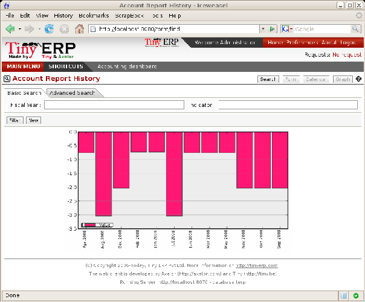
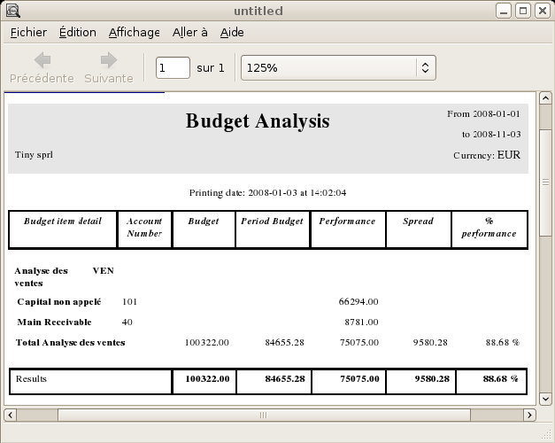
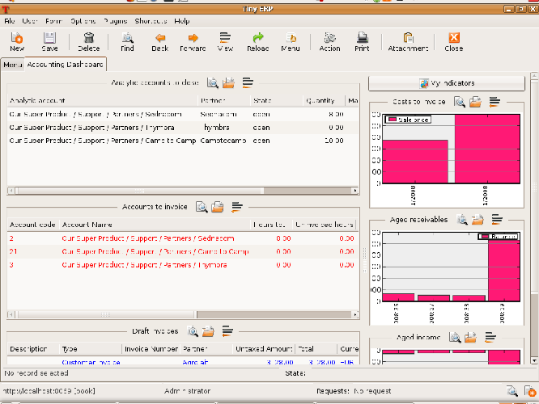

.. i18n: .. index::
.. i18n:   single: financial analysis
.. i18n: ..

.. index::
  single: financial analysis
..

.. i18n: Company Financial Analysis
.. i18n: ==========================

Company Financial Analysis
==========================

.. i18n: You'll see here the analysis tools for your company's financial situation, in particular:

You'll see here the analysis tools for your company's financial situation, in particular:

.. i18n: * management indicators,
.. i18n: 
.. i18n: * budgets,
.. i18n: 
.. i18n: * the accounting dashboard.

* management indicators,

* budgets,

* the accounting dashboard.

.. i18n: .. index:: indicators

.. index:: indicators

.. i18n: Management Indicators
.. i18n: ---------------------

Management Indicators
---------------------

.. i18n: .. note:: Financial Indicators
.. i18n: 
.. i18n: 	Indicators, sometimes called financial ratios, are tools for analyzing a company's finances.
.. i18n: 	They enable you to compare two accounts or sets of accounts from the balance sheet or the profit
.. i18n: 	and loss account, in the form of a ratio.
.. i18n: 	They also let you measure the financial health of a company and make comparisons from one year to
.. i18n: 	the next or against those of other companies.

.. note:: Financial Indicators

	Indicators, sometimes called financial ratios, are tools for analyzing a company's finances.
	They enable you to compare two accounts or sets of accounts from the balance sheet or the profit
	and loss account, in the form of a ratio.
	They also let you measure the financial health of a company and make comparisons from one year to
	the next or against those of other companies.

.. i18n: .. index::
.. i18n:    single: module; account_report

.. index::
   single: module; account_report

.. i18n: To define financial indicators in Open ERP you should install the module :mod:`account_report`.
.. i18n: When installing the module the usual financial indicators are registered in Open ERP.

To define financial indicators in Open ERP you should install the module :mod:`account_report`.
When installing the module the usual financial indicators are registered in Open ERP.

.. i18n: You can consult your indicators, calculated in real time, from the menu :menuselection:`Financial
.. i18n: Management --> Reporting --> Custom Reports`.

You can consult your indicators, calculated in real time, from the menu :menuselection:`Financial
Management --> Reporting --> Custom Reports`.

.. i18n: Indicators defined by default in Open ERP are the following:

Indicators defined by default in Open ERP are the following:

.. i18n: *  :guilabel:`Indicators of Working Capital` : determines if the company can pay its short term debts in
.. i18n:    normal conditions. It's calculated from \ ``(Stocks + Cash + Current Assets) / Current
.. i18n:    Liabilities``\  .
.. i18n: 
.. i18n: *  :guilabel:`Financial Ratios` : enables you to calculate the company's liquidity. It is defined as follows:
.. i18n:    \ ``( Current Assets – Stocks) / Current Liabilities``\  .
.. i18n: 
.. i18n: *  :guilabel:`Fixed Assets` : in a going concern, the value of fixed assets are covered in the first place by
.. i18n:    owners' capital and in the second place by all of the long term liabilities. Ideally this indicator
.. i18n:    will be greater than 1.

*  :guilabel:`Indicators of Working Capital` : determines if the company can pay its short term debts in
   normal conditions. It's calculated from \ ``(Stocks + Cash + Current Assets) / Current
   Liabilities``\  .

*  :guilabel:`Financial Ratios` : enables you to calculate the company's liquidity. It is defined as follows:
   \ ``( Current Assets – Stocks) / Current Liabilities``\  .

*  :guilabel:`Fixed Assets` : in a going concern, the value of fixed assets are covered in the first place by
   owners' capital and in the second place by all of the long term liabilities. Ideally this indicator
   will be greater than 1.

.. i18n: .. tip:: Calculation of indicators
.. i18n: 
.. i18n: 	Calculating indicators can take quite a while in Open ERP because you have to analyse the whole
.. i18n: 	company's accounting entries.
.. i18n: 
.. i18n: 	So it's best not to calculate all of the indicators at once, but just a small selection to keep
.. i18n: 	calculation time within limits.

.. tip:: Calculation of indicators

	Calculating indicators can take quite a while in Open ERP because you have to analyse the whole
	company's accounting entries.

	So it's best not to calculate all of the indicators at once, but just a small selection to keep
	calculation time within limits.

.. i18n: Time analysis of indicators
.. i18n: ^^^^^^^^^^^^^^^^^^^^^^^^^^^

Time analysis of indicators
^^^^^^^^^^^^^^^^^^^^^^^^^^^

.. i18n: You can analyze the financial indicators along two axes. You must have a figure calculated at a
.. i18n: particular instant of time when you compare accounts, balances and the ratios between them. But you
.. i18n: can also calculate a time series to follow the change of a given indicator throughout the life of
.. i18n: the company.

You can analyze the financial indicators along two axes. You must have a figure calculated at a
particular instant of time when you compare accounts, balances and the ratios between them. But you
can also calculate a time series to follow the change of a given indicator throughout the life of
the company.

.. i18n: .. index::
.. i18n:    single: module; account_report_history

.. index::
   single: module; account_report_history

.. i18n: To do a temporal analysis of your indicators, you must install the module 
.. i18n: :mod:`account_report_history` from the set of modules in addons-extra.

To do a temporal analysis of your indicators, you must install the module 
:mod:`account_report_history` from the set of modules in addons-extra.

.. i18n: Once this module is installed, you can click on a financial indicator to get a graph of its
.. i18n: evolution in time.

Once this module is installed, you can click on a financial indicator to get a graph of its
evolution in time.

.. i18n: .. figure::  images/account_report_history.png
.. i18n:    :scale: 50
.. i18n:    :align: center
.. i18n: 
.. i18n:    *History of an accounting indicator*

   *History of an accounting indicator*

.. i18n: Defining your own indicators
.. i18n: ^^^^^^^^^^^^^^^^^^^^^^^^^^^^

Defining your own indicators
^^^^^^^^^^^^^^^^^^^^^^^^^^^^

.. i18n: You can define your own indicators in Open ERP using the menu :menuselection:`Financial Management
.. i18n: --> Configuration --> Custom Reporting --> New Reporting Item Formula`.

You can define your own indicators in Open ERP using the menu :menuselection:`Financial Management
--> Configuration --> Custom Reporting --> New Reporting Item Formula`.

.. i18n: .. figure::  images/account_indicator_new.png
.. i18n:    :scale: 50
.. i18n:    :align: center
.. i18n: 
.. i18n:    *Defining a new indicator*

.. figure::  images/account_indicator_new.png
   :scale: 50
   :align: center

   *Defining a new indicator*

.. i18n: You should make sure that the accounts that you base indicators on are given unique account codes,
.. i18n: because codes are used in the creation of formulae. Create a formula using the syntax indicated in
.. i18n: the instructions at the bottom of the form:

You should make sure that the accounts that you base indicators on are given unique account codes,
because codes are used in the creation of formulae. Create a formula using the syntax indicated in
the instructions at the bottom of the form:

.. i18n: * Sum of debits in a general account: \ ``debit('12345')``\  ,
.. i18n: 
.. i18n: * Sum of credits in a general account: \ ``credit('12345')``\  ,
.. i18n: 
.. i18n: * Balance of a general account: \ ``balance('12345')``\  ,
.. i18n: 
.. i18n: * Value of another indicator: \ ``report ('IND')``\  .

* Sum of debits in a general account: \ ``debit('12345')``\  ,

* Sum of credits in a general account: \ ``credit('12345')``\  ,

* Balance of a general account: \ ``balance('12345')``\  ,

* Value of another indicator: \ ``report ('IND')``\  .

.. i18n: where:

where:

.. i18n: * \ ``12345``\   represents the code of a general account,
.. i18n: 
.. i18n: * \ ``IND``\   represents the code of another indicator.

* \ ``12345``\   represents the code of a general account,

* \ ``IND``\   represents the code of another indicator.

.. i18n: So, using this notation, the cash ratio is defined by \ ``balance('4', '5') / balance('1')``\   –
.. i18n: that's the balance in accounts 4 and 5 divided by the balance in account 1.

So, using this notation, the cash ratio is defined by \ ``balance('4', '5') / balance('1')``\   –
that's the balance in accounts 4 and 5 divided by the balance in account 1.

.. i18n: .. index::
.. i18n:   single: budgeting
.. i18n: ..

.. index::
  single: budgeting
..

.. i18n: Good management budgeting
.. i18n: -------------------------

Good management budgeting
-------------------------

.. i18n: Open ERP manages its budgets using both General and Analytic Accounts. You'll see how to do this
.. i18n: here for General Accounts and then in :ref:`ch-accts` for Analytical Accounts. 
.. i18n: Install :mod:`account_budget` to be able to do this.

Open ERP manages its budgets using both General and Analytic Accounts. You'll see how to do this
here for General Accounts and then in :ref:`ch-accts` for Analytical Accounts. 
Install :mod:`account_budget` to be able to do this.

.. i18n: Use the menu :menuselection:`Financial Management --> Configuration --> Budgets --> General Budgets`
.. i18n: to define a new budget.

Use the menu :menuselection:`Financial Management --> Configuration --> Budgets --> General Budgets`
to define a new budget.

.. i18n: .. index::
.. i18n:    single: budget revisions

.. index::
   single: budget revisions

.. i18n: .. tip:: Budget Revisions
.. i18n: 
.. i18n: 	Even though you *can* modify a budget at any time to make a revision of it, it's best if you don't do
.. i18n: 	that.
.. i18n: 
.. i18n: 	Rather than edit an existing budget document, make a new version so that you can keep your original
.. i18n: 	estimates safe for comparison. This lets you analyze your changing perspectives of the
.. i18n: 	company from revision to revision.

.. tip:: Budget Revisions

	Even though you *can* modify a budget at any time to make a revision of it, it's best if you don't do
	that.

	Rather than edit an existing budget document, make a new version so that you can keep your original
	estimates safe for comparison. This lets you analyze your changing perspectives of the
	company from revision to revision.

.. i18n: Begin data entry by entering a :guilabel:`Name`, a :guilabel:`Code`, 
.. i18n: and a :guilabel:`Start Date` and an :guilabel:`End Date` in your new budget. 
.. i18n: Then you can define the budgeted amounts within that period, one by one. For each, you define:

Begin data entry by entering a :guilabel:`Name`, a :guilabel:`Code`, 
and a :guilabel:`Start Date` and an :guilabel:`End Date` in your new budget. 
Then you can define the budgeted amounts within that period, one by one. For each, you define:

.. i18n: * an :guilabel:`Analytic Account`
.. i18n: 
.. i18n: * a :guilabel:`Budgetary Position` : for example :guilabel:`Sales` or :guilabel:`Purchases`,
.. i18n: 
.. i18n: * a :guilabel:`Start Date` and :guilabel:`End Date` for the use of the budget,
.. i18n: 
.. i18n: * a :guilabel:`Planned Amount` in the default currency of the chart of accounts.

* an :guilabel:`Analytic Account`

* a :guilabel:`Budgetary Position` : for example :guilabel:`Sales` or :guilabel:`Purchases`,

* a :guilabel:`Start Date` and :guilabel:`End Date` for the use of the budget,

* a :guilabel:`Planned Amount` in the default currency of the chart of accounts.

.. i18n: Once it's completed you can save your budget.

Once it's completed you can save your budget.

.. i18n: To print a budget and make calculations of expenditure to budget use the menu
.. i18n: :menuselection:`Financial Management --> Budgets --> Budget` Open ERP then gives you a
.. i18n: list of available budgets. Select one or more budgets and then click :guilabel:`Print Budgets` to create
.. i18n: the report for each in a date range of your choosing. 
.. i18n: The figure :ref:`fig-accbudg` gives an example of a budget produced by Open ERP.

To print a budget and make calculations of expenditure to budget use the menu
:menuselection:`Financial Management --> Budgets --> Budget` Open ERP then gives you a
list of available budgets. Select one or more budgets and then click :guilabel:`Print Budgets` to create
the report for each in a date range of your choosing. 
The figure :ref:`fig-accbudg` gives an example of a budget produced by Open ERP.

.. i18n: .. _fig-accbudg:
.. i18n: 
.. i18n: .. figure::  images/account_budget.png
.. i18n:    :scale: 50
.. i18n:    :align: center
.. i18n: 
.. i18n:    *Printing a budget*

.. _fig-accbudg:

   *Printing a budget*

.. i18n: You could also use the menu :menuselection:`Financial Management --> Reporting --> Budgets`
.. i18n: which gives you a choice of one or more :guilabel:`Budgetary Position` entries before 
.. i18n: clicking :guilabel:`Budget` and choosing a date range. This gives a budgetary analysis report for each
.. i18n: of the positions.

You could also use the menu :menuselection:`Financial Management --> Reporting --> Budgets`
which gives you a choice of one or more :guilabel:`Budgetary Position` entries before 
clicking :guilabel:`Budget` and choosing a date range. This gives a budgetary analysis report for each
of the positions.

.. i18n: The Accounting Dashboard
.. i18n: ------------------------

The Accounting Dashboard
------------------------

.. i18n: .. figure::  images/account_board.png
.. i18n:    :scale: 50
.. i18n:    :align: center
.. i18n: 
.. i18n:    *Accounting Dashboard*

   *Accounting Dashboard*

.. i18n: .. index::
.. i18n:    single: module; board_account

.. index::
   single: module; board_account

.. i18n: If you've installed the module :mod:`board_account`, Open ERP gives you an accounting dashboard
.. i18n: that can be presented to your accounting staff as they sign into the system (if you have set it as
.. i18n: their Home Page). This dashboard provides an analysis of the company's financial health at a glance.

If you've installed the module :mod:`board_account`, Open ERP gives you an accounting dashboard
that can be presented to your accounting staff as they sign into the system (if you have set it as
their Home Page). This dashboard provides an analysis of the company's financial health at a glance.

.. i18n: This gives a description of the different parts of the dashboard, from top to bottom then from left
.. i18n: to right:

This gives a description of the different parts of the dashboard, from top to bottom then from left
to right:

.. i18n: *  :guilabel:`Analytic accounts to close` : when you're managing cases each analytical account is a
.. i18n:    project or a contract. This area gives the accounts that must be closed (for example, contracts
.. i18n:    expired, support hours exceeded).
.. i18n: 
.. i18n: *  :guilabel:`Accounts to invoice` : shows analytical accounts where there are charges to be
.. i18n:    invoiced.
.. i18n: 
.. i18n: *  :guilabel:`Draft invoices` : gives the list of invoices waiting to be approved by an accountant.
.. i18n: 
.. i18n: *  :guilabel:`Costs to invoice` : gives the weekly changes which can be, but haven't yet been,
.. i18n:    invoiced.
.. i18n: 
.. i18n: *  :guilabel:`Aged receivables` : gives a weekly graph of the receivables that haven't yet been
.. i18n:    reconciled.
.. i18n: 
.. i18n: *  :guilabel:`Aged income` : gives a weekly graph of the company's turnover.

*  :guilabel:`Analytic accounts to close` : when you're managing cases each analytical account is a
   project or a contract. This area gives the accounts that must be closed (for example, contracts
   expired, support hours exceeded).

*  :guilabel:`Accounts to invoice` : shows analytical accounts where there are charges to be
   invoiced.

*  :guilabel:`Draft invoices` : gives the list of invoices waiting to be approved by an accountant.

*  :guilabel:`Costs to invoice` : gives the weekly changes which can be, but haven't yet been,
   invoiced.

*  :guilabel:`Aged receivables` : gives a weekly graph of the receivables that haven't yet been
   reconciled.

*  :guilabel:`Aged income` : gives a weekly graph of the company's turnover.

.. i18n: In each panel of the accountants' dashboard you can click the :guilabel:`Zoom` button at the top
.. i18n: right to investigate the detail of your financial indicators.

In each panel of the accountants' dashboard you can click the :guilabel:`Zoom` button at the top
right to investigate the detail of your financial indicators.

.. i18n: The Accounting dashboard is dynamically integrated, which means that you can navigate easily through
.. i18n: the data if you want more detail about certain factors, and edit the entries if necessary.

The Accounting dashboard is dynamically integrated, which means that you can navigate easily through
the data if you want more detail about certain factors, and edit the entries if necessary.

.. i18n: .. Copyright © Open Object Press. All rights reserved.

.. Copyright © Open Object Press. All rights reserved.

.. i18n: .. You may take electronic copy of this publication and distribute it if you don't
.. i18n: .. change the content. You can also print a copy to be read by yourself only.

.. You may take electronic copy of this publication and distribute it if you don't
.. change the content. You can also print a copy to be read by yourself only.

.. i18n: .. We have contracts with different publishers in different countries to sell and
.. i18n: .. distribute paper or electronic based versions of this book (translated or not)
.. i18n: .. in bookstores. This helps to distribute and promote the Open ERP product. It
.. i18n: .. also helps us to create incentives to pay contributors and authors using author
.. i18n: .. rights of these sales.

.. We have contracts with different publishers in different countries to sell and
.. distribute paper or electronic based versions of this book (translated or not)
.. in bookstores. This helps to distribute and promote the Open ERP product. It
.. also helps us to create incentives to pay contributors and authors using author
.. rights of these sales.

.. i18n: .. Due to this, grants to translate, modify or sell this book are strictly
.. i18n: .. forbidden, unless Tiny SPRL (representing Open Object Press) gives you a
.. i18n: .. written authorisation for this.

.. Due to this, grants to translate, modify or sell this book are strictly
.. forbidden, unless Tiny SPRL (representing Open Object Press) gives you a
.. written authorisation for this.

.. i18n: .. Many of the designations used by manufacturers and suppliers to distinguish their
.. i18n: .. products are claimed as trademarks. Where those designations appear in this book,
.. i18n: .. and Open Object Press was aware of a trademark claim, the designations have been
.. i18n: .. printed in initial capitals.

.. Many of the designations used by manufacturers and suppliers to distinguish their
.. products are claimed as trademarks. Where those designations appear in this book,
.. and Open Object Press was aware of a trademark claim, the designations have been
.. printed in initial capitals.

.. i18n: .. While every precaution has been taken in the preparation of this book, the publisher
.. i18n: .. and the authors assume no responsibility for errors or omissions, or for damages
.. i18n: .. resulting from the use of the information contained herein.

.. While every precaution has been taken in the preparation of this book, the publisher
.. and the authors assume no responsibility for errors or omissions, or for damages
.. resulting from the use of the information contained herein.

.. i18n: .. Published by Open Object Press, Grand Rosière, Belgium

.. Published by Open Object Press, Grand Rosière, Belgium
