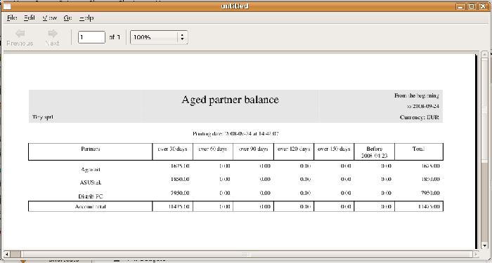
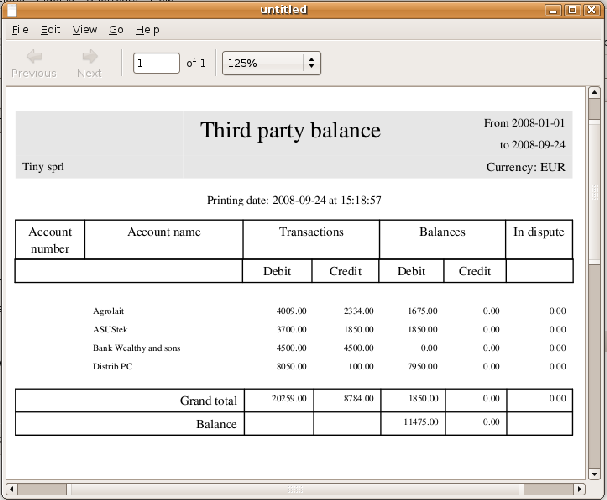

.. i18n: .. index::
.. i18n:    single: payable
.. i18n:    single: receivable
.. i18n:    single: creditor
.. i18n:    single: debtor

.. index::
   single: payable
   single: receivable
   single: creditor
   single: debtor

.. i18n: Managing accounts payable / creditors and accounts receivable / debtors
.. i18n: =======================================================================

Managing accounts payable / creditors and accounts receivable / debtors
=======================================================================

.. i18n: Open ERP provides many tools for managing customer and supplier accounts. You'll see here:

Open ERP provides many tools for managing customer and supplier accounts. You'll see here:

.. i18n: * financial analysis of partners, to understand the reports that enable you to carry out an analysis
.. i18n:   of all of your partners,
.. i18n: 
.. i18n: * multi-level reminders, which is an automatic system for preparing reminder letters or emails when
.. i18n:   invoices remain unpaid,
.. i18n: 
.. i18n: * detailed analysis of individual partners.

* financial analysis of partners, to understand the reports that enable you to carry out an analysis
  of all of your partners,

* multi-level reminders, which is an automatic system for preparing reminder letters or emails when
  invoices remain unpaid,

* detailed analysis of individual partners.

.. i18n: Financial analysis of partners
.. i18n: ------------------------------

Financial analysis of partners
------------------------------

.. i18n: .. index::
.. i18n:    single: module; board_account
.. i18n:    pair: dashboard; accounting

.. index::
   single: module; board_account
   pair: dashboard; accounting

.. i18n: When members of your accounts department sign on to the Open ERP system, they can immediately be
.. i18n: presented with the :guilabel:`Accounting Dashboard`. By default it contains a useful graph for analyzing
.. i18n: Receivables. To get access to it, install the module :mod:`board_account`. Then look at it using
.. i18n: the menu :menuselection:`Dashboards --> Accounting --> Accounting Dashboard`.

When members of your accounts department sign on to the Open ERP system, they can immediately be
presented with the :guilabel:`Accounting Dashboard`. By default it contains a useful graph for analyzing
Receivables. To get access to it, install the module :mod:`board_account`. Then look at it using
the menu :menuselection:`Dashboards --> Accounting --> Accounting Dashboard`.

.. i18n: .. figure::  images/account _board.png
.. i18n:    :scale: 50
.. i18n:    :align: center
.. i18n: 
.. i18n:    *Accounting Dashboard*

.. figure::  images/account _board.png
   :scale: 50
   :align: center

   *Accounting Dashboard*

.. i18n: .. index:: balance; aged

.. index:: balance; aged

.. i18n: In the dashboard, the graph at the right entitled :guilabel:`Aged Receivables` represents your
.. i18n: receivables week by week. That shows you at a glance the cumulative amount of your customer debtors
.. i18n: by week.

In the dashboard, the graph at the right entitled :guilabel:`Aged Receivables` represents your
receivables week by week. That shows you at a glance the cumulative amount of your customer debtors
by week.

.. i18n: All of Open ERP's graphs are dynamic. So you can, for example, filter the data by clicking
.. i18n: :guilabel:`Zoom` and then :guilabel:`Filter` on the Search form. Or just click on :guilabel:`Zoom`
.. i18n: to open in a larger window for a graph, then click :guilabel:`Search` to display this in a list
.. i18n: view.

All of Open ERP's graphs are dynamic. So you can, for example, filter the data by clicking
:guilabel:`Zoom` and then :guilabel:`Filter` on the Search form. Or just click on :guilabel:`Zoom`
to open in a larger window for a graph, then click :guilabel:`Search` to display this in a list
view.

.. i18n: To obtain a more detailed report of the aged balance (or order by past date) use the menu
.. i18n: :menuselection:`Finance --> Accounting --> Reporting --> Partner Accounts --> Aged Partner balance`.

To obtain a more detailed report of the aged balance (or order by past date) use the menu
:menuselection:`Finance --> Accounting --> Reporting --> Partner Accounts --> Aged Partner balance`.

.. i18n: .. figure::  images/account_balance.png
.. i18n:    :scale: 50
.. i18n:    :align: center
.. i18n: 
.. i18n:    *Aged balance using a 30 day period*

   *Aged balance using a 30 day period*

.. i18n: When opening that report, Open ERP asks for the name of the company, the fiscal period and the size
.. i18n: of the interval to be analyzed (in days). Open ERP then calculates a table of credit balance by
.. i18n: period. So if you request an interval of 30 days Open ERP generates an analysis of creditors for
.. i18n: the past month, past two months, and so on.

When opening that report, Open ERP asks for the name of the company, the fiscal period and the size
of the interval to be analyzed (in days). Open ERP then calculates a table of credit balance by
period. So if you request an interval of 30 days Open ERP generates an analysis of creditors for
the past month, past two months, and so on.

.. i18n: For an analysis by partner you can use the partner balance that you get through the menu
.. i18n: :menuselection:`Financial Management --> Reporting --> Partner Accounts --> Partner balance`. The
.. i18n: system then supplies you with a PDF report containing one line per partner representing the
.. i18n: cumulative credit balance.

For an analysis by partner you can use the partner balance that you get through the menu
:menuselection:`Financial Management --> Reporting --> Partner Accounts --> Partner balance`. The
system then supplies you with a PDF report containing one line per partner representing the
cumulative credit balance.

.. i18n: .. figure::  images/account_partner_balance.png
.. i18n:    :scale: 50
.. i18n:    :align: center
.. i18n: 
.. i18n:    *Partner balances*

   *Partner balances*

.. i18n: .. index:: ledger

.. index:: ledger

.. i18n: If you want detailed information about a partner you can use the partner ledgers that you reach
.. i18n: through the menu :menuselection:`Financial Management --> Reporting --> Partner Accounts --> Partner
.. i18n: Ledger`.

If you want detailed information about a partner you can use the partner ledgers that you reach
through the menu :menuselection:`Financial Management --> Reporting --> Partner Accounts --> Partner
Ledger`.

.. i18n: .. figure::  images/account_partner_ledger.png
.. i18n:    :scale: 50
.. i18n:    :align: center
.. i18n: 
.. i18n:    *Partner ledger*

.. figure::  images/account_partner_ledger.png
   :scale: 50
   :align: center

   *Partner ledger*

.. i18n: Finally you can look up individual account entries by searching for useful information. To search
.. i18n: for account entries:

Finally you can look up individual account entries by searching for useful information. To search
for account entries:

.. i18n: * by journal, go through the menu :menuselection:`Financial Management --> Entries Encoding --> 
.. i18n:   Entries Encoding by Line`,
.. i18n: 
.. i18n: * by account, go through the menu :menuselection:`Financial Management --> Charts --> Chart of
.. i18n:   Accounts` and double-click the appropriate account,
.. i18n: 
.. i18n: * by making a global search, go through the menu :menuselection:`Financial Management --> Entries Encoding
.. i18n:   --> Entries Encoding by Move` and searching,
.. i18n: 
.. i18n: * by partner, do it by navigating from a :guilabel:`Partner` field in any form that shows it to the partner then 
.. i18n:   using the buttons to the right of the partner form.

* by journal, go through the menu :menuselection:`Financial Management --> Entries Encoding --> 
  Entries Encoding by Line`,

* by account, go through the menu :menuselection:`Financial Management --> Charts --> Chart of
  Accounts` and double-click the appropriate account,

* by making a global search, go through the menu :menuselection:`Financial Management --> Entries Encoding
  --> Entries Encoding by Move` and searching,

* by partner, do it by navigating from a :guilabel:`Partner` field in any form that shows it to the partner then 
  using the buttons to the right of the partner form.

.. i18n: .. tip:: Exporting entries
.. i18n: 
.. i18n: 	It's helpful to remember that you can export all types of resource in Open ERP.
.. i18n: 	From the web client you need to navigate to a search list for the resource then click
.. i18n: 	the :guilabel:`Export` link at the bottom left of the list.
.. i18n: 	From the GTK client you'd use the menu :menuselection:`Form --> Export`.
.. i18n: 	This enables you to easily make your own analysis in Microsoft Excel or OpenOffice.org Calc,
.. i18n: 	by exporting accounting entries.

.. tip:: Exporting entries

	It's helpful to remember that you can export all types of resource in Open ERP.
	From the web client you need to navigate to a search list for the resource then click
	the :guilabel:`Export` link at the bottom left of the list.
	From the GTK client you'd use the menu :menuselection:`Form --> Export`.
	This enables you to easily make your own analysis in Microsoft Excel or OpenOffice.org Calc,
	by exporting accounting entries.

.. i18n: .. index::
.. i18n:    single: follow-up
.. i18n:    single: reminder
.. i18n:    single: module; account_followup

.. index::
   single: follow-up
   single: reminder
   single: module; account_followup

.. i18n: Multi-step follow-ups
.. i18n: ---------------------

Multi-step follow-ups
---------------------

.. i18n: To automate the management of followups (reminders) you must install the module 
.. i18n: :mod:`account_followup`. This is installed automatically as part of the accounting profile, but is
.. i18n: not part of the other profiles. Or you can install it alone.

To automate the management of followups (reminders) you must install the module 
:mod:`account_followup`. This is installed automatically as part of the accounting profile, but is
not part of the other profiles. Or you can install it alone.

.. i18n: Once the module is installed configure your levels of followup using the menu
.. i18n: :menuselection:`Financial Management --> Configuration --> Follow-Ups`.

Once the module is installed configure your levels of followup using the menu
:menuselection:`Financial Management --> Configuration --> Follow-Ups`.

.. i18n: The levels of follow-up are relative to the date of creation of an invoice and not the due date.
.. i18n: This enables you to put payment conditions such as 'payable in 21 days' and send a reminder in 30
.. i18n: days, or the converse.

The levels of follow-up are relative to the date of creation of an invoice and not the due date.
This enables you to put payment conditions such as 'payable in 21 days' and send a reminder in 30
days, or the converse.

.. i18n: For each level you should define the number of days and create a note which will automatically be
.. i18n: added into the reminder letter. The sequence determines the order of the level in ascending order.

For each level you should define the number of days and create a note which will automatically be
added into the reminder letter. The sequence determines the order of the level in ascending order.

.. i18n: .. csv-table::  Example of configuring followup levels
.. i18n:    :header: "Sequence","Level","Days","Description"
.. i18n:    :widths: 5, 5, 15, 15
.. i18n: 
.. i18n:    "1","Level 1","30 days net","First payment reminder"
.. i18n:    "2","Level 2","45 days net","Second reminder"
.. i18n:    "3","Level 3","60 days from end of month","Put on notice"

.. csv-table::  Example of configuring followup levels
   :header: "Sequence","Level","Days","Description"
   :widths: 5, 5, 15, 15

   "1","Level 1","30 days net","First payment reminder"
   "2","Level 2","45 days net","Second reminder"
   "3","Level 3","60 days from end of month","Put on notice"

.. i18n: You can send your reminders by mail and/or email with the menu :menuselection:`Financial Management
.. i18n: --> Periodical Processing --> Send followups`.

You can send your reminders by mail and/or email with the menu :menuselection:`Financial Management
--> Periodical Processing --> Send followups`.

.. i18n: .. figure::  images/account_followup_wizard.png
.. i18n:    :scale: 50
.. i18n:    :align: center
.. i18n: 
.. i18n:    *Form for preparing follow-up letters*

.. figure::  images/account_followup_wizard.png
   :scale: 50
   :align: center

   *Form for preparing follow-up letters*

.. i18n: Open ERP presents you with a list of partners who are due reminders, which you can modify before
.. i18n: starting the procedure. On the second tab of the form you can supply the information you'll send in
.. i18n: the email reminder.

Open ERP presents you with a list of partners who are due reminders, which you can modify before
starting the procedure. On the second tab of the form you can supply the information you'll send in
the email reminder.

.. i18n: The system then gives you a PDF report with all of the reminder letters for each partner. Each
.. i18n: letter is produced in the language of the partner (if that's available) and you can therefore get
.. i18n: letters in several languages in the same PDF on several pages.

The system then gives you a PDF report with all of the reminder letters for each partner. Each
letter is produced in the language of the partner (if that's available) and you can therefore get
letters in several languages in the same PDF on several pages.

.. i18n: To check the due date of customers and/or suppliers before starting the reminder procedure, use
.. i18n: the menu :menuselection:`Financial Management --> Periodical Processing --> Send followups`. 
.. i18n: You get a list of unreconciled entries accounts. You can then modify
.. i18n: the date and the last follow-up and the level of reminder for each entry.

To check the due date of customers and/or suppliers before starting the reminder procedure, use
the menu :menuselection:`Financial Management --> Periodical Processing --> Send followups`. 
You get a list of unreconciled entries accounts. You can then modify
the date and the last follow-up and the level of reminder for each entry.

.. i18n: To obtain a detailed report per partner use the menus in :menuselection:`Financial Management -->
.. i18n: Reporting --> Follow-Ups`.

To obtain a detailed report per partner use the menus in :menuselection:`Financial Management -->
Reporting --> Follow-Ups`.

.. i18n: The different reports are standard Open ERP screens, so you can filter them and explore the elements
.. i18n: in detail.

The different reports are standard Open ERP screens, so you can filter them and explore the elements
in detail.

.. i18n: .. figure::  images/account_followup.png
.. i18n:    :scale: 50
.. i18n:    :align: center
.. i18n: 
.. i18n:    *Summary screen for follow-ups*

.. figure::  images/account_followup.png
   :scale: 50
   :align: center

   *Summary screen for follow-ups*

.. i18n: .. index::
.. i18n:    single: overdue payments

.. index::
   single: overdue payments

.. i18n: Partner situation
.. i18n: -----------------

Partner situation
-----------------

.. i18n: In daily use of Open ERP a manager will often need to search quickly for financial
.. i18n: information amongst partner data. For this she can use the buttons to the right of form when she
.. i18n: opens a partner form, to go directly to:

In daily use of Open ERP a manager will often need to search quickly for financial
information amongst partner data. For this she can use the buttons to the right of form when she
opens a partner form, to go directly to:

.. i18n: * a follow-up letter from the :guilabel:`Overdue payments` Report button,
.. i18n: 
.. i18n: * the list of open :guilabel:`Invoices`,
.. i18n: 
.. i18n: * a shortcut to :guilabel:`All account entries`,
.. i18n: 
.. i18n: * the unclosed CRM requests from :guilabel:`Open cases`,
.. i18n: 
.. i18n: * a shortcut to the unreconciled :guilabel:`Receivables and Payables`.

* a follow-up letter from the :guilabel:`Overdue payments` Report button,

* the list of open :guilabel:`Invoices`,

* a shortcut to :guilabel:`All account entries`,

* the unclosed CRM requests from :guilabel:`Open cases`,

* a shortcut to the unreconciled :guilabel:`Receivables and Payables`.

.. i18n: The exact links depend on the modules that are installed in Open ERP.

The exact links depend on the modules that are installed in Open ERP.

.. i18n: These links are also available to her using the navigation features such as right-clicking partner
.. i18n: fields in the GTK client.

These links are also available to her using the navigation features such as right-clicking partner
fields in the GTK client.

.. i18n: The :guilabel:`Overdue payments` report produces a PDF document which is used for follow-up but it
.. i18n: doesn't modify any of the partner's accounting entries. Its use doesn't increase the follow-up
.. i18n: level so you can run this report repeatedly without any problem.

The :guilabel:`Overdue payments` report produces a PDF document which is used for follow-up but it
doesn't modify any of the partner's accounting entries. Its use doesn't increase the follow-up
level so you can run this report repeatedly without any problem.

.. i18n: In Open ERP you can search for a partner on the basis of the value of its trade receivables. So
.. i18n: search for partners with a credit amount between 1 and 99999999 and you'll get a list of partners
.. i18n: that owe you payment. You can then select the whole list and print follow-up letters for them all.

In Open ERP you can search for a partner on the basis of the value of its trade receivables. So
search for partners with a credit amount between 1 and 99999999 and you'll get a list of partners
that owe you payment. You can then select the whole list and print follow-up letters for them all.

.. i18n: To the right of the partner form there's a shortcut to :guilabel:`Invoices`. This link includes
.. i18n: all of the invoices defined in the systems, namely:

To the right of the partner form there's a shortcut to :guilabel:`Invoices`. This link includes
all of the invoices defined in the systems, namely:

.. i18n: * customer invoices,
.. i18n: 
.. i18n: * supplier invoices,
.. i18n: 
.. i18n: * credit notes,
.. i18n: 
.. i18n: * supplier credit notes.

* customer invoices,

* supplier invoices,

* credit notes,

* supplier credit notes.

.. i18n: .. tip::  Reminders from accounting entries
.. i18n: 
.. i18n: 	Companies that do not have computerized records tend to keep track of payments from invoices and
.. i18n: 	paperwork and not from a formal partner account.
.. i18n: 
.. i18n: 	It's better to create reminder letters from a partner's account receivable than from unpaid bills,
.. i18n: 	however.
.. i18n: 	By using the Open ERP system you can easily take account of all advances, unreconciled payments,
.. i18n: 	credit notes and credit payments.
.. i18n: 
.. i18n: 	So it's better to send a letter based on the accounting entries of invoices and unreconciled
.. i18n: 	payments than just on a list of unpaid invoices.

.. tip::  Reminders from accounting entries

	Companies that do not have computerized records tend to keep track of payments from invoices and
	paperwork and not from a formal partner account.

	It's better to create reminder letters from a partner's account receivable than from unpaid bills,
	however.
	By using the Open ERP system you can easily take account of all advances, unreconciled payments,
	credit notes and credit payments.

	So it's better to send a letter based on the accounting entries of invoices and unreconciled
	payments than just on a list of unpaid invoices.

.. i18n: In the links appearing on the partner form, two buttons enable the opening of partner accounting
.. i18n: entries:

In the links appearing on the partner form, two buttons enable the opening of partner accounting
entries:

.. i18n: *  :guilabel:`All account entries`,
.. i18n: 
.. i18n: *  :guilabel:`Receivables & Payables`.

*  :guilabel:`All account entries`,

*  :guilabel:`Receivables & Payables`.

.. i18n: The first button is useful for obtaining a historical analysis of the customer or supplier. You can
.. i18n: get information about such significant items as sales volume and payment delays. The second button
.. i18n: is a filter which shows only the open trade credits and debits for the partner.

The first button is useful for obtaining a historical analysis of the customer or supplier. You can
get information about such significant items as sales volume and payment delays. The second button
is a filter which shows only the open trade credits and debits for the partner.

.. i18n: .. Copyright © Open Object Press. All rights reserved.

.. Copyright © Open Object Press. All rights reserved.

.. i18n: .. You may take electronic copy of this publication and distribute it if you don't
.. i18n: .. change the content. You can also print a copy to be read by yourself only.

.. You may take electronic copy of this publication and distribute it if you don't
.. change the content. You can also print a copy to be read by yourself only.

.. i18n: .. We have contracts with different publishers in different countries to sell and
.. i18n: .. distribute paper or electronic based versions of this book (translated or not)
.. i18n: .. in bookstores. This helps to distribute and promote the Open ERP product. It
.. i18n: .. also helps us to create incentives to pay contributors and authors using author
.. i18n: .. rights of these sales.

.. We have contracts with different publishers in different countries to sell and
.. distribute paper or electronic based versions of this book (translated or not)
.. in bookstores. This helps to distribute and promote the Open ERP product. It
.. also helps us to create incentives to pay contributors and authors using author
.. rights of these sales.

.. i18n: .. Due to this, grants to translate, modify or sell this book are strictly
.. i18n: .. forbidden, unless Tiny SPRL (representing Open Object Press) gives you a
.. i18n: .. written authorisation for this.

.. Due to this, grants to translate, modify or sell this book are strictly
.. forbidden, unless Tiny SPRL (representing Open Object Press) gives you a
.. written authorisation for this.

.. i18n: .. Many of the designations used by manufacturers and suppliers to distinguish their
.. i18n: .. products are claimed as trademarks. Where those designations appear in this book,
.. i18n: .. and Open Object Press was aware of a trademark claim, the designations have been
.. i18n: .. printed in initial capitals.

.. Many of the designations used by manufacturers and suppliers to distinguish their
.. products are claimed as trademarks. Where those designations appear in this book,
.. and Open Object Press was aware of a trademark claim, the designations have been
.. printed in initial capitals.

.. i18n: .. While every precaution has been taken in the preparation of this book, the publisher
.. i18n: .. and the authors assume no responsibility for errors or omissions, or for damages
.. i18n: .. resulting from the use of the information contained herein.

.. While every precaution has been taken in the preparation of this book, the publisher
.. and the authors assume no responsibility for errors or omissions, or for damages
.. resulting from the use of the information contained herein.

.. i18n: .. Published by Open Object Press, Grand Rosière, Belgium

.. Published by Open Object Press, Grand Rosière, Belgium
