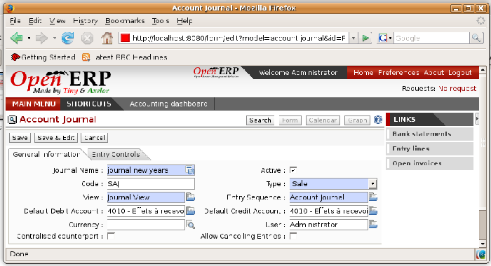

.. i18n: .. index::
.. i18n:    single: journal; configuring

.. index::
   single: journal; configuring

.. i18n: Journals
.. i18n: ========

Journals
========

.. i18n: All your accounting entries must appear in an accounting journal. So you must, at a minimum, create
.. i18n: a Sales Journal for customer invoices, a Purchase Journal for supplier invoices and a Cash Journal
.. i18n: for cash and bank transactions.

All your accounting entries must appear in an accounting journal. So you must, at a minimum, create
a Sales Journal for customer invoices, a Purchase Journal for supplier invoices and a Cash Journal
for cash and bank transactions.

.. i18n: Configuring a Journal
.. i18n: ---------------------

Configuring a Journal
---------------------

.. i18n: To view, edit or create new journals use the menu :menuselection:`Financial Management -->
.. i18n: Configuration --> Financial Accounting --> Financial Journals`.

To view, edit or create new journals use the menu :menuselection:`Financial Management -->
Configuration --> Financial Accounting --> Financial Journals`.

.. i18n: Just like General accounts, the journals can be deactivated to make them invisible: uncheck the
.. i18n: :guilabel:`Active` checkbox for that.

Just like General accounts, the journals can be deactivated to make them invisible: uncheck the
:guilabel:`Active` checkbox for that.

.. i18n: .. figure::  images/account_journal_form.png
.. i18n:    :scale: 50
.. i18n:    :align: center
.. i18n: 
.. i18n:    *Definition of an accounting journal*

   *Definition of an accounting journal*

.. i18n: You have to associate a view with each journal. The journal view indicates the fields that must be
.. i18n: visible and required to enter accounting data in that journal. The view determines both the order of
.. i18n: the fields and the properties of each field. For example the field :guilabel:`Account Number` must
.. i18n: appear when entering data in the bank journal but not in the other journals.

You have to associate a view with each journal. The journal view indicates the fields that must be
visible and required to enter accounting data in that journal. The view determines both the order of
the fields and the properties of each field. For example the field :guilabel:`Account Number` must
appear when entering data in the bank journal but not in the other journals.

.. i18n: Before creating a new view for a journal check that there's nothing similar already defined for
.. i18n: another journal. You should only create a new view for new types of journal.

Before creating a new view for a journal check that there's nothing similar already defined for
another journal. You should only create a new view for new types of journal.

.. i18n: .. note:: Customizing views
.. i18n: 
.. i18n: 	You'll often have to edit a journal view.
.. i18n: 	For example, for a journal in a foreign currency you add a field for the currency and this currency
.. i18n: 	must be in the journal view.
.. i18n: 
.. i18n: 	Conversely, to simplify data entry the journal view for the bank is quite different from one of the
.. i18n: 	invoicing journals.

.. note:: Customizing views

	You'll often have to edit a journal view.
	For example, for a journal in a foreign currency you add a field for the currency and this currency
	must be in the journal view.

	Conversely, to simplify data entry the journal view for the bank is quite different from one of the
	invoicing journals.

.. i18n: You can create a sequence for each journal. This sequence gives the automatic numbering for
.. i18n: accounting entries. Or several journals can use the same sequence if you want to define one for them
.. i18n: all.

You can create a sequence for each journal. This sequence gives the automatic numbering for
accounting entries. Or several journals can use the same sequence if you want to define one for them
all.

.. i18n: The credit and debit account by default permit the automatic generation of counterpart entries when
.. i18n: you're entering data in the journal quickly. For example, in a bank journal you should put an
.. i18n: associated bank account for default matching credits and debits, so that you don't have to create
.. i18n: counterparts for each transaction manually.

The credit and debit account by default permit the automatic generation of counterpart entries when
you're entering data in the journal quickly. For example, in a bank journal you should put an
associated bank account for default matching credits and debits, so that you don't have to create
counterparts for each transaction manually.

.. i18n: A journal can be marked as being centralized. When you do this, the counterpart entries won't be
.. i18n: owned by each entry but globally for the given journal and period. You'll then have a credit line
.. i18n: and a debit line centralized for each entry in one of these journals, meaning that both credit and
.. i18n: debit appear on the same line.

A journal can be marked as being centralized. When you do this, the counterpart entries won't be
owned by each entry but globally for the given journal and period. You'll then have a credit line
and a debit line centralized for each entry in one of these journals, meaning that both credit and
debit appear on the same line.

.. i18n: Controls and aids for data entry
.. i18n: --------------------------------

Controls and aids for data entry
--------------------------------

.. i18n: You can carry out two types of control on Journals in Open ERP – controls over the financial
.. i18n: accounts and access controls for groups of users. In addition to these controls you can also apply
.. i18n: all of the rights management detailed in :ref:`ch-config`.

You can carry out two types of control on Journals in Open ERP – controls over the financial
accounts and access controls for groups of users. In addition to these controls you can also apply
all of the rights management detailed in :ref:`ch-config`.

.. i18n: To avoid mistakes while entering accounts data, you can place conditions in the general accounts
.. i18n: about who can use a given account. To do this, you must list all the accounts or valid account types
.. i18n: in the second tab, :guilabel:`Entry Controls`. If you haven't added any accounts there, Open ERP applies no
.. i18n: restriction on data entry in the accounts or journals. If you list accounts and the types of account
.. i18n: that can be used in a journal, Open ERP prevents you from using any account not in that list. This
.. i18n: verification step starts from the moment you save the entry.

To avoid mistakes while entering accounts data, you can place conditions in the general accounts
about who can use a given account. To do this, you must list all the accounts or valid account types
in the second tab, :guilabel:`Entry Controls`. If you haven't added any accounts there, Open ERP applies no
restriction on data entry in the accounts or journals. If you list accounts and the types of account
that can be used in a journal, Open ERP prevents you from using any account not in that list. This
verification step starts from the moment you save the entry.

.. i18n: This functionality is useful for limiting possible data entry errors. Also, in a bank journal it's
.. i18n: possible to restrict the accounts that can be linked to a bank to classes 1 to 5. Using this you'd
.. i18n: help prevent the user from making any false entries in the journal.

This functionality is useful for limiting possible data entry errors. Also, in a bank journal it's
possible to restrict the accounts that can be linked to a bank to classes 1 to 5. Using this you'd
help prevent the user from making any false entries in the journal.

.. i18n: .. tip:: Control of data entry
.. i18n: 
.. i18n: 	In accounting it's not a good idea to allow a data entry directly from bank account A to bank
.. i18n: 	account B.
.. i18n: 	If you enter a transaction from bank A to bank B the transaction will be accounted for twice.
.. i18n: 
.. i18n: 	To prevent this problem, pass the transaction through intermediate account C.
.. i18n: 	At the time of data entry the system checks the type of account that's accepted in the bank
.. i18n: 	journal:
.. i18n: 	only accounts that aren't of type Bank are accepted.
.. i18n: 
.. i18n: 	If your accountant defines this control properly, non-accounting users are prevented from
.. i18n: 	transferring payment from one bank to another, reducing your risks.

.. tip:: Control of data entry

	In accounting it's not a good idea to allow a data entry directly from bank account A to bank
	account B.
	If you enter a transaction from bank A to bank B the transaction will be accounted for twice.

	To prevent this problem, pass the transaction through intermediate account C.
	At the time of data entry the system checks the type of account that's accepted in the bank
	journal:
	only accounts that aren't of type Bank are accepted.

	If your accountant defines this control properly, non-accounting users are prevented from
	transferring payment from one bank to another, reducing your risks.

.. i18n: .. Copyright © Open Object Press. All rights reserved.

.. Copyright © Open Object Press. All rights reserved.

.. i18n: .. You may take electronic copy of this publication and distribute it if you don't
.. i18n: .. change the content. You can also print a copy to be read by yourself only.

.. You may take electronic copy of this publication and distribute it if you don't
.. change the content. You can also print a copy to be read by yourself only.

.. i18n: .. We have contracts with different publishers in different countries to sell and
.. i18n: .. distribute paper or electronic based versions of this book (translated or not)
.. i18n: .. in bookstores. This helps to distribute and promote the Open ERP product. It
.. i18n: .. also helps us to create incentives to pay contributors and authors using author
.. i18n: .. rights of these sales.

.. We have contracts with different publishers in different countries to sell and
.. distribute paper or electronic based versions of this book (translated or not)
.. in bookstores. This helps to distribute and promote the Open ERP product. It
.. also helps us to create incentives to pay contributors and authors using author
.. rights of these sales.

.. i18n: .. Due to this, grants to translate, modify or sell this book are strictly
.. i18n: .. forbidden, unless Tiny SPRL (representing Open Object Press) gives you a
.. i18n: .. written authorisation for this.

.. Due to this, grants to translate, modify or sell this book are strictly
.. forbidden, unless Tiny SPRL (representing Open Object Press) gives you a
.. written authorisation for this.

.. i18n: .. Many of the designations used by manufacturers and suppliers to distinguish their
.. i18n: .. products are claimed as trademarks. Where those designations appear in this book,
.. i18n: .. and Open Object Press was aware of a trademark claim, the designations have been
.. i18n: .. printed in initial capitals.

.. Many of the designations used by manufacturers and suppliers to distinguish their
.. products are claimed as trademarks. Where those designations appear in this book,
.. and Open Object Press was aware of a trademark claim, the designations have been
.. printed in initial capitals.

.. i18n: .. While every precaution has been taken in the preparation of this book, the publisher
.. i18n: .. and the authors assume no responsibility for errors or omissions, or for damages
.. i18n: .. resulting from the use of the information contained herein.

.. While every precaution has been taken in the preparation of this book, the publisher
.. and the authors assume no responsibility for errors or omissions, or for damages
.. resulting from the use of the information contained herein.

.. i18n: .. Published by Open Object Press, Grand Rosière, Belgium

.. Published by Open Object Press, Grand Rosière, Belgium
