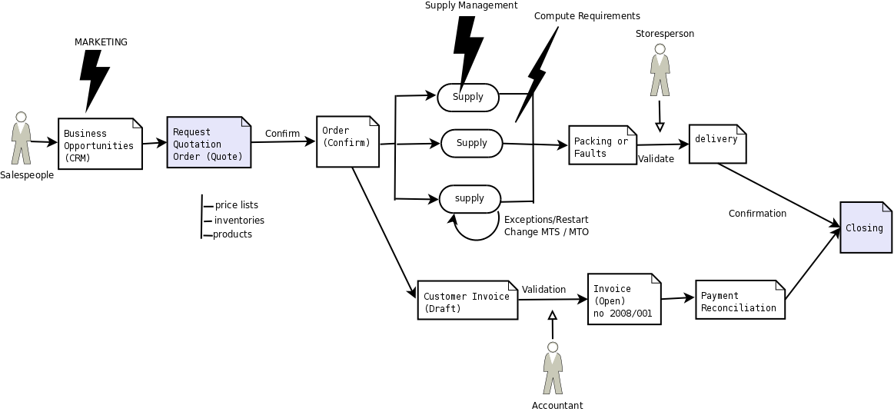
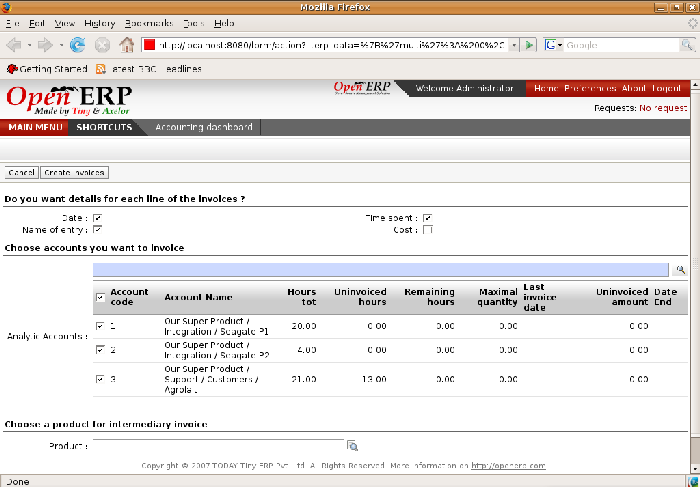

.. i18n: .. index::
.. i18n:    pair: service; contract

.. index::
   pair: service; contract

.. i18n: Managing Service Contracts
.. i18n: ==========================

Managing Service Contracts
==========================

.. i18n: Contracts can take different forms within Open ERP, depending on their nature. So you can have
.. i18n: several distinct types of services contract, such as:

Contracts can take different forms within Open ERP, depending on their nature. So you can have
several distinct types of services contract, such as:

.. i18n: * fixed-price contracts,
.. i18n: 
.. i18n: * cost-reimbursement contracts, invoiced when services are completed,
.. i18n: 
.. i18n: * fixed-price contracts, invoiced monthly as services are carried out.

* fixed-price contracts,

* cost-reimbursement contracts, invoiced when services are completed,

* fixed-price contracts, invoiced monthly as services are carried out.

.. i18n: .. tip:: Contract quotations
.. i18n: 
.. i18n: 	Some companies commit to contracts on the basis of a requested volume at a certain price for a
.. i18n: 	defined period.
.. i18n: 	In such a case the contract is represented by a pricelist for that specific customer.
.. i18n: 
.. i18n: 	The pricelist is linked in the :guilabel:`Properties` tab of the customer's :guilabel:`Partner` form,
.. i18n: 	so that it is brought up whenever anything is bought from or sold to this partner
.. i18n: 	(depending on whether it's a purchase or sales agreement).
.. i18n: 	Open ERP automatically selects the price based on this agreed pricelist.

.. tip:: Contract quotations

	Some companies commit to contracts on the basis of a requested volume at a certain price for a
	defined period.
	In such a case the contract is represented by a pricelist for that specific customer.

	The pricelist is linked in the :guilabel:`Properties` tab of the customer's :guilabel:`Partner` form,
	so that it is brought up whenever anything is bought from or sold to this partner
	(depending on whether it's a purchase or sales agreement).
	Open ERP automatically selects the price based on this agreed pricelist.

.. i18n: Fixed Price contracts
.. i18n: ---------------------

Fixed Price contracts
---------------------

.. i18n: Fixed price contracts for the sale of services are represented in Open ERP by a Sales Order. In
.. i18n: this case, the supply of services is managed just like all other stockable or consumable products.

Fixed price contracts for the sale of services are represented in Open ERP by a Sales Order. In
this case, the supply of services is managed just like all other stockable or consumable products.

.. i18n: You can add new orders using the menu :menuselection:`Sales Management --> Sales Orders --> New Quotation`.

You can add new orders using the menu :menuselection:`Sales Management --> Sales Orders --> New Quotation`.

.. i18n: The new Sales Order document starts in the \ ``Quotation``\   state, so the estimate has no
.. i18n: accounting impact on the system until it's confirmed. When you approve the document, your estimate
.. i18n: moves into the state \ ``In Progress``\  .

The new Sales Order document starts in the \ ``Quotation``\   state, so the estimate has no
accounting impact on the system until it's confirmed. When you approve the document, your estimate
moves into the state \ ``In Progress``\  .

.. i18n: .. figure::  images/service_sale_workflow.png
.. i18n:    :scale: 50
.. i18n:    :align: center
.. i18n: 
.. i18n:    *Process for handling a Sales Order*

   *Process for handling a Sales Order*

.. i18n: Once the order has been approved, Open ERP will automatically generate an invoice and/or a delivery
.. i18n: document proposal based on the parameters you set in the order.

Once the order has been approved, Open ERP will automatically generate an invoice and/or a delivery
document proposal based on the parameters you set in the order.

.. i18n: The invoice will be managed by the system depending on the setting of the field :guilabel:`Shipping
.. i18n: Policy` on the order's second tab :guilabel:`Other data` :

The invoice will be managed by the system depending on the setting of the field :guilabel:`Shipping
Policy` on the order's second tab :guilabel:`Other data` :

.. i18n: *  :guilabel:`Payment before delivery` : Open ERP creates an invoice in the \ ``Draft``\   state.
.. i18n:    Once this is confirmed and paid the delivery is activated.
.. i18n: 
.. i18n: *  :guilabel:`Invoice on Order After Delivery` : the delivery order is produced when the order is
.. i18n:    validated. A draft invoice is then created when the delivery has been completed.
.. i18n: 
.. i18n: *  :guilabel:`Shipping & Manual Invoice` : Open ERP starts the delivery from the confirmation of
.. i18n:    the order, and adds a button which you manually click when you're ready to create an invoice.
.. i18n: 
.. i18n: *  :guilabel:`Invoice from the Packing` : invoices are created from the packing stage.

*  :guilabel:`Payment before delivery` : Open ERP creates an invoice in the \ ``Draft``\   state.
   Once this is confirmed and paid the delivery is activated.

*  :guilabel:`Invoice on Order After Delivery` : the delivery order is produced when the order is
   validated. A draft invoice is then created when the delivery has been completed.

*  :guilabel:`Shipping & Manual Invoice` : Open ERP starts the delivery from the confirmation of
   the order, and adds a button which you manually click when you're ready to create an invoice.

*  :guilabel:`Invoice from the Packing` : invoices are created from the packing stage.

.. i18n: .. index:: delivery

.. index:: delivery

.. i18n: .. note:: Delivery of an order
.. i18n: 
.. i18n: 	The term 'delivery' should be taken in the broadest sense in Open ERP.
.. i18n: 	The effect of a delivery depends on the configuration of the sold product.
.. i18n: 
.. i18n: 	If its type is either Stockable Product or Consumable, Open ERP will make a request for it to be
.. i18n: 	sent for packing.
.. i18n: 	If the product's type is Service Open ERP's scheduler will create a task in the project management
.. i18n: 	system,
.. i18n: 	or create a subcontract purchase order if the product's Procure Method is Make to Order.
.. i18n: 
.. i18n: 	Invoicing after delivery does as it says: invoicing for the services when the tasks have been
.. i18n: 	closed.

.. note:: Delivery of an order

	The term 'delivery' should be taken in the broadest sense in Open ERP.
	The effect of a delivery depends on the configuration of the sold product.

	If its type is either Stockable Product or Consumable, Open ERP will make a request for it to be
	sent for packing.
	If the product's type is Service Open ERP's scheduler will create a task in the project management
	system,
	or create a subcontract purchase order if the product's Procure Method is Make to Order.

	Invoicing after delivery does as it says: invoicing for the services when the tasks have been
	closed.

.. i18n: When you sign a new contract you can just enter the order into the system and Open ERP will track
.. i18n: the order.

When you sign a new contract you can just enter the order into the system and Open ERP will track
the order.

.. i18n: This works well for small orders. But for larger value services orders you might want to invoice
.. i18n: several times through the contract, for example:

This works well for small orders. But for larger value services orders you might want to invoice
several times through the contract, for example:

.. i18n: * 30% on order,
.. i18n: 
.. i18n: * 40% on completion,
.. i18n: 
.. i18n: * 30% one month after the system has gone into production.

* 30% on order,

* 40% on completion,

* 30% one month after the system has gone into production.

.. i18n: In this case you should create several invoices for the one Sales Order. You've two options for this:

In this case you should create several invoices for the one Sales Order. You've two options for this:

.. i18n: * Don't handle invoicing automatically from the Sales Order but carry out manual invoicing instead,
.. i18n: 
.. i18n: * Create draft invoices and then link to them in the third tab :guilabel:`History` of the
.. i18n:   Sales Order, in the :guilabel:`Related
.. i18n:   Invoices` section. When you create an invoice from the order, Open ERP deducts the amounts of the
.. i18n:   invoices already linked to the order to calculate the proposed invoice value.

* Don't handle invoicing automatically from the Sales Order but carry out manual invoicing instead,

* Create draft invoices and then link to them in the third tab :guilabel:`History` of the
  Sales Order, in the :guilabel:`Related
  Invoices` section. When you create an invoice from the order, Open ERP deducts the amounts of the
  invoices already linked to the order to calculate the proposed invoice value.

.. i18n: Cost-reimbursement contracts
.. i18n: ----------------------------

Cost-reimbursement contracts
----------------------------

.. i18n: Some contracts aren't invoiced from a price fixed on the order but from the cost of the services
.. i18n: carried out. That's usually what happens in the building sector or in large projects.

Some contracts aren't invoiced from a price fixed on the order but from the cost of the services
carried out. That's usually what happens in the building sector or in large projects.

.. i18n: .. index::
.. i18n:    single: module; hr_timesheet_invoice

.. index::
   single: module; hr_timesheet_invoice

.. i18n: The approach you use for this is totally different because instead of using the sales order as the
.. i18n: basis of the invoice you use the analytic accounts. For this you have to install the module 
.. i18n: :mod:`hr_timesheet_invoice`.

The approach you use for this is totally different because instead of using the sales order as the
basis of the invoice you use the analytic accounts. For this you have to install the module 
:mod:`hr_timesheet_invoice`.

.. i18n: An analytic account is created for each new contract. The following fields must be completed in this
.. i18n: analytic account:

An analytic account is created for each new contract. The following fields must be completed in this
analytic account:

.. i18n: *  :guilabel:`Partner` : partner associated with the contract,
.. i18n: 
.. i18n: *  :guilabel:`Sale Pricelist`,
.. i18n: 
.. i18n: *  :guilabel:`Invoicing`.

*  :guilabel:`Partner` : partner associated with the contract,

*  :guilabel:`Sale Pricelist`,

*  :guilabel:`Invoicing`.

.. i18n: The selection of an invoicing rate is an indirect way of specifying that the project will be
.. i18n: invoiced on the basis of analytic costs. This can take different forms, such as delivery of
.. i18n: services, purchase of raw materials, and expense reimbursements.

The selection of an invoicing rate is an indirect way of specifying that the project will be
invoiced on the basis of analytic costs. This can take different forms, such as delivery of
services, purchase of raw materials, and expense reimbursements.

.. i18n: .. index::
.. i18n:    single: pricelist
.. i18n: ..

.. index::
   single: pricelist
..

.. i18n: .. note:: Pricelists and billing rates
.. i18n: 
.. i18n: 	You can select a pricelist on the analytic account without having to use it to specify billing
.. i18n: 	rates.
.. i18n: 
.. i18n: 	An example of this is a client project that is to be invoiced only indirectly from the analytic
.. i18n: 	costs.
.. i18n: 	Putting the price list on the analytic account makes it possible to compare the actual sales with
.. i18n: 	a best case situation where all the services would be invoiced.
.. i18n: 	To get this comparison you have to print the analytic balance from the analytic account.

.. note:: Pricelists and billing rates

	You can select a pricelist on the analytic account without having to use it to specify billing
	rates.

	An example of this is a client project that is to be invoiced only indirectly from the analytic
	costs.
	Putting the price list on the analytic account makes it possible to compare the actual sales with
	a best case situation where all the services would be invoiced.
	To get this comparison you have to print the analytic balance from the analytic account.

.. i18n: Services are then entered onto timesheets by the various people who work on the project.
.. i18n: Periodically the project manager or account manager uses the following menu to prepare an invoice
.. i18n: :menuselection:`Financial Management --> Periodical Processing --> Entries to Invoice -->
.. i18n: Uninvoiced Entries`.

Services are then entered onto timesheets by the various people who work on the project.
Periodically the project manager or account manager uses the following menu to prepare an invoice
:menuselection:`Financial Management --> Periodical Processing --> Entries to Invoice -->
Uninvoiced Entries`.

.. i18n: Open ERP then displays all of the costs that haven't yet been invoiced. You can filter the proposed
.. i18n: list and click the appropriate action button to generate the corresponding invoices. You can select
.. i18n: the level of detail which is reported on the invoice, such as the date and details of the services.

Open ERP then displays all of the costs that haven't yet been invoiced. You can filter the proposed
list and click the appropriate action button to generate the corresponding invoices. You can select
the level of detail which is reported on the invoice, such as the date and details of the services.

.. i18n: .. figure::  images/service_timesheet_invoice.png
.. i18n:    :scale: 50
.. i18n:    :align: center
.. i18n: 
.. i18n:    *Screen for invoicing services*

   *Screen for invoicing services*

.. i18n: .. index::
.. i18n:    single: module; account_analytic_analysis

.. index::
   single: module; account_analytic_analysis

.. i18n: .. note:: Project Management and analytic accounts
.. i18n: 
.. i18n: 	The menu :menuselection:`Project Management --> Financial Project Management --> Analytic Accounts`
.. i18n: 	is only available once you have
.. i18n: 	installed the module :mod:`account_analytic_analysis`.
.. i18n: 	It provides various global financial and operational views of a project manager's projects.

.. note:: Project Management and analytic accounts

	The menu :menuselection:`Project Management --> Financial Project Management --> Analytic Accounts`
	is only available once you have
	installed the module :mod:`account_analytic_analysis`.
	It provides various global financial and operational views of a project manager's projects.

.. i18n: .. todo:: I can't find this button or the action below

.. todo:: I can't find this button or the action below

.. i18n: Select a project and open its analytic entries using the :guilabel:`Costs to invoice` button. You'll
.. i18n: find a list of costs that can be invoiced to the client:

Select a project and open its analytic entries using the :guilabel:`Costs to invoice` button. You'll
find a list of costs that can be invoiced to the client:

.. i18n: * time worked,
.. i18n: 
.. i18n: * expenses reimbursement,
.. i18n: 
.. i18n: * purchase of raw materials.

* time worked,

* expenses reimbursement,

* purchase of raw materials.

.. i18n: You can then invoice the selected lines using the action :guilabel:`Invoice costs`.

You can then invoice the selected lines using the action :guilabel:`Invoice costs`.

.. i18n: Fixed-price contracts invoiced as services are worked
.. i18n: -----------------------------------------------------

Fixed-price contracts invoiced as services are worked
-----------------------------------------------------

.. i18n: For larger-value projects, fixed-price invoicing based on the sales order isn't always appropriate.
.. i18n: In the case of a services project planned to run for about six months. invoicing could be based on
.. i18n: the following:

For larger-value projects, fixed-price invoicing based on the sales order isn't always appropriate.
In the case of a services project planned to run for about six months. invoicing could be based on
the following:

.. i18n: * 30% on order,
.. i18n: 
.. i18n: * 30% at the project mid-point,
.. i18n: 
.. i18n: * 40% at delivery.

* 30% on order,

* 30% at the project mid-point,

* 40% at delivery.

.. i18n: Such an approach is often used in a company but there are other options. This method of invoicing
.. i18n: can pose many problems for the organization and invoicing of the project:

Such an approach is often used in a company but there are other options. This method of invoicing
can pose many problems for the organization and invoicing of the project:

.. i18n: * It's extremely difficult to determine if the project is on track or not. The endpoint is fuzzy,
.. i18n:   which can result in a tricky discussion with the client at the moment of final invoicing.
.. i18n: 
.. i18n: * If the project takes more or less time than forecast, it will effectively result in under- or
.. i18n:   over-invoicing during the project.
.. i18n: 
.. i18n: * Whether you get a proper return can depend on the client. For example if the client takes a long
.. i18n:   time to sign off on project acceptance you can't invoice the remaining 40% even though you might
.. i18n:   have supplied the agreed service properly.
.. i18n: 
.. i18n: * The account manager and the project manager are often different people (see the section :ref:`sect-projroles`
.. i18n:   in the chapter :ref:`ch-projects`).
.. i18n:   The project manager has to
.. i18n:   alert the account manager the moment that the client can be invoiced, but that moment easily can be
.. i18n:   forgotten or mistaken.
.. i18n: 
.. i18n: * The project can be fixed for service costs but have agreed extras, such as reimbursement for
.. i18n:   travel expenses. Invoicing from the order doesn't adapt well to such an approach.

* It's extremely difficult to determine if the project is on track or not. The endpoint is fuzzy,
  which can result in a tricky discussion with the client at the moment of final invoicing.

* If the project takes more or less time than forecast, it will effectively result in under- or
  over-invoicing during the project.

* Whether you get a proper return can depend on the client. For example if the client takes a long
  time to sign off on project acceptance you can't invoice the remaining 40% even though you might
  have supplied the agreed service properly.

* The account manager and the project manager are often different people (see the section :ref:`sect-projroles`
  in the chapter :ref:`ch-projects`).
  The project manager has to
  alert the account manager the moment that the client can be invoiced, but that moment easily can be
  forgotten or mistaken.

* The project can be fixed for service costs but have agreed extras, such as reimbursement for
  travel expenses. Invoicing from the order doesn't adapt well to such an approach.

.. i18n: Open ERP provides a third method for invoicing services that can be useful on long projects. This
.. i18n: consists of invoicing the project periodically on the basis of time worked up to a fixed amount that
.. i18n: can't be exceeded. At the end of the project a final invoice or a credit note is generated to meet
.. i18n: the total amount of value fixed for the project.

Open ERP provides a third method for invoicing services that can be useful on long projects. This
consists of invoicing the project periodically on the basis of time worked up to a fixed amount that
can't be exceeded. At the end of the project a final invoice or a credit note is generated to meet
the total amount of value fixed for the project.

.. i18n: To configure such a project you must set an invoicing rate, a pricelist and a maximum amount on the
.. i18n: analytic account for the project. The services are then invoiced throughout the project by the
.. i18n: different project or account managers, just like projects that are invoiced by time used. The
.. i18n: managers can apply a refund on the final invoice if the project takes more time to complete than
.. i18n: permitted under the contract.

To configure such a project you must set an invoicing rate, a pricelist and a maximum amount on the
analytic account for the project. The services are then invoiced throughout the project by the
different project or account managers, just like projects that are invoiced by time used. The
managers can apply a refund on the final invoice if the project takes more time to complete than
permitted under the contract.

.. i18n: When the project is finished you can generate the closing invoice using the  *Final Invoice*  button
.. i18n: on the analytic account. This automatically calculates the final balance of the bill, taking the
.. i18n: amounts already charged into account. If the amount already invoiced is greater than the maximum
.. i18n: agreed amount then Open ERP generates a draft credit note.

When the project is finished you can generate the closing invoice using the  *Final Invoice*  button
on the analytic account. This automatically calculates the final balance of the bill, taking the
amounts already charged into account. If the amount already invoiced is greater than the maximum
agreed amount then Open ERP generates a draft credit note.

.. i18n: This approach offers many advantages compared with the traditional methods of invoicing in phases
.. i18n: for fixed-price contracts:

This approach offers many advantages compared with the traditional methods of invoicing in phases
for fixed-price contracts:

.. i18n: * Fixed-price contracts and cost-reimbursable contracts are invoiced in the same way, which makes
.. i18n:   the company's invoicing process quite simple and systematic even when the projects are mixed.
.. i18n: 
.. i18n: * Everything is invoiced on the basis of worked time, making it easy to forecast invoicing from
.. i18n:   plans linked to the different analytical accounts.
.. i18n: 
.. i18n: * This method of proceeding educates project managers just as much as the client because refunds
.. i18n:   have to be given for work done if the project slips.
.. i18n: 
.. i18n: * Invoicing follows the course of the project and avoids a supplier's dependence on the goodwill of
.. i18n:   the client in approving certain phases.
.. i18n: 
.. i18n: * Invoicing of expenses follows the same workflow and is therefore very simple.

* Fixed-price contracts and cost-reimbursable contracts are invoiced in the same way, which makes
  the company's invoicing process quite simple and systematic even when the projects are mixed.

* Everything is invoiced on the basis of worked time, making it easy to forecast invoicing from
  plans linked to the different analytical accounts.

* This method of proceeding educates project managers just as much as the client because refunds
  have to be given for work done if the project slips.

* Invoicing follows the course of the project and avoids a supplier's dependence on the goodwill of
  the client in approving certain phases.

* Invoicing of expenses follows the same workflow and is therefore very simple.

.. i18n: .. note:: Negotiating contracts
.. i18n: 
.. i18n: 	In contract negotiation, invoicing conditions are often neglected by the client.
.. i18n: 	So it can often be straightforward to apply this method of invoicing.

.. note:: Negotiating contracts

	In contract negotiation, invoicing conditions are often neglected by the client.
	So it can often be straightforward to apply this method of invoicing.

.. i18n: Contracts limited to a quantity
.. i18n: -------------------------------

Contracts limited to a quantity
-------------------------------

.. i18n: .. index::
.. i18n:    single: module; account_analytic_analysis

.. index::
   single: module; account_analytic_analysis

.. i18n: Finally certain contracts are expressed in terms of a quantity rather than a fixed amount. Support
.. i18n: contracts comprising a number of prepaid hours are a case in point. To generate such contracts in
.. i18n: Open ERP you should start by installing the module :mod:`account_analytic_analysis`.

Finally certain contracts are expressed in terms of a quantity rather than a fixed amount. Support
contracts comprising a number of prepaid hours are a case in point. To generate such contracts in
Open ERP you should start by installing the module :mod:`account_analytic_analysis`.

.. i18n: Then you can set a maximum number of hours for each analytic account. When employees enter their
.. i18n: time worked on the support contract in the timesheets, the hours are automatically deducted from the
.. i18n: maximum set on each analytic account.

Then you can set a maximum number of hours for each analytic account. When employees enter their
time worked on the support contract in the timesheets, the hours are automatically deducted from the
maximum set on each analytic account.

.. i18n: You must also name someone in the company responsible for renewing expired contracts. They become
.. i18n: responsible for searching through the list of accounts showing negative remaining hours.

You must also name someone in the company responsible for renewing expired contracts. They become
responsible for searching through the list of accounts showing negative remaining hours.

.. i18n: The client contract can be limited to a certain quantity of hours, and it can also be limited in
.. i18n: time. For that, you set an end date for the corresponding analytic account.

The client contract can be limited to a certain quantity of hours, and it can also be limited in
time. For that, you set an end date for the corresponding analytic account.

.. i18n: .. Copyright © Open Object Press. All rights reserved.

.. Copyright © Open Object Press. All rights reserved.

.. i18n: .. You may take electronic copy of this publication and distribute it if you don't
.. i18n: .. change the content. You can also print a copy to be read by yourself only.

.. You may take electronic copy of this publication and distribute it if you don't
.. change the content. You can also print a copy to be read by yourself only.

.. i18n: .. We have contracts with different publishers in different countries to sell and
.. i18n: .. distribute paper or electronic based versions of this book (translated or not)
.. i18n: .. in bookstores. This helps to distribute and promote the Open ERP product. It
.. i18n: .. also helps us to create incentives to pay contributors and authors using author
.. i18n: .. rights of these sales.

.. We have contracts with different publishers in different countries to sell and
.. distribute paper or electronic based versions of this book (translated or not)
.. in bookstores. This helps to distribute and promote the Open ERP product. It
.. also helps us to create incentives to pay contributors and authors using author
.. rights of these sales.

.. i18n: .. Due to this, grants to translate, modify or sell this book are strictly
.. i18n: .. forbidden, unless Tiny SPRL (representing Open Object Press) gives you a
.. i18n: .. written authorisation for this.

.. Due to this, grants to translate, modify or sell this book are strictly
.. forbidden, unless Tiny SPRL (representing Open Object Press) gives you a
.. written authorisation for this.

.. i18n: .. Many of the designations used by manufacturers and suppliers to distinguish their
.. i18n: .. products are claimed as trademarks. Where those designations appear in this book,
.. i18n: .. and Open Object Press was aware of a trademark claim, the designations have been
.. i18n: .. printed in initial capitals.

.. Many of the designations used by manufacturers and suppliers to distinguish their
.. products are claimed as trademarks. Where those designations appear in this book,
.. and Open Object Press was aware of a trademark claim, the designations have been
.. printed in initial capitals.

.. i18n: .. While every precaution has been taken in the preparation of this book, the publisher
.. i18n: .. and the authors assume no responsibility for errors or omissions, or for damages
.. i18n: .. resulting from the use of the information contained herein.

.. While every precaution has been taken in the preparation of this book, the publisher
.. and the authors assume no responsibility for errors or omissions, or for damages
.. resulting from the use of the information contained herein.

.. i18n: .. Published by Open Object Press, Grand Rosière, Belgium

.. Published by Open Object Press, Grand Rosière, Belgium
