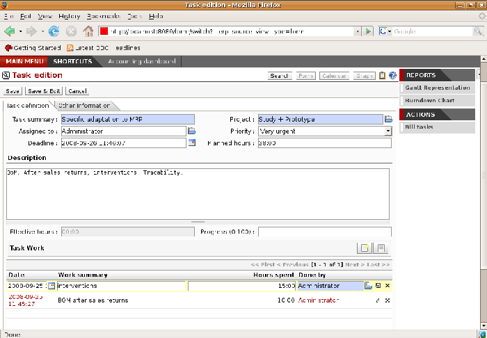
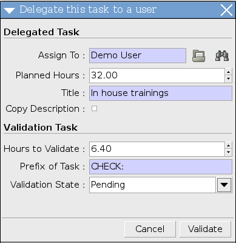

.. i18n: Project management
.. i18n: ==================

Project management
==================

.. i18n: In the previous chapter you dealt with the financial management of projects, which was based on
.. i18n: Open ERP's analytic accounts, structured into cases. This way of working enables you to analyze
.. i18n: time plans and budgets, to control invoicing, and to manage your different contracts.

In the previous chapter you dealt with the financial management of projects, which was based on
Open ERP's analytic accounts, structured into cases. This way of working enables you to analyze
time plans and budgets, to control invoicing, and to manage your different contracts.

.. i18n: In this chapter you can use operational project management to organize tasks and plan the work you
.. i18n: need to get the tasks completed. All of the necessary operations are carried out through the menu
.. i18n: :menuselection:`Project Management`.

In this chapter you can use operational project management to organize tasks and plan the work you
need to get the tasks completed. All of the necessary operations are carried out through the menu
:menuselection:`Project Management`.

.. i18n: .. index::
.. i18n:    single: project

.. index::
   single: project

.. i18n: .. note:: Project
.. i18n: 
.. i18n: 	In Open ERP a project is represented by a set of tasks for completion.
.. i18n: 	Projects have a tree structure that can be divided into phases and sub-phases.
.. i18n: 	This structure is very useful for work organization.
.. i18n: 
.. i18n: 	Whereas analytic accounts look at the past activities of the company, project management's role is
.. i18n: 	to plan the future.
.. i18n: 	Even when there's a close link between the two (such as where a project has been planned and then
.. i18n: 	completed through Open ERP)
.. i18n: 	they are still two different concepts, each making its own contribution to a flexible workflow.

.. note:: Project

	In Open ERP a project is represented by a set of tasks for completion.
	Projects have a tree structure that can be divided into phases and sub-phases.
	This structure is very useful for work organization.

	Whereas analytic accounts look at the past activities of the company, project management's role is
	to plan the future.
	Even when there's a close link between the two (such as where a project has been planned and then
	completed through Open ERP)
	they are still two different concepts, each making its own contribution to a flexible workflow.

.. i18n: Most client projects are represented by:

Most client projects are represented by:

.. i18n: * one or several analytic accounts in the accounts system for tracking the contract and its
.. i18n:   different phases,
.. i18n: 
.. i18n: * one or several projects in project management for tracking the project and the different tasks to
.. i18n:   be completed.

* one or several analytic accounts in the accounts system for tracking the contract and its
  different phases,

* one or several projects in project management for tracking the project and the different tasks to
  be completed.

.. i18n: Defining a project and its tasks
.. i18n: --------------------------------

Defining a project and its tasks
--------------------------------

.. i18n: To define a new project, go to the menu :menuselection:`Project Management --> Projects --> New Project`.
.. i18n: Give your new project a :guilabel:`Project Name`.

To define a new project, go to the menu :menuselection:`Project Management --> Projects --> New Project`.
Give your new project a :guilabel:`Project Name`.

.. i18n: You can put this project into a hierarchy, as a child of a :guilabel:`Parent Project`, and
.. i18n: give it a :guilabel:`Project Manager`. 
.. i18n: You can also give it a general duration by completing :guilabel:`Starting Date` and 
.. i18n: :guilabel:`Expected End`.

You can put this project into a hierarchy, as a child of a :guilabel:`Parent Project`, and
give it a :guilabel:`Project Manager`. 
You can also give it a general duration by completing :guilabel:`Starting Date` and 
:guilabel:`Expected End`.

.. i18n: By checking the box :guilabel:`Warn manager`, you configure the system to send the project manager
.. i18n: an Open ERP request every time that a task is closed. 
.. i18n: You can also link to a :guilabel:`Working Time` category, and an :guilabel:`Analytic Account`.
.. i18n: And you add :guilabel:`Project Members` as you need.

By checking the box :guilabel:`Warn manager`, you configure the system to send the project manager
an Open ERP request every time that a task is closed. 
You can also link to a :guilabel:`Working Time` category, and an :guilabel:`Analytic Account`.
And you add :guilabel:`Project Members` as you need.

.. i18n: .. note:: Warn Customer setup
.. i18n: 
.. i18n:    If you check :guilabel:`Warn customer`, you should define a page header and footer in the
.. i18n:    :guilabel:`Partner Info` tab for use in an email. 
.. i18n:    Open ERP prepares an email that the user can send to the client
.. i18n:    each time that a task is completed. The contents of this email are based on details of the project
.. i18n:    task, and can be modified by the user before the email is sent.
.. i18n:    
.. i18n: The status of a project can take the following values:

.. note:: Warn Customer setup

   If you check :guilabel:`Warn customer`, you should define a page header and footer in the
   :guilabel:`Partner Info` tab for use in an email. 
   Open ERP prepares an email that the user can send to the client
   each time that a task is completed. The contents of this email are based on details of the project
   task, and can be modified by the user before the email is sent.
   
The status of a project can take the following values:

.. i18n: * \ ``Open``\  : while the project is being carried out,
.. i18n: 
.. i18n: * \ ``Pending``\  : while the project is paused,
.. i18n: 
.. i18n: * \ ``Canceled``\  : if the project has been canceled and therefore aborted,
.. i18n: 
.. i18n: * \ ``Done``\  : the project has been successfully completed.

* \ ``Open``\  : while the project is being carried out,

* \ ``Pending``\  : while the project is paused,

* \ ``Canceled``\  : if the project has been canceled and therefore aborted,

* \ ``Done``\  : the project has been successfully completed.

.. i18n: .. note:: Study of client satisfaction
.. i18n: 
.. i18n: 	Some companies run a system where emails are automatically sent at the end of a task requesting the
.. i18n: 	client to complete an online survey.
.. i18n: 	This survey enables them to ask different questions about the work carried out, to gauge client
.. i18n: 	satisfaction as the project progresses.
.. i18n: 
.. i18n: 	This function can be used by companies certified to ISO 9001, to rate client satisfaction.

.. note:: Study of client satisfaction

	Some companies run a system where emails are automatically sent at the end of a task requesting the
	client to complete an online survey.
	This survey enables them to ask different questions about the work carried out, to gauge client
	satisfaction as the project progresses.

	This function can be used by companies certified to ISO 9001, to rate client satisfaction.

.. i18n: Once a project has been defined you can code in the tasks to be done. You've two possibilities for
.. i18n: this:

Once a project has been defined you can code in the tasks to be done. You've two possibilities for
this:

.. i18n: * from the :guilabel:`ACTION` link button :guilabel:`Create a task` to the right of the project form, 
.. i18n: 
.. i18n: * from the menu :menuselection:`Project Management --> All Tasks`, create a new task and assign it
.. i18n:   to an existing project.

* from the :guilabel:`ACTION` link button :guilabel:`Create a task` to the right of the project form, 

* from the menu :menuselection:`Project Management --> All Tasks`, create a new task and assign it
  to an existing project.

.. i18n: Managing tasks
.. i18n: --------------

Managing tasks
--------------

.. i18n: Each task must adopt one of the following states:

Each task must adopt one of the following states:

.. i18n: * \ ``Draft``\  : the task has been entered but hasn't yet been validated by the person who will
.. i18n:   have to do it,
.. i18n: 
.. i18n: * \ ``Open``\
.. i18n: 
.. i18n: * \ ``Closed``\
.. i18n: 
.. i18n: * \ ``Cancelled``\
.. i18n: 
.. i18n: * \ ``Pending``\

* \ ``Draft``\  : the task has been entered but hasn't yet been validated by the person who will
  have to do it,

* \ ``Open``\

* \ ``Closed``\

* \ ``Cancelled``\

* \ ``Pending``\

.. i18n: A task can be assigned to a user, who then becomes responsible for closing it. But you could also
.. i18n: leave it unassigned so that nobody specific will be responsible: various team members instead are
.. i18n: made jointly responsible for taking on tasks that they have the skills for.

A task can be assigned to a user, who then becomes responsible for closing it. But you could also
leave it unassigned so that nobody specific will be responsible: various team members instead are
made jointly responsible for taking on tasks that they have the skills for.

.. i18n: .. figure::  images/service_task.png
.. i18n:    :scale: 50
.. i18n:    :align: center
.. i18n: 
.. i18n:    *Tasks in project management*

   *Tasks in project management*

.. i18n: Each user then manages his or her own task using the different available menus. To open the list of
.. i18n: unclosed tasks that you have been assigned specifically use the menu :menuselection:`Project
.. i18n: Management --> Tasks --> My Tasks`. Or to open the unassigned tasks, go to
.. i18n: :menuselection:`Project Management --> Tasks --> All Tasks --> Unassigned Tasks` and then select \ ``Draft``\
.. i18n: and \ ``Open``\   tasks from that list.

Each user then manages his or her own task using the different available menus. To open the list of
unclosed tasks that you have been assigned specifically use the menu :menuselection:`Project
Management --> Tasks --> My Tasks`. Or to open the unassigned tasks, go to
:menuselection:`Project Management --> Tasks --> All Tasks --> Unassigned Tasks` and then select \ ``Draft``\
and \ ``Open``\   tasks from that list.

.. i18n: .. tip:: Shortcuts
.. i18n: 
.. i18n: 	Every user should create a link in their own shortcuts to the :menuselection:`My Tasks` menu because they'll
.. i18n: 	have to consult this menu several times a day.

.. tip:: Shortcuts

	Every user should create a link in their own shortcuts to the :menuselection:`My Tasks` menu because they'll
	have to consult this menu several times a day.

.. i18n: .. _sect-projroles:
.. i18n: 
.. i18n: Assigning roles: account manager and project manager
.. i18n: ----------------------------------------------------

.. _sect-projroles:

Assigning roles: account manager and project manager
----------------------------------------------------

.. i18n: In some companies two distinct responsibilities are defined for each important project:

In some companies two distinct responsibilities are defined for each important project:

.. i18n: * someone responsible for the client,
.. i18n: 
.. i18n: * someone responsible for managing the project technically.

* someone responsible for the client,

* someone responsible for managing the project technically.

.. i18n: The person responsible for the client, the client account manager, approves client requests, writes
.. i18n: sales proposals, and assures that these activities and the invoicing progress properly. He is
.. i18n: responsible for the functional definition of the client's needs. The account manager would have a
.. i18n: sales, technical sales or financial profile.

The person responsible for the client, the client account manager, approves client requests, writes
sales proposals, and assures that these activities and the invoicing progress properly. He is
responsible for the functional definition of the client's needs. The account manager would have a
sales, technical sales or financial profile.

.. i18n: The person responsible for the technical tracking of the project is called the project manager. She
.. i18n: makes the project happen, organizing and sub-contracting the different project tasks. The project
.. i18n: manager would often be responsible for a development team to carry the project out, and generally
.. i18n: has a technical profile.

The person responsible for the technical tracking of the project is called the project manager. She
makes the project happen, organizing and sub-contracting the different project tasks. The project
manager would often be responsible for a development team to carry the project out, and generally
has a technical profile.

.. i18n: If you don't make any such distinction in the roles then put the same person in both fields.

If you don't make any such distinction in the roles then put the same person in both fields.

.. i18n: .. index::
.. i18n:    single: invoicing; tasks

.. index::
   single: invoicing; tasks

.. i18n: Invoicing tasks
.. i18n: ---------------

Invoicing tasks
---------------

.. i18n: Several methods of invoicing have already been described:

Several methods of invoicing have already been described:

.. i18n: * invoicing from a sales order,
.. i18n: 
.. i18n: * invoicing on the basis of analytic costs (service times, expenses),
.. i18n: 
.. i18n: * invoicing on the basis of deliveries,
.. i18n: 
.. i18n: * manual invoicing.

* invoicing from a sales order,

* invoicing on the basis of analytic costs (service times, expenses),

* invoicing on the basis of deliveries,

* manual invoicing.

.. i18n: Although invoicing tasks might appear useful, in certain situations it's best to invoice from the
.. i18n: service or purchase orders instead. These methods of invoicing are more flexible, with various
.. i18n: pricing levels set out in the pricelist, and different products that can be invoiced. And it's
.. i18n: helpful to limit the number of invoicing methods in your company by extending the use of an
.. i18n: invoicing method that you already have.

Although invoicing tasks might appear useful, in certain situations it's best to invoice from the
service or purchase orders instead. These methods of invoicing are more flexible, with various
pricing levels set out in the pricelist, and different products that can be invoiced. And it's
helpful to limit the number of invoicing methods in your company by extending the use of an
invoicing method that you already have.

.. i18n: If you want to connect your Sales Order with Project Management tasks you should create such
.. i18n: products as \ ``Consultant``\  , and \ ``Senior Developer``\  . These products should be configured
.. i18n: with :guilabel:`Product Type` \ ``Service``\ , a :guilabel:`Procure Method` of \ ``Make to Order``\  , 
.. i18n: and a :guilabel:`Supply Method` of \ ``Produce``\  . Once you've set this up,
.. i18n: Open ERP automatically creates a task in project management when the order is approved.

If you want to connect your Sales Order with Project Management tasks you should create such
products as \ ``Consultant``\  , and \ ``Senior Developer``\  . These products should be configured
with :guilabel:`Product Type` \ ``Service``\ , a :guilabel:`Procure Method` of \ ``Make to Order``\  , 
and a :guilabel:`Supply Method` of \ ``Produce``\  . Once you've set this up,
Open ERP automatically creates a task in project management when the order is approved.

.. i18n: You can also change some of the order parameters, which affects the invoice:

You can also change some of the order parameters, which affects the invoice:

.. i18n: *  :guilabel:`Shipping Policy` : \ ``Payment before delivery``\ or \ ``Invoice on Order After
.. i18n:    Delivery``\ (when the task is closed),
.. i18n: 
.. i18n: *  :guilabel:`Invoice On` : \ ``Ordered Quantities``\   or \ ``Shipped Quantities``\   (actual hours in
.. i18n:    the task).

*  :guilabel:`Shipping Policy` : \ ``Payment before delivery``\ or \ ``Invoice on Order After
   Delivery``\ (when the task is closed),

*  :guilabel:`Invoice On` : \ ``Ordered Quantities``\   or \ ``Shipped Quantities``\   (actual hours in
   the task).

.. i18n: Planning and managing priorities
.. i18n: --------------------------------

Planning and managing priorities
--------------------------------

.. i18n: Several methods can be used for ordering tasks by their respective priorities. Open ERP orders
.. i18n: tasks based on a function of the following fields: :guilabel:`Sequence`, :guilabel:`Priority`, and
.. i18n: :guilabel:`Deadline`.

Several methods can be used for ordering tasks by their respective priorities. Open ERP orders
tasks based on a function of the following fields: :guilabel:`Sequence`, :guilabel:`Priority`, and
:guilabel:`Deadline`.

.. i18n: Use the :guilabel:`Sequence` field on the second tab, :guilabel:`Other Information`, to plan a
.. i18n: project made up of several tasks. In the case of an IT project, for example, where development tasks
.. i18n: are done in a given order, the first task to do will be sequence number 1, then numbers 2, 3, 4 and
.. i18n: so on. When you first open the list of project tasks, they're listed in their sequence order.

Use the :guilabel:`Sequence` field on the second tab, :guilabel:`Other Information`, to plan a
project made up of several tasks. In the case of an IT project, for example, where development tasks
are done in a given order, the first task to do will be sequence number 1, then numbers 2, 3, 4 and
so on. When you first open the list of project tasks, they're listed in their sequence order.

.. i18n: You can use one of these three ordering methods, or combine several of them, depending on the
.. i18n: project.

You can use one of these three ordering methods, or combine several of them, depending on the
project.

.. i18n: .. index::
.. i18n:    single: module; scrum
.. i18n:    single: agile (method)

.. index::
   single: module; scrum
   single: agile (method)

.. i18n: .. note:: Agile methods
.. i18n: 
.. i18n: 	Open ERP implements the agile methodology Scrum for IT development projects in the :mod:`scrum`
.. i18n: 	module.
.. i18n: 
.. i18n: 	Scrum supplements the task system with the following concepts:
.. i18n: 	long-term planning, sprints, iterative development, progress meetings, burndown chart, and product
.. i18n: 	backlog.
.. i18n: 
.. i18n: 	Look at the site: http://controlchaos.com for more information on the Scrum methodology.

.. note:: Agile methods

	Open ERP implements the agile methodology Scrum for IT development projects in the :mod:`scrum`
	module.

	Scrum supplements the task system with the following concepts:
	long-term planning, sprints, iterative development, progress meetings, burndown chart, and product
	backlog.

	Look at the site: http://controlchaos.com for more information on the Scrum methodology.

.. i18n: .. figure::  images/service_project_gantt.png
.. i18n:    :scale: 50
.. i18n:    :align: center
.. i18n: 
.. i18n:    *Gantt plan, calculated for earliest delivery*

.. figure::  images/service_project_gantt.png
   :scale: 50
   :align: center

   *Gantt plan, calculated for earliest delivery*

.. i18n: You can set an attendance grid (or the timesheets) in the project file. If you don't specify
.. i18n: anything, Open ERP assumes by default that you work 8 hours a day from Monday to Sunday. Once a
.. i18n: grid is specified you can call up a project Gantt chart from right-hand toolbar. The system then
.. i18n: calculates a project plan for earliest delivery using task ordering and the attendance grid.

You can set an attendance grid (or the timesheets) in the project file. If you don't specify
anything, Open ERP assumes by default that you work 8 hours a day from Monday to Sunday. Once a
grid is specified you can call up a project Gantt chart from right-hand toolbar. The system then
calculates a project plan for earliest delivery using task ordering and the attendance grid.

.. i18n: .. tip:: Calendar view
.. i18n: 
.. i18n: 	Open ERP can give you a calendar view of the different tasks in both the web client and the GTK client.
.. i18n: 	This is all based on the deadline data and displays only tasks that have a deadline.
.. i18n: 	You can then delete, create or modify tasks using simple drag and drop.
.. i18n: 
.. i18n: 	.. figure::  images/service_task_calendar.png
.. i18n: 	   :scale: 50
.. i18n: 	   :align: center
.. i18n: 
.. i18n:        *Calendar view of the system tasks*

.. tip:: Calendar view

	Open ERP can give you a calendar view of the different tasks in both the web client and the GTK client.
	This is all based on the deadline data and displays only tasks that have a deadline.
	You can then delete, create or modify tasks using simple drag and drop.

	.. figure::  images/service_task_calendar.png
	   :scale: 50
	   :align: center

       *Calendar view of the system tasks*

.. i18n: .. index:: delegation (task)

.. index:: delegation (task)

.. i18n: Task delegation
.. i18n: ---------------

Task delegation
---------------

.. i18n: To delegate a task to another user you can just change the person responsible for that task. However
.. i18n: the system doesn't help you track tasks that you've delegated, such as monitoring of work done, if
.. i18n: you do it this way.

To delegate a task to another user you can just change the person responsible for that task. However
the system doesn't help you track tasks that you've delegated, such as monitoring of work done, if
you do it this way.

.. i18n: .. figure::  images/service_task_delegate.png
.. i18n:    :scale: 50
.. i18n:    :align: center
.. i18n: 
.. i18n:    *Form for delegating a task to another user*

   *Form for delegating a task to another user*

.. i18n: Instead, you can use the button :guilabel:`Delegate` on a task.

Instead, you can use the button :guilabel:`Delegate` on a task.

.. i18n: .. *Delegate* \ ``Pending``\

.. *Delegate* \ ``Pending``\

.. i18n: .. \ ``Pending``\  \ ``Open``\

.. \ ``Pending``\  \ ``Open``\

.. i18n: The system enables you to modify tasks at all levels in the chain of delegation, to add additional
.. i18n: information. A task can therefore start as a global objective and become more detailed as it is
.. i18n: delegated down in the hierarchy.

The system enables you to modify tasks at all levels in the chain of delegation, to add additional
information. A task can therefore start as a global objective and become more detailed as it is
delegated down in the hierarchy.

.. i18n: The second tab on the task form gives you a complete history of the chain of delegation for each
.. i18n: task. You can find a link to the parent task there, and the different tasks that have been
.. i18n: delegated.

The second tab on the task form gives you a complete history of the chain of delegation for each
task. You can find a link to the parent task there, and the different tasks that have been
delegated.

.. i18n: .. Copyright © Open Object Press. All rights reserved.

.. Copyright © Open Object Press. All rights reserved.

.. i18n: .. You may take electronic copy of this publication and distribute it if you don't
.. i18n: .. change the content. You can also print a copy to be read by yourself only.

.. You may take electronic copy of this publication and distribute it if you don't
.. change the content. You can also print a copy to be read by yourself only.

.. i18n: .. We have contracts with different publishers in different countries to sell and
.. i18n: .. distribute paper or electronic based versions of this book (translated or not)
.. i18n: .. in bookstores. This helps to distribute and promote the Open ERP product. It
.. i18n: .. also helps us to create incentives to pay contributors and authors using author
.. i18n: .. rights of these sales.

.. We have contracts with different publishers in different countries to sell and
.. distribute paper or electronic based versions of this book (translated or not)
.. in bookstores. This helps to distribute and promote the Open ERP product. It
.. also helps us to create incentives to pay contributors and authors using author
.. rights of these sales.

.. i18n: .. Due to this, grants to translate, modify or sell this book are strictly
.. i18n: .. forbidden, unless Tiny SPRL (representing Open Object Press) gives you a
.. i18n: .. written authorisation for this.

.. Due to this, grants to translate, modify or sell this book are strictly
.. forbidden, unless Tiny SPRL (representing Open Object Press) gives you a
.. written authorisation for this.

.. i18n: .. Many of the designations used by manufacturers and suppliers to distinguish their
.. i18n: .. products are claimed as trademarks. Where those designations appear in this book,
.. i18n: .. and Open Object Press was aware of a trademark claim, the designations have been
.. i18n: .. printed in initial capitals.

.. Many of the designations used by manufacturers and suppliers to distinguish their
.. products are claimed as trademarks. Where those designations appear in this book,
.. and Open Object Press was aware of a trademark claim, the designations have been
.. printed in initial capitals.

.. i18n: .. While every precaution has been taken in the preparation of this book, the publisher
.. i18n: .. and the authors assume no responsibility for errors or omissions, or for damages
.. i18n: .. resulting from the use of the information contained herein.

.. While every precaution has been taken in the preparation of this book, the publisher
.. and the authors assume no responsibility for errors or omissions, or for damages
.. resulting from the use of the information contained herein.

.. i18n: .. Published by Open Object Press, Grand Rosière, Belgium

.. Published by Open Object Press, Grand Rosière, Belgium
