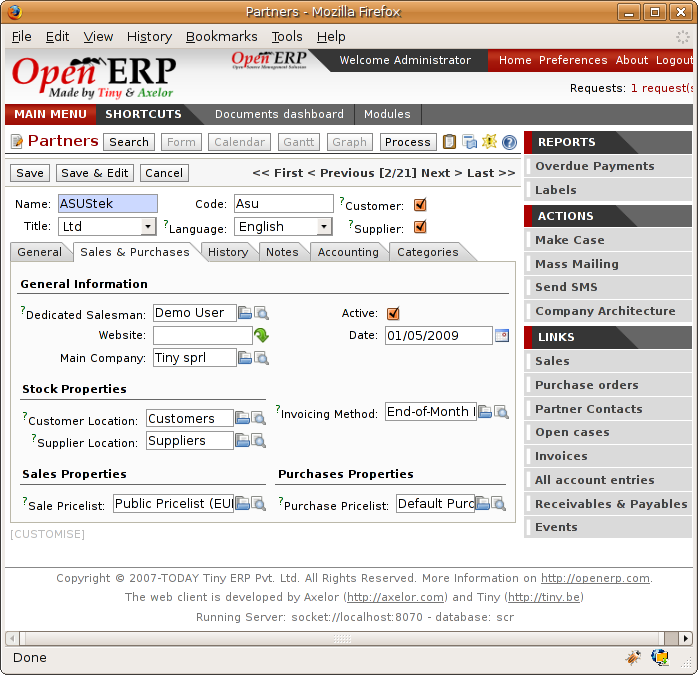

.. i18n: Management by Journal
.. i18n: =====================

Management by Journal
=====================

.. i18n: You can manage stock through journals in the same way as you can manage your accounts
.. i18n: through journals. This approach has the great advantage
.. i18n: of being able to define journals in various ways as you need them to meet your company's needs.

You can manage stock through journals in the same way as you can manage your accounts
through journals. This approach has the great advantage
of being able to define journals in various ways as you need them to meet your company's needs.

.. i18n: For example, a large company may want to organize deliveries by department or warehouse. You can
.. i18n: then create a journal and a manager for each department. The different users can then work in a
.. i18n: journal as a function of their position in the company. That enables you to structure your
.. i18n: information better.

For example, a large company may want to organize deliveries by department or warehouse. You can
then create a journal and a manager for each department. The different users can then work in a
journal as a function of their position in the company. That enables you to structure your
information better.

.. i18n: A company that does a lot of transport can organize its journals by delivery vehicle. The different
.. i18n: delivery orders will then be assigned to a journal representing a particular vehicle. Then if the
.. i18n: vehicle has left the company you can confirm all the orders that are found in the journal all at the
.. i18n: same time.

A company that does a lot of transport can organize its journals by delivery vehicle. The different
delivery orders will then be assigned to a journal representing a particular vehicle. Then if the
vehicle has left the company you can confirm all the orders that are found in the journal all at the
same time.

.. i18n: .. index::
.. i18n:    single: stock; journal

.. index::
   single: stock; journal

.. i18n: The different journals
.. i18n: ----------------------

The different journals
----------------------

.. i18n: .. index::
.. i18n:    single: module; sale_journal

.. index::
   single: module; sale_journal

.. i18n: Install the module :mod:`sale_journal` to work with journals. This adds three new concepts to Open ERP:

Install the module :mod:`sale_journal` to work with journals. This adds three new concepts to Open ERP:

.. i18n: * Invoicing journals,
.. i18n: 
.. i18n: * Order journals,
.. i18n: 
.. i18n: * Delivery journals.

* Invoicing journals,

* Order journals,

* Delivery journals.

.. i18n: Invoicing journals are used to assign purchase orders and/or delivery order to a given invoicing
.. i18n: journal. Everything in the journal can be invoiced in one go, and you can control the amounts by
.. i18n: journal. For example you can create the following journals: daily invoicing, end-of-week invoicing,
.. i18n: and end-of-month invoicing. It's also possible to show the invoicing journal by default in the
.. i18n: partner form.

Invoicing journals are used to assign purchase orders and/or delivery order to a given invoicing
journal. Everything in the journal can be invoiced in one go, and you can control the amounts by
journal. For example you can create the following journals: daily invoicing, end-of-week invoicing,
and end-of-month invoicing. It's also possible to show the invoicing journal by default in the
partner form.

.. i18n: Order journals look like orders and are automatically transferred to orders for the corresponding
.. i18n: items. These enable you to classify the orders in various ways, such as by department, by
.. i18n: salesperson, or by type. Then if a salesperson looks at her own journals after an order she can
.. i18n: easily see the work on current items compared with her own orders.

Order journals look like orders and are automatically transferred to orders for the corresponding
items. These enable you to classify the orders in various ways, such as by department, by
salesperson, or by type. Then if a salesperson looks at her own journals after an order she can
easily see the work on current items compared with her own orders.

.. i18n: .. tip:: Default Values
.. i18n: 
.. i18n:    To enter all the orders in their own order journal, a salesperson can use the default values that
.. i18n:    are entered in the fields when creating orders.

.. tip:: Default Values

   To enter all the orders in their own order journal, a salesperson can use the default values that
   are entered in the fields when creating orders.

.. i18n: Finally the delivery journals are used to post each item into a delivery journal. For example you
.. i18n: can create journals dated according to customer delivery dates (such as Monday's deliveries, or
.. i18n: afternoon deliveries) or these journals could represent the day's work for delivery vehicles (such
.. i18n: as truck1, truck2).

Finally the delivery journals are used to post each item into a delivery journal. For example you
can create journals dated according to customer delivery dates (such as Monday's deliveries, or
afternoon deliveries) or these journals could represent the day's work for delivery vehicles (such
as truck1, truck2).

.. i18n: Using the journals
.. i18n: ------------------

Using the journals
------------------

.. i18n: You'll now see how to use the journals to organize your stock management in practice. After
.. i18n: installing the module :mod:`sale_journal` look at the list of partners. In the tab :guilabel:`Sales and
.. i18n: Purchases` on any of them you'll now see the field :guilabel:`Invoicing Method`.

You'll now see how to use the journals to organize your stock management in practice. After
installing the module :mod:`sale_journal` look at the list of partners. In the tab :guilabel:`Sales and
Purchases` on any of them you'll now see the field :guilabel:`Invoicing Method`.

.. i18n: .. figure:: images/partner_property_view.png
.. i18n:    :scale: 75
.. i18n:    :align: center
.. i18n: 
.. i18n:    *Partner form in invoicing mode*

.. figure:: images/partner_property_view.png
   :scale: 75
   :align: center

   *Partner form in invoicing mode*

.. i18n: You can create a new :guilabel:`Invoicing Journal` on a partner on the fly. You can show if the invoices
.. i18n: should be grouped or not after you have generated them in the journal. Create a second invoicing journal
.. i18n: ``End-of-Month Invoicing`` which you can assign to another partner.

You can create a new :guilabel:`Invoicing Journal` on a partner on the fly. You can show if the invoices
should be grouped or not after you have generated them in the journal. Create a second invoicing journal
``End-of-Month Invoicing`` which you can assign to another partner.

.. i18n: .. figure:: images/invoice_mode.png
.. i18n:    :scale: 75
.. i18n:    :align: center
.. i18n: 
.. i18n:    *Defining an invoicing journal*

   *Defining an invoicing journal*

.. i18n: Then enter the data for some orders for these two partners. After entering this order data, the
.. i18n: field :guilabel:`Invoicing Mode` is completed automatically from the partner settings. Put these
.. i18n: orders into the Invoicing Mode based on items in the second tab.

Then enter the data for some orders for these two partners. After entering this order data, the
field :guilabel:`Invoicing Mode` is completed automatically from the partner settings. Put these
orders into the Invoicing Mode based on items in the second tab.

.. i18n: Look at the assembly notes about these orders in the field :guilabel:`Invoicing Mode` is
.. i18n: automatically shown there. Then confirm the different orders in the list.

Look at the assembly notes about these orders in the field :guilabel:`Invoicing Mode` is
automatically shown there. Then confirm the different orders in the list.

.. i18n: At the end of the day, the invoicing supervisor can put the list by journal. To do this, use the
.. i18n: menu :menuselection:`Stock Management --> Sorted List --> List to invoice`. Choose the invoicing
.. i18n: journal and all the lists of orders to invoice then open in list view. It's then possible to
.. i18n: automatically carry out invoicing by clicking the action :guilabel:`Invoice` (the gears symbol in
.. i18n: the application client).

At the end of the day, the invoicing supervisor can put the list by journal. To do this, use the
menu :menuselection:`Stock Management --> Sorted List --> List to invoice`. Choose the invoicing
journal and all the lists of orders to invoice then open in list view. It's then possible to
automatically carry out invoicing by clicking the action :guilabel:`Invoice` (the gears symbol in
the application client).

.. i18n: .. tip:: Confirming invoices
.. i18n: 
.. i18n:     By default, invoices are generated in the draft state which enables you to modify them before
.. i18n:     sending them to the customer.
.. i18n:     But you can confirm all the invoices in one go by selecting them all from the list and doing the
.. i18n:     action 'Confirm draft invoices'.

.. tip:: Confirming invoices

    By default, invoices are generated in the draft state which enables you to modify them before
    sending them to the customer.
    But you can confirm all the invoices in one go by selecting them all from the list and doing the
    action 'Confirm draft invoices'.

.. i18n: At the end of the month the invoicing management does the same work but in the journal 'month-end
.. i18n: invoicing'.

At the end of the month the invoicing management does the same work but in the journal 'month-end
invoicing'.

.. i18n: You can also enter a journal to confirm / cancel all the orders in one go. Then you can do several
.. i18n: quotations and assign them in a journal and confirm or cancel them en masse at once.

You can also enter a journal to confirm / cancel all the orders in one go. Then you can do several
quotations and assign them in a journal and confirm or cancel them en masse at once.

.. i18n: .. figure:: images/stock_jounral_form.png
.. i18n:    :scale: 75
.. i18n:    :align: center
.. i18n: 
.. i18n:    *View of an order journal*

.. figure:: images/stock_jounral_form.png
   :scale: 75
   :align: center

   *View of an order journal*

.. i18n: .. Copyright © Open Object Press. All rights reserved.

.. Copyright © Open Object Press. All rights reserved.

.. i18n: .. You may take electronic copy of this publication and distribute it if you don't
.. i18n: .. change the content. You can also print a copy to be read by yourself only.

.. You may take electronic copy of this publication and distribute it if you don't
.. change the content. You can also print a copy to be read by yourself only.

.. i18n: .. We have contracts with different publishers in different countries to sell and
.. i18n: .. distribute paper or electronic based versions of this book (translated or not)
.. i18n: .. in bookstores. This helps to distribute and promote the Open ERP product. It
.. i18n: .. also helps us to create incentives to pay contributors and authors using author
.. i18n: .. rights of these sales.

.. We have contracts with different publishers in different countries to sell and
.. distribute paper or electronic based versions of this book (translated or not)
.. in bookstores. This helps to distribute and promote the Open ERP product. It
.. also helps us to create incentives to pay contributors and authors using author
.. rights of these sales.

.. i18n: .. Due to this, grants to translate, modify or sell this book are strictly
.. i18n: .. forbidden, unless Tiny SPRL (representing Open Object Press) gives you a
.. i18n: .. written authorisation for this.

.. Due to this, grants to translate, modify or sell this book are strictly
.. forbidden, unless Tiny SPRL (representing Open Object Press) gives you a
.. written authorisation for this.

.. i18n: .. Many of the designations used by manufacturers and suppliers to distinguish their
.. i18n: .. products are claimed as trademarks. Where those designations appear in this book,
.. i18n: .. and Open Object Press was aware of a trademark claim, the designations have been
.. i18n: .. printed in initial capitals.

.. Many of the designations used by manufacturers and suppliers to distinguish their
.. products are claimed as trademarks. Where those designations appear in this book,
.. and Open Object Press was aware of a trademark claim, the designations have been
.. printed in initial capitals.

.. i18n: .. While every precaution has been taken in the preparation of this book, the publisher
.. i18n: .. and the authors assume no responsibility for errors or omissions, or for damages
.. i18n: .. resulting from the use of the information contained herein.

.. While every precaution has been taken in the preparation of this book, the publisher
.. and the authors assume no responsibility for errors or omissions, or for damages
.. resulting from the use of the information contained herein.

.. i18n: .. Published by Open Object Press, Grand Rosière, Belgium

.. Published by Open Object Press, Grand Rosière, Belgium
