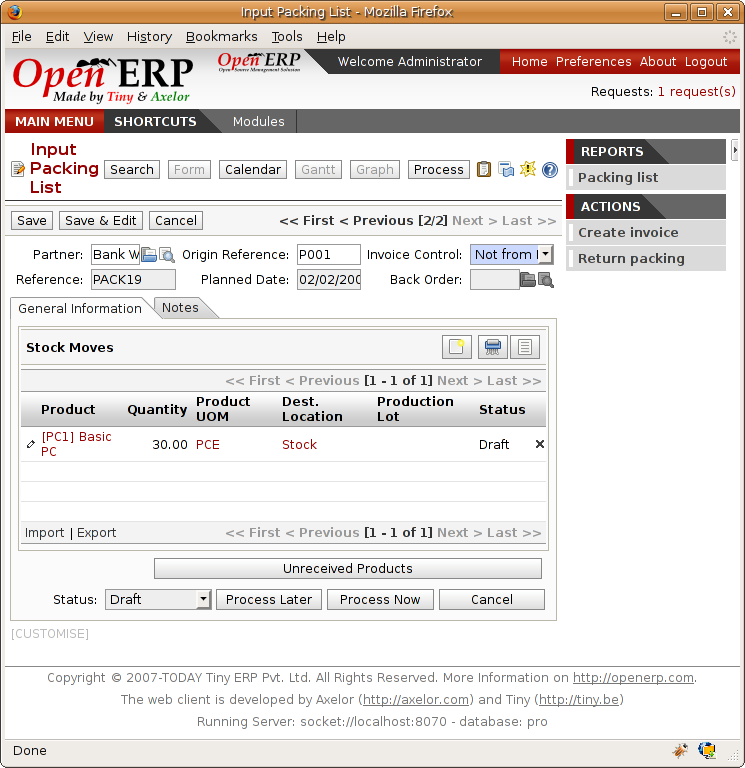
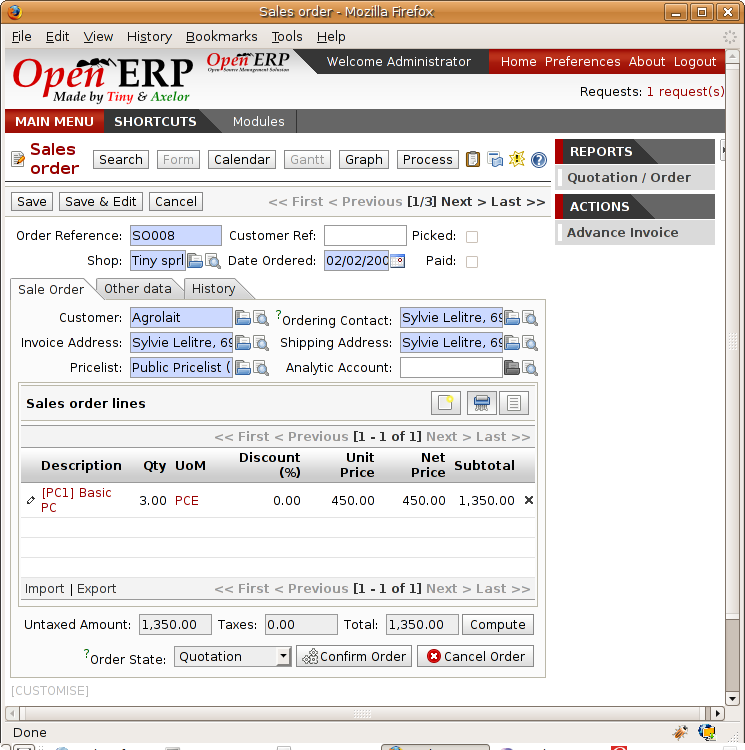
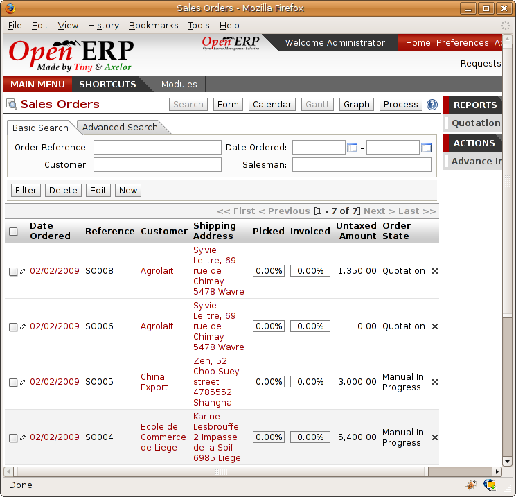
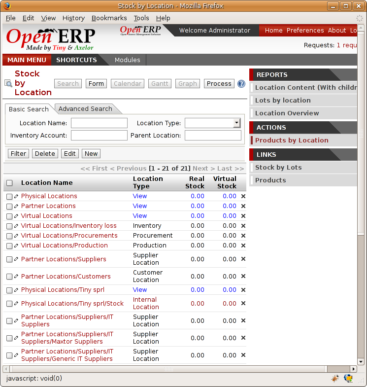

.. i18n: Stocks
.. i18n: ======

Stocks
======

.. i18n: .. index::
.. i18n:    single: virtual; stock

.. index::
   single: virtual; stock

.. i18n: In the product form you can find a report that will give you the stock levels of the various
.. i18n: different products in any selected location. If you haven't selected any location, Open ERP
.. i18n: calculates stocks for all of the physical locations.

In the product form you can find a report that will give you the stock levels of the various
different products in any selected location. If you haven't selected any location, Open ERP
calculates stocks for all of the physical locations.

.. i18n: .. note::  Availability of stock
.. i18n: 
.. i18n:     Depending on whether you look at the product from a customer order or from the menu of a product
.. i18n:     form you can get different values for stock availability. If you use the product menu you get
.. i18n:     the stock in all of the physical stock locations. Looking at the product from the order you will
.. i18n:     only see the report of the warehouse selected in the order.

.. note::  Availability of stock

    Depending on whether you look at the product from a customer order or from the menu of a product
    form you can get different values for stock availability. If you use the product menu you get
    the stock in all of the physical stock locations. Looking at the product from the order you will
    only see the report of the warehouse selected in the order.

.. i18n: The two fields are:

The two fields are:

.. i18n: * :guilabel:`Real Stock` : quantity physical present in your warehouse,
.. i18n: 
.. i18n: * :guilabel:`Virtual Stock` : calculated this way: real stock – outgoing + incoming.

* :guilabel:`Real Stock` : quantity physical present in your warehouse,

* :guilabel:`Virtual Stock` : calculated this way: real stock – outgoing + incoming.

.. i18n: .. note::  Virtual Stock
.. i18n: 
.. i18n:     Virtual stock is very useful because it shows what the salespeople can sell. If it's more than
.. i18n:     real stock it's because products will be coming in and if it's smaller than real stock then it's
.. i18n:     because certain products are reserved for other sales orders or works orders.

.. note::  Virtual Stock

    Virtual stock is very useful because it shows what the salespeople can sell. If it's more than
    real stock it's because products will be coming in and if it's smaller than real stock then it's
    because certain products are reserved for other sales orders or works orders.

.. i18n: .. tip:: Detail of future stock
.. i18n: 
.. i18n:    To get more detail about future stock, you can click :guilabel:`Future Stock Forecast` to the right of the product form
.. i18n:    to get the report :ref:`fig-stfore` below.
.. i18n:    Open ERP shows a graph of the change of stock in the days to come, varying as a function of
.. i18n:    purchase orders, confirmed production and sales orders.
.. i18n: 
.. i18n:    .. _fig-stfore:
.. i18n:    
.. i18n:    .. figure:: images/stock_forecast_report.png
.. i18n:       :scale: 75
.. i18n:       :align: center
.. i18n: 
.. i18n:       *Printout of forecast stock levels*

.. tip:: Detail of future stock

   To get more detail about future stock, you can click :guilabel:`Future Stock Forecast` to the right of the product form
   to get the report :ref:`fig-stfore` below.
   Open ERP shows a graph of the change of stock in the days to come, varying as a function of
   purchase orders, confirmed production and sales orders.

   .. _fig-stfore:
   
   .. figure:: images/stock_forecast_report.png
      :scale: 75
      :align: center

      *Printout of forecast stock levels*

.. i18n: Lead times and locations
.. i18n: ------------------------

Lead times and locations
------------------------

.. i18n: The tab :guilabel:`Procurement & Locations` contains information about different lead times and
.. i18n: locations. Three lead time figures are available:

The tab :guilabel:`Procurement & Locations` contains information about different lead times and
locations. Three lead time figures are available:

.. i18n: * :guilabel:`Customer Lead Time` : lead time promised to the customer, expressed in number of days
.. i18n:   between the order and the deliver to the customer,
.. i18n: 
.. i18n: * :guilabel:`Manufacturing Lead Time` : lead time, in days, between a production order and the end
.. i18n:   of production of the finished product,
.. i18n: 
.. i18n: * :guilabel:`Warranty (months)` : length of time in months for the warranty for the delivered products.

* :guilabel:`Customer Lead Time` : lead time promised to the customer, expressed in number of days
  between the order and the deliver to the customer,

* :guilabel:`Manufacturing Lead Time` : lead time, in days, between a production order and the end
  of production of the finished product,

* :guilabel:`Warranty (months)` : length of time in months for the warranty for the delivered products.

.. i18n: .. note:: Warranty
.. i18n: 
.. i18n:     The warranty period is used in the management of repairs and after-sales service.
.. i18n:     You can find more information on this subject in :ref:`ch-mnf`.

.. note:: Warranty

    The warranty period is used in the management of repairs and after-sales service.
    You can find more information on this subject in :ref:`ch-mnf`.

.. i18n: Fields in the section :guilabel:`Storage Localisation` are given for information – they don't have
.. i18n: any impact on the management of stock.

Fields in the section :guilabel:`Storage Localisation` are given for information – they don't have
any impact on the management of stock.

.. i18n: :guilabel:`Counterpart locations` are automatically proposed by the system but the different values can be
.. i18n: modified. You'll find counterpart locations for:

:guilabel:`Counterpart locations` are automatically proposed by the system but the different values can be
modified. You'll find counterpart locations for:

.. i18n: * :guilabel:`Procurement`,
.. i18n: 
.. i18n: * :guilabel:`Production`,
.. i18n: 
.. i18n: * :guilabel:`Inventory`.

* :guilabel:`Procurement`,

* :guilabel:`Production`,

* :guilabel:`Inventory`.

.. i18n: A procurement location is a temporary location for stock moves that haven't yet been finalized by
.. i18n: the scheduler. When the system doesn't yet know if procurement is to be done by a purchase or
.. i18n: production, Open ERP uses the counterpart location :guilabel:`Procurement`. You'll find there
.. i18n: everything that hasn't yet been planned by the system. The quantities of product in this location
.. i18n: cancel each other out.

A procurement location is a temporary location for stock moves that haven't yet been finalized by
the scheduler. When the system doesn't yet know if procurement is to be done by a purchase or
production, Open ERP uses the counterpart location :guilabel:`Procurement`. You'll find there
everything that hasn't yet been planned by the system. The quantities of product in this location
cancel each other out.

.. i18n: .. index:: 
.. i18n:    single: inventory
.. i18n:    single: stock check

.. index:: 
   single: inventory
   single: stock check

.. i18n: Initial Inventory
.. i18n: -----------------

Initial Inventory
-----------------

.. i18n: Once a product has been defined, use an initial inventory operation to put actual current quantities
.. i18n: into the system by location for the products in stock. Use the menu :menuselection:`Stock Management
.. i18n: --> Periodical Inventory --> New Periodical Inventory` for this.

Once a product has been defined, use an initial inventory operation to put actual current quantities
into the system by location for the products in stock. Use the menu :menuselection:`Stock Management
--> Periodical Inventory --> New Periodical Inventory` for this.

.. i18n: .. figure:: images/stock_inventory_new.png
.. i18n:    :scale: 75
.. i18n:    :align: center
.. i18n: 
.. i18n:    *Defining a new inventory operation*

.. figure:: images/stock_inventory_new.png
   :scale: 75
   :align: center

   *Defining a new inventory operation*

.. i18n: Give a name (for example ``Initial Inventory`` or ``Lost Product XYZ`` ) and a date for each inventory
.. i18n: operation. You can then enter data about the quantities available for each product by location.
.. i18n: Start by showing the location, for example ``Stock`` , and then select the product. Open ERP
.. i18n: automatically completes the actual quantity actually available for that product in the location
.. i18n: shown. You can then change that value to correct the value in stock.

Give a name (for example ``Initial Inventory`` or ``Lost Product XYZ`` ) and a date for each inventory
operation. You can then enter data about the quantities available for each product by location.
Start by showing the location, for example ``Stock`` , and then select the product. Open ERP
automatically completes the actual quantity actually available for that product in the location
shown. You can then change that value to correct the value in stock.

.. i18n: Enter data for a single line in your inventory:

Enter data for a single line in your inventory:

.. i18n: * :guilabel:`Location` : Stock,
.. i18n: 
.. i18n: * :guilabel:`Product` : PC1 Computers,
.. i18n: 
.. i18n: * :guilabel:`Quantity` : 23 Units.

* :guilabel:`Location` : Stock,

* :guilabel:`Product` : PC1 Computers,

* :guilabel:`Quantity` : 23 Units.

.. i18n: .. tip:: Periodical Inventory
.. i18n: 
.. i18n:     You are usually legally required to do a stock check of all your products at least once a year.
.. i18n:     As well as doing a complete annual stock check, Open ERP also supports the method of periodical
.. i18n:     inventory.
.. i18n: 
.. i18n:     That means you can check the stock levels of a proportion of your products every so often.
.. i18n:     This system is accepted in France as long as you can guarantee that all of your products have
.. i18n:     been counted at least once per year.
.. i18n:     To do this, use the report :menuselection:`Stock Management --> Reporting --> Dates of
.. i18n:     Inventories`.
.. i18n: 
.. i18n:     This gives you the last inventory date by product.
.. i18n: 
.. i18n:     You can do this the same way for all products and all locations,
.. i18n:     so you only carry out small inventory operations through the year rather than
.. i18n:     a single large stock check at one point in the year (which usually turns out to be at an
.. i18n:     inconvenient time).

.. tip:: Periodical Inventory

    You are usually legally required to do a stock check of all your products at least once a year.
    As well as doing a complete annual stock check, Open ERP also supports the method of periodical
    inventory.

    That means you can check the stock levels of a proportion of your products every so often.
    This system is accepted in France as long as you can guarantee that all of your products have
    been counted at least once per year.
    To do this, use the report :menuselection:`Stock Management --> Reporting --> Dates of
    Inventories`.

    This gives you the last inventory date by product.

    You can do this the same way for all products and all locations,
    so you only carry out small inventory operations through the year rather than
    a single large stock check at one point in the year (which usually turns out to be at an
    inconvenient time).

.. i18n: When your inventory operation is finished you can confirm it using the button to the bottom right of
.. i18n: the form.
.. i18n: Open ERP will then automatically create the stock moves to close the gaps, as mentioned at the start
.. i18n: of this chapter.
.. i18n: You can verify the moves generated using the second tab of the inventory operation form.

When your inventory operation is finished you can confirm it using the button to the bottom right of
the form.
Open ERP will then automatically create the stock moves to close the gaps, as mentioned at the start
of this chapter.
You can verify the moves generated using the second tab of the inventory operation form.

.. i18n: The correct levels of your product are now in your stock locations. A simple way of verifying this
.. i18n: is to reopen the product form to see the quantities available in stock.

The correct levels of your product are now in your stock locations. A simple way of verifying this
is to reopen the product form to see the quantities available in stock.

.. i18n: Receipt of a supplier order
.. i18n: ---------------------------

Receipt of a supplier order
---------------------------

.. i18n: Supplier goods receipt forms are automatically prepared by Open ERP by the purchase management
.. i18n: process. You'll find a list of all the awaited receipts in the menu :menuselection:`Stock Management
.. i18n: --> Incoming Goods --> Packing to Process`. Use the order number or the supplier name to find the
.. i18n: right goods receipt form for confirmation of a goods in. This approach enables you to control
.. i18n: quantities received by referring to the quantities ordered.

Supplier goods receipt forms are automatically prepared by Open ERP by the purchase management
process. You'll find a list of all the awaited receipts in the menu :menuselection:`Stock Management
--> Incoming Goods --> Packing to Process`. Use the order number or the supplier name to find the
right goods receipt form for confirmation of a goods in. This approach enables you to control
quantities received by referring to the quantities ordered.

.. i18n: .. figure:: images/stock_picking_in_tree.png
.. i18n:    :scale: 75
.. i18n:    :align: center
.. i18n: 
.. i18n:    *List of items waiting*

.. figure:: images/stock_picking_in_tree.png
   :scale: 75
   :align: center

   *List of items waiting*

.. i18n: You can also do goods-in data entry manually if there's no order, using the same menu
.. i18n: :menuselection:`Stock Management --> Incoming Goods --> New Reception Packing`.

You can also do goods-in data entry manually if there's no order, using the same menu
:menuselection:`Stock Management --> Incoming Goods --> New Reception Packing`.

.. i18n: A new goods-in data entry form then opens. Enter the supplier data in the :guilabel:`Partner` field
.. i18n: and you can type in the reference number from your supplier in the field :guilabel:`Origin`. You
.. i18n: should then enter data about the products received in the lines.

A new goods-in data entry form then opens. Enter the supplier data in the :guilabel:`Partner` field
and you can type in the reference number from your supplier in the field :guilabel:`Origin`. You
should then enter data about the products received in the lines.

.. i18n: The source location is already completed by default because of your supplier selection. You should
.. i18n: then give the destination location where you will place the products. For example, enter ``Stock``.
.. i18n: At this stage you can set a lot number for traceability (this function will be described later in
.. i18n: this chapter, so leave this field empty for the moment).

The source location is already completed by default because of your supplier selection. You should
then give the destination location where you will place the products. For example, enter ``Stock``.
At this stage you can set a lot number for traceability (this function will be described later in
this chapter, so leave this field empty for the moment).

.. i18n: Once the form has been completed you 
.. i18n: can confirm the receipt of all the products at the same time
.. i18n: using the :guilabel:`Process Now` button. If you want to enter data for a goods receipt that you're still
.. i18n: waiting for click the button :guilabel:`Process Later`.

Once the form has been completed you 
can confirm the receipt of all the products at the same time
using the :guilabel:`Process Now` button. If you want to enter data for a goods receipt that you're still
waiting for click the button :guilabel:`Process Later`.

.. i18n: .. figure:: images/stock_picking_in_form.png
.. i18n:    :scale: 75
.. i18n:    :align: center
.. i18n: 
.. i18n:    *Form for entering goods received from a supplier order*

   *Form for entering goods received from a supplier order*

.. i18n: The products then arrive in stock and should reflect the quantities shown on the product form.

The products then arrive in stock and should reflect the quantities shown on the product form.

.. i18n: In the goods receipt form, the field :guilabel:`Invoicing Control` lets you influence the way you
.. i18n: send invoices to suppliers. If this is set to ``To be invoiced`` a supplier invoice will now be
.. i18n: generated automatically in the draft state, based on the goods received. Your accountant then has to
.. i18n: confirm this pre-invoicing once the supplier's invoice is received. This enables you to verify that
.. i18n: the invoiced quantities correspond to the quantities received.

In the goods receipt form, the field :guilabel:`Invoicing Control` lets you influence the way you
send invoices to suppliers. If this is set to ``To be invoiced`` a supplier invoice will now be
generated automatically in the draft state, based on the goods received. Your accountant then has to
confirm this pre-invoicing once the supplier's invoice is received. This enables you to verify that
the invoiced quantities correspond to the quantities received.

.. i18n: Customer delivery
.. i18n: -----------------

Customer delivery
-----------------

.. i18n: .. index::
.. i18n:    single: module; sale

.. index::
   single: module; sale

.. i18n: Everything about goods receipt can also be done manually for a customer delivery. But this time, use
.. i18n: the automated product delivery processes based on customer orders. Install the :mod:`sale` module so
.. i18n: that you can proceed further in this section of the chapter.

Everything about goods receipt can also be done manually for a customer delivery. But this time, use
the automated product delivery processes based on customer orders. Install the :mod:`sale` module so
that you can proceed further in this section of the chapter.

.. i18n: Now create a new customer order from the menu :menuselection:`Sales Management --> Sales Orders -->
.. i18n: New Quotation`. Enter the following data in this order:

Now create a new customer order from the menu :menuselection:`Sales Management --> Sales Orders -->
New Quotation`. Enter the following data in this order:

.. i18n: * :guilabel:`Shop` : Tiny SPRL
.. i18n: 
.. i18n: * :guilabel:`Customer` : Agrolait
.. i18n: 
.. i18n: * :guilabel:`Order Line` :
.. i18n: 
.. i18n:   * :guilabel:`Product` : PC1 Computer,
.. i18n: 
.. i18n:   * :guilabel:`Quantity` : 3 PCE
.. i18n: 
.. i18n:   * :guilabel:`Procurement Method` : from stock.

* :guilabel:`Shop` : Tiny SPRL

* :guilabel:`Customer` : Agrolait

* :guilabel:`Order Line` :

  * :guilabel:`Product` : PC1 Computer,

  * :guilabel:`Quantity` : 3 PCE

  * :guilabel:`Procurement Method` : from stock.

.. i18n: You've seen already that Open ERP shows you the available product stock when you've selected list
.. i18n: mode. The real stock is equal to the virtual stock because you've nothing to deliver to customers
.. i18n: and you're not waiting for any of these products to be received into stock. The salesperson then has
.. i18n: all the information needed to take orders efficiently.

You've seen already that Open ERP shows you the available product stock when you've selected list
mode. The real stock is equal to the virtual stock because you've nothing to deliver to customers
and you're not waiting for any of these products to be received into stock. The salesperson then has
all the information needed to take orders efficiently.

.. i18n: .. figure:: images/stock_sale_form.png
.. i18n:    :scale: 75
.. i18n:    :align: center
.. i18n: 
.. i18n:    *Entering an order for three computers*

   *Entering an order for three computers*

.. i18n: Then confirm the quotation to convert it to an order. If you return to the product form you'll see
.. i18n: the virtual stock is now smaller than the real stock. That happens because three products have been
.. i18n: reserved by the order that you created, so they can't be sold to another customer.

Then confirm the quotation to convert it to an order. If you return to the product form you'll see
the virtual stock is now smaller than the real stock. That happens because three products have been
reserved by the order that you created, so they can't be sold to another customer.

.. i18n: Start the scheduler through the menu :menuselection:`Manufacturing --> Compute All Schedulers`. Its
.. i18n: functionality will be detailed in :ref:`ch-mnf`. This manages the reservation of
.. i18n: products and places orders based on the dates promised to customers, and the various internal lead
.. i18n: times and priorities.

Start the scheduler through the menu :menuselection:`Manufacturing --> Compute All Schedulers`. Its
functionality will be detailed in :ref:`ch-mnf`. This manages the reservation of
products and places orders based on the dates promised to customers, and the various internal lead
times and priorities.

.. i18n: .. index::
.. i18n:    single: module; mrp_jit

.. index::
   single: module; mrp_jit

.. i18n: .. tip:: Just in Time
.. i18n: 
.. i18n:     Install the module :mod:`mrp_jit` to schedule each order in real time after it's been confirmed.
.. i18n:     This means that you don't have to start the scheduler or wait for its periodical start time.

.. tip:: Just in Time

    Install the module :mod:`mrp_jit` to schedule each order in real time after it's been confirmed.
    This means that you don't have to start the scheduler or wait for its periodical start time.

.. i18n: You can now look at the the list of deliveries waiting to be carried out using the menu
.. i18n: :menuselection:`Stock Management --> Outgoing Products --> Available Packings`. You find a line
.. i18n: there for your order representing the items to be sent. Double-click the line to see the detail of
.. i18n: the items proposed by Open ERP.

You can now look at the the list of deliveries waiting to be carried out using the menu
:menuselection:`Stock Management --> Outgoing Products --> Available Packings`. You find a line
there for your order representing the items to be sent. Double-click the line to see the detail of
the items proposed by Open ERP.

.. i18n: .. figure:: images/stock_picking_out_form.png
.. i18n:    :scale: 75
.. i18n:    :align: center
.. i18n: 
.. i18n:    *Items on a customer order*

.. figure:: images/stock_picking_out_form.png
   :scale: 75
   :align: center

   *Items on a customer order*

.. i18n: .. tip::  States
.. i18n: 
.. i18n:     Open ERP distinguishes between the states **Confirmed** and **Assigned**.
.. i18n: 
.. i18n:     You say that an item is **Confirmed** when it's needed but the available stock is insufficient.
.. i18n:     You say that an item is **Assigned** when it's available in stock and the storesperson reserves it:
.. i18n:     the necessary products have been reserved for this specific operation.

.. tip::  States

    Open ERP distinguishes between the states **Confirmed** and **Assigned**.

    You say that an item is **Confirmed** when it's needed but the available stock is insufficient.
    You say that an item is **Assigned** when it's available in stock and the storesperson reserves it:
    the necessary products have been reserved for this specific operation.

.. i18n: You can confirm a customer delivery using the :guilabel:`Confirm` button. A window then opens where you can
.. i18n: enter the quantities actually delivered. If you enter a value less than the forecast one, Open ERP
.. i18n: automatically generates a partial delivery notes and a new order for the remaining items. For this
.. i18n: exercise, just confirm all the products.

You can confirm a customer delivery using the :guilabel:`Confirm` button. A window then opens where you can
enter the quantities actually delivered. If you enter a value less than the forecast one, Open ERP
automatically generates a partial delivery notes and a new order for the remaining items. For this
exercise, just confirm all the products.

.. i18n: If you return to the list of current orders you will see that your order has now been marked as
.. i18n: delivered (done). A progress indicator from 0% to 100% is shown by each order so that the
.. i18n: salesperson can follow the progress of their orders at a glance.

If you return to the list of current orders you will see that your order has now been marked as
delivered (done). A progress indicator from 0% to 100% is shown by each order so that the
salesperson can follow the progress of their orders at a glance.

.. i18n: .. figure:: images/stock_sale_tree.png
.. i18n:    :scale: 75
.. i18n:    :align: center
.. i18n: 
.. i18n:    *List of orders with their delivery state*

   *List of orders with their delivery state*

.. i18n: .. index::
.. i18n:    single: stock; negative

.. index::
   single: stock; negative

.. i18n: .. note:: Negative Stock
.. i18n: 
.. i18n:     Stock Management is very flexible so that it can be more effective.
.. i18n:     For example if you forget to enter products at goods in, this won't prevent you from sending
.. i18n:     them to customers.
.. i18n:     In Open ERP you can force all operations manually using the button :guilabel:`Force assignment`.
.. i18n:     In this case your stocks risk falling negative. You should monitor all stocks for negative
.. i18n:     levels and carry out an inventory correction when that happens.

.. note:: Negative Stock

    Stock Management is very flexible so that it can be more effective.
    For example if you forget to enter products at goods in, this won't prevent you from sending
    them to customers.
    In Open ERP you can force all operations manually using the button :guilabel:`Force assignment`.
    In this case your stocks risk falling negative. You should monitor all stocks for negative
    levels and carry out an inventory correction when that happens.

.. i18n: .. index::
.. i18n:    single: stock; analysis

.. index::
   single: stock; analysis

.. i18n: Analysing stock
.. i18n: ---------------

Analysing stock
---------------

.. i18n: Now look at the effect of these operations on stock management. There are several ways of viewing
.. i18n: stocks:

Now look at the effect of these operations on stock management. There are several ways of viewing
stocks:

.. i18n: * from the product form,
.. i18n: 
.. i18n: * from the locations,
.. i18n: 
.. i18n: * from the orders.

* from the product form,

* from the locations,

* from the orders.

.. i18n: Start by opening the product form from the menu :menuselection:`Products --> Products` and looking
.. i18n: at the list of items. You'll immediately see the following information about the products:

Start by opening the product form from the menu :menuselection:`Products --> Products` and looking
at the list of items. You'll immediately see the following information about the products:

.. i18n: * :guilabel:`Real Stock`,
.. i18n: 
.. i18n: * :guilabel:`Virtual Stock`.

* :guilabel:`Real Stock`,

* :guilabel:`Virtual Stock`.

.. i18n: If you want more information you can use the actions to the right of the form. If you click the
.. i18n: report :guilabel:`Future Stock Forecast`, Open ERP opens a graphical view of the stock levels for
.. i18n: the selected products changing with time over the days and weeks to come. The value at the left of
.. i18n: the graph is the real stock (today) and the value at the right is the virtual stock (stock in the
.. i18n: short term future).

If you want more information you can use the actions to the right of the form. If you click the
report :guilabel:`Future Stock Forecast`, Open ERP opens a graphical view of the stock levels for
the selected products changing with time over the days and weeks to come. The value at the left of
the graph is the real stock (today) and the value at the right is the virtual stock (stock in the
short term future).

.. i18n: To get the stock levels by location use the button :guilabel:`Stock by Location`.  Open ERP then
.. i18n: gives you the stock of this product split out over all the possible locations. If you only want to
.. i18n: see the physical locations in your company just filter this list using the Location Type :guilabel:`Internal
.. i18n: Locations`. By default, physical locations are already colored red to distinguish them better.
.. i18n: Consolidate locations (the sum of several locations, following the hierarchical structure) are
.. i18n: colored blue.

To get the stock levels by location use the button :guilabel:`Stock by Location`.  Open ERP then
gives you the stock of this product split out over all the possible locations. If you only want to
see the physical locations in your company just filter this list using the Location Type :guilabel:`Internal
Locations`. By default, physical locations are already colored red to distinguish them better.
Consolidate locations (the sum of several locations, following the hierarchical structure) are
colored blue.

.. i18n: .. figure:: images/stock_location_product_tree.png
.. i18n:    :scale: 75
.. i18n:    :align: center
.. i18n: 
.. i18n:    *Stock quantities by location for a given product*

   *Stock quantities by location for a given product*

.. i18n: You can get more detail about all the stock moves from the product form. You'll then see each move
.. i18n: from a source location to a destination location. Everything that influences stock levels
.. i18n: corresponds to a stock move.

You can get more detail about all the stock moves from the product form. You'll then see each move
from a source location to a destination location. Everything that influences stock levels
corresponds to a stock move.

.. i18n: You could also look at the stocks available in a location using the menu :menuselection:`Stock
.. i18n: Management --> Stock Locations Structure`. You can then use the structure shortcuts at the and the
.. i18n: location tree in the main window. Click a location to look at the stocks by product. A location
.. i18n: containing child locations shows the consolidated contents for all of its child locations.

You could also look at the stocks available in a location using the menu :menuselection:`Stock
Management --> Stock Locations Structure`. You can then use the structure shortcuts at the and the
location tree in the main window. Click a location to look at the stocks by product. A location
containing child locations shows the consolidated contents for all of its child locations.

.. i18n: You should now check the product quantities for various locations to familiarize yourself with this
.. i18n: double-entry stock management system. You should look at:

You should now check the product quantities for various locations to familiarize yourself with this
double-entry stock management system. You should look at:

.. i18n: * supplier locations to see how goods receipts are linked,
.. i18n: 
.. i18n: * customer locations to see how packing notes are linked,
.. i18n: 
.. i18n: * inventory locations to see the accumulated losses and profits,
.. i18n: 
.. i18n: * production locations to see the value created for the company.

* supplier locations to see how goods receipts are linked,

* customer locations to see how packing notes are linked,

* inventory locations to see the accumulated losses and profits,

* production locations to see the value created for the company.

.. i18n: Also look at how the real and virtual stocks depend on the location selected. If you enter a
.. i18n: supplier location:

Also look at how the real and virtual stocks depend on the location selected. If you enter a
supplier location:

.. i18n: * the real stock shows all of the product receipts coming from this type of supplier,
.. i18n: 
.. i18n: * the virtual stock takes into account the quantities expected from these suppliers (+ real stock +
.. i18n:   quantities expected from these suppliers). It's the same scheme for customer locations and
.. i18n:   production locations.

* the real stock shows all of the product receipts coming from this type of supplier,

* the virtual stock takes into account the quantities expected from these suppliers (+ real stock +
  quantities expected from these suppliers). It's the same scheme for customer locations and
  production locations.

.. i18n: .. Copyright © Open Object Press. All rights reserved.

.. Copyright © Open Object Press. All rights reserved.

.. i18n: .. You may take electronic copy of this publication and distribute it if you don't
.. i18n: .. change the content. You can also print a copy to be read by yourself only.

.. You may take electronic copy of this publication and distribute it if you don't
.. change the content. You can also print a copy to be read by yourself only.

.. i18n: .. We have contracts with different publishers in different countries to sell and
.. i18n: .. distribute paper or electronic based versions of this book (translated or not)
.. i18n: .. in bookstores. This helps to distribute and promote the Open ERP product. It
.. i18n: .. also helps us to create incentives to pay contributors and authors using author
.. i18n: .. rights of these sales.

.. We have contracts with different publishers in different countries to sell and
.. distribute paper or electronic based versions of this book (translated or not)
.. in bookstores. This helps to distribute and promote the Open ERP product. It
.. also helps us to create incentives to pay contributors and authors using author
.. rights of these sales.

.. i18n: .. Due to this, grants to translate, modify or sell this book are strictly
.. i18n: .. forbidden, unless Tiny SPRL (representing Open Object Press) gives you a
.. i18n: .. written authorisation for this.

.. Due to this, grants to translate, modify or sell this book are strictly
.. forbidden, unless Tiny SPRL (representing Open Object Press) gives you a
.. written authorisation for this.

.. i18n: .. Many of the designations used by manufacturers and suppliers to distinguish their
.. i18n: .. products are claimed as trademarks. Where those designations appear in this book,
.. i18n: .. and Open Object Press was aware of a trademark claim, the designations have been
.. i18n: .. printed in initial capitals.

.. Many of the designations used by manufacturers and suppliers to distinguish their
.. products are claimed as trademarks. Where those designations appear in this book,
.. and Open Object Press was aware of a trademark claim, the designations have been
.. printed in initial capitals.

.. i18n: .. While every precaution has been taken in the preparation of this book, the publisher
.. i18n: .. and the authors assume no responsibility for errors or omissions, or for damages
.. i18n: .. resulting from the use of the information contained herein.

.. While every precaution has been taken in the preparation of this book, the publisher
.. and the authors assume no responsibility for errors or omissions, or for damages
.. resulting from the use of the information contained herein.

.. i18n: .. Published by Open Object Press, Grand Rosière, Belgium

.. Published by Open Object Press, Grand Rosière, Belgium
