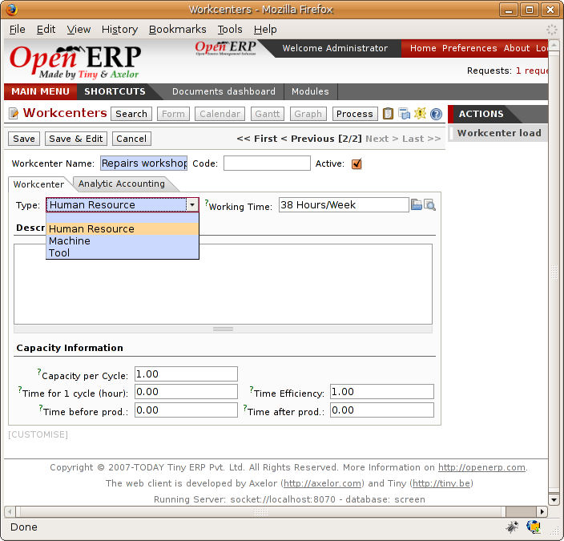
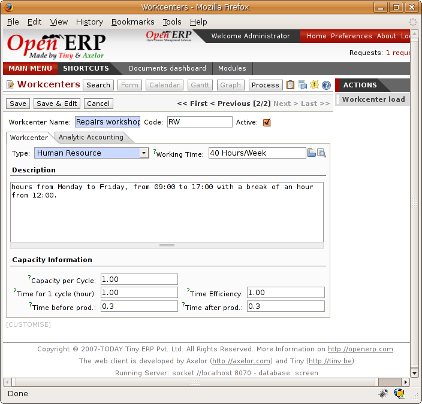
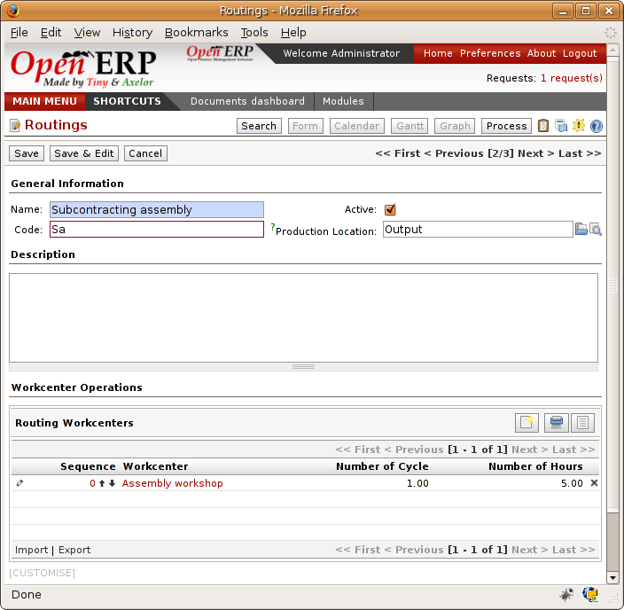
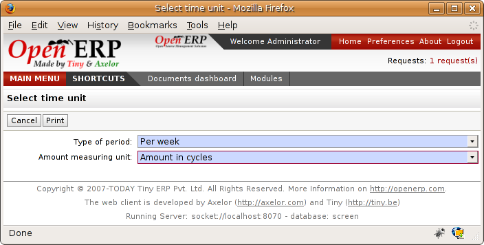
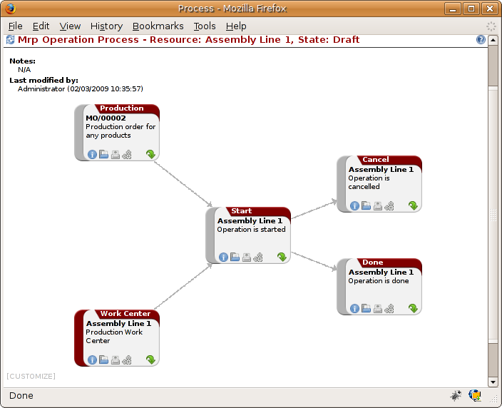
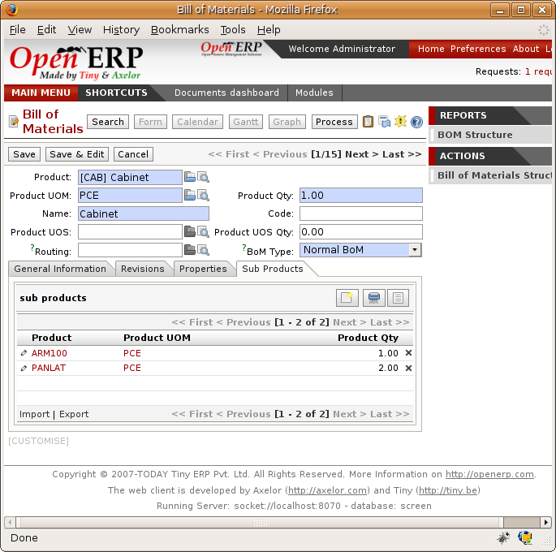

.. i18n: .. index::
.. i18n:    single: scheduler; lead time

.. index::
   single: scheduler; lead time

.. i18n: Calculation of lead times
.. i18n: =========================

Calculation of lead times
=========================

.. i18n: All procurement operations (that is, the requirement for both production orders and purchase orders)
.. i18n: are automatically calculated by the scheduler. But more than just
.. i18n: creating each order, Open ERP plans the timing of each step. 
.. i18n: A planned date calculated by the system can be found on each order document.

All procurement operations (that is, the requirement for both production orders and purchase orders)
are automatically calculated by the scheduler. But more than just
creating each order, Open ERP plans the timing of each step. 
A planned date calculated by the system can be found on each order document.

.. i18n: To organize the whole chain of manufacturing and procurement, Open ERP bases everything on the delivery
.. i18n: date promised to the customer. This is given by the date of the confirmation in the order and the
.. i18n: lead times shown in each product line of the order. This lead time is itself proposed automatically
.. i18n: in the field :guilabel:`Customer Lead Time` shown in the product form. This is the difference 
.. i18n: between the time on an order and that of the delivery.

To organize the whole chain of manufacturing and procurement, Open ERP bases everything on the delivery
date promised to the customer. This is given by the date of the confirmation in the order and the
lead times shown in each product line of the order. This lead time is itself proposed automatically
in the field :guilabel:`Customer Lead Time` shown in the product form. This is the difference 
between the time on an order and that of the delivery.

.. i18n: To see a calculation of the lead times, take the example of the cabinet above. Suppose that the
.. i18n: cabinet is assembled in two steps, using the two following bills of materials.

To see a calculation of the lead times, take the example of the cabinet above. Suppose that the
cabinet is assembled in two steps, using the two following bills of materials.

.. i18n: .. table:: Bill of Materials for 1 ARM100 Unit
.. i18n: 
.. i18n:    ============  ========  ===============
.. i18n:    Product Code  Quantity  Unit of Measure
.. i18n:    ============  ========  ===============
.. i18n:    PANLAT        2         Unit
.. i18n:    BOIS002       0.25      m2
.. i18n:    LIN040        1         m
.. i18n:    BOIS010       0.25      m2
.. i18n:    TAQ000        12        Unit
.. i18n:    ============  ========  ===============

.. table:: Bill of Materials for 1 ARM100 Unit

   ============  ========  ===============
   Product Code  Quantity  Unit of Measure
   ============  ========  ===============
   PANLAT        2         Unit
   BOIS002       0.25      m2
   LIN040        1         m
   BOIS010       0.25      m2
   TAQ000        12        Unit
   ============  ========  ===============

.. i18n: .. table:: Bill of Materials for 2 PANLAT Units
.. i18n: 
.. i18n:    ============  ========  ===============
.. i18n:    Product Code  Quantity  Unit of Measure
.. i18n:    ============  ========  ===============
.. i18n:    BOIS002       0.17      m2
.. i18n:    ============  ========  ===============

.. table:: Bill of Materials for 2 PANLAT Units

   ============  ========  ===============
   Product Code  Quantity  Unit of Measure
   ============  ========  ===============
   BOIS002       0.17      m2
   ============  ========  ===============

.. i18n: The PANLAT is made from an order using the workflow shown. The BOIS02 is purchased on order and the
.. i18n: other products are all found in stock. An order for the product ARM100 will then generate two
.. i18n: production orders (ARM100 and PANLAT) then produce two purchase orders for the product BOIS02.
.. i18n: Product BOIS02 is used in the production of both ARM100 and PANLAT. Set the lead times on the
.. i18n: product forms to the following:

The PANLAT is made from an order using the workflow shown. The BOIS02 is purchased on order and the
other products are all found in stock. An order for the product ARM100 will then generate two
production orders (ARM100 and PANLAT) then produce two purchase orders for the product BOIS02.
Product BOIS02 is used in the production of both ARM100 and PANLAT. Set the lead times on the
product forms to the following:

.. i18n: .. table:: Lead Times
.. i18n: 
.. i18n:    ============ ================== ==================== ==================
.. i18n:    Product Code Customer Lead Time Production Lead Time Supplier Lead Time
.. i18n:    ============ ================== ==================== ==================
.. i18n:    ARM100       30 days            5 days
.. i18n:    PANLAT                          10 days
.. i18n:    BOIS02                                               5 days
.. i18n:    ============ ================== ==================== ==================

.. table:: Lead Times

   ============ ================== ==================== ==================
   Product Code Customer Lead Time Production Lead Time Supplier Lead Time
   ============ ================== ==================== ==================
   ARM100       30 days            5 days
   PANLAT                          10 days
   BOIS02                                               5 days
   ============ ================== ==================== ==================

.. i18n: A customer order placed on the 1st January will set up the following operations and lead times:

A customer order placed on the 1st January will set up the following operations and lead times:

.. i18n: * Delivery ARM100: 31 January (=1st January + 30 days),
.. i18n: 
.. i18n: * Manufacture ARM100: 26 January (=31 January – 5 days),
.. i18n: 
.. i18n: * Manufacture PANLAT: 16 January (=26 January – 10 days),
.. i18n: 
.. i18n: * Purchase BOIS02 (for ARM100): 21 January (=26 January – 5 days),
.. i18n: 
.. i18n: * Purchase BOIS02 (for PANLAT): 11 January (=16 January – 5 days).

* Delivery ARM100: 31 January (=1st January + 30 days),

* Manufacture ARM100: 26 January (=31 January – 5 days),

* Manufacture PANLAT: 16 January (=26 January – 10 days),

* Purchase BOIS02 (for ARM100): 21 January (=26 January – 5 days),

* Purchase BOIS02 (for PANLAT): 11 January (=16 January – 5 days).

.. i18n: In this example, Open ERP will propose placing two orders with the supplier of product BOIS002. Each of
.. i18n: these orders can be for a different planned date. Before confirming these orders the
.. i18n: purchasing manager could group these orders into single order.

In this example, Open ERP will propose placing two orders with the supplier of product BOIS002. Each of
these orders can be for a different planned date. Before confirming these orders the
purchasing manager could group these orders into single order.

.. i18n: Security days
.. i18n: -------------

Security days
-------------

.. i18n: The scheduler will plan all operations as a function of the time configured on the products. But it
.. i18n: is also possible to configure these factors in the company. These factors are then global to the
.. i18n: company, whatever the product concerned. In the description of the company, on the 
.. i18n: :guilabel:`Configuration` tab, you find the following parameters:

The scheduler will plan all operations as a function of the time configured on the products. But it
is also possible to configure these factors in the company. These factors are then global to the
company, whatever the product concerned. In the description of the company, on the 
:guilabel:`Configuration` tab, you find the following parameters:

.. i18n: * Security days: number of days to deduct from a system order to cope with any problems of
.. i18n:   procurement,
.. i18n: 
.. i18n: * Purchase lead time: additional days to include for all purchase orders with this supplier,
.. i18n: 
.. i18n: * Production lead time: number of additional days needed for manufacturing.
.. i18n: 
.. i18n: * Period for calculating requirements: all the requests which are for procuring for a later date to
.. i18n:   the number of days which aren't calculated in the scheduler.

* Security days: number of days to deduct from a system order to cope with any problems of
  procurement,

* Purchase lead time: additional days to include for all purchase orders with this supplier,

* Production lead time: number of additional days needed for manufacturing.

* Period for calculating requirements: all the requests which are for procuring for a later date to
  the number of days which aren't calculated in the scheduler.

.. i18n: .. note:: Purchasing lead time
.. i18n: 
.. i18n:     The security delay for purchases is the average time between the order generated by Open ERP and
.. i18n:     the real purchase time from the supplier by your purchasing department.
.. i18n:     This delay takes account of the order process in your company, including order negotiation time.

.. note:: Purchasing lead time

    The security delay for purchases is the average time between the order generated by Open ERP and
    the real purchase time from the supplier by your purchasing department.
    This delay takes account of the order process in your company, including order negotiation time.

.. i18n: Take for example the following configuration:

Take for example the following configuration:

.. i18n: * Security days: 2,
.. i18n: 
.. i18n: * Purchase Lead time: 3,
.. i18n: 
.. i18n: * Production Lead Time: 1.

* Security days: 2,

* Purchase Lead time: 3,

* Production Lead Time: 1.

.. i18n: The example above will then be given the following lead times:

The example above will then be given the following lead times:

.. i18n: * Delivery ARM100: 29 January (=1st January + 30 days – 2 days),
.. i18n: 
.. i18n: * Manufacture ARM100: 23 January (=29 January – 5 days – 1 day),
.. i18n: 
.. i18n: * Manufacture PANLAT: 12 January (=26 January – 10 days – 1 day),
.. i18n: 
.. i18n: * Purchase BOIS02 (for ARM100): 15 January (=26 January – 5 days – 3 days),
.. i18n: 
.. i18n: * Purchase BOIS02 (for PANLAT): 4 January (=12 January – 5 days – 3 days).

* Delivery ARM100: 29 January (=1st January + 30 days – 2 days),

* Manufacture ARM100: 23 January (=29 January – 5 days – 1 day),

* Manufacture PANLAT: 12 January (=26 January – 10 days – 1 day),

* Purchase BOIS02 (for ARM100): 15 January (=26 January – 5 days – 3 days),

* Purchase BOIS02 (for PANLAT): 4 January (=12 January – 5 days – 3 days).

.. i18n: .. index:: work orders

.. index:: work orders

.. i18n: Operations
.. i18n: ==========

Operations
==========

.. i18n: In the first part of this chapter, manufacturing management was handled in terms of products and
.. i18n: materials. This section focuses on manufacturing operations. To manufacture or assemble products, as
.. i18n: well as using raw materials and finished product you must also handle operations such as assembly,
.. i18n: drilling wood, and cutting timber.

In the first part of this chapter, manufacturing management was handled in terms of products and
materials. This section focuses on manufacturing operations. To manufacture or assemble products, as
well as using raw materials and finished product you must also handle operations such as assembly,
drilling wood, and cutting timber.

.. i18n: The different operations will have different impacts on the costs of manufacture and planning depending
.. i18n: on the available workload.

The different operations will have different impacts on the costs of manufacture and planning depending
on the available workload.

.. i18n: Definition of concepts
.. i18n: ----------------------

Definition of concepts
----------------------

.. i18n: To manage operations you should understand the following concepts

To manage operations you should understand the following concepts

.. i18n: * Workcenters,
.. i18n: 
.. i18n: * Routing,
.. i18n: 
.. i18n: * Operations.

* Workcenters,

* Routing,

* Operations.

.. i18n: .. index::
.. i18n:    single: workcenter

.. index::
   single: workcenter

.. i18n: Workcenters
.. i18n: -----------

Workcenters
-----------

.. i18n: Workcenters represent units of product, capable of doing material transformation operations. You can
.. i18n: distinguish three types of workcenter: machines, tools and human resources.

Workcenters represent units of product, capable of doing material transformation operations. You can
distinguish three types of workcenter: machines, tools and human resources.

.. i18n: .. note:: Workcenter
.. i18n: 
.. i18n:     Workcenters are units of manufacture consisting of one or several people and/or machines
.. i18n:     that can be considered as a unit for the purposes of forecasting capacity and planning.

.. note:: Workcenter

    Workcenters are units of manufacture consisting of one or several people and/or machines
    that can be considered as a unit for the purposes of forecasting capacity and planning.

.. i18n: Use the menu :menuselection:`Manufacturing --> Configuration --> Workcenters` to define a new
.. i18n: workcenter. You get a form as shown in the figure :ref:`fig-mrpwkc`.

Use the menu :menuselection:`Manufacturing --> Configuration --> Workcenters` to define a new
workcenter. You get a form as shown in the figure :ref:`fig-mrpwkc`.

.. i18n: .. _fig-mrpwkc:
.. i18n: 
.. i18n: .. figure:: images/mrp_workcenter.png
.. i18n:    :scale: 75
.. i18n:    :align: center
.. i18n: 
.. i18n:    *Definition of a workcenter*

.. _fig-mrpwkc:

   *Definition of a workcenter*

.. i18n: A workcenter must have a name and a code. You then assign a type: machine, human resource, tool, and
.. i18n: a description of operating hours or functionality. The figure :ref:`fig-mrpwkcwh` represents the hours from Monday
.. i18n: to Friday, from 09:00 to 17:00 with a break of an hour from 12:00.

A workcenter must have a name and a code. You then assign a type: machine, human resource, tool, and
a description of operating hours or functionality. The figure :ref:`fig-mrpwkcwh` represents the hours from Monday
to Friday, from 09:00 to 17:00 with a break of an hour from 12:00.

.. i18n: .. _fig-mrpwkcwh:
.. i18n: 
.. i18n: .. figure:: images/mrp_workcenter_working_hour.png
.. i18n:    :scale: 75
.. i18n:    :align: center
.. i18n: 
.. i18n:    *Working hours for a workcenter*

.. _fig-mrpwkcwh:

   *Working hours for a workcenter*

.. i18n: You should show a description of the workcenter and its operations.

You should show a description of the workcenter and its operations.

.. i18n: Once the database is encoded you should enter data about the production capacity of the workcenter.
.. i18n: Depending on whether you have a machine or a person, a workcenter will be defined in cycles or
.. i18n: hours. If it represents a set of machines and people you can use both cycles and hours at the same
.. i18n: time.

Once the database is encoded you should enter data about the production capacity of the workcenter.
Depending on whether you have a machine or a person, a workcenter will be defined in cycles or
hours. If it represents a set of machines and people you can use both cycles and hours at the same
time.

.. i18n: .. index::
.. i18n:    single: workcenter, cycle

.. index::
   single: workcenter, cycle

.. i18n: .. note:: A Cycle
.. i18n: 
.. i18n:     A cycle corresponds to the time required to carry out an assembly operation.
.. i18n:     The user is free to determine which is the reference operation for a given workcenter.
.. i18n:     It must be represented by the cost and elapsed time of manufacture.
.. i18n: 
.. i18n:     For example, for a printing workcenter, a cycle will be the printing of 1 page or of 1000 pages
.. i18n:     depending on the printer.

.. note:: A Cycle

    A cycle corresponds to the time required to carry out an assembly operation.
    The user is free to determine which is the reference operation for a given workcenter.
    It must be represented by the cost and elapsed time of manufacture.

    For example, for a printing workcenter, a cycle will be the printing of 1 page or of 1000 pages
    depending on the printer.

.. i18n: To define the capacity properly it is necessary know, for each workcenter, what will be the
.. i18n: reference operation which determines the cycle. You can then define the data relative
.. i18n: to the capacity.

To define the capacity properly it is necessary know, for each workcenter, what will be the
reference operation which determines the cycle. You can then define the data relative
to the capacity.

.. i18n: Capacity per cycle (CA): determine the number of operations that can be done in parallel during a
.. i18n: cycle. Generally the number defines the number of identical machines or people defined by the
.. i18n: workcenter.

Capacity per cycle (CA): determine the number of operations that can be done in parallel during a
cycle. Generally the number defines the number of identical machines or people defined by the
workcenter.

.. i18n: Time for a cycle (TC): give the duration in hour for that or the operations defined by a cycle.

Time for a cycle (TC): give the duration in hour for that or the operations defined by a cycle.

.. i18n: Time before production (TS): give the wait in hours to initialise production operations. Generally
.. i18n: this represents the machine setup time.

Time before production (TS): give the wait in hours to initialise production operations. Generally
this represents the machine setup time.

.. i18n: Time after production (TN): give the delay in hours after the end of a production operation.
.. i18n: Generally this represents the cleaning time necessary after an operation.

Time after production (TN): give the delay in hours after the end of a production operation.
Generally this represents the cleaning time necessary after an operation.

.. i18n: Effective time (ET): is a factor that is applied to the three times above to determine the real
.. i18n: production time. This factor enables you to readjust the different times progressively and as a
.. i18n: measure of machine utilization. You can't readjust the other times because generally they're taken
.. i18n: from the machine's data sheet.

Effective time (ET): is a factor that is applied to the three times above to determine the real
production time. This factor enables you to readjust the different times progressively and as a
measure of machine utilization. You can't readjust the other times because generally they're taken
from the machine's data sheet.

.. i18n: The total time for carrying out X operations is then given by the following formula: ((C / CA) * TC
.. i18n: + TS + TN\_ * ET. In this formula the result of the division is rounded upwards. Then if the
.. i18n: capacity per cycle is 6 it takes 3 cycles to realize 15 operations.

The total time for carrying out X operations is then given by the following formula: ((C / CA) * TC
+ TS + TN\_ * ET. In this formula the result of the division is rounded upwards. Then if the
capacity per cycle is 6 it takes 3 cycles to realize 15 operations.

.. i18n: .. tip:: Multi-level routing
.. i18n: 
.. i18n:    It is possible to define routing on several levels to support multi-level bills of materials.
.. i18n:    You can select the routing on each level of a bill of materials.
.. i18n:    The levels are then linked to hierarchies of bills of materials.

.. tip:: Multi-level routing

   It is possible to define routing on several levels to support multi-level bills of materials.
   You can select the routing on each level of a bill of materials.
   The levels are then linked to hierarchies of bills of materials.

.. i18n: The second tab of the production order lets you define the links to analytical account to report the
.. i18n: costs of the workcenter operations. If you leave the different fields empty Open ERP won't have any
.. i18n: effect on the analytic accounts.

The second tab of the production order lets you define the links to analytical account to report the
costs of the workcenter operations. If you leave the different fields empty Open ERP won't have any
effect on the analytic accounts.

.. i18n: .. figure:: images/mrp_workcenter_tab.png
.. i18n:    :scale: 75
.. i18n:    :align: center
.. i18n: 
.. i18n:    *Data about analytic accounts for a workcenter*

.. figure:: images/mrp_workcenter_tab.png
   :scale: 75
   :align: center

   *Data about analytic accounts for a workcenter*

.. i18n: .. index::
.. i18n:    pair: routing; manufacturing

.. index::
   pair: routing; manufacturing

.. i18n: .. index::
.. i18n:    single: routing

.. index::
   single: routing

.. i18n: Routing
.. i18n: -------

Routing
-------

.. i18n: Routings define the assembly operations to be done in workcenters for manufacturing a certain
.. i18n: product. They are usually attached to bills of materials which will define the assembly of products
.. i18n: required for manufacture or for finished products.

Routings define the assembly operations to be done in workcenters for manufacturing a certain
product. They are usually attached to bills of materials which will define the assembly of products
required for manufacture or for finished products.

.. i18n: A routing can be defined directly in a bill of materials or through the menu
.. i18n: :menuselection:`Manufacturing --> Configuration --> Routings`. A routing has a name, a code and a
.. i18n: description. Later in this chapter you'll see that a routing can also be associated with a stock
.. i18n: location. That enable you to indicate where assembly takes place.

A routing can be defined directly in a bill of materials or through the menu
:menuselection:`Manufacturing --> Configuration --> Routings`. A routing has a name, a code and a
description. Later in this chapter you'll see that a routing can also be associated with a stock
location. That enable you to indicate where assembly takes place.

.. i18n: .. figure:: images/mrp_routing.png
.. i18n:    :scale: 75
.. i18n:    :align: center
.. i18n: 
.. i18n:    *Definition of a routing with three operations*

   *Definition of a routing with three operations*

.. i18n: .. note:: Subcontracting assembly
.. i18n: 
.. i18n:     You'll see further on in this chapter that it is possible to link a routing and a stock location
.. i18n:     for the customer or the supplier.
.. i18n:     You do this after you've subcontracted the assembly of a product to a supplier, for example.

.. note:: Subcontracting assembly

    You'll see further on in this chapter that it is possible to link a routing and a stock location
    for the customer or the supplier.
    You do this after you've subcontracted the assembly of a product to a supplier, for example.

.. i18n: In the routing you must show the list of operations that must be done. Each operation must be done
.. i18n: at a workcenter and possess a number of hours and/or cycles be done.

In the routing you must show the list of operations that must be done. Each operation must be done
at a workcenter and possess a number of hours and/or cycles be done.

.. i18n: Impact on the production order
.. i18n: ------------------------------

Impact on the production order
------------------------------

.. i18n: The routings are then attached to the bills of materials which are then also used to generate
.. i18n: product order. On a production order you'll find assembly operations for manufacture on the 
.. i18n: :guilabel:`Operations` tab.

The routings are then attached to the bills of materials which are then also used to generate
product order. On a production order you'll find assembly operations for manufacture on the 
:guilabel:`Operations` tab.

.. i18n: .. figure:: images/mrp_production_workorder.png
.. i18n:    :scale: 75
.. i18n:    :align: center
.. i18n: 
.. i18n:    *Operations on a production order*

.. figure:: images/mrp_production_workorder.png
   :scale: 75
   :align: center

   *Operations on a production order*

.. i18n: The times and the cycles shown in the production order are, in the same way as the materials,
.. i18n: theoretical data. The user can change the values to reflect reality for manufacture.

The times and the cycles shown in the production order are, in the same way as the materials,
theoretical data. The user can change the values to reflect reality for manufacture.

.. i18n: So if you use routings, Open ERP automatically calculates the operations required for the production
.. i18n: order. If the workcenters are linked to analytic accounts, at the end of production, Open Erp will
.. i18n: generate the analytic accounts representing the costs of manufacture. This will allow you to work
.. i18n: out profitability per workcenter or manufacturing unit through analytic accounting.

So if you use routings, Open ERP automatically calculates the operations required for the production
order. If the workcenters are linked to analytic accounts, at the end of production, Open Erp will
generate the analytic accounts representing the costs of manufacture. This will allow you to work
out profitability per workcenter or manufacturing unit through analytic accounting.

.. i18n: But the routings also enable you to manage your production capacity. You will be able to leave the
.. i18n: demand charts for the days / weeks / months ahead to validate that you don't forecast more than you
.. i18n: are capable of producing.

But the routings also enable you to manage your production capacity. You will be able to leave the
demand charts for the days / weeks / months ahead to validate that you don't forecast more than you
are capable of producing.

.. i18n: To see a demand chart, list the workcenters using the menu :menuselection:`Manufacturing -->
.. i18n: Configuration --> Workcenters`. Then select one or several workcenters and click on the action
.. i18n: :guilabel:`Workcenter load`. Open ERP then asks you if you work in cycles or in hours and your
.. i18n: interval is calculated (by day, week or month).

To see a demand chart, list the workcenters using the menu :menuselection:`Manufacturing -->
Configuration --> Workcenters`. Then select one or several workcenters and click on the action
:guilabel:`Workcenter load`. Open ERP then asks you if you work in cycles or in hours and your
interval is calculated (by day, week or month).

.. i18n: .. figure:: images/mrp_workcenter_load.png
.. i18n:    :scale: 75
.. i18n:    :align: center
.. i18n: 
.. i18n:    *Charge by workcenter*

   *Charge by workcenter*

.. i18n: .. tip:: Theoretical times
.. i18n: 
.. i18n:    Once the routings have been clearly defined, you determine the effective  working time per
.. i18n:    assembly worker.
.. i18n:    This is the time actually taken by the assembly worker for each operation.
.. i18n:    That enables you to compare the real working time in your company and work out the productivity
.. i18n:    per person.

.. tip:: Theoretical times

   Once the routings have been clearly defined, you determine the effective  working time per
   assembly worker.
   This is the time actually taken by the assembly worker for each operation.
   That enables you to compare the real working time in your company and work out the productivity
   per person.

.. i18n: .. index::
.. i18n:    single: work operations

.. index::
   single: work operations

.. i18n: Work operations
.. i18n: ---------------

Work operations
---------------

.. i18n: A production order defines the use of the products defined in the Bills of Materials, and the
.. i18n: operations defined in the routing. You've seen how to handle manufacturing production as a top-level process, 
.. i18n: but some companies prefer to have finer-grained control of operations where instead of
.. i18n: specifying just the production process itself, they enter data on each constituent production operation.

A production order defines the use of the products defined in the Bills of Materials, and the
operations defined in the routing. You've seen how to handle manufacturing production as a top-level process, 
but some companies prefer to have finer-grained control of operations where instead of
specifying just the production process itself, they enter data on each constituent production operation.

.. i18n: Management of operations
.. i18n: ------------------------

Management of operations
------------------------

.. i18n: .. note:: Operations
.. i18n: 
.. i18n:    Operations are often called work orders.

.. note:: Operations

   Operations are often called work orders.

.. i18n: .. index::
.. i18n:    single: module; mrp_operations

.. index::
   single: module; mrp_operations

.. i18n: To work using work orders you must install the optional module :mod:`mrp_operations`. Once the module
.. i18n: is installed you'll find a new menu called :menuselection:`Manufacturing --> Operations -->
.. i18n: Operations` to be carried out. The assembly workers must then encode each step operation by
.. i18n: operation and, for each step, the real working time for it.

To work using work orders you must install the optional module :mod:`mrp_operations`. Once the module
is installed you'll find a new menu called :menuselection:`Manufacturing --> Operations -->
Operations` to be carried out. The assembly workers must then encode each step operation by
operation and, for each step, the real working time for it.

.. i18n: .. figure:: images/mrp_operations_tree.png
.. i18n:    :scale: 75
.. i18n:    :align: center
.. i18n: 
.. i18n:    *List of operations to be carried out.*

.. figure:: images/mrp_operations_tree.png
   :scale: 75
   :align: center

   *List of operations to be carried out.*

.. i18n: Operations must then be carried out one by one. On each operation the operator can click on
.. i18n: :guilabel:`Start operation` and then :guilabel:`Close Operation`. The time is then worked out
.. i18n: automatically on the operation between the two changes of status. The operator can also put the
.. i18n: operation on hold and start again later.

Operations must then be carried out one by one. On each operation the operator can click on
:guilabel:`Start operation` and then :guilabel:`Close Operation`. The time is then worked out
automatically on the operation between the two changes of status. The operator can also put the
operation on hold and start again later.

.. i18n: The following process is attached to each operation.

The following process is attached to each operation.

.. i18n: .. figure:: images/mrp_operations_workflow.png
.. i18n:    :scale: 75
.. i18n:    :align: center
.. i18n: 
.. i18n:    *Process for handling an operation*

   *Process for handling an operation*

.. i18n: Thanks to this use by operation, the real working time is recorded on the production order.

Thanks to this use by operation, the real working time is recorded on the production order.

.. i18n: The production order is automatically put into the state 'Running' once the first operation has been
.. i18n: started. That consumes some raw materials. Similarly the production order is closed automatically
.. i18n: once the last operation is completed. The finished products are then made.

The production order is automatically put into the state 'Running' once the first operation has been
started. That consumes some raw materials. Similarly the production order is closed automatically
once the last operation is completed. The finished products are then made.

.. i18n: .. index:: barcode

.. index:: barcode

.. i18n: Events and barcodes
.. i18n: ===================

Events and barcodes
===================

.. i18n: If the company wants to work with barcodes in manufacturing you can work on each operation using
.. i18n: events. Here are some examples of events for an operations:

If the company wants to work with barcodes in manufacturing you can work on each operation using
events. Here are some examples of events for an operations:

.. i18n: * Starting an operation,
.. i18n: 
.. i18n: * Pausing an operation,
.. i18n: 
.. i18n: * Restarting an operation,
.. i18n: 
.. i18n: * Closing an operation,
.. i18n: 
.. i18n: * Cancelling an operation.

* Starting an operation,

* Pausing an operation,

* Restarting an operation,

* Closing an operation,

* Cancelling an operation.

.. i18n: You place barcodes on the production orders on the machines or operators and a form of barcodes
.. i18n: representing the events. To print barcodes select the events using the menu
.. i18n: :menuselection:`Manufacturing --> Configuration --> Codes from start to finish`. Then click for
.. i18n: printing the barcodes for the selected events. You can do the same for printing barcodes for the
.. i18n: workcenters using the menu :menuselection:`Manufacturing --> Configuration --> Workcenters`.

You place barcodes on the production orders on the machines or operators and a form of barcodes
representing the events. To print barcodes select the events using the menu
:menuselection:`Manufacturing --> Configuration --> Codes from start to finish`. Then click for
printing the barcodes for the selected events. You can do the same for printing barcodes for the
workcenters using the menu :menuselection:`Manufacturing --> Configuration --> Workcenters`.

.. i18n: Using the system these operations don't need data to be entered on the keyboard. To use these
.. i18n: barcodes, open the menu :menuselection:`Manufacturing --> Barcode events`. You must then scan, in
.. i18n: order:

Using the system these operations don't need data to be entered on the keyboard. To use these
barcodes, open the menu :menuselection:`Manufacturing --> Barcode events`. You must then scan, in
order:

.. i18n: #. The barcode of the production order,
.. i18n: 
.. i18n: #. The workcenter used,
.. i18n: 
.. i18n: #. The event code.

#. The barcode of the production order,

#. The workcenter used,

#. The event code.

.. i18n: .. figure:: images/mrp_operation.png
.. i18n:    :scale: 75
.. i18n:    :align: center
.. i18n: 
.. i18n:    *Capturing events for work orders*

.. figure:: images/mrp_operation.png
   :scale: 75
   :align: center

   *Capturing events for work orders*

.. i18n: Open ERP then applies the events to the relevant operation.

Open ERP then applies the events to the relevant operation.

.. i18n: Subcontracting manufacture
.. i18n: --------------------------

Subcontracting manufacture
--------------------------

.. i18n: In Open ERP it is possible to subcontract production operations (for example painting and item
.. i18n: assembly) at a supplier's. To do this you must indicate on the relevant routing document a supplier
.. i18n: location for stock management.

In Open ERP it is possible to subcontract production operations (for example painting and item
assembly) at a supplier's. To do this you must indicate on the relevant routing document a supplier
location for stock management.

.. i18n: You must then configure a location dedicated to this supplier with the following data:

You must then configure a location dedicated to this supplier with the following data:

.. i18n: * :guilabel:`Type of location` : Supplier,
.. i18n: 
.. i18n: * :guilabel:`Address of Location` : Select an address of the subcontractor partner,
.. i18n: 
.. i18n: * :guilabel:`Type of linkage` : Fixed,
.. i18n: 
.. i18n: * :guilabel:`Location of linkage` : your Stock,
.. i18n: 
.. i18n: * :guilabel:`Lead time for linkage` : number of days before receipt of the finished product.

* :guilabel:`Type of location` : Supplier,

* :guilabel:`Address of Location` : Select an address of the subcontractor partner,

* :guilabel:`Type of linkage` : Fixed,

* :guilabel:`Location of linkage` : your Stock,

* :guilabel:`Lead time for linkage` : number of days before receipt of the finished product.

.. i18n: Then once the manufacture has been planned for the product in question, Open ERP will generate the
.. i18n: following steps:

Then once the manufacture has been planned for the product in question, Open ERP will generate the
following steps:

.. i18n: Delivery of raw materials to the stores for the supplier,

Delivery of raw materials to the stores for the supplier,

.. i18n: Production order for the products at the suppliers and receipt of the finished products in the
.. i18n: stores.

Production order for the products at the suppliers and receipt of the finished products in the
stores.

.. i18n: Once the production order has been confirmed, Open ERP automatically generates a delivery order to
.. i18n: send to the raw materials supplier. The storesperson can access this delivery order using the menu
.. i18n: :menuselection:`Stock Management --> Incoming Products`. The raw materials will then be placed in
.. i18n: stock at the supplier's stores.

Once the production order has been confirmed, Open ERP automatically generates a delivery order to
send to the raw materials supplier. The storesperson can access this delivery order using the menu
:menuselection:`Stock Management --> Incoming Products`. The raw materials will then be placed in
stock at the supplier's stores.

.. i18n: Once the delivery of raw materials has been confirmed, Open ERP activates the production order. The
.. i18n: supplier uses the raw materials sent to produce the finished goods which will automatically be put
.. i18n: in your own stores. The confirmation of this manufacture is made when you receive the products from
.. i18n: your supplier. It's then that you indicate the quantities consumed by your supplier

Once the delivery of raw materials has been confirmed, Open ERP activates the production order. The
supplier uses the raw materials sent to produce the finished goods which will automatically be put
in your own stores. The confirmation of this manufacture is made when you receive the products from
your supplier. It's then that you indicate the quantities consumed by your supplier

.. i18n: .. tip:: Subcontract without routing
.. i18n: 
.. i18n:    If you don't use routing you can always subcontract work orders by creating an empty routing in
.. i18n:    the subcontract bill of materials.

.. tip:: Subcontract without routing

   If you don't use routing you can always subcontract work orders by creating an empty routing in
   the subcontract bill of materials.

.. i18n: Production orders are found in the menu :menuselection:`Manufacture --> Production Orders -->
.. i18n: Production Orders to start`. A production order is always carried out in two stages:

Production orders are found in the menu :menuselection:`Manufacture --> Production Orders -->
Production Orders to start`. A production order is always carried out in two stages:

.. i18n: #. Consumption of raw materials.
.. i18n: 
.. i18n: #. Production of finished products.

#. Consumption of raw materials.

#. Production of finished products.

.. i18n: Depending on the company's needs, you can specify that the first step is confirmed at the
.. i18n: acknowledgment of manufacturing supplier and the second at the receipt of finished goods in the
.. i18n: warehouse.

Depending on the company's needs, you can specify that the first step is confirmed at the
acknowledgment of manufacturing supplier and the second at the receipt of finished goods in the
warehouse.

.. i18n: Treatment of exceptions
.. i18n: =======================

Treatment of exceptions
=======================

.. i18n: The set of stock requirements is generated by procurement orders. Then for each customer order line
.. i18n: or raw materials in a manufacturing order, you will find a procurement form. To review all the
.. i18n: procurement orders use the menu :menuselection:`Manufacturing --> Procurement orders`.

The set of stock requirements is generated by procurement orders. Then for each customer order line
or raw materials in a manufacturing order, you will find a procurement form. To review all the
procurement orders use the menu :menuselection:`Manufacturing --> Procurement orders`.

.. i18n: In normal system use, you don't need to worry about procurement orders because they're automatically
.. i18n: generated by Open ERP and the user will usually work on the results of a procurement: a production
.. i18n: order, a task or a supplier order.

In normal system use, you don't need to worry about procurement orders because they're automatically
generated by Open ERP and the user will usually work on the results of a procurement: a production
order, a task or a supplier order.

.. i18n: But if there are configuration problems, the system can remain blocked by a procurement without
.. i18n: generating a corresponding document. For example, suppose that you configure a product :guilabel:`Procure Method`
.. i18n: as ``Make to Order`` but you haven't defined the bill of materials. In that case procurement of the
.. i18n: product will stay blocked in an exception state ``No Bill of Materials defined for this product``. You
.. i18n: must then create a bill of materials to unblock the problem.

But if there are configuration problems, the system can remain blocked by a procurement without
generating a corresponding document. For example, suppose that you configure a product :guilabel:`Procure Method`
as ``Make to Order`` but you haven't defined the bill of materials. In that case procurement of the
product will stay blocked in an exception state ``No Bill of Materials defined for this product``. You
must then create a bill of materials to unblock the problem.

.. i18n: Possible problems include:

Possible problems include:

.. i18n: * No bill of materials defined for production: in this case you've got to create one or indicate
.. i18n:   that the product can be purchased instead.
.. i18n: 
.. i18n: * No supplier available for a purchase: it's then necessary to define a supplier in the second tab
.. i18n:   of the product form.
.. i18n: 
.. i18n: * No address defined on the supplier partner: you must complete an address for the supplier by
.. i18n:   default for the product in consideration.
.. i18n: 
.. i18n: * No quantity available in stock: you must create a rule for automatically procuring (for example a
.. i18n:   minimum stock rule) and put it in the order, or manually procure it.

* No bill of materials defined for production: in this case you've got to create one or indicate
  that the product can be purchased instead.

* No supplier available for a purchase: it's then necessary to define a supplier in the second tab
  of the product form.

* No address defined on the supplier partner: you must complete an address for the supplier by
  default for the product in consideration.

* No quantity available in stock: you must create a rule for automatically procuring (for example a
  minimum stock rule) and put it in the order, or manually procure it.

.. i18n: Some problems are just those of timing and can be automatically corrected by the system. That's why
.. i18n: Open ERP has the two following menus:

Some problems are just those of timing and can be automatically corrected by the system. That's why
Open ERP has the two following menus:

.. i18n: * :menuselection:`Manufacturing --> Automatic Procurement --> Procurement Exceptions --> Exceptions
.. i18n:   to correct`,
.. i18n: 
.. i18n: * :menuselection:`Manufacturing --> Automatic Procurement --> Procurement Exceptions --> Temporary
.. i18n:   exceptions`.

* :menuselection:`Manufacturing --> Automatic Procurement --> Procurement Exceptions --> Exceptions
  to correct`,

* :menuselection:`Manufacturing --> Automatic Procurement --> Procurement Exceptions --> Temporary
  exceptions`.

.. i18n: If a product must be 'in stock' but is not available in your stores, Open ERP will make the
.. i18n: exception in 'temporary' or 'to be corrected'. The exception is temporary if the system can procure
.. i18n: it automatically, for example if a procurement rule is defined for minimum stock.

If a product must be 'in stock' but is not available in your stores, Open ERP will make the
exception in 'temporary' or 'to be corrected'. The exception is temporary if the system can procure
it automatically, for example if a procurement rule is defined for minimum stock.

.. i18n: .. figure:: images/mrp_exception.png
.. i18n:    :scale: 75
.. i18n:    :align: center
.. i18n: 
.. i18n:    *Example of a procurement in exception*

.. figure:: images/mrp_exception.png
   :scale: 75
   :align: center

   *Example of a procurement in exception*

.. i18n: If no procurement rule is defined the exception must be corrected manually by the user. Once the
.. i18n: exception is corrected you can restart by clicking on :guilabel:`Retry`. If you don't do that then
.. i18n: Open ERP will automatically recalculate on the next automated requirements calculation.

If no procurement rule is defined the exception must be corrected manually by the user. Once the
exception is corrected you can restart by clicking on :guilabel:`Retry`. If you don't do that then
Open ERP will automatically recalculate on the next automated requirements calculation.

.. i18n: Manual procurement
.. i18n: ==================

Manual procurement
==================

.. i18n: To procure internally, you can create a procurement order manually. Use the menu
.. i18n: :menuselection:`Manufacturing --> Procurement Orders --> New Procurement` to do this.

To procure internally, you can create a procurement order manually. Use the menu
:menuselection:`Manufacturing --> Procurement Orders --> New Procurement` to do this.

.. i18n: .. figure:: images/mrp_procurement.png
.. i18n:    :scale: 75
.. i18n:    :align: center
.. i18n: 
.. i18n:    *Encoding for a new procurement order*

.. figure:: images/mrp_procurement.png
   :scale: 75
   :align: center

   *Encoding for a new procurement order*

.. i18n: The procurement order will then be responsible for calculating a  proposal for automatic procurement
.. i18n: for the product concerned. This procurement wll start a task, a purchase order form the supplier or
.. i18n: a production depending on the product configuration.

The procurement order will then be responsible for calculating a  proposal for automatic procurement
for the product concerned. This procurement wll start a task, a purchase order form the supplier or
a production depending on the product configuration.

.. i18n: .. figure:: images/mrp_procurement_flow.png
.. i18n:    :scale: 75
.. i18n:    :align: center
.. i18n: 
.. i18n:    *Workflow for handling a procurement, a function of the product configuration*

.. figure:: images/mrp_procurement_flow.png
   :scale: 75
   :align: center

   *Workflow for handling a procurement, a function of the product configuration*

.. i18n: It is better to encode a procurement order rather than direct purchasing or production, That method
.. i18n: has the following advantages:

It is better to encode a procurement order rather than direct purchasing or production, That method
has the following advantages:

.. i18n: The form is simpler because Open ERP calculates the different values from other values and defined
.. i18n: rules: purchase date calculated from order date, default supplier, raw materials needs, selection of
.. i18n: the most suitable bill of materials, etc

The form is simpler because Open ERP calculates the different values from other values and defined
rules: purchase date calculated from order date, default supplier, raw materials needs, selection of
the most suitable bill of materials, etc

.. i18n: The calculation of requirements prioritises the procurements. If you encode a purchase directly you
.. i18n: short-circuit the planning of different procurements.

The calculation of requirements prioritises the procurements. If you encode a purchase directly you
short-circuit the planning of different procurements.

.. i18n: .. tip:: Shortcuts
.. i18n: 
.. i18n:    On the product form you have an :guilabel:`ACTIONS` shortcut button :guilabel:`Create Procurements`
.. i18n:    that lets you quickly create a new procurement order.

.. tip:: Shortcuts

   On the product form you have an :guilabel:`ACTIONS` shortcut button :guilabel:`Create Procurements`
   that lets you quickly create a new procurement order.

.. i18n: .. index:: waste products

.. index:: waste products

.. i18n: Management of waste products and secondary products
.. i18n: ===================================================

Management of waste products and secondary products
===================================================

.. i18n: .. index::
.. i18n:    single: module; mrp_subproduct

.. index::
   single: module; mrp_subproduct

.. i18n: For the management of waste you must install the module :mod:`mrp_subproduct`. The normal behaviour of
.. i18n: manufacture in Open ERP enables you to manufacture several units of the same finished product from
.. i18n: raw materials (A + B > C). With waste management, the result of a manufacture can be to have both
.. i18n: finished products and secondary products (A + B > C + D).

For the management of waste you must install the module :mod:`mrp_subproduct`. The normal behaviour of
manufacture in Open ERP enables you to manufacture several units of the same finished product from
raw materials (A + B > C). With waste management, the result of a manufacture can be to have both
finished products and secondary products (A + B > C + D).

.. i18n: .. note::  Waste material
.. i18n: 
.. i18n:    In Open ERP waste material corresponds to secondary products that are a by-product of the main
.. i18n:    manufacturing process.
.. i18n:    For example, cutting planks of timber will produce other planks but these bits of timber are too
.. i18n:    small
.. i18n:    (or the offcuts may have value for the company if they can be used elsewhere).

.. note::  Waste material

   In Open ERP waste material corresponds to secondary products that are a by-product of the main
   manufacturing process.
   For example, cutting planks of timber will produce other planks but these bits of timber are too
   small
   (or the offcuts may have value for the company if they can be used elsewhere).

.. i18n: If the module :mod:`mrp_subproduct` has been installed you get a new field in the Bill of Material that
.. i18n: lets you set secondary products resulting from the manufacture of the finished product.

If the module :mod:`mrp_subproduct` has been installed you get a new field in the Bill of Material that
lets you set secondary products resulting from the manufacture of the finished product.

.. i18n: .. figure:: images/mrp_bom_subproduct.png
.. i18n:    :scale: 75
.. i18n:    :align: center
.. i18n: 
.. i18n:    *Definition of waste products in a bill of materials*

   *Definition of waste products in a bill of materials*

.. i18n: When Open ERP generates a production order based on a bill of materials that uses secondary product
.. i18n: you pick up the list of all products in the the third tab of the production order 'Finished
.. i18n: Products'.

When Open ERP generates a production order based on a bill of materials that uses secondary product
you pick up the list of all products in the the third tab of the production order 'Finished
Products'.

.. i18n: .. figure:: images/mrp_production.png
.. i18n:    :scale: 75
.. i18n:    :align: center
.. i18n: 
.. i18n:    *A production order producing several finished products*

.. figure:: images/mrp_production.png
   :scale: 75
   :align: center

   *A production order producing several finished products*

.. i18n: Secondary products enable you to generate several types of products from the same raw materials and
.. i18n: manufacturing methods – only these aren't used in the calculation of requirements. Then if you
.. i18n: need the secondary products Open ERP won't ask you to manufacture another product to use the waste
.. i18n: products and secondary products of this manufacture. In this case you should enter another
.. i18n: production order for the secondary product.

Secondary products enable you to generate several types of products from the same raw materials and
manufacturing methods – only these aren't used in the calculation of requirements. Then if you
need the secondary products Open ERP won't ask you to manufacture another product to use the waste
products and secondary products of this manufacture. In this case you should enter another
production order for the secondary product.

.. i18n: .. note:: Services in Manufacturing
.. i18n: 
.. i18n:    Unlike most software for production management, Open ERP manages services as well as stockable
.. i18n:    products.
.. i18n:    So it's possible to put products of type :guilabel:`Service` in a bill of materials.
.. i18n:    These don't appear in the production order but their requirements will be taken into account.
.. i18n: 
.. i18n:    If they're defined as :guilabel:`Make to Order` Open ERP will generate a task for the manufacture or a
.. i18n:    subcontract order for the operations.
.. i18n:    The behaviour will depend on the supply method configured on the product form :guilabel:`Buy` or :guilabel:`Produce`.

.. note:: Services in Manufacturing

   Unlike most software for production management, Open ERP manages services as well as stockable
   products.
   So it's possible to put products of type :guilabel:`Service` in a bill of materials.
   These don't appear in the production order but their requirements will be taken into account.

   If they're defined as :guilabel:`Make to Order` Open ERP will generate a task for the manufacture or a
   subcontract order for the operations.
   The behaviour will depend on the supply method configured on the product form :guilabel:`Buy` or :guilabel:`Produce`.

.. i18n: .. index:: repairs

.. index:: repairs

.. i18n: Management of repairs
.. i18n: =====================

Management of repairs
=====================

.. i18n: .. index::
.. i18n:    single: module; mrp_repair

.. index::
   single: module; mrp_repair

.. i18n: The management of repairs is carried out using the module :mod:`mrp_repair`. Once it's installed this
.. i18n: module adds new :menuselection:`Manufacturing --> Repairs` menus under the Manufacturing menu for
.. i18n: creating repair jobs and reviewing repairs in progress.

The management of repairs is carried out using the module :mod:`mrp_repair`. Once it's installed this
module adds new :menuselection:`Manufacturing --> Repairs` menus under the Manufacturing menu for
creating repair jobs and reviewing repairs in progress.

.. i18n: In Open ERP a repair will have the following effects:

In Open ERP a repair will have the following effects:

.. i18n: * Use of materials: items for replacement,
.. i18n: 
.. i18n: * Production of products: items replaced from reserved stock,
.. i18n: 
.. i18n: * Quality control: tracking the reasons for repair,
.. i18n: 
.. i18n: * Accounting entries: following stock moves,
.. i18n: 
.. i18n: * Receipt and delivery of product from and to the end user,
.. i18n: 
.. i18n: * Adding operations that can be seen in the product's traceability,
.. i18n: 
.. i18n: * Invoicing items used and/or free for repairs.

* Use of materials: items for replacement,

* Production of products: items replaced from reserved stock,

* Quality control: tracking the reasons for repair,

* Accounting entries: following stock moves,

* Receipt and delivery of product from and to the end user,

* Adding operations that can be seen in the product's traceability,

* Invoicing items used and/or free for repairs.

.. i18n: Entering data for a new repair
.. i18n: ------------------------------

Entering data for a new repair
------------------------------

.. i18n: Use the menu :menuselection:`Manufacturing --> Repairs --> New Repair` to enter a new repair into
.. i18n: the system. You'll see a blank form for the repair data, as shown in the figure :ref:`fig-mrprepnew` below.

Use the menu :menuselection:`Manufacturing --> Repairs --> New Repair` to enter a new repair into
the system. You'll see a blank form for the repair data, as shown in the figure :ref:`fig-mrprepnew` below.

.. i18n: .. _fig-mrprepnew:
.. i18n: 
.. i18n: .. figure:: images/mrp_repair_new.png
.. i18n:    :scale: 75
.. i18n:    :align: center
.. i18n: 
.. i18n:    *Entering data for a new repair*

.. _fig-mrprepnew:

.. figure:: images/mrp_repair_new.png
   :scale: 75
   :align: center

   *Entering data for a new repair*

.. i18n: Start by identifying the product that will be repaired using the product lot number. Open ERP then
.. i18n: automatically completes fields from the selected lot – the partner fields, address, delivery
.. i18n: location, and stock move.

Start by identifying the product that will be repaired using the product lot number. Open ERP then
automatically completes fields from the selected lot – the partner fields, address, delivery
location, and stock move.

.. i18n: If a warranty period has been defined in the product description, in months, Open ERP then completes
.. i18n: the field :guilabel:`Warranty limit` with the correct warranty date.

If a warranty period has been defined in the product description, in months, Open ERP then completes
the field :guilabel:`Warranty limit` with the correct warranty date.

.. i18n: You must then specify the components that you'll be adding, replacing or removing in the operations
.. i18n: part. On each line you must specify the following:

You must then specify the components that you'll be adding, replacing or removing in the operations
part. On each line you must specify the following:

.. i18n: Add or remove a component of the finished product:

Add or remove a component of the finished product:

.. i18n: * Product Component,
.. i18n: 
.. i18n: * Quantity,
.. i18n: 
.. i18n: * Unit of Measure
.. i18n: 
.. i18n: * Price of Component,
.. i18n: 
.. i18n: * Possible lot number,
.. i18n: 
.. i18n: * Location where the component was found,
.. i18n: 
.. i18n: * To invoice or not.

* Product Component,

* Quantity,

* Unit of Measure

* Price of Component,

* Possible lot number,

* Location where the component was found,

* To invoice or not.

.. i18n: Once the component has been selected, Open ERP automatically completes most of the fields:

Once the component has been selected, Open ERP automatically completes most of the fields:

.. i18n: * :guilabel:`Quantity` : 1,
.. i18n: 
.. i18n: * :guilabel:`Unit of Measure` : unit for managing stock defined in the product form,
.. i18n: 
.. i18n: * :guilabel:`Component Price` : calculated from the customer list price,
.. i18n: 
.. i18n: * :guilabel:`Source location` : given by the stock management,
.. i18n: 
.. i18n: * :guilabel:`To invoice or not` : depends on the actual date and the quarantee period.

* :guilabel:`Quantity` : 1,

* :guilabel:`Unit of Measure` : unit for managing stock defined in the product form,

* :guilabel:`Component Price` : calculated from the customer list price,

* :guilabel:`Source location` : given by the stock management,

* :guilabel:`To invoice or not` : depends on the actual date and the quarantee period.

.. i18n: This information is automatically proposed by the system but you can modify it all yourself.

This information is automatically proposed by the system but you can modify it all yourself.

.. i18n: You can also encode additional charges in the second tab of the repair - applicable list price,
.. i18n: address and type of invoice, as well as additional line items that need to be added to the repair
.. i18n: bill.

You can also encode additional charges in the second tab of the repair - applicable list price,
address and type of invoice, as well as additional line items that need to be added to the repair
bill.

.. i18n: .. figure:: images/mrp_repair_tab2.png
.. i18n:    :scale: 75
.. i18n:    :align: center
.. i18n: 
.. i18n:    *Repair form, second tab*

.. figure:: images/mrp_repair_tab2.png
   :scale: 75
   :align: center

   *Repair form, second tab*

.. i18n: The third tab, Quality, is for encoding information about the quality: internal notes, notes for the
.. i18n: quotation, corrective actions and preventative actions for example.

The third tab, Quality, is for encoding information about the quality: internal notes, notes for the
quotation, corrective actions and preventative actions for example.

.. i18n: Repair workflow
.. i18n: ---------------

Repair workflow
---------------

.. i18n: A defined process handles a repair order – both the repair itself and invoicing the client. The
.. i18n: figure :ref:`fig-mrprepflow` shows this repair process.

A defined process handles a repair order – both the repair itself and invoicing the client. The
figure :ref:`fig-mrprepflow` shows this repair process.

.. i18n: .. _fig-mrprepflow:
.. i18n: 
.. i18n: .. figure:: images/mrp_repair_workflow.png
.. i18n:    :scale: 75
.. i18n:    :align: center
.. i18n: 
.. i18n:    *Process for handling a repair*

.. _fig-mrprepflow:

.. figure:: images/mrp_repair_workflow.png
   :scale: 75
   :align: center

   *Process for handling a repair*

.. i18n: Once a repair has been entered onto the system, it is in the 'draft' state. In this state it has no
.. i18n: impact on the rest of the system. You can print a quotation from it using the action 'Print
.. i18n: Quotation'. The repair quotation can then be sent to the customer.

Once a repair has been entered onto the system, it is in the 'draft' state. In this state it has no
impact on the rest of the system. You can print a quotation from it using the action 'Print
Quotation'. The repair quotation can then be sent to the customer.

.. i18n: Once the customer approves the repair, use the menu :menuselection:`Manufacturing --> Repairs -->
.. i18n: Repairs in quotation` to find the draft repair. Click to confirm the draft repair and put it into
.. i18n: the running state. You can specify the invoicing mode in the second tab:

Once the customer approves the repair, use the menu :menuselection:`Manufacturing --> Repairs -->
Repairs in quotation` to find the draft repair. Click to confirm the draft repair and put it into
the running state. You can specify the invoicing mode in the second tab:

.. i18n: * no invoicing,
.. i18n: 
.. i18n: * invoicing before repair,
.. i18n: 
.. i18n: * invoicing after repair.

* no invoicing,

* invoicing before repair,

* invoicing after repair.

.. i18n: You can confirm the repair operation or create an invoice for the customer depending on this state.

You can confirm the repair operation or create an invoice for the customer depending on this state.

.. i18n: .. index::
.. i18n:    pair: invoicing; repair

.. index::
   pair: invoicing; repair

.. i18n: Invoicing the repair
.. i18n: --------------------

Invoicing the repair
--------------------

.. i18n: When the repair is to be invoiced, an invoice is generated in the draft state by the system. This
.. i18n: invoice contains the raw materials used (replaced components) and any other costs such as the time
.. i18n: used for the repair. These other costs are entered on the second tab of the repair form.

When the repair is to be invoiced, an invoice is generated in the draft state by the system. This
invoice contains the raw materials used (replaced components) and any other costs such as the time
used for the repair. These other costs are entered on the second tab of the repair form.

.. i18n: If the product to be repaired is still under guarantee, Open ERP automatically suggests that the
.. i18n: components themselves are not invoiced, but will still use any other defined costs. You can override
.. i18n: any of these default values when you're entering the data.

If the product to be repaired is still under guarantee, Open ERP automatically suggests that the
components themselves are not invoiced, but will still use any other defined costs. You can override
any of these default values when you're entering the data.

.. i18n: The link to the generated invoice is shown on the second tab of the repair document.

The link to the generated invoice is shown on the second tab of the repair document.

.. i18n: Stock movements and repair
.. i18n: --------------------------

Stock movements and repair
--------------------------

.. i18n: When the repair has been carried out, Open ERP automatically carries out stock movements for
.. i18n: components that have been removed, added or replaced on the finished product.

When the repair has been carried out, Open ERP automatically carries out stock movements for
components that have been removed, added or replaced on the finished product.

.. i18n: The move operations are carried out using the locations shown on the first tab of the repair
.. i18n: document. If a destination location has been specified, Open ERP automatically handles the final
.. i18n: customer delivery order when the repair has been completed. This also lets you manage the delivery
.. i18n: of the repaired products.

The move operations are carried out using the locations shown on the first tab of the repair
document. If a destination location has been specified, Open ERP automatically handles the final
customer delivery order when the repair has been completed. This also lets you manage the delivery
of the repaired products.

.. i18n: For example, take the case of the cabinet that was produced at the start of this chapter. If you
.. i18n: have to replace the shelf PANLAT, you must enter data for the repair as shown in figure :ref:`fig-mrpreppan`.

For example, take the case of the cabinet that was produced at the start of this chapter. If you
have to replace the shelf PANLAT, you must enter data for the repair as shown in figure :ref:`fig-mrpreppan`.

.. i18n: .. _fig-mrpreppan:
.. i18n: 
.. i18n: .. figure:: images/mrp_repair_panlat.png
.. i18n:    :scale: 75
.. i18n:    :align: center
.. i18n: 
.. i18n:    *Repair of a shelf in a cabinet*

.. _fig-mrpreppan:

.. figure:: images/mrp_repair_panlat.png
   :scale: 75
   :align: center

   *Repair of a shelf in a cabinet*

.. i18n: In this example, you'd carry out the following operations:

In this example, you'd carry out the following operations:

.. i18n: * Removal of a PANLAT shelf in the cabinet and put the faulty shelf in the location *Defective Products*,
.. i18n: 
.. i18n: * Placement of a new PANLAT shelf that has been taken from stock.

* Removal of a PANLAT shelf in the cabinet and put the faulty shelf in the location *Defective Products*,

* Placement of a new PANLAT shelf that has been taken from stock.

.. i18n: When the repair is ready to be confirmed, Open ERP will generate the following stock moves:

When the repair is ready to be confirmed, Open ERP will generate the following stock moves:

.. i18n: * Put faulty PANLAT into suitable stock location *Default Production > Defective Products*,
.. i18n: 
.. i18n: * Consume PANLAT: *Stock > Default production*.

* Put faulty PANLAT into suitable stock location *Default Production > Defective Products*,

* Consume PANLAT: *Stock > Default production*.

.. i18n: If you analyze the traceability of this lot number you'll see all the repair operations in the
.. i18n: upstream and downstream traceability lists of the products concerned.

If you analyze the traceability of this lot number you'll see all the repair operations in the
upstream and downstream traceability lists of the products concerned.

.. i18n: .. Copyright © Open Object Press. All rights reserved.

.. Copyright © Open Object Press. All rights reserved.

.. i18n: .. You may take electronic copy of this publication and distribute it if you don't
.. i18n: .. change the content. You can also print a copy to be read by yourself only.

.. You may take electronic copy of this publication and distribute it if you don't
.. change the content. You can also print a copy to be read by yourself only.

.. i18n: .. We have contracts with different publishers in different countries to sell and
.. i18n: .. distribute paper or electronic based versions of this book (translated or not)
.. i18n: .. in bookstores. This helps to distribute and promote the Open ERP product. It
.. i18n: .. also helps us to create incentives to pay contributors and authors using author
.. i18n: .. rights of these sales.

.. We have contracts with different publishers in different countries to sell and
.. distribute paper or electronic based versions of this book (translated or not)
.. in bookstores. This helps to distribute and promote the Open ERP product. It
.. also helps us to create incentives to pay contributors and authors using author
.. rights of these sales.

.. i18n: .. Due to this, grants to translate, modify or sell this book are strictly
.. i18n: .. forbidden, unless Tiny SPRL (representing Open Object Press) gives you a
.. i18n: .. written authorisation for this.

.. Due to this, grants to translate, modify or sell this book are strictly
.. forbidden, unless Tiny SPRL (representing Open Object Press) gives you a
.. written authorisation for this.

.. i18n: .. Many of the designations used by manufacturers and suppliers to distinguish their
.. i18n: .. products are claimed as trademarks. Where those designations appear in this book,
.. i18n: .. and Open Object Press was aware of a trademark claim, the designations have been
.. i18n: .. printed in initial capitals.

.. Many of the designations used by manufacturers and suppliers to distinguish their
.. products are claimed as trademarks. Where those designations appear in this book,
.. and Open Object Press was aware of a trademark claim, the designations have been
.. printed in initial capitals.

.. i18n: .. While every precaution has been taken in the preparation of this book, the publisher
.. i18n: .. and the authors assume no responsibility for errors or omissions, or for damages
.. i18n: .. resulting from the use of the information contained herein.

.. While every precaution has been taken in the preparation of this book, the publisher
.. and the authors assume no responsibility for errors or omissions, or for damages
.. resulting from the use of the information contained herein.

.. i18n: .. Published by Open Object Press, Grand Rosière, Belgium

.. Published by Open Object Press, Grand Rosière, Belgium
