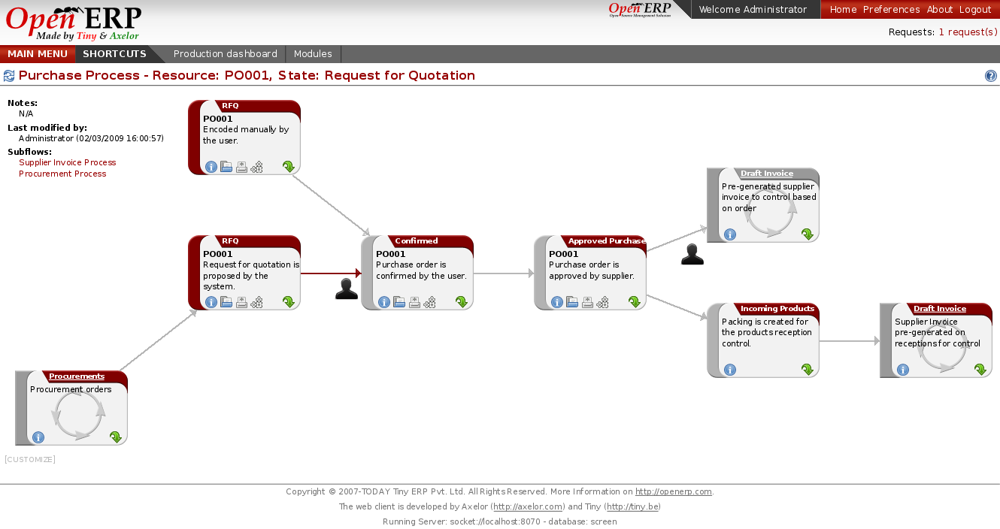
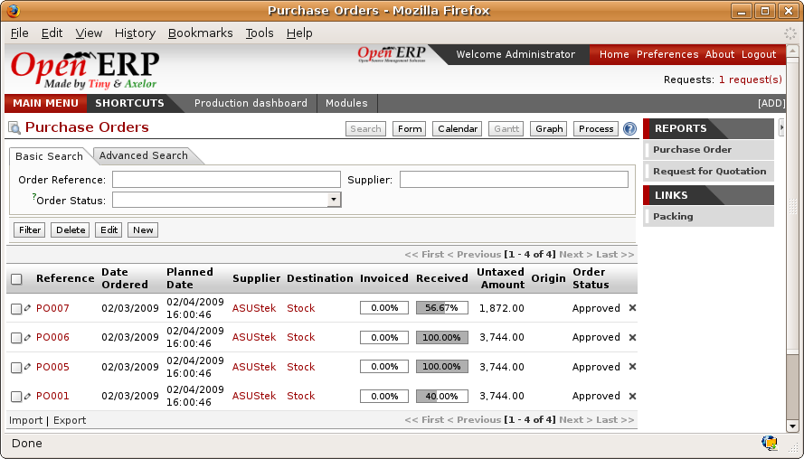
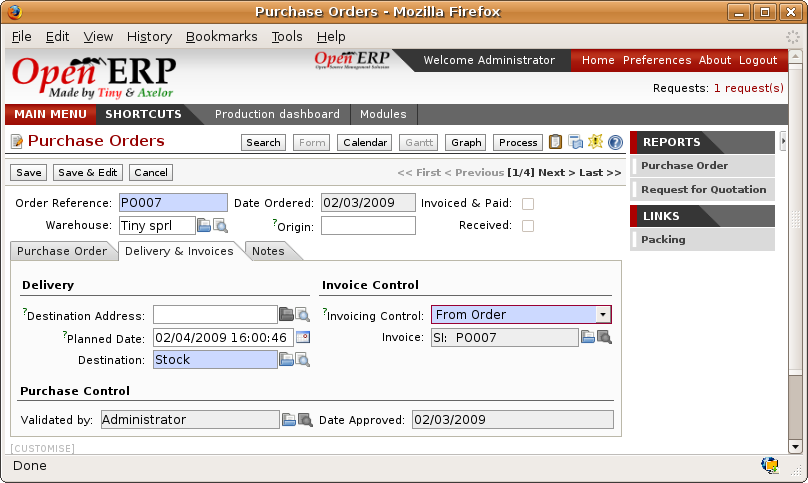

.. i18n: All the elements of a complete workflow
.. i18n: =======================================

All the elements of a complete workflow
=======================================

.. i18n: The supplier order is the document that lets you manage price negotiations, control
.. i18n: supplier invoices, handle goods receipts and synchronize all of these documents.

The supplier order is the document that lets you manage price negotiations, control
supplier invoices, handle goods receipts and synchronize all of these documents.

.. i18n: Start by looking at the following order workflow:

Start by looking at the following order workflow:

.. i18n: #. Price request to the supplier,
.. i18n: 
.. i18n: #. Confirmation of purchase,
.. i18n: 
.. i18n: #. Receipt and control of products,
.. i18n: 
.. i18n: #. Control of invoicing.

#. Price request to the supplier,

#. Confirmation of purchase,

#. Receipt and control of products,

#. Control of invoicing.

.. i18n: Setting up your database
.. i18n: -------------------------

Setting up your database
-------------------------

.. i18n: To set a system up for these examples, create a new database with demonstration data in it, and
.. i18n: select the :guilabel:`Minimal Profile` when you log in as the *admin* user. You can enter your own
.. i18n: company details when asked, or just select the default of :guilabel:`Tiny SPRL` if you want.

To set a system up for these examples, create a new database with demonstration data in it, and
select the :guilabel:`Minimal Profile` when you log in as the *admin* user. You can enter your own
company details when asked, or just select the default of :guilabel:`Tiny SPRL` if you want.

.. i18n: .. index::
.. i18n:    single: module; purchase

.. index::
   single: module; purchase

.. i18n: Then install the :mod:`purchase` module, which installs several other modules as dependencies. Continue
.. i18n: the remainder of this chapter logged in as the admin user.

Then install the :mod:`purchase` module, which installs several other modules as dependencies. Continue
the remainder of this chapter logged in as the admin user.

.. i18n: Price request from the supplier
.. i18n: -------------------------------

Price request from the supplier
-------------------------------

.. i18n: To enter data for a new supplier price request, use the menu :menuselection:`Purchase Management -->
.. i18n: New Purchase Order`. Open ERP opens a blank purchase form that you use for requesting prices from a
.. i18n: supplier. This is shown in the figure :ref:`fig-pfrm`. If the price request came from an automatic procurement
.. i18n: created by Open ERP you'll find a reference to the document that
.. i18n: generated the request in the :guilabel:`Origin` field.

To enter data for a new supplier price request, use the menu :menuselection:`Purchase Management -->
New Purchase Order`. Open ERP opens a blank purchase form that you use for requesting prices from a
supplier. This is shown in the figure :ref:`fig-pfrm`. If the price request came from an automatic procurement
created by Open ERP you'll find a reference to the document that
generated the request in the :guilabel:`Origin` field.

.. i18n: .. _fig-pfrm:
.. i18n: 
.. i18n: .. figure:: images/purchase_form.png
.. i18n:    :scale: 75
.. i18n:    :align: center
.. i18n: 
.. i18n:    *Data entry for a supplier order*

.. _fig-pfrm:

.. figure:: images/purchase_form.png
   :scale: 75
   :align: center

   *Data entry for a supplier order*

.. i18n: .. index::
.. i18n:    single: module; warning

.. index::
   single: module; warning

.. i18n: .. note:: Managing Alerts
.. i18n: 
.. i18n:    If you install the :mod:`warning` module you will be able to define alerts that appear when the
.. i18n:    purchaser enters a price request or order. You can set alerts on the product and on the supplier.

.. note:: Managing Alerts

   If you install the :mod:`warning` module you will be able to define alerts that appear when the
   purchaser enters a price request or order. You can set alerts on the product and on the supplier.

.. i18n: The internal reference, the date, and the warehouse that the products should be delivered to are
.. i18n: completed automatically by Open ERP but you can change these values if you need. Select a
.. i18n: supplier. Once a supplier has been selected, Open ERP automatically completes the contact
.. i18n: address for the supplier. The pricelist is also completed when you select the supplier. This should
.. i18n: bring in all of the conditions that you've negotiated with the supplier for a given period.

The internal reference, the date, and the warehouse that the products should be delivered to are
completed automatically by Open ERP but you can change these values if you need. Select a
supplier. Once a supplier has been selected, Open ERP automatically completes the contact
address for the supplier. The pricelist is also completed when you select the supplier. This should
bring in all of the conditions that you've negotiated with the supplier for a given period.

.. i18n: .. tip:: Supplier Selection
.. i18n: 
.. i18n:    Searching for a supplier is limited to all of the partners in the system that have the :guilabel:`Supplier`
.. i18n:    checkbox checked.
.. i18n:    If you don't find your supplier it might be worth checking the whole list of all partners to make
.. i18n:    sure that the supplier hasn't been partially entered into the system.

.. tip:: Supplier Selection

   Searching for a supplier is limited to all of the partners in the system that have the :guilabel:`Supplier`
   checkbox checked.
   If you don't find your supplier it might be worth checking the whole list of all partners to make
   sure that the supplier hasn't been partially entered into the system.

.. i18n: Once the main body of the purchase order has been completed you can enter the product lines.

Once the main body of the purchase order has been completed you can enter the product lines.

.. i18n: .. figure:: images/purchase_line_form.png
.. i18n:    :scale: 75
.. i18n:    :align: center
.. i18n: 
.. i18n:    *Order line on a  supplier order*

.. figure:: images/purchase_line_form.png
   :scale: 75
   :align: center

   *Order line on a  supplier order*

.. i18n: When you've completed the product, Open ERP automatically completes the other fields on the form:

When you've completed the product, Open ERP automatically completes the other fields on the form:

.. i18n: * :guilabel:`Unit of Measure`, taken from the :guilabel:`Purchase UoM` field on the product form,
.. i18n: 
.. i18n: * The :guilabel:`Description` of the product in the supplier's language,
.. i18n: 
.. i18n: * :guilabel:`Scheduled date`, calculated from the order date and the lead time
.. i18n: 
.. i18n: * :guilabel:`Unit price`, provided by the supplier pricelist,
.. i18n: 
.. i18n: * :guilabel:`Taxes`, taken from the information on the product form and partner form,
.. i18n:    depending on the rules seen in :ref:`Financial Analysis <ch-financial>`.

* :guilabel:`Unit of Measure`, taken from the :guilabel:`Purchase UoM` field on the product form,

* The :guilabel:`Description` of the product in the supplier's language,

* :guilabel:`Scheduled date`, calculated from the order date and the lead time

* :guilabel:`Unit price`, provided by the supplier pricelist,

* :guilabel:`Taxes`, taken from the information on the product form and partner form,
   depending on the rules seen in :ref:`Financial Analysis <ch-financial>`.

.. i18n: .. tip:: Product wording and code
.. i18n: 
.. i18n:    When you enter supplier names on the product form, you can set a name and a product code for each
.. i18n:    individual supplier.
.. i18n:    If you do that, Open ERP will then use those details in place of your own internal product names
.. i18n:    for that selected supplier.

.. tip:: Product wording and code

   When you enter supplier names on the product form, you can set a name and a product code for each
   individual supplier.
   If you do that, Open ERP will then use those details in place of your own internal product names
   for that selected supplier.

.. i18n: If you work with management by case you can also set the analytic account that should be used to
.. i18n: report all the purchase costs. The costs will then be reported at the receipt of the supplier
.. i18n: invoice.

If you work with management by case you can also set the analytic account that should be used to
report all the purchase costs. The costs will then be reported at the receipt of the supplier
invoice.

.. i18n: .. index::
.. i18n:    single: module; purchase_analytic_analysis

.. index::
   single: module; purchase_analytic_analysis

.. i18n: .. tip:: Management by case
.. i18n: 
.. i18n:    Analytic accounts can be very useful for all companies that manage costs by case, by site, by
.. i18n:    project or by folder.
.. i18n:    To work with several analytic axes you should install the module :mod:`purchase_analytic_plans`.

.. tip:: Management by case

   Analytic accounts can be very useful for all companies that manage costs by case, by site, by
   project or by folder.
   To work with several analytic axes you should install the module :mod:`purchase_analytic_plans`.

.. i18n: .. index::
.. i18n:    single: module; account_analytic_default
.. i18n:    single: module; purchase_analytic_plans

.. index::
   single: module; account_analytic_default
   single: module; purchase_analytic_plans

.. i18n: For that the analytic account is automatically selected as a function of the partner, the date, the
.. i18n: products or the user, you can install the module :mod:`account_analytic_default` (which is installed
.. i18n: automatically as a dependency of :mod:`purchase_analytic_plans`, since the latter depends on it).

For that the analytic account is automatically selected as a function of the partner, the date, the
products or the user, you can install the module :mod:`account_analytic_default` (which is installed
automatically as a dependency of :mod:`purchase_analytic_plans`, since the latter depends on it).

.. i18n: In the second tab of the product line you can enter a note that will be attached when the order
.. i18n: confirmation or price quotation is printed. This note can be predefined on the product form to
.. i18n: automatically appear on each order for that product. For example you can put “Don't forget to send
.. i18n: by express delivery as specified in our contract reference 1234.”

In the second tab of the product line you can enter a note that will be attached when the order
confirmation or price quotation is printed. This note can be predefined on the product form to
automatically appear on each order for that product. For example you can put “Don't forget to send
by express delivery as specified in our contract reference 1234.”

.. i18n: Once the document has been completed, you can print it as a price estimate to send to
.. i18n: the supplier. You can set a note for the attention of the supplier in the form's third tab.

Once the document has been completed, you can print it as a price estimate to send to
the supplier. You can set a note for the attention of the supplier in the form's third tab.

.. i18n: .. figure:: images/purchase_quotation.png
.. i18n:    :scale: 75
.. i18n:    :align: center
.. i18n: 
.. i18n:    *Printing the supplier price quotation*

.. figure:: images/purchase_quotation.png
   :scale: 75
   :align: center

   *Printing the supplier price quotation*

.. i18n: Then leave the document in the ``Draft`` state. When you receive a response from the supplier, use the menu
.. i18n: :menuselection:`Purchase Management --> Purchase Orders --> Requests for Quotation`. Select the
.. i18n: order and complete its details.

Then leave the document in the ``Draft`` state. When you receive a response from the supplier, use the menu
:menuselection:`Purchase Management --> Purchase Orders --> Requests for Quotation`. Select the
order and complete its details.

.. i18n: When you want to approve the order, use the button :guilabel:`Confirm Purchase Order`. The price
.. i18n: request then passes into the ``Confirmed`` state. 
.. i18n: No further changes are possible. To approve it for purchase click the button :guilabel:`Approved by
.. i18n: Supplier`.

When you want to approve the order, use the button :guilabel:`Confirm Purchase Order`. The price
request then passes into the ``Confirmed`` state. 
No further changes are possible. To approve it for purchase click the button :guilabel:`Approved by
Supplier`.

.. i18n: .. tip:: Approval Receipt
.. i18n: 
.. i18n:    You can confirm the order but not approve it straightaway.
.. i18n:    Do this when you want to approve the order after you've received an order acknowledgement from the
.. i18n:    supplier.
.. i18n:    This gives you an intermediate state for all orders waiting validation from the supplier using
.. i18n:    the menu :menuselection:`Purchase Management --> Purchase Orders --> Purchase Orders Awaiting Approval`.

.. tip:: Approval Receipt

   You can confirm the order but not approve it straightaway.
   Do this when you want to approve the order after you've received an order acknowledgement from the
   supplier.
   This gives you an intermediate state for all orders waiting validation from the supplier using
   the menu :menuselection:`Purchase Management --> Purchase Orders --> Purchase Orders Awaiting Approval`.

.. i18n: .. figure:: images/purchase_process.png
.. i18n:    :scale: 75
.. i18n:    :align: center
.. i18n: 
.. i18n:    *Supplier order process*

   *Supplier order process*

.. i18n: .. index::
.. i18n:    single: module; purchase_approve

.. index::
   single: module; purchase_approve

.. i18n: .. note:: Supplier Approval
.. i18n: 
.. i18n:    If you want to automate the data entry stage at goods receipt, install the module
.. i18n:    :mod:`purchase_approve`. This will automatically approve all the orders that have been confirmed.

.. note:: Supplier Approval

   If you want to automate the data entry stage at goods receipt, install the module
   :mod:`purchase_approve`. This will automatically approve all the orders that have been confirmed.

.. i18n: Goods receipt
.. i18n: -------------

Goods receipt
-------------

.. i18n: Once the order has been approved, Open ERP automatically prepares the goods receipt order in the
.. i18n: draft state for you. To get a list of the products you're waiting for from your suppliers, use the
.. i18n: menu :menuselection:`Stock Management --> Incoming Products --> Packings to process`.

Once the order has been approved, Open ERP automatically prepares the goods receipt order in the
draft state for you. To get a list of the products you're waiting for from your suppliers, use the
menu :menuselection:`Stock Management --> Incoming Products --> Packings to process`.

.. i18n: .. tip:: Purchasing Services
.. i18n: 
.. i18n:     If you buy services from your supplier, Open ERP doesn't generate a goods receipt note.
.. i18n:     There's no service receipt equivalent to a goods receipt.

.. tip:: Purchasing Services

    If you buy services from your supplier, Open ERP doesn't generate a goods receipt note.
    There's no service receipt equivalent to a goods receipt.

.. i18n: Select the document that corresponds to the item that you're receiving. Usually the goods receipt
.. i18n: note is found by making a search on the order reference or the supplier name. You can then confirm
.. i18n: the receipt of the products.

Select the document that corresponds to the item that you're receiving. Usually the goods receipt
note is found by making a search on the order reference or the supplier name. You can then confirm
the receipt of the products.

.. i18n: As you saw in :ref:`ch-stocks`, if you receive only part of the order, Open ERP
.. i18n: manages the remainder of that order.
.. i18n: A second receipt note is then automatically created for the goods not received.
.. i18n: You can cancel it if you think that you will never receive the remaining products.

As you saw in :ref:`ch-stocks`, if you receive only part of the order, Open ERP
manages the remainder of that order.
A second receipt note is then automatically created for the goods not received.
You can cancel it if you think that you will never receive the remaining products.

.. i18n: After receiving the goods, Open ERP will show you which orders are open and the state of their
.. i18n: receipt and invoicing if you return to the list of orders.

After receiving the goods, Open ERP will show you which orders are open and the state of their
receipt and invoicing if you return to the list of orders.

.. i18n: .. figure:: images/purchase_list.png
.. i18n:    :scale: 75
.. i18n:    :align: center
.. i18n: 
.. i18n:    *List of open orders, and their receipt and invoice status*

   *List of open orders, and their receipt and invoice status*

.. i18n: Control of invoicing
.. i18n: --------------------

Control of invoicing
--------------------

.. i18n: To control supplier invoicing, Open ERP provides three systems as standard, which can differ order
.. i18n: by order:

To control supplier invoicing, Open ERP provides three systems as standard, which can differ order
by order:

.. i18n: * Invoicing based on quantities ordered,
.. i18n: 
.. i18n: * Invoicing based on quantities received,
.. i18n: 
.. i18n: * Manual Invoicing.

* Invoicing based on quantities ordered,

* Invoicing based on quantities received,

* Manual Invoicing.

.. i18n: The mode of invoicing control is set in the second tab of the purchase order in the field
.. i18n: :guilabel:`Invoicing Control`.

The mode of invoicing control is set in the second tab of the purchase order in the field
:guilabel:`Invoicing Control`.

.. i18n: .. figure:: images/purchase_form_tab2.png
.. i18n:    :scale: 75
.. i18n:    :align: center
.. i18n: 
.. i18n:    *Supplier order, invoice control*

   *Supplier order, invoice control*

.. i18n: .. tip:: Default value
.. i18n: 
.. i18n:    A company generally uses a single invoicing control method for all of its invoices.
.. i18n:    So you're advised to go and set a default value in the :guilabel:`Invoicing Control` field after
.. i18n:    installation.

.. tip:: Default value

   A company generally uses a single invoicing control method for all of its invoices.
   So you're advised to go and set a default value in the :guilabel:`Invoicing Control` field after
   installation.

.. i18n: Control based on orders
.. i18n: -----------------------

Control based on orders
-----------------------

.. i18n: If you selected your invoicing control based on orders, Open ERP will automatically generate a
.. i18n: supplier invoice in the draft state when the order is confirmed. You can obtain a list of invoices
.. i18n: waiting using the menu :menuselection:`Financial Management --> Invoices --> Supplier Invoices -->
.. i18n: Draft Supplier Invoices`.

If you selected your invoicing control based on orders, Open ERP will automatically generate a
supplier invoice in the draft state when the order is confirmed. You can obtain a list of invoices
waiting using the menu :menuselection:`Financial Management --> Invoices --> Supplier Invoices -->
Draft Supplier Invoices`.

.. i18n: When you receive a paper invoice from your supplier, all you need to do is validate the invoice pre-
.. i18n: generated by the system. Don't forget to check the price and the quantities. When the invoice is
.. i18n: confirmed the accounting entries represent the cost of purchase and are automatically entered into
.. i18n: the system.

When you receive a paper invoice from your supplier, all you need to do is validate the invoice pre-
generated by the system. Don't forget to check the price and the quantities. When the invoice is
confirmed the accounting entries represent the cost of purchase and are automatically entered into
the system.

.. i18n: The supplier order is then automatically set as ``Paid`` when you pay the supplier
.. i18n: invoice.

The supplier order is then automatically set as ``Paid`` when you pay the supplier
invoice.

.. i18n: This method of controlling invoices is often used in service companies, because the invoiced amounts
.. i18n: correspond to the ordered amounts. In logistics by contrast you most often work with invoicing
.. i18n: controlled by goods receipt.

This method of controlling invoices is often used in service companies, because the invoiced amounts
correspond to the ordered amounts. In logistics by contrast you most often work with invoicing
controlled by goods receipt.

.. i18n: Control based on goods receipt
.. i18n: ------------------------------

Control based on goods receipt
------------------------------

.. i18n: To control your supplier invoices based on goods receipt, set the field :guilabel:`Invoicing
.. i18n: Control` on the second tab of the order to :guilabel:`From Picking`.

To control your supplier invoices based on goods receipt, set the field :guilabel:`Invoicing
Control` on the second tab of the order to :guilabel:`From Picking`.

.. i18n: In this case no invoice, draft state or any other, is generated by the order. On the goods receipt
.. i18n: note, the field :guilabel:`Invoicing Control` is set to :guilabel:`To be Invoiced`.

In this case no invoice, draft state or any other, is generated by the order. On the goods receipt
note, the field :guilabel:`Invoicing Control` is set to :guilabel:`To be Invoiced`.

.. i18n: The storesperson can then receive different orders. If he wants to generate the draft invoice for a
.. i18n: goods receipt, he can click the action :guilabel:`Create Invoice`. Open ERP asks you then for the
.. i18n: journal for this invoice. It then opens that or the generated invoices (in the case of creating
.. i18n: invoices for several receipts at one time) which enables you to modify it before confirming it.

The storesperson can then receive different orders. If he wants to generate the draft invoice for a
goods receipt, he can click the action :guilabel:`Create Invoice`. Open ERP asks you then for the
journal for this invoice. It then opens that or the generated invoices (in the case of creating
invoices for several receipts at one time) which enables you to modify it before confirming it.

.. i18n: This approach is useful when you receive the invoice at the same time as the item from the supplier.
.. i18n: Usually invoices are sent by post some days later. In this case, the storesperson leaves the item
.. i18n: unchanged without generating an invoice. Then once per day or once per week the accountant will
.. i18n: create the draft invoices based on all the receipts for the day. To do that he uses the menu
.. i18n: :menuselection:`Stock Management --> Incoming Products --> Generate Draft Invoices on Receptions`. 
.. i18n: He clicks on the action to generate all draft invoices from
.. i18n: the list of receipts that haven't yet been invoiced.

This approach is useful when you receive the invoice at the same time as the item from the supplier.
Usually invoices are sent by post some days later. In this case, the storesperson leaves the item
unchanged without generating an invoice. Then once per day or once per week the accountant will
create the draft invoices based on all the receipts for the day. To do that he uses the menu
:menuselection:`Stock Management --> Incoming Products --> Generate Draft Invoices on Receptions`. 
He clicks on the action to generate all draft invoices from
the list of receipts that haven't yet been invoiced.

.. i18n: .. index::
.. i18n:    single: accountant

.. index::
   single: accountant

.. i18n: At that point, the accountant can decide if he wants to generate an invoice per item or group all items
.. i18n: for the same partner into the same invoice.

At that point, the accountant can decide if he wants to generate an invoice per item or group all items
for the same partner into the same invoice.

.. i18n: Invoices are then handled just like those controlled from ``On Order`` . Once the invoice arrives at
.. i18n: the accounting service he just compares it with the invoices waiting to control what the supplier
.. i18n: invoices you.

Invoices are then handled just like those controlled from ``On Order`` . Once the invoice arrives at
the accounting service he just compares it with the invoices waiting to control what the supplier
invoices you.

.. i18n: .. index::
.. i18n:    single: module; purchase_delivery

.. index::
   single: module; purchase_delivery

.. i18n: .. tip:: Delivery Charges
.. i18n: 
.. i18n:    To manage delivery charges, install the module :mod:`purchase_delivery` (which was in ``addons-extra`` at the time of writing).
.. i18n:    This will automatically add delivery changes to the creation of the draft invoice as a function
.. i18n:    of the products delivered or ordered.

.. tip:: Delivery Charges

   To manage delivery charges, install the module :mod:`purchase_delivery` (which was in ``addons-extra`` at the time of writing).
   This will automatically add delivery changes to the creation of the draft invoice as a function
   of the products delivered or ordered.

.. i18n: .. index:: 
.. i18n:    single: tender
.. i18n:    single: purchase; tender

.. index:: 
   single: tender
   single: purchase; tender

.. i18n: Tenders
.. i18n: -------

Tenders
-------

.. i18n: .. index::
.. i18n:    single: module; purchase_tender

.. index::
   single: module; purchase_tender

.. i18n: To manage tenders, you should use the module :mod:`purchase_tender` (which was in ``addons-extra`` at the time of writing). 
.. i18n: This lets you create several
.. i18n: supplier price reqests for a single supply requirement. Once the module is installed, Open ERP adds
.. i18n: a new :menuselection:`Purchase Tenders` menu in :menuselection:`Purchase management`. You can then define the new tenders.

To manage tenders, you should use the module :mod:`purchase_tender` (which was in ``addons-extra`` at the time of writing). 
This lets you create several
supplier price reqests for a single supply requirement. Once the module is installed, Open ERP adds
a new :menuselection:`Purchase Tenders` menu in :menuselection:`Purchase management`. You can then define the new tenders.

.. i18n: .. figure:: images/purchase_tender.png
.. i18n:    :scale: 75
.. i18n:    :align: center
.. i18n: 
.. i18n:    *Defining a tender*

.. figure:: images/purchase_tender.png
   :scale: 75
   :align: center

   *Defining a tender*

.. i18n: To enter data for a new tender, use the menu :menuselection:`Purchase Management --> Purchase
.. i18n: Tenders --> New Purchase Tenders`. Open ERP then opens a new blank tender form. The reference number
.. i18n: is set by default and you can enter information about your tender in the other fields.

To enter data for a new tender, use the menu :menuselection:`Purchase Management --> Purchase
Tenders --> New Purchase Tenders`. Open ERP then opens a new blank tender form. The reference number
is set by default and you can enter information about your tender in the other fields.

.. i18n: If you want to enter a supplier's response to your tender request, add a new
.. i18n: draft purchase order into the list on the :guilabel:`Quotation` tab of your tender document. 
.. i18n: If you want to revise a supplier price in response to negotiations, edit any 
.. i18n: appropriate Purchase Order that you've left
.. i18n: in the draft state and link that to the tender. 

If you want to enter a supplier's response to your tender request, add a new
draft purchase order into the list on the :guilabel:`Quotation` tab of your tender document. 
If you want to revise a supplier price in response to negotiations, edit any 
appropriate Purchase Order that you've left
in the draft state and link that to the tender. 

.. i18n: In the general list of purchase orders, Open ERP shows,
.. i18n: in the new second column :guilabel:`Purchase Tender`, if the order has a tender reference.

In the general list of purchase orders, Open ERP shows,
in the new second column :guilabel:`Purchase Tender`, if the order has a tender reference.

.. i18n: When one of the orders about a tender is confirmed, all of the other orders are automatically
.. i18n: cancelled by Open ERP. That enables you to accept just one order for a particular tender.

When one of the orders about a tender is confirmed, all of the other orders are automatically
cancelled by Open ERP. That enables you to accept just one order for a particular tender.

.. i18n: Price revisions
.. i18n: ---------------

Price revisions
---------------

.. i18n: Open ERP supports several methods of calculating and automatically updating product costs:

Open ERP supports several methods of calculating and automatically updating product costs:

.. i18n: * Standard price: manually fixed, and
.. i18n: 
.. i18n: * Standard price: revalued automatically and periodically,
.. i18n: 
.. i18n: * Weighted average: updated at each receipt to the warehouse.

* Standard price: manually fixed, and

* Standard price: revalued automatically and periodically,

* Weighted average: updated at each receipt to the warehouse.

.. i18n: This cost is used to value your stock and represents your product costs. Included in that cost is
.. i18n: everything directly related to the received cost. You could include such elements as:

This cost is used to value your stock and represents your product costs. Included in that cost is
everything directly related to the received cost. You could include such elements as:

.. i18n: * supplier price,
.. i18n: 
.. i18n: * delivery charges,
.. i18n: 
.. i18n: * manufacturing costs,
.. i18n: 
.. i18n: * storage charges.

* supplier price,

* delivery charges,

* manufacturing costs,

* storage charges.

.. i18n: Standard Price
.. i18n: --------------

Standard Price
--------------

.. i18n: The mode of price management for the product is shown in the third tab :guilabel:`Prices & Suppliers` on the product form.
.. i18n: On each individual product you can select if you want to work in ``Standard Price`` or on weighted ``Average Price``.

The mode of price management for the product is shown in the third tab :guilabel:`Prices & Suppliers` on the product form.
On each individual product you can select if you want to work in ``Standard Price`` or on weighted ``Average Price``.

.. i18n: .. tip:: Simplified view
.. i18n: 
.. i18n:    If you work in the ``Simplified View`` mode you won't see the field that lets you
.. i18n:    manage the price calculation mode for a product. In that case the default value is standard price.

.. tip:: Simplified view

   If you work in the ``Simplified View`` mode you won't see the field that lets you
   manage the price calculation mode for a product. In that case the default value is standard price.

.. i18n: The ``Standard Price`` setting means that the product cost is fixed manually for each product in the field
.. i18n: :guilabel:`Cost Price`. This is usually revalued once a year based on the average of purchase costs
.. i18n: or manufacturing costs.

The ``Standard Price`` setting means that the product cost is fixed manually for each product in the field
:guilabel:`Cost Price`. This is usually revalued once a year based on the average of purchase costs
or manufacturing costs.

.. i18n: You usually use standard costs to manage products where the price hardly changes over the course of
.. i18n: the year. For example the standard cost could be used to manage books, or the cost of bread.

You usually use standard costs to manage products where the price hardly changes over the course of
the year. For example the standard cost could be used to manage books, or the cost of bread.

.. i18n: Those costs that can be fixed for the whole year bring certain advantages:

Those costs that can be fixed for the whole year bring certain advantages:

.. i18n: * you can base the sale price on the product cost and then work with margins rather than 
.. i18n:   a fixed price per product,
.. i18n: 
.. i18n: * accounting is simplified because there's a direct relationship between the value of stock and the
.. i18n:   number of items received.

* you can base the sale price on the product cost and then work with margins rather than 
  a fixed price per product,

* accounting is simplified because there's a direct relationship between the value of stock and the
  number of items received.

.. i18n: .. index::
.. i18n:    single: module; product_extended

.. index::
   single: module; product_extended

.. i18n: To get and automated periodic revaluation of the standard price you can use the module :mod:`product_extended`
.. i18n: (from ``addons-extra`` at the time of writing).
.. i18n: This adds an action on the product form enabling you to set a date on all the selected products. 
.. i18n: Open ERP then recalculates the price of the products as a function of the cost of raw materials and the
.. i18n: manufacturing operations given in the routing.

To get and automated periodic revaluation of the standard price you can use the module :mod:`product_extended`
(from ``addons-extra`` at the time of writing).
This adds an action on the product form enabling you to set a date on all the selected products. 
Open ERP then recalculates the price of the products as a function of the cost of raw materials and the
manufacturing operations given in the routing.

.. i18n: Weighted average
.. i18n: ----------------

Weighted average
----------------

.. i18n: Working with Standard Prices does not lend itself well to the management of the cost price of products
.. i18n: when the prices change a lot with the state of the market. This is case for many commodities and
.. i18n: energy.

Working with Standard Prices does not lend itself well to the management of the cost price of products
when the prices change a lot with the state of the market. This is case for many commodities and
energy.

.. i18n: In this case you'd want Open ERP to automatically set the price in response to each goods receipt movement
.. i18n: into the warehouse. The deliveries (exit from stock) have no impact on the product price.

In this case you'd want Open ERP to automatically set the price in response to each goods receipt movement
into the warehouse. The deliveries (exit from stock) have no impact on the product price.

.. i18n: .. tip:: Calculating the price
.. i18n: 
.. i18n:    At each goods receipt the product price is recalculated using the following accounting formula:
.. i18n:    NP = (OP * QS + PP * QR) / (QS + QR), where the following notation is used:
.. i18n: 
.. i18n:    * NP: New Price,
.. i18n: 
.. i18n:    * OP: Old Price,
.. i18n: 
.. i18n:    * QS: Quantity actually in stock,
.. i18n: 
.. i18n:    * PP: Price Paid for the quantity received,
.. i18n: 
.. i18n:    * QR: Quantity received.

.. tip:: Calculating the price

   At each goods receipt the product price is recalculated using the following accounting formula:
   NP = (OP * QS + PP * QR) / (QS + QR), where the following notation is used:

   * NP: New Price,

   * OP: Old Price,

   * QS: Quantity actually in stock,

   * PP: Price Paid for the quantity received,

   * QR: Quantity received.

.. i18n: If the products are managed as a weighted average, Open ERP will open a
.. i18n: window that lets you specify the price of the product received at each goods receipt. 
.. i18n: The purchase price is by default
.. i18n: set from the purchase order, but you can change the price to add the cost of
.. i18n: delivery to the various received products, for example.

If the products are managed as a weighted average, Open ERP will open a
window that lets you specify the price of the product received at each goods receipt. 
The purchase price is by default
set from the purchase order, but you can change the price to add the cost of
delivery to the various received products, for example.

.. i18n: .. figure:: images/purchase_pmp.png
.. i18n:    :scale: 75
.. i18n:    :align: center
.. i18n: 
.. i18n:    *Goods receipt of products managed in weighted average*

.. figure:: images/purchase_pmp.png
   :scale: 75
   :align: center

   *Goods receipt of products managed in weighted average*

.. i18n: Once the receipt has been confirmed, the price is automatically recalculated and entered on the
.. i18n: product form.

Once the receipt has been confirmed, the price is automatically recalculated and entered on the
product form.

.. i18n: .. Copyright © Open Object Press. All rights reserved.

.. Copyright © Open Object Press. All rights reserved.

.. i18n: .. You may take electronic copy of this publication and distribute it if you don't
.. i18n: .. change the content. You can also print a copy to be read by yourself only.

.. You may take electronic copy of this publication and distribute it if you don't
.. change the content. You can also print a copy to be read by yourself only.

.. i18n: .. We have contracts with different publishers in different countries to sell and
.. i18n: .. distribute paper or electronic based versions of this book (translated or not)
.. i18n: .. in bookstores. This helps to distribute and promote the Open ERP product. It
.. i18n: .. also helps us to create incentives to pay contributors and authors using author
.. i18n: .. rights of these sales.

.. We have contracts with different publishers in different countries to sell and
.. distribute paper or electronic based versions of this book (translated or not)
.. in bookstores. This helps to distribute and promote the Open ERP product. It
.. also helps us to create incentives to pay contributors and authors using author
.. rights of these sales.

.. i18n: .. Due to this, grants to translate, modify or sell this book are strictly
.. i18n: .. forbidden, unless Tiny SPRL (representing Open Object Press) gives you a
.. i18n: .. written authorisation for this.

.. Due to this, grants to translate, modify or sell this book are strictly
.. forbidden, unless Tiny SPRL (representing Open Object Press) gives you a
.. written authorisation for this.

.. i18n: .. Many of the designations used by manufacturers and suppliers to distinguish their
.. i18n: .. products are claimed as trademarks. Where those designations appear in this book,
.. i18n: .. and Open Object Press was aware of a trademark claim, the designations have been
.. i18n: .. printed in initial capitals.

.. Many of the designations used by manufacturers and suppliers to distinguish their
.. products are claimed as trademarks. Where those designations appear in this book,
.. and Open Object Press was aware of a trademark claim, the designations have been
.. printed in initial capitals.

.. i18n: .. While every precaution has been taken in the preparation of this book, the publisher
.. i18n: .. and the authors assume no responsibility for errors or omissions, or for damages
.. i18n: .. resulting from the use of the information contained herein.

.. While every precaution has been taken in the preparation of this book, the publisher
.. and the authors assume no responsibility for errors or omissions, or for damages
.. resulting from the use of the information contained herein.

.. i18n: .. Published by Open Object Press, Grand Rosière, Belgium

.. Published by Open Object Press, Grand Rosière, Belgium
