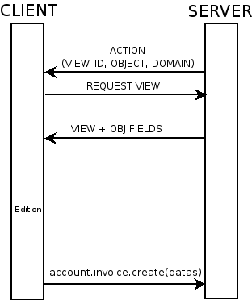

.. i18n: Module Structure
.. i18n: ================

Module Structure
================

.. i18n: The Modules
.. i18n: -----------

The Modules
-----------

.. i18n:    #. Introduction
.. i18n:    #. Files & Directories
.. i18n:          #. __terp__.py
.. i18n:          #. __init__.py
.. i18n:          #. XML Files
.. i18n:                #. Actions
.. i18n:                #. Menu Entries
.. i18n:                #. Reports
.. i18n:                #. Wizards 
.. i18n:    #. Profiles 

   #. Introduction
   #. Files & Directories
         #. __terp__.py
         #. __init__.py
         #. XML Files
               #. Actions
               #. Menu Entries
               #. Reports
               #. Wizards 
   #. Profiles 

.. i18n: 	

	

.. i18n: Modules - Files and Directories
.. i18n: -------------------------------

Modules - Files and Directories
-------------------------------

.. i18n: All the modules are located in the server/addons directory.

All the modules are located in the server/addons directory.

.. i18n: The following steps are necessary to create a new module:

The following steps are necessary to create a new module:

.. i18n:     * create a subdirectory in the server/addons directory
.. i18n:     * create a module description file: **__terp__.py**
.. i18n:     * create the **Python** file containing the **objects**
.. i18n:     * create **.xml files** that download the data (views, menu entries, demo data, ...)
.. i18n:     * optionally create **reports**, **wizards** or **workflows**. 

    * create a subdirectory in the server/addons directory
    * create a module description file: **__terp__.py**
    * create the **Python** file containing the **objects**
    * create **.xml files** that download the data (views, menu entries, demo data, ...)
    * optionally create **reports**, **wizards** or **workflows**. 

.. i18n: !The Modules - Files And Directories - XML Files

!The Modules - Files And Directories - XML Files

.. i18n: XML files located in the module directory are used to modify the structure of the database. They are used for many purposes, among which we can cite :

XML files located in the module directory are used to modify the structure of the database. They are used for many purposes, among which we can cite :

.. i18n:     * initialization and demonstration data declaration,
.. i18n:     * views declaration,
.. i18n:     * reports declaration,
.. i18n:     * wizards declaration,
.. i18n:     * workflows declaration. 

    * initialization and demonstration data declaration,
    * views declaration,
    * reports declaration,
    * wizards declaration,
    * workflows declaration. 

.. i18n: General structure of Tiny ERP XML files is more detailed in the section `Data Loading Files XML <http://doc.openerp.com/developer/index.html>`_. Look here if you are interested in learning more about *initialization* and *demonstration data declaration* XML files. The following section are only related to XML specific to *actions, menu entries, reports, wizards* and *workflows* declaration. 

General structure of Tiny ERP XML files is more detailed in the section `Data Loading Files XML <http://doc.openerp.com/developer/index.html>`_. Look here if you are interested in learning more about *initialization* and *demonstration data declaration* XML files. The following section are only related to XML specific to *actions, menu entries, reports, wizards* and *workflows* declaration. 

.. i18n: Python Module Descriptor File __init__.py
.. i18n: +++++++++++++++++++++++++++++++++++++++++

Python Module Descriptor File __init__.py
+++++++++++++++++++++++++++++++++++++++++

.. i18n: **The __init__.py file**

**The __init__.py file**

.. i18n: The __init__.py file is, like any Python module, executed at the start of the program. It needs to import the Python files that need to be loaded.

The __init__.py file is, like any Python module, executed at the start of the program. It needs to import the Python files that need to be loaded.

.. i18n: So, if you create a "module.py" file, containing the description of your objects, you have to write one line in __init__.py::
.. i18n: 
.. i18n: 	import module

So, if you create a "module.py" file, containing the description of your objects, you have to write one line in __init__.py::

	import module

.. i18n: OpenERP Module Descriptor File __terp__.py
.. i18n: ++++++++++++++++++++++++++++++++++++++++++

OpenERP Module Descriptor File __terp__.py
++++++++++++++++++++++++++++++++++++++++++

.. i18n: In the created module directory, you must add a **__terp__.py** file. This file, which must be in Python format, is responsible to

In the created module directory, you must add a **__terp__.py** file. This file, which must be in Python format, is responsible to

.. i18n:    1. determine the *XML files that will be parsed* during the initialization of the server, and also to
.. i18n:    2. determine the *dependencies* of the created module. 

   1. determine the *XML files that will be parsed* during the initialization of the server, and also to
   2. determine the *dependencies* of the created module. 

.. i18n: This file must contain a Python dictionary with the following values:

This file must contain a Python dictionary with the following values:

.. i18n: **name**

**name**

.. i18n:     The (Plain English) name of the module. 

    The (Plain English) name of the module. 

.. i18n: **version**

**version**

.. i18n:     The version of the module. 

    The version of the module. 

.. i18n: **description**

**description**

.. i18n:     The module description (text). 

    The module description (text). 

.. i18n: **author**

**author**

.. i18n:     The author of the module. 

    The author of the module. 

.. i18n: **website**

**website**

.. i18n:     The website of the module. 

    The website of the module. 

.. i18n: **license**

**license**

.. i18n:     The license of the module (default:GPL-2). 

    The license of the module (default:GPL-2). 

.. i18n: **depends**

**depends**

.. i18n:     List of modules on which this module depends. The base module must almost always be in the dependencies because some necessary data for the views, reports, ... are in the base module. 

    List of modules on which this module depends. The base module must almost always be in the dependencies because some necessary data for the views, reports, ... are in the base module. 

.. i18n: **init_xml**

**init_xml**

.. i18n:     List of .xml files to load when the server is launched with the "--init=module" argument. Filepaths must be relative to the directory where the module is. Open ERP XML File Format is detailed in this section. 

    List of .xml files to load when the server is launched with the "--init=module" argument. Filepaths must be relative to the directory where the module is. Open ERP XML File Format is detailed in this section. 

.. i18n: **update_xml**

**update_xml**

.. i18n:     List of .xml files to load when the server is launched with the "--update=module" launched. Filepaths must be relative to the directory where the module is. Open ERP XML File Format is detailed in this section. 

    List of .xml files to load when the server is launched with the "--update=module" launched. Filepaths must be relative to the directory where the module is. Open ERP XML File Format is detailed in this section. 

.. i18n: **installable**

**installable**

.. i18n:     True or False. Determines if the module is installable or not. 

    True or False. Determines if the module is installable or not. 

.. i18n: **active**

**active**

.. i18n:     True or False (default: False). Determines the modules that are installed on the database creation. 

    True or False (default: False). Determines the modules that are installed on the database creation. 

.. i18n: **Example**

**Example**

.. i18n: Here is an example of __terp__.py file for the product module::
.. i18n: 
.. i18n: 	{
.. i18n: 	    "name" : "Products & Pricelists",
.. i18n: 	    "version" : "1.0",
.. i18n: 	    "author" : "Open",
.. i18n: 	    "category" : "Generic Modules/Inventory Control",
.. i18n: 	    "depends" : ["base", "account"],
.. i18n: 	    "init_xml" : [],
.. i18n: 	    "demo_xml" : ["product_demo.xml"],
.. i18n: 	    "update_xml" : ["product_data.xml","product_report.xml", "product_wizard.xml","product_view.xml", "pricelist_view.xml"],
.. i18n: 	    "installable": True,
.. i18n: 	    "active": True
.. i18n: 	}

Here is an example of __terp__.py file for the product module::

	{
	    "name" : "Products & Pricelists",
	    "version" : "1.0",
	    "author" : "Open",
	    "category" : "Generic Modules/Inventory Control",
	    "depends" : ["base", "account"],
	    "init_xml" : [],
	    "demo_xml" : ["product_demo.xml"],
	    "update_xml" : ["product_data.xml","product_report.xml", "product_wizard.xml","product_view.xml", "pricelist_view.xml"],
	    "installable": True,
	    "active": True
	}

.. i18n: The files that must be placed in init_xml are the ones that relate to the workflow definition, data to load at the installation of the software and the data for the demonstrations.

The files that must be placed in init_xml are the ones that relate to the workflow definition, data to load at the installation of the software and the data for the demonstrations.

.. i18n: The files in **update_xml** concern: views, reports and wizards. 

The files in **update_xml** concern: views, reports and wizards. 

.. i18n: Objects
.. i18n: +++++++

Objects
+++++++

.. i18n: All Tiny ERP resources are objects: menus, actions, reports, invoices, partners, ... Tiny ERP is based on an object relational mapping of a database to control the information. Object names are hierarchical, as in the following examples:

All Tiny ERP resources are objects: menus, actions, reports, invoices, partners, ... Tiny ERP is based on an object relational mapping of a database to control the information. Object names are hierarchical, as in the following examples:

.. i18n:     * account.transfer : a money transfer
.. i18n:     * account.invoice : an invoice
.. i18n:     * account.invoice.line : an invoice line 

    * account.transfer : a money transfer
    * account.invoice : an invoice
    * account.invoice.line : an invoice line 

.. i18n: Generally, the first word is the name of the module: account, stock, sale.

Generally, the first word is the name of the module: account, stock, sale.

.. i18n: Other advantages of an ORM;

Other advantages of an ORM;

.. i18n:     * simpler relations : invoice.partner.address[0].city
.. i18n:     * objects have properties and methods: invoice.pay(3400 EUR),
.. i18n:     * inheritance, high level constraints, ... 

    * simpler relations : invoice.partner.address[0].city
    * objects have properties and methods: invoice.pay(3400 EUR),
    * inheritance, high level constraints, ... 

.. i18n: It is easier to manipulate one object (example, a partner) than several tables (partner address, categories, events, ...)

It is easier to manipulate one object (example, a partner) than several tables (partner address, categories, events, ...)

.. i18n: .. figure::  images/pom_3_0_3.png
.. i18n:    :scale: 50
.. i18n:    :align: center
.. i18n:    
.. i18n:    *The Physical Objects Model of [OpenERP version 3.0.3]*

.. figure::  images/pom_3_0_3.png
   :scale: 50
   :align: center
   
   *The Physical Objects Model of [OpenERP version 3.0.3]*

.. i18n: PostgreSQL
.. i18n: """"""""""

PostgreSQL
""""""""""

.. i18n: The ORM of Open ERP is constructed over PostgreSQL. It is thus possible to query the object used by Open ERP using the object interface or by directly using SQL statements.

The ORM of Open ERP is constructed over PostgreSQL. It is thus possible to query the object used by Open ERP using the object interface or by directly using SQL statements.

.. i18n: But it is dangerous to write or read directly in the PostgreSQL database, as you will shortcut important steps like constraints checking or workflow modification.

But it is dangerous to write or read directly in the PostgreSQL database, as you will shortcut important steps like constraints checking or workflow modification.

.. i18n: .. note::
.. i18n: 	The Physical Database Model of OpenERP

.. note::
	The Physical Database Model of OpenERP

.. i18n: Pre-Installed Data
.. i18n: ++++++++++++++++++

Pre-Installed Data
++++++++++++++++++

.. i18n: ::
.. i18n: 
.. i18n: 	%define=lightblue color=#27adfb%

::

	%define=lightblue color=#27adfb%

.. i18n: Data can be inserted or updated into the PostgreSQL tables corresponding to the Tiny ERP objects using XML files. The general structure of a Tiny ERP XML file is as follows:
.. i18n: ::
.. i18n: 
.. i18n: 	<?xml version="1.0"?>
.. i18n: 	 <terp>
.. i18n: 		     <data>
.. i18n: 		 <record model="model.name_1" id="id_name_1">
.. i18n: 		     <field name="field1">
.. i18n: 		         %lightblue%"field1 content"
.. i18n: 		     </field>
.. i18n: 		     <field name="field2">
.. i18n: 		         %lightblue%"field2 content"
.. i18n: 		     </field>
.. i18n: 		     (...)
.. i18n: 		 </record> 
.. i18n: 		 <record model="model.name_2" id="id_name_2">
.. i18n: 		     (...)
.. i18n: 		 </record>
.. i18n: 		 (...)
.. i18n: 	     </data>
.. i18n: 	 </terp> 

Data can be inserted or updated into the PostgreSQL tables corresponding to the Tiny ERP objects using XML files. The general structure of a Tiny ERP XML file is as follows:
::

	<?xml version="1.0"?>
	 <terp>
		     <data>
		 <record model="model.name_1" id="id_name_1">
		     <field name="field1">
		         %lightblue%"field1 content"
		     </field>
		     <field name="field2">
		         %lightblue%"field2 content"
		     </field>
		     (...)
		 </record> 
		 <record model="model.name_2" id="id_name_2">
		     (...)
		 </record>
		 (...)
	     </data>
	 </terp> 

.. i18n: Fields content are strings that must be encoded as *UTF-8* in XML files.

Fields content are strings that must be encoded as *UTF-8* in XML files.

.. i18n: Let's review an example taken from the TinyERP source (base_demo.xml in the base module):
.. i18n: ::
.. i18n: 
.. i18n: 	   <record model="res.company" id="main_company">
.. i18n: 	       <field name="name">Tiny sprl</field>
.. i18n: 	       <field name="partner_id" ref="main_partner"/>
.. i18n: 	       <field name="currency_id" ref="EUR"/>
.. i18n: 	   </record>

Let's review an example taken from the TinyERP source (base_demo.xml in the base module):
::

	   <record model="res.company" id="main_company">
	       <field name="name">Tiny sprl</field>
	       <field name="partner_id" ref="main_partner"/>
	       <field name="currency_id" ref="EUR"/>
	   </record>

.. i18n: ::
.. i18n: 
.. i18n: 	   <record model="res.users" id="user_admin">
.. i18n: 	       <field name="login">admin</field>
.. i18n: 	       <field name="password">admin</field>
.. i18n: 	       <field name="name">Administrator</field>
.. i18n: 	       <field name="signature">Administrator</field>
.. i18n: 	       <field name="action_id" ref="action_menu_admin"/>
.. i18n: 	       <field name="menu_id" ref="action_menu_admin"/>
.. i18n: 	       <field name="address_id" ref="main_address"/>
.. i18n: 	       <field name="groups_id" eval="[(6,0,[group_admin])]"/>
.. i18n: 	       <field name="company_id" ref=" *main_company* "/>
.. i18n: 	   </record>

::

	   <record model="res.users" id="user_admin">
	       <field name="login">admin</field>
	       <field name="password">admin</field>
	       <field name="name">Administrator</field>
	       <field name="signature">Administrator</field>
	       <field name="action_id" ref="action_menu_admin"/>
	       <field name="menu_id" ref="action_menu_admin"/>
	       <field name="address_id" ref="main_address"/>
	       <field name="groups_id" eval="[(6,0,[group_admin])]"/>
	       <field name="company_id" ref=" *main_company* "/>
	   </record>

.. i18n: This last record defines the admin user :

This last record defines the admin user :

.. i18n:     * The fields login, password, etc are straightforward.
.. i18n:     * The ref attribute allows to fill relations between the records : 

    * The fields login, password, etc are straightforward.
    * The ref attribute allows to fill relations between the records : 

.. i18n: ::
.. i18n: 
.. i18n:        <field name="company_id" ref="main_company"/>

::

       <field name="company_id" ref="main_company"/>

.. i18n: ->The field @@company_id@@ is a many-to-one relation from the user object to the company object, and **main_company** is the id of to associate.

->The field @@company_id@@ is a many-to-one relation from the user object to the company object, and **main_company** is the id of to associate.

.. i18n:     * The **eval** attribute allows to put some python code in the xml: here the groups_id field is a many2many. For such a field, "[(6,0,[group_admin])]" means : Remove all the groups associated with the current user and use the list [group_admin] as the new associated groups (and group_admin is the id of another record). 
.. i18n: 
.. i18n:     * The **search** attribute allows to find the record to associate when you do not know its xml id. You can thus specify a search criteria to find the wanted record. The criteria is a list of tuples of the same form than for the predefined search method. If there are several results, an arbitrary one will be chosen (the first one): 

    * The **eval** attribute allows to put some python code in the xml: here the groups_id field is a many2many. For such a field, "[(6,0,[group_admin])]" means : Remove all the groups associated with the current user and use the list [group_admin] as the new associated groups (and group_admin is the id of another record). 

    * The **search** attribute allows to find the record to associate when you do not know its xml id. You can thus specify a search criteria to find the wanted record. The criteria is a list of tuples of the same form than for the predefined search method. If there are several results, an arbitrary one will be chosen (the first one): 

.. i18n: ::
.. i18n: 
.. i18n:        <field name="partner_id" search="[]" model="res.partner"/>

::

       <field name="partner_id" search="[]" model="res.partner"/>

.. i18n: ->This is a classical example of the use of @@search@@ in demo data: here we do not really care about which partner we want to use for the test, so we give an empty list. Notice the **model** attribute is currently mandatory. 

->This is a classical example of the use of @@search@@ in demo data: here we do not really care about which partner we want to use for the test, so we give an empty list. Notice the **model** attribute is currently mandatory. 

.. i18n: Record Tag
.. i18n: """"""""""

Record Tag
""""""""""

.. i18n: **Description**

**Description**

.. i18n: The addition of new data is made with the record tag. This one takes a mandatory attribute : model. Model is the object name where the insertion has to be done. The tag record can also take an optional attribute: id. If this attribute is given, a variable of this name can be used later on, in the same file, to make reference to the newly created resource ID.

The addition of new data is made with the record tag. This one takes a mandatory attribute : model. Model is the object name where the insertion has to be done. The tag record can also take an optional attribute: id. If this attribute is given, a variable of this name can be used later on, in the same file, to make reference to the newly created resource ID.

.. i18n: A record tag may contain field tags. They indicate the record's fields value. If a field is not specified the default value will be used.

A record tag may contain field tags. They indicate the record's fields value. If a field is not specified the default value will be used.

.. i18n: **Example** 
.. i18n: ::
.. i18n: 
.. i18n: 	<record model="ir.actions.report.xml" id="l0">
.. i18n: 	     <field name="model">account.invoice</field>
.. i18n: 	     <field name="name">Invoices List</field>
.. i18n: 	     <field name="report_name">account.invoice.list</field>
.. i18n: 	     <field name="report_xsl">account/report/invoice.xsl</field>
.. i18n: 	     <field name="report_xml">account/report/invoice.xml</field>
.. i18n: 	</record>

**Example** 
::

	<record model="ir.actions.report.xml" id="l0">
	     <field name="model">account.invoice</field>
	     <field name="name">Invoices List</field>
	     <field name="report_name">account.invoice.list</field>
	     <field name="report_xsl">account/report/invoice.xsl</field>
	     <field name="report_xml">account/report/invoice.xml</field>
	</record>

.. i18n: **field tag**

**field tag**

.. i18n: The attributes for the field tag are the following:

The attributes for the field tag are the following:

.. i18n:     * name
.. i18n:           - mandatory attribute indicating the field name 
.. i18n:     * eval
.. i18n:           - python expression that indicating the value to add 
.. i18n:     * ref
.. i18n:           - reference to an id defined in this file 

    * name
          - mandatory attribute indicating the field name 
    * eval
          - python expression that indicating the value to add 
    * ref
          - reference to an id defined in this file 

.. i18n: **function tag**

**function tag**

.. i18n:     * model:
.. i18n:     * name:
.. i18n:     * eval
.. i18n:           o should evaluate to the list of parameters of the method to be called, excluding cr and uid 

    * model:
    * name:
    * eval
          o should evaluate to the list of parameters of the method to be called, excluding cr and uid 

.. i18n: **Example**

**Example**

.. i18n: ::
.. i18n: 
.. i18n: 	<function model="ir.ui.menu" name="search" eval="[[('name','=','Operations')]]"/>

::

	<function model="ir.ui.menu" name="search" eval="[[('name','=','Operations')]]"/>

.. i18n: **getitem tag**

**getitem tag**

.. i18n: Takes a subset of the evaluation of the last child node of the tag.

Takes a subset of the evaluation of the last child node of the tag.

.. i18n:     * type
.. i18n:           o int or list 
.. i18n:     * index
.. i18n:     * int or string (a key of a dictionary) 

    * type
          o int or list 
    * index
    * int or string (a key of a dictionary) 

.. i18n: **Example**

**Example**

.. i18n: Evaluates to the first element of the list of ids returned by the function node

Evaluates to the first element of the list of ids returned by the function node

.. i18n: ::
.. i18n: 
.. i18n: 	<getitem index="0" type="list">
.. i18n: 	    <function model="ir.ui.menu" name="search" eval="[[('name','=','Operations')]]"/>
.. i18n: 	</getitem>

::

	<getitem index="0" type="list">
	    <function model="ir.ui.menu" name="search" eval="[[('name','=','Operations')]]"/>
	</getitem>

.. i18n: i18n
.. i18n: ++++

i18n
++++

.. i18n: Improving Translations
.. i18n: """"""""""""""""""""""

Improving Translations
""""""""""""""""""""""

.. i18n: .. describe:: Translating in launchpad

.. describe:: Translating in launchpad

.. i18n: Translations are managed by 
.. i18n: the `Launchpad Web interface <https://translations.launchpad.net/openobject>`_. Here, you'll
.. i18n: find the list of translatable projects.

Translations are managed by 
the `Launchpad Web interface <https://translations.launchpad.net/openobject>`_. Here, you'll
find the list of translatable projects.

.. i18n: Please read the `FAQ <https://answers.launchpad.net/rosetta/+faqs>`_ before asking questions.

Please read the `FAQ <https://answers.launchpad.net/rosetta/+faqs>`_ before asking questions.

.. i18n: .. describe:: Translating your own module

.. describe:: Translating your own module

.. i18n: .. versionchanged:: 5.0

.. versionchanged:: 5.0

.. i18n: Contrary to the 4.2.x version, the translations are now done by module. So,
.. i18n: instead of an unique ``i18n`` folder for the whole application, each module has
.. i18n: its own ``i18n`` folder. In addition, OpenERP can now deal with ``.po`` [#f_po]_
.. i18n: files as import/export format. The translation files of the installed languages
.. i18n: are automatically loaded when installing or updating a module. OpenERP can also
.. i18n: generate a .tgz archive containing well organised ``.po`` files for each selected
.. i18n: module.

Contrary to the 4.2.x version, the translations are now done by module. So,
instead of an unique ``i18n`` folder for the whole application, each module has
its own ``i18n`` folder. In addition, OpenERP can now deal with ``.po`` [#f_po]_
files as import/export format. The translation files of the installed languages
are automatically loaded when installing or updating a module. OpenERP can also
generate a .tgz archive containing well organised ``.po`` files for each selected
module.

.. i18n: .. [#f_po] http://www.gnu.org/software/autoconf/manual/gettext/PO-Files.html#PO-Files

.. [#f_po] http://www.gnu.org/software/autoconf/manual/gettext/PO-Files.html#PO-Files

.. i18n: Process
.. i18n: +++++++

Process
+++++++

.. i18n: Defining the process
.. i18n: """"""""""""""""""""

Defining the process
""""""""""""""""""""

.. i18n: Thourgh the interface and module recorder
.. i18n: Then, put the generated XML in your own module

Thourgh the interface and module recorder
Then, put the generated XML in your own module

.. i18n: Views
.. i18n: +++++

Views
+++++

.. i18n: (:title Technical Specifications - Architecture - Views:) Views are a way to represent the objects on the client side. They indicate to the client how to lay out the data coming from the objects on the screen.

(:title Technical Specifications - Architecture - Views:) Views are a way to represent the objects on the client side. They indicate to the client how to lay out the data coming from the objects on the screen.

.. i18n: There are two types of views:

There are two types of views:

.. i18n:     * form views
.. i18n:     * tree views 

    * form views
    * tree views 

.. i18n: Lists are simply a particular case of tree views.

Lists are simply a particular case of tree views.

.. i18n: A same object may have several views: the first defined view of a kind (*tree, form*, ...) will be used as the default view for this kind. That way you can have a default tree view (that will act as the view of a one2many) and a specialized view with more or less information that will appear when one double-clicks on a menu item. For example, the products have several views according to the product variants.

A same object may have several views: the first defined view of a kind (*tree, form*, ...) will be used as the default view for this kind. That way you can have a default tree view (that will act as the view of a one2many) and a specialized view with more or less information that will appear when one double-clicks on a menu item. For example, the products have several views according to the product variants.

.. i18n: Views are described in XML.

Views are described in XML.

.. i18n: If no view has been defined for an object, the object is able to generate a view to represent itself. This can limit the developer's work but results in less ergonomic views.

If no view has been defined for an object, the object is able to generate a view to represent itself. This can limit the developer's work but results in less ergonomic views.

.. i18n: Usage example
.. i18n: """""""""""""

Usage example
"""""""""""""

.. i18n: When you open an invoice, here is the chain of operations followed by the client:

When you open an invoice, here is the chain of operations followed by the client:

.. i18n:     * An action asks to open the invoice (it gives the object's data (account.invoice), the view, the domain (e.g. only unpaid invoices) ).
.. i18n:     * The client asks (with XML-RPC) to the server what views are defined for the invoice object and what are the data it must show.
.. i18n:     * The client displays the form according to the view 

    * An action asks to open the invoice (it gives the object's data (account.invoice), the view, the domain (e.g. only unpaid invoices) ).
    * The client asks (with XML-RPC) to the server what views are defined for the invoice object and what are the data it must show.
    * The client displays the form according to the view 

.. i18n: .. figure::  images/arch_view_use.png
.. i18n:    :scale: 50
.. i18n:    :align: center

.. i18n: To develop new objects
.. i18n: """"""""""""""""""""""

To develop new objects
""""""""""""""""""""""

.. i18n: The design of new objects is restricted to the minimum: create the objects and optionally create the views to represent them. The PostgreSQL tables do not have to be written by hand because the objects are able to automatically create them (or adapt them in case they already exist).

The design of new objects is restricted to the minimum: create the objects and optionally create the views to represent them. The PostgreSQL tables do not have to be written by hand because the objects are able to automatically create them (or adapt them in case they already exist).

.. i18n:   
.. i18n: Reports
.. i18n: +++++++

  
Reports
+++++++

.. i18n: Open ERP uses a flexible and powerful reporting system. Reports are generated either in PDF or in HTML. Reports are designed on the principle of separation between the data layer and the presentation layer.

Open ERP uses a flexible and powerful reporting system. Reports are generated either in PDF or in HTML. Reports are designed on the principle of separation between the data layer and the presentation layer.

.. i18n: Reports are described more in details in the `Reporting <http://openobject.com/wiki/index.php/Developers:Developper%27s_Book/Reports>`_ chapter. 
.. i18n: 	

Reports are described more in details in the `Reporting <http://openobject.com/wiki/index.php/Developers:Developper%27s_Book/Reports>`_ chapter. 
	

.. i18n: Wizards
.. i18n: +++++++

Wizards
+++++++

.. i18n: Here's an example of a .XML file that declares a wizard.

Here's an example of a .XML file that declares a wizard.

.. i18n: ::
.. i18n: 
.. i18n: 	<?xml version="1.0"?>
.. i18n: 	<terp>
.. i18n: 	    <data>
.. i18n: 		 <wizard string="Employee Info"
.. i18n: 		         model="hr.employee"
.. i18n: 		         name="employee.info.wizard"
.. i18n: 		         id="wizard_employee_info"/>
.. i18n: 	    </data>
.. i18n: 	</terp>

::

	<?xml version="1.0"?>
	<terp>
	    <data>
		 <wizard string="Employee Info"
		         model="hr.employee"
		         name="employee.info.wizard"
		         id="wizard_employee_info"/>
	    </data>
	</terp>

.. i18n: A wizard is declared using a wizard tag. See "Add A New Wizard" for more information about wizard XML.

A wizard is declared using a wizard tag. See "Add A New Wizard" for more information about wizard XML.

.. i18n: also you can add wizard in menu using following xml entry

also you can add wizard in menu using following xml entry

.. i18n: ::
.. i18n: 
.. i18n: 	<?xml version="1.0"?>
.. i18n: 	<terp>
.. i18n: 	     <data>
.. i18n: 		 <wizard string="Employee Info"
.. i18n: 		         model="hr.employee"
.. i18n: 		         name="employee.info.wizard"
.. i18n: 		         id="wizard_employee_info"/>
.. i18n: 		 <menuitem
.. i18n: 		         name="Human Resource/Employee Info"
.. i18n: 		         action="wizard_employee_info"
.. i18n: 		         type="wizard"
.. i18n: 		         id="menu_wizard_employee_info"/>
.. i18n: 	     </data>
.. i18n: 	</terp>
.. i18n: 	

::

	<?xml version="1.0"?>
	<terp>
	     <data>
		 <wizard string="Employee Info"
		         model="hr.employee"
		         name="employee.info.wizard"
		         id="wizard_employee_info"/>
		 <menuitem
		         name="Human Resource/Employee Info"
		         action="wizard_employee_info"
		         type="wizard"
		         id="menu_wizard_employee_info"/>
	     </data>
	</terp>
	

.. i18n: Workflow
.. i18n: ++++++++

Workflow
++++++++

.. i18n: The objects and the views allow you to define new forms very simply, lists/trees and interactions between them. But it is not enough : you have to define the dynamics of these objects.

The objects and the views allow you to define new forms very simply, lists/trees and interactions between them. But it is not enough : you have to define the dynamics of these objects.

.. i18n: A few examples:

A few examples:

.. i18n:     * a confirmed sale order must generate an invoice, according to certain conditions
.. i18n:     * a paid invoice must, only under certain conditions, start the shipping order 

    * a confirmed sale order must generate an invoice, according to certain conditions
    * a paid invoice must, only under certain conditions, start the shipping order 

.. i18n: The workflows describe these interactions with graphs. One or several workflows may be associated to the objects. Workflows are not mandatory; some objects don't have workflows.

The workflows describe these interactions with graphs. One or several workflows may be associated to the objects. Workflows are not mandatory; some objects don't have workflows.

.. i18n: Below is an example workflow used for sale orders. It must generate invoices and shipments according to certain conditions.

Below is an example workflow used for sale orders. It must generate invoices and shipments according to certain conditions.

.. i18n: .. figure::  images/arch_workflow_sale.png
.. i18n:    :scale: 85
.. i18n:    :align: center
.. i18n:   	

.. figure::  images/arch_workflow_sale.png
   :scale: 85
   :align: center
  	

.. i18n: In this graph, the nodes represent the actions to be done:

In this graph, the nodes represent the actions to be done:

.. i18n:     * create an invoice,
.. i18n:     * cancel the sale order,
.. i18n:     * generate the shipping order, ... 

    * create an invoice,
    * cancel the sale order,
    * generate the shipping order, ... 

.. i18n: The arrows are the conditions;

The arrows are the conditions;

.. i18n:     * waiting for the order validation,
.. i18n:     * invoice paid,
.. i18n:     * click on the cancel button, ... 

    * waiting for the order validation,
    * invoice paid,
    * click on the cancel button, ... 

.. i18n: The squared nodes represent other Workflows;

The squared nodes represent other Workflows;

.. i18n:     * the invoice
.. i18n:     * the shipping 

    * the invoice
    * the shipping 
