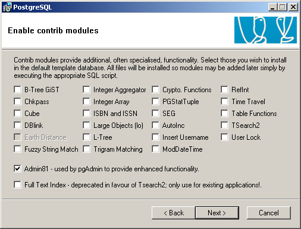
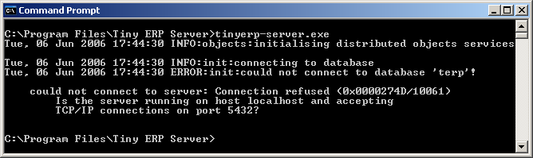
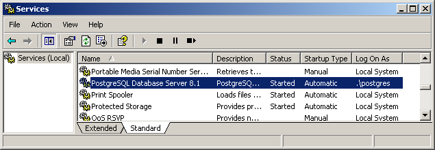
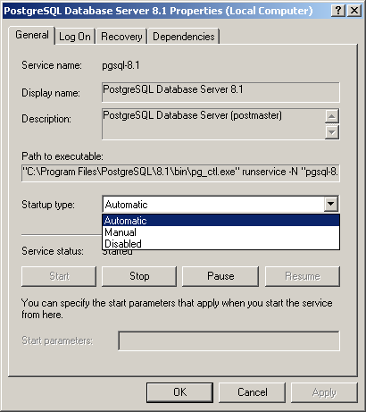
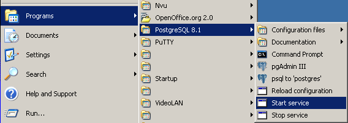

.. i18n: .. index::
.. i18n:    single: Installation; Windows installation quirks
.. i18n:    single: Installation; Windows Vista
.. i18n:    single: Installation; Windows 2000/XP
.. i18n: .. 

.. index::
   single: Installation; Windows installation quirks
   single: Installation; Windows Vista
   single: Installation; Windows 2000/XP
.. 

.. i18n: .. _troubleshooting-and-windows-complementary-install-information:
.. i18n: 
.. i18n: Troubleshooting and Windows Complementary Install Information
.. i18n: =============================================================

.. _troubleshooting-and-windows-complementary-install-information:

Troubleshooting and Windows Complementary Install Information
=============================================================

.. i18n: Windows Vista
.. i18n: -------------

Windows Vista
-------------

.. i18n: For Windows Vista installation please review this forum posts

For Windows Vista installation please review this forum posts

.. i18n:   * `http://openerp.com/forum/topic4484.html <http://openerp.com/forum/topic4484.html?highlight=windows%20vista>`_
.. i18n:   * `http://openerp.com/forum/topic4386.html <http://openerp.com/forum/topic4386.html?highlight=windows%20vista>`_

  * `http://openerp.com/forum/topic4484.html <http://openerp.com/forum/topic4484.html?highlight=windows%20vista>`_
  * `http://openerp.com/forum/topic4386.html <http://openerp.com/forum/topic4386.html?highlight=windows%20vista>`_

.. i18n: Windows 2000/XP
.. i18n: ---------------

Windows 2000/XP
---------------

.. i18n: PostgreSQL Installation
.. i18n: +++++++++++++++++++++++

PostgreSQL Installation
+++++++++++++++++++++++

.. i18n: Default values
.. i18n: """"""""""""""

Default values
""""""""""""""

.. i18n: .. describe:: PL/PGSQL language inclusion in the installation:

.. describe:: PL/PGSQL language inclusion in the installation:

.. i18n: leave the default selection:

leave the default selection:

.. i18n: .. image:: ../../img/06_proc_lang.png

.. image:: ../../img/06_proc_lang.png

.. i18n: .. describe:: Contrib modules screen:

.. describe:: Contrib modules screen:

.. i18n: You don't need to change the default selections:

You don't need to change the default selections:

.. i18n: .. image:: ../../img/07_contrib_modules.png

.. i18n: Account Domain lookup failure
.. i18n: """""""""""""""""""""""""""""

Account Domain lookup failure
"""""""""""""""""""""""""""""

.. i18n: .. image:: ../../img/100_internal_account_failure.png

.. image:: ../../img/100_internal_account_failure.png

.. i18n: If you see this screen at the end of PostgreSQL installation, it is due to an incorrect ``Account domain`` in the Service
.. i18n: configuration screen. By default the installer fills this value automatically, so if you have changed it, it may cause the
.. i18n: installation to fail.

If you see this screen at the end of PostgreSQL installation, it is due to an incorrect ``Account domain`` in the Service
configuration screen. By default the installer fills this value automatically, so if you have changed it, it may cause the
installation to fail.

.. i18n: Redo the installation of PostgreSQL and leave ``Account domain`` in the Service configuration screen on the default value.

Redo the installation of PostgreSQL and leave ``Account domain`` in the Service configuration screen on the default value.

.. i18n: User account error
.. i18n: """"""""""""""""""

User account error
""""""""""""""""""

.. i18n: During the installation of PostgreSQL you may get an error saying:

During the installation of PostgreSQL you may get an error saying:

.. i18n: Account ``@#$%@#$^@%`` doesn't exist

Account ``@#$%@#$^@%`` doesn't exist

.. i18n: This error was encountered once with the Open ERP Complete Autoinstaller.

This error was encountered once with the Open ERP Complete Autoinstaller.

.. i18n: The problems seems to be that in order to install PostgreSQL automatically in silent mode, we create a new user account with
.. i18n: the net.exe command, and in that particular case the system's security policy was too strict to allow a simple non
.. i18n: privileged user to be added this way.

The problems seems to be that in order to install PostgreSQL automatically in silent mode, we create a new user account with
the net.exe command, and in that particular case the system's security policy was too strict to allow a simple non
privileged user to be added this way.

.. i18n: It could also fail if you are using Active Directory to manage the user accounts. In that case you should use the individual
.. i18n: Open ERP Server, Client and PostgreSQL installers.

It could also fail if you are using Active Directory to manage the user accounts. In that case you should use the individual
Open ERP Server, Client and PostgreSQL installers.

.. i18n: PostgreSQL administration
.. i18n: +++++++++++++++++++++++++

PostgreSQL administration
+++++++++++++++++++++++++

.. i18n: Open ERP Server Connection Error with PostgreSQL
.. i18n: """"""""""""""""""""""""""""""""""""""""""""""""

Open ERP Server Connection Error with PostgreSQL
""""""""""""""""""""""""""""""""""""""""""""""""

.. i18n: Verify that you are using the username and password from the "Initialise database cluster" screen
.. i18n: when launching Open ERP Server

Verify that you are using the username and password from the "Initialise database cluster" screen
when launching Open ERP Server

.. i18n: If there's another problem similar to this situation:

If there's another problem similar to this situation:

.. i18n: .. image:: ../../img/101_erp2pgsql_conn_fail.png

.. i18n: You should have look if the service PostgreSQL is running in the Services manager (Control Panel : Administration tools -
.. i18n: > Services)

You should have look if the service PostgreSQL is running in the Services manager (Control Panel : Administration tools -
> Services)

.. i18n: .. image:: ../../img/Pgsql_51_service_status.png

.. i18n: You can edit the service configuration to have PostgreSQL starting as a service at system boot

You can edit the service configuration to have PostgreSQL starting as a service at system boot

.. i18n: .. image:: ../../img/Pgsql_53_service_start_mode.png

.. i18n: Or you can start it manually every time from the programs menu.

Or you can start it manually every time from the programs menu.

.. i18n: .. image:: ../../img/104_pgsql_start_service.png

.. i18n: If your PostgreSQL service is running, but you get connection errors, you can restart the service.

If your PostgreSQL service is running, but you get connection errors, you can restart the service.

.. i18n: .. image:: ../../img/Pgsql_52_service_restart.png

.. image:: ../../img/Pgsql_52_service_restart.png

.. i18n: GTK client localization
.. i18n: +++++++++++++++++++++++

GTK client localization
+++++++++++++++++++++++

.. i18n: Open ERP GTK client upper menu not translated
.. i18n: """""""""""""""""""""""""""""""""""""""""""""

Open ERP GTK client upper menu not translated
"""""""""""""""""""""""""""""""""""""""""""""

.. i18n: The locale identifier of Microsoft Windows (a number such as 1033 for english - US) is not correctly managed by GTK and the
.. i18n: menus not translated into the language of the OS.

The locale identifier of Microsoft Windows (a number such as 1033 for english - US) is not correctly managed by GTK and the
menus not translated into the language of the OS.

.. i18n: You can fix this problem with creating a new environment variable :

You can fix this problem with creating a new environment variable :

.. i18n:  #. Right-click My Computer, and then click Properties.
.. i18n:  #. Click the Advanced tab.
.. i18n:  #. Click Environment variables.
.. i18n:  #. Click New to add a new system variable with name "LANG" and value "fr_FR" for example.

 #. Right-click My Computer, and then click Properties.
 #. Click the Advanced tab.
 #. Click Environment variables.
 #. Click New to add a new system variable with name "LANG" and value "fr_FR" for example.
