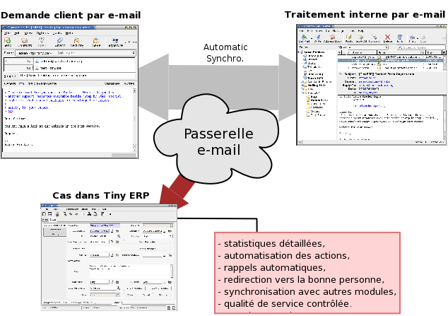

.. i18n: Case management
.. i18n: ===============

Case management
===============

.. i18n: The following sections describe the steps you might use to implement an effective customer
.. i18n: relationship management policy. The policy is implemented by basing new types of case on the built-
.. i18n: in Open ERP case handling system.

The following sections describe the steps you might use to implement an effective customer
relationship management policy. The policy is implemented by basing new types of case on the built-
in Open ERP case handling system.

.. i18n: .. index:: case (CRM)

.. index:: case (CRM)

.. i18n: .. note:: Case
.. i18n: 
.. i18n: 	Case is a generic term that refers to a discussion with a partner about a specific subject. This
.. i18n: 	subject could be in any category – the monitoring of responses to a job advert, perhaps, or a
.. i18n: 	purchase or sales order, or an after-sales quality problem.
.. i18n: 
.. i18n: 	A case is used for following the history of the messages on a topic and for automating some
.. i18n: 	operations in response to certain conditions. Interfaces are available for OpenOffice.org and for
.. i18n: 	email such as Microsoft Outlook Express and Microsoft Outlook, so that you can make productive use
.. i18n: 	of the case system from your existing tools.
.. i18n: 
.. i18n: 	Case statistics generated by the system can be used by your managers to improve their handling of
.. i18n: 	supplier and customer interactions.

.. note:: Case

	Case is a generic term that refers to a discussion with a partner about a specific subject. This
	subject could be in any category – the monitoring of responses to a job advert, perhaps, or a
	purchase or sales order, or an after-sales quality problem.

	A case is used for following the history of the messages on a topic and for automating some
	operations in response to certain conditions. Interfaces are available for OpenOffice.org and for
	email such as Microsoft Outlook Express and Microsoft Outlook, so that you can make productive use
	of the case system from your existing tools.

	Case statistics generated by the system can be used by your managers to improve their handling of
	supplier and customer interactions.

.. i18n: CRM configuration
.. i18n: -----------------

CRM configuration
-----------------

.. i18n: Case management is a generic system that can be configured to your more precise needs. You'll
.. i18n: develop three case types here, to see how to build the following systems:

Case management is a generic system that can be configured to your more precise needs. You'll
develop three case types here, to see how to build the following systems:

.. i18n: 	#. A system to manage business opportunities.
.. i18n: 
.. i18n: 	#. A system for managing support contracts on two levels.
.. i18n: 
.. i18n: 	#. A system for managing supplier quality.

	#. A system to manage business opportunities.

	#. A system for managing support contracts on two levels.

	#. A system for managing supplier quality.

.. i18n: .. index::
.. i18n:    single: case; sections
.. i18n: ..

.. index::
   single: case; sections
..

.. i18n: Sections
.. i18n: ^^^^^^^^

Sections
^^^^^^^^

.. i18n: To handle each of these case types in a different way, you must create different sections in
.. i18n: Open ERP using the menu :menuselection:`CRM & SRM --> Configuration --> Case --> Sections` . Do
.. i18n: this as user \ ``admin``\   in your database to try it for yourself.

To handle each of these case types in a different way, you must create different sections in
Open ERP using the menu :menuselection:`CRM & SRM --> Configuration --> Case --> Sections` . Do
this as user \ ``admin``\   in your database to try it for yourself.

.. i18n: You'll define the following four sections:

You'll define the following four sections:

.. i18n: * Sales
.. i18n: 
.. i18n: * Support Level 2
.. i18n: 
.. i18n: 	- Support Level 1
.. i18n: 
.. i18n: * Quality.

* Sales

* Support Level 2

	- Support Level 1

* Quality.

.. i18n: Put the name in the field :guilabel:`Case Section`. You construct a tree structure for sections is
.. i18n: constructed using the :guilabel:`Parent Section`  field in the Section form. So here you'd say that
.. i18n: \ ``Support Level 2``\   is the parent of \ ``Support Level 1``\  . Open ERP doesn't restrict the
.. i18n: order you use to define these two – you can save the parent while defining the child (try it by
.. i18n: starting with \ ``Support Level 1``\  ).

Put the name in the field :guilabel:`Case Section`. You construct a tree structure for sections is
constructed using the :guilabel:`Parent Section`  field in the Section form. So here you'd say that
\ ``Support Level 2``\   is the parent of \ ``Support Level 1``\  . Open ERP doesn't restrict the
order you use to define these two – you can save the parent while defining the child (try it by
starting with \ ``Support Level 1``\  ).

.. i18n: A manager can then be assigned to each section (from the list of Open ERP system users), and an
.. i18n: email address can optionally be added. Cases in this section are then automatically connected to
.. i18n: this email address – case messages are emailed out automatically from this address and emails to
.. i18n: this address are automatically logged in this section of the CRM system. This functionality is based
.. i18n: on the email gateway referred to in detail further on in this chapter.

A manager can then be assigned to each section (from the list of Open ERP system users), and an
email address can optionally be added. Cases in this section are then automatically connected to
this email address – case messages are emailed out automatically from this address and emails to
this address are automatically logged in this section of the CRM system. This functionality is based
on the email gateway referred to in detail further on in this chapter.

.. i18n: Click the menu :menuselection:`CRM & SRM --> Cases --> Cases by Section` to get the sections in a
.. i18n: hierarchical list, then click a section name to list the cases that have been assigned to that
.. i18n: section.

Click the menu :menuselection:`CRM & SRM --> Cases --> Cases by Section` to get the sections in a
hierarchical list, then click a section name to list the cases that have been assigned to that
section.

.. i18n: .. note:: Cases by Section – with data
.. i18n: 
.. i18n: 	Click the menu :menuselection:`CRM & SRM --> Cases --> Cases by Section` to get the sections in a
.. i18n: 	hierarchical list,
.. i18n: 	then click a section name, such as :guilabel:`Helpdesk` or :guilabel:`Support`, to list the cases
.. i18n: 	that have been assigned to that section.

.. note:: Cases by Section – with data

	Click the menu :menuselection:`CRM & SRM --> Cases --> Cases by Section` to get the sections in a
	hierarchical list,
	then click a section name, such as :guilabel:`Helpdesk` or :guilabel:`Support`, to list the cases
	that have been assigned to that section.

.. i18n: .. index::
.. i18n:    single: case; categories
.. i18n: ..

.. index::
   single: case; categories
..

.. i18n: Categories
.. i18n: ^^^^^^^^^^

Categories
^^^^^^^^^^

.. i18n: Once you've defined the different sections you can create Categories, which are used to
.. i18n: differentiate the cases in a section. You create categories using the menu :menuselection:`CRM & SRM
.. i18n: --> Configuration --> Cases --> Categories` . Create the following in your database:

Once you've defined the different sections you can create Categories, which are used to
differentiate the cases in a section. You create categories using the menu :menuselection:`CRM & SRM
--> Configuration --> Cases --> Categories` . Create the following in your database:

.. i18n:  .. csv-table:: Categories assigned to the different sections
.. i18n:    :header: "Category","Section"
.. i18n:    :widths: 30, 15
.. i18n: 
.. i18n:    "Installation Requests","Sales"
.. i18n:    "Potential Distributor","Sales"
.. i18n:    "Interest in Training","Sales"
.. i18n:    "Fault Fix","Support Level 1"
.. i18n:    "Functional Problem","Support Level 1"
.. i18n:    "Corrective Actions","Quality"
.. i18n:    "Preventative Actions","Quality"

 .. csv-table:: Categories assigned to the different sections
   :header: "Category","Section"
   :widths: 30, 15

   "Installation Requests","Sales"
   "Potential Distributor","Sales"
   "Interest in Training","Sales"
   "Fault Fix","Support Level 1"
   "Functional Problem","Support Level 1"
   "Corrective Actions","Quality"
   "Preventative Actions","Quality"

.. i18n: .. index::
.. i18n:    single: case; menu
.. i18n: ..

.. index::
   single: case; menu
..

.. i18n: Menu
.. i18n: ^^^^

Menu
^^^^

.. i18n: Once the sections and the categories are defined you can generate some menus to make it easier to
.. i18n: use these cases. Select the menu :menuselection:`CRM & SRM -->
.. i18n: Configuration --> Create Menus` for a New Section`.

Once the sections and the categories are defined you can generate some menus to make it easier to
use these cases. Select the menu :menuselection:`CRM & SRM -->
Configuration --> Create Menus` for a New Section`.

.. i18n: The procedure is to create the name of the new menu in :guilabel:`Menu base name`, select the name
.. i18n: of a suitable :guilabel:`Parent menu` for the menu and the :guilabel:`Case Section` name, then click
.. i18n: :guilabel:`Create menu Entries`. Following this procedure, create the following menus:

The procedure is to create the name of the new menu in :guilabel:`Menu base name`, select the name
of a suitable :guilabel:`Parent menu` for the menu and the :guilabel:`Case Section` name, then click
:guilabel:`Create menu Entries`. Following this procedure, create the following menus:

.. i18n: .. csv-table:: Example of creating menus that make it easier to use cases
.. i18n:    :header: "Menu base name","Case Section","Parent menu"
.. i18n:    :widths: 25,20,25
.. i18n: 
.. i18n:    "Business Opportunities","Sales","Sales Management"
.. i18n:    "Support L1","Support Level 1","CRM & SRM"
.. i18n:    "Support L2","Support Level 2","CRM & SRM"
.. i18n:    "Quality Problems","Quality","Purchase Management"

.. csv-table:: Example of creating menus that make it easier to use cases
   :header: "Menu base name","Case Section","Parent menu"
   :widths: 25,20,25

   "Business Opportunities","Sales","Sales Management"
   "Support L1","Support Level 1","CRM & SRM"
   "Support L2","Support Level 2","CRM & SRM"
   "Quality Problems","Quality","Purchase Management"

.. i18n: Each time you run this utility (that is, for each line in the table above), Open ERP generates a
.. i18n: menu structure like :ref:`fig-busopp`.

Each time you run this utility (that is, for each line in the table above), Open ERP generates a
menu structure like :ref:`fig-busopp`.

.. i18n: .. _fig-busopp:
.. i18n: 
.. i18n: .. figure::  images/business_ops.png
.. i18n:    :scale: 50
.. i18n:    :align: center
.. i18n: 
.. i18n:    *Business Opportunities menu automatically generated*

.. _fig-busopp:

.. figure::  images/business_ops.png
   :scale: 50
   :align: center

   *Business Opportunities menu automatically generated*

.. i18n: .. note:: Case sections
.. i18n: 
.. i18n: 	Open ERP enables you to select the view mode you want when the menu is opened to display the cases
.. i18n: 	for each section such as Sales, Helpdesk, and Support Request.
.. i18n: 
.. i18n: 	Your selection of view determines the type of form that opens when showing a case in each section.
.. i18n: 	So the form following a support request case could differ from the form for a business opportunity.
.. i18n: 
.. i18n: 	If you're working in a different language from the default, you can define the labels in that
.. i18n: 	language after you've created the new menus.

.. note:: Case sections

	Open ERP enables you to select the view mode you want when the menu is opened to display the cases
	for each section such as Sales, Helpdesk, and Support Request.

	Your selection of view determines the type of form that opens when showing a case in each section.
	So the form following a support request case could differ from the form for a business opportunity.

	If you're working in a different language from the default, you can define the labels in that
	language after you've created the new menus.

.. i18n: .. note:: Personalizing menus
.. i18n: 
.. i18n: 	You can rename menus if you don't like the way they've been generated by the system.
.. i18n: 	To do this, select the menu line by single-clicking on the line
.. i18n: 	(but not on the menu text itself) and then clicking the :guilabel:`Switch` icon.
.. i18n: 
.. i18n: 	You'll see a form view of the menu definition.
.. i18n: 	If it's in edit mode you can change its name and position in the hierarchy,
.. i18n: 	and you can select a different icon for it.
.. i18n: 	You can also choose a different action for when the menu is clicked.
.. i18n: 	If you've saved or cancelled the menu form so that it's not in edit mode
.. i18n: 	you can duplicate it or delete it completely.
.. i18n: 	Duplicating it can sometimes be helpful, placing a copy somewhere else in the
.. i18n: 	menu hierarchy and perhaps making it accessible to different groups of users.

.. note:: Personalizing menus

	You can rename menus if you don't like the way they've been generated by the system.
	To do this, select the menu line by single-clicking on the line
	(but not on the menu text itself) and then clicking the :guilabel:`Switch` icon.

	You'll see a form view of the menu definition.
	If it's in edit mode you can change its name and position in the hierarchy,
	and you can select a different icon for it.
	You can also choose a different action for when the menu is clicked.
	If you've saved or cancelled the menu form so that it's not in edit mode
	you can duplicate it or delete it completely.
	Duplicating it can sometimes be helpful, placing a copy somewhere else in the
	menu hierarchy and perhaps making it accessible to different groups of users.

.. i18n: Using cases
.. i18n: -----------

Using cases
-----------

.. i18n: Although you've created special menu trees for each of the types of case you defined, you can
.. i18n: continue using the generic case system reached through :menuselection:`CRM & SRM --> Cases`. The new
.. i18n: case types are just versions of the generic case.

Although you've created special menu trees for each of the types of case you defined, you can
continue using the generic case system reached through :menuselection:`CRM & SRM --> Cases`. The new
case types are just versions of the generic case.

.. i18n: .. index::
.. i18n:    single: case; transferability
.. i18n: ..

.. index::
   single: case; transferability
..

.. i18n: .. tip:: Transferability of cases
.. i18n: 
.. i18n: 	It's quite useful to base the whole management of customer relationships on a generic system, as
.. i18n: 	Open ERP does.
.. i18n: 	Since each section is just a specialization of the generic system you can transfer requests
.. i18n: 	from one section to another, and this means that you don't lose cases in the system as you delegate
.. i18n: 	work to other staff in your company.
.. i18n: 
.. i18n: 	For example you can imagine a support request becoming a business opportunity.
.. i18n: 	Or an after-sales service request becoming a supplier quality issue where a fault is found in a
.. i18n: 	purchased product.
.. i18n: 
.. i18n: 	You can also track items across the whole company.

.. tip:: Transferability of cases

	It's quite useful to base the whole management of customer relationships on a generic system, as
	Open ERP does.
	Since each section is just a specialization of the generic system you can transfer requests
	from one section to another, and this means that you don't lose cases in the system as you delegate
	work to other staff in your company.

	For example you can imagine a support request becoming a business opportunity.
	Or an after-sales service request becoming a supplier quality issue where a fault is found in a
	purchased product.

	You can also track items across the whole company.

.. i18n: .. figure::  images/crm_case.png
.. i18n:    :scale: 50
.. i18n:    :align: center
.. i18n: 
.. i18n:    *An entry following a business opportunity*

.. figure::  images/crm_case.png
   :scale: 50
   :align: center

   *An entry following a business opportunity*

.. i18n: To enter a new business opportunity, you can use the menu that you've just created:
.. i18n: :menuselection:`Sales Management --> Business Opportunities`. Or you could have used the generic
.. i18n: menus
.. i18n: :menuselection:`CRM & SRM --> Cases --> Cases by section`, or :menuselection:`CRM & SRM --> Cases
.. i18n: --> All cases`.

To enter a new business opportunity, you can use the menu that you've just created:
:menuselection:`Sales Management --> Business Opportunities`. Or you could have used the generic
menus
:menuselection:`CRM & SRM --> Cases --> Cases by section`, or :menuselection:`CRM & SRM --> Cases
--> All cases`.

.. i18n: Create a case from :menuselection:`Sales Management --> Business
.. i18n: Opportunities` by entering information about the request, namely:

Create a case from :menuselection:`Sales Management --> Business
Opportunities` by entering information about the request, namely:

.. i18n: * a :guilabel:`Description`  of the case,
.. i18n: 
.. i18n: * its :guilabel:`Section` will already be completed with \ ``Sales``\  ,
.. i18n: 
.. i18n: * a :guilabel:`Priority`,
.. i18n: 
.. i18n: * the :guilabel:`Partner`,
.. i18n: 
.. i18n: * the :guilabel:`Partner Contact` (which will be completed automatically when the Partner is filled in but
.. i18n:   can be overwritten),
.. i18n: 
.. i18n: * the :guilabel:`Partner Email` address (which will be completed from the Partner Contact's email address
.. i18n:   but can be overwritten),
.. i18n: 
.. i18n: * the person in your own company who will be the :guilabel:`User Responsible` for the case.

* a :guilabel:`Description`  of the case,

* its :guilabel:`Section` will already be completed with \ ``Sales``\  ,

* a :guilabel:`Priority`,

* the :guilabel:`Partner`,

* the :guilabel:`Partner Contact` (which will be completed automatically when the Partner is filled in but
  can be overwritten),

* the :guilabel:`Partner Email` address (which will be completed from the Partner Contact's email address
  but can be overwritten),

* the person in your own company who will be the :guilabel:`User Responsible` for the case.

.. i18n: .. index::
.. i18n:    single: email gateway
.. i18n:    single: gateway; email

.. index::
   single: email gateway
   single: gateway; email

.. i18n: .. tip::  The email gateway
.. i18n: 
.. i18n: 	You'll see later in this chapter that cases can be generated automatically from emails.
.. i18n: 	If the email gateway is configured properly you'll no longer have to enter cases manually
.. i18n: 	through the menu system – they'll just be created from incoming emails.

.. tip::  The email gateway

	You'll see later in this chapter that cases can be generated automatically from emails.
	If the email gateway is configured properly you'll no longer have to enter cases manually
	through the menu system – they'll just be created from incoming emails.

.. i18n: A case starts in the \ ``Draft``\   state once it's been created. You can then open it to indicate
.. i18n: that you're working on it by clicking the :guilabel:`Open`  button.

A case starts in the \ ``Draft``\   state once it's been created. You can then open it to indicate
that you're working on it by clicking the :guilabel:`Open`  button.

.. i18n: To enter text about the request or about actions taken to satisfy it, type an entry in free text. To
.. i18n: save the history of your comments, click :guilabel:`Historize`. If you click :guilabel:`Send Partner
.. i18n: and Historize` the partner will also receive a copy of your comment as you save it.

To enter text about the request or about actions taken to satisfy it, type an entry in free text. To
save the history of your comments, click :guilabel:`Historize`. If you click :guilabel:`Send Partner
and Historize` the partner will also receive a copy of your comment as you save it.

.. i18n: While the case is open you can click :guilabel:`Close`  if it's been completed or :guilabel:`Cancel`
.. i18n: if it's to go no further. If you want the case to wait for a response from a partner click
.. i18n: :guilabel:`Pending`.

While the case is open you can click :guilabel:`Close`  if it's been completed or :guilabel:`Cancel`
if it's to go no further. If you want the case to wait for a response from a partner click
:guilabel:`Pending`.

.. i18n: Add some text for this example case in the database, then close it.

Add some text for this example case in the database, then close it.

.. i18n: If you've organized the sections in a hierarchical structure you can click on :guilabel:`Escalate`.
.. i18n: The case then escalates into the parent section. You can't do that with the Business Opportunity
.. i18n: that you just defined, which is single-level but you could with a Support L1 case. For example if a
.. i18n: developer on level 1 can't handle a customer problem then she can escalate the request to level 2
.. i18n: where it can be handled by a more experienced user.

If you've organized the sections in a hierarchical structure you can click on :guilabel:`Escalate`.
The case then escalates into the parent section. You can't do that with the Business Opportunity
that you just defined, which is single-level but you could with a Support L1 case. For example if a
developer on level 1 can't handle a customer problem then she can escalate the request to level 2
where it can be handled by a more experienced user.

.. i18n: .. tip:: Assigning a case
.. i18n: 
.. i18n: 	Two approaches are available to you for assigning a case to a suitable manager.
.. i18n: 	Any case can be assigned by the user who creates the original case, or this field can be left
.. i18n: 	blank.
.. i18n: 	If it's blank you'd review the resulting list of unassigned cases and pick one up and assign it to
.. i18n: 	yourself.
.. i18n: 
.. i18n: 	You can also imagine a mixed method: all cases arrive unassigned and a user is responsible for the
.. i18n: 	division of work to the relevant section.

.. tip:: Assigning a case

	Two approaches are available to you for assigning a case to a suitable manager.
	Any case can be assigned by the user who creates the original case, or this field can be left
	blank.
	If it's blank you'd review the resulting list of unassigned cases and pick one up and assign it to
	yourself.

	You can also imagine a mixed method: all cases arrive unassigned and a user is responsible for the
	division of work to the relevant section.

.. i18n: You can look up the history of comments and actions on the request at any time by looking at the
.. i18n: case :guilabel:`History`, which is in its own tab.

You can look up the history of comments and actions on the request at any time by looking at the
case :guilabel:`History`, which is in its own tab.

.. i18n: Users can create their own shortcuts from menus such as :menuselection:`My Support Requests` and
.. i18n: :menuselection:`My Business Opportunities` to quickly list cases that they're personally responsible
.. i18n: for.

Users can create their own shortcuts from menus such as :menuselection:`My Support Requests` and
:menuselection:`My Business Opportunities` to quickly list cases that they're personally responsible
for.

.. i18n: .. index:: calendars

.. index:: calendars

.. i18n: Generating calendars
.. i18n: --------------------

Generating calendars
--------------------

.. i18n: The Open ERP web client can display any type of resource in the form of a timetable. You can
.. i18n: generate calendar views for each of your cases as you create menus for those cases.

The Open ERP web client can display any type of resource in the form of a timetable. You can
generate calendar views for each of your cases as you create menus for those cases.

.. i18n: So if you want to implement a shared calendar for your calendar in Open ERP all you need to do is:

So if you want to implement a shared calendar for your calendar in Open ERP all you need to do is:

.. i18n: 	#. Create a section \ ``Meeting Calendar``\
.. i18n: 
.. i18n: 	#. Create menus for this section while specifying that you want a calendar view from
.. i18n: 	   :menuselection:`CRM & SRM --> Configuration --> Create Menus for a New Section`.

	#. Create a section \ ``Meeting Calendar``\

	#. Create menus for this section while specifying that you want a calendar view from
	   :menuselection:`CRM & SRM --> Configuration --> Create Menus for a New Section`.

.. i18n: You'll get menus enabling you to manage calendars for each employee, and you'll also get a shared
.. i18n: calendar for the company. This calendar view is totally dynamic. You can move an event or change its
.. i18n: duration just using your mouse.

You'll get menus enabling you to manage calendars for each employee, and you'll also get a shared
calendar for the company. This calendar view is totally dynamic. You can move an event or change its
duration just using your mouse.

.. i18n: .. figure::  images/crm_calendar1.png
.. i18n:    :align: center
.. i18n:    :scale: 90
.. i18n: 
.. i18n:    *Monthly view of the meeting calendar for cases*

.. figure::  images/crm_calendar1.png
   :align: center
   :scale: 90

   *Monthly view of the meeting calendar for cases*

.. i18n: You can change the view and return to the list view, forms or graphs by using the buttons at the top
.. i18n: right. Open ERP's usual search tools and filters enable you to filter the events displayed in the
.. i18n: calendar or, for example, to display the calendar for only some employees at a time.

You can change the view and return to the list view, forms or graphs by using the buttons at the top
right. Open ERP's usual search tools and filters enable you to filter the events displayed in the
calendar or, for example, to display the calendar for only some employees at a time.

.. i18n: .. figure::  images/crm_calendar2.png
.. i18n:    :align: center
.. i18n:    :scale: 90
.. i18n: 
.. i18n:    *Weekly view of the meeting calendar for cases*

.. figure::  images/crm_calendar2.png
   :align: center
   :scale: 90

   *Weekly view of the meeting calendar for cases*

.. i18n: .. note:: The generic calendar
.. i18n: 
.. i18n: 	Unlike traditional CRM software, Open ERP's calendar view is not limited to displaying
.. i18n: 	appointments. It's available for any type of resource.
.. i18n: 
.. i18n: 	So in addition to the cases handled here, you could obtain calendars of tasks, deliveries,
.. i18n: 	manufacturing orders, sales or personal leave.
.. i18n: 
.. i18n: 	This view is very useful for planning or to get a global overview of a list of dated elements.

.. note:: The generic calendar

	Unlike traditional CRM software, Open ERP's calendar view is not limited to displaying
	appointments. It's available for any type of resource.

	So in addition to the cases handled here, you could obtain calendars of tasks, deliveries,
	manufacturing orders, sales or personal leave.

	This view is very useful for planning or to get a global overview of a list of dated elements.

.. i18n: .. index:: performance analysis

.. index:: performance analysis

.. i18n: Analyzing performance
.. i18n: ---------------------

Analyzing performance
---------------------

.. i18n: Since all of your customer communications are integrated into the Open ERP system, you can analyses
.. i18n: the performance of your teams in many ways.

Since all of your customer communications are integrated into the Open ERP system, you can analyses
the performance of your teams in many ways.

.. i18n: .. index::
.. i18n:    single: module; report_crm

.. index::
   single: module; report_crm

.. i18n: Open ERP has a module that helps handle this – :mod:`report_crm`. It's not part of the core
.. i18n: Open ERP so you must first download it to your desktop from Open ERP's modules repository, then
.. i18n: into your server using :menuselection:`Administration --> Modules Management --> Import module`.
.. i18n: Then install it into the database.

Open ERP has a module that helps handle this – :mod:`report_crm`. It's not part of the core
Open ERP so you must first download it to your desktop from Open ERP's modules repository, then
into your server using :menuselection:`Administration --> Modules Management --> Import module`.
Then install it into the database.

.. i18n: Once you've installed it you can use menu :menuselection:`CRM & SRM --> Reporting` 
.. i18n: to create different reports.

Once you've installed it you can use menu :menuselection:`CRM & SRM --> Reporting` 
to create different reports.

.. i18n: .. figure::  images/crm_graph.png
.. i18n:    :scale: 50
.. i18n:    :align: center
.. i18n: 
.. i18n:    *Analyzing the performance of your support team*

.. figure::  images/crm_graph.png
   :scale: 50
   :align: center

   *Analyzing the performance of your support team*

.. i18n: If you want to analyze the performance of your service and support group, for example, use the graph
.. i18n: from :menuselection:`CRM & SRM --> Reporting --> All Months --> Cases by User and Section`. Click
.. i18n: the menu to obtain a list view, then click the :guilabel:`Graph` button to the top right of the
.. i18n: list. The system shows you statistics per user and it's possible to filter on each section and use
.. i18n: other criteria for searching. For example, you can type in a date range, click :guilabel:`Filter`,
.. i18n: and see the graph change to reflect the new data.

If you want to analyze the performance of your service and support group, for example, use the graph
from :menuselection:`CRM & SRM --> Reporting --> All Months --> Cases by User and Section`. Click
the menu to obtain a list view, then click the :guilabel:`Graph` button to the top right of the
list. The system shows you statistics per user and it's possible to filter on each section and use
other criteria for searching. For example, you can type in a date range, click :guilabel:`Filter`,
and see the graph change to reflect the new data.

.. i18n: By default, the system provides a list containing the following information for each month, user and
.. i18n: section, and an indication of the state of each set of information:

By default, the system provides a list containing the following information for each month, user and
section, and an indication of the state of each set of information:

.. i18n: *  :guilabel:`number of cases`,
.. i18n: 
.. i18n: *  :guilabel:`average delay for closing` the request,
.. i18n: 
.. i18n: *  :guilabel:`estimated revenue` for a business opportunity,
.. i18n: 
.. i18n: *  :guilabel:`estimated cost`,
.. i18n: 
.. i18n: * estimate of revenue multiplied by the probability of success, to give you an :guilabel:`estimated weighted
.. i18n:   revenue` figure.

*  :guilabel:`number of cases`,

*  :guilabel:`average delay for closing` the request,

*  :guilabel:`estimated revenue` for a business opportunity,

*  :guilabel:`estimated cost`,

* estimate of revenue multiplied by the probability of success, to give you an :guilabel:`estimated weighted
  revenue` figure.

.. i18n: .. tip:: Navigating through the statistics
.. i18n: 
.. i18n: 	You can obtain more information about a user or a case section from these reports, drilling down
.. i18n: 	into the data displayed.
.. i18n: 
.. i18n: 	In the web client you click the appropriate text string on one of the lines (such as
.. i18n: 	:guilabel:`Demo User` or :guilabel:`Helpdesk and Support`) to open a form for it, and then click
.. i18n: 	one of the buttons in the :guilabel:`Action` toolbar to the right of the User or Section form that
.. i18n: 	is displayed.
.. i18n: 
.. i18n: 	In the GTK client you'd right-click over the text instead – this brings up a context menu with
.. i18n: 	the same options as the web client would give you.

.. tip:: Navigating through the statistics

	You can obtain more information about a user or a case section from these reports, drilling down
	into the data displayed.

	In the web client you click the appropriate text string on one of the lines (such as
	:guilabel:`Demo User` or :guilabel:`Helpdesk and Support`) to open a form for it, and then click
	one of the buttons in the :guilabel:`Action` toolbar to the right of the User or Section form that
	is displayed.

	In the GTK client you'd right-click over the text instead – this brings up a context menu with
	the same options as the web client would give you.

.. i18n: You can specify that the graph view, say, appears by default so that you can consistently present
.. i18n: the information more visually.

You can specify that the graph view, say, appears by default so that you can consistently present
the information more visually.

.. i18n: .. index::
.. i18n:    single: case; rule

.. index::
   single: case; rule

.. i18n: Automating actions using rules
.. i18n: ------------------------------

Automating actions using rules
------------------------------

.. i18n: Analyzing figures gives you a better basis for managing all of your services and customer and
.. i18n: supplier relationships. But you can do more than just display the figures graphically from time to
.. i18n: time.

Analyzing figures gives you a better basis for managing all of your services and customer and
supplier relationships. But you can do more than just display the figures graphically from time to
time.

.. i18n: If the performance of a section, a user or a category of a case is beginning to cause concern then
.. i18n: you can use Open ERP's rules system to monitor the situation more closely. Rules enable you to
.. i18n: automatically trigger actions depending on criteria you define for each case. They provide a good
.. i18n: way of implementing a proper continuous improvement policy for your customer relations and quality
.. i18n: of service.

If the performance of a section, a user or a category of a case is beginning to cause concern then
you can use Open ERP's rules system to monitor the situation more closely. Rules enable you to
automatically trigger actions depending on criteria you define for each case. They provide a good
way of implementing a proper continuous improvement policy for your customer relations and quality
of service.

.. i18n: Using these rules you could:

Using these rules you could:

.. i18n: * automatically send emails to the client during different phases of a support request, to keep the
.. i18n:   client up to date with progress,
.. i18n: 
.. i18n: * assign the case to another person if the the case manager is on holiday,
.. i18n: 
.. i18n: * send a reminder to the supplier if their response is delayed too long,
.. i18n: 
.. i18n: * always mark a case as urgent if it's from a major client,
.. i18n: 
.. i18n: * transfer the case to technical services if the request is about a technical fault.

* automatically send emails to the client during different phases of a support request, to keep the
  client up to date with progress,

* assign the case to another person if the the case manager is on holiday,

* send a reminder to the supplier if their response is delayed too long,

* always mark a case as urgent if it's from a major client,

* transfer the case to technical services if the request is about a technical fault.

.. i18n: To define new rules use the menu :menuselection:`CRM & SRM --> Configuration --> Cases --> Rules`.

To define new rules use the menu :menuselection:`CRM & SRM --> Configuration --> Cases --> Rules`.

.. i18n: .. figure::  images/crm_rule.png
.. i18n:    :scale: 50
.. i18n:    :align: center
.. i18n: 
.. i18n:    *Screenshot of a rule*

.. figure::  images/crm_rule.png
   :scale: 50
   :align: center

   *Screenshot of a rule*

.. i18n: .. index::
.. i18n:    single: rule; case

.. index::
   single: rule; case

.. i18n: The criteria for activating this rule are defined on the main part of the screen. These criteria
.. i18n: are:

The criteria for activating this rule are defined on the main part of the screen. These criteria
are:

.. i18n: * a condition about the initial state (for example during the creation of a case – initial state:
.. i18n:   \ ``None``\  , eventual state: \ ``Draft``\  ),
.. i18n: 
.. i18n: * a condition about the destination state (for example at the closure of a case to send a
.. i18n:   confirmation or thank you email),
.. i18n: 
.. i18n: * the case section to which the rule applies,
.. i18n: 
.. i18n: * the category for the case,
.. i18n: 
.. i18n: * a condition about the manager of the case (for example to send copies of case progress to a
.. i18n:   manager if the client request is handled by a trainee),
.. i18n: 
.. i18n: * a condition about the priority level (for example to provide different types of reaction depending
.. i18n:   on the urgency of the request),
.. i18n: 
.. i18n: * a partner or a category to be applied to the rule,
.. i18n: 
.. i18n: * a date for the trigger
.. i18n: 
.. i18n: 	- reporting by the date of creation
.. i18n: 
.. i18n: 	- reporting by date of the last action
.. i18n: 
.. i18n: 	- reporting by the length of time that it's been active.

* a condition about the initial state (for example during the creation of a case – initial state:
  \ ``None``\  , eventual state: \ ``Draft``\  ),

* a condition about the destination state (for example at the closure of a case to send a
  confirmation or thank you email),

* the case section to which the rule applies,

* the category for the case,

* a condition about the manager of the case (for example to send copies of case progress to a
  manager if the client request is handled by a trainee),

* a condition about the priority level (for example to provide different types of reaction depending
  on the urgency of the request),

* a partner or a category to be applied to the rule,

* a date for the trigger

	- reporting by the date of creation

	- reporting by date of the last action

	- reporting by the length of time that it's been active.

.. i18n: If you have defined several criteria Open ERP will apply the rule only if all of the criteria are
.. i18n: valid.

If you have defined several criteria Open ERP will apply the rule only if all of the criteria are
valid.

.. i18n: You define the action that will be taken if the rule is met in the second tab of the lower part of
.. i18n: the setup window. The following actions are included:

You define the action that will be taken if the rule is met in the second tab of the lower part of
the setup window. The following actions are included:

.. i18n: * change the state of the case,
.. i18n: 
.. i18n: * move the case to a new section,
.. i18n: 
.. i18n: * assign the case to a system manager,
.. i18n: 
.. i18n: * change the priority of a case,
.. i18n: 
.. i18n: * send a reminder to the case manager or a partner,
.. i18n: 
.. i18n: * attach information (or not) to a reminder,
.. i18n: 
.. i18n: * send copies of the case discussion to specified email addresses,
.. i18n: 
.. i18n: * send a predefined email.

* change the state of the case,

* move the case to a new section,

* assign the case to a system manager,

* change the priority of a case,

* send a reminder to the case manager or a partner,

* attach information (or not) to a reminder,

* send copies of the case discussion to specified email addresses,

* send a predefined email.

.. i18n: 	.. note::  *Example 1 Improvement in the quality of support*
.. i18n: 
.. i18n: 			For example, on the graph that analyses the performance of team support in Figure 4-6 
.. i18n: 			you can see that the Demo User takes an average time of 3 days and 4
.. i18n: 			hours to close a customer support request. This is too long. After analyzing the data in depth,
.. i18n: 			you can see that most cases were closed in less than two days, but some may take more than ten
.. i18n: 			days.
.. i18n: 
.. i18n: 			If you think that the quality of service should be improved you can automate certain actions. You
.. i18n: 			could send copies of the discussion to a technical expert if the case remains open for longer
.. i18n: 			than two days, defined by the following rule:
.. i18n: 
.. i18n: 			* :guilabel:`Rule Name` : Copy to an expert after 2 days,
.. i18n: 
.. i18n: 			* :guilabel:`Case state from` : Open,
.. i18n: 
.. i18n: 			* :guilabel:`Case state to` : Open,
.. i18n: 
.. i18n: 			* :guilabel:`Responsible` : Demo User,
.. i18n: 
.. i18n: 			* :guilabel:`Trigger Date` : Creation date,
.. i18n: 
.. i18n: 			* :guilabel:`Delay after trigger date` : 2 days,
.. i18n: 
.. i18n: 			* :guilabel:`Add watchers (cc)` : expert@mycompany.com ,
.. i18n: 
.. i18n: 			* :guilabel:`Remind responsible` : Yes.
.. i18n: 
.. i18n: 			After the rule has been defined, the expert will receive a copy of the whole discussion between
.. i18n: 			the Demo User and the customer for every case that remains unclosed after two days. He'll be able
.. i18n: 			to interact with the discussion to avoid lengthy delays on complex problems.
.. i18n: 
.. i18n: 			Some companies use several support levels. The first level is handled by the least qualified
.. i18n: 			support people and the higher levels by users who have the advantage of more experience. A user
.. i18n: 			on level 1 can escalate the case to a higher level when necessary.
.. i18n: 
.. i18n: 			To systematically train employees at level 1 you can create the following rule: when the case has
.. i18n: 			been escalated they will continue to be copied on the progress of the case. If a user at support
.. i18n: 			level 1 can't handle a request he can escalate it to level 2. Then when an expert at level 2
.. i18n: 			answers the customer's request, the level 1 support person also receives the answer to the
.. i18n: 			problem that he couldn't originally handle. So your team can be educated automatically from
.. i18n: 			listening in to the passage of live support calls.
.. i18n: 
.. i18n: 			Suppose that you supply two types of support contract to your customers: Gold and Normal. You can
.. i18n: 			then create a rule which raises the priority of a case automatically if the partner is in the
.. i18n: 			Gold Support Contract category.
.. i18n: 
.. i18n: 			Define the case this way:
.. i18n: 
.. i18n: 			* :guilabel:`Rule Name` : Priority to Gold Partners,
.. i18n: 
.. i18n: 			* :guilabel:`Case state from` : /,
.. i18n: 
.. i18n: 			* :guilabel:`Case state to` : Open,
.. i18n: 
.. i18n: 			* :guilabel:`Partner Category` : Support Contract / Gold,
.. i18n: 
.. i18n: 			* :guilabel:`Set priority to` : High.
.. i18n: 
.. i18n: 			Improved client relations can flow from using such rules intelligently. With the statistical
.. i18n: 			control system you can manage certain SLAs (Service Level Agreements) with your customers without
.. i18n: 			a great deal of effort on your part. So you can be selective in replying to those of your
.. i18n: 			partners based on the specific quality of service that you are contracted to supply.
.. i18n: 
.. i18n: 	.. note::  *Example 2 Tracking supplier quality*
.. i18n: 
.. i18n: 			Remember that an Open ERP partner can be a supplier as much as a customer. You can use the same
.. i18n: 			mechanism for the management of supplier quality as you do for customer support.
.. i18n: 
.. i18n: 			If any of your staff detect a quality problem with a product from a supplier they should create a
.. i18n: 			new case in the Quality section. If the email gateway is installed all you need to do is copy an
.. i18n: 			email to a specified address (for example complaints@mycompany.com) while sending your email of
.. i18n: 			complaint to the supplier. The case is automatically created in Open ERP and the supplier's
.. i18n: 			email response will close the case and be placed automatically in the case history.
.. i18n: 
.. i18n: 			In this case the user can add corrective or preventative actions to conform to ISO 9001, without
.. i18n: 			having to enter every action into Open ERP – most of the information comes just from the
.. i18n: 			emails.
.. i18n: 
.. i18n: 			The system's statistics provide analyses about the number and the cost of quality problems from
.. i18n: 			different suppliers.
.. i18n: 
.. i18n: 			If certain suppliers don't offer the service quality that you expect you can automatically create
.. i18n: 			rules that:
.. i18n: 
.. i18n: 			* send a reminder to the supplier after a few days if the case still remains open
.. i18n: 
.. i18n: 			* remind the production manager to call the supplier and resolve the situation if the case hasn't
.. i18n: 			  been closed within a week
.. i18n: 
.. i18n: 			* select and qualify your suppliers on the basis of their quality of service

	.. note::  *Example 1 Improvement in the quality of support*

			For example, on the graph that analyses the performance of team support in Figure 4-6 
			you can see that the Demo User takes an average time of 3 days and 4
			hours to close a customer support request. This is too long. After analyzing the data in depth,
			you can see that most cases were closed in less than two days, but some may take more than ten
			days.

			If you think that the quality of service should be improved you can automate certain actions. You
			could send copies of the discussion to a technical expert if the case remains open for longer
			than two days, defined by the following rule:

			* :guilabel:`Rule Name` : Copy to an expert after 2 days,

			* :guilabel:`Case state from` : Open,

			* :guilabel:`Case state to` : Open,

			* :guilabel:`Responsible` : Demo User,

			* :guilabel:`Trigger Date` : Creation date,

			* :guilabel:`Delay after trigger date` : 2 days,

			* :guilabel:`Add watchers (cc)` : expert@mycompany.com ,

			* :guilabel:`Remind responsible` : Yes.

			After the rule has been defined, the expert will receive a copy of the whole discussion between
			the Demo User and the customer for every case that remains unclosed after two days. He'll be able
			to interact with the discussion to avoid lengthy delays on complex problems.

			Some companies use several support levels. The first level is handled by the least qualified
			support people and the higher levels by users who have the advantage of more experience. A user
			on level 1 can escalate the case to a higher level when necessary.

			To systematically train employees at level 1 you can create the following rule: when the case has
			been escalated they will continue to be copied on the progress of the case. If a user at support
			level 1 can't handle a request he can escalate it to level 2. Then when an expert at level 2
			answers the customer's request, the level 1 support person also receives the answer to the
			problem that he couldn't originally handle. So your team can be educated automatically from
			listening in to the passage of live support calls.

			Suppose that you supply two types of support contract to your customers: Gold and Normal. You can
			then create a rule which raises the priority of a case automatically if the partner is in the
			Gold Support Contract category.

			Define the case this way:

			* :guilabel:`Rule Name` : Priority to Gold Partners,

			* :guilabel:`Case state from` : /,

			* :guilabel:`Case state to` : Open,

			* :guilabel:`Partner Category` : Support Contract / Gold,

			* :guilabel:`Set priority to` : High.

			Improved client relations can flow from using such rules intelligently. With the statistical
			control system you can manage certain SLAs (Service Level Agreements) with your customers without
			a great deal of effort on your part. So you can be selective in replying to those of your
			partners based on the specific quality of service that you are contracted to supply.

	.. note::  *Example 2 Tracking supplier quality*

			Remember that an Open ERP partner can be a supplier as much as a customer. You can use the same
			mechanism for the management of supplier quality as you do for customer support.

			If any of your staff detect a quality problem with a product from a supplier they should create a
			new case in the Quality section. If the email gateway is installed all you need to do is copy an
			email to a specified address (for example complaints@mycompany.com) while sending your email of
			complaint to the supplier. The case is automatically created in Open ERP and the supplier's
			email response will close the case and be placed automatically in the case history.

			In this case the user can add corrective or preventative actions to conform to ISO 9001, without
			having to enter every action into Open ERP – most of the information comes just from the
			emails.

			The system's statistics provide analyses about the number and the cost of quality problems from
			different suppliers.

			If certain suppliers don't offer the service quality that you expect you can automatically create
			rules that:

			* send a reminder to the supplier after a few days if the case still remains open

			* remind the production manager to call the supplier and resolve the situation if the case hasn't
			  been closed within a week

			* select and qualify your suppliers on the basis of their quality of service

.. i18n: .. index:: portal

.. index:: portal

.. i18n: .. index::
.. i18n:    single: module; portal_service

.. index::
   single: module; portal_service

.. i18n: .. tip::  The CRM portal
.. i18n: 
.. i18n: 	Open ERP's :mod:`portal_service` module enables you to open parts of your CRM functionality to
.. i18n: 	suppliers and customers. They can then connect to your system using their own login and follow
.. i18n: 	their orders or requests online. For example the customer could make a support request directly in
.. i18n: 	your system, perhaps avoiding a lengthy process of data entry.

.. tip::  The CRM portal

	Open ERP's :mod:`portal_service` module enables you to open parts of your CRM functionality to
	suppliers and customers. They can then connect to your system using their own login and follow
	their orders or requests online. For example the customer could make a support request directly in
	your system, perhaps avoiding a lengthy process of data entry.

.. i18n: .. index:: gateway

.. index:: gateway

.. i18n: Using the email gateway
.. i18n: -----------------------

Using the email gateway
-----------------------

.. i18n: To automate the creation of current cases you can install the email gateway.

To automate the creation of current cases you can install the email gateway.

.. i18n: The email gateway enables you to use Open ERP's CRM without necessarily using the Open ERP
.. i18n: interface. Users can create up-to-date cases just by sending and receiving emails. This system works
.. i18n: with the major current email clients such as Microsoft Outlook and Outlook Express, Thunderbird and
.. i18n: Evolution.

The email gateway enables you to use Open ERP's CRM without necessarily using the Open ERP
interface. Users can create up-to-date cases just by sending and receiving emails. This system works
with the major current email clients such as Microsoft Outlook and Outlook Express, Thunderbird and
Evolution.

.. i18n: .. figure::  images/crm_gateway.png
.. i18n:    :scale: 50
.. i18n:    :align: center
.. i18n: 
.. i18n:    *Schematic showing the use of the email gateway*

   *Schematic showing the use of the email gateway*

.. i18n: Installation and Configuration
.. i18n: ^^^^^^^^^^^^^^^^^^^^^^^^^^^^^^

Installation and Configuration
^^^^^^^^^^^^^^^^^^^^^^^^^^^^^^

.. i18n: To use the email gateway you must install it on your server. You can use a variety of methods to
.. i18n: configure it. Described here is a simple and generic approach using the Fetchmail program under
.. i18n: Linux. You'll need a system administrator to carry out this work.

To use the email gateway you must install it on your server. You can use a variety of methods to
configure it. Described here is a simple and generic approach using the Fetchmail program under
Linux. You'll need a system administrator to carry out this work.

.. i18n: To start with you have to create an email account (POP3 or IMAP) for each Section that you'll want
.. i18n: to connect an email to. If you have the support email address \ ``support@pop.mycompany.com``\
.. i18n: you'd use the following entries:

To start with you have to create an email account (POP3 or IMAP) for each Section that you'll want
to connect an email to. If you have the support email address \ ``support@pop.mycompany.com``\
you'd use the following entries:

.. i18n: *  :guilabel:`POP server` : \ ``pop.mycompany.com``\  ,
.. i18n: 
.. i18n: *  :guilabel:`User` : \ ``support``\  ,
.. i18n: 
.. i18n: *  :guilabel:`Password` : \ ``<mypass>``\  .

*  :guilabel:`POP server` : \ ``pop.mycompany.com``\  ,

*  :guilabel:`User` : \ ``support``\  ,

*  :guilabel:`Password` : \ ``<mypass>``\  .

.. i18n: You'll also need to choose an Open ERP user that the gateway will use to access your database, such
.. i18n: as:

You'll also need to choose an Open ERP user that the gateway will use to access your database, such
as:

.. i18n: *  :guilabel:`User Id` : \ ``3``\  ,
.. i18n: 
.. i18n: *  :guilabel:`Password` : \ ``support``\  .

*  :guilabel:`User Id` : \ ``3``\  ,

*  :guilabel:`Password` : \ ``support``\  .

.. i18n: .. tip:: Identifying a resource
.. i18n: 
.. i18n: 	Each resource on the Open ERP system has a unique identifier number. This corresponds to an
.. i18n: 	identifier in the underlying PostgreSQL database table, in the ID column for that resource.
.. i18n: 
.. i18n: 	With the web client you can usually find this number by going to the form view of a resource and
.. i18n: 	clicking the :guilabel:`View Log` button to the top right of the form. The ID is shown at the top
.. i18n: 	of the :guilabel:`Information` dialog box. (This didn't work in some of the earlier versions prior to 4.2.3.3.)
.. i18n: 
.. i18n: 	You can also use the GTK client for this. Viewing any resource, such as a User, you can directly
.. i18n: 	see its ID at the bottom left of the form.

.. tip:: Identifying a resource

	Each resource on the Open ERP system has a unique identifier number. This corresponds to an
	identifier in the underlying PostgreSQL database table, in the ID column for that resource.

	With the web client you can usually find this number by going to the form view of a resource and
	clicking the :guilabel:`View Log` button to the top right of the form. The ID is shown at the top
	of the :guilabel:`Information` dialog box. (This didn't work in some of the earlier versions prior to 4.2.3.3.)

	You can also use the GTK client for this. Viewing any resource, such as a User, you can directly
	see its ID at the bottom left of the form.

.. i18n: Then specify the case section in Open ERP that you'll use when this user is connected by email, for
.. i18n: example, the :guilabel:`Helpdesk and Support`  section.

Then specify the case section in Open ERP that you'll use when this user is connected by email, for
example, the :guilabel:`Helpdesk and Support`  section.

.. i18n: Install Fetchmail on your Open ERP server. You can download it from the address
.. i18n: http://fetchmail.berlios.de/.

Install Fetchmail on your Open ERP server. You can download it from the address
http://fetchmail.berlios.de/.

.. i18n: .. index:: fetchmail

.. index:: fetchmail

.. i18n: .. note:: Fetchmail
.. i18n: 
.. i18n: 	Fetchmail is a Free / Open Source software utility used on Unix-like operating systems to retrieve
.. i18n: 	e-mails with the remote protocols POP, IMAP, ETRN and ODMR on the local system. It's downloadable
.. i18n: 	from this address: http://fetchmail.berlios.de/.

.. note:: Fetchmail

	Fetchmail is a Free / Open Source software utility used on Unix-like operating systems to retrieve
	e-mails with the remote protocols POP, IMAP, ETRN and ODMR on the local system. It's downloadable
	from this address: http://fetchmail.berlios.de/.

.. i18n: Create a fetchmailrc file that contains the following rules:
.. i18n: ::
.. i18n: 
.. i18n:         # fetchmailrc

Create a fetchmailrc file that contains the following rules:
::

        # fetchmailrc

.. i18n:         poll pop.mycompany.com proto pop3:

        poll pop.mycompany.com proto pop3:

.. i18n:         username support password mypass mda "/path/to/terpmg/openerp-mailgate.py -u3 -padmin
.. i18n:         -ssupport -esupport@mycompany.com"

        username support password mypass mda "/path/to/terpmg/openerp-mailgate.py -u3 -padmin
        -ssupport -esupport@mycompany.com"

.. i18n: Then start the fetchmail program, giving it a link to the configuration file that you just created:

Then start the fetchmail program, giving it a link to the configuration file that you just created:

.. i18n: ::
.. i18n: 
.. i18n:         fetchmail -f fetchmailrc

::

        fetchmail -f fetchmailrc

.. i18n: .. tip:: Error detection
.. i18n: 
.. i18n: 	If you're executing fetchmail for the first time you should use the -v argument. This makes its
.. i18n: 	output verbose so you can easily see what's happening as the program executes.

.. tip:: Error detection

	If you're executing fetchmail for the first time you should use the -v argument. This makes its
	output verbose so you can easily see what's happening as the program executes.

.. i18n: .. index::
.. i18n:    single: case; create and maintain
.. i18n: ..

.. index::
   single: case; create and maintain
..

.. i18n: Creating and maintaining cases
.. i18n: ^^^^^^^^^^^^^^^^^^^^^^^^^^^^^^

Creating and maintaining cases
^^^^^^^^^^^^^^^^^^^^^^^^^^^^^^

.. i18n: Each time you start fetchmail it downloads all the emails and creates or updates the cases in CRM.
.. i18n: You can turn fetchmail into a daemon to check all new emails every five minutes by using the
.. i18n: command:

Each time you start fetchmail it downloads all the emails and creates or updates the cases in CRM.
You can turn fetchmail into a daemon to check all new emails every five minutes by using the
command:

.. i18n: fetchmail -d 300

fetchmail -d 300

.. i18n: If you want to receive customer requests by email you must first create a rule that automatically
.. i18n: assigns new cases to a specified user. You must then verify that this user possesses a suitable
.. i18n: email address in the :guilabel:`Address` field within Open ERP.

If you want to receive customer requests by email you must first create a rule that automatically
assigns new cases to a specified user. You must then verify that this user possesses a suitable
email address in the :guilabel:`Address` field within Open ERP.

.. i18n: To find out if the new email should create a new case or update an existing case, Open ERP analyzes
.. i18n: the subject line of the email. Existing cases are identified by the case number in the subject line,
.. i18n: for example

To find out if the new email should create a new case or update an existing case, Open ERP analyzes
the subject line of the email. Existing cases are identified by the case number in the subject line,
for example

.. i18n: Re: [101] Problem with ...

Re: [101] Problem with ...

.. i18n: When a customer sends a new request by email the case is automatically created and the email is
.. i18n: transferred by the gateway to the user responsible for new cases, changing the subject line to add
.. i18n: the case identifier. The user can then respond by emailing or by using the Open ERP interface to
.. i18n: the case. If the user responds by email the case can be automatically closed in Open ERP, keeping
.. i18n: the responses in the history list. If the partner responds again, the case is reopened.

When a customer sends a new request by email the case is automatically created and the email is
transferred by the gateway to the user responsible for new cases, changing the subject line to add
the case identifier. The user can then respond by emailing or by using the Open ERP interface to
the case. If the user responds by email the case can be automatically closed in Open ERP, keeping
the responses in the history list. If the partner responds again, the case is reopened.

.. i18n: .. Copyright © Open Object Press. All rights reserved.

.. Copyright © Open Object Press. All rights reserved.

.. i18n: .. You may take electronic copy of this publication and distribute it if you don't
.. i18n: .. change the content. You can also print a copy to be read by yourself only.

.. You may take electronic copy of this publication and distribute it if you don't
.. change the content. You can also print a copy to be read by yourself only.

.. i18n: .. We have contracts with different publishers in different countries to sell and
.. i18n: .. distribute paper or electronic based versions of this book (translated or not)
.. i18n: .. in bookstores. This helps to distribute and promote the Open ERP product. It
.. i18n: .. also helps us to create incentives to pay contributors and authors using author
.. i18n: .. rights of these sales.

.. We have contracts with different publishers in different countries to sell and
.. distribute paper or electronic based versions of this book (translated or not)
.. in bookstores. This helps to distribute and promote the Open ERP product. It
.. also helps us to create incentives to pay contributors and authors using author
.. rights of these sales.

.. i18n: .. Due to this, grants to translate, modify or sell this book are strictly
.. i18n: .. forbidden, unless Tiny SPRL (representing Open Object Press) gives you a
.. i18n: .. written authorisation for this.

.. Due to this, grants to translate, modify or sell this book are strictly
.. forbidden, unless Tiny SPRL (representing Open Object Press) gives you a
.. written authorisation for this.

.. i18n: .. Many of the designations used by manufacturers and suppliers to distinguish their
.. i18n: .. products are claimed as trademarks. Where those designations appear in this book,
.. i18n: .. and Open Object Press was aware of a trademark claim, the designations have been
.. i18n: .. printed in initial capitals.

.. Many of the designations used by manufacturers and suppliers to distinguish their
.. products are claimed as trademarks. Where those designations appear in this book,
.. and Open Object Press was aware of a trademark claim, the designations have been
.. printed in initial capitals.

.. i18n: .. While every precaution has been taken in the preparation of this book, the publisher
.. i18n: .. and the authors assume no responsibility for errors or omissions, or for damages
.. i18n: .. resulting from the use of the information contained herein.

.. While every precaution has been taken in the preparation of this book, the publisher
.. and the authors assume no responsibility for errors or omissions, or for damages
.. resulting from the use of the information contained herein.

.. i18n: .. Published by Open Object Press, Grand Rosière, Belgium

.. Published by Open Object Press, Grand Rosière, Belgium
