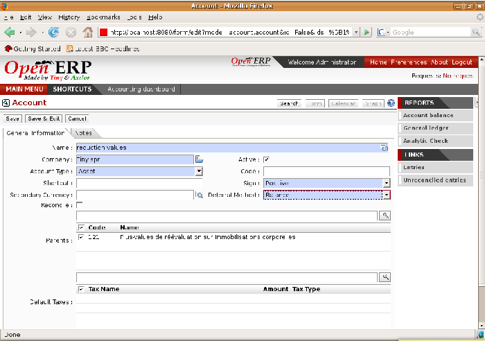

.. i18n: .. index::
.. i18n:    single: accounts; chart
.. i18n:    single: chart of accounts

.. index::
   single: accounts; chart
   single: chart of accounts

.. i18n: Chart of Accounts
.. i18n: =================

Chart of Accounts
=================

.. i18n: .. index::
.. i18n:    single: modules; l10n_
.. i18n:    single: module; l10n_fr

.. index::
   single: modules; l10n_
   single: module; l10n_fr

.. i18n: On installation, the software is given a default chart of accounts that's the same regardless of
.. i18n: your country. To install the chart of accounts and tax definitions for your own country install the
.. i18n: module :mod:`l10n_XX` where XX represents your country code in two letters. For example to get the
.. i18n: chart of accounts for France install the module :mod:`l10n_fr`.

On installation, the software is given a default chart of accounts that's the same regardless of
your country. To install the chart of accounts and tax definitions for your own country install the
module :mod:`l10n_XX` where XX represents your country code in two letters. For example to get the
chart of accounts for France install the module :mod:`l10n_fr`.

.. i18n: Some of these pre-built modules are comprehensive and accurate, others have rather more tentative
.. i18n: status and are simply indicators of the possibilities. You can modify these, or build your own
.. i18n: accounts onto the default chart, or replace it entirely with a custom chart.

Some of these pre-built modules are comprehensive and accurate, others have rather more tentative
status and are simply indicators of the possibilities. You can modify these, or build your own
accounts onto the default chart, or replace it entirely with a custom chart.

.. i18n: You view active charts of accounts using the menu :menuselection:`Financial Management --> Charts
.. i18n: --> Charts of Accounts`, and :guilabel:`Open Charts` for the selected year and account moves.

You view active charts of accounts using the menu :menuselection:`Financial Management --> Charts
--> Charts of Accounts`, and :guilabel:`Open Charts` for the selected year and account moves.

.. i18n: .. note:: Hierarchical charts
.. i18n: 
.. i18n: 	Most accounting software packages represent their charts of accounts in the form of a list. You can
.. i18n: 	do this in Open ERP as well if you want to, but its tree view offers several advantages:
.. i18n: 
.. i18n: 	* it lets you show and calculate only the accounts that interest you,
.. i18n: 
.. i18n: 	* it enables you to get a global view of accounts (when you show only summary accounts),
.. i18n: 
.. i18n: 	* it simplifies searches semantically,
.. i18n: 
.. i18n: 	* it's more intuitive, because you can search for accounts on the basis of their classification,
.. i18n: 
.. i18n: 	* it's flexible because you can easily restructure them.

.. note:: Hierarchical charts

	Most accounting software packages represent their charts of accounts in the form of a list. You can
	do this in Open ERP as well if you want to, but its tree view offers several advantages:

	* it lets you show and calculate only the accounts that interest you,

	* it enables you to get a global view of accounts (when you show only summary accounts),

	* it simplifies searches semantically,

	* it's more intuitive, because you can search for accounts on the basis of their classification,

	* it's flexible because you can easily restructure them.

.. i18n: The structure of the chart of accounts is hierarchical, with account subtotals called account views.
.. i18n: You can develop a set of account views to contain only those elements that interest you.

The structure of the chart of accounts is hierarchical, with account subtotals called account views.
You can develop a set of account views to contain only those elements that interest you.

.. i18n: To get the detail of the account entries that are important to you, all you need to do is click the
.. i18n: account's :guilabel:`Code` (if you have no codes, you can select the line, then click :guilabel:`Switch`
.. i18n: to get the acount definition, then click the :guilabel:`Entries` in the :guilabel:`LINKS` part of the toolbar). 

To get the detail of the account entries that are important to you, all you need to do is click the
account's :guilabel:`Code` (if you have no codes, you can select the line, then click :guilabel:`Switch`
to get the acount definition, then click the :guilabel:`Entries` in the :guilabel:`LINKS` part of the toolbar). 

.. i18n: Displaying the chart of accounts can take several seconds because Open ERP calculates the debits,
.. i18n: credits and balance for each account in real time. If you just want to work with a chart of accounts
.. i18n: that has structure but shows no totals, use the function :menuselection:`Financial Management -->
.. i18n: Charts --> Charts of Accounts --> Fast Charts of Accounts`.

Displaying the chart of accounts can take several seconds because Open ERP calculates the debits,
credits and balance for each account in real time. If you just want to work with a chart of accounts
that has structure but shows no totals, use the function :menuselection:`Financial Management -->
Charts --> Charts of Accounts --> Fast Charts of Accounts`.

.. i18n: Creating a chart of accounts
.. i18n: ----------------------------

Creating a chart of accounts
----------------------------

.. i18n: .. figure::  images/account_form.png
.. i18n:    :scale: 50
.. i18n:    :align: center
.. i18n: 
.. i18n:    *Definition of an account*

   *Definition of an account*

.. i18n: To add, modify or delete existing accounts, use the menu :menuselection:`Financial Management -->
.. i18n: Configuration --> Financial Accounting --> Financial Accounts --> List of Accounts`.

To add, modify or delete existing accounts, use the menu :menuselection:`Financial Management -->
Configuration --> Financial Accounting --> Financial Accounts --> List of Accounts`.

.. i18n: .. index::
.. i18n:    single: multi-lingual

.. index::
   single: multi-lingual

.. i18n: .. tip:: Multi-lingual fields
.. i18n: 
.. i18n: 	In Open ERP multi-lingual fields are marked by a small flag to their right.
.. i18n: 	Click on the flag to get a translation of the value of the field in the different installed
.. i18n: 	languages.
.. i18n: 	You can also edit the translation.
.. i18n: 
.. i18n: 	This enables you to efficiently manage other languages as you need them.
.. i18n: 	The field's value appears in the language of the logged-in user or, in the case of reports printed
.. i18n: 	for a partner, that of the partner.

.. tip:: Multi-lingual fields

	In Open ERP multi-lingual fields are marked by a small flag to their right.
	Click on the flag to get a translation of the value of the field in the different installed
	languages.
	You can also edit the translation.

	This enables you to efficiently manage other languages as you need them.
	The field's value appears in the language of the logged-in user or, in the case of reports printed
	for a partner, that of the partner.

.. i18n: The main account fields are:

The main account fields are:

.. i18n: *  :guilabel:`Name` : the name of the account is a multi-lingual field, which is why there's a
.. i18n:    little flag to the right. Give the field a name.
.. i18n: 
.. i18n: *  :guilabel:`Active` : if you deactivate an account (by unchecking the box) it will no longer be
.. i18n:    visible in the chart of accounts but can be reactivated later. Only accounts which aren't needed for
.. i18n:    account entries can be deactivated.
.. i18n: 
.. i18n: *  :guilabel:`Account Type` : account types determine an account's use in each journal.
.. i18n:    By default the following types are available:
.. i18n:    :guilabel:`View`,:guilabel:`Receivable`, :guilabel:`Payable`, :guilabel:`Income`,
.. i18n:    :guilabel:`Expense`, :guilabel:`Tax`, :guilabel:`Cash`, :guilabel:`Asset`, :guilabel:`Equity`.
.. i18n:    You can add new types through the menu
.. i18n:    :menuselection:`Financial Management -->
.. i18n:    Configuration --> Financial Accounting --> Financial Accounts --> Account Types`.
.. i18n:    Use the :guilabel:`View` type for accounts that make up the structure of the charts and have no
.. i18n:    account data inputs of their own.

*  :guilabel:`Name` : the name of the account is a multi-lingual field, which is why there's a
   little flag to the right. Give the field a name.

*  :guilabel:`Active` : if you deactivate an account (by unchecking the box) it will no longer be
   visible in the chart of accounts but can be reactivated later. Only accounts which aren't needed for
   account entries can be deactivated.

*  :guilabel:`Account Type` : account types determine an account's use in each journal.
   By default the following types are available:
   :guilabel:`View`,:guilabel:`Receivable`, :guilabel:`Payable`, :guilabel:`Income`,
   :guilabel:`Expense`, :guilabel:`Tax`, :guilabel:`Cash`, :guilabel:`Asset`, :guilabel:`Equity`.
   You can add new types through the menu
   :menuselection:`Financial Management -->
   Configuration --> Financial Accounting --> Financial Accounts --> Account Types`.
   Use the :guilabel:`View` type for accounts that make up the structure of the charts and have no
   account data inputs of their own.

.. i18n: .. index::
.. i18n:    pair: account; type

.. index::
   pair: account; type

.. i18n: .. note:: Type of account
.. i18n: 
.. i18n: 	The account types are mainly used as an informative title.
.. i18n: 	The only two types that have any particular effect are :guilabel:`Receivables` and :guilabel:`Payables`.
.. i18n: 
.. i18n: 	These two types are used by reports on partner credits and debits.
.. i18n: 	They're calculated from the list of unreconciled entries in the accounts of one of these two types.

.. note:: Type of account

	The account types are mainly used as an informative title.
	The only two types that have any particular effect are :guilabel:`Receivables` and :guilabel:`Payables`.

	These two types are used by reports on partner credits and debits.
	They're calculated from the list of unreconciled entries in the accounts of one of these two types.

.. i18n: *  :guilabel:`Account Number` : the code length isn't limited to a specific number of digits. Use code 0 for
.. i18n:    all root accounts.
.. i18n: 
.. i18n: *  :guilabel:`Currency` : the default currency for that account.
.. i18n: 
.. i18n: *  :guilabel:`Deferral Method` : determines how to treat the account and its entries at the closing of the
.. i18n:    books at the end of the year. Four methods are available:
.. i18n: 
.. i18n: 	- :guilabel:`Balance` : an entry is generated for the account balance and carried across to the new year
.. i18n: 	  (generally used for bank accounts),
.. i18n: 
.. i18n: 	- :guilabel:`None` : no accounting entries are transferred across to the new financial year (generally for
.. i18n: 	  classes 6 and 7),
.. i18n: 
.. i18n: 	- :guilabel:`Detail` : all entries are kept for the new fiscal year,
.. i18n: 
.. i18n: 	- :guilabel:`Unreconciled` : only unreconciled entries are carried over to the new fiscal year (usually used for
.. i18n: 	  third-party accounts).
.. i18n: 
.. i18n: *  :guilabel:`Reconcile` : determines if you can reconcile the entries in this account. Activate this field
.. i18n:    for partner accounts and for chequing (checking) accounts.
.. i18n: 
.. i18n: *  :guilabel:`Parents` : determines which account is the parent of this one, to create the tree structure of
.. i18n:    the chart of accounts.
.. i18n: 
.. i18n: *  :guilabel:`Default Taxes` : this is the default tax applied to purchases or sales using this account. It
.. i18n:    enables the system to generate tax entries automatically when entering data in a journal manually.

*  :guilabel:`Account Number` : the code length isn't limited to a specific number of digits. Use code 0 for
   all root accounts.

*  :guilabel:`Currency` : the default currency for that account.

*  :guilabel:`Deferral Method` : determines how to treat the account and its entries at the closing of the
   books at the end of the year. Four methods are available:

	- :guilabel:`Balance` : an entry is generated for the account balance and carried across to the new year
	  (generally used for bank accounts),

	- :guilabel:`None` : no accounting entries are transferred across to the new financial year (generally for
	  classes 6 and 7),

	- :guilabel:`Detail` : all entries are kept for the new fiscal year,

	- :guilabel:`Unreconciled` : only unreconciled entries are carried over to the new fiscal year (usually used for
	  third-party accounts).

*  :guilabel:`Reconcile` : determines if you can reconcile the entries in this account. Activate this field
   for partner accounts and for chequing (checking) accounts.

*  :guilabel:`Parents` : determines which account is the parent of this one, to create the tree structure of
   the chart of accounts.

*  :guilabel:`Default Taxes` : this is the default tax applied to purchases or sales using this account. It
   enables the system to generate tax entries automatically when entering data in a journal manually.

.. i18n: The tree structure of the accounts can be altered as often and as much as you wish without
.. i18n: recalculating any of the individual entries. So you can easily restructure your account during the
.. i18n: year to reflect the reality of the company better.

The tree structure of the accounts can be altered as often and as much as you wish without
recalculating any of the individual entries. So you can easily restructure your account during the
year to reflect the reality of the company better.

.. i18n: .. index::
.. i18n:    single: consolidation (accounting)
.. i18n:    pair: chart of accounts; virtual

.. index::
   single: consolidation (accounting)
   pair: chart of accounts; virtual

.. i18n: Using virtual charts of accounts
.. i18n: --------------------------------

Using virtual charts of accounts
--------------------------------

.. i18n: The structure of a chart of accounts is imposed by the legislation in effect in the country of
.. i18n: concern. Unfortunately that structure doesn't always correspond to the view that a company's CEO
.. i18n: needs.

The structure of a chart of accounts is imposed by the legislation in effect in the country of
concern. Unfortunately that structure doesn't always correspond to the view that a company's CEO
needs.

.. i18n: In Open ERP you can use the concept of virtual charts of accounts to manage several different
.. i18n: representations of the same accounts simultaneously. These representations can be shown in real time
.. i18n: with no additional data entry.

In Open ERP you can use the concept of virtual charts of accounts to manage several different
representations of the same accounts simultaneously. These representations can be shown in real time
with no additional data entry.

.. i18n: So your general chart of accounts can be the one imposed by the statutes of your country, and your
.. i18n: CEO can then have other virtual charts as necessary, based on the accounts in the general chart. For
.. i18n: example the CEO can create a view per department, a cash-flow and liquidity view, or consolidated
.. i18n: accounts for different companies.

So your general chart of accounts can be the one imposed by the statutes of your country, and your
CEO can then have other virtual charts as necessary, based on the accounts in the general chart. For
example the CEO can create a view per department, a cash-flow and liquidity view, or consolidated
accounts for different companies.

.. i18n: The most interesting thing about virtual charts of accounts is that they can be used in the same way
.. i18n: as the default chart of accounts for the whole organization. For example you can establish budgets
.. i18n: from your consolidated accounts or from the accounts from one of your companies.

The most interesting thing about virtual charts of accounts is that they can be used in the same way
as the default chart of accounts for the whole organization. For example you can establish budgets
from your consolidated accounts or from the accounts from one of your companies.

.. i18n: .. tip:: Virtual accounts
.. i18n: 
.. i18n: 	Virtual accounts enable you to provide different representations of one or several existing charts
.. i18n: 	of accounts.
.. i18n: 	Creating and restructuring virtual accounts has no impact on the accounting entries.
.. i18n: 	You can then use the virtual charts with no risk of altering the general chart of accounts or
.. i18n: 	future accounting entries.
.. i18n: 
.. i18n: 	Because they're used only to get different representation of the same entries they're very useful
.. i18n: 	for:
.. i18n: 
.. i18n: 	* consolidating several companies in real time,
.. i18n: 
.. i18n: 	* depreciation calculations,
.. i18n: 
.. i18n: 	* cash-flow views,
.. i18n: 
.. i18n: 	* getting more useful views than those imposed by statute,
.. i18n: 
.. i18n: 	* presenting summary charts to other users that are appropriate to their general system rights.
.. i18n: 
.. i18n: 	So there are good reasons for viewing the execution of financial transactions through virtual
.. i18n: 	charts, such as budgets and financial indicators based on special views of the company.

.. tip:: Virtual accounts

	Virtual accounts enable you to provide different representations of one or several existing charts
	of accounts.
	Creating and restructuring virtual accounts has no impact on the accounting entries.
	You can then use the virtual charts with no risk of altering the general chart of accounts or
	future accounting entries.

	Because they're used only to get different representation of the same entries they're very useful
	for:

	* consolidating several companies in real time,

	* depreciation calculations,

	* cash-flow views,

	* getting more useful views than those imposed by statute,

	* presenting summary charts to other users that are appropriate to their general system rights.

	So there are good reasons for viewing the execution of financial transactions through virtual
	charts, such as budgets and financial indicators based on special views of the company.

.. i18n: To create a new chart of accounts you should create a root account using the menu
.. i18n: :menuselection:`Financial Management --> Configuration --> Financial Accounting --> Financial Accounts
.. i18n: --> List of Accounts`. Your top level account should have :guilabel:`Code` \ ``0``\   and :guilabel:`Type` \ ``View``\  . Then
.. i18n: you can choose your structure by creating other accounts of :guilabel:`Type` \ ``View``\   as necessary.
.. i18n: Check your virtual structure using the menu :menuselection:`Financial Management --> Charts -->
.. i18n: Charts of Accounts`.

To create a new chart of accounts you should create a root account using the menu
:menuselection:`Financial Management --> Configuration --> Financial Accounting --> Financial Accounts
--> List of Accounts`. Your top level account should have :guilabel:`Code` \ ``0``\   and :guilabel:`Type` \ ``View``\  . Then
you can choose your structure by creating other accounts of :guilabel:`Type` \ ``View``\   as necessary.
Check your virtual structure using the menu :menuselection:`Financial Management --> Charts -->
Charts of Accounts`.

.. i18n: Finally, when you've got your structure, you must make the general accounts and virtual accounts
.. i18n: match. For that search the general accounts and ensure that each non-\ ``View``\   account there
.. i18n: also has a virtual account in the field :guilabel:`Parents`.

Finally, when you've got your structure, you must make the general accounts and virtual accounts
match. For that search the general accounts and ensure that each non-\ ``View``\   account there
also has a virtual account in the field :guilabel:`Parents`.

.. i18n: You can then check through your general chart of accounts as well as your virtual charts which give
.. i18n: you another representation of the company. All the actions and states in your general account are
.. i18n: also available in the virtual accounts.

You can then check through your general chart of accounts as well as your virtual charts which give
you another representation of the company. All the actions and states in your general account are
also available in the virtual accounts.

.. i18n: Finally you can also make virtual charts of accounts from other virtual charts. That can give an
.. i18n: additional dimension for financial analysis.

Finally you can also make virtual charts of accounts from other virtual charts. That can give an
additional dimension for financial analysis.

.. i18n: .. Copyright © Open Object Press. All rights reserved.

.. Copyright © Open Object Press. All rights reserved.

.. i18n: .. You may take electronic copy of this publication and distribute it if you don't
.. i18n: .. change the content. You can also print a copy to be read by yourself only.

.. You may take electronic copy of this publication and distribute it if you don't
.. change the content. You can also print a copy to be read by yourself only.

.. i18n: .. We have contracts with different publishers in different countries to sell and
.. i18n: .. distribute paper or electronic based versions of this book (translated or not)
.. i18n: .. in bookstores. This helps to distribute and promote the Open ERP product. It
.. i18n: .. also helps us to create incentives to pay contributors and authors using author
.. i18n: .. rights of these sales.

.. We have contracts with different publishers in different countries to sell and
.. distribute paper or electronic based versions of this book (translated or not)
.. in bookstores. This helps to distribute and promote the Open ERP product. It
.. also helps us to create incentives to pay contributors and authors using author
.. rights of these sales.

.. i18n: .. Due to this, grants to translate, modify or sell this book are strictly
.. i18n: .. forbidden, unless Tiny SPRL (representing Open Object Press) gives you a
.. i18n: .. written authorisation for this.

.. Due to this, grants to translate, modify or sell this book are strictly
.. forbidden, unless Tiny SPRL (representing Open Object Press) gives you a
.. written authorisation for this.

.. i18n: .. Many of the designations used by manufacturers and suppliers to distinguish their
.. i18n: .. products are claimed as trademarks. Where those designations appear in this book,
.. i18n: .. and Open Object Press was aware of a trademark claim, the designations have been
.. i18n: .. printed in initial capitals.

.. Many of the designations used by manufacturers and suppliers to distinguish their
.. products are claimed as trademarks. Where those designations appear in this book,
.. and Open Object Press was aware of a trademark claim, the designations have been
.. printed in initial capitals.

.. i18n: .. While every precaution has been taken in the preparation of this book, the publisher
.. i18n: .. and the authors assume no responsibility for errors or omissions, or for damages
.. i18n: .. resulting from the use of the information contained herein.

.. While every precaution has been taken in the preparation of this book, the publisher
.. and the authors assume no responsibility for errors or omissions, or for damages
.. resulting from the use of the information contained herein.

.. i18n: .. Published by Open Object Press, Grand Rosière, Belgium

.. Published by Open Object Press, Grand Rosière, Belgium
