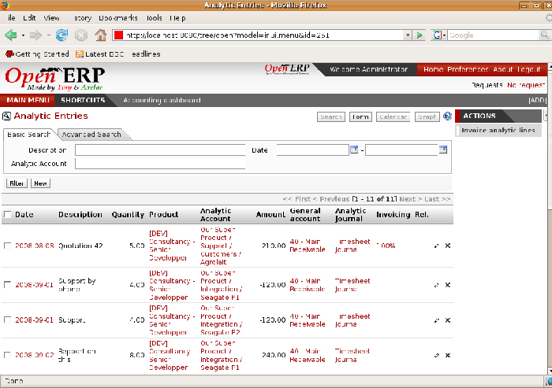

.. i18n: .. index::
.. i18n:    single: analytic; records
.. i18n: ..

.. index::
   single: analytic; records
..

.. i18n: Analytic records
.. i18n: ================

Analytic records
================

.. i18n: Just as in general accounting, analytic entries must belong to an account and an analytic journal.

Just as in general accounting, analytic entries must belong to an account and an analytic journal.

.. i18n: Analytic records can be distinguished from general records by the following characteristics:

Analytic records can be distinguished from general records by the following characteristics:

.. i18n: * they're not necessarily legal accounting documents,
.. i18n: 
.. i18n: * they don't necessarily belong to an existing accounting period,
.. i18n: 
.. i18n: * they're managed according to their date and not an accounting period,
.. i18n: 
.. i18n: * they don't generate both a debit and a credit entry, but a positive amount (income) or a negative
.. i18n:   amount (cost).

* they're not necessarily legal accounting documents,

* they don't necessarily belong to an existing accounting period,

* they're managed according to their date and not an accounting period,

* they don't generate both a debit and a credit entry, but a positive amount (income) or a negative
  amount (cost).

.. i18n: .. _fig-accanmv:
.. i18n: 
.. i18n: .. figure::  images/account_analytic_move.png
.. i18n:    :scale: 50
.. i18n:    :align: center
.. i18n: 
.. i18n:    *Analytic account records for a customer project*

.. _fig-accanmv:

   *Analytic account records for a customer project*

.. i18n: The figure :ref:`fig-accanmv` represents the entries on an analytic account for a customer project.

The figure :ref:`fig-accanmv` represents the entries on an analytic account for a customer project.

.. i18n: You can see there:

You can see there:

.. i18n: * the service costs for staff working on the project,
.. i18n: 
.. i18n: * the costs for reimbursing the expenses of a return journey to the customer,
.. i18n: 
.. i18n: * purchases of goods that have been delivered to the customer,
.. i18n: 
.. i18n: * sales for recharging these costs.

* the service costs for staff working on the project,

* the costs for reimbursing the expenses of a return journey to the customer,

* purchases of goods that have been delivered to the customer,

* sales for recharging these costs.

.. i18n: Automated entries
.. i18n: -----------------

Automated entries
-----------------

.. i18n: Analytic accounting is totally integrated with the other Open ERP modules, so you never have to re-
.. i18n: enter the records. They're automatically generated by the following operations:

Analytic accounting is totally integrated with the other Open ERP modules, so you never have to re-
enter the records. They're automatically generated by the following operations:

.. i18n: * confirmation of an invoice generates analytic entries for sales or purchases connected to the
.. i18n:   account shown in the invoice line,
.. i18n: 
.. i18n: * the entry of a service generates an analytic entry for the cost of this service to the given
.. i18n:   project,
.. i18n: 
.. i18n: * the manufacture of a product generates an entry for the manufacturing cost of each operation in
.. i18n:   the product range.

* confirmation of an invoice generates analytic entries for sales or purchases connected to the
  account shown in the invoice line,

* the entry of a service generates an analytic entry for the cost of this service to the given
  project,

* the manufacture of a product generates an entry for the manufacturing cost of each operation in
  the product range.

.. i18n: Other documents linked to one of these three operations produce analytic records indirectly. For
.. i18n: example, when you're entering a customer sales order you can link it to the customer's analytic
.. i18n: account. When you're managing by case or project, mark the project with that order. This order will
.. i18n: then generate a customer invoice, which will be linked to the analytic account. When the invoice is
.. i18n: validated it will automatically create general and analytic accounting records for the corresponding
.. i18n: project.

Other documents linked to one of these three operations produce analytic records indirectly. For
example, when you're entering a customer sales order you can link it to the customer's analytic
account. When you're managing by case or project, mark the project with that order. This order will
then generate a customer invoice, which will be linked to the analytic account. When the invoice is
validated it will automatically create general and analytic accounting records for the corresponding
project.

.. i18n: Expense receipts from an employee can be linked to an analytic account for reimbursement. When a
.. i18n: receipt is approved by the company, a purchase invoice is created. This invoice represents a debit
.. i18n: on the company in favor of the employee. Each line of the purchase invoice is then linked to an
.. i18n: analytic account which automatically allocates the costs for that receipt to the corresponding
.. i18n: project.

Expense receipts from an employee can be linked to an analytic account for reimbursement. When a
receipt is approved by the company, a purchase invoice is created. This invoice represents a debit
on the company in favor of the employee. Each line of the purchase invoice is then linked to an
analytic account which automatically allocates the costs for that receipt to the corresponding
project.

.. i18n: To visualize the general entries following these different actions you can use one of the following
.. i18n: menus:

To visualize the general entries following these different actions you can use one of the following
menus:

.. i18n: 	#. To see all of the entries, :menuselection:`Financial Management --> Entries Encoding --> Analytic Entries
.. i18n: 	   --> Entries Encoding by Line` and then click :guilabel:`Open Entries`,
.. i18n: 
.. i18n: 	#. To see the entries per account, click the :guilabel:`Analytic Account` field of any of the lines
.. i18n: 	   of Analytic Entries to see the details of that entry, then use the analytic :guilabel:`Account name` to
.. i18n: 	   start a search of all entries with that name (just click the :guilabel:`Date` hyperlink on a line in the web
.. i18n: 	   client, or double-click the line in the GTK client).
.. i18n: 
.. i18n: 	#. To see all of the entries by Journal, :menuselection:`Financial Management --> Entries Encoding -->
.. i18n: 	   Analytic Entries --> Analytic Entries by Journal` and then click on one of the journal names.

	#. To see all of the entries, :menuselection:`Financial Management --> Entries Encoding --> Analytic Entries
	   --> Entries Encoding by Line` and then click :guilabel:`Open Entries`,

	#. To see the entries per account, click the :guilabel:`Analytic Account` field of any of the lines
	   of Analytic Entries to see the details of that entry, then use the analytic :guilabel:`Account name` to
	   start a search of all entries with that name (just click the :guilabel:`Date` hyperlink on a line in the web
	   client, or double-click the line in the GTK client).

	#. To see all of the entries by Journal, :menuselection:`Financial Management --> Entries Encoding -->
	   Analytic Entries --> Analytic Entries by Journal` and then click on one of the journal names.

.. i18n: Manual record entry
.. i18n: -------------------

Manual record entry
-------------------

.. i18n: Even though most analytic entries are produced automatically by the other Open ERP documents it's
.. i18n: sometimes necessary to make manual record entries. It's usually needed for certain analytic
.. i18n: operations that have no counterpart in the general accounts.

Even though most analytic entries are produced automatically by the other Open ERP documents it's
sometimes necessary to make manual record entries. It's usually needed for certain analytic
operations that have no counterpart in the general accounts.

.. i18n: To make manual record entries, use the menu :menuselection:`Financial Management --> Entries Encoding-->
.. i18n: Analytic Entries --> Entries Encoding by Line`.

To make manual record entries, use the menu :menuselection:`Financial Management --> Entries Encoding-->
Analytic Entries --> Entries Encoding by Line`.

.. i18n: .. index::
.. i18n:    single: analytic; entries

.. index::
   single: analytic; entries

.. i18n: .. note:: Analytic entries
.. i18n: 
.. i18n: 	To make an analytic entry, Open ERP asks you to specify a general account.
.. i18n: 	This is given only for information in the different cross-reports.
.. i18n: 	It won't create any new entries in the general accounts.

.. note:: Analytic entries

	To make an analytic entry, Open ERP asks you to specify a general account.
	This is given only for information in the different cross-reports.
	It won't create any new entries in the general accounts.

.. i18n: Select a journal and complete the different fields. Write an expense as a negative amount and income
.. i18n: as a positive amount.

Select a journal and complete the different fields. Write an expense as a negative amount and income
as a positive amount.

.. i18n: .. index::
.. i18n:    pair: cost; allocation

.. index::
   pair: cost; allocation

.. i18n: .. tip::  Entering a date
.. i18n: 
.. i18n: 	To enter a date in the editable list you can use the calendar widget in the web client or, in the
.. i18n: 	GTK client, if you enter just the day of the month Open ERP automatically completes the month and
.. i18n: 	year when you press the tab key (Tab).
.. i18n: 
.. i18n: 	.. note:: Example Cost redistribution
.. i18n: 
.. i18n: 		One of the uses of manual data entry for analytic operations is reallocation of costs. For
.. i18n: 		example, if a development has been done for a given project but can be used again for another
.. i18n: 		project you can reallocate part of the cost to the other project.
.. i18n: 
.. i18n: 		In this case, make a positive entry on the first account and a negative entry for the same
.. i18n: 		amount on the account of the second project.

.. tip::  Entering a date

	To enter a date in the editable list you can use the calendar widget in the web client or, in the
	GTK client, if you enter just the day of the month Open ERP automatically completes the month and
	year when you press the tab key (Tab).

	.. note:: Example Cost redistribution

		One of the uses of manual data entry for analytic operations is reallocation of costs. For
		example, if a development has been done for a given project but can be used again for another
		project you can reallocate part of the cost to the other project.

		In this case, make a positive entry on the first account and a negative entry for the same
		amount on the account of the second project.

.. i18n: .. Copyright © Open Object Press. All rights reserved.

.. Copyright © Open Object Press. All rights reserved.

.. i18n: .. You may take electronic copy of this publication and distribute it if you don't
.. i18n: .. change the content. You can also print a copy to be read by yourself only.

.. You may take electronic copy of this publication and distribute it if you don't
.. change the content. You can also print a copy to be read by yourself only.

.. i18n: .. We have contracts with different publishers in different countries to sell and
.. i18n: .. distribute paper or electronic based versions of this book (translated or not)
.. i18n: .. in bookstores. This helps to distribute and promote the Open ERP product. It
.. i18n: .. also helps us to create incentives to pay contributors and authors using author
.. i18n: .. rights of these sales.

.. We have contracts with different publishers in different countries to sell and
.. distribute paper or electronic based versions of this book (translated or not)
.. in bookstores. This helps to distribute and promote the Open ERP product. It
.. also helps us to create incentives to pay contributors and authors using author
.. rights of these sales.

.. i18n: .. Due to this, grants to translate, modify or sell this book are strictly
.. i18n: .. forbidden, unless Tiny SPRL (representing Open Object Press) gives you a
.. i18n: .. written authorisation for this.

.. Due to this, grants to translate, modify or sell this book are strictly
.. forbidden, unless Tiny SPRL (representing Open Object Press) gives you a
.. written authorisation for this.

.. i18n: .. Many of the designations used by manufacturers and suppliers to distinguish their
.. i18n: .. products are claimed as trademarks. Where those designations appear in this book,
.. i18n: .. and Open Object Press was aware of a trademark claim, the designations have been
.. i18n: .. printed in initial capitals.

.. Many of the designations used by manufacturers and suppliers to distinguish their
.. products are claimed as trademarks. Where those designations appear in this book,
.. and Open Object Press was aware of a trademark claim, the designations have been
.. printed in initial capitals.

.. i18n: .. While every precaution has been taken in the preparation of this book, the publisher
.. i18n: .. and the authors assume no responsibility for errors or omissions, or for damages
.. i18n: .. resulting from the use of the information contained herein.

.. While every precaution has been taken in the preparation of this book, the publisher
.. and the authors assume no responsibility for errors or omissions, or for damages
.. resulting from the use of the information contained herein.

.. i18n: .. Published by Open Object Press, Grand Rosière, Belgium

.. Published by Open Object Press, Grand Rosière, Belgium
