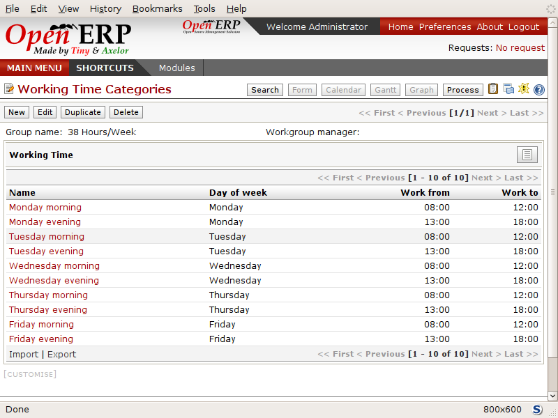
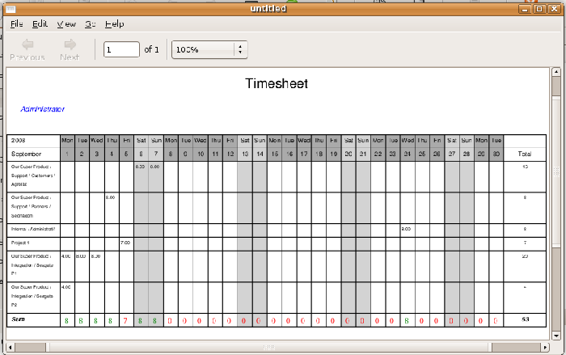
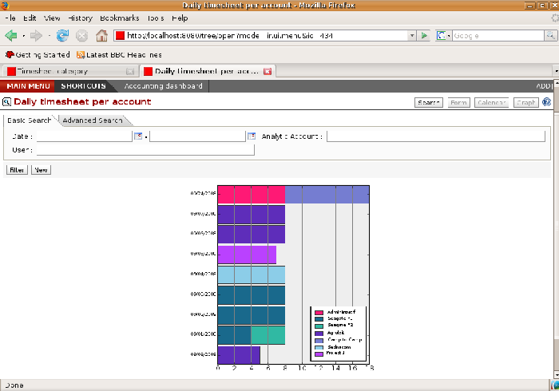
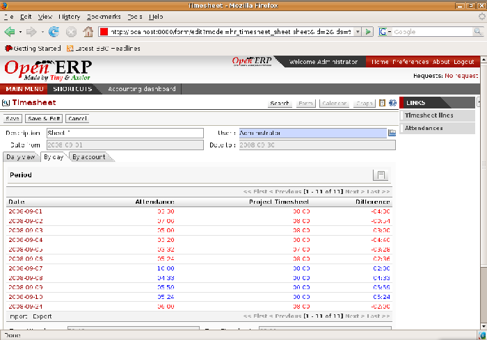

.. i18n: .. index::
.. i18n:    single: timesheet
.. i18n: ..

.. index::
   single: timesheet
..

.. i18n: Timesheets
.. i18n: ==========

Timesheets
==========

.. i18n: In most service companies where Open ERP has been integrated, service sheets, or timesheets, have
.. i18n: revolutionized management practices. These service sheets are produced by each employee as they work
.. i18n: on the different cases or projects that are running. Each of these is represented by an analytic
.. i18n: account in the system.

In most service companies where Open ERP has been integrated, service sheets, or timesheets, have
revolutionized management practices. These service sheets are produced by each employee as they work
on the different cases or projects that are running. Each of these is represented by an analytic
account in the system.

.. i18n: Throughout the day, when employees work on one project or another, they add a line to the timesheets
.. i18n: with details of the time used on each project. At the end of the day, each employee must mark all
.. i18n: the time worked on client or internal projects to make up the full number of hours worked in the
.. i18n: day. If an account isn't in the system then the time is added to the hours that haven't been
.. i18n: assigned for the day.

Throughout the day, when employees work on one project or another, they add a line to the timesheets
with details of the time used on each project. At the end of the day, each employee must mark all
the time worked on client or internal projects to make up the full number of hours worked in the
day. If an account isn't in the system then the time is added to the hours that haven't been
assigned for the day.

.. i18n: .. _fig-servtimlis:
.. i18n: 
.. i18n: .. figure::  images/service_timesheet_list.png
.. i18n:    :scale: 50
.. i18n:    :align: center
.. i18n: 
.. i18n:    *Timesheet for a working day*

.. _fig-servtimlis:

.. figure::  images/service_timesheet_list.png
   :scale: 50
   :align: center

   *Timesheet for a working day*

.. i18n: The figure :ref:`fig-servtimlis` gives an example of a timesheet for an employee.

The figure :ref:`fig-servtimlis` gives an example of a timesheet for an employee.

.. i18n: .. index::
.. i18n:    pair: cost; allocation

.. index::
   pair: cost; allocation

.. i18n: .. note:: Don't confuse timesheets and attendence compliance
.. i18n: 
.. i18n: 	The timesheet system isn't intended to be a disguised attendance form. There's no control over the
.. i18n: 	service times and the employee is free to encode 8 or 9 hours or more of services each day if they
.. i18n: 	want.
.. i18n: 
.. i18n: 	If you decide to put such a system into place, it's important to clarify this point with your
.. i18n: 	staff. The objective here isn't to control hours, because the employees decide for themselves what
.. i18n: 	they'll be entering – but to track the tasks running and the allocation of costs between them.

.. note:: Don't confuse timesheets and attendence compliance

	The timesheet system isn't intended to be a disguised attendance form. There's no control over the
	service times and the employee is free to encode 8 or 9 hours or more of services each day if they
	want.

	If you decide to put such a system into place, it's important to clarify this point with your
	staff. The objective here isn't to control hours, because the employees decide for themselves what
	they'll be entering – but to track the tasks running and the allocation of costs between them.

.. i18n: Amongst the many uses of such a timesheet system for a company, here are some of the most important:

Amongst the many uses of such a timesheet system for a company, here are some of the most important:

.. i18n: * enabling tracking of the true costs of a project by accounting for the time used on it,
.. i18n: 
.. i18n: * tracking the services provided by different employees,
.. i18n: 
.. i18n: * comparing the hours really used on a project with the initial planning estimates,
.. i18n: 
.. i18n: * automatically invoicing based on the service hours provided,
.. i18n: 
.. i18n: * obtaining a list of the service hours for a given client,
.. i18n: 
.. i18n: * knowing the costs needed to run the company, such as the marketing costs, the training costs for a
.. i18n:   new employee, and the invoicing rates for a client.

* enabling tracking of the true costs of a project by accounting for the time used on it,

* tracking the services provided by different employees,

* comparing the hours really used on a project with the initial planning estimates,

* automatically invoicing based on the service hours provided,

* obtaining a list of the service hours for a given client,

* knowing the costs needed to run the company, such as the marketing costs, the training costs for a
  new employee, and the invoicing rates for a client.

.. i18n: Timesheet categories
.. i18n: --------------------

Timesheet categories
--------------------

.. i18n: The different timesheet categories (working time sessions) can be defined in the menu 
.. i18n: :menuselection:`Human Resources --> Configuration --> Working Time Categories` and select 
.. i18n: one of the groups there such as :guilabel:`38 Hours/Week`.

The different timesheet categories (working time sessions) can be defined in the menu 
:menuselection:`Human Resources --> Configuration --> Working Time Categories` and select 
one of the groups there such as :guilabel:`38 Hours/Week`.

.. i18n: .. figure::  images/service_timesheet_def.png
.. i18n:    :scale: 50
.. i18n:    :align: center
.. i18n: 
.. i18n:    *Timesheet category for full time 38 hours per week*

   *Timesheet category for full time 38 hours per week*

.. i18n: .. index::
.. i18n:    single: employee; configuring
.. i18n: ..

.. index::
   single: employee; configuring
..

.. i18n: Employee configuration
.. i18n: ----------------------

Employee configuration
----------------------

.. i18n: To be able to use the timesheets at all, you must first define those employees who are system users.
.. i18n: The employee definition forms contain the information necessary to use that sheet, such as the job
.. i18n: title, and hourly costs.

To be able to use the timesheets at all, you must first define those employees who are system users.
The employee definition forms contain the information necessary to use that sheet, such as the job
title, and hourly costs.

.. i18n: Two fields will be of particular interest to you for managing timesheets: the :guilabel:`Analytic
.. i18n: Journal` and the :guilabel:`Product`.

Two fields will be of particular interest to you for managing timesheets: the :guilabel:`Analytic
Journal` and the :guilabel:`Product`.

.. i18n: In the analytic journal will be stored all the analytic entries about the costs of service times.
.. i18n: These enable you to isolate the cost of service from other company costs such as the purchase of raw
.. i18n: materials, expenses receipts and subcontracting. You can use different journals for each employee to
.. i18n: separate costs by department or by function.

In the analytic journal will be stored all the analytic entries about the costs of service times.
These enable you to isolate the cost of service from other company costs such as the purchase of raw
materials, expenses receipts and subcontracting. You can use different journals for each employee to
separate costs by department or by function.

.. i18n: The employee is also associated with a product in your database in Open ERP. An employee is linked
.. i18n: with a product so they can be 'bought' (subcontracting) or 'invoiced' (project management). You have
.. i18n: to create a product for each job type in your company.

The employee is also associated with a product in your database in Open ERP. An employee is linked
with a product so they can be 'bought' (subcontracting) or 'invoiced' (project management). You have
to create a product for each job type in your company.

.. i18n: The following information is important in the product form:

The following information is important in the product form:

.. i18n: *  :guilabel:`Name` : \ ``Secretary``\  \ ``Salesperson``\  \ ``Project Manager``\
.. i18n: 
.. i18n: *  :guilabel:`Product Type` : \ ``Service``\
.. i18n: 
.. i18n: *  :guilabel:`Unit of Measure` : \ ``Hour``\  \ ``Day``\
.. i18n: 
.. i18n: *  :guilabel:`List Price`
.. i18n: 
.. i18n: *  :guilabel:`Standard Price`

*  :guilabel:`Name` : \ ``Secretary``\  \ ``Salesperson``\  \ ``Project Manager``\

*  :guilabel:`Product Type` : \ ``Service``\

*  :guilabel:`Unit of Measure` : \ ``Hour``\  \ ``Day``\

*  :guilabel:`List Price`

*  :guilabel:`Standard Price`

.. i18n: .. index::
.. i18n:    single: module; product_index

.. index::
   single: module; product_index

.. i18n: .. tip:: Price Indexation
.. i18n: 
.. i18n: 	The module :mod:`product_index` lets you generate indexes connected to the change of purchase or sale
.. i18n: 	price for individual products.
.. i18n: 
.. i18n: 	In human resources, this module can be used to change your prices or costs in step with a national
.. i18n: 	index.

.. tip:: Price Indexation

	The module :mod:`product_index` lets you generate indexes connected to the change of purchase or sale
	price for individual products.

	In human resources, this module can be used to change your prices or costs in step with a national
	index.

.. i18n: In summary, each company employee corresponds, in most cases, to:

In summary, each company employee corresponds, in most cases, to:

.. i18n: *  :guilabel:`Partner`
.. i18n: 
.. i18n: * an :guilabel:`Employee` form,
.. i18n: 
.. i18n: *  :guilabel:`System User`.

*  :guilabel:`Partner`

* an :guilabel:`Employee` form,

*  :guilabel:`System User`.

.. i18n: And each company job position corresponds to a :guilabel:`Product`.

And each company job position corresponds to a :guilabel:`Product`.

.. i18n: .. index::
.. i18n:    single: module; hr_contract

.. index::
   single: module; hr_contract

.. i18n: .. note:: Time charge rates
.. i18n: 
.. i18n: 	By default the hourly cost of an employee is given by the standard cost of the product linked to
.. i18n: 	that employee.
.. i18n: 	But if you install the :mod:`hr_contract` module it's possible to manage contracts differently.
.. i18n: 	The hourly cost of the employee is then automatically calculated from their employment contract
.. i18n: 	when they enter their timesheet data.
.. i18n: 
.. i18n: 	To do this, the software uses a factor defined in the contract type
.. i18n: 	(for example, the gross monthly salary, calculated per day).
.. i18n: 	Ideally this factor should take into account the salary costs, and the taxes, insurances and other
.. i18n: 	overheads associated with pay.

.. note:: Time charge rates

	By default the hourly cost of an employee is given by the standard cost of the product linked to
	that employee.
	But if you install the :mod:`hr_contract` module it's possible to manage contracts differently.
	The hourly cost of the employee is then automatically calculated from their employment contract
	when they enter their timesheet data.

	To do this, the software uses a factor defined in the contract type
	(for example, the gross monthly salary, calculated per day).
	Ideally this factor should take into account the salary costs, and the taxes, insurances and other
	overheads associated with pay.

.. i18n: .. index::
.. i18n:    single: timesheet; entering data
.. i18n: ..

.. index::
   single: timesheet; entering data
..

.. i18n: Entering timesheet data
.. i18n: ------------------------

Entering timesheet data
------------------------

.. i18n: .. index::
.. i18n:    single: module; hr_timesheet

.. index::
   single: module; hr_timesheet

.. i18n: To be able to use timesheets fully, install the module :mod:`hr_timesheet_sheet`. Once this module
.. i18n: has been installed and the employees configured, the different system users can enter their
.. i18n: timesheet data in the menu 
.. i18n: :menuselection:`Human Resources --> Working Hours --> My Working Hours --> My Working Hours of The Day`,
.. i18n: the click :guilabel:`New`.

To be able to use timesheets fully, install the module :mod:`hr_timesheet_sheet`. Once this module
has been installed and the employees configured, the different system users can enter their
timesheet data in the menu 
:menuselection:`Human Resources --> Working Hours --> My Working Hours --> My Working Hours of The Day`,
the click :guilabel:`New`.

.. i18n: .. tip:: Shortcut to timesheets
.. i18n: 
.. i18n: 	It's a good idea if all employees who use timesheets place this menu in their shortcuts.
.. i18n: 	That's because they'll need to return to them several times each day.

.. tip:: Shortcut to timesheets

	It's a good idea if all employees who use timesheets place this menu in their shortcuts.
	That's because they'll need to return to them several times each day.

.. i18n: For a new entry:

For a new entry:

.. i18n: 	#.	The :guilabel:`User` : proposed by default, but you can change it if you're encoding the first timesheet
.. i18n: 		for another company employee.
.. i18n: 
.. i18n: 	#.	The :guilabel:`Date` : automatically proposed as today's date, but it's possible to change it if you're
.. i18n: 		encoding the timesheet for a prior day.
.. i18n: 
.. i18n: 	#.	:guilabel:`Analytic Account` : for the project you've been working on - obviously it should be predefined.
.. i18n: 
.. i18n: 	#. 	:guilabel:`Description` : a free text description of the work done in the time.
.. i18n: 
.. i18n: 	#. 	:guilabel:`Quantity` : number of units of time (the units are defined as part of the product).
.. i18n: 	
.. i18n: The other fields are automatically completed but can be modified: the :guilabel:`Product` 
.. i18n: which is the service product such as consultancy, the
.. i18n: :guilabel:`Unit of Measure` (predefined, and could perhaps be minutes, hours or days), 
.. i18n: the :guilabel:`Cost` of the service (which is calculated by default), 
.. i18n: and the associated :guilabel:`General Account`.

	#.	The :guilabel:`User` : proposed by default, but you can change it if you're encoding the first timesheet
		for another company employee.

	#.	The :guilabel:`Date` : automatically proposed as today's date, but it's possible to change it if you're
		encoding the timesheet for a prior day.

	#.	:guilabel:`Analytic Account` : for the project you've been working on - obviously it should be predefined.

	#. 	:guilabel:`Description` : a free text description of the work done in the time.

	#. 	:guilabel:`Quantity` : number of units of time (the units are defined as part of the product).
	
The other fields are automatically completed but can be modified: the :guilabel:`Product` 
which is the service product such as consultancy, the
:guilabel:`Unit of Measure` (predefined, and could perhaps be minutes, hours or days), 
the :guilabel:`Cost` of the service (which is calculated by default), 
and the associated :guilabel:`General Account`.

.. i18n: The hours are then encoded throughout the day by each employee. It helps to revisit the list at the
.. i18n: end of the day to verify that the number of hours of attendance in the company has been properly
.. i18n: accounted for. The total entered is shown at the bottom right of the list of service hours.

The hours are then encoded throughout the day by each employee. It helps to revisit the list at the
end of the day to verify that the number of hours of attendance in the company has been properly
accounted for. The total entered is shown at the bottom right of the list of service hours.

.. i18n: The accuracy of the services entered is crucial for calculating the profitability of the different
.. i18n: jobs and the recharging of services. Different reports are therefore available for verifying
.. i18n: employees' data entry. Employees can verify their own timesheet using the following reports:

The accuracy of the services entered is crucial for calculating the profitability of the different
jobs and the recharging of services. Different reports are therefore available for verifying
employees' data entry. Employees can verify their own timesheet using the following reports:

.. i18n: * Printing the timesheets per month, using the menu :menuselection:`Human Resources --> Reporting
.. i18n:   --> Timesheet --> Print my timesheet`.
.. i18n: 
.. i18n: * Reviewing all service entries using the menu :menuselection:`Human Resources --> Timesheets
.. i18n:   --> My Timesheets --> My timesheets to confirm`. 
.. i18n:   You can then use the filters to analyze your services by project, by
.. i18n:   period or by product.

* Printing the timesheets per month, using the menu :menuselection:`Human Resources --> Reporting
  --> Timesheet --> Print my timesheet`.

* Reviewing all service entries using the menu :menuselection:`Human Resources --> Timesheets
  --> My Timesheets --> My timesheets to confirm`. 
  You can then use the filters to analyze your services by project, by
  period or by product.

.. i18n: .. tip:: Hiding service costs
.. i18n: 
.. i18n: 	By default, Open ERP is configured to show the cost of each service when an employee encodes the
.. i18n: 	number of hours per project.
.. i18n: 	You can modify this field by adding the attribute invisible=True in the timesheet view.
.. i18n: 	
.. i18n: 	(And the way to do that is either to modify the view on the filesystem, or
.. i18n: 	to use the web client to modify the view in the current database.
.. i18n: 	For the latter, there's a pale grey :guilabel:`[CUSTOMIZE]` label
.. i18n: 	to the bottom left of each form that gives you access to the 
.. i18n: 	:guilabel:`Manage Views` option.
.. i18n: 	If you have sufficient permissions you can edit the XML that defines the current view.)
.. i18n: 
.. i18n: 	The value in the cost field shows employees the cost of their time used in the company, so masking this
.. i18n: 	field might not always be the best option.

.. tip:: Hiding service costs

	By default, Open ERP is configured to show the cost of each service when an employee encodes the
	number of hours per project.
	You can modify this field by adding the attribute invisible=True in the timesheet view.
	
	(And the way to do that is either to modify the view on the filesystem, or
	to use the web client to modify the view in the current database.
	For the latter, there's a pale grey :guilabel:`[CUSTOMIZE]` label
	to the bottom left of each form that gives you access to the 
	:guilabel:`Manage Views` option.
	If you have sufficient permissions you can edit the XML that defines the current view.)

	The value in the cost field shows employees the cost of their time used in the company, so masking this
	field might not always be the best option.

.. i18n: Managers can draw on different reports for managing timesheets quite easily. You can print a summary
.. i18n: in the form of a table per user and per day in the menu :menuselection:`Human Resources -->
.. i18n: Reporting --> Timesheet --> Employees timesheet`. This helps you spot when an employee has
.. i18n: forgotten to enter her timesheet details on a certain day.

Managers can draw on different reports for managing timesheets quite easily. You can print a summary
in the form of a table per user and per day in the menu :menuselection:`Human Resources -->
Reporting --> Timesheet --> Employees timesheet`. This helps you spot when an employee has
forgotten to enter her timesheet details on a certain day.

.. i18n: .. figure::  images/service_timesheet_all.png
.. i18n:    :scale: 50
.. i18n:    :align: center
.. i18n: 
.. i18n:    *Employees' monthly summary timesheet*

   *Employees' monthly summary timesheet*

.. i18n: If you install the module :mod:`report_timesheet` you'll have many more reports available.
.. i18n: Some new graphs become available through the menus 
.. i18n: :menuselection:`Human Resources --> Reporting --> This Month` and 
.. i18n: :menuselection:`Human Resources --> Reporting --> All Months`, for example:

If you install the module :mod:`report_timesheet` you'll have many more reports available.
Some new graphs become available through the menus 
:menuselection:`Human Resources --> Reporting --> This Month` and 
:menuselection:`Human Resources --> Reporting --> All Months`, for example:

.. i18n: *  :guilabel:`Timesheet by User`
.. i18n: 
.. i18n: *  :guilabel:`Timesheet by Invoice`
.. i18n: 
.. i18n: *  :guilabel:`Daily Timesheet by Account`
.. i18n: 
.. i18n: *  :guilabel:`Timesheet by Account`

*  :guilabel:`Timesheet by User`

*  :guilabel:`Timesheet by Invoice`

*  :guilabel:`Daily Timesheet by Account`

*  :guilabel:`Timesheet by Account`

.. i18n: .. figure::  images/service_timesheet_graph.png
.. i18n:    :scale: 50
.. i18n:    :align: center
.. i18n: 
.. i18n:    *Chart of timesheet by account*

   *Chart of timesheet by account*

.. i18n: The data making up these graphs can be varied using the filters available in the upper part of the
.. i18n: screen. If you want to see more detail, switch to the list view.

The data making up these graphs can be varied using the filters available in the upper part of the
screen. If you want to see more detail, switch to the list view.

.. i18n: .. note:: Project dashboard when signing in
.. i18n: 
.. i18n: 	The dashboard for managing projects has a graphical view that summarizes the current user's
.. i18n: 	timesheet for the last seven days.
.. i18n: 
.. i18n: 	you can assign a dashboard to users so that it appears when they sign into Open ERP.
.. i18n: 	Then each employee will be able to see if they forgot to complete their timesheet next time
.. i18n: 	they sign into the system.
.. i18n: 	
.. i18n: 	.. index::
.. i18n: 	   single: module; board_project	
.. i18n: 
.. i18n: 	To use this dashboard, install the module :mod:`board_project`.

.. note:: Project dashboard when signing in

	The dashboard for managing projects has a graphical view that summarizes the current user's
	timesheet for the last seven days.

	you can assign a dashboard to users so that it appears when they sign into Open ERP.
	Then each employee will be able to see if they forgot to complete their timesheet next time
	they sign into the system.
	
	.. index::
	   single: module; board_project	

	To use this dashboard, install the module :mod:`board_project`.

.. i18n: .. index::
.. i18n:    single: timesheets; evaluation
.. i18n: ..

.. index::
   single: timesheets; evaluation
..

.. i18n: Evaluation of service costs
.. i18n: ---------------------------

Evaluation of service costs
---------------------------

.. i18n: You already know that timesheets are closely linked with analytic accounts. The different projects
.. i18n: reported on the timesheets correspond to analytic accounts. The timesheet entries themselves are
.. i18n: analytic entries. 

You already know that timesheets are closely linked with analytic accounts. The different projects
reported on the timesheets correspond to analytic accounts. The timesheet entries themselves are
analytic entries. 

.. i18n: These entries comprise various analytic operations that don't correspond to any of
.. i18n: the general accounts. Therefore all operations that modify and create timesheet lines automatically
.. i18n: impact the corresponding analytic line and, conversely are automatically modified by changes in that
.. i18n: line.

These entries comprise various analytic operations that don't correspond to any of
the general accounts. Therefore all operations that modify and create timesheet lines automatically
impact the corresponding analytic line and, conversely are automatically modified by changes in that
line.

.. i18n: .. note:: Timesheets and analytical data
.. i18n: 
.. i18n: 	The implementation of timesheets in Open ERP relating to analytic entries is managed by an
.. i18n: 	inheritance mechanism:
.. i18n: 	the timesheet object inherits the analytic entry object.
.. i18n: 
.. i18n: 	The information is therefore not encoded into the database as two separate events, which avoids
.. i18n: 	many synchronization problems.
.. i18n: 	They are stored in two different tables, however, because a service is an analytical entry, but an
.. i18n: 	analytical entry isn't necessarily a service.

.. note:: Timesheets and analytical data

	The implementation of timesheets in Open ERP relating to analytic entries is managed by an
	inheritance mechanism:
	the timesheet object inherits the analytic entry object.

	The information is therefore not encoded into the database as two separate events, which avoids
	many synchronization problems.
	They are stored in two different tables, however, because a service is an analytical entry, but an
	analytical entry isn't necessarily a service.

.. i18n: This isn't a classical approach but it's logical and pragmatic. Employee timesheets are a good
.. i18n: indication of how the costs of a service enterprise are spread across different cases as reported in
.. i18n: the analytic accounts.

This isn't a classical approach but it's logical and pragmatic. Employee timesheets are a good
indication of how the costs of a service enterprise are spread across different cases as reported in
the analytic accounts.

.. i18n: .. index::
.. i18n:    single: benefits
.. i18n:    
.. i18n: An analytic account should be reflected in the general accounts, but there's no direct counterpart
.. i18n: of these analytic accounts in the general accounts. Instead, if the hourly costs of the employees
.. i18n: are correctly accounted for, the month's timesheet entries should be balanced by the salary +
.. i18n: benefits package paid out to all the employees at the end of the month.

.. index::
   single: benefits
   
An analytic account should be reflected in the general accounts, but there's no direct counterpart
of these analytic accounts in the general accounts. Instead, if the hourly costs of the employees
are correctly accounted for, the month's timesheet entries should be balanced by the salary +
benefits package paid out to all the employees at the end of the month.

.. i18n: Despite all this it's quite difficult to work out the average hourly cost of an employee precisely
.. i18n: because it depends on:

Despite all this it's quite difficult to work out the average hourly cost of an employee precisely
because it depends on:

.. i18n: * the extra hours that they've worked,
.. i18n: 
.. i18n: * holidays and sickness,
.. i18n: 
.. i18n: * salary variations and all the linked costs, such as social insurance charges.

* the extra hours that they've worked,

* holidays and sickness,

* salary variations and all the linked costs, such as social insurance charges.

.. i18n: The reports that enable you to relate general accounts to analytic accounts are valuable tools for
.. i18n: improving your evaluation of different hourly costs of employees. The difference between product
.. i18n: balances in the analytic account and in the general accounts, divided by the total number of hours
.. i18n: worked, can then be applied to the cost of the product. Some companies adjust for that difference by
.. i18n: carrying out another analytic operation at the end of the month in an account created for that
.. i18n: purpose. This analytic account should have a balance that tends towards zero.

The reports that enable you to relate general accounts to analytic accounts are valuable tools for
improving your evaluation of different hourly costs of employees. The difference between product
balances in the analytic account and in the general accounts, divided by the total number of hours
worked, can then be applied to the cost of the product. Some companies adjust for that difference by
carrying out another analytic operation at the end of the month in an account created for that
purpose. This analytic account should have a balance that tends towards zero.

.. i18n: Because you've got a system with integrated timesheets you can then:

Because you've got a system with integrated timesheets you can then:

.. i18n: * track the profitability of projects in the analytic accounts,
.. i18n: 
.. i18n: * look at the history of timesheet entries by project and by employee,
.. i18n: 
.. i18n: * regularly adjust hourly costs by comparing your rates with reality,

* track the profitability of projects in the analytic accounts,

* look at the history of timesheet entries by project and by employee,

* regularly adjust hourly costs by comparing your rates with reality,

.. i18n: .. important:: Project Cost Control
.. i18n: 
.. i18n: 	Controlling the costs and the profitability of projects precisely is very important.
.. i18n: 
.. i18n: 	It enables you to make good estimates and to track budgets allocated to different services and
.. i18n: 	their projects, such as sales and, R&D costs.
.. i18n: 	You can also refine your arguments on the basis of clear facts rather than guesses if you have
.. i18n: 	to renegotiate a contract with a customer following a project slippage.

.. important:: Project Cost Control

	Controlling the costs and the profitability of projects precisely is very important.

	It enables you to make good estimates and to track budgets allocated to different services and
	their projects, such as sales and, R&D costs.
	You can also refine your arguments on the basis of clear facts rather than guesses if you have
	to renegotiate a contract with a customer following a project slippage.

.. i18n: The analyses of profitability by project and by employee are available from the analytic accounts.
.. i18n: They take all of the invoices into account, and also take into account the cost of the time spent on
.. i18n: each project.

The analyses of profitability by project and by employee are available from the analytic accounts.
They take all of the invoices into account, and also take into account the cost of the time spent on
each project.

.. i18n: .. index:: department

.. index:: department

.. i18n: Managing by department
.. i18n: ----------------------

Managing by department
----------------------

.. i18n: When they're used properly, timesheets can be a good control tool for project managers and can
.. i18n: provide awareness of costs and times.

When they're used properly, timesheets can be a good control tool for project managers and can
provide awareness of costs and times.

.. i18n: When employee teams are important, a control system must be implemented. All employees should
.. i18n: complete their timesheets correctly because this forms the basis of planning control, and the
.. i18n: financial management and invoicing of projects

When employee teams are important, a control system must be implemented. All employees should
complete their timesheets correctly because this forms the basis of planning control, and the
financial management and invoicing of projects

.. i18n: You'll see in :ref:`ch-services` that you can automatically invoice services at the end of
.. i18n: the month based on the timesheet. But at the same time some contracts are limited to prepaid hours.
.. i18n: These hours and their deduction from the original limit are also managed by these timesheets.

You'll see in :ref:`ch-services` that you can automatically invoice services at the end of
the month based on the timesheet. But at the same time some contracts are limited to prepaid hours.
These hours and their deduction from the original limit are also managed by these timesheets.

.. i18n: .. index::
.. i18n:    single: module; hr_timesheet_sheet

.. index::
   single: module; hr_timesheet_sheet

.. i18n: In such a situation, hours that aren't coded into the timesheets represent lost money for the
.. i18n: company. So it's important to establish effective follow-up of the services timesheets and their
.. i18n: encoding. To set up a structure for control using timesheets you should install the module 
.. i18n: :mod:`hr_timesheet_sheet`.

In such a situation, hours that aren't coded into the timesheets represent lost money for the
company. So it's important to establish effective follow-up of the services timesheets and their
encoding. To set up a structure for control using timesheets you should install the module 
:mod:`hr_timesheet_sheet`.

.. i18n: .. figure::  images/timesheet_flow.png
.. i18n:    :scale: 50
.. i18n:    :align: center
.. i18n: 
.. i18n:    *Process of approving a timesheet*

.. figure::  images/timesheet_flow.png
   :scale: 50
   :align: center

   *Process of approving a timesheet*

.. i18n: This module supplies a new screen enabling you to manage timesheets by period. Timesheet entries are
.. i18n: made by employees each day. At the end of the week, employees validate their week's sheet and it's
.. i18n: then passed to the services manager, who must approve his team's entries. Periods are defined in the
.. i18n: company forms, and you can set them to run monthly or weekly.

This module supplies a new screen enabling you to manage timesheets by period. Timesheet entries are
made by employees each day. At the end of the week, employees validate their week's sheet and it's
then passed to the services manager, who must approve his team's entries. Periods are defined in the
company forms, and you can set them to run monthly or weekly.

.. i18n: To enter timesheet data each employee uses the menu :menuselection:`Human Resources --> Timesheets
.. i18n: --> My Timesheets --> My Current Timesheet`.

To enter timesheet data each employee uses the menu :menuselection:`Human Resources --> Timesheets
--> My Timesheets --> My Current Timesheet`.

.. i18n: .. figure::  images/service_timesheet_sheet_form.png
.. i18n:    :scale: 50
.. i18n:    :align: center
.. i18n: 
.. i18n:    *Form for entering timesheet data*

.. figure::  images/service_timesheet_sheet_form.png
   :scale: 50
   :align: center

   *Form for entering timesheet data*

.. i18n: In the upper part of the screen the user starts with the sign-in and sign-out times. The system
.. i18n: enables the control of attendance day by day. The two buttons Sign in and Sign out enable the
.. i18n: automatic completion of hours in the area to the left. These hours can be modified by employee, so
.. i18n: it's not a true management control system.

In the upper part of the screen the user starts with the sign-in and sign-out times. The system
enables the control of attendance day by day. The two buttons Sign in and Sign out enable the
automatic completion of hours in the area to the left. These hours can be modified by employee, so
it's not a true management control system.

.. i18n: The area to the bottom of the screen represents a sheet of the employee's time entries for the
.. i18n: selected day. In total, this should comprise the number of hours worked in the company each day.
.. i18n: This provides a simple verification that the whole day's attendance time has been coded in properly.

The area to the bottom of the screen represents a sheet of the employee's time entries for the
selected day. In total, this should comprise the number of hours worked in the company each day.
This provides a simple verification that the whole day's attendance time has been coded in properly.

.. i18n: The second tab of the timesheet :guilabel:`By day` gives the number of hours worked on the different
.. i18n: projects. When there's a gap between the attendance and the timesheet entries, you can use the
.. i18n: second tab to detect the days or the entries that haven't been correctly coded in.

The second tab of the timesheet :guilabel:`By day` gives the number of hours worked on the different
projects. When there's a gap between the attendance and the timesheet entries, you can use the
second tab to detect the days or the entries that haven't been correctly coded in.

.. i18n: .. figure::  images/timesheet_sheet_hours.png
.. i18n:    :scale: 50
.. i18n:    :align: center
.. i18n: 
.. i18n:    *Detail of hours worked by day for an employee*

   *Detail of hours worked by day for an employee*

.. i18n: The third tab :guilabel:`By account` shows the time worked on all the different projects. That enables you
.. i18n: to step back to see an overview of the time an employee has worked spread over different projects.

The third tab :guilabel:`By account` shows the time worked on all the different projects. That enables you
to step back to see an overview of the time an employee has worked spread over different projects.

.. i18n: At the end of the week or the month, the employee confirms his timesheet. If the attendance time in
.. i18n: the company corresponds to the encoded entries, the whole timesheet is then confirmed and sent to
.. i18n: his department manager, who is then responsible for approving it or asking for corrections.

At the end of the week or the month, the employee confirms his timesheet. If the attendance time in
the company corresponds to the encoded entries, the whole timesheet is then confirmed and sent to
his department manager, who is then responsible for approving it or asking for corrections.

.. i18n: Each manager can then look at a list of his department's timesheets waiting for approval using the
.. i18n: menu :menuselection:`Human Resource --> Timesheets --> My Department's Timesheets --> Timesheets to
.. i18n: validate`. He then has to approve them or return them to their initial state.

Each manager can then look at a list of his department's timesheets waiting for approval using the
menu :menuselection:`Human Resource --> Timesheets --> My Department's Timesheets --> Timesheets to
validate`. He then has to approve them or return them to their initial state.

.. i18n: To define the departmental structure, use the menu :menuselection:`Administration --> Users -->
.. i18n: Departments --> Departments`.

To define the departmental structure, use the menu :menuselection:`Administration --> Users -->
Departments --> Departments`.

.. i18n: .. tip:: Timesheet approval
.. i18n: 
.. i18n: 	At first sight, the approval of timesheets by a department manager can seem a bureaucratic
.. i18n: 	hindrance.
.. i18n: 	This operation is crucial for effective management, however.
.. i18n: 	We have too frequently seen companies in the situation where managers are so overworked that they
.. i18n: 	don't know what their employees are doing.
.. i18n: 
.. i18n: 	So this approval process supplies the manager with an outline of each employee's work at least once
.. i18n: 	a week.
.. i18n: 	And this is carried out for the hours worked on all the different projects.

.. tip:: Timesheet approval

	At first sight, the approval of timesheets by a department manager can seem a bureaucratic
	hindrance.
	This operation is crucial for effective management, however.
	We have too frequently seen companies in the situation where managers are so overworked that they
	don't know what their employees are doing.

	So this approval process supplies the manager with an outline of each employee's work at least once
	a week.
	And this is carried out for the hours worked on all the different projects.

.. i18n: Once the timesheets have been approved you can then use them for cost control and for invoicing
.. i18n: hours to clients.

Once the timesheets have been approved you can then use them for cost control and for invoicing
hours to clients.

.. i18n: Contracts and their rates, planning, and methods of invoicing are the object of the following
.. i18n: chapter, :ref:`ch-services`.

Contracts and their rates, planning, and methods of invoicing are the object of the following
chapter, :ref:`ch-services`.

.. i18n: .. Copyright © Open Object Press. All rights reserved.

.. Copyright © Open Object Press. All rights reserved.

.. i18n: .. You may take electronic copy of this publication and distribute it if you don't
.. i18n: .. change the content. You can also print a copy to be read by yourself only.

.. You may take electronic copy of this publication and distribute it if you don't
.. change the content. You can also print a copy to be read by yourself only.

.. i18n: .. We have contracts with different publishers in different countries to sell and
.. i18n: .. distribute paper or electronic based versions of this book (translated or not)
.. i18n: .. in bookstores. This helps to distribute and promote the Open ERP product. It
.. i18n: .. also helps us to create incentives to pay contributors and authors using author
.. i18n: .. rights of these sales.

.. We have contracts with different publishers in different countries to sell and
.. distribute paper or electronic based versions of this book (translated or not)
.. in bookstores. This helps to distribute and promote the Open ERP product. It
.. also helps us to create incentives to pay contributors and authors using author
.. rights of these sales.

.. i18n: .. Due to this, grants to translate, modify or sell this book are strictly
.. i18n: .. forbidden, unless Tiny SPRL (representing Open Object Press) gives you a
.. i18n: .. written authorisation for this.

.. Due to this, grants to translate, modify or sell this book are strictly
.. forbidden, unless Tiny SPRL (representing Open Object Press) gives you a
.. written authorisation for this.

.. i18n: .. Many of the designations used by manufacturers and suppliers to distinguish their
.. i18n: .. products are claimed as trademarks. Where those designations appear in this book,
.. i18n: .. and Open Object Press was aware of a trademark claim, the designations have been
.. i18n: .. printed in initial capitals.

.. Many of the designations used by manufacturers and suppliers to distinguish their
.. products are claimed as trademarks. Where those designations appear in this book,
.. and Open Object Press was aware of a trademark claim, the designations have been
.. printed in initial capitals.

.. i18n: .. While every precaution has been taken in the preparation of this book, the publisher
.. i18n: .. and the authors assume no responsibility for errors or omissions, or for damages
.. i18n: .. resulting from the use of the information contained herein.

.. While every precaution has been taken in the preparation of this book, the publisher
.. and the authors assume no responsibility for errors or omissions, or for damages
.. resulting from the use of the information contained herein.

.. i18n: .. Published by Open Object Press, Grand Rosière, Belgium

.. Published by Open Object Press, Grand Rosière, Belgium
