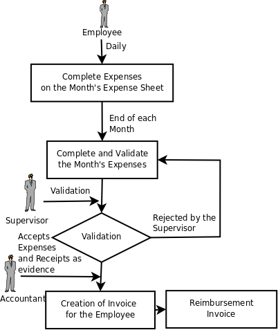

.. i18n: Treatment of expenses
.. i18n: =====================

Treatment of expenses
=====================

.. i18n: Employee expenses are charges incurred on behalf of the company. The company then reimburses these
.. i18n: expenses to the employee. The receipts encountered most frequently are:

Employee expenses are charges incurred on behalf of the company. The company then reimburses these
expenses to the employee. The receipts encountered most frequently are:

.. i18n: * car travel, reimbursed per unit of distance (mile or kilometer),
.. i18n: 
.. i18n: * subsistence expenses, reimbursed based on the bill,
.. i18n: 
.. i18n: * other purchases, such as stationery and books, destined for the company but carried out by the
.. i18n:   employee.

* car travel, reimbursed per unit of distance (mile or kilometer),

* subsistence expenses, reimbursed based on the bill,

* other purchases, such as stationery and books, destined for the company but carried out by the
  employee.

.. i18n: An integrated process
.. i18n: ---------------------

An integrated process
---------------------

.. i18n: .. figure::  images/service_expense_workflow.png
.. i18n:    :scale: 50
.. i18n:    :align: center
.. i18n: 
.. i18n:    *Process for dealing with expense reimbursements*

   *Process for dealing with expense reimbursements*

.. i18n: Expenses generated by employees are grouped into periods of a week or a month. At the end of the
.. i18n: period the employee confirms all of her expenses and a summary sheet is sent to the department
.. i18n: manager. The manager is responsible for approving all the expense requests generated by his team.
.. i18n: The expenses sheet must be signed by the employee, who also attaches her receipts there.

Expenses generated by employees are grouped into periods of a week or a month. At the end of the
period the employee confirms all of her expenses and a summary sheet is sent to the department
manager. The manager is responsible for approving all the expense requests generated by his team.
The expenses sheet must be signed by the employee, who also attaches her receipts there.

.. i18n: Once the sheet has been approved by the head of department it is sent to accounts, who register the
.. i18n: company's liability to the employee. Accounting can then pay this invoice and reimburse the employee
.. i18n: who originally advanced the money.

Once the sheet has been approved by the head of department it is sent to accounts, who register the
company's liability to the employee. Accounting can then pay this invoice and reimburse the employee
who originally advanced the money.

.. i18n: Some receipts are for project expenses, so these can then be attached to an analytic account. The
.. i18n: costs incurred are then added to the supplementary cost of the analytic account when the invoice is
.. i18n: approved.

Some receipts are for project expenses, so these can then be attached to an analytic account. The
costs incurred are then added to the supplementary cost of the analytic account when the invoice is
approved.

.. i18n: You often need to invoice expenses to a client, depending on the precise contract that's been
.. i18n: negotiated. Travelling and subsistence expenses are generally handled this way. These can be
.. i18n: recharged to the client at the the end of the month if the contract price has been negotiated plus
.. i18n: expenses.

You often need to invoice expenses to a client, depending on the precise contract that's been
negotiated. Travelling and subsistence expenses are generally handled this way. These can be
recharged to the client at the the end of the month if the contract price has been negotiated plus
expenses.

.. i18n: If you have to go through many steps to reclaim expenses, it can all quickly become too cumbersome,
.. i18n: especially for those employees who claim large numbers of different expense lines. If you've got a
.. i18n: good system that integrates the management of these claims, such as the one described, you can avoid
.. i18n: many problems and subtly increase staff productivity.

If you have to go through many steps to reclaim expenses, it can all quickly become too cumbersome,
especially for those employees who claim large numbers of different expense lines. If you've got a
good system that integrates the management of these claims, such as the one described, you can avoid
many problems and subtly increase staff productivity.

.. i18n: If your systems handle expenses well then you can avoid significant losses by setting your terms of
.. i18n: sale effectively. In fixed-price contracts, expense reimbursements are usually invoiced according to
.. i18n: the actual expense. It's in your interests to systematize their treatment, and automate the process
.. i18n: to the maximum, to recharge as much as you are contractually able.

If your systems handle expenses well then you can avoid significant losses by setting your terms of
sale effectively. In fixed-price contracts, expense reimbursements are usually invoiced according to
the actual expense. It's in your interests to systematize their treatment, and automate the process
to the maximum, to recharge as much as you are contractually able.

.. i18n: Claiming expenses
.. i18n: -----------------

Claiming expenses
-----------------

.. i18n: .. index::
.. i18n:    single: module; hr_expense

.. index::
   single: module; hr_expense

.. i18n: Install the module :mod:`hr_expense` to automate the management of expense claims. Users can then
.. i18n: enter their expenses using the menu :menuselection:`Human Resources --> Expenses --> New Expenses Sheet`
.. i18n: and review them using menus in :menuselection:`Human Resources --> Expenses --> My Expenses`.

Install the module :mod:`hr_expense` to automate the management of expense claims. Users can then
enter their expenses using the menu :menuselection:`Human Resources --> Expenses --> New Expenses Sheet`
and review them using menus in :menuselection:`Human Resources --> Expenses --> My Expenses`.

.. i18n: Templates for the various expenses accepted by the company must previously have been created using Open ERP's
.. i18n: product form. You could, for example, create a product with the following parameters for the
.. i18n: reimbursement of travel expenses by car at 0.25 per kilometer:

Templates for the various expenses accepted by the company must previously have been created using Open ERP's
product form. You could, for example, create a product with the following parameters for the
reimbursement of travel expenses by car at 0.25 per kilometer:

.. i18n: *  :guilabel:`Product` : \ ``Car travel``\  ,
.. i18n: 
.. i18n: *  :guilabel:`Unit of measure` : \ ``km``\  ,
.. i18n: 
.. i18n: *  :guilabel:`Standard Cost` : \ ``0.25``\  ,
.. i18n: 
.. i18n: *  :guilabel:`Sale price` : \ ``0.30``\  ,
.. i18n: 
.. i18n: *  :guilabel:`Type of product` : \ ``Service``\  .

*  :guilabel:`Product` : \ ``Car travel``\  ,

*  :guilabel:`Unit of measure` : \ ``km``\  ,

*  :guilabel:`Standard Cost` : \ ``0.25``\  ,

*  :guilabel:`Sale price` : \ ``0.30``\  ,

*  :guilabel:`Type of product` : \ ``Service``\  .

.. i18n: The employee keeps her expenses sheet in the \ ``Draft``\   state while completing it throughout the
.. i18n: period. At the end of the period (week or month) she can confirm her expense form using the
.. i18n: :guilabel:`Confirm` button on the form. This puts it into the state \ ``Waiting for validation``\  .

The employee keeps her expenses sheet in the \ ``Draft``\   state while completing it throughout the
period. At the end of the period (week or month) she can confirm her expense form using the
:guilabel:`Confirm` button on the form. This puts it into the state \ ``Waiting for validation``\  .

.. i18n: At the end of the period the department manager can access the list of expense forms waiting for
.. i18n: approval using the menu :menuselection:`Human Resources --> Expenses --> All expenses --> Expenses
.. i18n: waiting validation`.

At the end of the period the department manager can access the list of expense forms waiting for
approval using the menu :menuselection:`Human Resources --> Expenses --> All expenses --> Expenses
waiting validation`.

.. i18n: .. tip:: Role Management
.. i18n: 
.. i18n: 	You must assign the role :guilabel:`Human Resources – Expenses` to a user to enable that user to approve
.. i18n: 	these expenses.
.. i18n: 	You'd generally assign this role only to those people responsible for projects or departments.
.. i18n: 
.. i18n: 	You can also assign the role :guilabel:`Human Resources – Invoicing Expenses` to users responsible for
.. i18n: 	creating invoices.
.. i18n: 	These roles may overlap (so the same person who approves your accounting group's expenses may also
.. i18n: 	be responsible for creating invoices).
.. i18n: 
.. i18n: 	To find out more about the management of roles look at :ref:`ch-config`.

.. tip:: Role Management

	You must assign the role :guilabel:`Human Resources – Expenses` to a user to enable that user to approve
	these expenses.
	You'd generally assign this role only to those people responsible for projects or departments.

	You can also assign the role :guilabel:`Human Resources – Invoicing Expenses` to users responsible for
	creating invoices.
	These roles may overlap (so the same person who approves your accounting group's expenses may also
	be responsible for creating invoices).

	To find out more about the management of roles look at :ref:`ch-config`.

.. i18n: The department manager can then approve the expenses, which automatically creates a supplier invoice
.. i18n: in the employee's name so that the employee can be reimbursed. An analytic account is coded onto
.. i18n: each line of the invoice. When the invoice is confirmed, general and analytic accounting entries are
.. i18n: automatically generated as they would be with any other invoice.

The department manager can then approve the expenses, which automatically creates a supplier invoice
in the employee's name so that the employee can be reimbursed. An analytic account is coded onto
each line of the invoice. When the invoice is confirmed, general and analytic accounting entries are
automatically generated as they would be with any other invoice.

.. i18n: If you establish your invoicing on the basis of service time or analytic costs, the expense will
.. i18n: automatically be recharged to the client when the client invoice is generated for services
.. i18n: associated with the project.

If you establish your invoicing on the basis of service time or analytic costs, the expense will
automatically be recharged to the client when the client invoice is generated for services
associated with the project.

.. i18n: Invoicing from timesheets lets you prepare your invoices all within the one integrated system - all
.. i18n: the expenses and timesheets for a project's client.

Invoicing from timesheets lets you prepare your invoices all within the one integrated system - all
the expenses and timesheets for a project's client.

.. i18n: .. Copyright © Open Object Press. All rights reserved.

.. Copyright © Open Object Press. All rights reserved.

.. i18n: .. You may take electronic copy of this publication and distribute it if you don't
.. i18n: .. change the content. You can also print a copy to be read by yourself only.

.. You may take electronic copy of this publication and distribute it if you don't
.. change the content. You can also print a copy to be read by yourself only.

.. i18n: .. We have contracts with different publishers in different countries to sell and
.. i18n: .. distribute paper or electronic based versions of this book (translated or not)
.. i18n: .. in bookstores. This helps to distribute and promote the Open ERP product. It
.. i18n: .. also helps us to create incentives to pay contributors and authors using author
.. i18n: .. rights of these sales.

.. We have contracts with different publishers in different countries to sell and
.. distribute paper or electronic based versions of this book (translated or not)
.. in bookstores. This helps to distribute and promote the Open ERP product. It
.. also helps us to create incentives to pay contributors and authors using author
.. rights of these sales.

.. i18n: .. Due to this, grants to translate, modify or sell this book are strictly
.. i18n: .. forbidden, unless Tiny SPRL (representing Open Object Press) gives you a
.. i18n: .. written authorisation for this.

.. Due to this, grants to translate, modify or sell this book are strictly
.. forbidden, unless Tiny SPRL (representing Open Object Press) gives you a
.. written authorisation for this.

.. i18n: .. Many of the designations used by manufacturers and suppliers to distinguish their
.. i18n: .. products are claimed as trademarks. Where those designations appear in this book,
.. i18n: .. and Open Object Press was aware of a trademark claim, the designations have been
.. i18n: .. printed in initial capitals.

.. Many of the designations used by manufacturers and suppliers to distinguish their
.. products are claimed as trademarks. Where those designations appear in this book,
.. and Open Object Press was aware of a trademark claim, the designations have been
.. printed in initial capitals.

.. i18n: .. While every precaution has been taken in the preparation of this book, the publisher
.. i18n: .. and the authors assume no responsibility for errors or omissions, or for damages
.. i18n: .. resulting from the use of the information contained herein.

.. While every precaution has been taken in the preparation of this book, the publisher
.. and the authors assume no responsibility for errors or omissions, or for damages
.. resulting from the use of the information contained herein.

.. i18n: .. Published by Open Object Press, Grand Rosière, Belgium

.. Published by Open Object Press, Grand Rosière, Belgium
