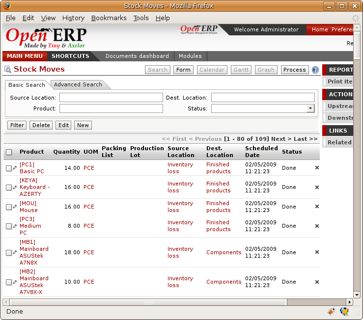
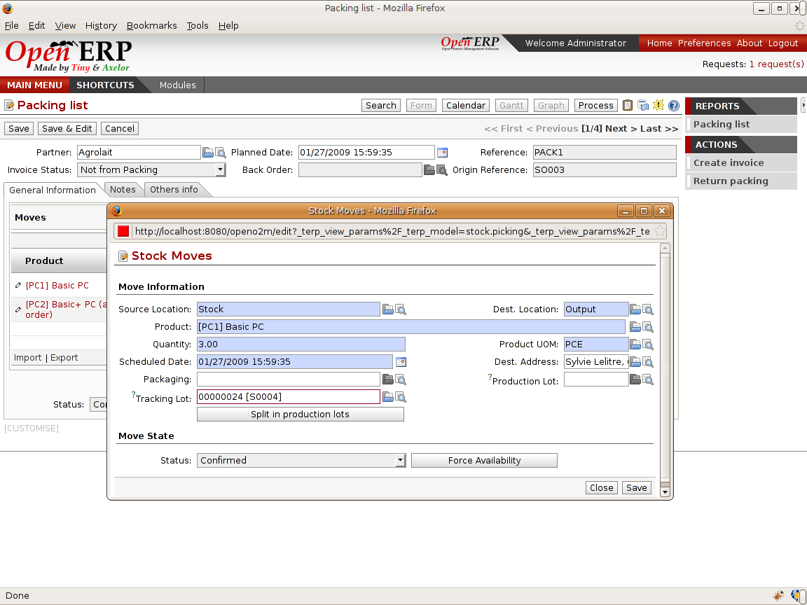

.. i18n: .. _sect-lotmgt:
.. i18n: 
.. i18n: Management of lots and traceability
.. i18n: ===================================

.. _sect-lotmgt:

Management of lots and traceability
===================================

.. i18n: The double-entry management in Open ERP enables you to run very advanced traceability. All
.. i18n: operations are formalized in terms of stock moves, so it's very simple to search for the cause of any
.. i18n: gaps in stock moves.

The double-entry management in Open ERP enables you to run very advanced traceability. All
operations are formalized in terms of stock moves, so it's very simple to search for the cause of any
gaps in stock moves.

.. i18n: .. index::
.. i18n:    single: traceability; upstream
.. i18n:    single: traceability; downstream

.. index::
   single: traceability; upstream
   single: traceability; downstream

.. i18n: .. note:: Upstream and downstream traceability
.. i18n: 
.. i18n:     **Upstream** traceability runs from the raw materials received from the supplier and follows the
.. i18n:     chain to the finished products delivered to customers.
.. i18n:     (Note that the name is confusing - this would often be considered a downstream direction.
.. i18n:     Think of it as **Where Used**.) 
.. i18n: 
.. i18n:     **Downstream** traceability follows the product in the other direction, from customer to the
.. i18n:     different suppliers of raw material.
.. i18n:     (Note that the name is confusing - this would often be considered an upstream direction.
.. i18n:     Think of it as **Where Supplied**.) 

.. note:: Upstream and downstream traceability

    **Upstream** traceability runs from the raw materials received from the supplier and follows the
    chain to the finished products delivered to customers.
    (Note that the name is confusing - this would often be considered a downstream direction.
    Think of it as **Where Used**.) 

    **Downstream** traceability follows the product in the other direction, from customer to the
    different suppliers of raw material.
    (Note that the name is confusing - this would often be considered an upstream direction.
    Think of it as **Where Supplied**.) 

.. i18n: Stock Moves
.. i18n: -----------

Stock Moves
-----------

.. i18n: Use the menu :menuselection:`Stock Management --> Traceability --> Low Level --> Stock Moves`
.. i18n: to track past stock transactions for a product or a given location. All the operations
.. i18n: are available. You can filter on the various fields to retrieve the operations about an order,
.. i18n: or a production activity, or a source location, or any given destination.

Use the menu :menuselection:`Stock Management --> Traceability --> Low Level --> Stock Moves`
to track past stock transactions for a product or a given location. All the operations
are available. You can filter on the various fields to retrieve the operations about an order,
or a production activity, or a source location, or any given destination.

.. i18n: .. figure:: images/stock_move_tree.png
.. i18n:    :scale: 75
.. i18n:    :align: center
.. i18n: 
.. i18n:    *History of stock movements*

   *History of stock movements*

.. i18n: Each stock move is in a given state. The different possible states are:

Each stock move is in a given state. The different possible states are:

.. i18n: * ``Draft`` : the move has so far had no effect in the system. The transaction hasn't yet been confirmed,
.. i18n: 
.. i18n: * ``Confirmed`` : the move will be done, so it will be counted in the calculations of virtual stock. But
.. i18n:   you don't know whether it will be done without problem because the products have been reserved for
.. i18n:   the move,
.. i18n: 
.. i18n: * ``Validated`` : the move will be done and the necessary raw material have been reserved for the
.. i18n:   transaction,
.. i18n: 
.. i18n: * ``Done`` : the stock move has been done, and entered into the calculations of real stock,
.. i18n: 
.. i18n: * ``Waiting`` : in the case of transactions ``From Order`` , this state shows that the stock move is blocked
.. i18n:   waiting for the end of another move,
.. i18n: 
.. i18n: * ``Cancelled`` : the stock move wasn't carried out, so there's no accounting for it in either real stock or
.. i18n:   virtual stock.

* ``Draft`` : the move has so far had no effect in the system. The transaction hasn't yet been confirmed,

* ``Confirmed`` : the move will be done, so it will be counted in the calculations of virtual stock. But
  you don't know whether it will be done without problem because the products have been reserved for
  the move,

* ``Validated`` : the move will be done and the necessary raw material have been reserved for the
  transaction,

* ``Done`` : the stock move has been done, and entered into the calculations of real stock,

* ``Waiting`` : in the case of transactions ``From Order`` , this state shows that the stock move is blocked
  waiting for the end of another move,

* ``Cancelled`` : the stock move wasn't carried out, so there's no accounting for it in either real stock or
  virtual stock.

.. i18n: Delivery orders, goods receipts and internal picking lists are just documents that group a set of
.. i18n: stock moves. You can also consult the history of these documents using the menu
.. i18n: :menuselection:`Stock Management --> Traceability --> Low level --> Packing`.

Delivery orders, goods receipts and internal picking lists are just documents that group a set of
stock moves. You can also consult the history of these documents using the menu
:menuselection:`Stock Management --> Traceability --> Low level --> Packing`.

.. i18n: Lots
.. i18n: ----

Lots
----

.. i18n: Open ERP can also manage product lots. Two lot types are defined:

Open ERP can also manage product lots. Two lot types are defined:

.. i18n: * Production lots (batch numbers) are represented by a unique product or an assembly of identical
.. i18n:   products leaving the same production area. They are usually identified by bar codes stuck on the
.. i18n:   products. The batch can be marked with a supplier number or your own company numbers.
.. i18n: 
.. i18n: * Tracking numbers are logistical lots for identifying the container for a set of
.. i18n:   products. This corresponds, for example, to the pallet numbers on which several different products
.. i18n:   are stocked.

* Production lots (batch numbers) are represented by a unique product or an assembly of identical
  products leaving the same production area. They are usually identified by bar codes stuck on the
  products. The batch can be marked with a supplier number or your own company numbers.

* Tracking numbers are logistical lots for identifying the container for a set of
  products. This corresponds, for example, to the pallet numbers on which several different products
  are stocked.

.. i18n: These lots can be encoded onto all stock moves and, specifically, on goods-in lines, internal moves
.. i18n: and product deliveries.

These lots can be encoded onto all stock moves and, specifically, on goods-in lines, internal moves
and product deliveries.

.. i18n: .. figure:: images/picking_form_line.png
.. i18n:    :scale: 75
.. i18n:    :align: center
.. i18n: 
.. i18n:    *Entering a line for production receipt*

   *Entering a line for production receipt*

.. i18n: To enter the lot number in an operation you can use an existing lot number or create a new lot. A
.. i18n: production lot (batch number) is used for a single product. A tracking number can be
.. i18n: used several times for different products, so you can mix different products on a pallet or in a box.

To enter the lot number in an operation you can use an existing lot number or create a new lot. A
production lot (batch number) is used for a single product. A tracking number can be
used several times for different products, so you can mix different products on a pallet or in a box.

.. i18n: .. note:: Simplified View
.. i18n: 
.. i18n:     In the ``Simplified View`` the tracking numbers can't be seen: the field is hidden.
.. i18n:     To get to ``Extended View`` mode, assign the group 
.. i18n:     :guilabel:`Usability – Extended View` to the current user.

.. note:: Simplified View

    In the ``Simplified View`` the tracking numbers can't be seen: the field is hidden.
    To get to ``Extended View`` mode, assign the group 
    :guilabel:`Usability – Extended View` to the current user.

.. i18n: You can also specify on the product form the operations in which a lot number is
.. i18n: required. You can then compel the user to set a lot number for manufacturing operations, goods
.. i18n: receipt, or customer packing.

You can also specify on the product form the operations in which a lot number is
required. You can then compel the user to set a lot number for manufacturing operations, goods
receipt, or customer packing.

.. i18n: You don't have to encode the lot number one by one to assign a unique lot number to a set of several items. 
.. i18n: You only need to take a stock move for several products line and click the button
.. i18n: :guilabel:`Split in Production Lots`. You can then give a lot number prefix (if you want) and Open ERP will
.. i18n: complete the prefix in the wizard with a continuing sequence number. This sequence number
.. i18n: might correspond to a set of pre-printed barcodes that you stick on each product.

You don't have to encode the lot number one by one to assign a unique lot number to a set of several items. 
You only need to take a stock move for several products line and click the button
:guilabel:`Split in Production Lots`. You can then give a lot number prefix (if you want) and Open ERP will
complete the prefix in the wizard with a continuing sequence number. This sequence number
might correspond to a set of pre-printed barcodes that you stick on each product.

.. i18n: .. figure:: images/picking_split_lot.png
.. i18n:    :scale: 75
.. i18n:    :align: center
.. i18n: 
.. i18n:    *Splitting a lot into uniquely identified parts*

.. figure:: images/picking_split_lot.png
   :scale: 75
   :align: center

   *Splitting a lot into uniquely identified parts*

.. i18n: .. index:: traceability (stock)

.. index:: traceability (stock)

.. i18n: Traceability
.. i18n: ------------

Traceability
------------

.. i18n: If you code in the lot numbers for stock moves as described above you can then investigate the traceability of any
.. i18n: given lot number. To do this use the menu :menuselection:`Stock Management --> Traceability -->
.. i18n: Production Lots`, or :menuselection:`Stock Management --> Traceability --> Tracking Lots`.

If you code in the lot numbers for stock moves as described above you can then investigate the traceability of any
given lot number. To do this use the menu :menuselection:`Stock Management --> Traceability -->
Production Lots`, or :menuselection:`Stock Management --> Traceability --> Tracking Lots`.

.. i18n: .. tip:: Product Shortcuts
.. i18n: 
.. i18n:     From the product form, the toolbar to the right offers useful information:
.. i18n: 
.. i18n:     * :guilabel:`Minimum stock rules`,
.. i18n: 
.. i18n:     * :guilabel:`Stocks by location`,
.. i18n: 
.. i18n:     * :guilabel:`Sales detail`,
.. i18n: 
.. i18n:     * :guilabel:`Stocks by lot`,
.. i18n: 
.. i18n:     * :guilabel:`Bills of Materials`.

.. tip:: Product Shortcuts

    From the product form, the toolbar to the right offers useful information:

    * :guilabel:`Minimum stock rules`,

    * :guilabel:`Stocks by location`,

    * :guilabel:`Sales detail`,

    * :guilabel:`Stocks by lot`,

    * :guilabel:`Bills of Materials`.

.. i18n: Search for a particular lot using the filters for the lot number, the date or the product. Once you
.. i18n: can see the form about this lot several actions are possible:

Search for a particular lot using the filters for the lot number, the date or the product. Once you
can see the form about this lot several actions are possible:

.. i18n: * :guilabel:`Traceability upstream` : from supplier through to customers,
.. i18n: 
.. i18n: * :guilabel:`Traceability downstream` : from customer back to suppliers,
.. i18n: 
.. i18n: * Stock in all the physical and virtual locations.

* :guilabel:`Traceability upstream` : from supplier through to customers,

* :guilabel:`Traceability downstream` : from customer back to suppliers,

* Stock in all the physical and virtual locations.

.. i18n: .. figure:: images/stock_traceability_upstream.png
.. i18n:    :scale: 75
.. i18n:    :align: center
.. i18n: 
.. i18n:    *Tracing upstream in Make to Order*

.. figure:: images/stock_traceability_upstream.png
   :scale: 75
   :align: center

   *Tracing upstream in Make to Order*

.. i18n: .. figure:: images/stock_traceability_downstream.png
.. i18n:    :scale: 75
.. i18n:    :align: center
.. i18n: 
.. i18n:    *Tracing downstream in Make to Stock*

.. figure:: images/stock_traceability_downstream.png
   :scale: 75
   :align: center

   *Tracing downstream in Make to Stock*

.. i18n: Finally, on a lot, you can enter data on all the operations that have been done on the product. That
.. i18n: forms a useful history of the pre-sales operations.

Finally, on a lot, you can enter data on all the operations that have been done on the product. That
forms a useful history of the pre-sales operations.

.. i18n: .. Copyright © Open Object Press. All rights reserved.

.. Copyright © Open Object Press. All rights reserved.

.. i18n: .. You may take electronic copy of this publication and distribute it if you don't
.. i18n: .. change the content. You can also print a copy to be read by yourself only.

.. You may take electronic copy of this publication and distribute it if you don't
.. change the content. You can also print a copy to be read by yourself only.

.. i18n: .. We have contracts with different publishers in different countries to sell and
.. i18n: .. distribute paper or electronic based versions of this book (translated or not)
.. i18n: .. in bookstores. This helps to distribute and promote the Open ERP product. It
.. i18n: .. also helps us to create incentives to pay contributors and authors using author
.. i18n: .. rights of these sales.

.. We have contracts with different publishers in different countries to sell and
.. distribute paper or electronic based versions of this book (translated or not)
.. in bookstores. This helps to distribute and promote the Open ERP product. It
.. also helps us to create incentives to pay contributors and authors using author
.. rights of these sales.

.. i18n: .. Due to this, grants to translate, modify or sell this book are strictly
.. i18n: .. forbidden, unless Tiny SPRL (representing Open Object Press) gives you a
.. i18n: .. written authorisation for this.

.. Due to this, grants to translate, modify or sell this book are strictly
.. forbidden, unless Tiny SPRL (representing Open Object Press) gives you a
.. written authorisation for this.

.. i18n: .. Many of the designations used by manufacturers and suppliers to distinguish their
.. i18n: .. products are claimed as trademarks. Where those designations appear in this book,
.. i18n: .. and Open Object Press was aware of a trademark claim, the designations have been
.. i18n: .. printed in initial capitals.

.. Many of the designations used by manufacturers and suppliers to distinguish their
.. products are claimed as trademarks. Where those designations appear in this book,
.. and Open Object Press was aware of a trademark claim, the designations have been
.. printed in initial capitals.

.. i18n: .. While every precaution has been taken in the preparation of this book, the publisher
.. i18n: .. and the authors assume no responsibility for errors or omissions, or for damages
.. i18n: .. resulting from the use of the information contained herein.

.. While every precaution has been taken in the preparation of this book, the publisher
.. and the authors assume no responsibility for errors or omissions, or for damages
.. resulting from the use of the information contained herein.

.. i18n: .. Published by Open Object Press, Grand Rosière, Belgium

.. Published by Open Object Press, Grand Rosière, Belgium
