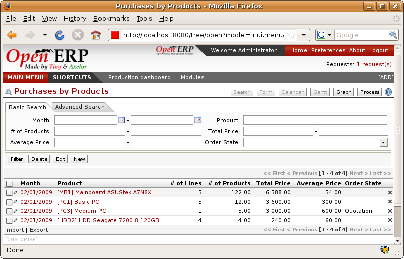

.. i18n: Analyis of purchases
.. i18n: ====================

Analyis of purchases
====================

.. i18n: Elementary statistics
.. i18n: ---------------------

Elementary statistics
---------------------

.. i18n: .. index::
.. i18n:    single: module; report_purchase
.. i18n:    single: module; product_margin

.. index::
   single: module; report_purchase
   single: module; product_margin

.. i18n: To get statistics about your purchases you can install the modules :mod:`report_purchase` and
.. i18n: :mod:`product_margin`.

To get statistics about your purchases you can install the modules :mod:`report_purchase` and
:mod:`product_margin`.

.. i18n: The first, :mod:`report_purchase`, will add two new reports in your purchase menu, analysis of
.. i18n: purchases by month and by product, and analysing product by month and by product category. To use
.. i18n: these reports use the menu :menuselection:`Purchase Management --> Reporting --> This month -->
.. i18n: Purchases by product`.

The first, :mod:`report_purchase`, will add two new reports in your purchase menu, analysis of
purchases by month and by product, and analysing product by month and by product category. To use
these reports use the menu :menuselection:`Purchase Management --> Reporting --> This month -->
Purchases by product`.

.. i18n: .. figure:: images/purchase_report.png
.. i18n:    :scale: 75
.. i18n:    :align: center
.. i18n: 
.. i18n:    *Analysis of purchases over the month by product*

   *Analysis of purchases over the month by product*

.. i18n: This analysis is carried out on supplier orders and not on invoices or the quantities actually
.. i18n: received. To get an analysis by product, use the module :mod:`product_margin`. The function of this
.. i18n: module is described in detail in the chapter :ref:`ch-sales`.

This analysis is carried out on supplier orders and not on invoices or the quantities actually
received. To get an analysis by product, use the module :mod:`product_margin`. The function of this
module is described in detail in the chapter :ref:`ch-sales`.

.. i18n: To analyze the received quantities, you can use the statistical modules in Stock Management.

To analyze the received quantities, you can use the statistical modules in Stock Management.

.. i18n: .. Copyright © Open Object Press. All rights reserved.

.. Copyright © Open Object Press. All rights reserved.

.. i18n: .. You may take electronic copy of this publication and distribute it if you don't
.. i18n: .. change the content. You can also print a copy to be read by yourself only.

.. You may take electronic copy of this publication and distribute it if you don't
.. change the content. You can also print a copy to be read by yourself only.

.. i18n: .. We have contracts with different publishers in different countries to sell and
.. i18n: .. distribute paper or electronic based versions of this book (translated or not)
.. i18n: .. in bookstores. This helps to distribute and promote the Open ERP product. It
.. i18n: .. also helps us to create incentives to pay contributors and authors using author
.. i18n: .. rights of these sales.

.. We have contracts with different publishers in different countries to sell and
.. distribute paper or electronic based versions of this book (translated or not)
.. in bookstores. This helps to distribute and promote the Open ERP product. It
.. also helps us to create incentives to pay contributors and authors using author
.. rights of these sales.

.. i18n: .. Due to this, grants to translate, modify or sell this book are strictly
.. i18n: .. forbidden, unless Tiny SPRL (representing Open Object Press) gives you a
.. i18n: .. written authorisation for this.

.. Due to this, grants to translate, modify or sell this book are strictly
.. forbidden, unless Tiny SPRL (representing Open Object Press) gives you a
.. written authorisation for this.

.. i18n: .. Many of the designations used by manufacturers and suppliers to distinguish their
.. i18n: .. products are claimed as trademarks. Where those designations appear in this book,
.. i18n: .. and Open Object Press was aware of a trademark claim, the designations have been
.. i18n: .. printed in initial capitals.

.. Many of the designations used by manufacturers and suppliers to distinguish their
.. products are claimed as trademarks. Where those designations appear in this book,
.. and Open Object Press was aware of a trademark claim, the designations have been
.. printed in initial capitals.

.. i18n: .. While every precaution has been taken in the preparation of this book, the publisher
.. i18n: .. and the authors assume no responsibility for errors or omissions, or for damages
.. i18n: .. resulting from the use of the information contained herein.

.. While every precaution has been taken in the preparation of this book, the publisher
.. and the authors assume no responsibility for errors or omissions, or for damages
.. resulting from the use of the information contained herein.

.. i18n: .. Published by Open Object Press, Grand Rosière, Belgium

.. Published by Open Object Press, Grand Rosière, Belgium
