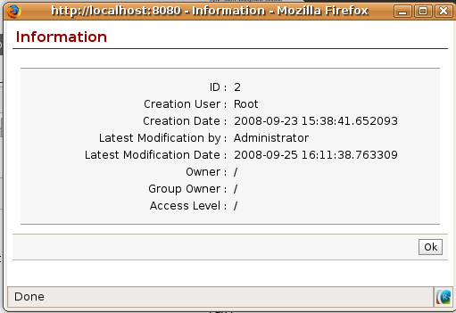

.. i18n: .. index::
.. i18n:    single: access rights
.. i18n:    single: access; user

.. index::
   single: access rights
   single: access; user

.. i18n: User Login
.. i18n: ==========

User Login
==========

.. i18n: .. tip:: Managing Passwords
.. i18n: 
.. i18n:    If you let users change their passwords for themselves you'll have no direct control over the
.. i18n:    password they choose.
.. i18n:    You should have a written policy about password strength to try to maintain a level of security in
.. i18n:    your system.

.. tip:: Managing Passwords

   If you let users change their passwords for themselves you'll have no direct control over the
   password they choose.
   You should have a written policy about password strength to try to maintain a level of security in
   your system.

.. i18n: .. index::
.. i18n:    single: module; users_ldap

.. index::
   single: module; users_ldap

.. i18n: .. tip:: Managing users through LDAP
.. i18n: 
.. i18n: 	With the :mod:`users_ldap` module, user accounts can be managed through an LDAP directory that can be
.. i18n: 	made common to various different company resources.
.. i18n: 
.. i18n: 	Connection parameters for the LDAP directory are then registered with the company definition.
.. i18n: 	You can provide a user profile template there from which new users are automatically created during
.. i18n: 	their first connection to Open ERP.

.. tip:: Managing users through LDAP

	With the :mod:`users_ldap` module, user accounts can be managed through an LDAP directory that can be
	made common to various different company resources.

	Connection parameters for the LDAP directory are then registered with the company definition.
	You can provide a user profile template there from which new users are automatically created during
	their first connection to Open ERP.

.. i18n: .. index::
.. i18n:    single: LDAP

.. index::
   single: LDAP

.. i18n: .. note:: LDAP
.. i18n: 
.. i18n: 	The LDAP protocol (Lightweight Directory Access Protocol) enables you to manage common directories
.. i18n: 	for various different resources through your standard TCP/IP network.
.. i18n: 
.. i18n: 	This enables users in the company to have the same username and password to access all
.. i18n: 	their applications (such as email and intranet).

.. note:: LDAP

	The LDAP protocol (Lightweight Directory Access Protocol) enables you to manage common directories
	for various different resources through your standard TCP/IP network.

	This enables users in the company to have the same username and password to access all
	their applications (such as email and intranet).

.. i18n: Managing access rights
.. i18n: ======================

Managing access rights
======================

.. i18n: One of the most important areas in configuring Open ERP is how to manage access rights to the
.. i18n: information in it.

One of the most important areas in configuring Open ERP is how to manage access rights to the
information in it.

.. i18n: You're planning to put everything significant to your business into the system, but most of your
.. i18n: staff need see only part of it, and may need to change even less of it. Who should have rights to
.. i18n: what, and how do you manage that?

You're planning to put everything significant to your business into the system, but most of your
staff need see only part of it, and may need to change even less of it. Who should have rights to
what, and how do you manage that?

.. i18n: Open ERP's approach to rights management is highly flexible. Each user can belong to one or more
.. i18n: groups, and the group(s) you belong to determine(s):

Open ERP's approach to rights management is highly flexible. Each user can belong to one or more
groups, and the group(s) you belong to determine(s):

.. i18n: * the visibility of each menu item and
.. i18n: 
.. i18n: * the accessibility of each table in the database.

* the visibility of each menu item and

* the accessibility of each table in the database.

.. i18n: For example, the group \ ``Stock``\ may only be given access to some of the menus in 
.. i18n: :menuselection:`Stock Management`, and may have no access to any of the accounting information. Each system user who works in
.. i18n: Stores is given membership of the ``Stock`` group. If some users also work elsewhere, they'd also be
.. i18n: given membership of other groups.

For example, the group \ ``Stock``\ may only be given access to some of the menus in 
:menuselection:`Stock Management`, and may have no access to any of the accounting information. Each system user who works in
Stores is given membership of the ``Stock`` group. If some users also work elsewhere, they'd also be
given membership of other groups.

.. i18n: Open ERP users can also belong to various roles. Just as group gives a user access rights, each
.. i18n: role determines the user's duties. This is managed at the level of workflows, which form the
.. i18n: company's business processes.

Open ERP users can also belong to various roles. Just as group gives a user access rights, each
role determines the user's duties. This is managed at the level of workflows, which form the
company's business processes.

.. i18n: .. index:: 
.. i18n:    pair: user; group

.. index:: 
   pair: user; group

.. i18n: Groups and Users
.. i18n: ================

Groups and Users
================

.. i18n: To configure access rights you'd start by defining the groups. It's important for the groups to
.. i18n: be representative of your company's job functions rather than of its individual employees.

To configure access rights you'd start by defining the groups. It's important for the groups to
be representative of your company's job functions rather than of its individual employees.

.. i18n: So if your finance director is also your sales director, you should create both a Finance Director
.. i18n: group and a Sales Director group, even though they're both the same person, and would both be
.. i18n: assigned to this user in practice. This gives you flexibility for the future.

So if your finance director is also your sales director, you should create both a Finance Director
group and a Sales Director group, even though they're both the same person, and would both be
assigned to this user in practice. This gives you flexibility for the future.

.. i18n: You should also create groups within a departmental areas that have different levels of access
.. i18n: rights. For example, if you create a \ ``Sales Director``\ group and a \ ``Sales``\  group avoid
.. i18n: assigning exactly the same rights to each group. The first could see all the of reports, while the
.. i18n: second could be restricted to seeing quotations. You could either make the \ ``Sales Director``\ a
.. i18n: member of both groups, and give the Sales Director group a limited set of extra rights, or give the
.. i18n: \ ``Sales Director``\ group all the rights it needs for a Sales Director to belong only to this one
.. i18n: group. You should choose the scheme that gives you most flexibility and then stick with it to
.. i18n: maintain consistency.

You should also create groups within a departmental areas that have different levels of access
rights. For example, if you create a \ ``Sales Director``\ group and a \ ``Sales``\  group avoid
assigning exactly the same rights to each group. The first could see all the of reports, while the
second could be restricted to seeing quotations. You could either make the \ ``Sales Director``\ a
member of both groups, and give the Sales Director group a limited set of extra rights, or give the
\ ``Sales Director``\ group all the rights it needs for a Sales Director to belong only to this one
group. You should choose the scheme that gives you most flexibility and then stick with it to
maintain consistency.

.. i18n: .. index::
.. i18n:    pair:  system; administrator

.. index::
   pair:  system; administrator

.. i18n: .. tip:: Flexibility in managing access
.. i18n: 
.. i18n: 	To give yourself flexibility, you can ensure that a trusted staff member
.. i18n: 	(perhaps a director or someone in accounts, or even the system administrator) is given wide rights
.. i18n: 	to use the system,
.. i18n: 	and is authorized by the management to carry out specific tasks for people.

.. tip:: Flexibility in managing access

	To give yourself flexibility, you can ensure that a trusted staff member
	(perhaps a director or someone in accounts, or even the system administrator) is given wide rights
	to use the system,
	and is authorized by the management to carry out specific tasks for people.

.. i18n: .. index::
.. i18n:    single: access; menu

.. index::
   single: access; menu

.. i18n: Access rights for menus
.. i18n: -----------------------

Access rights for menus
-----------------------

.. i18n: To get a feel for rights management in Open ERP you'll create a new \ ``Stock1``\  group, with
.. i18n: access to the *Stock Management* menu items. You'll then create a stores person user who's a member
.. i18n: of the \ ``Stock1``\  group.

To get a feel for rights management in Open ERP you'll create a new \ ``Stock1``\  group, with
access to the *Stock Management* menu items. You'll then create a stores person user who's a member
of the \ ``Stock1``\  group.

.. i18n: To create a new group, use the menu :menuselection:`Administration --> Users --> Groups`. Enter the
.. i18n: group name Stock1.

To create a new group, use the menu :menuselection:`Administration --> Users --> Groups`. Enter the
group name Stock1.

.. i18n: Then to create a new user linked to this, use :menuselection:`Administration --> Users --> Users` to
.. i18n: enter the following:

Then to create a new user linked to this, use :menuselection:`Administration --> Users --> Users` to
enter the following:

.. i18n: *  :guilabel:`Name` : \ ``Stores Person``\  ,
.. i18n: 
.. i18n: *  :guilabel:`Username` : \ ``stores``\  ,
.. i18n: 
.. i18n: *  :guilabel:`Password` : \ ``stores``\  ,
.. i18n: 
.. i18n: *  :guilabel:`Company` : \ ``<your company>``\  ,
.. i18n: 
.. i18n: *  :guilabel:`Action` : \ ``Menu``\  ,
.. i18n: 
.. i18n: *  :guilabel:`Menu Action` : \ ``Menu``\  .

*  :guilabel:`Name` : \ ``Stores Person``\  ,

*  :guilabel:`Username` : \ ``stores``\  ,

*  :guilabel:`Password` : \ ``stores``\  ,

*  :guilabel:`Company` : \ ``<your company>``\  ,

*  :guilabel:`Action` : \ ``Menu``\  ,

*  :guilabel:`Menu Action` : \ ``Menu``\  .

.. i18n: In the second tab of the user form, :guilabel:`Security` , add the \ ``Stock1``\   group that you
.. i18n: just created.

In the second tab of the user form, :guilabel:`Security` , add the \ ``Stock1``\   group that you
just created.

.. i18n: .. figure::  images/menu_access.png
.. i18n:    :scale: 75
.. i18n:    :align: center
.. i18n: 
.. i18n:    *Groups that have access to the Stock Management menu*

.. figure::  images/menu_access.png
   :scale: 75
   :align: center

   *Groups that have access to the Stock Management menu*

.. i18n: Save the user, then go into the menu :menuselection:`Administration --> Security --> Grant Access
.. i18n: to Menus` to get a list of menus. Filter this list using the search field :guilabel:`Menu`  to
.. i18n: get the :menuselection:`Stock Management` menu item. In the form describing the menu, add \ ``Stock1``\
.. i18n: into the :guilabel:`Groups` field. While you're at it, also add the \ ``admin``\   group there. From
.. i18n: now on, only members of the \ ``Stock1``\   group and the \ ``admin``\   group will be able to see
.. i18n: this menu item in their main menu list.

Save the user, then go into the menu :menuselection:`Administration --> Security --> Grant Access
to Menus` to get a list of menus. Filter this list using the search field :guilabel:`Menu`  to
get the :menuselection:`Stock Management` menu item. In the form describing the menu, add \ ``Stock1``\
into the :guilabel:`Groups` field. While you're at it, also add the \ ``admin``\   group there. From
now on, only members of the \ ``Stock1``\   group and the \ ``admin``\   group will be able to see
this menu item in their main menu list.

.. i18n: .. tip:: Menu hierarchy
.. i18n: 
.. i18n: 	Since menus are hierarchical there is no need to hide access to lower menus:
.. i18n: 	once you've configured :menuselection:`Stock Management` this way, all lower-level menus become invisible to
.. i18n: 	members of other groups.

.. tip:: Menu hierarchy

	Since menus are hierarchical there is no need to hide access to lower menus:
	once you've configured :menuselection:`Stock Management` this way, all lower-level menus become invisible to
	members of other groups.

.. i18n: .. tip:: Security
.. i18n: 
.. i18n: 	This method of managing access to menus doesn't guarantee that users are prevented from reaching
.. i18n: 	hidden business objects in the system in other ways.
.. i18n: 	For example, hiding the Invoices menu won't prevent people reaching invoices through purchase and
.. i18n: 	sales orders, or by guessing the URL.
.. i18n: 
.. i18n: 	For effective security management you must use the methods for managing access rights to objects
.. i18n: 	presented in the following section.

.. tip:: Security

	This method of managing access to menus doesn't guarantee that users are prevented from reaching
	hidden business objects in the system in other ways.
	For example, hiding the Invoices menu won't prevent people reaching invoices through purchase and
	sales orders, or by guessing the URL.

	For effective security management you must use the methods for managing access rights to objects
	presented in the following section.

.. i18n: .. note:: Initial access configuration
.. i18n: 
.. i18n: 	In the initial configuration, Open ERP's admin user, a member of the admin group, is given access
.. i18n: 	to the Configuration menu
.. i18n: 	in each section of the main menu. This is a general convention.
.. i18n: 	For example, :menuselection:`Partners --> Configuration` is visible in the administrator's menu
.. i18n: 	amongst the other Partner menu items,
.. i18n: 	but only those other menu entries are visible to other users.
.. i18n: 	Similarly, the main menu entry :menuselection:`Administration` is, by convention, visible only to
.. i18n: 	users who are members of the admin group.

.. note:: Initial access configuration

	In the initial configuration, Open ERP's admin user, a member of the admin group, is given access
	to the Configuration menu
	in each section of the main menu. This is a general convention.
	For example, :menuselection:`Partners --> Configuration` is visible in the administrator's menu
	amongst the other Partner menu items,
	but only those other menu entries are visible to other users.
	Similarly, the main menu entry :menuselection:`Administration` is, by convention, visible only to
	users who are members of the admin group.

.. i18n: .. index::
.. i18n:    single: access; objects

.. index::
   single: access; objects

.. i18n: Access Rights to Objects
.. i18n: ------------------------

Access Rights to Objects
------------------------

.. i18n: The menu access rights determine who can access which menu, but doesn't define what you can do once
.. i18n: you're in the menu.

The menu access rights determine who can access which menu, but doesn't define what you can do once
you're in the menu.

.. i18n: Access controls on the objects give you the possibility of defining what your users have the right
.. i18n: to do with your data when they get access to it. Access control of objects is structured the same
.. i18n: way as access to menus.

Access controls on the objects give you the possibility of defining what your users have the right
to do with your data when they get access to it. Access control of objects is structured the same
way as access to menus.

.. i18n: .. note:: Object
.. i18n: 
.. i18n:    An object represents a document in the system.
.. i18n:    Objects are linked to database tables and also have additional concepts,
.. i18n:    such as the functions of fields, inheritance from other objects, and class methods that give them
.. i18n:    behavior.

.. note:: Object

   An object represents a document in the system.
   Objects are linked to database tables and also have additional concepts,
   such as the functions of fields, inheritance from other objects, and class methods that give them
   behavior.

.. i18n: If no group is assigned to an object, all users can access it without any restriction of any sort.
.. i18n: Conversely, when an access control is defined for an object, a user must be a member of a group
.. i18n: owning appropriate access rights to have any sort of access to that object.

If no group is assigned to an object, all users can access it without any restriction of any sort.
Conversely, when an access control is defined for an object, a user must be a member of a group
owning appropriate access rights to have any sort of access to that object.

.. i18n: You must always ensure that you don't lock the \ ``admin``\ group out of any objects that control
.. i18n: administration and configuration options, such as the \ ``ir.model.access``\   model.

You must always ensure that you don't lock the \ ``admin``\ group out of any objects that control
administration and configuration options, such as the \ ``ir.model.access``\   model.

.. i18n: You can manage four access modes on objects independently:

You can manage four access modes on objects independently:

.. i18n: *  :guilabel:`Read access` : members of the group can read the data in the object,
.. i18n: 
.. i18n: *  :guilabel:`Create access` : members of the group can create a new record in the object,
.. i18n: 
.. i18n: *  :guilabel:`Write access` : members of the group can modify the contents of records in the object,
.. i18n: 
.. i18n: *  :guilabel:`Delete access` : members of the group can delete records from the object.

*  :guilabel:`Read access` : members of the group can read the data in the object,

*  :guilabel:`Create access` : members of the group can create a new record in the object,

*  :guilabel:`Write access` : members of the group can modify the contents of records in the object,

*  :guilabel:`Delete access` : members of the group can delete records from the object.

.. i18n: .. figure::  images/access_control.png
.. i18n:    :scale: 75
.. i18n:    :align: center
.. i18n: 
.. i18n:    *Access control to invoices for the Finance/Admin group*

.. figure::  images/access_control.png
   :scale: 75
   :align: center

   *Access control to invoices for the Finance/Admin group*

.. i18n: To configure access rights on a Open ERP objects, use the menu :menuselection:`Administration -->
.. i18n: Security --> Access Controls --> Access Controls List` and click :guilabel:`New` or choose one there 
.. i18n: and click :guilabel:`Edit`. 
.. i18n: You give a :guilabel:`Name` to the access control, select a :guilabel:`Group`, and
.. i18n: the object (:guilabel:`Model`), then check the checkbox corresponding to each of the four :guilabel:`Access` modes.

To configure access rights on a Open ERP objects, use the menu :menuselection:`Administration -->
Security --> Access Controls --> Access Controls List` and click :guilabel:`New` or choose one there 
and click :guilabel:`Edit`. 
You give a :guilabel:`Name` to the access control, select a :guilabel:`Group`, and
the object (:guilabel:`Model`), then check the checkbox corresponding to each of the four :guilabel:`Access` modes.

.. i18n: If you don't specify any group in the access rules, the rule is applied to all groups. So to remove
.. i18n: access to an object for all users you could create a rule:

If you don't specify any group in the access rules, the rule is applied to all groups. So to remove
access to an object for all users you could create a rule:

.. i18n: * which is defined for a specific object,
.. i18n: 
.. i18n: * which is linked to no group,
.. i18n: 
.. i18n: * for which none of the four access options is checked.

* which is defined for a specific object,

* which is linked to no group,

* for which none of the four access options is checked.

.. i18n: You can then create additional rules on the same object to give specific rights to certain groups.

You can then create additional rules on the same object to give specific rights to certain groups.

.. i18n: .. index:: 
.. i18n:    single: modification history
.. i18n:    
.. i18n: Modification history
.. i18n: --------------------

.. index:: 
   single: modification history
   
Modification history
--------------------

.. i18n: .. figure::  images/view_log.png
.. i18n:    :scale: 75
.. i18n:    :align: center
.. i18n: 
.. i18n:    *Partner Record history*

   *Partner Record history*

.. i18n: Each record in a Open ERP database carries a note of its history. You can find out who it was
.. i18n: created by and when that occurred, and who last modified it and when that occurred. Click the
.. i18n: :guilabel:`View Log` icon at the top right of any form in the web client (but only when it's read-
.. i18n: only, not when it's editable) to display a dialog box showing this information, as shown in the
.. i18n: figure :ref:`fig-sflow`. It can help you identify who to contact if there are any problems with the 
.. i18n: data in the records.

Each record in a Open ERP database carries a note of its history. You can find out who it was
created by and when that occurred, and who last modified it and when that occurred. Click the
:guilabel:`View Log` icon at the top right of any form in the web client (but only when it's read-
only, not when it's editable) to display a dialog box showing this information, as shown in the
figure :ref:`fig-sflow`. It can help you identify who to contact if there are any problems with the 
data in the records.

.. i18n: .. index:: 
.. i18n:    single: module; audittrail
.. i18n:    
.. i18n: .. tip:: Audit Trail
.. i18n: 
.. i18n:    Open ERP has an Audit Trail module :mod:`audittrail` which can be used to track any or 
.. i18n:    all of the changes to one or more objects. It should be used with care, because it
.. i18n:    can generate huge amounts of data in the live database, but can be an invaluable 
.. i18n:    tool.

.. index:: 
   single: module; audittrail
   
.. tip:: Audit Trail

   Open ERP has an Audit Trail module :mod:`audittrail` which can be used to track any or 
   all of the changes to one or more objects. It should be used with care, because it
   can generate huge amounts of data in the live database, but can be an invaluable 
   tool.

.. i18n: .. Copyright © Open Object Press. All rights reserved.

.. Copyright © Open Object Press. All rights reserved.

.. i18n: .. You may take electronic copy of this publication and distribute it if you don't
.. i18n: .. change the content. You can also print a copy to be read by yourself only.

.. You may take electronic copy of this publication and distribute it if you don't
.. change the content. You can also print a copy to be read by yourself only.

.. i18n: .. We have contracts with different publishers in different countries to sell and
.. i18n: .. distribute paper or electronic based versions of this book (translated or not)
.. i18n: .. in bookstores. This helps to distribute and promote the Open ERP product. It
.. i18n: .. also helps us to create incentives to pay contributors and authors using author
.. i18n: .. rights of these sales.

.. We have contracts with different publishers in different countries to sell and
.. distribute paper or electronic based versions of this book (translated or not)
.. in bookstores. This helps to distribute and promote the Open ERP product. It
.. also helps us to create incentives to pay contributors and authors using author
.. rights of these sales.

.. i18n: .. Due to this, grants to translate, modify or sell this book are strictly
.. i18n: .. forbidden, unless Tiny SPRL (representing Open Object Press) gives you a
.. i18n: .. written authorisation for this.

.. Due to this, grants to translate, modify or sell this book are strictly
.. forbidden, unless Tiny SPRL (representing Open Object Press) gives you a
.. written authorisation for this.

.. i18n: .. Many of the designations used by manufacturers and suppliers to distinguish their
.. i18n: .. products are claimed as trademarks. Where those designations appear in this book,
.. i18n: .. and Open Object Press was aware of a trademark claim, the designations have been
.. i18n: .. printed in initial capitals.

.. Many of the designations used by manufacturers and suppliers to distinguish their
.. products are claimed as trademarks. Where those designations appear in this book,
.. and Open Object Press was aware of a trademark claim, the designations have been
.. printed in initial capitals.

.. i18n: .. While every precaution has been taken in the preparation of this book, the publisher
.. i18n: .. and the authors assume no responsibility for errors or omissions, or for damages
.. i18n: .. resulting from the use of the information contained herein.

.. While every precaution has been taken in the preparation of this book, the publisher
.. and the authors assume no responsibility for errors or omissions, or for damages
.. resulting from the use of the information contained herein.

.. i18n: .. Published by Open Object Press, Grand Rosière, Belgium

.. Published by Open Object Press, Grand Rosière, Belgium
