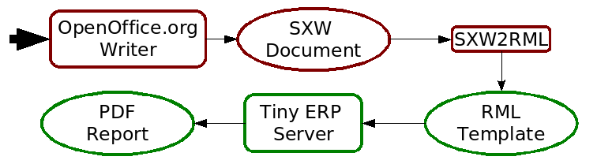

.. i18n: OpenOffice.org reports
.. i18n: ======================

OpenOffice.org reports
======================

.. i18n: **The document flow**

**The document flow**

.. i18n: OpenOffice.org reports are the most commonly used report formats. OpenOffice.org Writer is used (in combination with [[1]]) to generate a RML template, which in turn is used to generate a pdf printable report.

OpenOffice.org reports are the most commonly used report formats. OpenOffice.org Writer is used (in combination with [[1]]) to generate a RML template, which in turn is used to generate a pdf printable report.

.. i18n: .. figure::  images/ooo_report_overview.png
.. i18n:    :scale: 85
.. i18n:    :align: center

.. i18n: **The internal process**

**The internal process**

.. i18n: .. figure::  images/process_ooo.png
.. i18n:    :scale: 85
.. i18n:    :align: center

.. figure::  images/process_ooo.png
   :scale: 85
   :align: center

.. i18n: **The .SXW template file**

**The .SXW template file**

.. i18n:     * We use a .SXW file for the template, which is the OpenOffice 1.0 format. The template includes expressions in brackets or OpenOffice fields to point where the data from the Open ERP server will be filled in. This document is only used for developers, as a help-tool to easily generate the .RML file. Open ERP does not need this .SXW file to print reports. 

    * We use a .SXW file for the template, which is the OpenOffice 1.0 format. The template includes expressions in brackets or OpenOffice fields to point where the data from the Open ERP server will be filled in. This document is only used for developers, as a help-tool to easily generate the .RML file. Open ERP does not need this .SXW file to print reports. 

.. i18n: **The .RML template**

**The .RML template**

.. i18n:     * We generate a .RML file from the .SXW file using Open SXW2RML. A .RML file is a XML format that represent a .PDF document. It can be converted to a .PDF after. We use RML for more easy processing: XML syntax seems to be more common than PDF syntax. 

    * We generate a .RML file from the .SXW file using Open SXW2RML. A .RML file is a XML format that represent a .PDF document. It can be converted to a .PDF after. We use RML for more easy processing: XML syntax seems to be more common than PDF syntax. 

.. i18n: **The report engine**

**The report engine**

.. i18n:     * The Open Report Engine process the .RML file inserting data from the database at each expression. 

    * The Open Report Engine process the .RML file inserting data from the database at each expression. 

.. i18n: in the .RML file will be replaced by the name of the country of the partner of the printed invoice. This report engine produce the same .RML file where all expressions have been replaced by real data.

in the .RML file will be replaced by the name of the country of the partner of the printed invoice. This report engine produce the same .RML file where all expressions have been replaced by real data.

.. i18n: **The final document**

**The final document**

.. i18n:     * Finaly the .RML file is converted to PDF or HTML according to the need, using OpenReport's scripts. 

    * Finaly the .RML file is converted to PDF or HTML according to the need, using OpenReport's scripts. 

.. i18n: Creating a SXW
.. i18n: --------------

Creating a SXW
--------------

.. i18n: You can design reports using *OpenOffice*. Here's, as an example, the file @@server/bin/addons/sale/report/order.sxw@@.

You can design reports using *OpenOffice*. Here's, as an example, the file @@server/bin/addons/sale/report/order.sxw@@.

.. i18n: .. figure::  images/writer_report.png
.. i18n:    :scale: 85
.. i18n:    :align: center

.. figure::  images/writer_report.png
   :scale: 85
   :align: center

.. i18n: Dynamic content in your report 
.. i18n: ------------------------------

Dynamic content in your report 
------------------------------

.. i18n: **Dynamic content**

**Dynamic content**

.. i18n: In the .SXW/.RML reports, you can put some Python code that accesses the Open ERP objects in brackets. The context of the code (the variable's values you can use) is the following:

In the .SXW/.RML reports, you can put some Python code that accesses the Open ERP objects in brackets. The context of the code (the variable's values you can use) is the following:

.. i18n: **Available variables**

**Available variables**

.. i18n: Here are Python objects/variables available:

Here are Python objects/variables available:

.. i18n:     *  **objects** : the list of objects to be printed (invoices for example).
.. i18n:     * **data** : comes from the wizard
.. i18n:     * **time** : the Python time module (see Python documentation for more information).
.. i18n:     * **user** : the user object launching the report. 

    *  **objects** : the list of objects to be printed (invoices for example).
    * **data** : comes from the wizard
    * **time** : the Python time module (see Python documentation for more information).
    * **user** : the user object launching the report. 

.. i18n:  **Available functions**

 **Available functions**

.. i18n: Here are Python functions you can use:

Here are Python functions you can use:

.. i18n:     * **setlang('fr')** : change the language used in automated translation (fields...).
.. i18n:     * **repeatIn(list,varname)** : repeat the current part of the template (whole document, current section, current row in the table) for each object in the list. Use varname in the template's tags. Since versions 4.1.X, you can use an optionnal third argument that is the name of the .RML tag you want to loop on.
.. i18n:     * **setTag('para','xpre')** : change the enclosing RML tag (usually 'para') by an other (xpre is a preformatted paragraph), in the (converted from sxw)rml document (?)
.. i18n:     * **removeParentNode('tr')** : removes the parent node of type 'tr', this parameter is usually used together with a conditional (see examples below)

    * **setlang('fr')** : change the language used in automated translation (fields...).
    * **repeatIn(list,varname)** : repeat the current part of the template (whole document, current section, current row in the table) for each object in the list. Use varname in the template's tags. Since versions 4.1.X, you can use an optionnal third argument that is the name of the .RML tag you want to loop on.
    * **setTag('para','xpre')** : change the enclosing RML tag (usually 'para') by an other (xpre is a preformatted paragraph), in the (converted from sxw)rml document (?)
    * **removeParentNode('tr')** : removes the parent node of type 'tr', this parameter is usually used together with a conditional (see examples below)

.. i18n: Example of useful tags:

Example of useful tags:

.. i18n:     * **[[ repeatIn(objects,'o') ]]** : Loop on each objects selected for the print
.. i18n:     * **[[ repeatIn(o.invoice_line,'l') ]]** : Loop on every line
.. i18n:     * **[[ (o.prop=='draft')and 'YES' or 'NO' ]]** : Print YES or NO according the field 'prop'
.. i18n:     * **[[ round(o.quantity * o.price * 0.9, 2) ]]** : Operations are OK.
.. i18n:     * **[[ '%07d' % int(o.number) ]]** : Number formating
.. i18n:     * **[[ reduce(lambda x, obj: x+obj.qty , list , 0 ) ]]** : Total qty of list (try "objects" as list)
.. i18n:     * **[[ user.name ]]** : user name
.. i18n:     * **[[ setLang(o.partner_id.lang) ]]** : Localized printings
.. i18n:     * **[[ time.strftime('%d/%m/%Y') ]]** : Show the time in format=dd/MM/YYYY, check python doc for more about "%d", ...
.. i18n:     * **[[ time.strftime(time.ctime()[0:10]) ]]** or **[[ time.strftime(time.ctime()[-4:]) ]]** : Prints only date.
.. i18n:     * **[[ time.ctime() ]]** : Prints the actual date & time
.. i18n:     * **[[ time.ctime().split()[3] ]]** : Prints only time
.. i18n:     * **[[ o.type in ['in_invoice', 'out_invoice'] and 'Invoice' or removeParentNode('tr') ]]** : If the type is 'in_invoice' or 'out_invoice' then the word 'Invoice' is printed, if it's neither the first node above it of type 'tr' will be removed.

    * **[[ repeatIn(objects,'o') ]]** : Loop on each objects selected for the print
    * **[[ repeatIn(o.invoice_line,'l') ]]** : Loop on every line
    * **[[ (o.prop=='draft')and 'YES' or 'NO' ]]** : Print YES or NO according the field 'prop'
    * **[[ round(o.quantity * o.price * 0.9, 2) ]]** : Operations are OK.
    * **[[ '%07d' % int(o.number) ]]** : Number formating
    * **[[ reduce(lambda x, obj: x+obj.qty , list , 0 ) ]]** : Total qty of list (try "objects" as list)
    * **[[ user.name ]]** : user name
    * **[[ setLang(o.partner_id.lang) ]]** : Localized printings
    * **[[ time.strftime('%d/%m/%Y') ]]** : Show the time in format=dd/MM/YYYY, check python doc for more about "%d", ...
    * **[[ time.strftime(time.ctime()[0:10]) ]]** or **[[ time.strftime(time.ctime()[-4:]) ]]** : Prints only date.
    * **[[ time.ctime() ]]** : Prints the actual date & time
    * **[[ time.ctime().split()[3] ]]** : Prints only time
    * **[[ o.type in ['in_invoice', 'out_invoice'] and 'Invoice' or removeParentNode('tr') ]]** : If the type is 'in_invoice' or 'out_invoice' then the word 'Invoice' is printed, if it's neither the first node above it of type 'tr' will be removed.

.. i18n: SXW2RML
.. i18n: -------

SXW2RML
-------

.. i18n: Open Report Manual
.. i18n: ++++++++++++++++++

Open Report Manual
++++++++++++++++++

.. i18n: About
.. i18n: """""

About
"""""

.. i18n: The Open ERP's report engine.

The Open ERP's report engine.

.. i18n: Open Report is a module that allows you to render high quality PDF document from an OpenOffice template (.sxw) and any relational database. It can be used as a OpenERP module or as a standalone program.

Open Report is a module that allows you to render high quality PDF document from an OpenOffice template (.sxw) and any relational database. It can be used as a OpenERP module or as a standalone program.

.. i18n: Open Report has been developed by Fabien Pinckaers.

Open Report has been developed by Fabien Pinckaers.

.. i18n: **tiny_sxw2rml** can be found at http://www.tinyreport.org/download.html

**tiny_sxw2rml** can be found at http://www.tinyreport.org/download.html

.. i18n: SXW to RML script setup - Windows users
.. i18n: """""""""""""""""""""""""""""""""""""""

SXW to RML script setup - Windows users
"""""""""""""""""""""""""""""""""""""""

.. i18n: In order to use the 'tiny_sxw2rml.py' Python script you need the following packages installed:

In order to use the 'tiny_sxw2rml.py' Python script you need the following packages installed:

.. i18n:     * Pyhton (http://www.python.org)
.. i18n:     * ReportLab (http://www.reportlab.org)/(Installation)
.. i18n:     * Libxml for Python (http://users.skynet.be/sbi/libxml-python) 

    * Pyhton (http://www.python.org)
    * ReportLab (http://www.reportlab.org)/(Installation)
    * Libxml for Python (http://users.skynet.be/sbi/libxml-python) 

.. i18n: SXW to RML script setup - Linux (Open source) users
.. i18n: """""""""""""""""""""""""""""""""""""""""""""""""""

SXW to RML script setup - Linux (Open source) users
"""""""""""""""""""""""""""""""""""""""""""""""""""

.. i18n: Ensure normalized_oo2rml.xsl is available to tiny_sxw2rml otherwise you will get an error like:

Ensure normalized_oo2rml.xsl is available to tiny_sxw2rml otherwise you will get an error like:

.. i18n:     * failed to load external entity normalized_oo2rml.xsl 

    * failed to load external entity normalized_oo2rml.xsl 

.. i18n: Running tiny_sxw2rml
.. i18n: """"""""""""""""""""
.. i18n: When you have all that installed just edit your report template and run the script with the following command:
.. i18n: ::
.. i18n: 
.. i18n: 	tiny_sxw2rml.py template.sxw > template.rml

Running tiny_sxw2rml
""""""""""""""""""""
When you have all that installed just edit your report template and run the script with the following command:
::

	tiny_sxw2rml.py template.sxw > template.rml

.. i18n: Note: **tiny_sxw2rml.py** help suggests that you specify the output file with: "-o OUTPUT" but this does not seem to work as of V0.9.3 

Note: **tiny_sxw2rml.py** help suggests that you specify the output file with: "-o OUTPUT" but this does not seem to work as of V0.9.3 

.. i18n: Tiny ERP Server PDF Output 
.. i18n: --------------------------

Tiny ERP Server PDF Output 
--------------------------

.. i18n: Server PDF Output
.. i18n: +++++++++++++++++

Server PDF Output
+++++++++++++++++

.. i18n: About
.. i18n: """""
.. i18n: To generate the pdf from the rml file, OpenERP needs a rml parser.

About
"""""
To generate the pdf from the rml file, OpenERP needs a rml parser.

.. i18n: Parser
.. i18n: """"""
.. i18n: The parsers are generally put into the folder report of the module. Here is the code for the sale order report:

Parser
""""""
The parsers are generally put into the folder report of the module. Here is the code for the sale order report:

.. i18n: import time
.. i18n: from report import report_sxw
.. i18n: ::
.. i18n: 
.. i18n: 	class order(report_sxw.rml_parse):
.. i18n: 	 	def __init__(self, cr, uid, name, context):
.. i18n: 	  		super(order, self).__init__(cr, uid, name, context)
.. i18n: 	  			self.localcontext.update({
.. i18n: 	  			'time': time,
.. i18n: 	 		})
.. i18n: 		report_sxw.report_sxw('report.sale.order', 'sale.order',
.. i18n: 			'addons/sale/report/order.rml', parser=order, header=True)

import time
from report import report_sxw
::

	class order(report_sxw.rml_parse):
	 	def __init__(self, cr, uid, name, context):
	  		super(order, self).__init__(cr, uid, name, context)
	  			self.localcontext.update({
	  			'time': time,
	 		})
		report_sxw.report_sxw('report.sale.order', 'sale.order',
			'addons/sale/report/order.rml', parser=order, header=True)

.. i18n: The parser inherit from the **report_sxw.rml_parse** object and it add to the localcontext, the function time so it will be possible to call it in the report.

The parser inherit from the **report_sxw.rml_parse** object and it add to the localcontext, the function time so it will be possible to call it in the report.

.. i18n: After an instance of **report_sxw.report_sxw** is created with the parameters:

After an instance of **report_sxw.report_sxw** is created with the parameters:

.. i18n:     * the name of the report
.. i18n:     * the object name on which the report is defined
.. i18n:     * the path to the rml file
.. i18n:     * the parser to use for the report (by default rml_parse)
.. i18n:     * a boolean to add or not the company header on the report (default True) 

    * the name of the report
    * the object name on which the report is defined
    * the path to the rml file
    * the parser to use for the report (by default rml_parse)
    * a boolean to add or not the company header on the report (default True) 

.. i18n: The xml definition
.. i18n: """"""""""""""""""

The xml definition
""""""""""""""""""

.. i18n: To be visible from the client, the report must be declared in an xml file (generally: "module_name"_report.xml) that must be put in the **__terp__.py** file

To be visible from the client, the report must be declared in an xml file (generally: "module_name"_report.xml) that must be put in the **__terp__.py** file

.. i18n: Here is an example for the sale order report:
.. i18n: ::
.. i18n: 
.. i18n: 	<?xml version="1.0"?>
.. i18n: 	<terp>
.. i18n: 		<data>
.. i18n: 			<report
.. i18n: 	   			id="report_sale_order"
.. i18n: 	   			string="Print Order"
.. i18n: 	   			model="sale.order"
.. i18n: 	   			name="sale.order"
.. i18n: 	   			rml="sale/report/order.rml"
.. i18n: 	   			auto="False"/>
.. i18n: 	   			header="False"/>
.. i18n: 	 	</data>
.. i18n: 	</terp>

Here is an example for the sale order report:
::

	<?xml version="1.0"?>
	<terp>
		<data>
			<report
	   			id="report_sale_order"
	   			string="Print Order"
	   			model="sale.order"
	   			name="sale.order"
	   			rml="sale/report/order.rml"
	   			auto="False"/>
	   			header="False"/>
	 	</data>
	</terp>

.. i18n: The arguments are:

The arguments are:

.. i18n:     * **id**: the id of the report like any xml tag in OpenERP
.. i18n:     * **string**: the string that will be display on the Client button
.. i18n:     * **model**: the object on which the report will run
.. i18n:     * **name**: the name of the report without the first "report."
.. i18n:     * **rml**: the path to the rml file
.. i18n:     * **auto**: boolean to specify if the server must generate a default parser or not
.. i18n:     * **header**: allows to enable or disable the report header located in "[server_dir]/bin/addons/custom" 

    * **id**: the id of the report like any xml tag in OpenERP
    * **string**: the string that will be display on the Client button
    * **model**: the object on which the report will run
    * **name**: the name of the report without the first "report."
    * **rml**: the path to the rml file
    * **auto**: boolean to specify if the server must generate a default parser or not
    * **header**: allows to enable or disable the report header located in "[server_dir]/bin/addons/custom" 

.. i18n: 	

	
