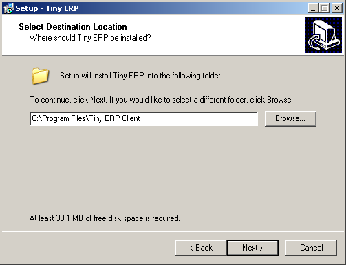

.. i18n: .. index::
.. i18n:    single: Installation; Open ERP Client (Windows)
.. i18n:    single: Open ERP Client; Installation (Windows)
.. i18n: .. 

.. index::
   single: Installation; Open ERP Client (Windows)
   single: Open ERP Client; Installation (Windows)
.. 

.. i18n: .. _installation-windows-client-link:
.. i18n: 
.. i18n: Open ERP Client Installation
.. i18n: ============================

.. _installation-windows-client-link:

Open ERP Client Installation
============================

.. i18n: The Windows client installation is very simple. There are 6 stages :

The Windows client installation is very simple. There are 6 stages :

.. i18n:   #. Welcome message.
.. i18n:   #. GPL Licence Acceptation
.. i18n:   #. Shortcut in the Start menu.
.. i18n:   #. Creation of a 'Start' icon on the desktop
.. i18n:   #. Confirmation Choices
.. i18n:   #. Automatic installation

  #. Welcome message.
  #. GPL Licence Acceptation
  #. Shortcut in the Start menu.
  #. Creation of a 'Start' icon on the desktop
  #. Confirmation Choices
  #. Automatic installation

.. i18n: You have to install, configure and run the Open ERP Server before using the
.. i18n: Open ERP Client. The client needs the server to run. You can install the server
.. i18n: application on your computer, or on an independent server accessible by
.. i18n: network.

You have to install, configure and run the Open ERP Server before using the
Open ERP Client. The client needs the server to run. You can install the server
application on your computer, or on an independent server accessible by
network.

.. i18n: Downloading the Open ERP client
.. i18n: -------------------------------

Downloading the Open ERP client
-------------------------------

.. i18n: The Open ERP client can be downloaded from
.. i18n: the `Open ERP website's download page <http://www.openerp.com/index.php?option=com_content&view=article&id=18&Itemid=28>`_

The Open ERP client can be downloaded from
the `Open ERP website's download page <http://www.openerp.com/index.php?option=com_content&view=article&id=18&Itemid=28>`_

.. i18n: Installing the Open ERP client
.. i18n: ------------------------------

Installing the Open ERP client
------------------------------

.. i18n: CLick on the executable installation file you've just downloaded and select the installation path.

CLick on the executable installation file you've just downloaded and select the installation path.

.. i18n: .. image:: ../../img/Client_01_install_path.png

.. i18n: Starting the Open ERP client
.. i18n: ++++++++++++++++++++++++++++

Starting the Open ERP client
++++++++++++++++++++++++++++

.. i18n: The installation program creates shortcuts in the main program menu and on the desktop.
.. i18n: Be sure to have an Open ERP Server running somewhere (on your computer or on a
.. i18n: distant server) to be able to use the Client software.

The installation program creates shortcuts in the main program menu and on the desktop.
Be sure to have an Open ERP Server running somewhere (on your computer or on a
distant server) to be able to use the Client software.

.. i18n: Passwords:

Passwords:

.. i18n: Log in to TERP database using default username and password

Log in to TERP database using default username and password

.. i18n:   * Username = admin
.. i18n:   * Password = admin

  * Username = admin
  * Password = admin

.. i18n: Enjoy!

Enjoy!
