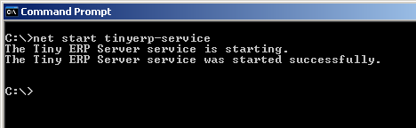
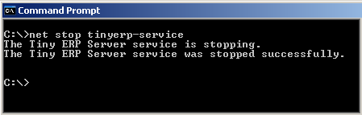
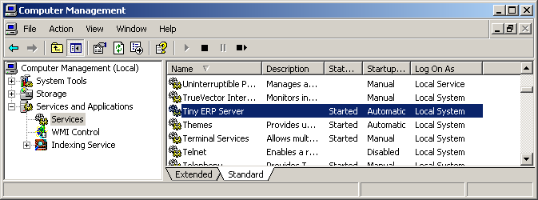
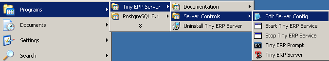

.. i18n: .. index::
.. i18n:    single: Installation; Open ERP Server (Windows)
.. i18n:    single: Open ERP Server; Installation (Windows)
.. i18n: .. 

.. index::
   single: Installation; Open ERP Server (Windows)
   single: Open ERP Server; Installation (Windows)
.. 

.. i18n: .. _installation-windows-server-link:
.. i18n: 
.. i18n: Open ERP Server Installation
.. i18n: ============================

.. _installation-windows-server-link:

Open ERP Server Installation
============================

.. i18n: System Requirements
.. i18n: -------------------

System Requirements
-------------------

.. i18n: The server installation works on:

The server installation works on:

.. i18n:  * Windows 2000
.. i18n:  * Windows XP
.. i18n:  * Windows Vista
.. i18n:  * Windows Server 2000
.. i18n:  * Windows Server 2003
.. i18n:  * Windows Server 2008

 * Windows 2000
 * Windows XP
 * Windows Vista
 * Windows Server 2000
 * Windows Server 2003
 * Windows Server 2008

.. i18n: with disks formatted in NTFS (not a FAT or FAT32 partition).

with disks formatted in NTFS (not a FAT or FAT32 partition).

.. i18n: .. note::
.. i18n: 
.. i18n:    Open ERP Server doesn't work on Windows 98 or ME;
.. i18n:    for obvious reasons -- these can't be formatted using NTFS.

.. note::

   Open ERP Server doesn't work on Windows 98 or ME;
   for obvious reasons -- these can't be formatted using NTFS.

.. i18n: You will also need a PostgreSQL server up and running. If it's not the case,
.. i18n: you can read the :ref:`windows_postgresql-server-installation` Section.

You will also need a PostgreSQL server up and running. If it's not the case,
you can read the :ref:`windows_postgresql-server-installation` Section.

.. i18n: Downloading the Open ERP Server
.. i18n: -------------------------------

Downloading the Open ERP Server
-------------------------------

.. i18n: The server can be downloaded from
.. i18n: the `Open ERP website's download page <http://www.openerp.com/index.php?option=com_content&view=article&id=18&Itemid=28>`_

The server can be downloaded from
the `Open ERP website's download page <http://www.openerp.com/index.php?option=com_content&view=article&id=18&Itemid=28>`_

.. i18n: Choose **Standalone Server** if you want to install Open ERP Server standalone
.. i18n: and plan to install the Open ERP Client and the PostgreSQL Server separately.

Choose **Standalone Server** if you want to install Open ERP Server standalone
and plan to install the Open ERP Client and the PostgreSQL Server separately.

.. i18n: Choose **All in One** if you want to install PostgreSQL Server, Open ERP Server
.. i18n: and OpenERP Client in one shot.

Choose **All in One** if you want to install PostgreSQL Server, Open ERP Server
and OpenERP Client in one shot.

.. i18n: Installing the Open ERP Server
.. i18n: ------------------------------

Installing the Open ERP Server
------------------------------

.. i18n: Click on the installer you've just downloaded.

Click on the installer you've just downloaded.

.. i18n: The ERP server installs also as a Windows service. This means you don't have to start the
.. i18n: server each time you start the computer and it runs without the need of an open user
.. i18n: session.

The ERP server installs also as a Windows service. This means you don't have to start the
server each time you start the computer and it runs without the need of an open user
session.

.. i18n: At the end of the installation, the setup wizard proposes to open, Open ERP Prompt, from
.. i18n: where you can prepare your server, as described below.

At the end of the installation, the setup wizard proposes to open, Open ERP Prompt, from
where you can prepare your server, as described below.

.. i18n: .. image:: ../../img/Terp_server_finish_install.png

.. image:: ../../img/Terp_server_finish_install.png

.. i18n: Preparing the server for the first time run
.. i18n: +++++++++++++++++++++++++++++++++++++++++++

Preparing the server for the first time run
+++++++++++++++++++++++++++++++++++++++++++

.. i18n: The Windows service for Open ERP Server is installed during the installation and it's set up
.. i18n: to start the server automatically on system boot.

The Windows service for Open ERP Server is installed during the installation and it's set up
to start the server automatically on system boot.

.. i18n: The configuration file is now automatically saved in the installation directory, in: ::
.. i18n: 
.. i18n:  C:\Program Files\OpenERP Server\openerp-server.conf

The configuration file is now automatically saved in the installation directory, in: ::

 C:\Program Files\OpenERP Server\openerp-server.conf

.. i18n: Open ERP Prompt
.. i18n: +++++++++++++++

Open ERP Prompt
+++++++++++++++

.. i18n: At the end of installation, the setup wizard proposes to open an Open ERP Prompt.

At the end of installation, the setup wizard proposes to open an Open ERP Prompt.

.. i18n: To start the server manually, start the Windows Command prompt and navigate to the
.. i18n: installation directory in "C:\Program Files\OpenERP Server\":

To start the server manually, start the Windows Command prompt and navigate to the
installation directory in "C:\Program Files\OpenERP Server\":

.. i18n: You need to initialize the server and save its configuration for the service to be able
.. i18n: to start automatically.

You need to initialize the server and save its configuration for the service to be able
to start automatically.

.. i18n: You also need to specify a logfile to be able to read the output the server writes
.. i18n: during its execution.

You also need to specify a logfile to be able to read the output the server writes
during its execution.

.. i18n: When in the Server directory, type this command but don't execute it yet: ::
.. i18n: 
.. i18n:    openerp-server.exe -d <db_name> -r <db_user> -w <db_password> --db_host=localhost
.. i18n:    --db_port=5432 --logfile="<logfile>" -s --stop-after-init

When in the Server directory, type this command but don't execute it yet: ::

   openerp-server.exe -d <db_name> -r <db_user> -w <db_password> --db_host=localhost
   --db_port=5432 --logfile="<logfile>" -s --stop-after-init

.. i18n: The initialization of Open ERP Server provides the necessary informations for the connection
.. i18n: to the database PostgreSQL and indication of the choice of data to load. Here is the
.. i18n: explanation of used options:

The initialization of Open ERP Server provides the necessary informations for the connection
to the database PostgreSQL and indication of the choice of data to load. Here is the
explanation of used options:

.. i18n:  * -d <db_name> : Name of the database created for Open ERP Server.
.. i18n:  * -r <db_user> : Name of the [=PostgreSQL=] administrator.
.. i18n:  * -w <db_password> : Administrator's password.
.. i18n:  * --db_host=<postgresql_server_address> : Address of the server where [=PostgreSQL=]is, if
.. i18n:    you have installed [=PostgreSQL=] on the same computer as Open ERP Server, you can enter
.. i18n:    localhost, or the IP address or the name of the distant server.
.. i18n:  * --db_port=<port_no> : Port number where listens [=PostgreSQL=]. Default is 5432.
.. i18n:  * -s : This option allows you to save the options in configuration file of Open ERP Server.
.. i18n:  * --stop-after-init: This option stops the ERP server after initialization.
.. i18n:  * --logfile="<logfile>": specify a logfile where all the output of ERP Server will be
.. i18n:    saved.

 * -d <db_name> : Name of the database created for Open ERP Server.
 * -r <db_user> : Name of the [=PostgreSQL=] administrator.
 * -w <db_password> : Administrator's password.
 * --db_host=<postgresql_server_address> : Address of the server where [=PostgreSQL=]is, if
   you have installed [=PostgreSQL=] on the same computer as Open ERP Server, you can enter
   localhost, or the IP address or the name of the distant server.
 * --db_port=<port_no> : Port number where listens [=PostgreSQL=]. Default is 5432.
 * -s : This option allows you to save the options in configuration file of Open ERP Server.
 * --stop-after-init: This option stops the ERP server after initialization.
 * --logfile="<logfile>": specify a logfile where all the output of ERP Server will be
   saved.

.. i18n: Before execution of this command you have to decide what usage you want the Open ERP for:
.. i18n: see the next section! The command is on only one line, the other long commands as well.

Before execution of this command you have to decide what usage you want the Open ERP for:
see the next section! The command is on only one line, the other long commands as well.

.. i18n: Sample command: ::
.. i18n: 
.. i18n:  openerp-server.exe -d terp -r postgresadmin -w postgresadminpasswd
.. i18n:  --db_host=localhost --logfile="C:\Program Files\OpenERP Server\openerp-server.log"
.. i18n:  --db_port=5432 -s  --stop-after-init

Sample command: ::

 openerp-server.exe -d terp -r postgresadmin -w postgresadminpasswd
 --db_host=localhost --logfile="C:\Program Files\OpenERP Server\openerp-server.log"
 --db_port=5432 -s  --stop-after-init

.. i18n: Here you have to enter the username and password initialized in the Initialise database
.. i18n: cluster screen.

Here you have to enter the username and password initialized in the Initialise database
cluster screen.

.. i18n: When you will execute the initialization command, if you specified a logfile, you will not
.. i18n: see any server output in the prompt window.

When you will execute the initialization command, if you specified a logfile, you will not
see any server output in the prompt window.

.. i18n: Everything is written to the logfile. You have only to wait until the prompt comes back.

Everything is written to the logfile. You have only to wait until the prompt comes back.

.. i18n: Deciding what is the purpose of the server
.. i18n: ++++++++++++++++++++++++++++++++++++++++++

Deciding what is the purpose of the server
++++++++++++++++++++++++++++++++++++++++++

.. i18n: You have three possibilities for the first launch. This section is really important because
.. i18n: the correct initialization can be crucial.

You have three possibilities for the first launch. This section is really important because
the correct initialization can be crucial.

.. i18n: You can initialize the database with Open ERP Server to:

You can initialize the database with Open ERP Server to:

.. i18n:   #. You want to take a look on the system with demo data loaded
.. i18n:   #. You are installing a new clean installation (without demo data)
.. i18n:   #. You are upgrading an existing version.

  #. You want to take a look on the system with demo data loaded
  #. You are installing a new clean installation (without demo data)
  #. You are upgrading an existing version.

.. i18n: First time run with demo data
.. i18n: +++++++++++++++++++++++++++++

First time run with demo data
+++++++++++++++++++++++++++++

.. i18n: To initialize Open ERP Server with the demo data, you need to add this option to the above
.. i18n: command: ::
.. i18n: 
.. i18n:  --init=all

To initialize Open ERP Server with the demo data, you need to add this option to the above
command: ::

 --init=all

.. i18n: Sample command: ::
.. i18n: 
.. i18n:  openerp-server.exe -d terp -r postgresadmin -w postgresadminpasswd
.. i18n:  --db_host=localhost --logfile="C:\Program Files\OpenERP Server\openerp-server.log"
.. i18n:  --db_port=5432 -s  --stop-after-init --init=all

Sample command: ::

 openerp-server.exe -d terp -r postgresadmin -w postgresadminpasswd
 --db_host=localhost --logfile="C:\Program Files\OpenERP Server\openerp-server.log"
 --db_port=5432 -s  --stop-after-init --init=all

.. i18n: This command will initialize the Open ERP Server and fill its PostgreSQL database with the
.. i18n: demo data.

This command will initialize the Open ERP Server and fill its PostgreSQL database with the
demo data.

.. i18n: First time run without demo data (or new clean version)
.. i18n: +++++++++++++++++++++++++++++++++++++++++++++++++++++++

First time run without demo data (or new clean version)
+++++++++++++++++++++++++++++++++++++++++++++++++++++++

.. i18n: Execute the command with an option excluding the demo data: ::
.. i18n: 
.. i18n:  --without-demo=all

Execute the command with an option excluding the demo data: ::

 --without-demo=all

.. i18n: This will load all modules, but will not load the demo data.

This will load all modules, but will not load the demo data.

.. i18n: Sample command usage: ::
.. i18n: 
.. i18n:  openerp-server.exe -d terp -r postgresadmin -w postgresadminpasswd
.. i18n:  --db_host=localhost --logfile="C:\Program Files\OpenERP Server\openerp-server.log"
.. i18n:  --db_port=5432 -s  --stop-after-init --without-demo=all

Sample command usage: ::

 openerp-server.exe -d terp -r postgresadmin -w postgresadminpasswd
 --db_host=localhost --logfile="C:\Program Files\OpenERP Server\openerp-server.log"
 --db_port=5432 -s  --stop-after-init --without-demo=all

.. i18n: Recreate a new database:If you have more than one database , you may force the server to
.. i18n: initialize by using the "-i all" or "--init=all" command line option.

Recreate a new database:If you have more than one database , you may force the server to
initialize by using the "-i all" or "--init=all" command line option.

.. i18n: If you already initialized the database and you have the demo data loaded, you can recreate
.. i18n: a new database

If you already initialized the database and you have the demo data loaded, you can recreate
a new database

.. i18n: First time run with an upgraded version of Open ERP Server
.. i18n: ++++++++++++++++++++++++++++++++++++++++++++++++++++++++++

First time run with an upgraded version of Open ERP Server
++++++++++++++++++++++++++++++++++++++++++++++++++++++++++

.. i18n: Execute the command with an option that updates the data structures: ::
.. i18n: 
.. i18n:  --update=all

Execute the command with an option that updates the data structures: ::

 --update=all

.. i18n: Sample command usage: ::
.. i18n: 
.. i18n:  openerp-server.exe -d terp -r postgresadmin -w postgresadminpasswd
.. i18n:  --db_host=localhost --logfile="C:\Program Files\OpenERP Server\openerp-server.log"
.. i18n:  --db_port=5432 -s  --stop-after-init --update=all

Sample command usage: ::

 openerp-server.exe -d terp -r postgresadmin -w postgresadminpasswd
 --db_host=localhost --logfile="C:\Program Files\OpenERP Server\openerp-server.log"
 --db_port=5432 -s  --stop-after-init --update=all

.. i18n: Starting the server
.. i18n: -------------------

Starting the server
-------------------

.. i18n: Now as the server is initialized and the settings are saved, you can finally start the Open
.. i18n: ERP Server service.

Now as the server is initialized and the settings are saved, you can finally start the Open
ERP Server service.

.. i18n: In the menus there is an icon that directly executes the Open ERP server, but it is only for
.. i18n: debugging or testing purposes.

In the menus there is an icon that directly executes the Open ERP server, but it is only for
debugging or testing purposes.

.. i18n: From the command prompt
.. i18n: +++++++++++++++++++++++

From the command prompt
+++++++++++++++++++++++

.. i18n: You can now start the Open ERP Server service from the command prompt with a simple command: ::
.. i18n: 
.. i18n:   net start openerp-service

You can now start the Open ERP Server service from the command prompt with a simple command: ::

  net start openerp-service

.. i18n: .. image:: ../../img/Terp_service_start.png

.. i18n: You can also stop it in a similar way, in case the service is running but you need to
.. i18n: reconfigure it: ::
.. i18n: 
.. i18n:  net stop openerp-service

You can also stop it in a similar way, in case the service is running but you need to
reconfigure it: ::

 net stop openerp-service

.. i18n: .. image:: ../../img/Terp_service_stop.png

.. i18n: From the main program menu
.. i18n: ++++++++++++++++++++++++++

From the main program menu
++++++++++++++++++++++++++

.. i18n: You can also control the service from the Program menu:

You can also control the service from the Program menu:

.. i18n: .. image:: ../../img/Terps_menu_server_controls.png

.. image:: ../../img/Terps_menu_server_controls.png

.. i18n: From the service manager
.. i18n: ++++++++++++++++++++++++

From the service manager
++++++++++++++++++++++++

.. i18n: The service and some runtime information is also accessible in the Computer management in
.. i18n: Administration tools.

The service and some runtime information is also accessible in the Computer management in
Administration tools.

.. i18n: .. image:: ../../img/Terp_service_mmc_terp_service.png

.. i18n: .. 

.. 

.. i18n: .. image:: ../../img/Terp_service_mmc_logs.png

.. image:: ../../img/Terp_service_mmc_logs.png

.. i18n: The logging service offers additional information about the execution of the Open ERP Server
.. i18n: service.

The logging service offers additional information about the execution of the Open ERP Server
service.

.. i18n: In the service manager you can define how the service should act in case of server failure.

In the service manager you can define how the service should act in case of server failure.

.. i18n: .. image:: ../../img/Terp_service_mmc_control_actions.png

.. image:: ../../img/Terp_service_mmc_control_actions.png

.. i18n: Monitoring Open ERP Server
.. i18n: --------------------------

Monitoring Open ERP Server
--------------------------

.. i18n: You can find startup or shutdown information in the Computer Management logging service.

You can find startup or shutdown information in the Computer Management logging service.

.. i18n: Open ERP Server runtime output can be found in the logfile you specified on the
.. i18n: initialization command line.

Open ERP Server runtime output can be found in the logfile you specified on the
initialization command line.

.. i18n: Given that the server is now running as a Windows service, it doesn't output any runtime
.. i18n: messages, for this the logfile is the only option.

Given that the server is now running as a Windows service, it doesn't output any runtime
messages, for this the logfile is the only option.

.. i18n: You can find out whether Open ERP Server is running by opening the Windows Task Manager and
.. i18n: when you look at the Processes tab, you will see OpenERPServerService.exe and openerp-
.. i18n: server.exe and that these two processes are running as SYSTEM user.

You can find out whether Open ERP Server is running by opening the Windows Task Manager and
when you look at the Processes tab, you will see OpenERPServerService.exe and openerp-
server.exe and that these two processes are running as SYSTEM user.

.. i18n: .. image:: ../../img/Terp_service_running.png

.. image:: ../../img/Terp_service_running.png

.. i18n: Configuring Open ERP Server
.. i18n: ---------------------------

Configuring Open ERP Server
---------------------------

.. i18n: Open ERP Server menu contains a direct link to the configuration file used by the service.
.. i18n: This way you can edit the configuration and then restart the service to load the new
.. i18n: configurations.

Open ERP Server menu contains a direct link to the configuration file used by the service.
This way you can edit the configuration and then restart the service to load the new
configurations.

.. i18n: .. image:: ../../img/Terps_menu_editconf.png

.. i18n: .. image:: ../../img/Terp_server_conf.png

.. image:: ../../img/Terp_server_conf.png

.. i18n: Be extremely cautious when editing the server configuration directly, you can crash the
.. i18n: entire system with inappropriate values.

Be extremely cautious when editing the server configuration directly, you can crash the
entire system with inappropriate values.

.. i18n: Congratulations, you have successfully installed the Open ERP Server
.. i18n: --------------------------------------------------------------------

Congratulations, you have successfully installed the Open ERP Server
--------------------------------------------------------------------

.. i18n: For more information, please take a look at
.. i18n: the :ref:`Additional Installation Information and
.. i18n: Troubleshooting <troubleshooting-and-windows-complementary-install-information>` page 
.. i18n: where you can find some troubleshooting examples.

For more information, please take a look at
the :ref:`Additional Installation Information and
Troubleshooting <troubleshooting-and-windows-complementary-install-information>` page 
where you can find some troubleshooting examples.
