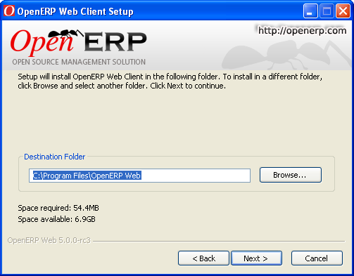

.. i18n: .. index::
.. i18n:    single: Installation; Open ERP Web (Windows)
.. i18n:    single: Open ERP Web; Installation (Windows)
.. i18n: .. 

.. index::
   single: Installation; Open ERP Web (Windows)
   single: Open ERP Web; Installation (Windows)
.. 

.. i18n: .. _installation-windows-web-link:
.. i18n: 
.. i18n: OpenERP Web Installation
.. i18n: ========================

.. _installation-windows-web-link:

OpenERP Web Installation
========================

.. i18n: The installation is very simple. There are 5 stages :

The installation is very simple. There are 5 stages :

.. i18n:   #. Welcome message.
.. i18n:   #. OEPL Licence Acceptation
.. i18n:   #. Shortcut in the Start menu.
.. i18n:   #. Confirmation Choices
.. i18n:   #. Automatic installation

  #. Welcome message.
  #. OEPL Licence Acceptation
  #. Shortcut in the Start menu.
  #. Confirmation Choices
  #. Automatic installation

.. i18n: You have to install, configure and run the OpenERP Server before using the
.. i18n: OpenERP Web. The web client needs the server to run. You can install the server
.. i18n: application on your computer, or on an independent server accessible by
.. i18n: network.

You have to install, configure and run the OpenERP Server before using the
OpenERP Web. The web client needs the server to run. You can install the server
application on your computer, or on an independent server accessible by
network.

.. i18n: Downloading the OpenERP Web
.. i18n: -------------------------------

Downloading the OpenERP Web
-------------------------------

.. i18n: The OpenERP Web can be downloaded from
.. i18n: the `OpenERP website's download page <http://www.openerp.com/index.php?option=com_content&view=article&id=18&Itemid=28>`_

The OpenERP Web can be downloaded from
the `OpenERP website's download page <http://www.openerp.com/index.php?option=com_content&view=article&id=18&Itemid=28>`_

.. i18n: Installing the OpenERP Web
.. i18n: ------------------------------

Installing the OpenERP Web
------------------------------

.. i18n: Click on the executable installation file you've just downloaded and select the installation path.

Click on the executable installation file you've just downloaded and select the installation path.

.. i18n: .. image:: ../../img/Web_01_install_path.png

.. i18n: Preparing the web server for the first time run
.. i18n: +++++++++++++++++++++++++++++++++++++++++++++++

Preparing the web server for the first time run
+++++++++++++++++++++++++++++++++++++++++++++++

.. i18n: The Windows service for OpenERP Web Server is installed during the installation and it's set up
.. i18n: to start the server automatically on system boot.

The Windows service for OpenERP Web Server is installed during the installation and it's set up
to start the server automatically on system boot.

.. i18n: The configuration file is now automatically saved in the installation directory, in: ::
.. i18n: 
.. i18n:  C:\Program Files\OpenERP Web\conf\openerp-web.conf

The configuration file is now automatically saved in the installation directory, in: ::

 C:\Program Files\OpenERP Web\conf\openerp-web.conf

.. i18n: Starting the web server
.. i18n: -----------------------

Starting the web server
-----------------------

.. i18n: Now as the web server is initialized and the settings are saved, you can finally start 
.. i18n: the OpenERP Web Server service.

Now as the web server is initialized and the settings are saved, you can finally start 
the OpenERP Web Server service.
