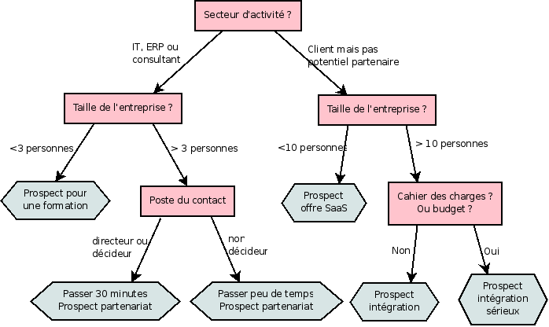

.. i18n: .. index::
.. i18n:    single: Profiling
.. i18n: ..

.. index::
   single: Profiling
..

.. i18n: Profiling
.. i18n: =========

Profiling
=========

.. i18n: .. index:: prospect

.. index:: prospect

.. i18n: Establishing the profiles of prospects
.. i18n: --------------------------------------

Establishing the profiles of prospects
--------------------------------------

.. i18n: During presales activities it's useful to qualify your prospects quickly. You can pose a series of
.. i18n: questions to find out what product to offer to the customer, or how quickly you should handle the
.. i18n: request.

During presales activities it's useful to qualify your prospects quickly. You can pose a series of
questions to find out what product to offer to the customer, or how quickly you should handle the
request.

.. i18n: .. tip:: Profiling
.. i18n: 
.. i18n: 	This method of rapidly qualifying prospects is often used by companies who carry out presales by
.. i18n: 	phone.
.. i18n: 	A prospect list is imported into the Open ERP system as a set of partners and the operators then
.. i18n: 	pose a series of questions to each prospect by phone.
.. i18n: 
.. i18n: 	Responses to these questions enable each prospect to be qualified automatically which leads to
.. i18n: 	a specific service being offered based on their responses.

.. tip:: Profiling

	This method of rapidly qualifying prospects is often used by companies who carry out presales by
	phone.
	A prospect list is imported into the Open ERP system as a set of partners and the operators then
	pose a series of questions to each prospect by phone.

	Responses to these questions enable each prospect to be qualified automatically which leads to
	a specific service being offered based on their responses.

.. i18n: As an illustration, take the case of the Tiny company which offers a service based on the Open ERP
.. i18n: software. The company goes to several exhibitions and encounters dozens of prospects over a few
.. i18n: days. It's important to handle each request quickly and efficiently.

As an illustration, take the case of the Tiny company which offers a service based on the Open ERP
software. The company goes to several exhibitions and encounters dozens of prospects over a few
days. It's important to handle each request quickly and efficiently.

.. i18n: The products offered by Tiny at these exhibitions are:

The products offered by Tiny at these exhibitions are:

.. i18n: * training on Open ERP – for independent people or small companies,
.. i18n: 
.. i18n: * partner contract – for IT companies that intend to offer an Open ERP service,
.. i18n: 
.. i18n: * Open ERP as SaaS – for small companies,
.. i18n: 
.. i18n: * a meeting in conjunction with a partner to provide a demonstration aimed at providing a software
.. i18n:   integration – for companies that are slightly larger.

* training on Open ERP – for independent people or small companies,

* partner contract – for IT companies that intend to offer an Open ERP service,

* Open ERP as SaaS – for small companies,

* a meeting in conjunction with a partner to provide a demonstration aimed at providing a software
  integration – for companies that are slightly larger.

.. i18n: The Tiny company has therefore put a decision tree in place based on the answers to several
.. i18n: questions posed to prospects. These are given in the following figure :ref:`fig-crmprof`:

The Tiny company has therefore put a decision tree in place based on the answers to several
questions posed to prospects. These are given in the following figure :ref:`fig-crmprof`:

.. i18n: .. _fig-crmprof:
.. i18n: 
.. i18n: .. figure::  images/crm_profile_tree.png
.. i18n:    :scale: 50
.. i18n:    :align: center
.. i18n: 
.. i18n:    *Example of profiling customer prospects by the Tiny company*

.. _fig-crmprof:

   *Example of profiling customer prospects by the Tiny company*

.. i18n: The sales person starts by asking the questions mentioned above and then with a couple of minutes of
.. i18n: work can decide what to propose to the prospective customer.

The sales person starts by asking the questions mentioned above and then with a couple of minutes of
work can decide what to propose to the prospective customer.

.. i18n: At the end of the exhibition prospects' details and their responses to the questionnaire are entered
.. i18n: into Open ERP. The profiling system automatically classifies the prospects into appropriate partner
.. i18n: categories.

At the end of the exhibition prospects' details and their responses to the questionnaire are entered
into Open ERP. The profiling system automatically classifies the prospects into appropriate partner
categories.

.. i18n: This enables your sales people to follow prospects up efficiently and adapt their approach based on
.. i18n: each prospect's profile. For example, they can send a letter based on a template developed for a
.. i18n: specific partner category. They'd use Open ERP's report editor and generator for their sales
.. i18n: proposition, such as an invitation to a training session a week after the show.

This enables your sales people to follow prospects up efficiently and adapt their approach based on
each prospect's profile. For example, they can send a letter based on a template developed for a
specific partner category. They'd use Open ERP's report editor and generator for their sales
proposition, such as an invitation to a training session a week after the show.

.. i18n: Using profiles effectively
.. i18n: --------------------------

Using profiles effectively
--------------------------

.. i18n: .. index::
.. i18n:    single: module; crm_profiling

.. index::
   single: module; crm_profiling

.. i18n: To use the profiling system you'll need to install Open ERP's :mod:`crm_profiling` module. It's
.. i18n: part of the core Open ERP system in version 5.0.0 so you don't have to download it separately from
.. i18n: ``addons-extra``.

To use the profiling system you'll need to install Open ERP's :mod:`crm_profiling` module. It's
part of the core Open ERP system in version 5.0.0 so you don't have to download it separately from
``addons-extra``.

.. i18n: Once the module is installed you can create a list of questions and the possible responses through
.. i18n: the menu :menuselection:`CRM & SRM --> Configuration --> Segmentation --> Questions`.

Once the module is installed you can create a list of questions and the possible responses through
the menu :menuselection:`CRM & SRM --> Configuration --> Segmentation --> Questions`.

.. i18n: To obtain the scheme presented earlier you can create the following questions and responses:

To obtain the scheme presented earlier you can create the following questions and responses:

.. i18n: .. csv-table::  Questionnaire for defining profiles
.. i18n:    :header: "Questions","Possible Responses"
.. i18n:    :widths: 20, 30
.. i18n: 
.. i18n:    "Journalist ?","Yes / No"
.. i18n:    "Industry Sector ?","IT / ERP Consultant / Services / Industry / Others"
.. i18n:    "Number of Staff ?","1 / 2-20 / 21-50 / 51-100 / 101-500 / 500+"
.. i18n:    "Contact's job function ?","Decision-maker / Not decision-maker"
.. i18n:    "Already created a specification for the work ?","Yes / Soon / No"
.. i18n:    "Implementation budget ?","Unknown  / <100k / 101-300k / >300k"

.. csv-table::  Questionnaire for defining profiles
   :header: "Questions","Possible Responses"
   :widths: 20, 30

   "Journalist ?","Yes / No"
   "Industry Sector ?","IT / ERP Consultant / Services / Industry / Others"
   "Number of Staff ?","1 / 2-20 / 21-50 / 51-100 / 101-500 / 500+"
   "Contact's job function ?","Decision-maker / Not decision-maker"
   "Already created a specification for the work ?","Yes / Soon / No"
   "Implementation budget ?","Unknown  / <100k / 101-300k / >300k"

.. i18n: For instance, a sales person specializing in large accounts for the service sector could have a
.. i18n: profile defined like this:

For instance, a sales person specializing in large accounts for the service sector could have a
profile defined like this:

.. i18n: * Budget for integration: \ ``Unknown``\  , \ ``100k-300k``\   or \ ``>300k``\  ,
.. i18n: 
.. i18n: * Already created a specification for the work? \ ``Yes``\  ,
.. i18n: 
.. i18n: * Industry Sector? \ ``Services``\  .

* Budget for integration: \ ``Unknown``\  , \ ``100k-300k``\   or \ ``>300k``\  ,

* Already created a specification for the work? \ ``Yes``\  ,

* Industry Sector? \ ``Services``\  .

.. i18n: When entering the details of a specific prospect, the prospect's answers to various questions can be
.. i18n: entered in the new fifth tab of the partner form. Open ERP will automatically assign prospects to
.. i18n: the appropriate partner category based on these answers.

When entering the details of a specific prospect, the prospect's answers to various questions can be
entered in the new fifth tab of the partner form. Open ERP will automatically assign prospects to
the appropriate partner category based on these answers.

.. i18n: .. index::
.. i18n:    single: module; report_invoice_salesman

.. index::
   single: module; report_invoice_salesman

.. i18n: .. tip:: Sales targets
.. i18n: 
.. i18n: 	The module :mod:`report_invoice_salesman` enables you to set up regular business targets. These can be
.. i18n: 	based on sales turnover or sales margins.
.. i18n: 
.. i18n: 	With this module you can compare the performance of each sales person with their targets for the
.. i18n: 	period. Sales people can view their own performance against target in real time through a
.. i18n: 	dashboard.
.. i18n: 
.. i18n: 	This module is totally integrated with the rest of accounting so there's no need to extract any
.. i18n: 	data from another system to get the sales figures against objectives by sales person or sector –
.. i18n: 	it's just available all the time in real time.

.. tip:: Sales targets

	The module :mod:`report_invoice_salesman` enables you to set up regular business targets. These can be
	based on sales turnover or sales margins.

	With this module you can compare the performance of each sales person with their targets for the
	period. Sales people can view their own performance against target in real time through a
	dashboard.

	This module is totally integrated with the rest of accounting so there's no need to extract any
	data from another system to get the sales figures against objectives by sales person or sector –
	it's just available all the time in real time.

.. i18n: Customers corresponding to a specific search profile can be treated as a priority. The sales person
.. i18n: can access the profile of the large active accounts from the menu :menuselection:`Partners -->
.. i18n: Partners by category`.

Customers corresponding to a specific search profile can be treated as a priority. The sales person
can access the profile of the large active accounts from the menu :menuselection:`Partners -->
Partners by category`.

.. i18n: .. Copyright © Open Object Press. All rights reserved.

.. Copyright © Open Object Press. All rights reserved.

.. i18n: .. You may take electronic copy of this publication and distribute it if you don't
.. i18n: .. change the content. You can also print a copy to be read by yourself only.

.. You may take electronic copy of this publication and distribute it if you don't
.. change the content. You can also print a copy to be read by yourself only.

.. i18n: .. We have contracts with different publishers in different countries to sell and
.. i18n: .. distribute paper or electronic based versions of this book (translated or not)
.. i18n: .. in bookstores. This helps to distribute and promote the Open ERP product. It
.. i18n: .. also helps us to create incentives to pay contributors and authors using author
.. i18n: .. rights of these sales.

.. We have contracts with different publishers in different countries to sell and
.. distribute paper or electronic based versions of this book (translated or not)
.. in bookstores. This helps to distribute and promote the Open ERP product. It
.. also helps us to create incentives to pay contributors and authors using author
.. rights of these sales.

.. i18n: .. Due to this, grants to translate, modify or sell this book are strictly
.. i18n: .. forbidden, unless Tiny SPRL (representing Open Object Press) gives you a
.. i18n: .. written authorisation for this.

.. Due to this, grants to translate, modify or sell this book are strictly
.. forbidden, unless Tiny SPRL (representing Open Object Press) gives you a
.. written authorisation for this.

.. i18n: .. Many of the designations used by manufacturers and suppliers to distinguish their
.. i18n: .. products are claimed as trademarks. Where those designations appear in this book,
.. i18n: .. and Open Object Press was aware of a trademark claim, the designations have been
.. i18n: .. printed in initial capitals.

.. Many of the designations used by manufacturers and suppliers to distinguish their
.. products are claimed as trademarks. Where those designations appear in this book,
.. and Open Object Press was aware of a trademark claim, the designations have been
.. printed in initial capitals.

.. i18n: .. While every precaution has been taken in the preparation of this book, the publisher
.. i18n: .. and the authors assume no responsibility for errors or omissions, or for damages
.. i18n: .. resulting from the use of the information contained herein.

.. While every precaution has been taken in the preparation of this book, the publisher
.. and the authors assume no responsibility for errors or omissions, or for damages
.. resulting from the use of the information contained herein.

.. i18n: .. Published by Open Object Press, Grand Rosière, Belgium

.. Published by Open Object Press, Grand Rosière, Belgium
