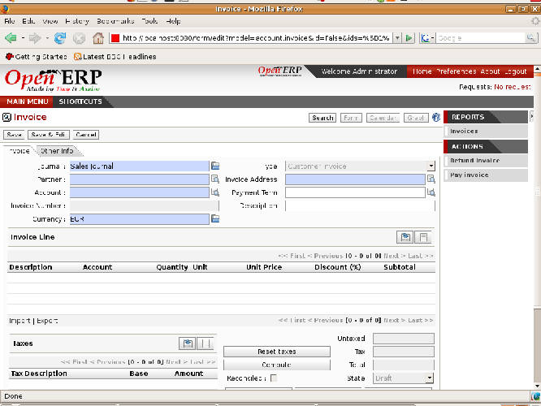
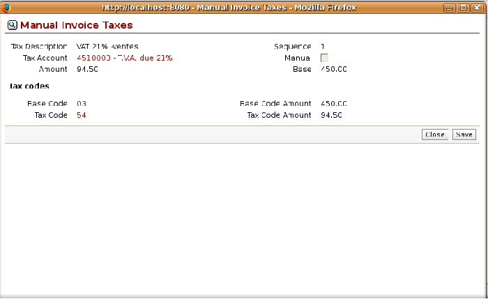

.. i18n: Invoicing
.. i18n: =========

Invoicing
=========

.. i18n: In Open ERP, the concept of “invoice” includes the following documents:

In Open ERP, the concept of “invoice” includes the following documents:

.. i18n: * the customer invoice,
.. i18n: 
.. i18n: * the supplier invoice,
.. i18n: 
.. i18n: * a customer credit note,
.. i18n: 
.. i18n: * a supplier credit note.

* the customer invoice,

* the supplier invoice,

* a customer credit note,

* a supplier credit note.

.. i18n: Only the invoice type and the representation mode differ for each of the four documents. But they're
.. i18n: all stored in the same object type in the system.

Only the invoice type and the representation mode differ for each of the four documents. But they're
all stored in the same object type in the system.

.. i18n: You get the correct form for each of the four types of invoice from the menu you use to open it. The
.. i18n: name of the tab enables you to tell the invoice types apart when you're working on them.

You get the correct form for each of the four types of invoice from the menu you use to open it. The
name of the tab enables you to tell the invoice types apart when you're working on them.

.. i18n: .. index::
.. i18n:    single: invoices; types

.. index::
   single: invoices; types

.. i18n: .. note::  Types of invoice
.. i18n: 
.. i18n: 	There are many advantages in deriving the different types of invoice from the same object. Two of the
.. i18n: 	most important are:
.. i18n: 
.. i18n: 	* In a multi-company environment with inter-company invoicing, a customer invoice in one company
.. i18n: 	  becomes a supplier invoice for the other,
.. i18n: 
.. i18n: 	* This enables you to work and search for all invoices from the same menu. If you're looking for an
.. i18n: 	  invoicing history, Open ERP provides both supplier and customer invoices in the same list, as well
.. i18n: 	  as credit notes.

.. note::  Types of invoice

	There are many advantages in deriving the different types of invoice from the same object. Two of the
	most important are:

	* In a multi-company environment with inter-company invoicing, a customer invoice in one company
	  becomes a supplier invoice for the other,

	* This enables you to work and search for all invoices from the same menu. If you're looking for an
	  invoicing history, Open ERP provides both supplier and customer invoices in the same list, as well
	  as credit notes.

.. i18n: .. index::
.. i18n:    single: credit note

.. index::
   single: credit note

.. i18n: .. note:: Credit Note
.. i18n: 
.. i18n:    A credit note is a document that enables you to cancel an invoice or part of an invoice.

.. note:: Credit Note

   A credit note is a document that enables you to cancel an invoice or part of an invoice.

.. i18n: To access invoices in Open ERP, use the submenus of :menuselection:`Financial Management -->
.. i18n: Invoices`.

To access invoices in Open ERP, use the submenus of :menuselection:`Financial Management -->
Invoices`.

.. i18n: Most of the time, invoices are generated automatically by Open ERP as they are generated from other
.. i18n: processes in the system. So it's not usually necessary to create them manually, but simply approve
.. i18n: or validate them. Open ERP uses the following different ways of generating invoices:

Most of the time, invoices are generated automatically by Open ERP as they are generated from other
processes in the system. So it's not usually necessary to create them manually, but simply approve
or validate them. Open ERP uses the following different ways of generating invoices:

.. i18n: * from Supplier or Customer Orders,
.. i18n: 
.. i18n: * from receipt or despatch of goods,
.. i18n: 
.. i18n: * from work carried out (timesheets, see :ref:`ch-hr`),
.. i18n: 
.. i18n: * from closed tasks (see :ref:`ch-projects`),
.. i18n: 
.. i18n: * from fee charges or other rechargeable expenses (see :ref:`ch-services`).

* from Supplier or Customer Orders,

* from receipt or despatch of goods,

* from work carried out (timesheets, see :ref:`ch-hr`),

* from closed tasks (see :ref:`ch-projects`),

* from fee charges or other rechargeable expenses (see :ref:`ch-services`).

.. i18n: The different processes generate \ ``Draft``\   invoices. These must then be approved by a suitable
.. i18n: system user and sent to the customer. The different invoicing methods are detailed in the following
.. i18n: sections and chapters.

The different processes generate \ ``Draft``\   invoices. These must then be approved by a suitable
system user and sent to the customer. The different invoicing methods are detailed in the following
sections and chapters.

.. i18n: To get the list of draft invoices generated by Open ERP, you can use the menu
.. i18n: :menuselection:`Financial Management --> Invoices --> Customer Invoices --> Draft Customer
.. i18n: Invoices`. You'll find a similar menu for Purchase Invoices that haven't yet been received or
.. i18n: approved :menuselection:`Financial Management --> Invoices --> Supplier Invoices --> Draft Supplier
.. i18n: Invoices`.

To get the list of draft invoices generated by Open ERP, you can use the menu
:menuselection:`Financial Management --> Invoices --> Customer Invoices --> Draft Customer
Invoices`. You'll find a similar menu for Purchase Invoices that haven't yet been received or
approved :menuselection:`Financial Management --> Invoices --> Supplier Invoices --> Draft Supplier
Invoices`.

.. i18n: It's also possible to enter invoices manually. This is usually done for invoices that aren't
.. i18n: associated with an Order (usually purchase orders) or Credit Notes. Also if the system hasn't been
.. i18n: configured correctly you might need to edit the invoice before sending it to the customer.

It's also possible to enter invoices manually. This is usually done for invoices that aren't
associated with an Order (usually purchase orders) or Credit Notes. Also if the system hasn't been
configured correctly you might need to edit the invoice before sending it to the customer.

.. i18n: For example, if you haven't realized that the customer is tax-exempt, the invoice you generate from an
.. i18n: Order will contain tax at the normal rates. It's then possible to edit this out of the invoice
.. i18n: before validating it.

For example, if you haven't realized that the customer is tax-exempt, the invoice you generate from an
Order will contain tax at the normal rates. It's then possible to edit this out of the invoice
before validating it.

.. i18n: Entering a customer invoice
.. i18n: ---------------------------

Entering a customer invoice
---------------------------

.. i18n: The principle of entering data for invoices in Open ERP is very simple, as it enables non-
.. i18n: accountant users to create their own invoices. This means that your accounting information can be
.. i18n: kept up to date all the time as orders are placed and received, and their taxes are calculated.

The principle of entering data for invoices in Open ERP is very simple, as it enables non-
accountant users to create their own invoices. This means that your accounting information can be
kept up to date all the time as orders are placed and received, and their taxes are calculated.

.. i18n: At the same time it allows people who have more accounting knowledge to keep full control over the
.. i18n: accounting entries that are being generated. Each value proposed by Open ERP can be modified later
.. i18n: if needed.

At the same time it allows people who have more accounting knowledge to keep full control over the
accounting entries that are being generated. Each value proposed by Open ERP can be modified later
if needed.

.. i18n: Start by manually entering a customer invoice. Use :menuselection:`Financial Management --> Invoices
.. i18n: --> Customer Invoices` for this.

Start by manually entering a customer invoice. Use :menuselection:`Financial Management --> Invoices
--> Customer Invoices` for this.

.. i18n: A new invoice form opens for entering information.

A new invoice form opens for entering information.

.. i18n: .. figure::  images/account_invoice_new.png
.. i18n:    :scale: 50
.. i18n:    :align: center
.. i18n: 
.. i18n:    *Entering a new invoice*

   *Entering a new invoice*

.. i18n: The document is composed of three parts:

The document is composed of three parts:

.. i18n: * the top of the invoice, with customer information,
.. i18n: 
.. i18n: * the main body of the invoice, with detailed invoice lines,
.. i18n: 
.. i18n: * the bottom of the page, with detail about the taxes, and the totals.

* the top of the invoice, with customer information,

* the main body of the invoice, with detailed invoice lines,

* the bottom of the page, with detail about the taxes, and the totals.

.. i18n: To enter a document in Open ERP you should always fill in fields in the order that they appear on
.. i18n: screen. Doing it this way means that some of the later fields are filled in automatically from the
.. i18n: selections made in earlier fields. So select the :guilabel:`Partner`, and the following fields are
.. i18n: completed automatically:

To enter a document in Open ERP you should always fill in fields in the order that they appear on
screen. Doing it this way means that some of the later fields are filled in automatically from the
selections made in earlier fields. So select the :guilabel:`Partner`, and the following fields are
completed automatically:

.. i18n: * the invoice address corresponds to the partner contact that was given the address type of 
.. i18n:   :guilabel:`Invoice` in the partner form (or otherwise the address type of :guilabel:`Default`),
.. i18n: 
.. i18n: * the partner account corresponds to the account given in the :guilabel:`Accounting` which is found in the last
.. i18n:   tab of the partner form. By default the software is configured with :guilabel:`Account Receivable` as ``Main
.. i18n:   Receivable`` ,
.. i18n: 
.. i18n: * a specific or a default payment condition can be defined for this partner in the
.. i18n:   :guilabel:`Sales & Purchases` area of the partner form. Payment conditions are generated by rules for the payment of
.. i18n:   the invoice. For example: 50% in 21 days and 50% in 60 days from the end of the month.

* the invoice address corresponds to the partner contact that was given the address type of 
  :guilabel:`Invoice` in the partner form (or otherwise the address type of :guilabel:`Default`),

* the partner account corresponds to the account given in the :guilabel:`Accounting` which is found in the last
  tab of the partner form. By default the software is configured with :guilabel:`Account Receivable` as ``Main
  Receivable`` ,

* a specific or a default payment condition can be defined for this partner in the
  :guilabel:`Sales & Purchases` area of the partner form. Payment conditions are generated by rules for the payment of
  the invoice. For example: 50% in 21 days and 50% in 60 days from the end of the month.

.. i18n: .. index::
.. i18n:    pair: properties; field

.. index::
   pair: properties; field

.. i18n: .. note:: Properties fields
.. i18n: 
.. i18n: 	The Properties fields on the Partner form or the Product form are multi-company fields. The value
.. i18n: 	that the user sees in these fields depends on the company that the user works for.
.. i18n: 
.. i18n: 	If you work in a multi-company environment that's using one database, you have several charts of
.. i18n: 	accounts. Asset and liability accounts for a partner depend on the company that the user works for.

.. note:: Properties fields

	The Properties fields on the Partner form or the Product form are multi-company fields. The value
	that the user sees in these fields depends on the company that the user works for.

	If you work in a multi-company environment that's using one database, you have several charts of
	accounts. Asset and liability accounts for a partner depend on the company that the user works for.

.. i18n: .. index::
.. i18n:    single: navigating relationships
.. i18n:    single: right-click
.. i18n:    single: ctrl-right-click

.. index::
   single: navigating relationships
   single: right-click
   single: ctrl-right-click

.. i18n: .. tip:: Seeing partner relationships
.. i18n: 
.. i18n:    You can reach more information from certain relation fields in Open ERP. 
.. i18n: 	
.. i18n:    * In the web client in read-only mode a relation is commonly a hyperlink
.. i18n:      - it takes you to the main form for that entity, with all of the actions and links. 
.. i18n: 	
.. i18n:    * In the web client in edit mode you can press the keyboard :kbd:`Ctrl` button at the same time 
.. i18n:      as right-clicking in the field to get a
.. i18n:      context menu with links and other options. 
.. i18n: 	
.. i18n:    * And in the GTK clientyou can right-click the field to get that same
.. i18n:      context menu. 
.. i18n: 	
.. i18n:    So one way or another you can rapidly reach the partner's:
.. i18n: 
.. i18n:    * current sales and purchases,
.. i18n: 
.. i18n:    * CRM requests,
.. i18n: 
.. i18n:    * open invoices,
.. i18n: 
.. i18n:    * accounts records,
.. i18n: 
.. i18n:    * payable and receivable accounts.

.. tip:: Seeing partner relationships

   You can reach more information from certain relation fields in Open ERP. 
	
   * In the web client in read-only mode a relation is commonly a hyperlink
     - it takes you to the main form for that entity, with all of the actions and links. 
	
   * In the web client in edit mode you can press the keyboard :kbd:`Ctrl` button at the same time 
     as right-clicking in the field to get a
     context menu with links and other options. 
	
   * And in the GTK clientyou can right-click the field to get that same
     context menu. 
	
   So one way or another you can rapidly reach the partner's:

   * current sales and purchases,

   * CRM requests,

   * open invoices,

   * accounts records,

   * payable and receivable accounts.

.. i18n: You can add more detailed additional information to the invoice and select the currency that you want to invoice in.

You can add more detailed additional information to the invoice and select the currency that you want to invoice in.

.. i18n: Once the invoice heading is saved you must enter the different invoice lines. You could use either
.. i18n: of two techniques:

Once the invoice heading is saved you must enter the different invoice lines. You could use either
of two techniques:

.. i18n: * enter the whole field manually,
.. i18n: 
.. i18n: * use a product to complete the different fields automatically.

* enter the whole field manually,

* use a product to complete the different fields automatically.

.. i18n: .. tip:: Invoice Line Description
.. i18n: 
.. i18n: 	The invoice line description is more of a title than a comment. If you want to add more detailed
.. i18n: 	comments you can use the field in the second tab :guilabel:`Notes`.

.. tip:: Invoice Line Description

	The invoice line description is more of a title than a comment. If you want to add more detailed
	comments you can use the field in the second tab :guilabel:`Notes`.

.. i18n: So select the product \ ``Titanium Alloy Radiator``\ in the product field in an invoice line. The
.. i18n: following fields are then completed automatically:

So select the product \ ``Titanium Alloy Radiator``\ in the product field in an invoice line. The
following fields are then completed automatically:

.. i18n: *  :guilabel:`Description` : this comes from the product, in the language of the partner,
.. i18n: 
.. i18n: *  :guilabel:`Account` : determined by the purchase or sales account defined in the
.. i18n:    product properties. If no account is specified in the product form, Open ERP uses the properties of
.. i18n:    the category that the product is associated with.
.. i18n: 
.. i18n: *  :guilabel:`Unit of Measure` : this is defined by default in the product form,
.. i18n: 
.. i18n: *  :guilabel:`Unit Price` : this is given by the list price in the product form and is expressed
.. i18n:    without taxes,
.. i18n: 
.. i18n: *  :guilabel:`Taxes` : provided by the product form and the partner form.

*  :guilabel:`Description` : this comes from the product, in the language of the partner,

*  :guilabel:`Account` : determined by the purchase or sales account defined in the
   product properties. If no account is specified in the product form, Open ERP uses the properties of
   the category that the product is associated with.

*  :guilabel:`Unit of Measure` : this is defined by default in the product form,

*  :guilabel:`Unit Price` : this is given by the list price in the product form and is expressed
   without taxes,

*  :guilabel:`Taxes` : provided by the product form and the partner form.

.. i18n: .. index::
.. i18n:    single: module; account_tax_include

.. index::
   single: module; account_tax_include

.. i18n: .. tip::  Managing the price with tax included
.. i18n: 
.. i18n: 	By default, Open ERP invoices and processes the price without taxes – they're managed as a
.. i18n: 	separate amount.
.. i18n: 	If you want to have invoices provided with tax included you can install the module
.. i18n: 	:mod:`account_tax_include`.
.. i18n: 
.. i18n: 	The module adds a field on each invoice that enables you to set the invoice to be tax
.. i18n: 	exclusive or tax inclusive.

.. tip::  Managing the price with tax included

	By default, Open ERP invoices and processes the price without taxes – they're managed as a
	separate amount.
	If you want to have invoices provided with tax included you can install the module
	:mod:`account_tax_include`.

	The module adds a field on each invoice that enables you to set the invoice to be tax
	exclusive or tax inclusive.

.. i18n: .. note:: Information about the product
.. i18n: 
.. i18n: 	When you're entering invoice data it can sometimes be useful to get hold of more information about
.. i18n: 	the product you're invoicing.
.. i18n: 	Since you're already in edit mode, you'd press the :guilabel:`Ctrl` key and use a right mouse-click
.. i18n: 	on the :guilabel:`Product` field
.. i18n: 	(in both the web and the GTK clients).
.. i18n: 	Then select the available reports. Open ERP provides three standard reports about the product:
.. i18n: 
.. i18n: 	* forecasts of future stock,
.. i18n: 
.. i18n: 	* product cost structure,
.. i18n: 
.. i18n: 	* location of the product in your warehouses.
.. i18n: 	
.. i18n: 	(At the time of writing this function worked on pop-up windows 
.. i18n: 	of the GTK client but not the web client.)

.. note:: Information about the product

	When you're entering invoice data it can sometimes be useful to get hold of more information about
	the product you're invoicing.
	Since you're already in edit mode, you'd press the :guilabel:`Ctrl` key and use a right mouse-click
	on the :guilabel:`Product` field
	(in both the web and the GTK clients).
	Then select the available reports. Open ERP provides three standard reports about the product:

	* forecasts of future stock,

	* product cost structure,

	* location of the product in your warehouses.
	
	(At the time of writing this function worked on pop-up windows 
	of the GTK client but not the web client.)

.. i18n: You can enter several invoice lines and modify the values that are automatically completed
.. i18n: by Open ERP.

You can enter several invoice lines and modify the values that are automatically completed
by Open ERP.

.. i18n: Once the invoice lines have been entered, you can click :guilabel:`Calculate` on the invoice to get
.. i18n: the following information:

Once the invoice lines have been entered, you can click :guilabel:`Calculate` on the invoice to get
the following information:

.. i18n: * details of tax calculated,
.. i18n: 
.. i18n: * tax rate,
.. i18n: 
.. i18n: * total taxes,
.. i18n: 
.. i18n: * total price.

* details of tax calculated,

* tax rate,

* total taxes,

* total price.

.. i18n: In the :guilabel:`Taxes` area at the bottom left of the invoice you'll find the details of the totals
.. i18n: calculated for different tax rates used in the invoice.

In the :guilabel:`Taxes` area at the bottom left of the invoice you'll find the details of the totals
calculated for different tax rates used in the invoice.

.. i18n: .. tip::  Tax Calculations
.. i18n: 
.. i18n: 	You can double-click on one of the lines in the tax summary areas in the invoice.
.. i18n: 
.. i18n: 	Open ERP then shows you the detail of the tax charges which will form your tax
.. i18n: 	declaration at the end of the period.
.. i18n: 
.. i18n: 	It shows you the total that will be computed in the different parts of the legal declaration. This
.. i18n: 	enables you to manage the declaration in Open ERP automatically.

.. tip::  Tax Calculations

	You can double-click on one of the lines in the tax summary areas in the invoice.

	Open ERP then shows you the detail of the tax charges which will form your tax
	declaration at the end of the period.

	It shows you the total that will be computed in the different parts of the legal declaration. This
	enables you to manage the declaration in Open ERP automatically.

.. i18n: .. figure::  images/account_invoice_tva.png
.. i18n:    :scale: 50
.. i18n:    :align: center
.. i18n: 
.. i18n:    *Detail of tax charges on an invoice*

   *Detail of tax charges on an invoice*

.. i18n: Before approving the invoice you can modify the date and the accounting period, which are entered by
.. i18n: default as today's date. These fields are found on the second tab :guilabel:`Other Information`.

Before approving the invoice you can modify the date and the accounting period, which are entered by
default as today's date. These fields are found on the second tab :guilabel:`Other Information`.

.. i18n: .. index::
.. i18n:    single: invoice layout
.. i18n:    single: module; account_invoice_layout

.. index::
   single: invoice layout
   single: module; account_invoice_layout

.. i18n: .. note:: Invoice layout
.. i18n: 
.. i18n: 	If you want to make your invoice layout more elaborate you can install the module
.. i18n: 	:mod:`account_invoice_layout`. This enables you to add various elements between the lines such as
.. i18n: 	subtotals, sections, separators and notes.

.. note:: Invoice layout

	If you want to make your invoice layout more elaborate you can install the module
	:mod:`account_invoice_layout`. This enables you to add various elements between the lines such as
	subtotals, sections, separators and notes.

.. i18n: Click :guilabel:`Validate` when you want to approve the invoice. It moves from the \ ``Draft``\
.. i18n: state to the \ ``Open``\   state.

Click :guilabel:`Validate` when you want to approve the invoice. It moves from the \ ``Draft``\
state to the \ ``Open``\   state.

.. i18n: When you've validated an invoice, Open ERP gives it a unique number from a defined sequence. By
.. i18n: default it takes the form \ ``Year / Sequence Number``\   for example \ ``2008/00101``\  . If you
.. i18n: want to modify the sequence numbers use the menu :menuselection:`Administration --> Configuration -->
.. i18n: Sequences --> Sequences`.

When you've validated an invoice, Open ERP gives it a unique number from a defined sequence. By
default it takes the form \ ``Year / Sequence Number``\   for example \ ``2008/00101``\  . If you
want to modify the sequence numbers use the menu :menuselection:`Administration --> Configuration -->
Sequences --> Sequences`.

.. i18n: Accounting entries corresponding to this invoice are automatically generated when you approve the
.. i18n: invoice. You see the detail of this by clicking the entry in the :guilabel:`Journal` and searching
.. i18n: there for the account moves generated by that invoice number.

Accounting entries corresponding to this invoice are automatically generated when you approve the
invoice. You see the detail of this by clicking the entry in the :guilabel:`Journal` and searching
there for the account moves generated by that invoice number.

.. i18n: ..index::
.. i18n:   single: taxes; DEEE

..index::
  single: taxes; DEEE

.. i18n: Managing taxes
.. i18n: --------------

Managing taxes
--------------

.. i18n: Details on the product form and the partner form determine the selection of applicable taxes for an
.. i18n: invoice line. By default Open ERP takes account of all the taxes defined in the product form. If a
.. i18n: tax is defined in the Properties tab of the Partner form then Open ERP will base its tax
.. i18n: calculation on the Partner taxes instead, so a Partner that is defined as tax-exempt, for example,
.. i18n: will take precedence over taxes defined in the Product.

Details on the product form and the partner form determine the selection of applicable taxes for an
invoice line. By default Open ERP takes account of all the taxes defined in the product form. If a
tax is defined in the Properties tab of the Partner form then Open ERP will base its tax
calculation on the Partner taxes instead, so a Partner that is defined as tax-exempt, for example,
will take precedence over taxes defined in the Product.

.. i18n: Take the case of the following product

Take the case of the following product

.. i18n: * Applicable taxes:
.. i18n: 
.. i18n: 	- TVA: 19.6% type TVA
.. i18n: 
.. i18n: 	- DEEE: 5.5, type DEEE

* Applicable taxes:

	- TVA: 19.6% type TVA

	- DEEE: 5.5, type DEEE

.. i18n: .. index::
.. i18n:    single: DEEE tax

.. index::
   single: DEEE tax

.. i18n: .. note:: DEEE tax
.. i18n: 
.. i18n: 	The DEEE tax (disposal of electronic and electrical equipment) is an ecological tax that was
.. i18n: 	imposed in France from 2007. It's applied to batteries to finance their recycling and is a fixed
.. i18n: 	sum that's applied to the before-tax amount on the invoice

.. note:: DEEE tax

	The DEEE tax (disposal of electronic and electrical equipment) is an ecological tax that was
	imposed in France from 2007. It's applied to batteries to finance their recycling and is a fixed
	sum that's applied to the before-tax amount on the invoice

.. i18n: If you trade with a company in your own country, and your country has a DEEE-type tax, the
.. i18n: applicable taxes for this invoice could be:

If you trade with a company in your own country, and your country has a DEEE-type tax, the
applicable taxes for this invoice could be:

.. i18n: * DEEE: 5.5,
.. i18n: 
.. i18n: * TVA: 19.6%.

* DEEE: 5.5,

* TVA: 19.6%.

.. i18n: If you sell to a customer in another company in the community (intracommunity), instead, then tax is
.. i18n: not charged. Your foreign partners would then be zero-rated by selecting a 0% tax in the last tab,
.. i18n: :guilabel:`Accounting`. When you create an invoice for this customer, Open ERP will calculate the following
.. i18n: taxes on the product:

If you sell to a customer in another company in the community (intracommunity), instead, then tax is
not charged. Your foreign partners would then be zero-rated by selecting a 0% tax in the last tab,
:guilabel:`Accounting`. When you create an invoice for this customer, Open ERP will calculate the following
taxes on the product:

.. i18n: * DEEE: 5.5,
.. i18n: 
.. i18n: * TVA intracommunity: 0%.

* DEEE: 5.5,

* TVA intracommunity: 0%.

.. i18n: If you haven't entered the parameters in the customer form correctly, Open ERP will suggest incorrect
.. i18n: taxes in the invoice. That's not an insuperable problem because you can always modify the
.. i18n: information directly in the invoice before approving it.

If you haven't entered the parameters in the customer form correctly, Open ERP will suggest incorrect
taxes in the invoice. That's not an insuperable problem because you can always modify the
information directly in the invoice before approving it.

.. i18n: .. tip:: Occasional invoices
.. i18n: 
.. i18n: 	When you create an invoice for a product that will only be bought or sold once you don't have to
.. i18n: 	encode a new product.
.. i18n: 	But you'll have to provide quite a bit of information manually on the invoice line:
.. i18n: 
.. i18n: 	* sale price,
.. i18n: 
.. i18n: 	* applicable taxes,
.. i18n: 
.. i18n: 	* account,
.. i18n: 
.. i18n: 	* product description.

.. tip:: Occasional invoices

	When you create an invoice for a product that will only be bought or sold once you don't have to
	encode a new product.
	But you'll have to provide quite a bit of information manually on the invoice line:

	* sale price,

	* applicable taxes,

	* account,

	* product description.

.. i18n: Cancelling an invoice
.. i18n: ---------------------

Cancelling an invoice
---------------------

.. i18n: By default Open ERP won't allow you to cancel an invoice once it has been approved. Since
.. i18n: accounting entries have been created you theoretically can't go back and delete them. However in
.. i18n: many cases it's more convenient to cancel an invoice when there's an error than to produce a credit
.. i18n: note and reconcile the two entries. Your attitude to this will be influenced by current legislation
.. i18n: in your accounting jurisdiction and your adherence to accounting purity.

By default Open ERP won't allow you to cancel an invoice once it has been approved. Since
accounting entries have been created you theoretically can't go back and delete them. However in
many cases it's more convenient to cancel an invoice when there's an error than to produce a credit
note and reconcile the two entries. Your attitude to this will be influenced by current legislation
in your accounting jurisdiction and your adherence to accounting purity.

.. i18n: Open ERP accommodates either approach. Cancelling an invoice can be permitted by checking the box
.. i18n: :guilabel:`Allow Cancelling Entries` in the Journal corresponding to this invoice. You'll then be allowed to
.. i18n: cancel the invoice if the following two conditions are met:

Open ERP accommodates either approach. Cancelling an invoice can be permitted by checking the box
:guilabel:`Allow Cancelling Entries` in the Journal corresponding to this invoice. You'll then be allowed to
cancel the invoice if the following two conditions are met:

.. i18n: 	#. The accounting entries haven't been reconciled or paid: if they have then you'll have to cancel
.. i18n: 	   the reconciliation.
.. i18n: 
.. i18n: 	#. The accounting period or the fiscal year hasn't already been closed: if it has then no
.. i18n: 	   modification is possible.

	#. The accounting entries haven't been reconciled or paid: if they have then you'll have to cancel
	   the reconciliation.

	#. The accounting period or the fiscal year hasn't already been closed: if it has then no
	   modification is possible.

.. i18n: Cancelling an invoice has the effect of automatically modifying the corresponding accounting
.. i18n: entries.

Cancelling an invoice has the effect of automatically modifying the corresponding accounting
entries.

.. i18n: When the invoice has been cancelled you could then put it back into the 
.. i18n: \ ``Draft``\ state. So you could modify it and approve it again later.

When the invoice has been cancelled you could then put it back into the 
\ ``Draft``\ state. So you could modify it and approve it again later.

.. i18n: .. tip::  Numbering invoices
.. i18n: 
.. i18n: 	Some countries require you to have contiguously numbered invoices (that is, with no break in the sequence).
.. i18n: 	If, after cancelling an invoice that you're not regenerating,
.. i18n: 	you find yourself with a break in the numbering you'd have to go and modify the sequence,
.. i18n: 	redo the invoice and replace the sequence number with its original value.
.. i18n: 
.. i18n: 	You can control the sequences using the menu :menuselection:`Administration --> Configuration -->
.. i18n: 	Sequences --> Sequences`.

.. tip::  Numbering invoices

	Some countries require you to have contiguously numbered invoices (that is, with no break in the sequence).
	If, after cancelling an invoice that you're not regenerating,
	you find yourself with a break in the numbering you'd have to go and modify the sequence,
	redo the invoice and replace the sequence number with its original value.

	You can control the sequences using the menu :menuselection:`Administration --> Configuration -->
	Sequences --> Sequences`.

.. i18n: Cancelling an invoice will cause a break in the number sequence of your invoices. You're
.. i18n: strongly advised to recreate this invoice and re-approve it to fill the hole in the numbering if you can.

Cancelling an invoice will cause a break in the number sequence of your invoices. You're
strongly advised to recreate this invoice and re-approve it to fill the hole in the numbering if you can.

.. i18n: .. tip:: Duplicating a document
.. i18n: 
.. i18n: 	The duplication function can be applied to all the system documents: you can duplicate anything –
.. i18n: 	a product, an order, or a delivery.

.. tip:: Duplicating a document

	The duplication function can be applied to all the system documents: you can duplicate anything –
	a product, an order, or a delivery.

.. i18n: .. note:: Duplicating invoices
.. i18n: 
.. i18n: 	Instead of entering a new invoice each time, you can base an invoice on a similar preceding one
.. i18n: 	and duplicate it. To do this, first search for a suitable existing one. In the web client, show
.. i18n: 	the invoice in read-only (non-editable) form view, then click :guilabel:`Duplicate`. In the GTK client,
.. i18n: 	select :menuselection:`Form --> Duplicate` from the top menu.
.. i18n: 
.. i18n: 	The duplication creates a new invoice in the ``Draft`` state. That enables you to modify it before
.. i18n: 	approving it. Duplicating documents in Open ERP is an intelligent function, which enables the
.. i18n: 	duplicated invoice to be given its own sequence number, today's date, and the draft state, even if
.. i18n: 	the preceding invoice has been paid.

.. note:: Duplicating invoices

	Instead of entering a new invoice each time, you can base an invoice on a similar preceding one
	and duplicate it. To do this, first search for a suitable existing one. In the web client, show
	the invoice in read-only (non-editable) form view, then click :guilabel:`Duplicate`. In the GTK client,
	select :menuselection:`Form --> Duplicate` from the top menu.

	The duplication creates a new invoice in the ``Draft`` state. That enables you to modify it before
	approving it. Duplicating documents in Open ERP is an intelligent function, which enables the
	duplicated invoice to be given its own sequence number, today's date, and the draft state, even if
	the preceding invoice has been paid.

.. i18n: .. note:: Saving partner preferences
.. i18n: 
.. i18n: 	Open ERP has many functions to help you enter data quickly. If you invoice the same products
.. i18n: 	frequently for the same partner you can save the last invoice preferences using conditional
.. i18n: 	default values.
.. i18n: 
.. i18n: 	To test this functionality, create an invoice for a partner and add some lines
.. i18n: 	(from the GTK client). Then hold
.. i18n: 	:kbd:`Ctrl` and click with the right mouse button on the contents of the :guilabel:`Invoices` field and select 
.. i18n: 	:guilabel:`Set as default`. Check the box that indicates this default should apply only to you.
.. i18n: 
.. i18n: 	Then the next time you create an invoice these invoice lines will be
.. i18n: 	automatically created and you'll only have to modify the quantities before confirming the invoice.
.. i18n: 
.. i18n: 	For taxes you could put the default amount in the invoice lines (in France it would be
.. i18n: 	19.6%, in Belgium 21%, in the UK 17.5% or 15%). Doing this you won't forget to add tax when you're
.. i18n: 	manually entering invoices.
.. i18n: 		
.. i18n: 	(The capabilities of the GTK client are more extensive than those of the web client.
.. i18n: 	You can set defaults for multiple lines in the GTK client but only a single line in the web client,
.. i18n: 	so you need to be quite sure what is possible before you use this functionality routinely.)

.. note:: Saving partner preferences

	Open ERP has many functions to help you enter data quickly. If you invoice the same products
	frequently for the same partner you can save the last invoice preferences using conditional
	default values.

	To test this functionality, create an invoice for a partner and add some lines
	(from the GTK client). Then hold
	:kbd:`Ctrl` and click with the right mouse button on the contents of the :guilabel:`Invoices` field and select 
	:guilabel:`Set as default`. Check the box that indicates this default should apply only to you.

	Then the next time you create an invoice these invoice lines will be
	automatically created and you'll only have to modify the quantities before confirming the invoice.

	For taxes you could put the default amount in the invoice lines (in France it would be
	19.6%, in Belgium 21%, in the UK 17.5% or 15%). Doing this you won't forget to add tax when you're
	manually entering invoices.
		
	(The capabilities of the GTK client are more extensive than those of the web client.
	You can set defaults for multiple lines in the GTK client but only a single line in the web client,
	so you need to be quite sure what is possible before you use this functionality routinely.)

.. i18n: .. note:: Getting information by navigating to it
.. i18n: 
.. i18n: 	As you're creating an invoice you'll often find you need extra information about the partner to
.. i18n: 	help you complete the invoice. As described earlier, you can navigate to other
.. i18n: 	information linked to this partner, such as:
.. i18n: 
.. i18n: 	* tasks completed,
.. i18n: 
.. i18n: 	* benefit details,
.. i18n: 
.. i18n: 	* most recent invoices,
.. i18n: 
.. i18n: 	* latest orders.
.. i18n: 
.. i18n: 	Do the same to get information about the products you're invoicing. For example: is there enough
.. i18n: 	stock? When will you be getting more stocks in? What are the costs and normal list prices for this
.. i18n: 	product?
.. i18n: 
.. i18n: 	By making this information easily accessible while you're invoicing, Open ERP greatly simplifies
.. i18n: 	your work in creating the invoice.

.. note:: Getting information by navigating to it

	As you're creating an invoice you'll often find you need extra information about the partner to
	help you complete the invoice. As described earlier, you can navigate to other
	information linked to this partner, such as:

	* tasks completed,

	* benefit details,

	* most recent invoices,

	* latest orders.

	Do the same to get information about the products you're invoicing. For example: is there enough
	stock? When will you be getting more stocks in? What are the costs and normal list prices for this
	product?

	By making this information easily accessible while you're invoicing, Open ERP greatly simplifies
	your work in creating the invoice.

.. i18n: Creating a supplier invoice
.. i18n: ---------------------------

Creating a supplier invoice
---------------------------

.. i18n: The form that manages supplier invoices is very similar to the one for customer invoices. However,
.. i18n: it's been adapted to simplify rapid data entry and monitoring of the amounts recorded.

The form that manages supplier invoices is very similar to the one for customer invoices. However,
it's been adapted to simplify rapid data entry and monitoring of the amounts recorded.

.. i18n: .. tip::  Entering data
.. i18n: 
.. i18n: 	Many companies don't enter data on supplier invoices but simply enter accounting data corresponding to
.. i18n: 	the purchase journal.
.. i18n: 
.. i18n: 	This particularly applies to users that have focused on the accounting system rather than all the
.. i18n: 	capabilities provided by an ERP system.
.. i18n: 	The two approaches reach the same accounting result: some prefer one and others prefer the other
.. i18n: 	depending on their skills.
.. i18n: 
.. i18n: 	However, when you use the Purchase Management functions in Open ERP you should work directly on
.. i18n: 	invoices because they provide Purchase Orders or Goods Receipt documents.

.. tip::  Entering data

	Many companies don't enter data on supplier invoices but simply enter accounting data corresponding to
	the purchase journal.

	This particularly applies to users that have focused on the accounting system rather than all the
	capabilities provided by an ERP system.
	The two approaches reach the same accounting result: some prefer one and others prefer the other
	depending on their skills.

	However, when you use the Purchase Management functions in Open ERP you should work directly on
	invoices because they provide Purchase Orders or Goods Receipt documents.

.. i18n: To enter a new supplier invoice, use the menu :menuselection:`Financial Management --> Invoices -->
.. i18n: Supplier Invoices --> New Supplier Invoice`.

To enter a new supplier invoice, use the menu :menuselection:`Financial Management --> Invoices -->
Supplier Invoices --> New Supplier Invoice`.

.. i18n: Everything is similar to the customer invoice, starting with the :guilabel:`Journal`
.. i18n: unless the default is acceptable, and then the
.. i18n: :guilabel:`Partner`, which will automatically complete the following fields

Everything is similar to the customer invoice, starting with the :guilabel:`Journal`
unless the default is acceptable, and then the
:guilabel:`Partner`, which will automatically complete the following fields

.. i18n: * :guilabel:`Invoice address`,
.. i18n: 
.. i18n: * partner :guilabel:`Account`.

* :guilabel:`Invoice address`,

* partner :guilabel:`Account`.

.. i18n: Unlike the customer invoice you don't have to enter payment conditions – simply a :guilabel:`Due
.. i18n: Date` if you want one. 
.. i18n: If you don't give a due date, Open ERP assumes that this invoice will be paid in cash.
.. i18n: If you want to code in more complete payment conditions than just due date you can use the :guilabel:`Payment
.. i18n: Term` field which you can find on the second tab :guilabel:`Other Info`.

Unlike the customer invoice you don't have to enter payment conditions – simply a :guilabel:`Due
Date` if you want one. 
If you don't give a due date, Open ERP assumes that this invoice will be paid in cash.
If you want to code in more complete payment conditions than just due date you can use the :guilabel:`Payment
Term` field which you can find on the second tab :guilabel:`Other Info`.

.. i18n: You must also enter the invoice :guilabel:`Total` with taxes included. Open ERP uses this amount
.. i18n: to check whether all invoice lines have been entered correctly before it will let you validate the
.. i18n: invoice.

You must also enter the invoice :guilabel:`Total` with taxes included. Open ERP uses this amount
to check whether all invoice lines have been entered correctly before it will let you validate the
invoice.

.. i18n: Indicate the :guilabel:`Currency` if the invoice isn't going to use the default currency, then you can enter
.. i18n: the :guilabel:`Invoice lines`.

Indicate the :guilabel:`Currency` if the invoice isn't going to use the default currency, then you can enter
the :guilabel:`Invoice lines`.

.. i18n: Just like the customer invoice you have the choice of entering all the information manually or using
.. i18n: a product to complete many of the fields automatically. Entering a product, all of the following
.. i18n: values are completed automatically:

Just like the customer invoice you have the choice of entering all the information manually or using
a product to complete many of the fields automatically. Entering a product, all of the following
values are completed automatically:

.. i18n: * the product :guilabel:`Account` is completed from the properties of the product form or the
.. i18n:   :guilabel:`Category` of the product if nothing is defined on the product itself,
.. i18n: 
.. i18n: * the :guilabel:`Taxes` come from the product form and/or the partner form, based on the same
.. i18n:   principles as the customer invoice,
.. i18n: 
.. i18n: * the :guilabel:`Quantity` is set at 1 by default but can be changed manually,
.. i18n: 
.. i18n: * set the :guilabel:`Unit Price` from the total price you're quoted after deducting all
.. i18n:   the different applicable taxes,

* the product :guilabel:`Account` is completed from the properties of the product form or the
  :guilabel:`Category` of the product if nothing is defined on the product itself,

* the :guilabel:`Taxes` come from the product form and/or the partner form, based on the same
  principles as the customer invoice,

* the :guilabel:`Quantity` is set at 1 by default but can be changed manually,

* set the :guilabel:`Unit Price` from the total price you're quoted after deducting all
  the different applicable taxes,

.. i18n: Click :guilabel:`Compute Taxes` to ensure that the totals correspond to those indicated on
.. i18n: the paper invoice from the supplier. When you approve the invoice, Open ERP verifies that the total
.. i18n: amount indicated in the header correspond to the sum of the amounts without tax on the invoice lines
.. i18n: and the different applicable taxes.

Click :guilabel:`Compute Taxes` to ensure that the totals correspond to those indicated on
the paper invoice from the supplier. When you approve the invoice, Open ERP verifies that the total
amount indicated in the header correspond to the sum of the amounts without tax on the invoice lines
and the different applicable taxes.

.. i18n: .. tip:: The Calculate button
.. i18n: 
.. i18n: 	Even though you should calculate the invoice before approving it you don't have to push the
.. i18n: 	:guilabel:`Compute Taxes` button.
.. i18n: 	If you approve the invoice directly the software calculates the different taxes itself and verifies
.. i18n: 	the total.
.. i18n: 
.. i18n: 	This button is only used for making a pre-check of the amount displayed before you confirm it
.. i18n: 	finally.

.. tip:: The Calculate button

	Even though you should calculate the invoice before approving it you don't have to push the
	:guilabel:`Compute Taxes` button.
	If you approve the invoice directly the software calculates the different taxes itself and verifies
	the total.

	This button is only used for making a pre-check of the amount displayed before you confirm it
	finally.

.. i18n: Open ERP automatically completes the :guilabel:`Date Invoiced` and the accounting period, but you can still
.. i18n: change these values manually in the second tab on the invoice before saving it.

Open ERP automatically completes the :guilabel:`Date Invoiced` and the accounting period, but you can still
change these values manually in the second tab on the invoice before saving it.

.. i18n: .. index::
.. i18n:    single: declarations

.. index::
   single: declarations

.. i18n: .. note::  Dates and Accounting Periods
.. i18n: 
.. i18n: 	Accounting periods are treated as legal period declarations. For example a tax declaration for an
.. i18n: 	invoice depends on the accounting period and not on the date of invoicing.
.. i18n: 
.. i18n: 	Depending on whether your declarations are made monthly or quarterly, the fiscal year contains
.. i18n: 	either twelve or four accounting periods.
.. i18n: 
.. i18n: 	The dates are shown in the document you created in the accounting system. They're used for
.. i18n: 	calculating due dates.

.. note::  Dates and Accounting Periods

	Accounting periods are treated as legal period declarations. For example a tax declaration for an
	invoice depends on the accounting period and not on the date of invoicing.

	Depending on whether your declarations are made monthly or quarterly, the fiscal year contains
	either twelve or four accounting periods.

	The dates are shown in the document you created in the accounting system. They're used for
	calculating due dates.

.. i18n: .. index::
.. i18n:    pair: accounts; due date

.. index::
   pair: accounts; due date

.. i18n: The two pieces of information don't have to have the same date. If, for example, you receive an
.. i18n: invoice dated 5th January which relates to goods or services supplied before 31st December, the
.. i18n: invoice may be coded into the December accounting period and thus be recognized in that period for
.. i18n: the tax declaration, while the invoice can remain 5th January which remains the basis of the due
.. i18n: date for payment.

The two pieces of information don't have to have the same date. If, for example, you receive an
invoice dated 5th January which relates to goods or services supplied before 31st December, the
invoice may be coded into the December accounting period and thus be recognized in that period for
the tax declaration, while the invoice can remain 5th January which remains the basis of the due
date for payment.

.. i18n: You can find that the amounts don't correspond with what your supplier has given you on paper for
.. i18n: reasons that can include:

You can find that the amounts don't correspond with what your supplier has given you on paper for
reasons that can include:

.. i18n: * the supplier made a calculation error,
.. i18n: 
.. i18n: * the amounts have been rounded differently.

* the supplier made a calculation error,

* the amounts have been rounded differently.

.. i18n: .. tip:: Rounding Tax
.. i18n: 
.. i18n: 	It often happens that a supplier adds 1 to the total because the tax calculation has been rounded
.. i18n: 	upwards. Some tax amounts aren't valid because of this rounding.
.. i18n: 
.. i18n: 	For example it's impossible to arrive at the amount of 145.50 if you're working to a precision of 2
.. i18n: 	decimal places and a rate of 19.6%:
.. i18n: 
.. i18n: 	* 121.65 x 1.196 = 145.49
.. i18n: 
.. i18n: 	* 121.66 x 1.196 = 145.51

.. tip:: Rounding Tax

	It often happens that a supplier adds 1 to the total because the tax calculation has been rounded
	upwards. Some tax amounts aren't valid because of this rounding.

	For example it's impossible to arrive at the amount of 145.50 if you're working to a precision of 2
	decimal places and a rate of 19.6%:

	* 121.65 x 1.196 = 145.49

	* 121.66 x 1.196 = 145.51

.. i18n: In this case you can modify a value in the lines that the total's based on, or the total amount of
.. i18n: taxes at the bottom left of the form: both are editable so that you can modify them to adjust the
.. i18n: total.

In this case you can modify a value in the lines that the total's based on, or the total amount of
taxes at the bottom left of the form: both are editable so that you can modify them to adjust the
total.

.. i18n: When the totals tally you can validate the invoice. Open ERP then generates the corresponding
.. i18n: accounting entries. You can manage those entries using the :guilabel:`Account`  fields on the
.. i18n: invoice and on each of the invoice lines.

When the totals tally you can validate the invoice. Open ERP then generates the corresponding
accounting entries. You can manage those entries using the :guilabel:`Account`  fields on the
invoice and on each of the invoice lines.

.. i18n: .. index::
.. i18n:    single: Credit Notes

.. index::
   single: Credit Notes

.. i18n: Credit Notes
.. i18n: ------------

Credit Notes
------------

.. i18n: Entering a customer credit note is almost identical to entering a customer invoice. You just start
.. i18n: from the menu :menuselection:`Financial Accounting --> Invoices --> Customer Refunds`.

Entering a customer credit note is almost identical to entering a customer invoice. You just start
from the menu :menuselection:`Financial Accounting --> Invoices --> Customer Refunds`.

.. i18n: Similarly, entering a supplier credit note is the same as that of the supplier invoice and so you
.. i18n: use the menu :menuselection:`Financial Accounting --> Invoices --> Supplier Refunds`.

Similarly, entering a supplier credit note is the same as that of the supplier invoice and so you
use the menu :menuselection:`Financial Accounting --> Invoices --> Supplier Refunds`.

.. i18n: It's easy to generate a credit note quickly from an existing invoice. To do this, select a customer
.. i18n: or supplier invoice and click :guilabel:`Refund invoice` on the toolbar to the right. Open ERP
.. i18n: opens a new credit note form for you in the \ ``Draft``\   state so that you can modify it before
.. i18n: approval.

It's easy to generate a credit note quickly from an existing invoice. To do this, select a customer
or supplier invoice and click :guilabel:`Refund invoice` on the toolbar to the right. Open ERP
opens a new credit note form for you in the \ ``Draft``\   state so that you can modify it before
approval.

.. i18n: .. index::
.. i18n:    pair: multiple; selection
.. i18n:    pair: multiple; action

.. index::
   pair: multiple; selection
   pair: multiple; action

.. i18n: .. tip::  Crediting several invoices
.. i18n: 
.. i18n: 	You can refund several invoices in one operation.
.. i18n: 	From the web client you'd display a list of invoices and then click the checkboxes alongside the
.. i18n: 	ones you want to refund.
.. i18n: 	Then click the :guilabel:`Refund invoice` action from the right toolbar.
.. i18n: 
.. i18n: 	In the GTK client you'd make a multiple selection of invoices by clicking whichever lines you
.. i18n: 	want to select while holding the keyboard :kbd:`Ctrl` button down.
.. i18n: 	Then you'd execute the action by clicking the :guilabel:`Action` (gears) icon on the icon toolbar
.. i18n: 	and selecting :guilabel:`Refund invoice`.

.. tip::  Crediting several invoices

	You can refund several invoices in one operation.
	From the web client you'd display a list of invoices and then click the checkboxes alongside the
	ones you want to refund.
	Then click the :guilabel:`Refund invoice` action from the right toolbar.

	In the GTK client you'd make a multiple selection of invoices by clicking whichever lines you
	want to select while holding the keyboard :kbd:`Ctrl` button down.
	Then you'd execute the action by clicking the :guilabel:`Action` (gears) icon on the icon toolbar
	and selecting :guilabel:`Refund invoice`.

.. i18n: Invoice payment
.. i18n: ---------------

Invoice payment
---------------

.. i18n: The invoice is automatically marked as paid by Open ERP once invoice entries have been reconciled
.. i18n: with payment entries. You yourself don't have to mark the invoices as paid: Open ERP manages that
.. i18n: when you reconcile your payments.

The invoice is automatically marked as paid by Open ERP once invoice entries have been reconciled
with payment entries. You yourself don't have to mark the invoices as paid: Open ERP manages that
when you reconcile your payments.

.. i18n: .. tip::  Reconciling a credit note
.. i18n: 
.. i18n: 	Generally you reconcile the invoice's accounting entries with their payment(s).
.. i18n: 	But you can also reconcile an invoice with the entries from the corresponding credit note instead,
.. i18n: 	to mutually cancel them.

.. tip::  Reconciling a credit note

	Generally you reconcile the invoice's accounting entries with their payment(s).
	But you can also reconcile an invoice with the entries from the corresponding credit note instead,
	to mutually cancel them.

.. i18n: You've probably seen the :guilabel:`Pay Invoice` action button in the toolbar to the right of the invoice
.. i18n: form. This lets you enter payments and get entries reconciled very quickly. This functionality is
.. i18n: usually employed by companies that use Open ERP as a simple billing system and not for complete
.. i18n: accounting. They enter their payments manually on different invoices.

You've probably seen the :guilabel:`Pay Invoice` action button in the toolbar to the right of the invoice
form. This lets you enter payments and get entries reconciled very quickly. This functionality is
usually employed by companies that use Open ERP as a simple billing system and not for complete
accounting. They enter their payments manually on different invoices.

.. i18n: You probably shouldn't use this functionality if you have all of your accounting in Open ERP. It's
.. i18n: much more convenient to manage the payment of invoices when you're entering bank statements and cash
.. i18n: transactions. These allow better control of financial transactions and permit greater flexibility in
.. i18n: areas such as:

You probably shouldn't use this functionality if you have all of your accounting in Open ERP. It's
much more convenient to manage the payment of invoices when you're entering bank statements and cash
transactions. These allow better control of financial transactions and permit greater flexibility in
areas such as:

.. i18n: * advance and partial payments of invoices,
.. i18n: 
.. i18n: * payment of several invoices by several payments,
.. i18n: 
.. i18n: * fine-grained management of different due dates on the same invoices,
.. i18n: 
.. i18n: * management of adjustments if there are different amounts to those on the invoice.

* advance and partial payments of invoices,

* payment of several invoices by several payments,

* fine-grained management of different due dates on the same invoices,

* management of adjustments if there are different amounts to those on the invoice.

.. i18n: .. Copyright © Open Object Press. All rights reserved.

.. Copyright © Open Object Press. All rights reserved.

.. i18n: .. You may take electronic copy of this publication and distribute it if you don't
.. i18n: .. change the content. You can also print a copy to be read by yourself only.

.. You may take electronic copy of this publication and distribute it if you don't
.. change the content. You can also print a copy to be read by yourself only.

.. i18n: .. We have contracts with different publishers in different countries to sell and
.. i18n: .. distribute paper or electronic based versions of this book (translated or not)
.. i18n: .. in bookstores. This helps to distribute and promote the Open ERP product. It
.. i18n: .. also helps us to create incentives to pay contributors and authors using author
.. i18n: .. rights of these sales.

.. We have contracts with different publishers in different countries to sell and
.. distribute paper or electronic based versions of this book (translated or not)
.. in bookstores. This helps to distribute and promote the Open ERP product. It
.. also helps us to create incentives to pay contributors and authors using author
.. rights of these sales.

.. i18n: .. Due to this, grants to translate, modify or sell this book are strictly
.. i18n: .. forbidden, unless Tiny SPRL (representing Open Object Press) gives you a
.. i18n: .. written authorisation for this.

.. Due to this, grants to translate, modify or sell this book are strictly
.. forbidden, unless Tiny SPRL (representing Open Object Press) gives you a
.. written authorisation for this.

.. i18n: .. Many of the designations used by manufacturers and suppliers to distinguish their
.. i18n: .. products are claimed as trademarks. Where those designations appear in this book,
.. i18n: .. and Open Object Press was aware of a trademark claim, the designations have been
.. i18n: .. printed in initial capitals.

.. Many of the designations used by manufacturers and suppliers to distinguish their
.. products are claimed as trademarks. Where those designations appear in this book,
.. and Open Object Press was aware of a trademark claim, the designations have been
.. printed in initial capitals.

.. i18n: .. While every precaution has been taken in the preparation of this book, the publisher
.. i18n: .. and the authors assume no responsibility for errors or omissions, or for damages
.. i18n: .. resulting from the use of the information contained herein.

.. While every precaution has been taken in the preparation of this book, the publisher
.. and the authors assume no responsibility for errors or omissions, or for damages
.. resulting from the use of the information contained herein.

.. i18n: .. Published by Open Object Press, Grand Rosière, Belgium

.. Published by Open Object Press, Grand Rosière, Belgium
