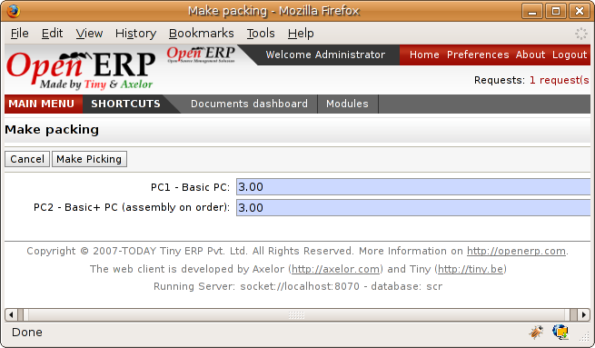
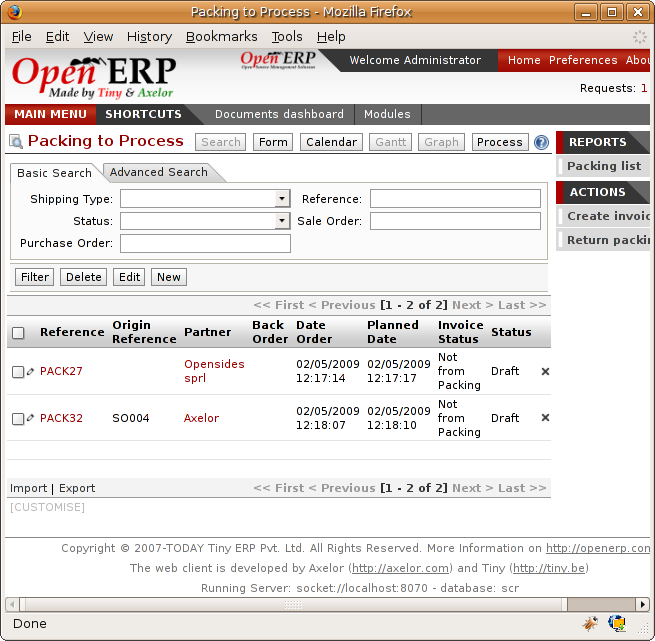

.. i18n: Advanced elements of stock management
.. i18n: =====================================

Advanced elements of stock management
=====================================

.. i18n: In this section you'll enter the details of management and control of stocks.

In this section you'll enter the details of management and control of stocks.

.. i18n: Requirements Calculation / Scheduling
.. i18n: -------------------------------------

Requirements Calculation / Scheduling
-------------------------------------

.. i18n: Requirements calculation is the calculation engine that plans, prioritizes and starts the automated
.. i18n: procurement as a function of rules defined in the products.

Requirements calculation is the calculation engine that plans, prioritizes and starts the automated
procurement as a function of rules defined in the products.

.. i18n: .. note:: Requirements Calculation
.. i18n: 
.. i18n:     Requirements Calculation is often called Scheduling.
.. i18n: 
.. i18n:     By default, it automatically starts once per day.
.. i18n:     You can also start it manually using the menu :menuselection:`Manufacturing --> Start All
.. i18n:     Schedulers`.
.. i18n:     It then uses the parameters defined in the products, the suppliers, and the company
.. i18n:     to determine the priorities between the different product orders, deliveries and purchases from
.. i18n:     suppliers.

.. note:: Requirements Calculation

    Requirements Calculation is often called Scheduling.

    By default, it automatically starts once per day.
    You can also start it manually using the menu :menuselection:`Manufacturing --> Start All
    Schedulers`.
    It then uses the parameters defined in the products, the suppliers, and the company
    to determine the priorities between the different product orders, deliveries and purchases from
    suppliers.

.. i18n: .. index:: Just in Time

.. index:: Just in Time

.. i18n: Just in Time
.. i18n: ------------

Just in Time
------------

.. i18n: By default, scheduling starts automatically once a day. You should make this
.. i18n: run happen overnight to ensure that the system doesn't slow down under a heavy load of scheduling when
.. i18n: you're also trying to use it interactively yourselves. 

By default, scheduling starts automatically once a day. You should make this
run happen overnight to ensure that the system doesn't slow down under a heavy load of scheduling when
you're also trying to use it interactively yourselves. 

.. i18n: To set the time it starts use the menu
.. i18n: :menuselection:`Administration --> Configuration --> Scheduler --> Scheduled Actions`. Select the rule
.. i18n: called 'Run MRP Scheduler' and modify the date and time of the next execution.

To set the time it starts use the menu
:menuselection:`Administration --> Configuration --> Scheduler --> Scheduled Actions`. Select the rule
called 'Run MRP Scheduler' and modify the date and time of the next execution.

.. i18n: .. index::
.. i18n:    single: module; mrp_jit

.. index::
   single: module; mrp_jit

.. i18n: Some companies want to plan orders progressively as they are entered so they don't wait until
.. i18n: procurement orders are planned the next day. Install the module :mod:`mrp_jit` to handle this. Once
.. i18n: it's installed, each requirement (that could result in a Production or Purchase Order) 
.. i18n: will be planned in real time as soon as it's been confirmed.

Some companies want to plan orders progressively as they are entered so they don't wait until
procurement orders are planned the next day. Install the module :mod:`mrp_jit` to handle this. Once
it's installed, each requirement (that could result in a Production or Purchase Order) 
will be planned in real time as soon as it's been confirmed.

.. i18n: Then if you make a customer order with a product that's ``Make To Order`` the quotation request to a
.. i18n: supplier will be generated.

Then if you make a customer order with a product that's ``Make To Order`` the quotation request to a
supplier will be generated.

.. i18n: .. index::
.. i18n:    single: module; sale_supplier_direct_delivery

.. index::
   single: module; sale_supplier_direct_delivery

.. i18n: ..tip :: Delivery from the supplier or to the customer

..tip :: Delivery from the supplier or to the customer

.. i18n:     The :mod:`sale_supplier_direct_delivery` module enables you to deliver the product directly from
.. i18n:     the supplier to the customer. At the time of writing this module is in ``addons-extra`` .
.. i18n:     The logic that the product follows is configured individually for each product and affects only those 
.. i18n:     products marked ``Make to Order``.

    The :mod:`sale_supplier_direct_delivery` module enables you to deliver the product directly from
    the supplier to the customer. At the time of writing this module is in ``addons-extra`` .
    The logic that the product follows is configured individually for each product and affects only those 
    products marked ``Make to Order``.

.. i18n: This mode is not always sensible. Each order is processed immediately it's been confirmed. So if an order
.. i18n: is to be delivered in three months the scheduler will reserve goods in stock for each order once
.. i18n: it's been confirmed. It would have been more sensible to leave these products available for other
.. i18n: orders.

This mode is not always sensible. Each order is processed immediately it's been confirmed. So if an order
is to be delivered in three months the scheduler will reserve goods in stock for each order once
it's been confirmed. It would have been more sensible to leave these products available for other
orders.

.. i18n: If a Purchase Order's :guilabel:`Invoicing Control` is configured ``From Order``, 
.. i18n: the scheduler will immediately create the corresponding
.. i18n: supplier quotation request. It would have been preferable to delay for several weeks if 
.. i18n: you could have used the lead time to group the purchase with other future orders.

If a Purchase Order's :guilabel:`Invoicing Control` is configured ``From Order``, 
the scheduler will immediately create the corresponding
supplier quotation request. It would have been preferable to delay for several weeks if 
you could have used the lead time to group the purchase with other future orders.

.. i18n: So the negative effects of working with the Just in Time module are:

So the negative effects of working with the Just in Time module are:

.. i18n: * Poor priority management between orders,
.. i18n: 
.. i18n: * Additional stocked products.

* Poor priority management between orders,

* Additional stocked products.

.. i18n: .. index::
.. i18n:    single: planning; stock management

.. index::
   single: planning; stock management

.. i18n: Planning
.. i18n: --------

Planning
--------

.. i18n: You've seen that most Open ERP documents can be changed in a planning view. It's the same for
.. i18n: deliveries and goods receipts. You can put them into a calendar view at any time to plan your
.. i18n: deliveries or goods receipts.

You've seen that most Open ERP documents can be changed in a planning view. It's the same for
deliveries and goods receipts. You can put them into a calendar view at any time to plan your
deliveries or goods receipts.

.. i18n: .. figure:: images/stock_planning.png
.. i18n:    :scale: 75
.. i18n:    :align: center
.. i18n: 
.. i18n:    *Planning the deliveries of customer products*

.. figure:: images/stock_planning.png
   :scale: 75
   :align: center

   *Planning the deliveries of customer products*

.. i18n: Planned dates on a packing order are put on each stock move line. Then if you have a packing
.. i18n: order containing several products you don't have to have all of the lines on the order delivered on
.. i18n: the same day. The minimum and maximum dates on a packing order show the earliest and latest dates on
.. i18n: the stock move lines for the packing.

Planned dates on a packing order are put on each stock move line. Then if you have a packing
order containing several products you don't have to have all of the lines on the order delivered on
the same day. The minimum and maximum dates on a packing order show the earliest and latest dates on
the stock move lines for the packing.

.. i18n: If you move a packing order in the calendar view, the planned date on the stock move lines will
.. i18n: automatically be moved as a result.

If you move a packing order in the calendar view, the planned date on the stock move lines will
automatically be moved as a result.

.. i18n: .. index::
.. i18n:    single: back order

.. index::
   single: back order

.. i18n: Management of partial deliveries
.. i18n: --------------------------------

Management of partial deliveries
--------------------------------

.. i18n: Partial deliveries, sometimes called Back Orders, are generated automatically by Open ERP. When you
.. i18n: confirm a customer delivery or the receipt of products from suppliers, Open ERP asks you to confirm
.. i18n: the quantity delivered or received.

Partial deliveries, sometimes called Back Orders, are generated automatically by Open ERP. When you
confirm a customer delivery or the receipt of products from suppliers, Open ERP asks you to confirm
the quantity delivered or received.

.. i18n: If you leave the quantities alone, Open ERP confirms and then closes the order for delivery or receipt.
.. i18n: If you modify a quantity, Open ERP will automatically generate a second delivery or goods receipt document
.. i18n: for the remaining quantities. The first will be confirmed and the second will remain on the list of
.. i18n: waiting deliveries (or receipts).

If you leave the quantities alone, Open ERP confirms and then closes the order for delivery or receipt.
If you modify a quantity, Open ERP will automatically generate a second delivery or goods receipt document
for the remaining quantities. The first will be confirmed and the second will remain on the list of
waiting deliveries (or receipts).

.. i18n: .. figure:: images/stock_picking_wizard.png
.. i18n:    :scale: 75
.. i18n:    :align: center
.. i18n: 
.. i18n:    *Confirmation screen for delivered quantities*

   *Confirmation screen for delivered quantities*

.. i18n: When you open the list of current deliveries, you find the field :guilabel:`Partial delivery` which
.. i18n: shows the reference number of the first delivery sent to the customer. That enables you to quickly
.. i18n: find the deliveries for partial orders each day so that you can treat them as a priority.

When you open the list of current deliveries, you find the field :guilabel:`Partial delivery` which
shows the reference number of the first delivery sent to the customer. That enables you to quickly
find the deliveries for partial orders each day so that you can treat them as a priority.

.. i18n: Receiving supplier products
.. i18n: ---------------------------

Receiving supplier products
---------------------------

.. i18n: Open ERP supports three approaches to controlling data entry on products ordered from suppliers:

Open ERP supports three approaches to controlling data entry on products ordered from suppliers:

.. i18n: * Manual data entry,
.. i18n: 
.. i18n: * Using the goods receipt documents pre-generated by the system,
.. i18n: 
.. i18n: * Selecting from all the products waiting from the supplier, independently from goods receipt documents.

* Manual data entry,

* Using the goods receipt documents pre-generated by the system,

* Selecting from all the products waiting from the supplier, independently from goods receipt documents.

.. i18n: You can see how the configuration of the supplier order affects receipts in detail in :ref:`ch-purchase`.

You can see how the configuration of the supplier order affects receipts in detail in :ref:`ch-purchase`.

.. i18n: .. index::
.. i18n:    single: goods receipt

.. index::
   single: goods receipt

.. i18n: Manual data entry of goods receipt
.. i18n: ----------------------------------

Manual data entry of goods receipt
----------------------------------

.. i18n: To enter data about goods receipt manually you must use the menu :menuselection:`Stock Management
.. i18n: --> Goods Receipt --> New items received`. Then enter the necessary data manually in the goods
.. i18n: receipt form.

To enter data about goods receipt manually you must use the menu :menuselection:`Stock Management
--> Goods Receipt --> New items received`. Then enter the necessary data manually in the goods
receipt form.

.. i18n: .. figure:: images/stock_getting.png
.. i18n:    :scale: 75
.. i18n:    :align: center
.. i18n: 
.. i18n:    *Manual data entry for product receipt*

.. figure:: images/stock_getting.png
   :scale: 75
   :align: center

   *Manual data entry for product receipt*

.. i18n: Confirming pre-generated goods receipt documents
.. i18n: ------------------------------------------------

Confirming pre-generated goods receipt documents
------------------------------------------------

.. i18n: If you use Supplier Orders in Open ERP, product receipts are automatically generated by the system
.. i18n: when the purchase order is confirmed. You don't have to enter any date, just confirm that
.. i18n: the quantities ordered match the quantities received.

If you use Supplier Orders in Open ERP, product receipts are automatically generated by the system
when the purchase order is confirmed. You don't have to enter any date, just confirm that
the quantities ordered match the quantities received.

.. i18n: In this case Open ERP generates a list of all products waiting to be received from the menu
.. i18n: :menuselection:`Stock Management --> Incoming Products --> Packing to Process`.

In this case Open ERP generates a list of all products waiting to be received from the menu
:menuselection:`Stock Management --> Incoming Products --> Packing to Process`.

.. i18n: .. figure:: images/stock_packing_in.png
.. i18n:    :scale: 75
.. i18n:    :align: center
.. i18n: 
.. i18n:    *List of items waiting for receipt*

   *List of items waiting for receipt*

.. i18n: Then you just look for the  corresponding entry using the supplier name or order reference. Click it
.. i18n: and confirm the quantities. If it shows you quantities that differ from the control form, Open ERP
.. i18n: will automatically generate another receipt document that will be set open, waiting for the 
.. i18n: remaining deliveries. You can leave it open or
.. i18n: cancel it if you know that products missed by your supplier will never be delivered.

Then you just look for the  corresponding entry using the supplier name or order reference. Click it
and confirm the quantities. If it shows you quantities that differ from the control form, Open ERP
will automatically generate another receipt document that will be set open, waiting for the 
remaining deliveries. You can leave it open or
cancel it if you know that products missed by your supplier will never be delivered.

.. i18n: Confirmation by selecting products waiting
.. i18n: ------------------------------------------

Confirmation by selecting products waiting
------------------------------------------

.. i18n: The approach shown above is very useful if goods receipts correspond to the original orders. 
.. i18n: If your suppliers deliver items that don't necessarily coincide with the orders, however,
.. i18n: it is easier to work by products received rather than by orders.

The approach shown above is very useful if goods receipts correspond to the original orders. 
If your suppliers deliver items that don't necessarily coincide with the orders, however,
it is easier to work by products received rather than by orders.

.. i18n: In this case you can manually create a new goods receipt using the menu :menuselection:`Stock
.. i18n: Management --> Incoming Products --> New Reception Packing`. Instead of entering all the product lines
.. i18n: manually you can click the button at the lower right :guilabel:`Products not received`. Open ERP
.. i18n: then opens a list of all the goods waiting from that supplier and you can then automatically add
.. i18n: some or all of them on your form. This method of data entry is very useful when you're entering goods
.. i18n: received at one time from several orders.

In this case you can manually create a new goods receipt using the menu :menuselection:`Stock
Management --> Incoming Products --> New Reception Packing`. Instead of entering all the product lines
manually you can click the button at the lower right :guilabel:`Products not received`. Open ERP
then opens a list of all the goods waiting from that supplier and you can then automatically add
some or all of them on your form. This method of data entry is very useful when you're entering goods
received at one time from several orders.

.. i18n: .. index::
.. i18n:    single: routing; logistics

.. index::
   single: routing; logistics

.. i18n: Product routing
.. i18n: ---------------

Product routing
---------------

.. i18n: .. index::
.. i18n:    single: module; stock_location

.. index::
   single: module; stock_location

.. i18n: You should install the :mod:`stock_location` module if routing products to customers, from suppliers or
.. i18n: in your warehouse is determined by the identity of the product itself.

You should install the :mod:`stock_location` module if routing products to customers, from suppliers or
in your warehouse is determined by the identity of the product itself.

.. i18n: .. figure:: images/product_location.png
.. i18n:    :scale: 75
.. i18n:    :align: center
.. i18n: 
.. i18n:    *Managing the paths from one location to another in a product form*

.. figure:: images/product_location.png
   :scale: 75
   :align: center

   *Managing the paths from one location to another in a product form*

.. i18n: This will let you configure logistics rules individually for each product. For example, when a
.. i18n: specific product arrives in stores it can automatically be sent to quality control. In this case it
.. i18n: must be configured with rules on the product form. The fields that make up those rules are:

This will let you configure logistics rules individually for each product. For example, when a
specific product arrives in stores it can automatically be sent to quality control. In this case it
must be configured with rules on the product form. The fields that make up those rules are:

.. i18n: * :guilabel:`Source location` : the rule only applies if a product comes from this location,
.. i18n: 
.. i18n: * :guilabel:`Destination location` : the rule only applies if a product ends up in this location,
.. i18n: 
.. i18n: * :guilabel:`Type of move`: automatic, manual, automatic with no steps,
.. i18n: 
.. i18n: * :guilabel:`Lead time for move`,
.. i18n: 
.. i18n: * :guilabel:`Name of operations` : a free text field which will be included in the automatic stock
.. i18n:   move proposed by Open ERP.

* :guilabel:`Source location` : the rule only applies if a product comes from this location,

* :guilabel:`Destination location` : the rule only applies if a product ends up in this location,

* :guilabel:`Type of move`: automatic, manual, automatic with no steps,

* :guilabel:`Lead time for move`,

* :guilabel:`Name of operations` : a free text field which will be included in the automatic stock
  move proposed by Open ERP.

.. i18n: You'll now see some examples of using these locations and logistics by product:

You'll now see some examples of using these locations and logistics by product:

.. i18n: * A rentable product,
.. i18n: 
.. i18n: * A product bought in China, following its freight by ship from port to port,
.. i18n: 
.. i18n: * A product that you want to send to quality control before putting it in stocks.

* A rentable product,

* A product bought in China, following its freight by ship from port to port,

* A product that you want to send to quality control before putting it in stocks.

.. i18n: Example 1: A rentable product
.. i18n: ^^^^^^^^^^^^^^^^^^^^^^^^^^^^^

Example 1: A rentable product
^^^^^^^^^^^^^^^^^^^^^^^^^^^^^

.. i18n: A rentable product is just a product delivered to a customer that is expected to be  returned in a
.. i18n: few days time. When it has been delivered to the customer, Open ERP will generate a new goods
.. i18n: receipt note with a forecast date at the end of the rental period. So you generate a list of goods
.. i18n: pending receipt that you confirm when they are returned to your stores. To do this you should
.. i18n: configure a product with the following rules:

A rentable product is just a product delivered to a customer that is expected to be  returned in a
few days time. When it has been delivered to the customer, Open ERP will generate a new goods
receipt note with a forecast date at the end of the rental period. So you generate a list of goods
pending receipt that you confirm when they are returned to your stores. To do this you should
configure a product with the following rules:

.. i18n: .. table:: Example Product For Rental
.. i18n: 
.. i18n:    ==================== ==============
.. i18n:    Field                Value
.. i18n:    ==================== ==============
.. i18n:    Source location      Customer
.. i18n:    Destination location Stock
.. i18n:    Type of Movement     Manual
.. i18n:    Lead time            15 days
.. i18n:    Operation            Product return
.. i18n:    ==================== ==============

.. table:: Example Product For Rental

   ==================== ==============
   Field                Value
   ==================== ==============
   Source location      Customer
   Destination location Stock
   Type of Movement     Manual
   Lead time            15 days
   Operation            Product return
   ==================== ==============

.. i18n: Then when the product is delivered to the customer, Open ERP automatically generates a goods receipt
.. i18n: form in the draft state ready for returning it to Stock. This is due in 15 days time. With such a
.. i18n: system your forecasts and stock graphs can always be correct in real time.

Then when the product is delivered to the customer, Open ERP automatically generates a goods receipt
form in the draft state ready for returning it to Stock. This is due in 15 days time. With such a
system your forecasts and stock graphs can always be correct in real time.

.. i18n: Example 2: Management of imports by sea
.. i18n: ^^^^^^^^^^^^^^^^^^^^^^^^^^^^^^^^^^^^^^^

Example 2: Management of imports by sea
^^^^^^^^^^^^^^^^^^^^^^^^^^^^^^^^^^^^^^^

.. i18n: To manage products that follow a complex logistical import path by sea and then into customs, create
.. i18n: as many 'Supplier' locations as there are steps, then create rules to move the product from one
.. i18n: place to the other during the purchase.

To manage products that follow a complex logistical import path by sea and then into customs, create
as many 'Supplier' locations as there are steps, then create rules to move the product from one
place to the other during the purchase.

.. i18n: Take a product that has been bought in China and delivered to you stores in Brussels, Belgium.
.. i18n: Import by sea take around 7 weeks and must go through the following steps:

Take a product that has been bought in China and delivered to you stores in Brussels, Belgium.
Import by sea take around 7 weeks and must go through the following steps:

.. i18n: * Delivery from the supplier to the port of Shanghai: 2 days,
.. i18n: 
.. i18n: * Sea transport from Shanghai to the port of Anvers: 1 month,
.. i18n: 
.. i18n: * Customer at the port of Anvers: 2 weeks,
.. i18n: 
.. i18n: * Delivery by truck from the port of Anvers to your stores: 3 days.

* Delivery from the supplier to the port of Shanghai: 2 days,

* Sea transport from Shanghai to the port of Anvers: 1 month,

* Customer at the port of Anvers: 2 weeks,

* Delivery by truck from the port of Anvers to your stores: 3 days.

.. i18n: You should track the movement of your goods and enter all the documents as each move is made
.. i18n: so that you know where your goods are at any moment, and can estimate when they are likely to
.. i18n: arrive in your stores. To do this, create all the locations for the intermediate steps:

You should track the movement of your goods and enter all the documents as each move is made
so that you know where your goods are at any moment, and can estimate when they are likely to
arrive in your stores. To do this, create all the locations for the intermediate steps:

.. i18n: * Shanghai Port,
.. i18n: 
.. i18n: * Anvers Port,
.. i18n: 
.. i18n: * Anvers Customs.

* Shanghai Port,

* Anvers Port,

* Anvers Customs.

.. i18n: Finally, on the product form, create the following rule to show that when purchased, the goods
.. i18n: don't arrive at your stores directly, but instead at the port of Shanghai. In this example the
.. i18n: stores are configured to enter all the products in a location called 'Input'.

Finally, on the product form, create the following rule to show that when purchased, the goods
don't arrive at your stores directly, but instead at the port of Shanghai. In this example the
stores are configured to enter all the products in a location called 'Input'.

.. i18n: .. table:: Rule to move products automatically to Shanghai Port
.. i18n: 
.. i18n:    ==================== ========================
.. i18n:    Field                Value
.. i18n:    ==================== ========================
.. i18n:    Source location      Input
.. i18n:    Destination location Shanghai Port
.. i18n:    Type of Movement     Automatic without steps
.. i18n:    Lead time            2 days
.. i18n:    Operation            Sending to Shanghai Port
.. i18n:    ==================== ========================

.. table:: Rule to move products automatically to Shanghai Port

   ==================== ========================
   Field                Value
   ==================== ========================
   Source location      Input
   Destination location Shanghai Port
   Type of Movement     Automatic without steps
   Lead time            2 days
   Operation            Sending to Shanghai Port
   ==================== ========================

.. i18n: Open ERP will then change the usual product receipt (which has them arriving in the Input
.. i18n: location) to a delivery from this supplier to the external port. The move is automatically carried
.. i18n: out because operations at this level are too labour-intensive to be done manually.

Open ERP will then change the usual product receipt (which has them arriving in the Input
location) to a delivery from this supplier to the external port. The move is automatically carried
out because operations at this level are too labour-intensive to be done manually.

.. i18n: You then have to create a rule on the product form to move it from one location to another:

You then have to create a rule on the product form to move it from one location to another:

.. i18n: .. table:: Rule to move products manually from Shanghai Port to Anvers Port
.. i18n: 
.. i18n:    ==================== ==============================
.. i18n:    Field                Value
.. i18n:    ==================== ==============================
.. i18n:    Source location      Shanghai Port
.. i18n:    Destination location Anvers Port
.. i18n:    Type of Movement     Manual
.. i18n:    Lead time            30 days
.. i18n:    Operation            Sending to Anvers Port by ship
.. i18n:    ==================== ==============================

.. table:: Rule to move products manually from Shanghai Port to Anvers Port

   ==================== ==============================
   Field                Value
   ==================== ==============================
   Source location      Shanghai Port
   Destination location Anvers Port
   Type of Movement     Manual
   Lead time            30 days
   Operation            Sending to Anvers Port by ship
   ==================== ==============================

.. i18n: .. table:: Rule to move products manually from Anvers Port to Anvers Customs
.. i18n: 
.. i18n:    ==================== =================
.. i18n:    Field                Value
.. i18n:    ==================== =================
.. i18n:    Source location      Anvers Port
.. i18n:    Destination location Anvers Customs
.. i18n:    Type of Movement     Manual
.. i18n:    Lead time            15 days
.. i18n:    Operation            Customs at Anvers
.. i18n:    ==================== =================

.. table:: Rule to move products manually from Anvers Port to Anvers Customs

   ==================== =================
   Field                Value
   ==================== =================
   Source location      Anvers Port
   Destination location Anvers Customs
   Type of Movement     Manual
   Lead time            15 days
   Operation            Customs at Anvers
   ==================== =================

.. i18n: .. table:: Rule to move products manually from Anvers Customs to Stock
.. i18n: 
.. i18n:    ==================== ==============================
.. i18n:    Field                Value
.. i18n:    ==================== ==============================
.. i18n:    Source location      Anvers Customs
.. i18n:    Destination location Stock
.. i18n:    Type of Movement     Manual
.. i18n:    Lead time            3 days
.. i18n:    Operation            Truck transport into stock
.. i18n:    ==================== ==============================

.. table:: Rule to move products manually from Anvers Customs to Stock

   ==================== ==============================
   Field                Value
   ==================== ==============================
   Source location      Anvers Customs
   Destination location Stock
   Type of Movement     Manual
   Lead time            3 days
   Operation            Truck transport into stock
   ==================== ==============================

.. i18n: Once the rules have been configured, Open ERP will automatically prepare all the documents needed
.. i18n: for the internal stock movements of products from one location to another. These documents will be
.. i18n: assigned one after another depending on the order defined in the rules definition.

Once the rules have been configured, Open ERP will automatically prepare all the documents needed
for the internal stock movements of products from one location to another. These documents will be
assigned one after another depending on the order defined in the rules definition.

.. i18n: When the company received notification of the arrival at a port or at customers, the corresponding
.. i18n: move can be confirmed. You can then follow, using each location:

When the company received notification of the arrival at a port or at customers, the corresponding
move can be confirmed. You can then follow, using each location:

.. i18n: * where a given goods item can be found,
.. i18n: 
.. i18n: * quantities of goods awaiting customs,
.. i18n: 
.. i18n: * lead times for goods to get to stores,
.. i18n: 
.. i18n: * the value of stock in different locations.

* where a given goods item can be found,

* quantities of goods awaiting customs,

* lead times for goods to get to stores,

* the value of stock in different locations.

.. i18n: Example 3: Quality Control
.. i18n: ^^^^^^^^^^^^^^^^^^^^^^^^^^

Example 3: Quality Control
^^^^^^^^^^^^^^^^^^^^^^^^^^

.. i18n: You can configure the system to put a given product in the Quality Control bay automatically when it
.. i18n: arrives in your company. To do that you just configure a rule for the product to be placed
.. i18n: in the Quality Control location rather than the Input location when the product is received from the
.. i18n: supplier.

You can configure the system to put a given product in the Quality Control bay automatically when it
arrives in your company. To do that you just configure a rule for the product to be placed
in the Quality Control location rather than the Input location when the product is received from the
supplier.

.. i18n: .. table:: Rule to move products manually from Input to Quality Control
.. i18n: 
.. i18n:    ==================== ==============================
.. i18n:    Field                Value
.. i18n:    ==================== ==============================
.. i18n:    Source location      Input
.. i18n:    Destination location Quality Control
.. i18n:    Type of Movement     Manual
.. i18n:    Lead time            0 days
.. i18n:    Operation            Quality Control
.. i18n:    ==================== ==============================

.. table:: Rule to move products manually from Input to Quality Control

   ==================== ==============================
   Field                Value
   ==================== ==============================
   Source location      Input
   Destination location Quality Control
   Type of Movement     Manual
   Lead time            0 days
   Operation            Quality Control
   ==================== ==============================

.. i18n: Once this product has been received, Open ERP will then automatically manage the request for an
.. i18n: internal movement to send it to the ``Quality Control`` location.

Once this product has been received, Open ERP will then automatically manage the request for an
internal movement to send it to the ``Quality Control`` location.

.. i18n: .. Copyright © Open Object Press. All rights reserved.

.. Copyright © Open Object Press. All rights reserved.

.. i18n: .. You may take electronic copy of this publication and distribute it if you don't
.. i18n: .. change the content. You can also print a copy to be read by yourself only.

.. You may take electronic copy of this publication and distribute it if you don't
.. change the content. You can also print a copy to be read by yourself only.

.. i18n: .. We have contracts with different publishers in different countries to sell and
.. i18n: .. distribute paper or electronic based versions of this book (translated or not)
.. i18n: .. in bookstores. This helps to distribute and promote the Open ERP product. It
.. i18n: .. also helps us to create incentives to pay contributors and authors using author
.. i18n: .. rights of these sales.

.. We have contracts with different publishers in different countries to sell and
.. distribute paper or electronic based versions of this book (translated or not)
.. in bookstores. This helps to distribute and promote the Open ERP product. It
.. also helps us to create incentives to pay contributors and authors using author
.. rights of these sales.

.. i18n: .. Due to this, grants to translate, modify or sell this book are strictly
.. i18n: .. forbidden, unless Tiny SPRL (representing Open Object Press) gives you a
.. i18n: .. written authorisation for this.

.. Due to this, grants to translate, modify or sell this book are strictly
.. forbidden, unless Tiny SPRL (representing Open Object Press) gives you a
.. written authorisation for this.

.. i18n: .. Many of the designations used by manufacturers and suppliers to distinguish their
.. i18n: .. products are claimed as trademarks. Where those designations appear in this book,
.. i18n: .. and Open Object Press was aware of a trademark claim, the designations have been
.. i18n: .. printed in initial capitals.

.. Many of the designations used by manufacturers and suppliers to distinguish their
.. products are claimed as trademarks. Where those designations appear in this book,
.. and Open Object Press was aware of a trademark claim, the designations have been
.. printed in initial capitals.

.. i18n: .. While every precaution has been taken in the preparation of this book, the publisher
.. i18n: .. and the authors assume no responsibility for errors or omissions, or for damages
.. i18n: .. resulting from the use of the information contained herein.

.. While every precaution has been taken in the preparation of this book, the publisher
.. and the authors assume no responsibility for errors or omissions, or for damages
.. resulting from the use of the information contained herein.

.. i18n: .. Published by Open Object Press, Grand Rosière, Belgium

.. Published by Open Object Press, Grand Rosière, Belgium
