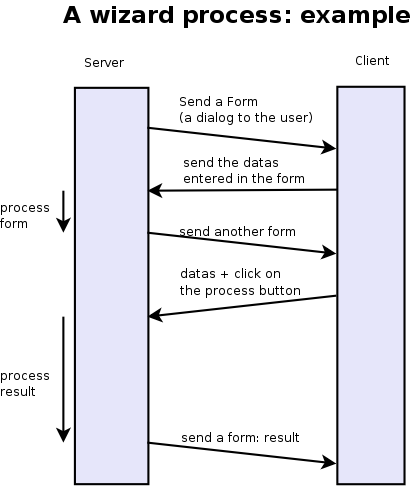

.. i18n: ===============================
.. i18n: Creating Wizard - (The Process)
.. i18n: ===============================

===============================
Creating Wizard - (The Process)
===============================

.. i18n: Introduction
.. i18n: ============
.. i18n: Wizards describe interaction sequences between the client and the server.

Introduction
============
Wizards describe interaction sequences between the client and the server.

.. i18n: Here is, as an example, a typical process for a wizard:

Here is, as an example, a typical process for a wizard:

.. i18n:    1. A window is sent to the client (a form to be completed)
.. i18n:    2. The client sends back the data from the fields which were filled in
.. i18n:    3. The server gets the result, usually execute a function and possibly sends another window/form to the client 

   1. A window is sent to the client (a form to be completed)
   2. The client sends back the data from the fields which were filled in
   3. The server gets the result, usually execute a function and possibly sends another window/form to the client 

.. i18n: .. image:: images/Wizard.png

.. i18n: Here is a screenshot of the wizard used to reconcile transactions (when you click on the gear icon in an account chart):

Here is a screenshot of the wizard used to reconcile transactions (when you click on the gear icon in an account chart):

.. i18n: .. image:: images/Wizard_screenshot.png 

.. image:: images/Wizard_screenshot.png 

.. i18n: Wizards - Principles
.. i18n: ====================
.. i18n: A wizard is a succession of steps. A step is composed of several actions;

Wizards - Principles
====================
A wizard is a succession of steps. A step is composed of several actions;

.. i18n: #. send a form to the client and some buttons
.. i18n: #. get the form result and the button pressed from the client
.. i18n: #. execute some actions
.. i18n: #. send a new action to the client (form, print, ...) 

#. send a form to the client and some buttons
#. get the form result and the button pressed from the client
#. execute some actions
#. send a new action to the client (form, print, ...) 

.. i18n: To define a wizard, you have to create a class inheriting from **wizard.interface** and instantiate it. Each wizard must have a unique name, which can be chosen arbitrarily except for the fact it has to start with the module name (for example: account.move.line.reconcile). The wizard must define a dictionary named **states** which defines all its steps.

To define a wizard, you have to create a class inheriting from **wizard.interface** and instantiate it. Each wizard must have a unique name, which can be chosen arbitrarily except for the fact it has to start with the module name (for example: account.move.line.reconcile). The wizard must define a dictionary named **states** which defines all its steps.

.. i18n: Here is an example of such a class:

Here is an example of such a class:

.. i18n: .. code-block:: python
.. i18n: 
.. i18n: 	class wiz_reconcile(wizard.interface):
.. i18n: 	      states = {
.. i18n: 		   'init': {
.. i18n: 		        'actions': [_trans_rec_get],
.. i18n: 		        'result': {'type': 'form', 
.. i18n: 		                   'arch': _transaction_form, 
.. i18n: 		                   'fields': _transaction_fields,  
.. i18n: 		                   'state':[('reconcile','Reconcile'),('end','Cancel')]}
.. i18n: 		  },
.. i18n: 		   'reconcile': {
.. i18n: 		        'actions': [_trans_rec_reconcile],
.. i18n: 		        'result': {'type': 'state', 'state':'end'}
.. i18n: 		  }
.. i18n: 	     }
.. i18n: 	wiz_reconcile('account.move.line.reconcile');

.. code-block:: python

	class wiz_reconcile(wizard.interface):
	      states = {
		   'init': {
		        'actions': [_trans_rec_get],
		        'result': {'type': 'form', 
		                   'arch': _transaction_form, 
		                   'fields': _transaction_fields,  
		                   'state':[('reconcile','Reconcile'),('end','Cancel')]}
		  },
		   'reconcile': {
		        'actions': [_trans_rec_reconcile],
		        'result': {'type': 'state', 'state':'end'}
		  }
	     }
	wiz_reconcile('account.move.line.reconcile');

.. i18n: The 'states' dictionary define all the states of the wizard. In this example; **init** and **reconcile**. There is another state which is named end which is implicit.

The 'states' dictionary define all the states of the wizard. In this example; **init** and **reconcile**. There is another state which is named end which is implicit.

.. i18n: A wizard always starts in the **init** state and ends in the **end** state.

A wizard always starts in the **init** state and ends in the **end** state.

.. i18n: A state define two things:

A state define two things:

.. i18n: 	#. a list of actions
.. i18n: 	#. a result 

	#. a list of actions
	#. a result 

.. i18n: The list of actions
.. i18n: -------------------
.. i18n: Each step/state of a wizard defines a list of actions which are executed when the wizard enters the state. This list can be empty.

The list of actions
-------------------
Each step/state of a wizard defines a list of actions which are executed when the wizard enters the state. This list can be empty.

.. i18n: The function (actions) must have the following signatures:

The function (actions) must have the following signatures:

.. i18n: .. code-block:: python
.. i18n: 
.. i18n: 	def _trans_rec_get(self, uid, data, res_get=False):

.. code-block:: python

	def _trans_rec_get(self, uid, data, res_get=False):

.. i18n: Where:

Where:

.. i18n:     * **self** is the pointer to the wizard object
.. i18n:     * **uid** is the user ID of the user which is executing the wizard
.. i18n:     * **data** is a dictionary containing the following data:
.. i18n:            * **ids**: the list of ids of resources selected when the user executed the wizard
.. i18n:            * **id**: the id highlighted when the user executed the wizard
.. i18n:            * **form**: a dictionary containing all the values the user completed in the preceding forms. If you change values in this dictionary, the following forms will be pre-completed. 

    * **self** is the pointer to the wizard object
    * **uid** is the user ID of the user which is executing the wizard
    * **data** is a dictionary containing the following data:
           * **ids**: the list of ids of resources selected when the user executed the wizard
           * **id**: the id highlighted when the user executed the wizard
           * **form**: a dictionary containing all the values the user completed in the preceding forms. If you change values in this dictionary, the following forms will be pre-completed. 

.. i18n: The result

The result

.. i18n: Here are some result examples:

Here are some result examples:

.. i18n: Result: next step

Result: next step

.. i18n: .. code-block:: python
.. i18n: 
.. i18n: 	'result': {'type': 'state', 
.. i18n: 	           'state':'end'}

.. code-block:: python

	'result': {'type': 'state', 
	           'state':'end'}

.. i18n: Indicate that the wizard has to continue to the next state: 'end'. If this is the 'end' state, the wizard stops.

Indicate that the wizard has to continue to the next state: 'end'. If this is the 'end' state, the wizard stops.

.. i18n: Result: new dialog for the client

Result: new dialog for the client

.. i18n: .. code-block:: python
.. i18n: 
.. i18n: 	'result': {'type': 'form', 
.. i18n: 	           'arch': _form, 
.. i18n: 	           'fields': _fields, 
.. i18n: 	           'state':[('reconcile','Reconcile'),('end','Cancel')]}

.. code-block:: python

	'result': {'type': 'form', 
	           'arch': _form, 
	           'fields': _fields, 
	           'state':[('reconcile','Reconcile'),('end','Cancel')]}

.. i18n: The type=form indicate that this step is a dialog to the client. The dialog is composed of:

The type=form indicate that this step is a dialog to the client. The dialog is composed of:

.. i18n: #. a form : with fields description and a form description
.. i18n: #. some buttons : on wich the user press after completing the form 

#. a form : with fields description and a form description
#. some buttons : on wich the user press after completing the form 

.. i18n: The form description (arch) is like in the views objects. Here is an example of form:

The form description (arch) is like in the views objects. Here is an example of form:

.. i18n: .. code-block:: xml
.. i18n: 
.. i18n: 	_form = """<?xml version="1.0"?>
.. i18n: 		<form title="Reconciliation">
.. i18n: 		  <separator string="Reconciliation transactions" colspan="4"/>
.. i18n: 		  <field name="trans_nbr"/>
.. i18n: 		  <newline/>
.. i18n: 		  <field name="credit"/>
.. i18n: 		  <field name="debit"/>
.. i18n: 		  <separator string="Write-Off" colspan="4"/>
.. i18n: 		  <field name="writeoff"/>
.. i18n: 		  <newline/>
.. i18n: 		  <field name="writeoff_acc_id" colspan="3"/>
.. i18n: 		</form>
.. i18n: 		"""

.. code-block:: xml

	_form = """<?xml version="1.0"?>
		<form title="Reconciliation">
		  <separator string="Reconciliation transactions" colspan="4"/>
		  <field name="trans_nbr"/>
		  <newline/>
		  <field name="credit"/>
		  <field name="debit"/>
		  <separator string="Write-Off" colspan="4"/>
		  <field name="writeoff"/>
		  <newline/>
		  <field name="writeoff_acc_id" colspan="3"/>
		</form>
		"""

.. i18n: The fields description is similar to the fields described in the python ORM objects. Example:

The fields description is similar to the fields described in the python ORM objects. Example:

.. i18n: .. code-block:: python
.. i18n: 
.. i18n: 	_transaction_fields = {
.. i18n: 	      'trans_nbr': {'string':'# of Transaction', 'type':'integer', 'readonly':True},
.. i18n: 	      'credit': {'string':'Credit amount', 'type':'float', 'readonly':True},
.. i18n: 	      'debit': {'string':'Debit amount', 'type':'float', 'readonly':True},
.. i18n: 	      'writeoff': {'string':'Write-Off amount', 'type':'float', 'readonly':True},
.. i18n: 	      'writeoff_acc_id': {'string':'Write-Off account', 
.. i18n:                                    'type':'many2one', 
.. i18n:                                    'relation':'account.account'
.. i18n:                                  },
.. i18n: 	}

.. code-block:: python

	_transaction_fields = {
	      'trans_nbr': {'string':'# of Transaction', 'type':'integer', 'readonly':True},
	      'credit': {'string':'Credit amount', 'type':'float', 'readonly':True},
	      'debit': {'string':'Debit amount', 'type':'float', 'readonly':True},
	      'writeoff': {'string':'Write-Off amount', 'type':'float', 'readonly':True},
	      'writeoff_acc_id': {'string':'Write-Off account', 
                                   'type':'many2one', 
                                   'relation':'account.account'
                                 },
	}

.. i18n: Each step/state of a wizard can have several buttons. Those are located on the bottom right of the dialog box. The list of buttons for each step of the wizard is declared in the state key of its result dictionary.

Each step/state of a wizard can have several buttons. Those are located on the bottom right of the dialog box. The list of buttons for each step of the wizard is declared in the state key of its result dictionary.

.. i18n: For example:

For example:

.. i18n: .. code-block:: python
.. i18n: 
.. i18n: 	'state':[('end', 'Cancel', 'gtk-cancel'), ('reconcile', 'Reconcile', '', True)]

.. code-block:: python

	'state':[('end', 'Cancel', 'gtk-cancel'), ('reconcile', 'Reconcile', '', True)]

.. i18n: #. the next step name (determine which state will be next)
.. i18n: #. the button string (to display for the client)
.. i18n: #. the gtk stock item without the stock prefix (since 4.2)
.. i18n: #. a boolean, if true the button is set as the default action (since 4.2) 

#. the next step name (determine which state will be next)
#. the button string (to display for the client)
#. the gtk stock item without the stock prefix (since 4.2)
#. a boolean, if true the button is set as the default action (since 4.2) 

.. i18n: Here is a screenshot of this form:

Here is a screenshot of this form:

.. i18n: .. image:: images/Wizard_screenshot1.png

.. image:: images/Wizard_screenshot1.png

.. i18n: Result: call a method to determine which state is next

Result: call a method to determine which state is next

.. i18n: .. code-block:: python
.. i18n: 
.. i18n: 	def _check_refund(self, cr, uid, data, context):
.. i18n: 	    ...
.. i18n: 	    return datas['form']['refund_id'] and 'wait_invoice' or 'end'
.. i18n: 	 
.. i18n: 	    ...
.. i18n: 	 
.. i18n: 	    'result': {'type':'choice', 'next_state':_check_refund}

.. code-block:: python

	def _check_refund(self, cr, uid, data, context):
	    ...
	    return datas['form']['refund_id'] and 'wait_invoice' or 'end'
	 
	    ...
	 
	    'result': {'type':'choice', 'next_state':_check_refund}

.. i18n: Result: print a report

Result: print a report

.. i18n: .. code-block:: python
.. i18n: 
.. i18n: 	def _get_invoice_id(self, uid, datas):
.. i18n: 	      ...
.. i18n: 	      return {'ids': [...]}
.. i18n: 	 
.. i18n: 	      ...
.. i18n: 	 
.. i18n: 	      'actions': [_get_invoice_id],
.. i18n: 	      'result': {'type':'print', 
.. i18n: 		         'report':'account.invoice', 
.. i18n: 		         'get_id_from_action': True, 
.. i18n: 		         'state':'check_refund'}

.. code-block:: python

	def _get_invoice_id(self, uid, datas):
	      ...
	      return {'ids': [...]}
	 
	      ...
	 
	      'actions': [_get_invoice_id],
	      'result': {'type':'print', 
		         'report':'account.invoice', 
		         'get_id_from_action': True, 
		         'state':'check_refund'}

.. i18n: Result: client run an action

Result: client run an action

.. i18n: .. code-block:: python
.. i18n: 
.. i18n: 	def _makeInvoices(self, cr, uid, data, context):
.. i18n: 	    ...
.. i18n: 	    return {
.. i18n: 			'domain': "[('id','in', ["+','.join(map(str,newinv))+"])]",
.. i18n: 			'name': 'Invoices',
.. i18n: 			'view_type': 'form',
.. i18n: 			'view_mode': 'tree,form',
.. i18n: 			'res_model': 'account.invoice',
.. i18n: 			'view_id': False,
.. i18n: 			'context': "{'type':'out_refund'}",
.. i18n: 			'type': 'ir.actions.act_window'
.. i18n: 		}
.. i18n: 	 
.. i18n: 		...
.. i18n: 	 
.. i18n: 		'result': {'type': 'action', 
.. i18n: 		'action': _makeInvoices, 
.. i18n: 		'state': 'end'}

.. code-block:: python

	def _makeInvoices(self, cr, uid, data, context):
	    ...
	    return {
			'domain': "[('id','in', ["+','.join(map(str,newinv))+"])]",
			'name': 'Invoices',
			'view_type': 'form',
			'view_mode': 'tree,form',
			'res_model': 'account.invoice',
			'view_id': False,
			'context': "{'type':'out_refund'}",
			'type': 'ir.actions.act_window'
		}
	 
		...
	 
		'result': {'type': 'action', 
		'action': _makeInvoices, 
		'state': 'end'}

.. i18n: The result of the function must be an all the fields of an ir.actions.* Here it is an ir.action.act_window, so the client will open an new tab for the objects account.invoice For more information about the fields used click here.

The result of the function must be an all the fields of an ir.actions.* Here it is an ir.action.act_window, so the client will open an new tab for the objects account.invoice For more information about the fields used click here.

.. i18n: It is recommended to use the result of a read on the ir.actions object like this:

It is recommended to use the result of a read on the ir.actions object like this:

.. i18n: .. code-block:: python
.. i18n: 
.. i18n: 	def _account_chart_open_window(self, cr, uid, data, context):
.. i18n: 		mod_obj = pooler.get_pool(cr.dbname).get('ir.model.data')
.. i18n: 		act_obj = pooler.get_pool(cr.dbname).get('ir.actions.act_window')
.. i18n: 	 
.. i18n: 		result = mod_obj._get_id(cr, uid, 'account', 'action_account_tree')
.. i18n: 		id = mod_obj.read(cr, uid, [result], ['res_id'])[0]['res_id']
.. i18n: 		result = act_obj.read(cr, uid, [id])[0]
.. i18n: 		result['context'] = str({'fiscalyear': data['form']['fiscalyear']})
.. i18n: 		return result
.. i18n: 	 
.. i18n: 		...
.. i18n: 	 
.. i18n: 		'result': {'type': 'action', 
.. i18n: 		           'action': _account_chart_open_window, 
.. i18n: 		           'state':'end'}

.. code-block:: python

	def _account_chart_open_window(self, cr, uid, data, context):
		mod_obj = pooler.get_pool(cr.dbname).get('ir.model.data')
		act_obj = pooler.get_pool(cr.dbname).get('ir.actions.act_window')
	 
		result = mod_obj._get_id(cr, uid, 'account', 'action_account_tree')
		id = mod_obj.read(cr, uid, [result], ['res_id'])[0]['res_id']
		result = act_obj.read(cr, uid, [id])[0]
		result['context'] = str({'fiscalyear': data['form']['fiscalyear']})
		return result
	 
		...
	 
		'result': {'type': 'action', 
		           'action': _account_chart_open_window, 
		           'state':'end'}

.. i18n: Specification
.. i18n: =============

Specification
=============

.. i18n: Form
.. i18n: ----

Form
----

.. i18n: .. code-block:: xml
.. i18n: 
.. i18n: 	_form = '''<?xml version="1.0"?>
.. i18n: 	<form string="Your String">
.. i18n: 	    <field name="Field 1"/>
.. i18n: 	    <newline/>
.. i18n: 	    <field name="Field 2"/>
.. i18n: 	</form>'''

.. code-block:: xml

	_form = '''<?xml version="1.0"?>
	<form string="Your String">
	    <field name="Field 1"/>
	    <newline/>
	    <field name="Field 2"/>
	</form>'''

.. i18n: Fields
.. i18n: ------

Fields
------

.. i18n: Standard
.. i18n: +++++++++

Standard
+++++++++

.. i18n: .. code-block:: python
.. i18n: 
.. i18n: 	Field type: char, integer, boolean, float, date, datetime
.. i18n: 
.. i18n: 	_fields = {
.. i18n: 	      'str_field': {'string':'product name', 'type':'char', 'readonly':True},
.. i18n: 	}

.. code-block:: python

	Field type: char, integer, boolean, float, date, datetime

	_fields = {
	      'str_field': {'string':'product name', 'type':'char', 'readonly':True},
	}

.. i18n: * **string**: Field label (required)
.. i18n: * **type**: (required)
.. i18n: * **readonly**: (optional) 

* **string**: Field label (required)
* **type**: (required)
* **readonly**: (optional) 

.. i18n: Relational
.. i18n: ++++++++++

Relational
++++++++++

.. i18n: .. code-block:: python
.. i18n: 
.. i18n: 	Field type: one2one,many2one,one2many,many2many
.. i18n: 
.. i18n: 	_fields = {
.. i18n: 	    'field_id': {'string':'Write-Off account', 'type':'many2one', 'relation':'account.account'}
.. i18n: 	}

.. code-block:: python

	Field type: one2one,many2one,one2many,many2many

	_fields = {
	    'field_id': {'string':'Write-Off account', 'type':'many2one', 'relation':'account.account'}
	}

.. i18n: * **string**: Field label (required)
.. i18n: * **type**: (required)
.. i18n: * **relation**: name of the relation object 

* **string**: Field label (required)
* **type**: (required)
* **relation**: name of the relation object 

.. i18n: Add A New Wizard
.. i18n: ================

Add A New Wizard
================

.. i18n: To create a new wizard, you must:

To create a new wizard, you must:

.. i18n:     * create the wizard definition in a .py file
.. i18n:           * wizards are usually defined in the wizard subdirectory of their module as in server/bin/addons/module_name/wizard/your_wizard_name.py 
.. i18n:     * add your wizard to the list of import statements in the __init__.py file of your module's wizard subdirectory.
.. i18n:     * declare your wizard in the database 

    * create the wizard definition in a .py file
          * wizards are usually defined in the wizard subdirectory of their module as in server/bin/addons/module_name/wizard/your_wizard_name.py 
    * add your wizard to the list of import statements in the __init__.py file of your module's wizard subdirectory.
    * declare your wizard in the database 

.. i18n: The declaration is needed to map the wizard with a key of the client; when to launch which client. To declare a new wizard, you need to add it to the module_name_wizard.xml file, which contains all the wizard declarations for the module. If that file does not exist, you need to create it first.

The declaration is needed to map the wizard with a key of the client; when to launch which client. To declare a new wizard, you need to add it to the module_name_wizard.xml file, which contains all the wizard declarations for the module. If that file does not exist, you need to create it first.

.. i18n: Here is an example of the account_wizard.xml file;

Here is an example of the account_wizard.xml file;

.. i18n: .. code-block:: python
.. i18n: 
.. i18n: 	<?xml version="1.0"?>
.. i18n: 	<terp>
.. i18n: 	    <data>
.. i18n: 		<delete model="ir.actions.wizard" search="[('wiz_name','like','account.')]" />
.. i18n: 		<wizard string="Reconcile Transactions" model="account.move.line" 
.. i18n:                         name="account.move.line.reconcile" />
.. i18n: 		<wizard string="Verify Transac steptions" model="account.move.line" 
.. i18n:                         name="account.move.line.check" keyword="tree_but_action" /> 
.. i18n: 		<wizard string="Verify Transactions" model="account.move.line"  
.. i18n:                         name="account.move.line.check" />
.. i18n: 		<wizard string="Print Journal" model="account.account" 
.. i18n:                         name="account.journal" />
.. i18n: 		<wizard string="Split Invoice" model="account.invoice" 
.. i18n:                         name="account.invoice.split" />
.. i18n: 		<wizard string="Refund Invoice" model="account.invoice" 
.. i18n:                         name="account.invoice.refund" />
.. i18n: 	    </data>
.. i18n: 	</terp>

.. code-block:: python

	<?xml version="1.0"?>
	<terp>
	    <data>
		<delete model="ir.actions.wizard" search="[('wiz_name','like','account.')]" />
		<wizard string="Reconcile Transactions" model="account.move.line" 
                        name="account.move.line.reconcile" />
		<wizard string="Verify Transac steptions" model="account.move.line" 
                        name="account.move.line.check" keyword="tree_but_action" /> 
		<wizard string="Verify Transactions" model="account.move.line"  
                        name="account.move.line.check" />
		<wizard string="Print Journal" model="account.account" 
                        name="account.journal" />
		<wizard string="Split Invoice" model="account.invoice" 
                        name="account.invoice.split" />
		<wizard string="Refund Invoice" model="account.invoice" 
                        name="account.invoice.refund" />
	    </data>
	</terp>

.. i18n: Attributes for the wizard tag:

Attributes for the wizard tag:

.. i18n:     * **id** (optional):
.. i18n:     * **string**: The string which will be displayed if there are several wizards for one resthe user will be presented a list with wizards names).
.. i18n:     * **model**: The name of the **model** where the data needed by the wizard is.
.. i18n:     * **name**: The name of the wizard. It is used internally and should be unique.
.. i18n:     * **replace** (optional): Whether or not the wizard should override **all** existing wizards for this model. Default value: False.
.. i18n:     * **menu** (optional): Whether or not (True|False) to link the wizard with the 'gears' button (i.e. show the button or not). Default value: True.
.. i18n:     * **keyword** (optional): Bind the wizard to another action (print icon, gear icon, ...). Possible values for the keyword attribute are:
.. i18n:           * **client_print_multi**: the print icon in a form
.. i18n:           * **client_action_multi**: the 'gears' icon in a form
.. i18n:           * **tree_but_action**: the 'gears' icon in a tree view (with the shortcuts on the left)
.. i18n:           * **tree_but_open**: the double click on a branch of a tree (with the shortcuts on the left). For example, this is used, to bind wizards in the menu. 

    * **id** (optional):
    * **string**: The string which will be displayed if there are several wizards for one resthe user will be presented a list with wizards names).
    * **model**: The name of the **model** where the data needed by the wizard is.
    * **name**: The name of the wizard. It is used internally and should be unique.
    * **replace** (optional): Whether or not the wizard should override **all** existing wizards for this model. Default value: False.
    * **menu** (optional): Whether or not (True|False) to link the wizard with the 'gears' button (i.e. show the button or not). Default value: True.
    * **keyword** (optional): Bind the wizard to another action (print icon, gear icon, ...). Possible values for the keyword attribute are:
          * **client_print_multi**: the print icon in a form
          * **client_action_multi**: the 'gears' icon in a form
          * **tree_but_action**: the 'gears' icon in a tree view (with the shortcuts on the left)
          * **tree_but_open**: the double click on a branch of a tree (with the shortcuts on the left). For example, this is used, to bind wizards in the menu. 

.. i18n: **__terp__.py**

**__terp__.py**

.. i18n: If the wizard you created is the first one of its module, you probably had to create the modulename_wizard.xml file yourself. In that case, it should be added to the update_xml field of the __terp__.py file of the module.

If the wizard you created is the first one of its module, you probably had to create the modulename_wizard.xml file yourself. In that case, it should be added to the update_xml field of the __terp__.py file of the module.

.. i18n: Here is, for example, the **__terp__.py** file for the account module.

Here is, for example, the **__terp__.py** file for the account module.

.. i18n: .. code-block:: python
.. i18n: 
.. i18n: 	{
.. i18n: 	    "name": Open ERP Accounting",
.. i18n: 	    "version": "0.1",
.. i18n: 	    "depends": ["base"],
.. i18n: 	    "init_xml": ["account_workflow.xml", "account_data.xml"],
.. i18n: 	    "update_xml": ["account_view.xml","account_report.xml", "account_wizard.xml"],
.. i18n: 	}

.. code-block:: python

	{
	    "name": Open ERP Accounting",
	    "version": "0.1",
	    "depends": ["base"],
	    "init_xml": ["account_workflow.xml", "account_data.xml"],
	    "update_xml": ["account_view.xml","account_report.xml", "account_wizard.xml"],
	}

.. i18n: osv_memory Wizard System
.. i18n: ========================
.. i18n: To develop osv_memory wizard, just create a normal object, But instead of inheriting from osv.osv, Inherit from osv.osv_memory. Methods of "wizard" are in object and if the wizard is complex, You can define workflow on object. osv_memory object is managed in memory instead of storing in postgresql.

osv_memory Wizard System
========================
To develop osv_memory wizard, just create a normal object, But instead of inheriting from osv.osv, Inherit from osv.osv_memory. Methods of "wizard" are in object and if the wizard is complex, You can define workflow on object. osv_memory object is managed in memory instead of storing in postgresql.

.. i18n: That's all, nothing more than just changing the inherit.

That's all, nothing more than just changing the inherit.

.. i18n: So what makes them looks like 'old' wizards?

So what makes them looks like 'old' wizards?

.. i18n:     * In the action that opens the object, you can put 

    * In the action that opens the object, you can put 

.. i18n: .. code-block:: python
.. i18n: 
.. i18n: 	<field name="target">new</field>

.. code-block:: python

	<field name="target">new</field>

.. i18n: It means the object will open in a new window instead of the current one.

It means the object will open in a new window instead of the current one.

.. i18n:     * On a button, you can use <button special="cancel" .../> to close the window. 

    * On a button, you can use <button special="cancel" .../> to close the window. 

.. i18n: Example : In project.py file.

Example : In project.py file.

.. i18n: .. code-block:: python
.. i18n: 
.. i18n: 	class config_compute_remaining(osv.osv_memory):
.. i18n: 	    _name='config.compute.remaining'
.. i18n: 	    def _get_remaining(self,cr, uid, ctx):
.. i18n: 		if 'active_id' in ctx:
.. i18n: 		    return self.pool.get('project.task').browse(cr,uid,ctx['active_id']).remaining_hours
.. i18n: 		return False
.. i18n: 	    _columns = {
.. i18n: 		'remaining_hours' : fields.float('Remaining Hours', digits=(16,2),),
.. i18n: 		    }
.. i18n: 	    _defaults = {
.. i18n: 		'remaining_hours': _get_remaining
.. i18n: 		}
.. i18n: 	    def compute_hours(self, cr, uid, ids, context=None):
.. i18n: 		if 'active_id' in context:
.. i18n: 		    remaining_hrs=self.browse(cr,uid,ids)[0].remaining_hours
.. i18n: 		    self.pool.get('project.task').write(cr,uid,context['active_id'],
.. i18n:                                                          {'remaining_hours' : remaining_hrs})
.. i18n: 		return {
.. i18n: 		        'type': 'ir.actions.act_window_close',
.. i18n: 		 }
.. i18n: 	config_compute_remaining()

.. code-block:: python

	class config_compute_remaining(osv.osv_memory):
	    _name='config.compute.remaining'
	    def _get_remaining(self,cr, uid, ctx):
		if 'active_id' in ctx:
		    return self.pool.get('project.task').browse(cr,uid,ctx['active_id']).remaining_hours
		return False
	    _columns = {
		'remaining_hours' : fields.float('Remaining Hours', digits=(16,2),),
		    }
	    _defaults = {
		'remaining_hours': _get_remaining
		}
	    def compute_hours(self, cr, uid, ids, context=None):
		if 'active_id' in context:
		    remaining_hrs=self.browse(cr,uid,ids)[0].remaining_hours
		    self.pool.get('project.task').write(cr,uid,context['active_id'],
                                                         {'remaining_hours' : remaining_hrs})
		return {
		        'type': 'ir.actions.act_window_close',
		 }
	config_compute_remaining()

.. i18n: * View is same as normal view (Note buttons). 

* View is same as normal view (Note buttons). 

.. i18n: Example :

Example :

.. i18n: .. code-block:: xml
.. i18n: 
.. i18n: 	<record id="view_config_compute_remaining" model="ir.ui.view">
.. i18n: 		    <field name="name">Compute Remaining Hours </field>
.. i18n: 		    <field name="model">config.compute.remaining</field>
.. i18n: 		    <field name="type">form</field>
.. i18n: 		    <field name="arch" type="xml">
.. i18n: 		        <form string="Remaining Hours">
.. i18n: 		            <separator colspan="4" string="Change Remaining Hours"/>
.. i18n: 		            <newline/>
.. i18n: 		            <field name="remaining_hours" widget="float_time"/>
.. i18n: 		            <group col="4" colspan="4">
.. i18n: 		                <button icon="gtk-cancel" special="cancel" string="Cancel"/>
.. i18n: 		                <button icon="gtk-ok" name="compute_hours" string="Update" type="object"/>
.. i18n: 		            </group>
.. i18n: 		        </form>
.. i18n: 		    </field>
.. i18n: 		</record>

.. code-block:: xml

	<record id="view_config_compute_remaining" model="ir.ui.view">
		    <field name="name">Compute Remaining Hours </field>
		    <field name="model">config.compute.remaining</field>
		    <field name="type">form</field>
		    <field name="arch" type="xml">
		        <form string="Remaining Hours">
		            <separator colspan="4" string="Change Remaining Hours"/>
		            <newline/>
		            <field name="remaining_hours" widget="float_time"/>
		            <group col="4" colspan="4">
		                <button icon="gtk-cancel" special="cancel" string="Cancel"/>
		                <button icon="gtk-ok" name="compute_hours" string="Update" type="object"/>
		            </group>
		        </form>
		    </field>
		</record>

.. i18n: * Action is also same as normal action (don't forget to add target attribute) 

* Action is also same as normal action (don't forget to add target attribute) 

.. i18n: Example :

Example :

.. i18n: .. code-block:: xml
.. i18n: 
.. i18n: 	<record id="action_config_compute_remaining" model="ir.actions.act_window">
.. i18n: 	    <field name="name">Compute Remaining Hours</field>
.. i18n: 	    <field name="type">ir.actions.act_window</field>
.. i18n: 	    <field name="res_model">config.compute.remaining</field>
.. i18n: 	    <field name="view_type">form</field>
.. i18n: 	    <field name="view_mode">form</field>
.. i18n: 	    <field name="target">new</field>
.. i18n: 	</record>

.. code-block:: xml

	<record id="action_config_compute_remaining" model="ir.actions.act_window">
	    <field name="name">Compute Remaining Hours</field>
	    <field name="type">ir.actions.act_window</field>
	    <field name="res_model">config.compute.remaining</field>
	    <field name="view_type">form</field>
	    <field name="view_mode">form</field>
	    <field name="target">new</field>
	</record>
