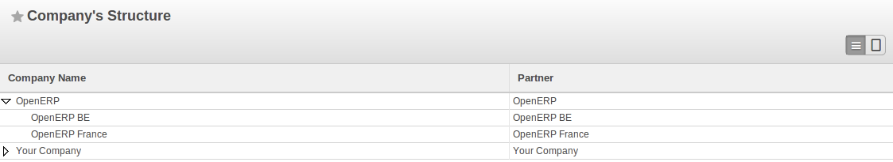
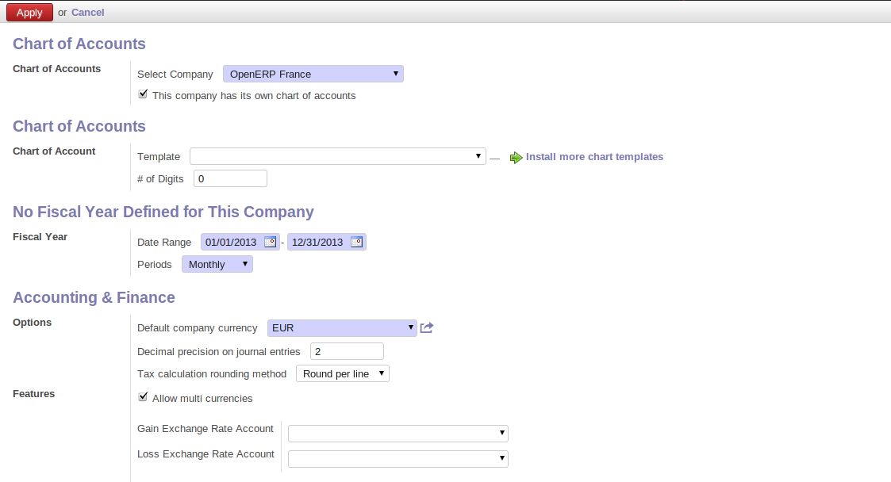
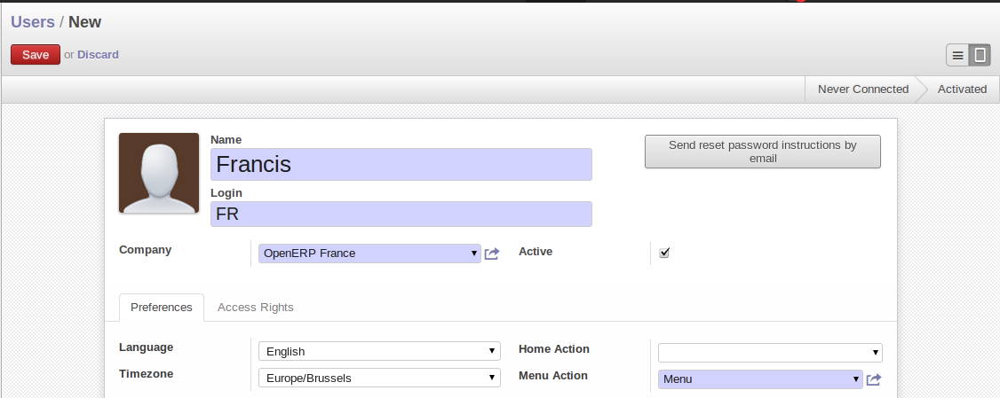
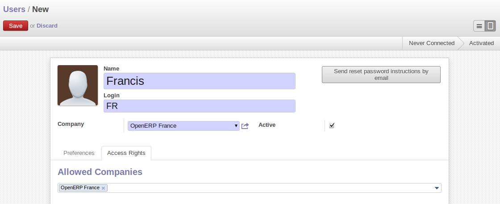
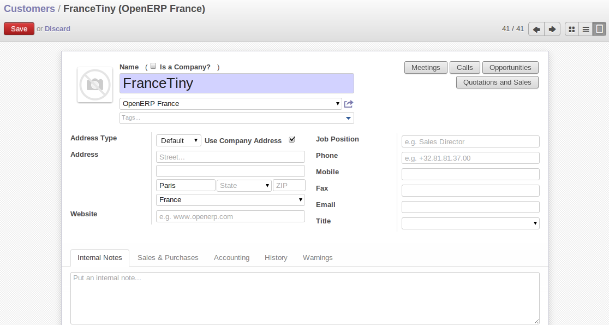
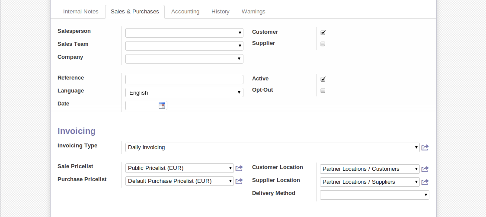
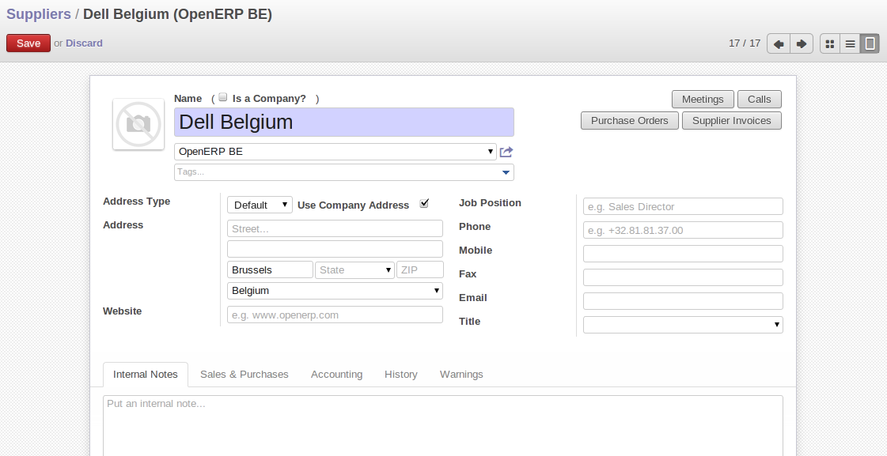
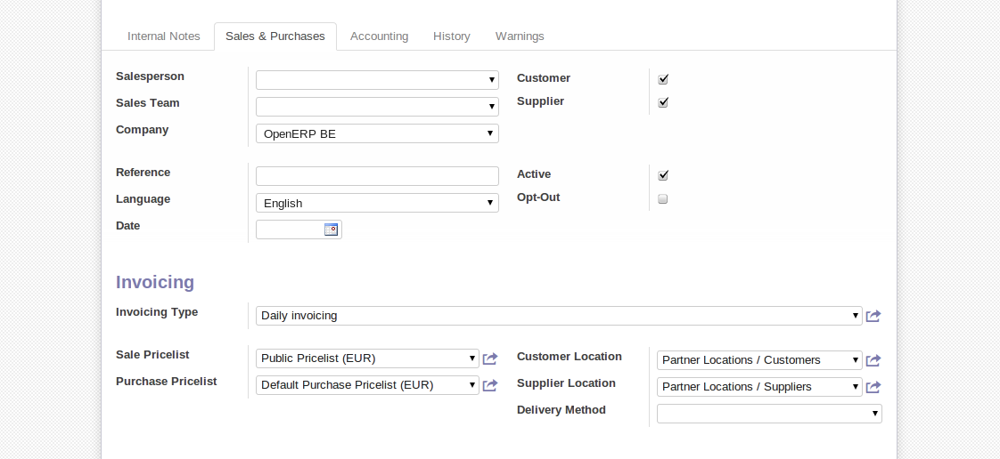

Companies structure
-------------------

Companies
^^^^^^^^^

Three companies have to be defined. One mother company (OpenERP) and two children (OpenERP Belgium and OpenERP France). 

On one hand, the two child companies will be used to support the flow of goods. On the other hand, the mother company 
will be used to aggregate the different information from OpenERP France and OpenERP Belgium.

   
   *Companies structure*
   
.. tip::

	To view the companies' structure, you have to add the group  :guilabel:`Useability/Multi Companies` to your user. 
   
Here are the different configurations for the mother and the children companies (for the children companies, do not 
forget to add a parent company):

.. figure:: images/child_company.png
   :scale: 75
   :align: center
   
   *Companies configuration*
   
Accounting charts
^^^^^^^^^^^^^^^^^

For each company, you have to define an accounting setting. To do this, go to the :menuselection:`Accounting --> 
Configuration --> Financial Accounting --> New company Financial Setting`. 

   
   *Creating accounting charts*

.. note:: Accounting plan

	Each of your companies can have a specific accounting plan.

Users, suppliers & customers
^^^^^^^^^^^^^^^^^^^^^^^^^^^^

The users are used to log in into the system and to give the appropriate right access to each person. This concept is different 
from the employee who is created through the Human Resources module.

Each company needs an user in order to manage the different operations to complete the flow. You can create one user for each 
company without forgetting to select the appropriate company in the ``Contact`` section in the User form after have added the 
company in the ``Companies`` tab.

   
   *User definition*
   

   
   *User definition*

In addition to the user, the companies need suppliers and customers. For OpenERP France, you can define one customer  who will 
order the product that will be defined after, and for OpenERP Belgium, you can define one supplier who will deliver the product to 
the company.

The customers and suppliers go in the same object called `Partners` which can be classified in three ways: customer, supplier and
customer and supplier.

	* Customer: log in with the user of OpenERP France, then go to :menuselection:`Sales --> Address Book --> Customer`
	

   
   *Customer definition*

   
   *Customer definition*
   
	* Supplier: log in with the user of OpenERP Belgium, then go to :menuselection:`Purchases --> Address Book --> Suppliers`

   
   *Supplier definition*

   
   *Supplier definition*
   

.. Copyright © Open Object Press. All rights reserved.

.. You may take electronic copy of this publication and distribute it if you don't
.. change the content. You can also print a copy to be read by yourself only.

.. We have contracts with different publishers in different countries to sell and
.. distribute paper or electronic based versions of this book (translated or not)
.. in bookstores. This helps to distribute and promote the OpenERP product. It
.. also helps us to create incentives to pay contributors and authors using author
.. rights of these sales.

.. Due to this, grants to translate, modify or sell this book are strictly
.. forbidden, unless Tiny SPRL (representing Open Object Press) gives you a
.. written authorisation for this.

.. Many of the designations used by manufacturers and suppliers to distinguish their
.. products are claimed as trademarks. Where those designations appear in this book,
.. and Open Object Press was aware of a trademark claim, the designations have been
.. printed in initial capitals.

.. While every precaution has been taken in the preparation of this book, the publisher
.. and the authors assume no responsibility for errors or omissions, or for damages
.. resulting from the use of the information contained herein.

.. Published by Open Object Press, Grand Rosière, Belgium
