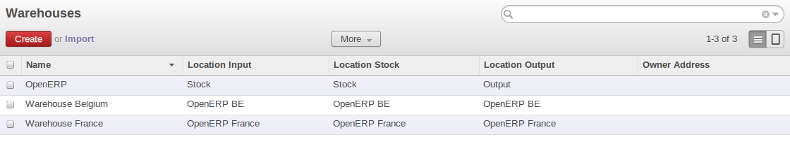
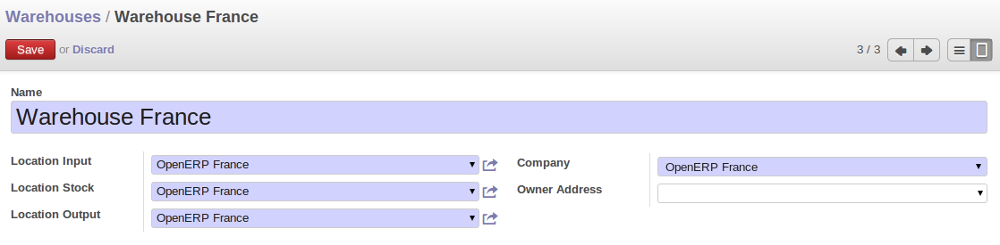
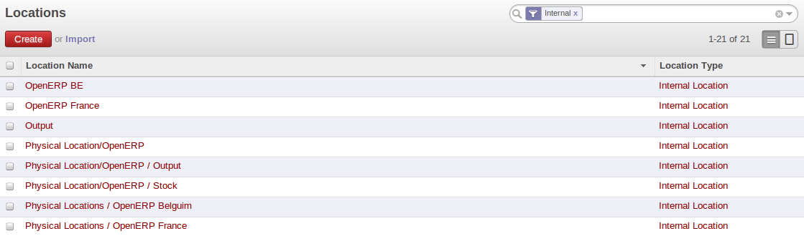
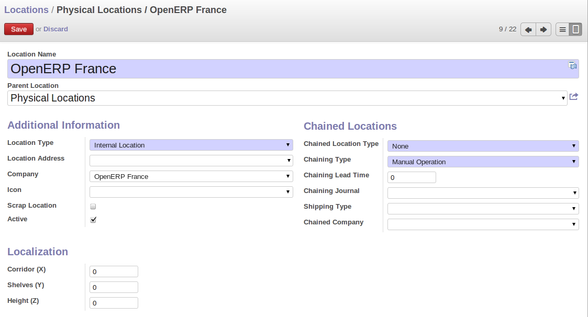
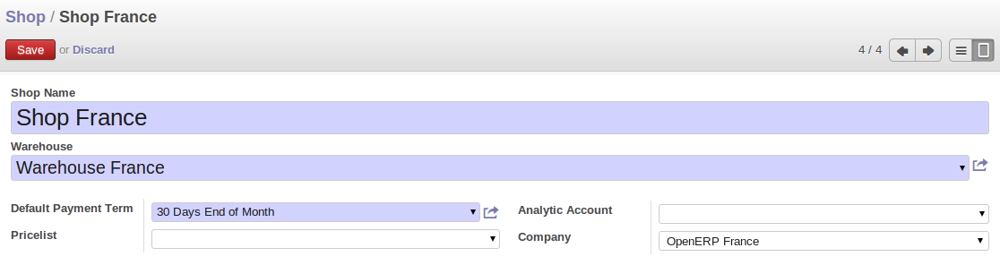

Managing the storage
--------------------

In our configuration, we have to define the way we will store the products.

The stock will be manage by OpenERP Belgium that will share the products with the other companies. OpenERP France will manage the 
sales part for these products. 

OpenERP France will "transfer" the sale order to OpenERP Belgium that will ship the goods to the customer.

By default, OpenERP creates somes locations and warehouses for the first company. By consequence we have to create 
the other warehouses, locations for our child companies. We will start by the warehouses, then we will define 
specific location and we will finish by the of shops.

Warehouses
^^^^^^^^^^

In OpenERP, a warehouse represents your places of physical stock. A warehouse can be structured into several locations at multiple 
levels.

We have to create three new warehouses. One for OpenERP, one for OpenERP Belgium and one for OpenERP France. 

   
   *Warehouses*

Go to :menuselection:`Warehouse --> Configuration --> Warehouse Management --> Warehouses` and create the different warehouses
according to the parameters shown in picture hereafter.

   
   *Warehouses parameters*

Locations
^^^^^^^^^

Locations are used to manage all types of storage place, such as at the customer and production counterparts.

In order to store products, we will create one location for the two child companies. It will support the flow of goods between 
those companies.

   
   *Locations*

Go to :menuselection:`Warehouse --> Configuration --> Warehouse Management --> Locations` and create the different locations with 
the parameters defined in the next picture.

   
   *Locations parameters*

Shops
^^^^^

OpenERP France needs a shop. The objective of this shop is to allow OpenERP France to receive orders from customers and then send 
it to OpenERP Belgium for the delivery of the products.

   
   *Shop definition*

Go to :menuselection:`Sales --> Configuration --> Sales --> Shop`

