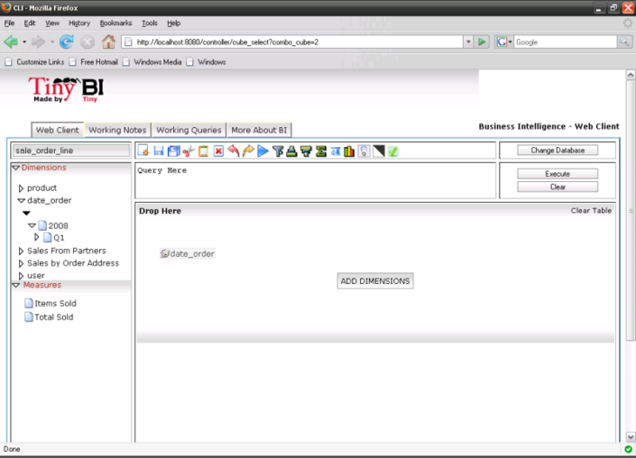
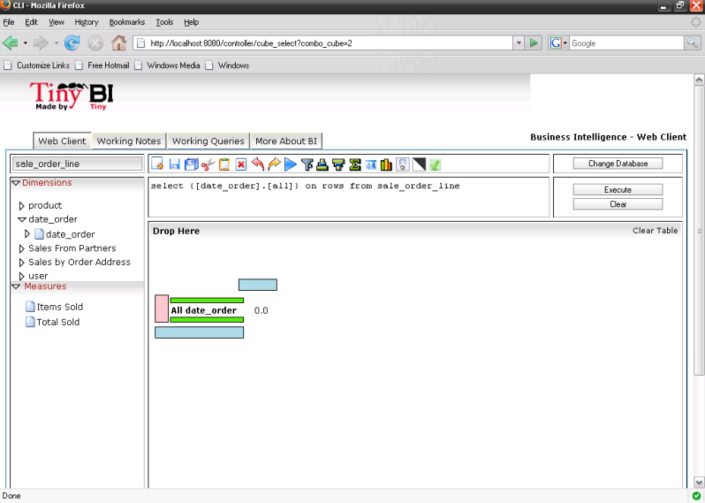
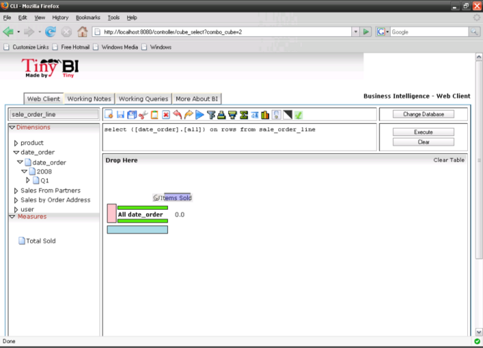
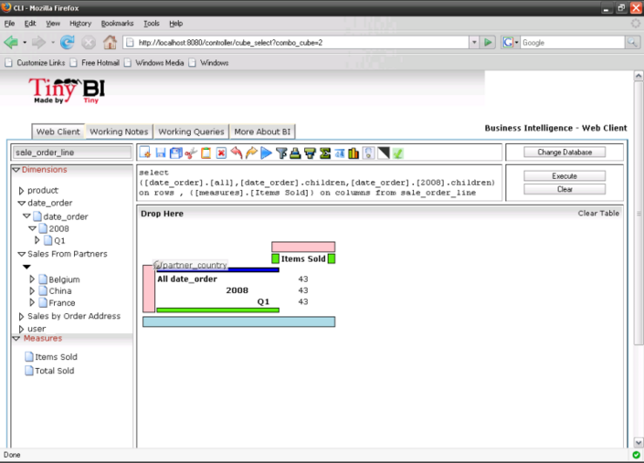

Creating your report with drag and drop
=======================================

Cube Browser uses basic drag-and-drop operations to add data to a report.
Measures represent categories of stored values; Dimensions represent categories of OLAP information

All UI controls update their contents automatically, and the resulting query is displayed on the OLAP Grid.

Queries can be created by Dragging a member on the on the Droppable Area marked with "Add Dimension".

Immediately as the member is dropped resultant query is formed and can be viewed using the toolbar.
Also its executed giving the first output on the Grid.

Second Axis can be added by dropping a member on blue zone.
The output can be seen immediately.
Each user action does a change in query, execute and shows the result.

We can see the query by selecting on the MDX button on the toolbar

(Add image here)

Other members can be added by dropping members at the Green Zones between the already added members.

