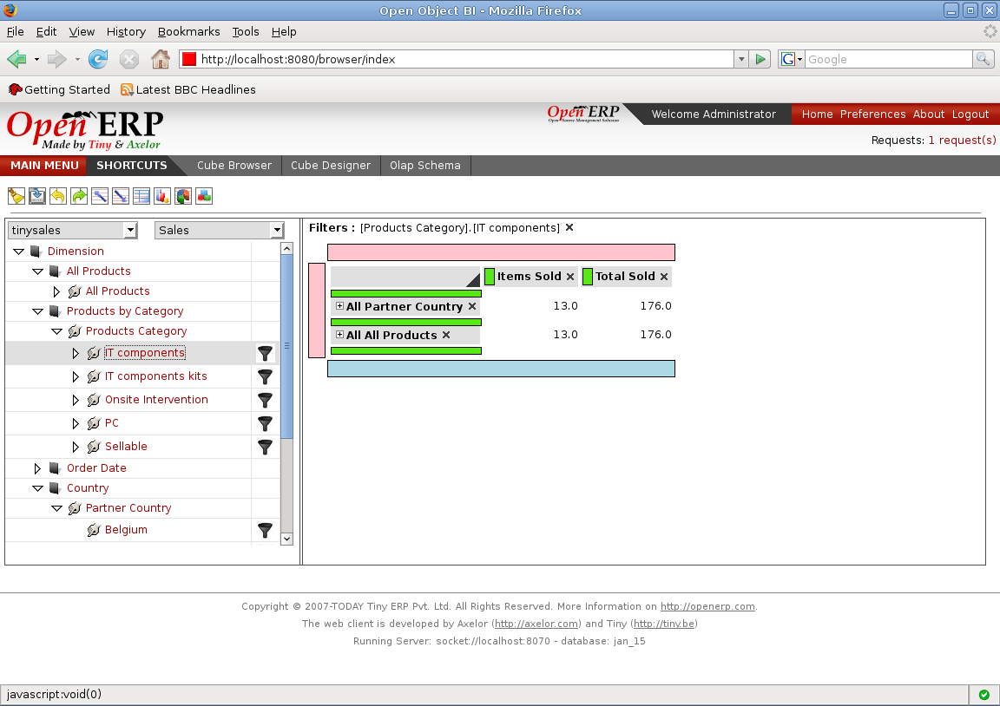

Adding Slicer
=============

A Slicer is filtering on the data fetched by a MDX Query.

It can be added by clicking on filter images on right side on the members.

Filtering gives user a powerful tool for slicing the multidimensional data for organizing and analyzing in more detail.

This filtering of the data allows user to get the required information to the lowest level and analysed the same so to get the best use of his cube's multidimensional data.

