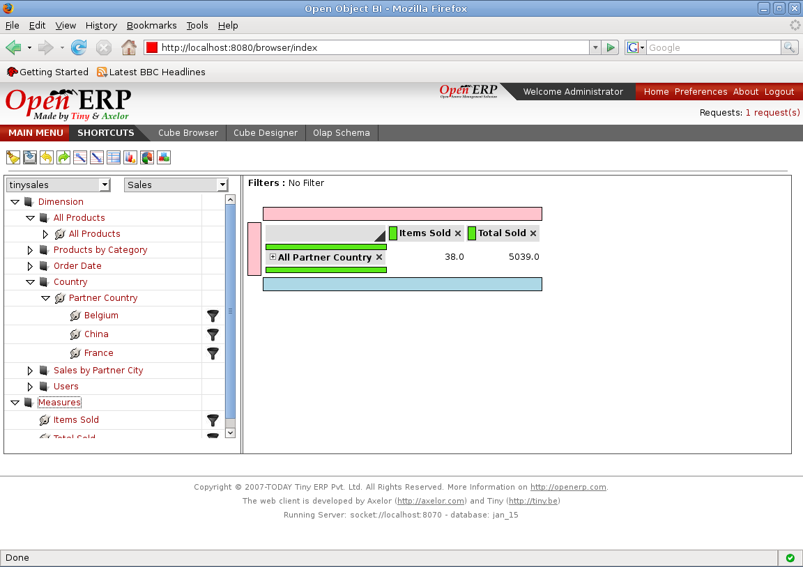
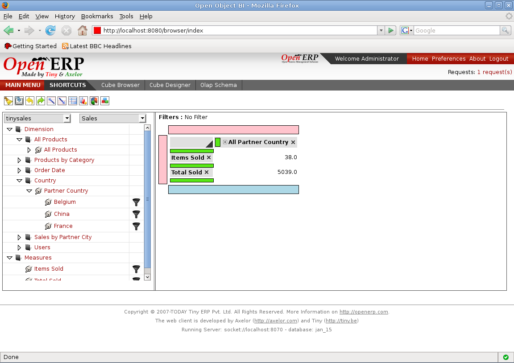

Swapping Rows and Columns
=========================

Once the report is generated in the cube browser we can swap it so the rows moves in to the columns area and column moves in to the rows area. This will make swapping in query part too.

We can form query by drag and drop which will form the report.

----

Once the report is generated, we can swap which will form the report which is shown below

**Now after swapping, we can move on with drag and drop to form queries and generate report.**

