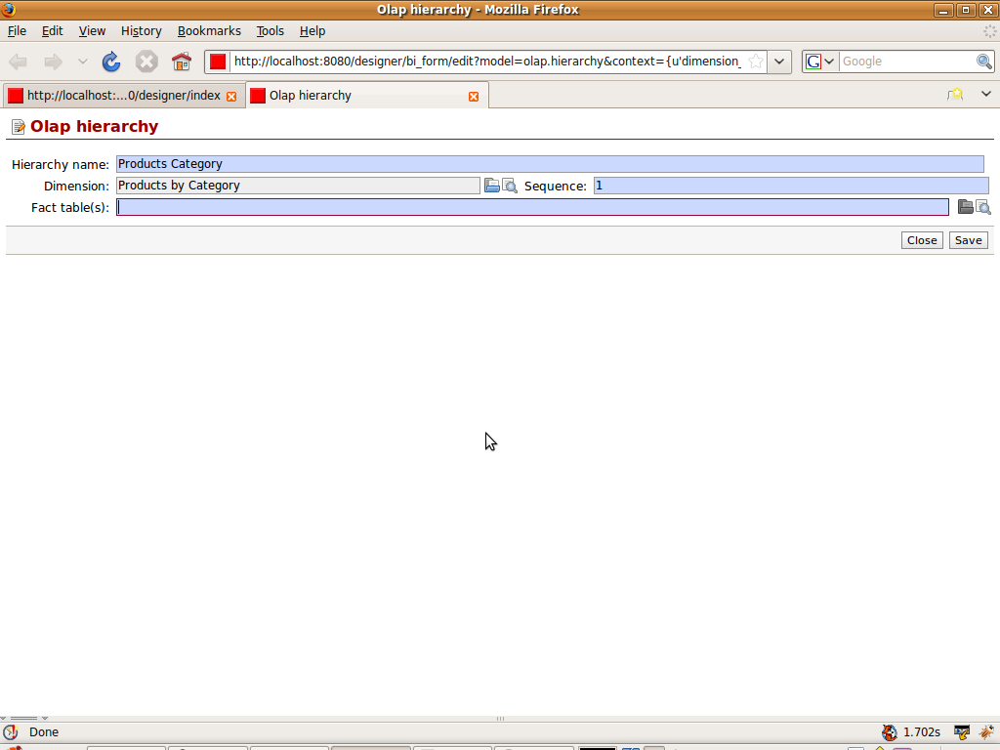
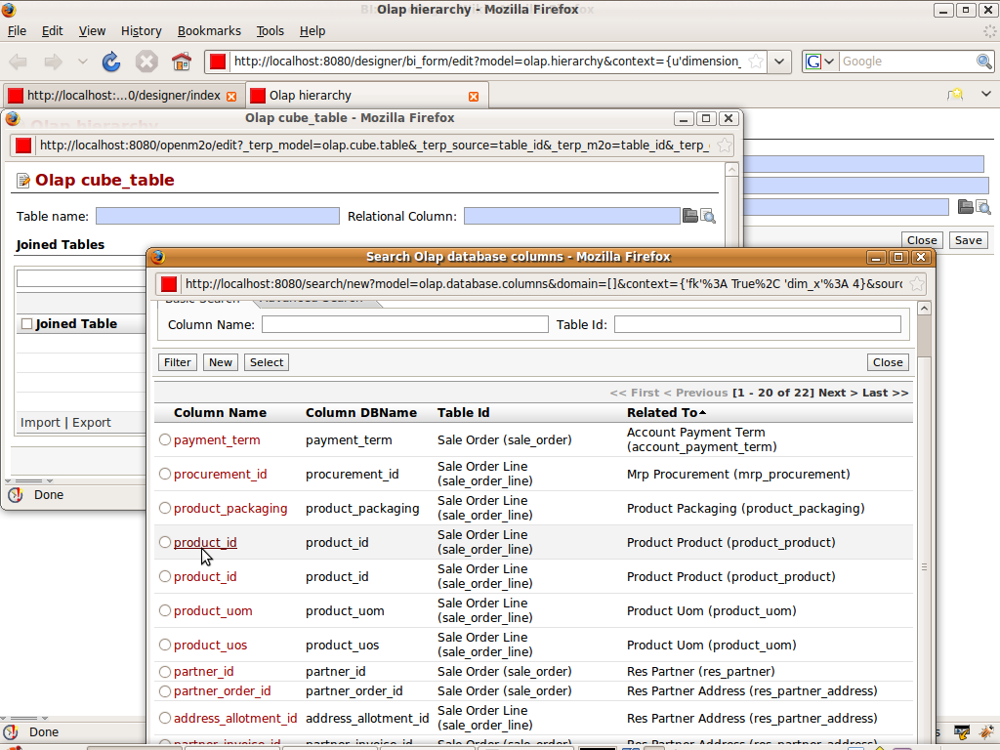
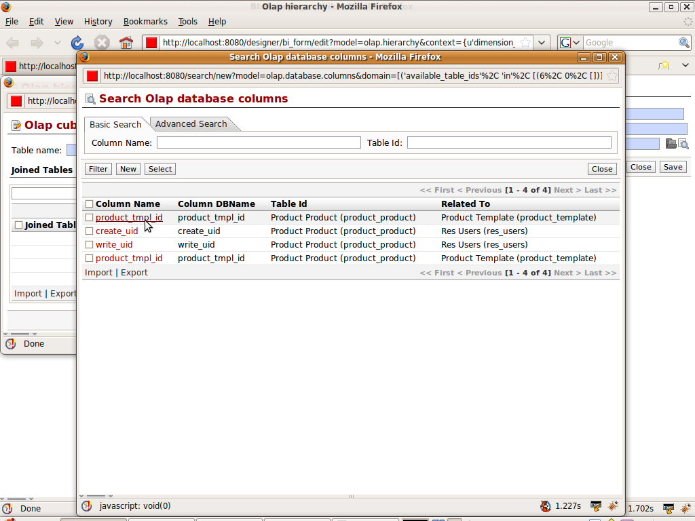
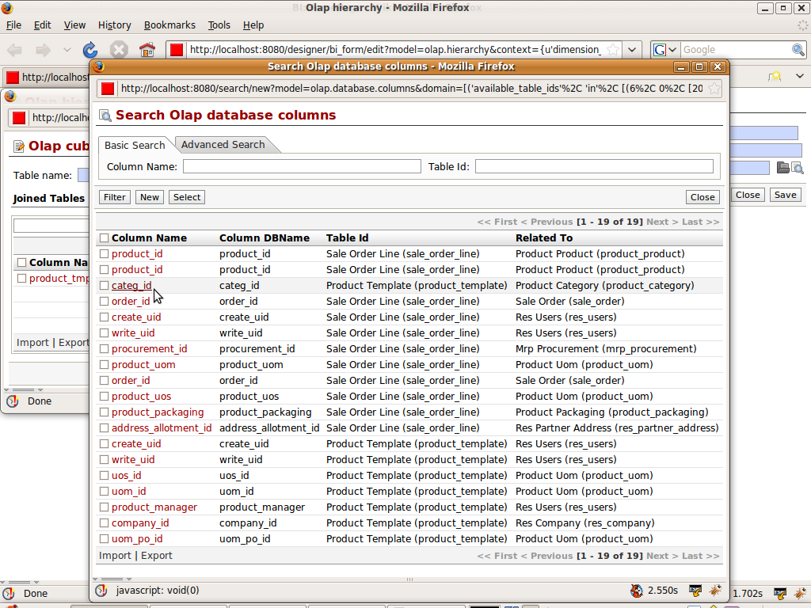
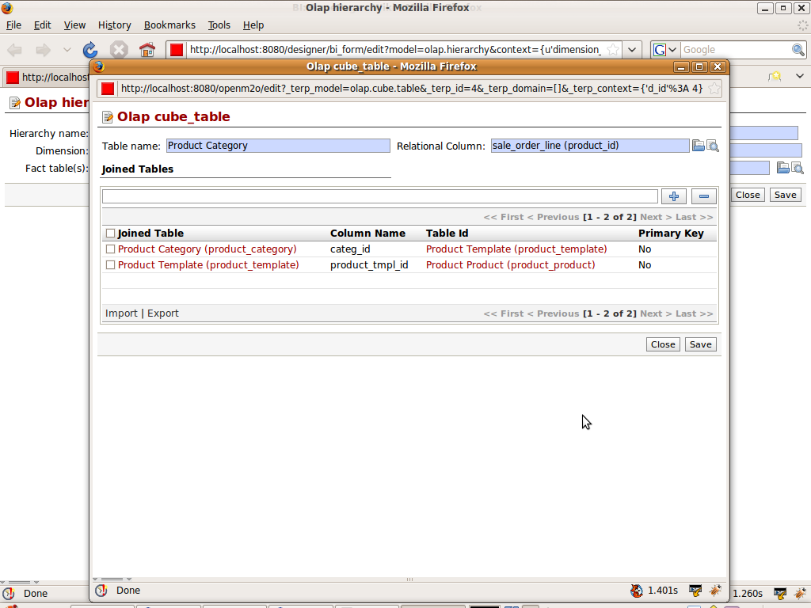

Defining Hierarchy
==================

:ref:`Hierarchy <hierarchy-link>` is the arrangements of objects, peoples etc .. in a ranked or some series. The hierarchy are the way of arranging the dimensions. 

It need the fact table. 

Lets take the Example of Products. 

We want our sales cube to work on the products. Means we want to see the products sold. We have divided the products in to the category. So we will make the Product Hierarchy to display products by categories.

Lets see the new hierarchy. According to the dimension some values are set by default like hierarchy name and dimension.

We now move to define the fact table for the hierarchy. Relational column will show the all fields of the sale_order_line and sale_order. As these are the fact tables for the cube. We select product_id from sale_order_line which is related to product_prodcut

We want to get the product name and the category both. We know the product_category will give category and product_template will give the name. 
Now the list is filtered accordingly for adding the join tables

After selecting the product_tmpl_id we move to select the category table.

So final fact table for the Product Category will be
 

