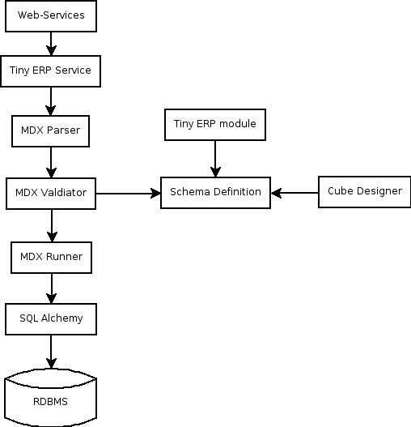

XML in open object
==================

Introduction to the OpenObject Module
-------------------------------------

The :ref:`OLAP <olap-link>`  module is used in validating , running  and formatting the output of *MDXExamples/MDX Queries*

The general flow is of :ref:`OLAP <olap-link>` module is shown in following diagram:

Explanation of the components
-----------------------------

:Web-Services:

This is the layer provided by the base of Tiny ERP, protocols: NET-RPC (fast binary), XML-RPC, over HTTP or HTTPS

:Services:

Layer provided by Tiny ERP that provides: authentification (normal/ldap), users management, access rights, workflows, module management, ...

:MDX Parser:

It parses the MDX query and convert it in the form of python objects. It uses pyparsing module of python to do this . It split the query in form of objects of axis, level, sub level, slicer (if any) and measures. 

:MDX Validator:

It parse all the objects created and map it to the browse object ofTiny ERP resource. For example, the axis object will receive a link to the Tiny ERP browse record on the related olap.axis object.

:MDX Runner:

It will run the query on the basis of objects using SQLAlchemy and return different subsets.
On the basis of it the cube is virtually made in the form of matrix.
And it fills the cube by values using axis mapping

:RDBMS connectors:

The layer provided by SQL Alchemy, it supports: mysql, postgresql, oracle, ...

The schema definition is in the Tiny ERP database.

