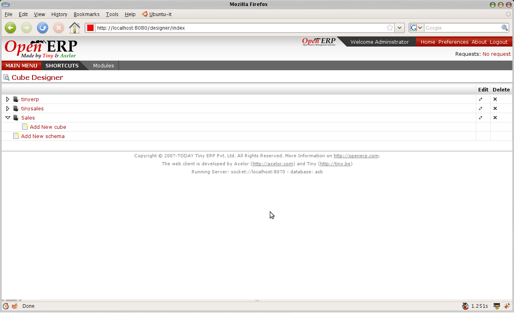
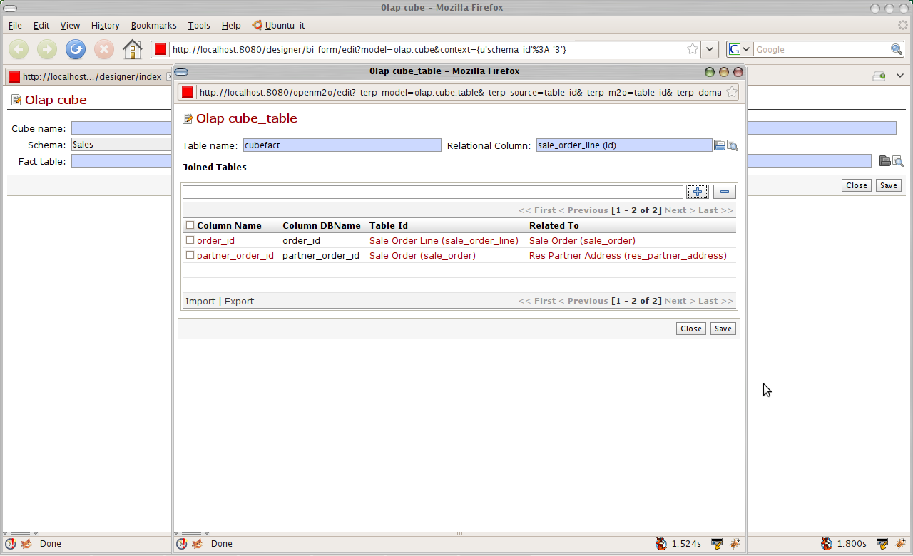
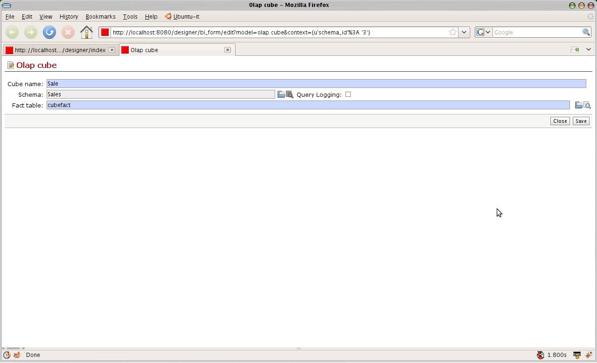
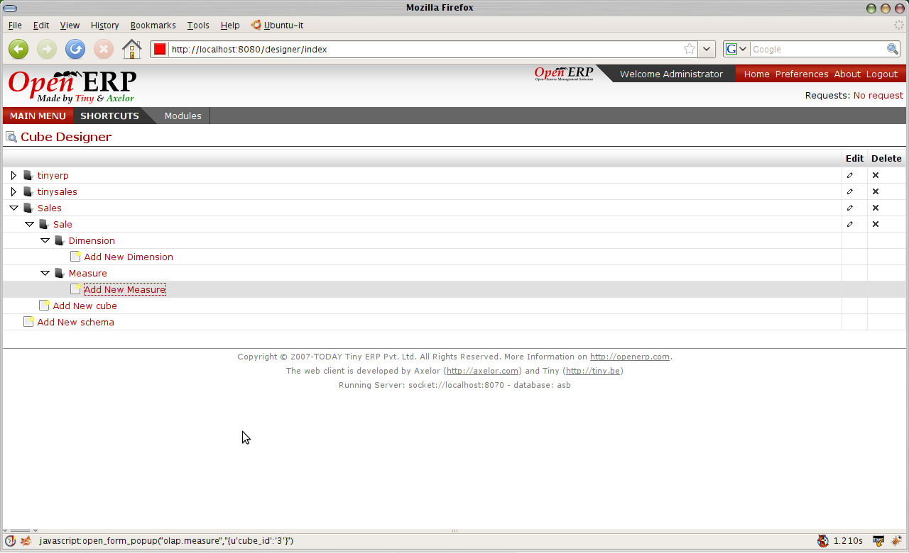
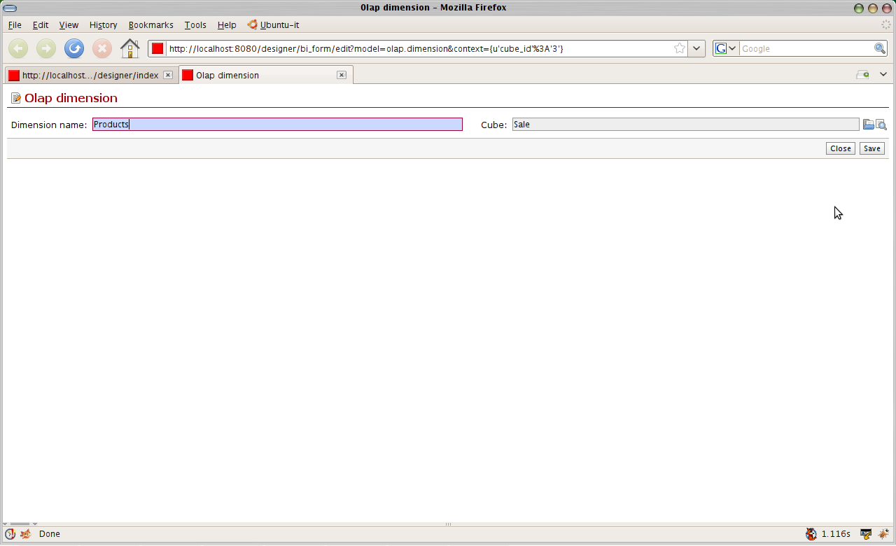

Configuration Interface
-----------------------

The main goal of any user connecting to OpenObject BI is to fetch the data from database using the powerful MDX queries.

MDX queries need the data to be configured in the form of cubes. The web based interface of the OpenObject BI (Cube designer) provides the simple yet powerful way to create and configure the cube for MDX.

Designer by default displays all schema in the tree form and provide options for adding the new.:

.. image::  images/1.png
   :scale: 65

--------

Creating the Schema : Schema defines the database from where the data is to be fetched. It gives a meaning ful name to the database connection.:

.. image::  images/2.png
   :scale: 65
    
--------

    
Database Connection specified the paramaters for connecting to the database. It generally includes type of the database (postgres,oracle,mysql), username, password , database to use.:

.. image::  images/3.png
   :scale: 65
        
--------

Once we configure the database connection the next step is to load the database using introspection. This will load the structure of the database. by structure we mean tables, columns and the relations. This will help in defining cube easily. As the structure is loaded their will be no query to the database again and again:

.. image::  images/4.png
   :scale: 65
        
--------

The next step is to configure the database loaded. This is useful to hide unnecessary table and columns. If database is of openerp it can be auto configured:

.. image::  images/4a.png
   :scale: 65
       
--------

 
Once the cube schema is created we can go for creating the cube:

      
--------

  
Cube is the structure that is based on the schema (database), It will configure the way to retrieve the data:

.. image::  images/6.png
   :scale: 65
        
--------

Cube requires the fact table to be define. Fact table are the key tables in which measures are stored and we can branch to other tables for other parameters. For example for sales we can define sale_order as our fact table as it will gives the details of the sales. Fact table can be join of tables.
The fact table is given meaningful name:

       
--------

 
And the cube screen will be

        
--------

After cube we can decide upon the dimensions to be used for the cube. For example we want to look on products sold , Dates, City etc.. to analyis the sales accordingly.
We decide what are the measures to be used. For example items sold. So we can decide the dimension and measures:

        
--------

Adding the dimension Products. So we will be able to see product wise item sold:

After dimension we explain how to get the prodcuts details in the hierarchy. It requires to configure the fact table:

.. image::  images/12.png
   :scale: 65
        
--------

After adding the hierarchy  we decide from which field the product name will come:

.. image::  images/14.png
   :scale: 65
        
--------

The fully configured cube tree will look like:

.. image::  images/15.png
   :scale: 65
        
