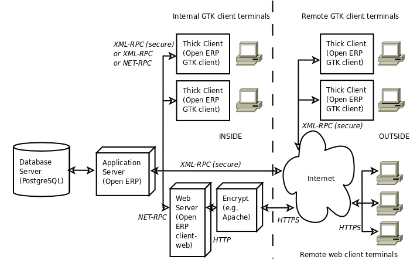

.. index::
   single: Open ERP architecture
.. 

.. index:: Architecture

The architecture of Open ERP
"""""""""""""""""""""""""""""

To access Open ERP you can:

* use a web browser pointed at the eTiny web server, or

* use an application client (the GTK client) installed on each computer.

The two methods of access give very similar facilities, and you can use both on
the same server at the same time. It's best to use the web browser if the
Open ERP server is some distance away (such as on another continent) because
it's more tolerant of time delays between the two than the GTK client is. The
web client is also easier to maintain, because it's generally already installed
on users' computers.

Conversely you'd be better off with the application client (called the GTK
client because of the technology it's built with) if you're using a local
server (such as in the same building). In this case the GTK client will be more
responsive, so more satisfying to use.

.. index::
   single: Client
..
   
.. tip::   **Usability**  *Web client and GTK client* 

    The main functional difference between the two Open ERP clients is the
    presence of the calendar view in the web client, which doesn't exist in the
    GTK client at present (versions 4.x and 5.0). Apart from that you will find that
    there are small differences in their general usability.

    The Tiny company will continue to support two clients for the foreseeable
    future, so you can use whichever client you prefer.

An Open ERP system is formed by three main components:

* the PostgreSQL database server, which contains all of the databases, each of which contains all data and most elements of the Open ERP system configuration,

* the Open ERP application server, which contains all of the enterprise logic and ensures that Open ERP runs optimally,

* the web server, a separate application called eTiny, which enables you to connect to Open ERP from standard web browsers and is not needed when you connect using a GTK client.

.. tip::   **Terminology**  *eTiny – server or client?* 

    The eTiny component can be thought of as a server or a client depending on
    your viewpoint.

    It acts as a web server to an end user connecting from a web browser, but
    it also acts as a client to the Open ERP application server just as a GTK
    application client does.

    So in this book its context will determine whether eTiny is referred to as
    a server or a client.

.. index::
   single: eTiny
.. 

.. tip::   **Attention**  *eTiny* 

    At present, the web component is known as “eTiny”. Although it's possible
    that this application's name will change in the coming months to match the
    renaming of Tiny ERP to Open ERP, its characteristics will stay the same.

.. index::
   single: PostgreSQL
.. 

.. tip::   **Program**  *PostgreSQL* 

	PostgreSQL is a relational and object database management system.

    It's a free high-performance system that compares with other database
    management systems such as MySQL and FirebirdSQL (both free), Sybase, DB2
    and Microsoft SQL Server (all proprietary). It runs on all types of
    Operating System, from Unix/Linux to the various releases of Windows, via
    Mac OS X, Solaris, SunOS and BSD.

These three components can be installed on the same server or can be
distributed onto separate computer servers if performance considerations
require it.

If you choose to run only with GTK clients you won't need the third component –
the eTiny server – at all. In this case Open ERP's GTK client must be installed
on the workstation of each Open ERP user in the company.

.. Copyright © Open Object Press. All rights reserved.

.. You may take electronic copy of this publication and distribute it if you don't
.. change the content. You can also print a copy to be read by yourself only.

.. We have contracts with different publishers in different countries to sell and
.. distribute paper or electronic based versions of this book (translated or not)
.. in bookstores. This helps to distribute and promote the Open ERP product. It
.. also helps us to create incentives to pay contributors and authors using author
.. rights of these sales.

.. Due to this, grants to translate, modify or sell this book are strictly
.. forbidden, unless Tiny SPRL (representing Open Object Presses) gives you a
.. written authorisation for this.

.. Many of the designations used by manufacturers and suppliers to distinguish their
.. products are claimed as trademarks. Where those designations appear in this book,
.. and Open ERP Press was aware of a trademark claim, the designations have been
.. printed in initial capitals.

.. While every precaution has been taken in the preparation of this book, the publisher
.. and the authors assume no responsibility for errors or omissions, or for damages
.. resulting from the use of the information contained herein.

.. Published by Open ERP Press, Grand Rosière, Belgium

