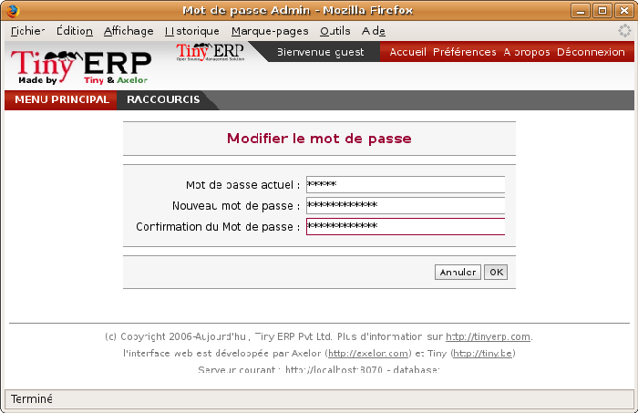
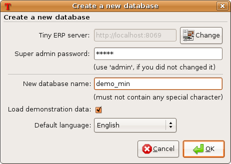
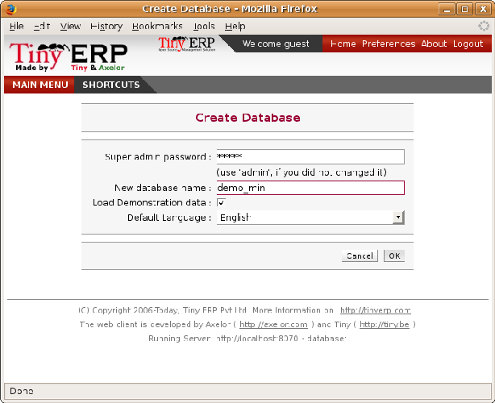
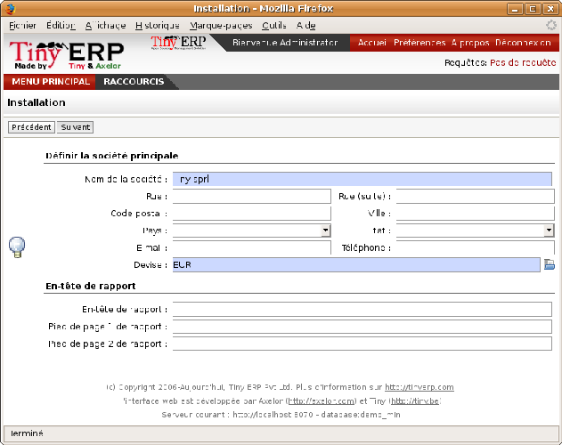

.. index::
   single: Database; Create
.. 

.. index:: Database

Database creation
=================

Use the technique outlined in Chapter 1 to create a new database, \ ``openerp_ch02``\  . This database will contain the demonstration data provided with Open ERP and a large proportion of the core Open ERP functionality. You'll need to know your super administrator password for this – or you'll have to find somebody who does have it to create this seed database.

Start the database creation process from the  *Database Administration*  page by clicking  *Create*  and then completing the following fields on the  *Create Database*  form:

*  *Super administrator password* , by default it's \ ``admin``\  , if you or your system administrator haven't changed it.

*  *New database name* : \ ``openerp_ch02``\  .

*  *Load Demonstration Data*  checkbox: \ ``checked``\  .

*  *Default Language* : \ ``English``\  .

Creating the database
"""""""""""""""""""""""

Before walking through an Open ERP business process step by step in the next chapter you'll create a database to check that the installation is working correctly:

* \ ``openerp_ch01``\  : a minimal database containing demonstration data.

To create new databases you must know the super-administrator password which defaults to admin on a new installation.

        .. note :: The super-administrator password

			Anyone who knows the super-administrator password has complete access to the data on the server – able to read, change and delete any of the data in any of the databases there.

			After first installation, the password is admin. You can change it through the GTK client from the menu File > Database ... > Administrator Password, or through the web client by logging out (click the Logout link), clicking Manage on the login screen, and then clicking the Password button on the Management screen. This password is stored in a configuration file outside the database, so your server systems administrator can change it if you forget it.

                
*Changing the super-administrator password through the web client.*

--------------------------                
                

	
*Creating a new database through the GTK client.*      

* If you're using the GTK client, choose  *Files > Database > New database*  in the menu at the top left. Enter the super-administrator password, then the name of the new database you're creating.

* If you're using the web client, click  *Manage*  on the login screen, then  *Create*  on the database management page. Enter the super-administrator password, then the name of the new database you're creating.

Database openerp_ch01
^^^^^^^^^^^^^^^^^^^^^^^

To create the \ ``openerp_ch01``\   database, enter the database name \ ``openerp_ch01``\   into the  *New database*  field. Make sure that the  *Load Demonstration Data*  checkbox is checked. Each Open ERP module will now be loaded with previously-constructed demonstration data as it's installed. Choose the default language for this database (English for many readers of this book), then click  *Ok* . 

Wait for the message showing that the database has been successfully created, along with the user accounts and passwords (\ ``admin/admin``\   and \ ``demo/demo``\  ). Now you've created this seed database you can extend it without knowing the super administrator password.

.. tip::   **Technique**  *User Access* 

	The combination of username/password is specific to a single database. If you have administrative rights to a database you can modify the predefined users. 

	Alternatively you can install the ``users_ldap`` module, which manages the authentication of users in LDAP (the Lightweight Directory Access Protocol, a standard system), and connect it to several Open ERP databases. Using this, many databases can share the same user account details.

.. tip::  **Note** *Failure to create a database*

	How do you know if you've successfully created your new database? You're told if the database creation has been unsuccessful. If you have entered a database name using prohibited characters (or no name, or too short a name) you will be alerted by the dialog box Bad database name! explaining how to correct the error. If you've entered the wrong super-administrator password or a name already in use (some names can be taken without your knowledge), you'll be alerted by the dialog box Error during database creation!

Connect to the database \ ``openerp_ch01``\   that you just created, using the default administrator account. 

If this is the first time you've connected to this database you'll be asked a series of questions to define the database parameters:

	#.  *Select a profile*  select \ ``Minimal Profile``\  and click  *Next* 

	#.  *Company Details*  replace the proposed default of \ ``Tiny sprl``\  by your own company name, complete as much of your address as you like, and add some lines about your company, such as a slogan and any statutory requirements, to the header and footer fields. Click  *Next*  

	#.  *Summary*  check the information and go back to make any modifications you need before installation. Then click  *Install* 

	#.  *Installation Completed*  click  *Ok* 

Once configuration is complete you're connected to your Open ERP system. Its functionality is very limited because you've selected a minimal installation, but this is sufficient to demonstrate that your installation is working.

	    
*Defining your company during initial database configuration.*
	
.. index::
   single: Database; Manage
.. 

Managing databases
^^^^^^^^^^^^^^^^^^^

As a super-administrator you've not only got rights to create new databases, but also to:

* delete databases,

* backup databases,

* restore databases.

All of these operations can be carried out from the menu  *File > Databases... > Backup databases*  in the GTK client, or from  *Manage...*  in the web client's Login screen.

.. index::
   single: Database; Duplicate
.. 

.. tip::   **Note**  *Duplicating a database.* 

	To duplicate a database you can:

        #. make a backup file on your PC from this database.

        #. restore this database from the backup file on your PC, giving it a new name as you do so.

	This can be a useful way of making a test database from a production database. You can try out the operation of a new configuration, new modules, or just the import of new data.

Future versions of Open ERP may only give you access to some of these database functions in a special development mode, so that your security is enhanced in normal production use.

You are now ready to use databases from your installation to familiarize yourself with the administration and use of Open ERP.

New Open ERP functionality
^^^^^^^^^^^^^^^^^^^^^^^^^^^

The database you've created and managed so far is based on the core Open ERP functionality that you installed. The core system is installed in the file system of your Open ERP application server, but only installed into an Open ERP database as you require it, as is described in the next chapter.

What if want to update what's there, or extend what's there with additional modules?

* To update what you have, you'd install a new instance of Open ERP using the same techniques as described earlier in this chapter.

* To extend what you have, you'd install new modules in the addons directory of your current Open ERP installation. There are several ways of doing that.

In both cases you'll need briefly to be a \ ``root``\   user or \ ``Administrator``\   of your Open ERP application server.

Extending Open ERP
###################

To extend Open ERP you'll need to copy modules into the \ ``addons``\   directory. That's is in your server's \ ``tinyerp-server``\   directory (which differs between Windows, Mac and some of the various Linux distributions and not available at all in the Windows all-in-one installer). 

If you look there you'll see existing modules such as \ ``product``\   and \ ``purchase``\  . A module can be provided in the form of files within a directory or a a zip-format file containing that same directory structure. 

You can add modules in two main ways – through the server, or through the client. 

To add new modules through the server is a conventional systems administration task. As \ ``root``\   user or other suitable user, you'd put the module in the \ ``addons``\   directory and change its permissions to match those of the other modules.

To add new modules through the client you must first change the permissions of the \ ``addons``\   directory of the server, so that it is writable by the server. That will enable you to install Open ERP modules using the Open ERP client (a task ultimately carried out on the application server by the server software). 

.. index::
   single:  Permissions

.. tip::   **Note**  *Changing permissions* 

	A very simple way of changing permissions on the Linux system you're using to develop an Open ERP application is to execute the command sudo chmod 777 <path_to_addons> (where <path_to_addons> is the full path to the addons directory, a location like /usr/lib/python2.5/site-packages/openerp-server/addons). 

Any user of Open ERP who has access to the relevant administration menus can then upload any new functionality, so you'd probably disable this capability for production use. You'll see examples of this uploading as you make your way through this book.

.. Copyright © Open Object Press. All rights reserved.

.. You may take electronic copy of this publication and distribute it if you don't
.. change the content. You can also print a copy to be read by yourself only.

.. We have contracts with different publishers in different countries to sell and
.. distribute paper or electronic based versions of this book (translated or not)
.. in bookstores. This helps to distribute and promote the Open ERP product. It
.. also helps us to create incentives to pay contributors and authors using author
.. rights of these sales.

.. Due to this, grants to translate, modify or sell this book are strictly
.. forbidden, unless Tiny SPRL (representing Open Object Presses) gives you a
.. written authorisation for this.

.. Many of the designations used by manufacturers and suppliers to distinguish their
.. products are claimed as trademarks. Where those designations appear in this book,
.. and Open ERP Press was aware of a trademark claim, the designations have been
.. printed in initial capitals.

.. While every precaution has been taken in the preparation of this book, the publisher
.. and the authors assume no responsibility for errors or omissions, or for damages
.. resulting from the use of the information contained herein.

.. Published by Open ERP Press, Grand Rosière, Belgium

