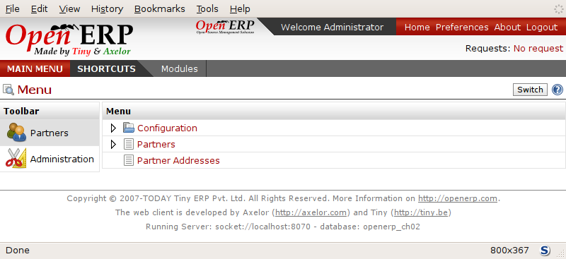
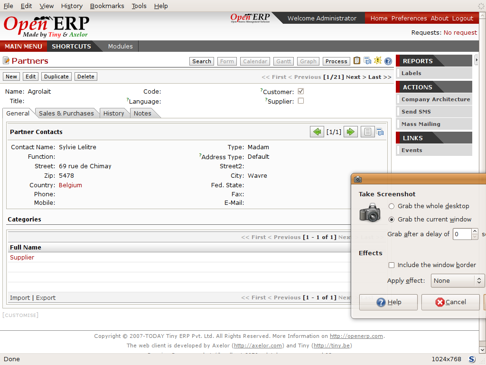
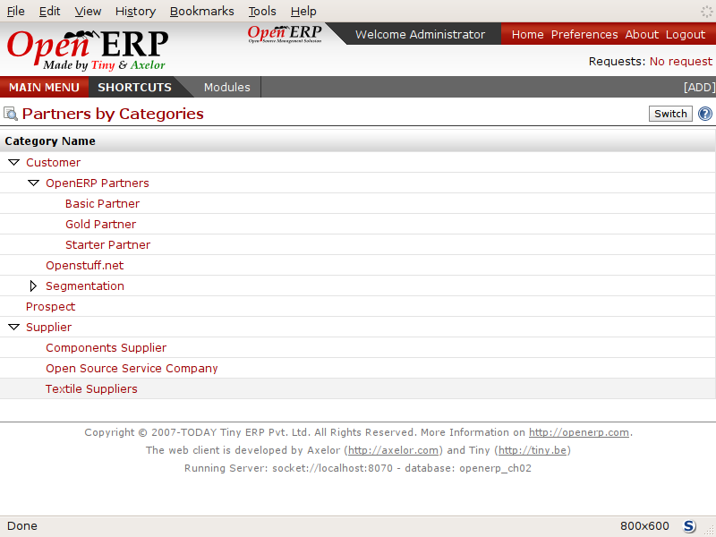
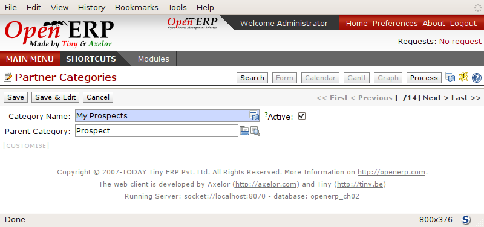

To connect to Open ERP
=======================

Since this is the first time you've connected to it you'll have to
go through the Setup wizard in steps:

	#.  :guilabel:`Select a profile` : select ``Minimal Profile`` and click :guilabel:`Next`.

	#.  At the :guilabel:`Define Main Company` step you should select your own :guilabel:`Company Name` and 
	    :guilabel:`Currency`, and address details on the first tab :guilabel:`General Information`; 
	    and add more details on the second tab :guilabel:`Report Information` including a logo,
	    if you have one, that appears on reports. Click :guilabel:`Next`.

	#.  At the :guilabel:`Summary` page you can go back to change details if you need.
	    Click the :guilabel:`Install` button.

	#.  Finally, at the :guilabel:`Installation done` page, click :guilabel:`Start Configuration`.
	
Configuration consists of a set of wizards that help you through options for the installed modules.
Hardly anything is installed so this is a very simple process at the moment.
   
    #.  At the first screen click :guilabel:`Continue` to go into the first wizard. 
        Choose :guilabel:`View Mode` : :guilabel:`Simplified Interface`
        and then click :guilabel:`Set` to save it.

    #.  Click :guilabel:`Skip Step` to step over the next wizard, which would enable you to add other users.

    #.  You've now reached the end of the configuration so click :guilabel:`Continue` to start using the
        system as the Administrator.

Once you're displaying the main menu you're able to see the following screen items, 
as shown in screenshot :ref:`fig-oech2-main`:

* the :guilabel:`Preferences` toolbar to the top right, showing the user name, links to the :guilabel:`Home` page,
  :guilabel:`Preferences`, :guilabel:`About` and :guilabel:`Logout`,

* just below you'll find information about the :guilabel:`Request` system,

* links to the :guilabel:`MAIN MENU` and the :guilabel:`SHORTCUTS`,

* information about copyright and the database you're logged into at the bottom of the page,

* the main contents of the window with by the menu toolbar to the left: links generally line up on
  the right but there are none to show at the moment.

.. _fig-oech2-main:

   *The Main Menu of the openerp_ch02 database*

Two menus are available on the left:

* :guilabel:`Partners`,

* :menuselection:`Administration`.

.. index::
   single: Preferences
..

Preferences toolbar
---------------------

When you're connected to Open ERP the Preferences toolbar indicates which user you're connected as.
So it should currently be showing :guilabel:`Welcome Administrator` (unless you logged in as another
user and it's reflecting the name of that user instead).

You'll find a link to the :guilabel:`Home` page to its right. This takes you to either the
dashboard or the available menus, depending on the user configuration. In the case of the \
``openerp_ch02``\ database so far the Home page is the Main Menu. But in general each user of the
system is presented with a dashboard that's designed to show performance indicators and urgent
documents that are most useful to someone of the user's position in the company. You'll see how to
assign dashboards to different users in a later chapter, :ref:`ch-config`.

.. index::
   single: TimeZone
..

.. tip::  Multi-nationals and time zones

	If you have users in different countries, they can configure their own timezone. Timestamp displays
	are then adjusted by reference to the user's own localization setting.

	So if you have a team in India and a team in England, the times will automatically be converted. If
	an Indian employee sets her working hours from 9 to 6 that will be converted and saved in the
	server's timezone. When the English users want to set up a meeting with an Indian user, the Indian
	user's available time will be converted to English time.

The next element in the Toolbar is a link to :guilabel:`Preferences`. By clicking that link you
reach a page where the current user can set their password, a timezone, a working language, and
a signature:

* The :guilabel:`Password` field gives the user the opportunity to change their own password.
  You should take steps (perhaps written policies) to prevent users making these too trivial. 

* The :guilabel:`Language` field enables the user's working language to be changed. But first the
  system must be loaded with other languages for the user to be able to choose an alternative, which
  is described in the next subsection of this chapter. This is a mandatory field, although might
  initially be set as blank.

* The :guilabel:`Timezone` setting indicates the user's location to Open ERP. This can be different
  from that of the server. All of the dates in the system are converted to the user's timezone
  automatically.

* The :guilabel:`Signature` field gives the user a place for the signature attached to messages sent
  from within Open ERP. 

The :guilabel:`About` link gives information about the development of the Open ERP software and 
various links to other information.

The :guilabel:`Logout` link enables you to logout and return to the original login page. You can
then login to another database, or to the same database as another user. This page also gives you
access to the super-administrator functions for managing databases on this server.

The :guilabel:`Requests` link sits just below this toolbar. It is only visible if you're logged into
a database. If your database is new it will say :guilabel:`No request`. You can click on that link
to look at requests that have been sent to you at any time.

.. index::
   single: Language Installation
..

Installing a new language
^^^^^^^^^^^^^^^^^^^^^^^^^^^

Each user of the system can work in his or her own language. More than twenty languages are
currently available besides English. Users select their working language using the Preferences link.
You can also assign a language to a partner (customer or supplier), in which case all the documents
sent to that partner will be automatically translated into that language.

.. attention:: More information about languages

	The base version of Open ERP is translated into the following languages: English, German, Chinese,
	Spanish, Italian, Hungarian, Dutch, Portuguese, Romanian, Swedish and Czech.

	But other languages are also available: Arabic, Afghan,
	Austrian, Bulgarian, Indonesian, Finnish, Thai, Turkish and Vietnamese..

As administrator you can install a new main working language into the system.

	#. Select :menuselection:`Administration` in the Menu Toolbar and click
	   :menuselection:`Translations --> Load an Official Translation` in the main menu window,

	#. Select the language to install, \ ``French``\  for example, and click on :guilabel:`Start
	   Installation`,

	#. When the message :guilabel:`Installation done` appears in the :guilabel:`Language file loaded` window,
	   click :guilabel:`OK` to return to  the menu. (Your system will actually need the French locale loaded
	   to be able to do this, so you may not be successful here.)

To see the effects of this installation change the preferences of your user to change the working
language (you may first need to ensure that you have selected English as your language before
you're given the French option). 
The main menu is immediately translated in the selected language. If you're using the GTK
client you'll first have to close the menu then open a new main menu to start seeing things in the
new language.

.. note:: Navigating the menu

   From this point in the book navigation from the main menu is written as a series of menu entries
   connected by the :menuselection:`-->` character. Instead of seeing “ Select Administration in
   the Menu toolbar then click Translations > Load an Official Translation ” you'll just get “ use menu
   :menuselection:`Administration --> Translations --> Load an Official Translation` ”.

.. index:: Requests

Requests as a mechanism for internal communication
^^^^^^^^^^^^^^^^^^^^^^^^^^^^^^^^^^^^^^^^^^^^^^^^^^^

Requests are a powerful communication mechanism between users of the system. They're also used by
Open ERP itself to send system messages to users.

They have distinct advantages over traditional emails:

* requests are linked to other Open ERP documents,

* an event's history is attached to the request,

* you can monitor events effectively from the messages they've sent.

Open ERP uses this mechanism to inform users about certain system events. For example if there's a
problem concerning the restocking of a product a request is sent by Open ERP to the production
manager.

Send a request to get an understanding of its functionality:

	#. Click on the :guilabel:`Requests` link that should currently be showing :guilabel:`No Requests`.
	   This opens a window that lists all of your waiting requests.

	#. Click :guilabel:`New` to create and send a new request.

	#. Complete the subject of the request, such as \ ``How are you?``\  then give a description of the
	   enquiry in the field.

	#. Click the :guilabel:`Search` button to the right of the :guilabel:`To` field and select
	   :guilabel:`Administrator` in the window that opens (that's the user that you're already connected
	   as).

	#. You can then link this request to other system documents using the :guilabel:`References` field,
	   which could, for example, be a partner or a quotation or a disputed invoice.

	#. Click :guilabel:`Send` to send the request to the intended recipient – that's yourself in this
	   case. Then click :guilabel:`Main Menu` to return to the original screen.

.. figure:: images/request_tab.png
   :align: center

   *Creating a new request*

To check your requests:

	#. Click on the link to the right of the :guilabel:`Requests` label to open a list of your
	   requests. (It's possible that you'll still see the statement :guilabel:`No Requests` because this
	   information is updated periodically ather than instantly.) The list of requests then opens and you
	   can see the requests you've been sent there.

	#. Click the :guilabel:`Edit` icon, represented by a pencil, at the right hand end of the request
	   line. That opens the request in edit mode.

	#. You can then click the :guilabel:`Reply` button and make your response in the
	   :guilabel:`Request` field that appears in place of the original message.

	#. Click :guilabel:`Send` to save your response and send it to the original sender.

.. note:: Requests vs. email

	The advantage of an Open ERP request compared with a set of emails about one thread of discussion
	is that a request contains all of the conversation in one place. You can easily monitor a whole
	discussion with the appropriate documents attached, and quickly review a list of incomplete
	discussions with the history within each request.

Look at the request and its history, then close it.

	#. Click on the :guilabel:`History` tab in the :guilabel:`Request` form to see the
	   original request and all of the responses. By clicking on each line you could get more information
	   on each element.

	#. Return to the first tab, :guilabel:`Request` and click :guilabel:`End of Request` to set it to \
	   ``closed``\.   This then appears greyed out.

The request is no longer active. It's not visible to searches and won't appear in your list of
waiting requests.

.. tip:: Trigger dates

	You can send a request with a future date. This request won't appear in the recipient's waiting
	list until the indicated date. This mechanism is very useful for setting up alerts before an
	important event.

.. index::
  single: User Configuration
..

Configuring Users
-------------------

The database you created contains minimal functionality but can be extended to include all of the
potential functionality available to Open ERP. About the only functions actually available in this
minimal database are Partners and Currencies – and these only because the definition of your main
company required this. And because you chose to include demonstration data, both Partners and
Currencies were installed with some samples.

Because you logged in as Administrator, you have all the access you need to configure users. Click
:menuselection:`Administration --> Users --> Users` to display the list of users defined in the
system. A second user, \ ``Demo User``\  , is also present in the system as part of the
demonstration data. Click the \ ``Demo User``\   name to open a non-editable form on that user.

Click the :guilabel:`Security`  tab to see that the demo user is a member of only the ``Employees`` group,
has no roles
and is subject to no specialized rules. The \ ``admin``\   user is different, as you can see if you
follow the same sequence to review the its definition. It's a member of the \ ``admin``\   group,
which gives it more advanced rights to configure new users.

.. tip::  Roles, Groups and Users

	Users and groups provide the structure for specifying access rights to different documents. Their
	setup answers the question "Who has access to what?"

	Roles are used in business processes for permitting or blocking certain steps in the workflow of a
	given document. For example you can assign the role of approving an invoice. Roles answer the
	question “Who should do what?”

Click :menuselection:`Administration --> Users --> Groups`  below the main menu to open the list of
groups defined in the system. If you open the form view of the \ ``admin``\   group by clicking its
name in the list, the first tab give you the list of all the users who belong to this group.

Click the Security tab and it gives you details of the access rights for that group. These are
detailed later in :ref:`ch-config`, but you can already see there further up in the window, the list of menus
reserved for the admin group. By convention, the \ ``admin``\   in Open ERP has rights of access to
the :menuselection:`Configuration`  menu in each section. So \ ``Partners / Configuration``\   is
found in the list of access rights but \ ``Partners``\   isn't found there because it's accessible
to all users.

You can create some new users to integrate them into the system. Assign them to predefined groups to
grant them certain access rights. Then try their access rights when you login as these users.
Management defines these access rights as described in :ref:`ch-config`.

.. note::  Changes to default access rights

	New versions of Open ERP differ from earlier versions of Open ERP and Tiny ERP in this area:
	many groups have been predefined and access to many of the menus and objects are keyed to these
	groups by default.
	This is quite a contrast to the rather liberal approach in 4.2.2 and before, where access rights
	could be defined but were not activated by default.

.. index::
  single: Partner; Managing Partners
..

Managing partners
-------------------

In Open ERP, a partner represents an entity that you do business with. That can be a prospect, a
customer, a supplier, or even an employee of your company.

List of partners
^^^^^^^^^^^^^^^^^

Click :menuselection:`Partners --> Partners`  in the main menu to open the list of partners. Then
click the name of the first partner to get hold of the details – a form appears with several tabs
on it:

* the :guilabel:`General` tab contains the main information about the company, such as its corporate
  name, its primary language, your different contacts at that partner and the categories it belongs
  to.

* the :guilabel:`Sales & Purchases` tab contains information that's slightly less immediate.

* the :menuselection:`History` tab contains the history of all the events that the partner has
  been involved in. These events are created automatically by different system documents: invoices,
  orders, support requests and so on, from a list that can be configured in the system. 
  These give you a rapid view of the partner's history on a single
  screen.

* the :menuselection:`Notes` tab is an area for free text notes.

To the right of the form is a list of Reports, Actions and Links related to a partner. Click some of 
them to get a feel for their use.

   *Partner form*

.. index::
  single: Partner; Categories
..

.. tip::  Partner Categories

	Partner Categories enable you to segment different partners according to their relation with you
	(client, prospect, supplier, and so on). A partner can belong to several categories – for example
	it may be both a customer and supplier at the same time.
	
	But there are also Customer, Supplier and Rental checkboxes on the partner form, which are different.
	These checkboxes are designed to enable Open ERP to quickly select what should appear on some of the
	system drop-down selection boxes. They, too, need to be set correctly.

Partner Categories
^^^^^^^^^^^^^^^^^^^

You can list your partners by category using the menu :menuselection:`Partners --> Partners by
category` . This opens a hierarchical structure of categories where each category can be divided
into sub-categories. Click a category to obtain a list of partners in that category. For example,
click all of the partners in the category :menuselection:`Supplier`  or :menuselection:`Supplier -->
Components Supplier`. You'll see that if a company is in a subcategory (such as
:guilabel:`Components Supplier` ) then it will also show up when you click the parent category (such
as :guilabel:`Supplier`).

   *Categories of partner in a hierarchical structure, for example Customer, Prospect, Supplier*

The administrator can define new categories. So you'll create a new category and link it to a
partner:

	#. Use :menuselection:`Partners --> Configuration --> Partner Categories` to reach a list
	   of the same categories as above but in a list view rather than a hierarchical tree structure.

	#. Click :guilabel:`New` to open an empty form for creating a new category

	#. Enter \ ``My Prospects``\  in the field :guilabel:`Name of Category`. Then click on the
	   :guilabel:`Search` icon to the right of the :guilabel:`Parent Category` field and select 
	   \ ``Prospect``\  in the list that appears.

	#. Then save your new category using the :guilabel:`Save` button.

.. tip:: Required Fields

	Fields colored blue are required. If you try to save the form while any of these fields are empty
	the field turns red to indicate that there's a problem. It's impossible to save the form until
	you've completed every required field.

You can review your new category structure using :menuselection:`Partners --> Partners by category`. 
You should see the new structure of \ ``Prospects / My Prospects``\   there.

   *Creating a new partner category :guilabel:`My prospects`*

To create a new partner and link it to this new category open a new partner form to modify it.

	#. In the :guilabel:`General` tab, type \ ``New Partner``\  into the :guilabel:`Name` field.

	#. Then click on the search icon to the right of the :guilabel:`Categories` field and select your
	   new category from the list that appears: \ ``Prospect / My Prospects``\

	#. Then save your partner by clicking :guilabel:`Save`  The partner now belongs in the category 
	   \ ``Prospect / My prospects.``\

	#. Monitor your modification in the menu :menuselection:`Partners --> Partners by category`. Select
	   the category :guilabel:`My Prospect`. The list of partners opens and you'll find your new partner
	   there in that list.

.. tip:: Searching for documents

	If you need to search through a long list of partners it's best to use the available search
	criteria rather than scroll through the whole partner list. It's a habit that'll save you a lot of
	time in the long run as you search for all kinds of documents.

	.. note::  *Example Categories of partners*

			A partner can be assigned to several categories. These enable you to create alternative
			classifications as necessary, usually in a hierarchical form.

			Here are some structures that are often used:

			* geographical locations,

			* interest in certain product lines,

			* subscriptions to newsletters,

			* type of industry.

.. Copyright © Open Object Press. All rights reserved.

.. You may take electronic copy of this publication and distribute it if you don't
.. change the content. You can also print a copy to be read by yourself only.

.. We have contracts with different publishers in different countries to sell and
.. distribute paper or electronic based versions of this book (translated or not)
.. in bookstores. This helps to distribute and promote the Open ERP product. It
.. also helps us to create incentives to pay contributors and authors using author
.. rights of these sales.

.. Due to this, grants to translate, modify or sell this book are strictly
.. forbidden, unless Tiny SPRL (representing Open Object Press) gives you a
.. written authorisation for this.

.. Many of the designations used by manufacturers and suppliers to distinguish their
.. products are claimed as trademarks. Where those designations appear in this book,
.. and Open Object Press was aware of a trademark claim, the designations have been
.. printed in initial capitals.

.. While every precaution has been taken in the preparation of this book, the publisher
.. and the authors assume no responsibility for errors or omissions, or for damages
.. resulting from the use of the information contained herein.

.. Published by Open Object Press, Grand Rosière, Belgium

