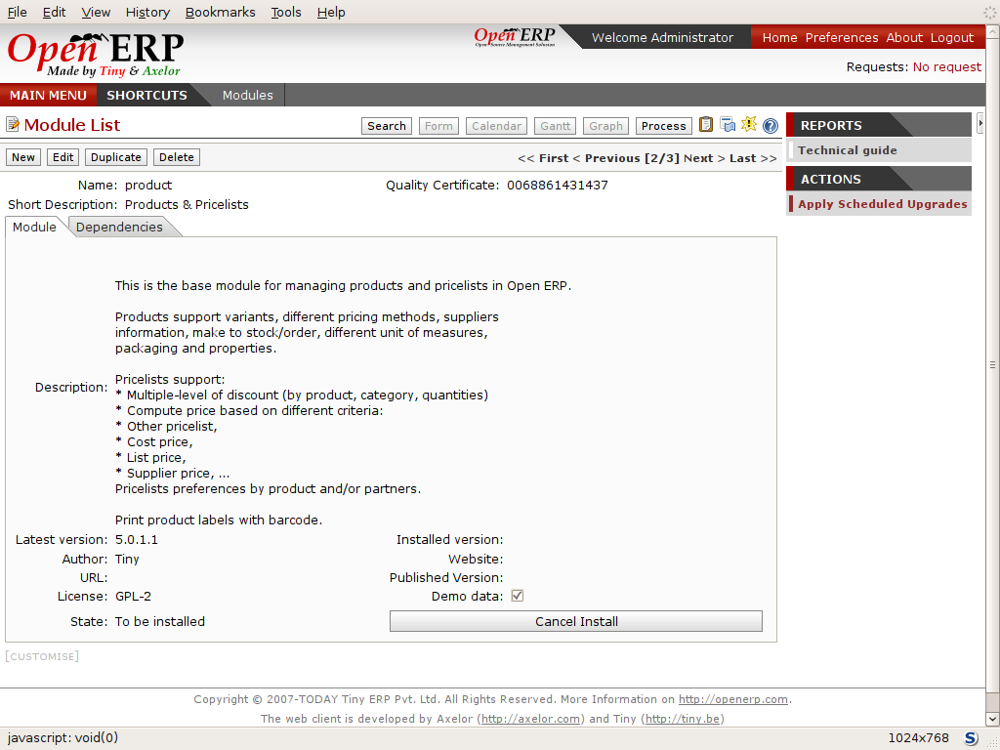

.. index::
  single: Module; Install functionality
..

Installing new functionality
=============================

All of Open ERP's functionality is contained in its many and various modules. Many of these, the core modules, are automatically loaded during the initial installation of the system and can be updated online later. Although they're mostly not installed in your database at the outset, they're available on your computer for immediate installation. Additional modules can also be loaded online from the official Open ERP site http://openerp.com. These modules are inactive when they're loaded into the system, and can then be installed in a separate step. 

You'll start by checking if there are any updates available online that apply to your initial installation. Then you'll install a CRM module to complete your existing database.

.. index::
  single: Module; Upgrade Modules

Updating the Modules list
---------------------------

Click  *Administration > Modules Management > Update Modules List*  to start the updating tool. The  *Scan for new modules*  window opens showing the addresses that Open ERP will look in for downloading new modules (known as the repositories), and updating existing ones.

.. tip::   **Note**  *Remote module repositories* 

	If the repository list doesn't reflect your needs then you can edit it from Administration > Modules Management > Repositories. There you can link to new repositories by adding their URLs and disable listed ones by unchecking their Active checkbox. If you're not connected to the Internet then you probably want to disable anything there. 

	Your Open ERP installation must be configured with its addons directory as writable for you to be able to download anything at all. If it hasn't been, then you may need the assistance of a systems administrator to change your server's settings so that you can install new modules.

Click  *Check New Modules*  to start the download from the specified locations. When it's complete you'll see a  *New Modules* window indicating how many new modules were downloaded and how many existing modules were updated. Click  *OK*  to return to the updated list. 

It won't matter in this chapter if you can't download anything, but some of the later chapters refer to modules that aren't part of the core installation and have to be obtained from a remote repository.

.. tip::   **Technique**  *Modules* 

	All the modules available on your computer can be found in the addons directory of your Open ERP server. Each module there is represented by a directory carrying the name of the module or by a file with the module name and .zip appended to it. The file is in ZIP archive format and replicates the directory structure of unzipped modules.

.. tip::   **Attention**  *Searching through the whole list* 

	The list of modules shows only the first available modules. In the web client you can search or follow the First / Previous / Next / Last links to get to any point in the whole list, and you can change the number of entries listed by clicking the row number indicators between Previous and Next and selecting a different number from the default of 20.

	If you use the GTK client you can search, as you would with the web client, or use the + icon to the top left of the window to change the number of entries returned by the search from its default limit of 80, or its default offset of 0 (starting at the first entry) in the whole list.

.. index::
  single: Module; Install
..

Installing a module
---------------------

You'll now install a module named \ ``product``\  , which will enable you to manage the company's products. This is part of the core installation, so you don't need to load anything to make this work, but isn't installed in the Minimal Profile. 

Open the list of uninstalled modules from  *Administration > Modules Management > Uninstalled Modules* . Search for the module by entering the name \ ``product``\   in the search screen then clicking it in the list that appears below it to open it. The form that describes the module gives you useful information such as its version number, its status and a review of its functionality. Click  *Install*  and the status of the module changes to \ ``To be installed``\  .

*Installation of the ``product`` module.*
      

.. tip::   **Technique**  *Technical Guide* 

	If you select a module in any of the module lists by clicking on a module line and then on Technical Guide at the top right of the window, Open ERP produces a technical report on that module. It's helpful only if the module is installed, so the menu *Administration > Modules Management > Installed Modules* produces the most fruitful list. 

	This report comprises a list of all the objects and all the fields along with their descriptions. The report adapts to your system and reflects any modifications you've made and all the other modules you've installed. 

Click  *Apply Upgrades*  then  *Start Upgrades*  on the  *System Upgrade*  form that appears. Close the window when the operation has completed. Return to the main menu you'll see the new menu  *Products*  has become available.

.. tip::   **GTK client**  *Refreshing the menu* 

	After an update in the GTK client you'll have to open a new menu to refresh the content – otherwise you won't see the new menu item. To do that use the window menu Form > Refresh/Cancel.

Installing a module with its dependencies
-------------------------------------------

You'll now install the CRM module (Customer Relationship Management) using the same process as before.

	#. Use  *Administration > Modules Management > Uninstalled Modules* to get a list of modules to install. Search for the \ ``crm``\  module in that list.

	#. Install the module by clicking  *Install* and then  *Apply Upgrades* on the resulting module form, followed by  *Start Upgrade* on the toolbar to the right.

	#. When the update screen appears, Open ERP gives you the list of modules that it will install and update. You'll find two modules there – \ ``crm``\  (which you selected) and \ ``account``\   What's happened is that the \ ``crm``\  module lists the \ ``account``\  module as a dependency, and \ ``account``\  is not yet installed. So Open ERP automatically installs \ ``account``\  

	#. Start the upgrade to install both modules.

When you return to the main menu you'll find the new customer relationship management menu  *CRM & SRM* . You'll also see all the accounting functions that are now available in the  *Financial Management* menu.

There is no particular relationship between the modules installed and the menus added. Most of the core modules add complete menus but some also add submenus to menus already in the system. Other modules add menus and submenus as they need. Modules can also add additional fields to existing forms, or simply additional demonstration data or some settings specific to a given requirement.

.. index::
  single: Module; Dependencies
..

.. tip::   **Technique**  *Dependencies between modules* 

	The module form shows two tabs. The first tab gives basic information about the module and the second gives a list of modules that this module depends on. So when you install a module, Open ERP automatically selects all the necessary dependencies to install this module.

	That's also how you develop the profile modules: they simply define a list of modules that you want in your profile as a set of dependencies.

Although you can install a module and all its dependencies at once, you can't remove them in one fell swoop – you'd have to uninstall module by module. Uninstalling is more complex than installing because you have to handle existing system data. 

.. tip::   **Attention**  *Uninstalling modules* 

	Although it works quite well, uninstalling modules isn't perfect in Open ERP. It's not guaranteed to return the system exactly to the state it was in before installation.

	So it's recommended that you make a backup of the database before installing your new modules so that you can test the new modules and decide whether they're suitable or not. If they're not then you can return to your backup. If they are, then you'll probably still reinstall the modules on your backup so that you don't have to delete all your test data.

	If you wanted to uninstall you would use the menu Administration > Modules Management > Installed Modules and then uninstall them in the inverse order of their dependencies: crm, account, product.

Installing additional functionality
-------------------------------------

To discover the full range of Open ERP's possibilities you can install many additional modules. Installing them with their demonstration data provides a convenient way of exploring the whole core system. When you build on the \ ``openerp_ch02``\   database you'll automatically include demonstration data because you checked the  *Load Demonstration Data*  checkbox when you originally created the database.

So click  *Administration > Modules Management > Update Modules List*  to upload and update to the latest versions of everything on the Open ERP site. If you don't have an internet connection, or if you're not permitted to modify your installation's \ ``addons``\   directory you can skip this step.

.. index::
  single: Module; Import 
..

.. tip::   **Attention**  *Importing new modules* 

	You can only import new modules and update your existing ones if your system is configured to accept them. Your Open ERP addons directory must be writable by the system user that's running your Open ERP application for this, as described in the final section of Chapter 1.

Click  *Administration > Modules Management > Uninstalled modules*  to give you an overview of all of the modules available for installation.

To test several modules you won't have to install them all one by one. You can use the dependencies between modules to load several at once. For example, try loading the following modules:

* \ ``profile_accounting``\  ,

* \ ``profile_manufacturing``\  ,

* \ ``profile_service``\  .

To find these quickly, enter the word \ ``profile``\   in the  *Name*  field of the search form and click  *Filter*  to search for the relevant modules. Then install them one by one or all at once.

As you update you'll see thirty or so modules to be installed. When you close the  *System Upgrade Done*  form you'll be returned to a dashboard, not the main menu you had before. To get to the main menu, use the  *Main Menu*  link.

.. Copyright © Open Object Press. All rights reserved.

.. You may take electronic copy of this publication and distribute it if you don't
.. change the content. You can also print a copy to be read by yourself only.

.. We have contracts with different publishers in different countries to sell and
.. distribute paper or electronic based versions of this book (translated or not)
.. in bookstores. This helps to distribute and promote the Open ERP product. It
.. also helps us to create incentives to pay contributors and authors using author
.. rights of these sales.

.. Due to this, grants to translate, modify or sell this book are strictly
.. forbidden, unless Tiny SPRL (representing Open Object Presses) gives you a
.. written authorisation for this.

.. Many of the designations used by manufacturers and suppliers to distinguish their
.. products are claimed as trademarks. Where those designations appear in this book,
.. and Open ERP Press was aware of a trademark claim, the designations have been
.. printed in initial capitals.

.. While every precaution has been taken in the preparation of this book, the publisher
.. and the authors assume no responsibility for errors or omissions, or for damages
.. resulting from the use of the information contained herein.

.. Published by Open ERP Press, Grand Rosière, Belgium

