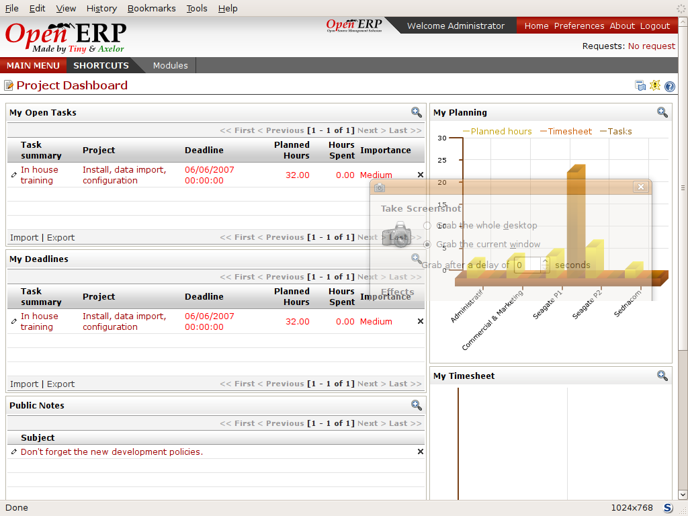
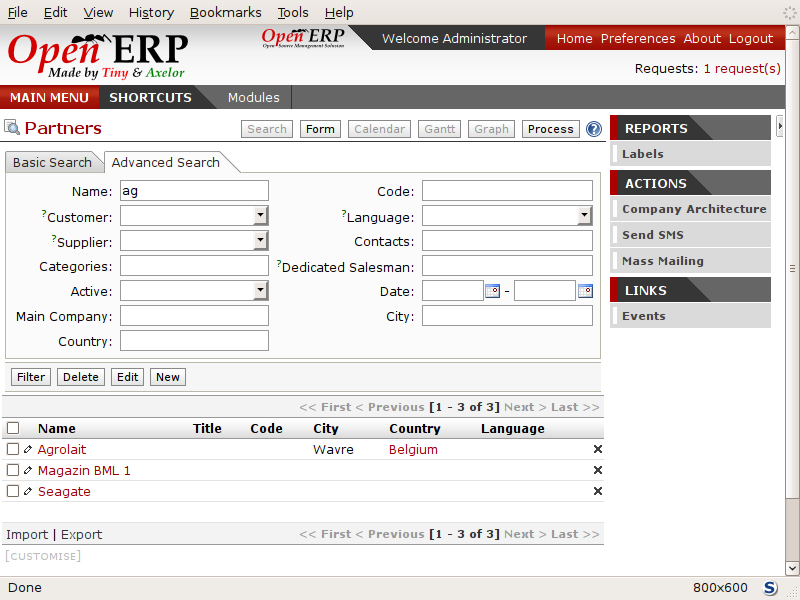
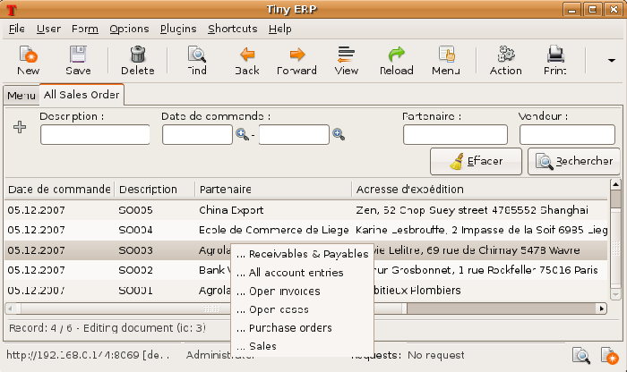
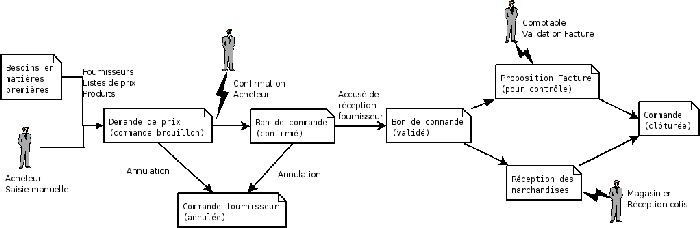
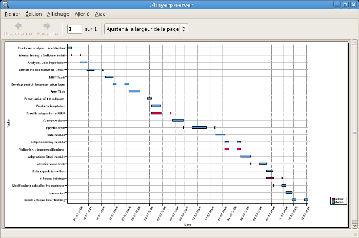

Guided Tour of Open ERP
=========================

You'll now explore the database \ ``openerp_ch02``\   with these profile modules installed to give you an insight into the coverage of the core Open ERP software.

.. tip::   **Attention**  *Translating new modules* 

	When you've installed a new module and are using additional languages to English you have to reload the translation file. New terms introduced in these modules aren't translated by default. To do this use Administration > Translation > Load a New Language.

Depending on the user you're connected as the page appears differently from the Main Menu that showed before. Using the installation sequence above, certain dashboards may be assigned as various users' home pages. They show a summary of the information required to start the day effectively. A project dashboard might contains:

* a list of the next tasks to carry out,

* a list of the next deadlines,

* public notes about projects,

* a planning chart of hours required,

* the timesheet.

Each of the lists can be reordered by clicking on the heading of a column – first in ascending then in descending order as you click repeatedly. To get more information about any particular entry click on the name in the first column, or if you want to show a particular panel click  *Zoom*  above it. 

*Project Dashboard.*

Users' home pages are automatically reassigned during the creation or upgrading of a database. It's usual to assign a dashboard to someone's home page but any Open ERP screen can be assigned to the home page of any user.

.. index::
  single: Shortcuts
..

.. tip::   **Note**  *Creating shortcuts* 

	Each user has access to many menu items throughout all of the available menu hierarchy. But in general an employee uses only a small part of the system's functions.

	So you can define shortcuts for the most-used menus. These shortcuts are personal for each user. To create a new shortcut open the select menu and click on the Add link to the right of shortcuts.

	To change or replace a link click on the Shortcuts link. Open ERP then opens a list of editable shortcuts.

The following sections present an overview of the main functions of Open ERP. Some areas are covered in more detail in the following chapters of this book and you'll find many other functions available in the optional modules. Functions are presented in the order that they appear on the main menu.

Partners
---------

To familiarize yourself with Open ERP's interface, you'll start work with information about partners. Clicking  *Partners > Partners*  brings up a list of partners that were automatically loaded when you created the database with  *Load Demonstration Data*  checked.

.. index::
  single: Partner; Search Partners
..

Search for a partner
^^^^^^^^^^^^^^^^^^^^^

Above the partner list you'll see a search form that enables you to quickly filter the partners. Two tabs are available for searching –  *Basic Search*  and  *Advanced Search* . The latter simply shows more fields to narrow your selection.

If you've applied no filter, the list shows every partner in the system. For space reasons this list shows only the first few partners (the web client defaults to \ ``20``\  , but you can select a maximum of \ ``100``\   on a page). If you want to display other records you can search for them or navigate through the whole list using the  *First*  /  *Previous*  /  *Next*  /  *Last*  arrows.

*Standard partner search.*

.. tip::   **GTK client**  *List limit of 80* 

	By default the list in the GTK client shows only the first 80 records, to avoid overloading the network and the server.

	But you can change that limit by clicking the + icon to the left of the search criteria, and you can change the offset so that it starts further down the whole list than the first entry. 

If you click on the name of a partner the form view corresponding to that partner opens in Read-Only mode. In the list you could alternatively click the pencil icon to open the same form in Edit mode. Once you have a form you can toggle between the two modes by clicking  *Save*  or  *Cancel*  when in Edit mode and  *Edit*  when in Read-Only mode.

When you're in Read-Only mode you can navigate through the whole list you selected, as though you were in the List view. In Read-Only mode you can also click  *Search*  to see the form in List view again.

.. index::
  single: Partner; Form View
..

Partner form
^^^^^^^^^^^^^

The partner form contains several tabs, all referring to the current record:

*  *General* ,

*  *Extra Info* ,

*  *Event History* ,

*  *Properties* .

The fields in a tab aren't all of the same type – some (such as  *Name* ) contain free text, some (such as the  *Language* ) enable you to select a value from a list of options, others give you a view of another object (such as  *Partner Contacts*  – because a partner can have several contacts) or a list of link to another object (such as  *Categories* ). There are checkboxes (such as the  *Active*  field in the  *Extra Info*  tab), numeric fields (such as  *Credit Limit* ) and date fields (such as  *Date* ).

The  *Events History*  tab gives a quick overview of things that have happened to the partner – an overview of useful information such as orders, open invoices and support requests. Events are generated automatically by Open ERP from changes in other documents that refer to this partner.

It's possible to add events manually, such as a note recording a phone call. To add a new event click  *Create new record*  to the right of the  *Partner Events*  field. That opens a new  *Partner Events*  dialog box enabling an event to be created and added to the current partner.

Actions possible on a partner
^^^^^^^^^^^^^^^^^^^^^^^^^^^^^^^

To the right of the partner form is a toolbar containing a list of possible  *Reports* ,  *Actions* , and quick  *Links*  about the partner displayed in the form.

You can generate PDF documents about the selected object (or, in list view, about one or more selected objects) using the following buttons in the  *Reports*  section of the toolbar:

*  *Labels* : print address labels for the selected partners,

*  *Overdue payments* : generate followup letters for overdue payments from partners. Each letter is printed in the language of the partner or, by default, in English.

Certain actions can be started by the following buttons in the  *Actions*  section of the toolbar:

*  *Company Architecture* : opens a window showing the partners and their children in a hierarchical structure.

*  *Send SMS* : enables you to send an SMS to selected partners. This system uses the bulk SMS facilities of the Clickatell® company http://clickatell.com.

*  *Mass Mailing* : enables you to send an email to a selection of partners.

.. index::
  single: Right Actions
..

.. tip::   **GTK client**  *Reports, Actions and Links* 

	When you're viewing a form in the GTK client, the buttons to the right of the form are shortcuts to the same Reports, Actions and Links as described in the text. When you're viewing a list (such as the partner list) those buttons aren't available to you. Instead, you can reach Reports and Actions through two of the buttons in the toolbar at the top of the list – Print and Action. 

Partners are used throughout the Open ERP system in other documents. For example, the menu  *Sales Management > Sales Orders > All Sales Orders*  brings up all the Sales Orders in list view. Click the name of a partner rather than the order number on one of those lines and you'll get the Partner form rather than the Sales Order form.

.. tip::   **Note**  *Right click and shortcuts* 

	In the GTK client you don't get hyperlinks to other document types. Instead, you can right-click in a list view to show the linked fields (that is fields having a link to other forms) on that line. 

	In the web client you'll see hyperlink shortcuts on several of the fields on a form that's in Read-Only mode, so that you can move onto the form for those entries. When the web form is in Edit mode, you can instead hold down the control button on the keyboard and right-click with the mouse button in the field, to get all of the linked fields in a pop-up menu just as you would with the GTK client.

	You can quickly try this out by going to any one of the sales orders in Sales Management > Sales Order > All Sales Orders and seeing what you can reach from the partner field on that sales order form using either the web client with the form in both read-only and in edit mode, or with the GTK client.
	

	   
*Links for a partner appear in an order form.*

Before moving on to the next module, take a quick look into the  *Partners > Configuration*  menu, particularly  *Categories*  and  *Localisation* . They contain some of the demonstration data that you installed when you created the database.

.. index::
  single: Accounting and finance
..

Accounting and finance
-----------------------

Chapters 6 to 9 in this book are dedicated to general and analytic accounting. A brief overview of the functions provided by these modules is given here as an introduction.

Accounting is totally integrated into all of the company's functions, whether it's general, analytic, budgetary or auxiliary accounting. Open ERP's accounting function is double-entry and supports multiple company divisions and multiple companies, as well as multiple currencies and languages.

Accounting that's integrated throughout all of the company's processes greatly simplifies the work of inputting accounting data, because most of the entries are generated automatically while other documents are being processed. You can avoid entering data twice in Open ERP, which is commonly a source of errors and delays.

So Open ERP's accounting isn't just for financial reporting – it's also the anchor point for many of a company's management processes. For example if one of your accountants puts a customer on credit hold then that will immediately block any other action related to that company's credit (such as a sale or a delivery).

Open ERP also provides integrated analytical accounting, which enables management by business activity or project and provides very detailed levels of analysis. You can control your operations based on business management needs, rather than on the charts of accounts that generally meet only statutory requirements.

.. index::
   single: Dashboards
.. 

Dashboards
-----------

Dashboards give you an overview of all the information that's important to you on a single page. The  *Dashboards*  menu gives you access to predefined boards for  *Accounting* ,  *Production*  and  *Project Management* .

.. tip::   **Definition**  *Dashboards* 

	Unlike most other ERP systems and classic statistically-based systems, Open ERP lets dashboards be provided to all of the system's users, and not just to directors and accountants.

	Users can each have their own dashboard, adapted to their needs, to enable them to manage their own work effectively. For example a developer using the Project Dashboard can see such information as a list of the next tasks, task completion history and an analysis of the state of progress of the relevant projects.

Dashboards are dynamic, which enables you to easily navigate around the whole information base. Using the icons above a graph, for example, you can filter the data or zoom into the graph. You can click on any element of the list to get detailed statistics on the selected element.

Dashboards are adaptable to the needs of each user and each company.

.. tip::   **Note**  *Construction of dashboards* 

	Open ERP contains a dashboard editor. It enables you to construct your own dashboard to fit your specific needs using only a few clicks.

.. index::
   single: Products
.. 

Products
---------

In Open ERP, product means a raw material, a stockable product, a consumable or a service. You can work with whole products or with templates that separate the definition of products and variants.

For example if you sell t-shirts in different sizes and colors:

* the product template is the “T-shirt” which contains information common to all sizes and all colors,

* the variants are “Size:S” and “Colour:Red”, which define the parameters for that size and color,

* the final product is thus the combination of the two – t-shirt in size S and color Red.

The value of this approach for some sectors is that you can just define a template in detail and all of its available variants briefly rather than every item as an entire product.

	.. note::  *Example Product templates and variants* 

			A product can be defined as a whole or as a product template and several variants. The variants can be in one or several dimensions, depending on the installed modules.

			For example, if you work in textiles, the variants on the product template for “T-shirt” are:

			* Size (S, M, L, XL, XXL),

			* Colour (white, grey, black, red),

			* Quality of Cloth (125g/m2, 150g/m2, 160g/m2, 180g/m2),

			* Collar (V, Round).

			This separation of variant types requires the optional module ``product_variant_multi``. Using it means that you can avoid an explosion in the number of products to manage in the database. If you take the example above it's easier to manage a template with 15 variants in four different types than 160 completely different products. This module is available in the extra_addons list (it had not been updated, at the time of writing, to work in release 5.0 of Open ERP).

The  *Products*  menu gives you access to the definition of products and their constituent templates and variants, and to price lists.

.. index::
   single: Products; Consumables
.. 

.. tip::   **Terminology**  *Consumables* 

	In Open ERP a consumable is a physical product which is treated like a stockable product except that stock management isn't taken into account by the system. You could buy it, deliver it or produce it but Open ERP will always assume that there's enough of it in stock. It never triggers a restocking exception.

Open a product form to see the information that describes it. Several different types of product can be found in the demonstration data, giving quite a good overview of the possible options.

Price lists ( *Products > Pricelists* ) determine the purchase and selling prices and adjustments derived from the use of different currencies. The  *Default Purchase Pricelist*  uses the product's  *Cost*  field to base a Purchase price on. The  *Default Sale Pricelist*  uses the product's  *List Price*  field to base a Sales price on when issuing a quote.

Price lists are extremely flexible and enable you to put a whole price management policy in place. They're composed of simple rules that enable you to build up a rule set for most complex situations: multiple discounts, selling prices based on purchase prices, price reductions, promotions on whole product ranges and so on.

You can find many optional modules to extend product functionality through the Open ERP website, such as:

* \ ``membership``\  : for managing the subscriptions of members of a company,

* \ ``product_electronic``\  : for managing electronic products,

* \ ``product_extended``\  : for managing production costs,

* \ ``product_expiry``\  : for agro-food products where items must be retired after a certain period,

* \ ``product_lot_foundry``\  : for managing forged metal products.

.. index::
   single: Human Resources
.. 

Human Resources
-----------------

Open ERP's Human Resources Management modules provide such functionality as:

* management of staff and the holiday calendar,

* management of employment contracts,

* benefits management,

* management of holiday and sickness breaks,

* managing claims processes,

* management of staff performance,

* management of skills and competencies.

Most of these functions are provided from optional modules whose name starts with \ ``hr_``\   rather than the core HR module, but they're all loaded into the main  *Human Resources*  menu.

The different issues are handled in detail in the fourth section of this book, dedicated to internal organization and to the management of a services business.

.. index::
   single: Inventory Control
.. 

Inventory Control
-------------------

The various sub-menus under Inventory Control together provide operations you need to manage stock. You can:

* define your warehouses and structure them around locations and layouts of your choosing,

* manage inventory rotation and stock levels,

* execute packing orders generated by the system,

* execute deliveries with delivery notes and calculate delivery charges,

* manage lots and serial numbers for traceability,

* calculate theoretical stock levels and automate stock valuation,

* create rules for automatic stock replenishment.

Packing orders and deliveries are usually defined automatically by calculating requirements based on sales. Stores staff use picking lists generated by Open ERP, produced automatically in order of priority.

Stock management is, like accounting, double-entry. So stocks don't appear and vanish magically within a warehouse, they just get moved from place to place. And, just like accounting, such a double-entry system gives you big advantages when you come to audit stock because each missing item has a counterpart somewhere. 

Most stock management software is limited to generating lists of products in warehouses. Because of its double-entry system Open ERP automatically manages customer and suppliers stocks as well, which has many advantages: complete traceability from supplier to customer, management of consigned stock, and analysis of counterpart stock moves.

Furthermore, just like accounts, stock locations are hierarchical, so you can carry out analyses at various levels of detail.

.. index::
   single: CRM
.. 

Customer and Supplier Relationship Management
-----------------------------------------------

Open ERP provides many tools for managing relationships with partners. These are available through the  *CRM & SRM*  menu.

.. tip::   **Terminology**  *CRM and SRM* 

	CRM stands for Customer Relationship Management, a standard term for systems that manage client and customer relations. SRM stands for Supplier Relationship Management, and is commonly used for functions that manage your communications with your suppliers.

The concept of a “case” is used to handle arbitrary different types of relationship, each derived from a generic method. You can use it for all types of communication such as order enquiries, quality problems, management of a call center, record tracking, support requests and job offers. 

Open ERP ensures that each case is handled effectively by the system's users, customers and suppliers. It can automatically reassign a case, track it for the new owner, send reminders by email and raise other Open ERP documentation and processes.

All operations are archived, and an email gateway lets you update a case automatically from emails sent and received. A system of rules enables you to set up actions that can automatically improve your process quality by ensuring that open cases never escape attention.

As well as those functions, you've got tools to improve the productivity of all staff in their daily work:

* a document editor that interfaces with OpenOffice.org,

* interfaces to synchronize your contacts and Outlook Calendar with Open ERP,

* an Outlook plugin enabling you to automatically store your emails and their attachments in a Document Management System integrated with Open ERP,

* a portal for your suppliers and customers that enables them to access certain data on your system.

You can implement a continuous improvement policy for all of your services, by using some of the statistical tools in Open ERP to analyze the different communications with your partners. With these, you can execute a real improvement policy to manage your service quality.

The management of customer relationships is detailed in the second section of this book (see Chapters 4 and 5).

.. index::
   single: Purchase Management
.. 

Purchase Management
---------------------

Purchase management enables you to track your suppliers' price quotations and convert them into Purchase Orders as you require. Open ERP has several methods of monitoring invoices and tracking the receipt of ordered goods.

You can handle partial deliveries in Open ERP, so you can keep track of items that are still to be delivered on your orders, and you can issue reminders automatically.

Open ERP's replenishment management rules enable the system to generate draft purchase orders automatically, or you can configure it to run a lean process driven entirely by current production needs.

.. tip::   **Note**  *Workflow visualization* 

	Open ERP can show you the workflow of any operating process and the current state of a document following the workflow, to help you understand your company processes. This operation is available in the GTK client, not (at the time of writing) the web client.

	For example, open a supplier Purchase Order form in the GTK client. Click Plugins > Execute a Plugin, then select Print Workflow (complex) and click OK.

	As the Purchase Order progresses, you can keep reprinting the displayed workflow. The order's state is marked by nodes colored red.

*Purchase order workflow.*

Project Management
-------------------

Open ERP's project management tools enable you to handle the definition of tasks and the specification of requirements for those tasks, efficient allocation of resources to the requirements, project planning, scheduling and automatic communication with partners.

All projects are hierarchically structured. You can review all of the projects from the menu  *Project Management > All Projects*  . To view a project's plans, select a project line and then click  *Print* . Then select  *Gantt diagram*  to obtain a graphical representation of the plan.

*Project Planning.*

You can run projects related to Services or Support, Production or Development – it's a universal module for all enterprise needs.

Project Management is described in Chapter 12.

.. index::
   single: Production Management
.. 

Production Management
-----------------------

Open ERP's production management capabilities enable companies to plan, automate, and track manufacturing and product assembly. Open ERP supports multi-level Bills of Materials and lets you substitute subassemblies dynamically, at the time of sales ordering. You can create virtual sub-assemblies for reuse on several products with Phantom Bills of Materials.

.. tip::   **Terminology**  *BoMs, routing, workcenters* 

	These documents describe the materials that make up a larger assembly. They're commonly called Bills of Materials or BoMs.

	They're linked to routings which list the operations needed to carry out the manufacture or assembly of the product.

	Each operation is carried out at a workcenter, which can be a machine, a tool, or a person.

Production orders based on your company's requirements are scheduled automatically by the system, but you can also run the schedulers manually whenever you want. Orders are worked out by calculating the requirements from sales, through Bills of Materials, taking current inventory into account. The production schedule is also generated from the various lead times defined throughout, using the same route

The demonstration data contains a list of products and raw materials with various classifications and ranges. You can test the system using this data.

.. index::
   single: Sales Management
.. 

Sales Management
-----------------

The Sales Management menu gives you roughly the same functionality as the Purchase Management menu – the ability to create new orders and to review the existing orders in their various states – but there are important differences in the workflows. 

Confirmation of an order triggers delivery of the goods, and invoicing timing is defined by a setting in each individual order. 

Delivery charges can be managed using a grid of tariffs for different carriers.

Other functions
-----------------

You've been through a brisk, brief overview of the main functional areas of Open ERP. Some of these – a large proportion of the core modules – are treated in more detail in the following chapters. 

You can use the menu  *Administration > Modules Management > Modules > Uninstalled Modules*  to find the remaining modules that have been loaded into your installation but not yet installed in your database. Some modules have only minor side-effects to Open ERP (such as \ ``base_iban``\  ), some have quite extensive effects (such as the various charts of accounts), and some make fundamental additions (such as \ ``multi_company``\  ).

But there are now more than three hundred modules available. If you've connected to the Internet, and if your \ ``addons``\   directory is writable as described at the beginning of this chapter, you can download new modules using the menu  *Administration > Modules Management > Update Modules List* . 

A brief description is available for each module, but the most thorough way of understanding their functionality is to install one and try it. So, pausing only to prepare another test database to try it out on, just download and install the modules that appear interesting.

.. Copyright © Open Object Press. All rights reserved.

.. You may take electronic copy of this publication and distribute it if you don't
.. change the content. You can also print a copy to be read by yourself only.

.. We have contracts with different publishers in different countries to sell and
.. distribute paper or electronic based versions of this book (translated or not)
.. in bookstores. This helps to distribute and promote the Open ERP product. It
.. also helps us to create incentives to pay contributors and authors using author
.. rights of these sales.

.. Due to this, grants to translate, modify or sell this book are strictly
.. forbidden, unless Tiny SPRL (representing Open Object Presses) gives you a
.. written authorisation for this.

.. Many of the designations used by manufacturers and suppliers to distinguish their
.. products are claimed as trademarks. Where those designations appear in this book,
.. and Open ERP Press was aware of a trademark claim, the designations have been
.. printed in initial capitals.

.. While every precaution has been taken in the preparation of this book, the publisher
.. and the authors assume no responsibility for errors or omissions, or for damages
.. resulting from the use of the information contained herein.

.. Published by Open ERP Press, Grand Rosière, Belgium

